# 2.1.1 节点定义


**产品：**Abaqus/Standard  Abaqus/Explicit

##### **参考**

- [*NCOPY*](../key/key-link.md#usb-kws-mncopy)
- [*NFILL*](../key/key-link.md#usb-kws-mnfill)
- [*NGEN*](../key/key-link.md#usb-kws-mngen)
- [*NMAP*](../key/key-link.md#usb-kws-mnmap)
- [*NODE*](../key/key-link.md#usb-kws-mnode)
- [*NSET*](../key/key-link.md#usb-kws-mnset)
- [*SYSTEM*](../key/key-link.md#usb-kws-msystem)

### 概述

本节描述在Abaqus输入文件中定义节点的方法。在Abaqus/CAE等预处理器中，您定义模型几何而不是节点和单元；当对几何进行网格划分时，预处理器会自动创建分析所需的节点和单元。虽然本节讨论的概念通常适用于Abaqus/CAE创建的输入文件中的节点定义，但此处描述的方法和技术仅在您手动创建输入文件时适用。

节点定义包括：
- 为节点分配节点编号；
- 可选地指定用于定义节点的局部坐标系；
- 通过指定坐标定义单独节点；
- 将节点分组为节点集；
- 通过增量生成、复制现有节点或在区域边界之间填充节点来从现有节点创建节点；和
- 将一组节点从一个坐标系映射到另一个坐标系。

如果任何节点被指定多次，则使用最后给出的规范。

Abaqus将在继续分析之前消除所有不必要的节点。此功能很有用，因为它允许将点仅定义为网格生成目的的节点。

### 为节点分配节点编号

每个单独节点必须有一个称为节点编号的数值标签，在定义节点时分配该标签。节点编号必须是一个正整数，允许的最大节点编号是999999999（有关整数输入的信息，请参见["输入语法规则，"第1.2.1节"](pt01ch01s02aus01.md)）。节点不需要连续编号。

Abaqus模型可以以部件实例的装配体形式定义（参见["定义装配体，"第2.10.1节"](pt01ch02s10aus28.md)）。在这种模型中，所有节点必须属于部件、部件实例，或者对于参考节点，属于装配体。节点编号在部件、部件实例或装配体内必须唯一；但它们可以在不同的部件或部件实例中重复。

### 指定用于定义节点的局部坐标系

有时在局部坐标系中定义节点坐标然后将这些坐标转换到全局坐标系会很方便。您可以定义节点坐标系；Abaqus会将局部（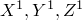）坐标值转换和旋转到全局坐标系。转换在输入后立即进行，并将应用于节点坐标系定义后输入或生成的所有节点坐标。

转换仅影响节点定义中的节点坐标输入。节点坐标系定义不能用于
- 施加载荷和边界条件——请参见["变换坐标系，"第2.1.5节"](pt01ch02s01aus09.md)；或者
- 应力、应变和单元截面力的分量输出——请参见["方向，"第2.2.5节"](pt01ch02s02aus15.md)。

除了定义节点坐标系外，您还可以在局部矩形、圆柱或球面系统中定义单独节点或节点集（参见["为节点坐标指定局部坐标系"](pt01ch02s01aus05.md#usb-int-inode-define-csys)"）。如果节点坐标系生效，并且您为特定节点或节点集定义指定了局部坐标系，则输入坐标首先根据节点定义中指定的局部系统进行转换，然后根据节点坐标系进行转换。

#### 定义节点坐标系

通过指定局部系统中三点的全局坐标来设置坐标系规范：局部系统的原点（[图2.1.1-1](pt01ch02s01aus05.md#ksystem)中的点*a*）、局部轴上的点（[图2.1.1-1](pt01ch02s01aus05.md#ksystem)中的点*b*），以及局部平面上局部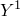轴上（或附近）的点（[图2.1.1-1](pt01ch02s01aus05.md#ksystem)中的点*c*）。

**图2.1.1-1** 节点坐标系。

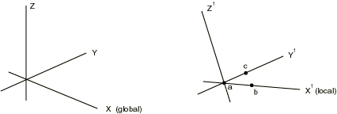

如果仅给出一个点（原点），Abaqus假定您只需要平移。如果仅给出两个点，则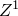轴的方向将与*Z*轴的方向相同；也就是说，轴将被投影到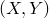平面上。

要更改生效的节点坐标系，请定义另一个节点坐标系；要恢复为全局坐标系中的输入，请使用没有关联数据的节点坐标系定义。

| **输入文件用法：** | 使用以下选项定义节点坐标系： |
| --- | --- |
|  | ``` [*SYSTEM*](../key/key-link.md#usb-kws-msystem) , , , , ,  , ,  ``` 例如，在以下输入中，节点1到3在第一个节点坐标系中定义，节点4和5在第二个节点坐标系中定义，节点6和7在全局坐标系中定义： ``` [*SYSTEM*](../key/key-link.md#usb-kws-msystem) 0, 0, 0, 5, 5, 5 [*NODE*](../key/key-link.md#usb-kws-mnode) 1, 0, 0, 1 2, 0, 0, 2 3, 0, 1, 2 [*SYSTEM*](../key/key-link.md#usb-kws-msystem) 2, 3, 4 [*NODE*](../key/key-link.md#usb-kws-mnode) 4, 0, 0, 1 5, 1, 4, 0 [*SYSTEM*](../key/key-link.md#usb-kws-msystem) [*NODE*](../key/key-link.md#usb-kws-mnode) 6, 1, 0, 1 7, 0, 4, 2 ``` |

#### 在部件定义内定义节点坐标系

当您在部件（或部件实例）定义内定义节点坐标系时，它仅在该部件（或部件实例）定义内生效。其他部件中定义的节点不受影响。

您相对于部件坐标系指定局部（）坐标值，随后可根据为实例给出的定位数据进行平移和/或旋转（参见["定义装配体，"第2.10.1节"](pt01ch02s10aus28.md)）。

### 通过指定坐标定义单独节点

您可以通过指定节点编号和定义节点的坐标来定义单独节点。Abaqus对所有节点使用右手矩形笛卡尔坐标系，但轴对称模型除外，此时必须以径向和轴向位置给出节点坐标。有关方向定义的更多信息，请参见["约定，"第1.2.2节"](pt01ch01s02aus02.md)。

在以部件实例装配体形式定义的模型中，请在部件（或部件实例）的局部坐标系中给出节点坐标。参见["定义装配体，"第2.10.1节"](pt01ch02s10aus28.md)。

| **输入文件用法：** | ``` [*NODE*](../key/key-link.md#usb-kws-mnode) ``` |
| --- | --- |

#### 从文件读取节点定义

节点定义可以从备用文件读入Abaqus。此类文件名的语法在["输入语法规则，"第1.2.1节"](pt01ch01s02aus01.md)中描述。

| **输入文件用法：** | ``` [*NODE*](../key/key-link.md#usb-kws-mnode), INPUT=*file_name* ``` |
| --- | --- |

#### 为节点坐标指定局部坐标系

您可以指定使用局部矩形笛卡尔、圆柱或球面坐标系来定义特定节点。这些坐标系如图2.1.1-2所示。

**图2.1.1-2** 坐标系。


此坐标系规范完全局部于节点定义。当读取节点数据时，坐标会立即转换为矩形笛卡尔坐标。如果节点坐标系也生效（参见["在定义节点的局部坐标系中"](pt01ch02s01aus05.md#usb-int-inode-system-option)"），则这些是由节点坐标系定义的局部矩形笛卡尔坐标，随后将转换为全局笛卡尔坐标。

| **输入文件用法：** | 使用以下选项在矩形笛卡尔系统中指定节点坐标（默认值）： |
| --- | --- |
|  | ``` [*NODE*](../key/key-link.md#usb-kws-mnode), SYSTEM=R ``` 使用以下选项在圆柱系统中指定节点坐标： ``` [*NODE*](../key/key-link.md#usb-kws-mnode), SYSTEM=C ``` 使用以下选项在球面系统中指定节点坐标： ``` [*NODE*](../key/key-link.md#usb-kws-mnode), SYSTEM=S ``` 例如，以下行在局部圆柱系统（*R*, , *Z*）中用坐标（10cos20, 10sin20, 5.）定义节点编号1： ``` [*NODE*](../key/key-link.md#usb-kws-mnode), NSET=DISC, SYSTEM=C 1, 10., 20., 5. ``` 如果在上述节点定义之前的输入文件中出现以下行，则节点1的坐标将首先转换到[*SYSTEM*](../key/key-link.md#usb-kws-msystem)选项定义的节点坐标系中的矩形笛卡尔坐标，然后转换到全局系统中的坐标： ``` [*SYSTEM*](../key/key-link.md#usb-kws-msystem) 2, 0, 2 ``` |

### 将节点分组为节点集

节点集在定义载荷、约束、属性等时用作方便的交叉引用。节点集是模型的基本引用，应使用它们来辅助输入定义。节点集的成员可以是单独节点或其他节点集。单独节点可以属于多个节点集。

节点可以在创建时分组为节点集，也可以在已经定义之后分组。在任何一种情况下，每个节点集都被分配一个名称。节点集名称最多可包含80个字符。

同一名称可以用于节点集和单元集。

默认情况下，节点集内的节点将按升序排列，并删除重复节点。这样的集合称为排序节点集。您可以选择创建非排序节点集（如后所述），这对于匹配两个或多个节点集的特性通常很有用。例如，如果您在两个节点集之间定义多点约束（["广义多点约束，"第35.2.2节"](pt08ch35s02aus130.md)），则将在集合1中的第一个节点和集合2中的第一个节点之间创建约束，然后在集合1中的第二个节点和集合2中的第二个节点之间创建约束，等等。确保以所需方式组合节点是很重要的。因此，有时最好指定节点集以未排序顺序存储。

将节点分配到节点集后，可以将其他节点添加到同一节点集；但是，不能从节点集中删除节点。

#### 创建非排序节点集

您可以选择按给出节点的顺序将节点分配到新节点集（或将节点添加到现有节点集）。节点编号不会重新排列，也不会删除重复项。

此非排序节点集将影响节点复制、节点填充、线性约束方程、多点约束以及与保留自由度关联的子结构节点。只能通过直接定义非排序节点集（如本文所述）或复制非排序节点集来创建非排序节点集。使用其他方式对节点集的任何添加或修改都将导致创建排序节点集。

| **输入文件用法：** | ``` [*NSET*](../key/key-link.md#usb-kws-mnset), NSET=*name*, UNSORTED ``` |
| --- | --- |

#### 在创建节点时将节点分配到节点集

有几种方法可以在创建节点时将节点分配到节点集。

| **输入文件用法：** | 使用以下任一选项： |
| --- | --- |
|  | ``` [*NODE*](../key/key-link.md#usb-kws-mnode), NSET=*name* [*NCOPY*](../key/key-link.md#usb-kws-mncopy), NEW SET=*name* [*NFILL*](../key/key-link.md#usb-kws-mnfill), NSET=*name* [*NGEN*](../key/key-link.md#usb-kws-mngen), NSET=*name* [*NMAP*](../key/key-link.md#usb-kws-mnmap), NSET=*name* ``` |

#### 将先前定义的节点分配到节点集

您可以通过直接列出形成集合的节点、通过生成节点集或通过从单元集生成节点集，将先前定义的节点（通过指定坐标、通过在两个边界之间填充节点或通过增量生成）分配到节点集。

##### 直接列出定义集合的节点

您可以直接列出形成节点集的节点。先前定义的节点集以及单独节点可以分配到节点集。

| **输入文件用法：** | ``` [*NSET*](../key/key-link.md#usb-kws-mnset), NSET=*name* ``` |
| --- | --- |
|  | 例如，以下行将节点1、3、10、11和集合`A11`中的所有节点添加到集合`A12`： ``` [*NSET*](../key/key-link.md#usb-kws-mnset), NSET=A12 1, 3 10, 11, A11 ``` 仅当`A11`的定义为`A12`的定义的之前，`A11`才能分配给`A12`。`A12`中的所有节点将按升序排列。如果在[*NSET*](../key/key-link.md#usb-kws-mnset)选项上包含UNSORTED参数，则`A12`将按数据行上指定的顺序包含节点。 |

##### 生成节点集

要生成节点集，必须指定第一个节点、最后一个节点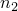以及这些节点之间节点编号的增量*i*。将从到以*i*为增量递增的所有节点添加到集合中。因此，*i*必须是一个整数，使得是一个整数（不是分数）。默认值是。

| **输入文件用法：** | ``` [*NSET*](../key/key-link.md#usb-kws-mnset), NSET=*name*, GENERATE ``` |
| --- | --- |
|  | 例如，以下行将100到120之间以10为增量的所有节点添加到集合`A13`： ``` [*NSET*](../key/key-link.md#usb-kws-mnset), NSET=A13, GENERATE 100, 120, 10 ``` |

##### 从单元集生成节点集

您可以指定先前定义的单元集的名称（["单元定义，"第2.2.1节"](pt01ch02s02aus11.md)），在这种情况下，定义此单元集中包含的单元的节点将被分配到指定的节点集。此方法只能用于定义排序节点集。

| **输入文件用法：** | ``` [*NSET*](../key/key-link.md#usb-kws-mnset), NSET=*name*, ELSET=*name* ``` |
| --- | --- |
|  | 例如，以下行将定义单元50和100的节点（节点1、2、3和4）添加到节点集`A14`： ``` [*ELEMENT*](../key/key-link.md#usb-kws-melement), TYPE=B21 50, 1, 2 100, 3, 4 [*ELSET*](../key/key-link.md#usb-kws-melset), ELSET=B1 50, 100 [*NSET*](../key/key-link.md#usb-kws-mnset), NSET=A14, ELSET=B1 ``` 单元集`B1`可以分配给节点集`A14`，因为`B1`的定义为`A14`的定义的之前。 |

##### 更新用于定义其他节点集的节点集的限制

如果节点集是从先前定义的节点集构建的，则不会考虑这些集合的后续更新。

| **输入文件用法：** | ``` [*NSET*](../key/key-link.md#usb-kws-mnset), NSET=*name* ``` |
| --- | --- |
|  | 例如，以下行将节点1和2（但不是3）添加到集合`SET-AB`，同时将节点1和3添加到集合`SET-A`： ``` [*NSET*](../key/key-link.md#usb-kws-mnset), NSET=SET-A 1, [*NSET*](../key/key-link.md#usb-kws-mnset), NSET=SET-B 2, [*NSET*](../key/key-link.md#usb-kws-mnset), NSET=SET-AB SET-A, SET-B [*NSET*](../key/key-link.md#usb-kws-mnset), NSET=SET-A 3, ``` |

#### 定义部件和装配集

在以部件实例装配体形式定义的模型中，所有节点集必须在部件、部件实例或装配定义内定义。如果在部件（或部件实例）定义内定义节点集，您可以直接引用节点编号。要定义装配级节点集，必须通过在每个节点编号前加上部件实例名称和一个"."来标识要添加到集合的节点（如["定义装配体，"第2.10.1节"](pt01ch02s10aus28.md)中所解释）。装配级节点集可以与部件级节点集具有相同的名称。

##### 示例

以下输入定义了一个属于部件`PartA`的节点集`set1`，并将由`PartA`的每个实例继承：

```
*PART, NAME=PartA
   ...
   *NSET, NSET=set1
    1,3,26,500
*END PART
```
在装配级别定义具有相同名称的节点集如下：
```
*ASSEMBLY, NAME=Assembly-1
   *INSTANCE, NAME=PartA-1, PART=PartA
    ...
   *END INSTANCE
   *INSTANCE, NAME=PartA-2, PART=PartA
    ...
   *END INSTANCE
   *NSET, NSET=set1
    PartA-1.1, PartA-1.3, PartA-1.26, PartA-1.500
    PartA-2.1, PartA-2.3, PartA-2.26, PartA-2.500
*END ASSEMBLY
```
装配级节点集`set1`包含属于部件实例`PartA-1`和`PartA-2`的节点集`set1`中的所有节点。因此，节点被分配到两个独立的节点集：一个在部件实例级别，一个在装配级别。可以创建与属于部件集的节点完全不同的装配级节点集`set1`；部件和装配级节点集是独立的。但是，由于在此示例中相同的节点被分配到部件和装配级节点集`set1`，装配级集合也可以通过以下方式定义
```
*ASSEMBLY, NAME=Assembly-1
   *INSTANCE, NAME=PartA-1, PART=PartA
    ...
   *END INSTANCE
   *INSTANCE, NAME=PartA-2, PART=PartA
    ...
   *END INSTANCE
   *NSET, NSET=set1
    PartA-1.set1, PartA-2.set1
*END ASSEMBLY
```
此节点集定义等效于前一个示例，其中节点单独列出。

##### 定义装配级节点集的替代方法

有时通过引用部件级节点集来定义装配级节点集并不方便。在这种情况下，包含许多节点的集合定义可能相当冗长。因此，提供了替代方法。

| **输入文件用法：** | ``` [*NSET*](../key/key-link.md#usb-kws-mnset), NSET=*NsetName*, INSTANCE=*InstanceName* ``` |
| --- | --- |
|  | 以下示例显示两种等效方式来定义装配级节点集；一种是通过在每个节点编号前加上部件实例名称（如上所示），另一种是使用更紧凑的INSTANCE表示法： ``` *ASSEMBLY, NAME=Assembly-1 *INSTANCE, NAME=PartA-1, PART=PartA ... *END INSTANCE *INSTANCE, NAME=PartA-2, PART=PartA ... *END INSTANCE *NSET, NSET=set2 PartA-1.11, PartA-1.12, PartA-1.13, PartA-1.14, PartA-2.21, PartA-2.22, PartA-2.23, PartA-2.24 *NSET, NSET=set3, INSTANCE=PartA-1 11, 12, 13, 14 *NSET, NSET=set3, INSTANCE=PartA-2 21, 22, 23, 24 *END ASSEMBLY ``` 当[*NSET*](../key/key-link.md#usb-kws-mnset)选项与同一名称多次使用时（如`set3`的情况），第二次使用[*NSET*](../key/key-link.md#usb-kws-mnset)中的节点将追加到第一次使用[*NSET*](../key/key-link.md#usb-kws-mnset)创建的集合中。 |

#### Abaqus/CAE创建的内部节点集

在Abaqus/CAE中，许多建模操作是通过用鼠标拾取几何来执行的。例如，可以通过拾取几何部件实例上的点来施加集中载荷。由于[*CLOAD*](../key/key-link.md#usb-kws-hcload)选项引用节点集，因此必须将此"拾取的"几何转换为输入文件中的节点集。Abaqus/CAE为这些集合分配名称并将其标记为内部。您可以使用Abaqus/CAE可视化模块中的显示组查看这些内部集合（参见[Abaqus/CAE用户指南第78章，"使用显示组显示模型的子集"](../usi/usi-link.md#uss-dgp)）。

| **输入文件用法：** | ``` [*NSET*](../key/key-link.md#usb-kws-mnset), NSET=*NsetName*, INTERNAL ``` |
| --- | --- |

### 节点集的传输

如果将Abaqus/Explicit分析的结果导入Abaqus/Standard分析（或反之），或将Abaqus/Standard分析的结果导入另一个Abaqus/Standard分析（参见["在Abaqus分析之间传输结果：概述，"第9.2.1节"](pt04ch09s02aus54.md)），默认情况下会导入原始分析中的所有节点集定义。或者，您只能导入选定的节点集定义；详见["在Abaqus分析之间传输结果：概述，"第9.2.1节"](pt04ch09s02aus54.md#usb-anl-atransferoverview-elsetnodeset)中的"导入单元集和节点集定义"。

如果从对称模型生成了三维模型（参见["对称模型生成，"第10.4.1节"](pt04ch10s04aus63.md)），原始模型中的所有节点集将用于（并扩展到）生成的模型。

### 通过增量生成从现有节点创建节点

您可以从现有节点增量生成节点。通过给出两个端节点的坐标并定义曲线类型，可以生成沿直线或曲线上的所有节点。

两个端节点必须已经定义，通常通过指定它们的坐标，但也可以通过更早的生成来定义它们。

#### 在两个端节点之间定义直线

要在两个端节点之间定义直线，请指定第一个端节点的编号、最后一个端节点的编号以及沿线的每个节点之间节点编号的增量*i*。因此，*i*必须是一个整数，使得是一个整数（不是分数）。默认值是。

| **输入文件用法：** | ``` [*NGEN*](../key/key-link.md#usb-kws-mngen) ``` |
| --- | --- |
|  | 例如，在以下输入中，节点编号1的坐标为（0., 0., 0.），节点编号6的坐标为（10., 0., 0.），并自动生成节点2、3、4和5，坐标分别为（2., 0., 0.）、（4., 0., 0.）、（6., 0., 0.）和（8., 0., 0.）： ``` [*NODE*](../key/key-link.md#usb-kws-mnode) 1, 0., 0., 0. 6, 10., 0., 0. [*NGEN*](../key/key-link.md#usb-kws-mngen) 1, 6, 1 ``` |

#### 在两个端节点之间定义圆弧

要在两个端节点之间定义圆弧，请指定第一个端节点的编号、最后一个端节点的编号以及沿弧线的每个节点之间节点编号的增量*i*。因此，*i*必须是一个整数，使得是一个整数（不是分数）。默认值是。

此外，您必须通过给出已经定义的节点的节点编号或直接给出节点坐标来指定一个额外点（圆心）的坐标。如果两者都提供，节点编号将优先于坐标。

如果直接定义坐标，可以在后面描述的局部坐标系中指定。

如果圆不能通过两点，则将调整端节点的径向坐标。180度到360度的圆弧需要更详细的定义。对于这种情况，您必须通过给出圆盘的正交来定义圆盘的平面；然后节点将根据此正交按照右手定则编号。

| **输入文件用法：** | ``` [*NGEN*](../key/key-link.md#usb-kws-mngen), LINE=C ``` |
| --- | --- |

#### 在两个端节点之间定义抛物线

要在两个端节点之间定义抛物线，请指定第一个端节点的编号、最后一个端节点的编号以及沿抛物线的每个节点之间节点编号的增量*i*。因此，*i*必须是一个整数，使得是一个整数（不是分数）。默认值是。

此外，您必须通过给出已经定义的节点的节点编号或直接给出节点坐标来指定一个额外点（两个端点之间的中点）的坐标。如果两者都提供，节点编号将优先于坐标。

如果直接定义坐标，可以在后面描述的局部坐标系中指定。

| **输入文件用法：** | ``` [*NGEN*](../key/key-link.md#usb-kws-mngen), LINE=P ``` |
| --- | --- |

#### 在局部坐标系中定义额外点和正交方向

您可以在局部矩形笛卡尔系统、圆柱系统或球面系统中指定圆或抛物线所需的额外点的坐标。这些坐标系如图2.1.1-2所示。

如果节点坐标系生效（参见["在定义节点的局部坐标系中"](pt01ch02s01aus05.md#usb-int-inode-system-option)"），则在节点定义中指定的坐标和正交方向假定在节点坐标系中。如果节点坐标系生效，并且您在局部坐标系中为圆或抛物线指定了额外点，则输入首先根据节点定义中指定的局部系统进行转换，随后根据节点坐标系进行转换。

| **输入文件用法：** | 使用以下选项在矩形笛卡尔系统中指定额外点（默认值）： |
| --- | --- |
|  | ``` [*NGEN*](../key/key-link.md#usb-kws-mngen), SYSTEM=RC ``` 使用以下选项在圆柱系统中指定额外点： ``` [*NGEN*](../key/key-link.md#usb-kws-mngen), SYSTEM=C ``` 使用以下选项在球面系统中指定额外点： ``` [*NGEN*](../key/key-link.md#usb-kws-mngen), SYSTEM=S ``` |

### 通过复制现有节点创建节点

您可以通过复制现有节点来创建新节点。新节点的坐标可以平移和旋转、从正在复制的节点反射，或者通过相对于极点节点的极投影从正在复制的节点投影。

您必须标识要复制的现有节点集，并指定一个整数常数*n*，该常数将添加到现有节点的节点编号中，以定义正在创建的节点的节点编号。

您可以将新创建的节点分配到节点集。如果您没有为新创建的节点指定节点集名称，则它们不会被分配到节点集。

| **输入文件用法：** | ``` [*NCOPY*](../key/key-link.md#usb-kws-mncopy), OLD SET=*name*, CHANGE NUMBER=*n*, NEW SET=*new_name* ``` |
| --- | --- |

#### 平移和旋转旧节点的坐标

您可以通过平移和/或旋转旧节点集中的节点来创建新节点（参见[图2.1.1-3](pt01ch02s01aus05.md#kncopy-shift)）。您可以在*X*、*Y*和*Z*方向指定平移值。

**图2.1.1-3** 现有节点的平移和旋转。


此外，您指定定义旋转轴的第一点的坐标（[图2.1.1-3](pt01ch02s01aus05.md#kncopy-shift)中的点*a*）、定义旋转轴的第二点的坐标（[图2.1.1-3](pt01ch02s01aus05.md#kncopy-shift)中的点*b*）以及绕*a*–*b*轴的旋转角度（以度为单位）。旋转可以按后面描述的方式应用多次。

如果您同时指定平移和旋转，则在旋转之前应用一次平移。

| **输入文件用法：** | ``` [*NCOPY*](../key/key-link.md#usb-kws-mncopy), OLD SET=*name*, CHANGE NUMBER=*n*, SHIFT ``` |
| --- | --- |

##### 多次应用旋转

您可以指定应应用旋转的次数*m*。例如，如果要以30度、60度和90度的角度创建节点，则设置*m*=3。创建的节点的标识符按上述方式按*n*的值顺序递增。

| **输入文件用法：** | ``` [*NCOPY*](../key/key-link.md#usb-kws-mncopy), OLD SET=*name*, CHANGE NUMBER=*n*, SHIFT, MULTIPLE=*m* ``` |
| --- | --- |

#### 反射旧节点的坐标

您可以通过沿直线、平面或点反射旧节点的坐标来创建新节点。

##### 沿直线反射坐标

要沿直线反射旧节点坐标，请指定点*a*和*b*的坐标（参见[图2.1.1-4](pt01ch02s01aus05.md#kncopy-reflect-line)）。

| **输入文件用法：** | ``` [*NCOPY*](../key/key-link.md#usb-kws-mncopy), OLD SET=*name*, CHANGE NUMBER=*n*, REFLECT=LINE ``` |
| --- | --- |

**图2.1.1-4** 沿直线的坐标反射。


##### 沿平面反射坐标

要沿平面反射旧节点坐标，请指定点*a*、*b*和*c*的坐标（参见[图2.1.1-5](pt01ch02s01aus05.md#kncopy-reflect-mirror)）。

| **输入文件用法：** | ``` [*NCOPY*](../key/key-link.md#usb-kws-mncopy), OLD SET=*name*, CHANGE NUMBER=*n*, REFLECT=MIRROR ``` |
| --- | --- |

**图2.1.1-5** 沿平面的坐标反射。


##### 沿点反射坐标

要沿点反射旧节点坐标，请指定点*a*的坐标（参见[图2.1.1-6](pt01ch02s01aus05.md#kncopy-reflect-point)）。

| **输入文件用法：** | ``` [*NCOPY*](../key/key-link.md#usb-kws-mncopy), OLD SET=*name*, CHANGE NUMBER=*n*, REFLECT=POINT ``` |
| --- | --- |

**图2.1.1-6** 沿点的坐标反射。


#### 从极点节点投影旧集合中的节点

您可以通过从极点节点投影旧集合中的节点来创建新节点。每个新节点将位于使得相应旧节点在极点节点和新节点之间等距的位置。极点节点（参见[图2.1.1-7](pt01ch02s01aus05.md#kncopy-pole)）通过给出其编号或其坐标来标识。

**图2.1.1-7** 从极点节点投影现有节点。


此方法对于创建与无限单元关联的节点特别有用（["无限单元，"第28.3.1节"](pt06ch28s03alm03.md)）。在这种情况下，极点节点应位于远场解决方案的中心。

| **输入文件用法：** | ``` [*NCOPY*](../key/key-link.md#usb-kws-mncopy), OLD SET=*name*, CHANGE NUMBER=*n*, POLE ``` |
| --- | --- |

### 通过在两个边界之间填充节点来创建节点

您可以通过在两个边界之间填充节点来创建节点。在这种情况下，您指定其成员形成边界的两个节点集、沿边界节点之间每条线的间隔数，以及从第一个边界集合端点节点编号开始的节点编号增量。

设*l*等于要在两个边界节点集之间创建的节点线数；沿每个边界节点之间每条线的间隔数由给出。

设*n*等于从第一个边界集合端点节点编号开始的节点编号增量；对于第一个边界节点集中的每个节点（），另一边界节点集中的相应节点（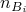）的编号必须使得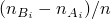是一个整数。

定义区域边界的节点集按照节点填充定义出现在输入文件中的方式使用：仅使用在节点填充定义之前已添加到集合的那些节点。排序和非排序节点集都可以使用。尚未给出坐标的节点假定位于原点（0.,0.,0.）。

通过此方法创建的节点位于两个集合中相应节点之间的直线上。如果集合具有不同数量的节点，则较长发集合中的多余节点将被忽略。默认情况下，沿线的节点间距是均匀的。

| **输入文件用法：** | ``` [*NFILL*](../key/key-link.md#usb-kws-mnfill) ``` |
| --- | --- |

#### 示例

例如，[图2.1.1-8](pt01ch02s01aus05.md#inode-nfill-3d-exa)显示了一个简单的四分之一圆柱模型。

**图2.1.1-8** 填充三维区域。


四分之一圆`INSIDEA`（节点1101–1105）、`OUTSIDEA`（节点1501–1505）、`INSIDEB`（节点6101–6105）和`OUTSIDEB`（6501–6505）已经通过直接指定坐标或增量生成来定义。该区域通过首先填充端平面并将那些平面上的节点放入集合`A`和`B`，然后使用以下选项在这些集合之间填充来填充：
```
[*NFILL*](../key/key-link.md#usb-kws-mnfill), NSET=A
INSIDEA, OUTSIDEA, 4, 100
[*NFILL*](../key/key-link.md#usb-kws-mnfill), NSET=B
INSIDEB, OUTSIDEB, 4, 100
[*NFILL*](../key/key-link.md#usb-kws-mnfill)
A, B, 5, 1000
```

#### 将节点集中到一个边界或另一个边界

您可以通过指定*b*来将节点集中到一个边界或另一个边界，*b*是沿生成的每个节点线从第一个边界节点集到第二个边界节点集时相邻节点之间距离的比率。

因此，如果*b*小于一，则节点集中到第一个边界节点集；如果*b*大于一，则节点集中到第二个边界集。*b*的值必须为正。

从第一个边界节点开始的线上的偏置间隔为*L*、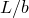、、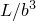、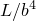、、…（其中*L*是第一个间隔的长度）。在Abaqus/Standard中，如后所述，偏置值可以在线上的每个间隔应用，也可以在线上的每第二个间隔应用。

| **输入文件用法：** | ``` [*NFILL*](../key/key-link.md#usb-kws-mnfill), BIAS=*b* ``` |
| --- | --- |

##### 示例

例如，假设[图2.1.1-9](pt01ch02s01aus05.md#inode-nfill-bias-exa)中所示的节点线已经通过其他方法生成并放入节点集`INSIDE`和`OUTSIDE`。

**图2.1.1-9** 定义偏置示例的节点集。

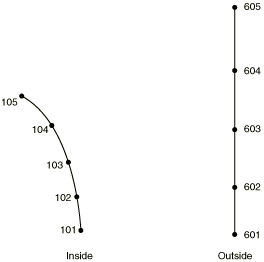

以下选项将填充如[图2.1.1-10](pt01ch02s01aus05.md#inode-nfill-bias-exa-res)所示的区域：
```
[*NFILL*](../key/key-link.md#usb-kws-mnfill), BIAS=0.6
INSIDE, OUTSIDE, 5, 100
```

**图2.1.1-10** 偏置示例的结果。

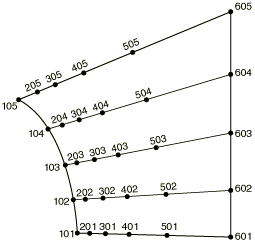

##### 在线上的每第二个间隔应用偏置值

在Abaqus/Standard中，您可以在线上的每第二个间隔应用偏置值。在这种情况下，节点将沿着线正确定位，以便与二阶单元一起使用，使得边中节点位于单元角节点的间隔中间。

从第一个边界节点开始的线上的偏置间隔为*L*、*L*、、、、、…（其中*L*是第一个间隔的长度）。

| **输入文件用法：** | ``` [*NFILL*](../key/key-link.md#usb-kws-mnfill), BIAS=*b*, TWO STEP ``` |
| --- | --- |

#### 创建四分之一节点间距

在Abaqus/Standard中，您可以为二次等参数单元的断裂力学计算创建四分之一节点间距（["断裂力学：概述，"第11.4.1节"](pt04ch11s04abo13.md)）。此间距通过将第一个节点放置在距离该点四分之一的距离处，在裂纹尖端应变场中产生平方根奇点。每条线上剩余节点的间距使得单元大小从奇点开始按距离的平方增长，边中节点正好在单元的边中。此间距为此类问题产生了合理的网格渐变；但是，对于粗糙网格，通过使裂纹单元的尺寸小于四分之一节点间距技术能做到的更小，可以获得更好的结果。

| **输入文件用法：** | ``` [*NFILL*](../key/key-link.md#usb-kws-mnfill), SINGULAR ``` |
| --- | --- |

##### 示例

[图2.1.1-11](pt01ch02s01aus05.md#inode-nfill-sing-exa-pt1)显示了一个简单的断裂力学示例。

**图2.1.1-11** 奇异问题中使用的节点填充。

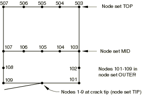

（所示网格非常粗糙，在实际情况下可能会使用更精细的网格。）顶部边缘上的节点已被放入节点集`TOP`，位于聚焦区域上端的水平线上的节点在节点集`MID`中，围绕聚焦区域的所有节点在节点集`OUTER`中，并且在裂纹尖端处有多个节点在节点集`TIP`中。使用以下选项填充如[图2.1.1-12](pt01ch02s01aus05.md#inode-nfill-sing-exa-pt2)所示的区域（注意裂纹尖端附近的四分之一节点）：
```
[*NFILL*](../key/key-link.md#usb-kws-mnfill), BIAS=0.8
MID, TOP, 4, 100
[*NFILL*](../key/key-link.md#usb-kws-mnfill), SINGULAR=1
TIP, OUTER, 5, 20
```

**图2.1.1-12** 奇异问题中使用的节点填充。


### 将一组节点从一个坐标系映射到另一个坐标系

您可以将一组节点从一个坐标系映射到另一个坐标系。您还可以使用更直接的方法（而不是坐标系映射）来旋转、平移或缩放集合中的节点。这些功能对许多几何情况很有用：网格可以相当容易地在局部坐标系中生成（例如，在圆柱表面上），然后可以映射到全局（*X*、*Y*、*Z*）系统。在其他情况下，模型的某些部分需要沿给定轴平移或旋转，或相对于一点缩放。

映射功能不能用于以部件实例装配体形式定义的模型。

提供以下不同的映射：简单缩放；简单平移和/或旋转；斜向笛卡尔；圆柱；球面；环面；以及仅在Abaqus/Standard中，混合二次。前五种映射如图2.1.1-13所示。

**图2.1.1-13** 坐标系；角度以度为单位。


混合二次映射如图2.1.1-14所示。

**图2.1.1-14** 使用混合二次映射将实体网格展开到弯曲块上。

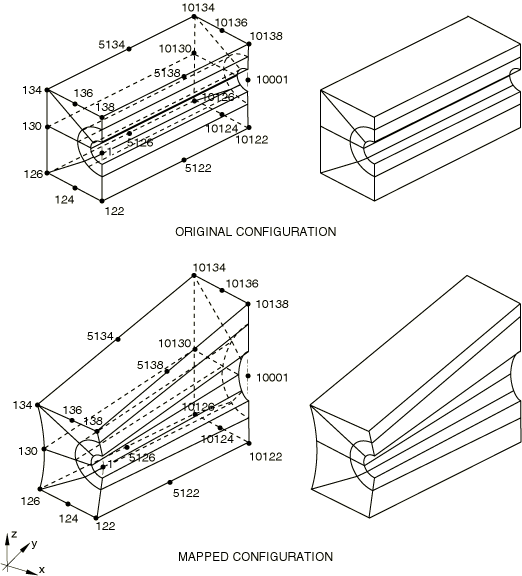

在所有情况下，集合中节点的坐标假定在局部系统中定义：每个节点处的这些局部坐标被映射定义的全局笛卡尔（*X*、*Y*、*Z*）坐标替换。所有角度坐标应以度为单位给出。

您可以使用坐标或节点编号来定义新坐标系、旋转和平移轴或用于缩放的参考点。

映射功能可以按要求在同一节点上连续使用多次。

#### 映射前缩放局部坐标

对于除混合二次映射外的所有映射，您可以指定在映射前应用于局部坐标的缩放因子。

此功能对于"拉伸"某些给定的坐标很有用。例如，在局部系统使用某些角度坐标和一些距离坐标的情况下（圆柱、球面等），可能更倾向于在角度方向使用距离测量的系统中生成网格，然后缩放到映射的角度坐标系。

有两种不同的缩放方法可用。

##### 直接指定缩放因子

缩放节点相对于局部系统原点的第一种方法是直接指定缩放因子。在这种情况下，缩放与从一个坐标系到另一个坐标系的映射同时进行。

| **输入文件用法：** | ``` [*NMAP*](../key/key-link.md#usb-kws-mnmap), NSET=*name* *first data line* *second data line* *scale factor for first local coord, scale factor for second local coord, scale factor for third local coord* ``` |
| --- | --- |

##### 相对于参考点指定缩放

或者，您可以相对于除原点以外的点进行缩放。用于缩放的参考点可以使用其坐标或用户节点编号来定义。

| **输入文件用法：** | 使用以下选项使用坐标定义缩放参考点（默认值）： |
| --- | --- |
|  | ``` [*NMAP*](../key/key-link.md#usb-kws-mnmap), TYPE=SCALE, DEFINITION=COORDINATES *X-coordinate of reference point, Y-coordinate of reference point, Z-coordinate of reference point * *scale factor for first local coord, scale factor for second local coord, scale factor for third local coord* ``` 使用以下选项使用节点编号定义缩放参考点： ``` [*NMAP*](../key/key-link.md#usb-kws-mnmap), TYPE=SCALE, DEFINITION=NODES *Local node number of the reference point* *scale factor for first local coord, scale factor for second local coord, scale factor for third local coord* ``` |

#### 通过从一个坐标系映射到另一个坐标系引入简单平移和/或旋转

对于简单平移和/或旋转的情况，[图2.1.1-13](pt01ch02s01aus05.md#knmap-coordsys)中的点*a*定义了定义映射的局部矩形坐标系的原点。局部轴由连接点*a*和点*b*的线定义。局部–平面由通过点*a*、*b*和*c*的平面定义。

| **输入文件用法：** | ``` [*NMAP*](../key/key-link.md#usb-kws-mnmap), NSET=*name*, TYPE=RECTANGULAR ``` |
| --- | --- |

#### 通过指定平移轴和幅度来引入纯平移

您可以定义纯平移（或移位）以沿所需轴按规定值移动一组节点。您必须通过提供定义此轴的坐标或两个节点编号来指定平移轴，并且必须规定平移幅度。

| **输入文件用法：** | 使用以下选项使用坐标指定平移轴（默认值）： |
| --- | --- |
|  | ``` [*NMAP*](../key/key-link.md#usb-kws-mnmap), NSET=*name*, TYPE=TRANSLATION, DEFINITION=COORDINATES ``` 使用以下选项使用节点编号指定平移轴： ``` [*NMAP*](../key/key-link.md#usb-kws-mnmap), NSET=*name*, TYPE=TRANSLATION, DEFINITION=NODES ``` |

#### 通过指定旋转轴、原点和角度来引入纯旋转

您可以通过提供旋转轴、旋转原点和旋转幅度来定义一组节点的旋转。您必须通过提供定义此轴的坐标或两个节点编号来指定旋转轴。您必须通过提供旋转原点的坐标或旋转原点处的节点编号来指定旋转原点。最后，您必须指定以度为单位的旋转角度。

| **输入文件用法：** | 使用以下选项使用坐标指定旋转轴（默认值）： |
| --- | --- |
|  | ``` [*NMAP*](../key/key-link.md#usb-kws-mnmap), NSET=*name*, TYPE=ROTATION, DEFINITION=COORDINATES ``` 使用以下选项使用节点编号指定旋转轴： ``` [*NMAP*](../key/key-link.md#usb-kws-mnmap), NSET=*name*, TYPE=ROTATION, DEFINITION=NODES ``` |

#### 从圆柱坐标映射

对于从圆柱坐标映射，[图2.1.1-13](pt01ch02s01aus05.md#knmap-coordsys)中的点*a*定义了定义映射的局部圆柱坐标系的原点。通过点*a*和点*b*的线定义了局部圆柱坐标系的轴。局部–平面（对于）由通过点*a*、*b*和*c*的平面定义。

| **输入文件用法：** | ``` [*NMAP*](../key/key-link.md#usb-kws-mnmap), NSET=*name*, TYPE=CYLINDRICAL ``` |
| --- | --- |

#### 从斜向笛卡尔坐标映射

对于从斜向笛卡尔坐标映射，[图2.1.1-13](pt01ch02s01aus05.md#knmap-coordsys)中的点*a*定义了定义映射的局部菱形坐标系的原点。通过点*a*和点*b*的线定义了局部坐标系的轴。通过点*a*和点*c*的线定义了局部坐标系的轴。通过点*a*和点*d*的线定义了局部坐标系的轴。

| **输入文件用法：** | ``` [*NMAP*](../key/key-link.md#usb-kws-mnmap), NSET=*name*, TYPE=DIAMOND ``` |
| --- | --- |

#### 从球面坐标映射

对于从球面坐标映射，[图2.1.1-13](pt01ch02s01aus05.md#knmap-coordsys)中的点*a*定义了定义映射的局部球面坐标系的原点。通过点*a*和点*b*的线定义了局部球面坐标系的极轴。通过点*a*并垂直于极轴的平面定义了平面。通过点*a*、*b*和*c*的平面定义了局部平面。

| **输入文件用法：** | ``` [*NMAP*](../key/key-link.md#usb-kws-mnmap), NSET=*name*, TYPE=SPHERICAL ``` |
| --- | --- |

#### 从环面坐标映射

对于从环面坐标映射，[图2.1.1-13](pt01ch02s01aus05.md#knmap-coordsys)中的点*a*定义了定义映射的局部环面坐标系的原点。局部环面系统的轴位于由点*a*、*b*和*c*定义的平面内。环面系统的*R*坐标由点*a*和*b*之间的距离定义。点*a*和*b*之间的线定义了位置。对于每个值，坐标在垂直于由点*a*、*b*和*c*定义的平面并垂直于环面系统轴的平面中定义。位于由点*a*、*b*和*c*定义的平面内。

| **输入文件用法：** | ``` [*NMAP*](../key/key-link.md#usb-kws-mnmap), NSET=*name*, TYPE=TOROIDAL ``` |
| --- | --- |

#### 通过混合二次进行映射

要在Abaqus/Standard中通过混合二次进行映射，您最多可以定义20个"控制节点"的新的（映射的）坐标：这些是正在映射的节点块的角和边中节点。在这种情况下，映射类似于20节点砖块等参数单元的映射。任何边中节点都可以省略，从而允许沿块该边缘的线性插值。Abaqus/Standard不检查集合中的节点是否位于由角和边中节点定义的块的物理空间内：这些控制节点简单地定义映射函数，然后应用于集合中的所有节点。

控制节点应定义一个"良好"形状的块；例如，边中节点应接近边缘的中点。否则，映射可能会非常扭曲。例如，带有四分之一点边中节点的裂纹尖端20节点单元的节点将无法正确映射，因此，不应用作控制节点。

混合映射仅适用于三维分析。

| **输入文件用法：** | ``` [*NMAP*](../key/key-link.md#usb-kws-mnmap), NSET=*name*, TYPE=BLENDED ``` |
| --- | --- |
