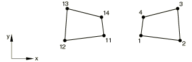

# 2.2.1 单元定义


**产品：**Abaqus/Standard  Abaqus/Explicit

##### **参考**

- [*ELCOPY*](../key/key-link.md#usb-kws-melcopy)
- [*ELEMENT*](../key/key-link.md#usb-kws-melement)
- [*ELGEN*](../key/key-link.md#usb-kws-melgen)
- [*ELSET*](../key/key-link.md#usb-kws-melset)

### 概述

本节描述在Abaqus输入文件中定义单元的方法。在Abaqus/CAE等预处理器中，您定义模型几何而不是节点和单元；当对几何进行网格划分时，预处理器会自动创建分析所需的节点和单元。虽然本节讨论的概念通常适用于Abaqus/CAE创建的输入文件中的单元定义，但此处描述的方法和技术仅在您手动创建输入文件时适用。

单元定义包括：
- 为单元分配单元编号；
- 通过指定节点来定义单独单元；
- 将单元分组为单元集；和
- 通过增量生成或复制现有单元从现有单元创建单元。

如果任何单元被指定多次，则使用最后给出的规范。

### 为单元分配单元编号

每个单独单元必须有一个称为单元编号的数值标签，在定义单元时分配该标签。单元编号必须是一个正整数，允许的最大单元编号是999999999（有关整数输入的信息，请参见["输入语法规则，"第1.2.1节"](pt01ch01s02aus01.md)）。单元不需要连续编号。

Abaqus模型可以以部件实例的装配体形式定义（参见["定义装配体，"第2.10.1节"](pt01ch02s10aus28.md)）。在这种模型中，几乎所有单元都必须属于部件或部件实例。唯一的例外是质量、旋转惯性、电容、连接器、弹簧和阻尼器单元，它们可以属于部件或装配体。单元编号在部件、部件实例或装配体内必须唯一；但它们可以在不同的部件或部件实例中重复。

### 通过指定节点定义单独单元

您可以通过指定单元编号和定义单元的节点来定义单独单元。此外，您必须指定单元类型。单元必须从[第六部分，"单元"](pt06.md)中指定的单元类型之一中选择；或者，在Abaqus/Standard中，它可以是用户定义的单元（["用户定义的单元，"第32.15.1节"](pt06ch32s15alm60.md)）或子结构（["使用子结构，"第10.1.1节"](pt04ch10s01aus58.md)）。

| **输入文件用法：** | ``` [*ELEMENT*](../key/key-link.md#usb-kws-melement), TYPE=*name* ``` |
| --- | --- |
|  | 例如，以下行创建单元编号11，它是C3D8R类型，通过定义其节点（2、3、9、7、5、8、12、16）： ``` [*ELEMENT*](../key/key-link.md#usb-kws-melement), TYPE=C3D8R 11, 2, 3, 9, 7, 5, 8, 12, 16 ``` |

#### 将大节点编号用于使用多个节点的单元

定义单元时适用以下规则：
- 每个单元的连接性被视为一个逻辑记录，可以使用任意数量的输入行来指定。Abaqus将读取单元的第一行，如果一行以逗号结尾且单元定义不完整，则将下一行视为继续行。
- 可以使用任意数量的继续行。
- 对于具有可变节点数的单元（如C3D27，参见["实体（连续体）单元，"第28.1.1节"](pt06ch28s01alm01.md)），最后一行不应以逗号结尾，否则Abaqus会将下一个单元定义解释为当前单元的继续。

例如，
```
[*ELEMENT*](../key/key-link.md#usb-kws-melement), TYPE=C3D20
100001, 100001, 100002, 100003, 100004, 100005, 100006, 100007,
100008, 100009, 100010, 100011, 100012, 100013, 100014, 100015,
100016, 100017, 100018, 100019, 100020
```

#### 从文件读取单元定义

单元定义可以从备用文件读入Abaqus。此类文件名的语法在["输入语法规则，"第1.2.1节"](pt01ch01s02aus01.md)中描述。

| **输入文件用法：** | ``` [*ELEMENT*](../key/key-link.md#usb-kws-melement), INPUT=*file_name* ``` |
| --- | --- |

#### 从子结构库读取子结构定义

子结构定义可以从子结构所在的子结构库中读取（["使用子结构，"第10.1.1节"](pt04ch10s01aus58.md)）。

| **输入文件用法：** | ``` [*ELEMENT*](../key/key-link.md#usb-kws-melement), FILE=*substructure_library_name* ``` |
| --- | --- |
|  | 如果FILE参数没有值，则使用默认子结构库名称。 |

#### 定义具有非对称变形的轴对称单元

您可以定义一个正偏移编号，用于指定具有非对称变形的轴对称单元的节点（有关具有非对称变形的轴对称单元的更多信息，请参见["选择单元的维度，"第27.1.2节"](pt06ch27s01aus111.md)；["具有非线性非对称变形的轴对称实体单元，"第28.1.7节"](pt06ch28s01ael06.md)；和["具有非线性非对称变形的轴对称壳单元，"第29.6.10节"](pt06ch29s06ael20.md)；它们仅在Abaqus/Standard中可用）。默认偏移量为100000。

| **输入文件用法：** | ``` [*ELEMENT*](../key/key-link.md#usb-kws-melement), OFFSET=*number* ``` |
| --- | --- |

#### 定义垫片单元

有几种方法可以定义垫片单元。（有关垫片单元的更多信息，请参见["垫片单元：概述，"第32.6.1节"](pt06ch32s06abo30.md)；["在模型中包含垫片单元，"第32.6.3节"](pt06ch32s06alm48.md)；和["定义垫片单元的初始几何，"第32.6.4节"](pt06ch32s06alm49.md)；它们仅在Abaqus/Standard中可用。）

在第一种方法中，您通过指定单元编号和定义单元的节点来定义单独单元。

在第二种方法中，您仅指定垫片单元底面上的节点和一个正偏移编号，该编号将用于定义顶面上的相应节点。对于18节点垫片单元，您给出前八个节点，然后是中间节点；即完整单元节点连接中的节点17。

如果两个单元面都是接触曲面的一部分，Abaqus/Standard可以自动生成18节点垫片单元的面中节点。要调用此功能，您在上述任一输入方法中输入空格而不是实际节点编号。然后Abaqus/Standard将自动生成面中节点的节点编号和坐标。

| **输入文件用法：** | 使用以下选项指定单元编号和定义单元的节点： |
| --- | --- |
|  | ``` [*ELEMENT*](../key/key-link.md#usb-kws-melement), TYPE=*name* ``` 使用以下选项指定单元底面上的节点和顶面的正偏移编号： ``` [*ELEMENT*](../key/key-link.md#usb-kws-melement), TYPE=*name*, OFFSET=*offset number* ``` |

##### 使用实体单元连接性定义垫片单元

垫片单元的节点编号方案与连续体单元的节点编号方案不对应，如果使用的网格生成器不直接支持垫片单元，或者在热应力分析中使用连续体单元对垫片单元进行热传导建模，这可能不方便。对于这种情况，您可以指定使用实体单元连接性来定义垫片单元。默认情况下，假定实体的第一个（S1）面与垫片单元的第一个（SNEG）面重合。如果等效实体单元的方向不同，请指定实体单元上对应于垫片单元第一面的面编号。实体单元必须在每个面上具有与相应垫片单元相同数量的节点；面之间的任何节点都将被忽略。18节点垫片单元是一个例外。如果两个单元面都是接触曲面的一部分，则可以使用20节点砖块单元的连接性，并且Abaqus/Standard将自动生成面中节点的节点编号和坐标。

Abaqus/Standard在读取数据后立即将实体单元连接性转换为正常垫片单元连接性。因此，对数据（`.dat`）、结果（`.fil`）和输出数据库（`.odb`）文件的所有输出都将使用正常垫片单元连接性。

| **输入文件用法：** | 使用以下选项为垫片单元指定实体单元连接性，其中实体单元的第一面对应于垫片单元的第一面： |
| --- | --- |
|  | ``` [*ELEMENT*](../key/key-link.md#usb-kws-melement), TYPE=*name*, SOLID ELEMENT NUMBERING ``` 使用以下选项为垫片单元指定实体单元连接性，以及实体单元上对应于垫片单元第一面的面： ``` [*ELEMENT*](../key/key-link.md#usb-kws-melement), TYPE=*name*, SOLID ELEMENT NUMBERING=*face number* ``` |

##### 示例

以下行创建GK3D12M单元编号11，其节点编号为1、2、3、4、5、6、1001、1002、1003、1004、1005和1006：

```
[*ELEMENT*](../key/key-link.md#usb-kws-melement), TYPE=GK3D12M
11, 1, 2, 3, 4, 5, 6, 1001, 1002, 1003, 1004, 1005, 1006
```
相同的单元连接性也可以通过以下行创建：
```
[*ELEMENT*](../key/key-link.md#usb-kws-melement), TYPE=GK3D12M, OFFSET=1000
11, 1, 2, 3, 4, 5, 6
```
等效实体单元将是C3D15，输入如下：
```
[*ELEMENT*](../key/key-link.md#usb-kws-melement), TYPE=GK3D12M, SOLID ELEMENT NUMBERING
11, 1, 2, 3, 1001, 1002, 1003, 4, 5, 6, 1004, 1005, 1006,  
501, 502, 503
```
其中节点501、502和503将不会被使用。

#### 定义内聚单元

有三种方法可以定义内聚单元。（有关内聚单元的更多信息，请参见["内聚单元：概述，"第32.5.1节"](pt06ch32s05abo29.md)；["使用内聚单元建模，"第32.5.3节"](pt06ch32s05alm42.md)；和["定义内聚单元的初始几何，"第32.5.4节"](pt06ch32s05alm43.md)。）
- 在第一种方法中，您指定单元编号和定义单元的所有节点。
- 在第二种方法中，您仅指定内聚单元底面上的节点，Abaqus将根据您指定的偏移编号创建其余节点并编号。
- 在第三种方法中（仅适用于孔隙压力内聚单元），您指定底面和顶面上的节点。Abaqus将根据您指定的偏移编号创建其余的面中节点。

##### 通过指定所有节点定义内聚单元

使用此方法，您指定定义内聚单元的所有节点。有关单元节点编号定义，请参见["二维内聚单元库，"第32.5.8节"](pt06ch32s05ael30.md)；["三维内聚单元库，"第32.5.9节"](pt06ch32s05ael31.md)；和["轴对称内聚单元库，"第32.5.10节"](pt06ch32s05ael32.md)。

| **输入文件用法：** | 使用以下选项指定单元编号和定义单元的节点： |
| --- | --- |
|  | ``` [*ELEMENT*](../key/key-link.md#usb-kws-melement), TYPE=*name* ``` 例如，以下行创建COH3D8单元编号11，其节点编号为1、2、3、4、1001、1002、1003和1004： ``` [*ELEMENT*](../key/key-link.md#usb-kws-melement), TYPE=COH3D8 11, 1, 2, 3, 4, 1001, 1002, 1003, 1004 ``` |

##### 仅通过指定底面节点定义内聚单元

使用此方法，您仅指定内聚单元底面上的节点和一个正偏移编号。对于位移内聚单元，偏移编号被添加到底面节点编号以在顶面上创建相应节点。对于孔隙压力内聚单元，偏移编号首先被添加到底面节点编号以在顶面上创建相应节点，然后偏移编号被添加到顶面节点编号以在中间面上创建相应节点。

| **输入文件用法：** | 使用以下选项指定单元底面上的节点和剩余面或多个面的节点的正偏移编号： |
| --- | --- |
|  | ``` [*ELEMENT*](../key/key-link.md#usb-kws-melement), TYPE=*name*, OFFSET=*offset number* ``` 例如，以下行创建COH3D8单元编号11，其节点编号为1、2、3、4、1001、1002、1003和1004： ``` [*ELEMENT*](../key/key-link.md#usb-kws-melement), TYPE=COH3D8, OFFSET=1000 11, 1, 2, 3, 4 ``` 以下行创建孔隙压力内聚单元COH3D8P单元编号11，其节点编号为1、2、3、4、1001、1002、1003、1004、2001、2002、2003和2004（节点1、2、3和4定义底面；节点1001、1002、1003和1004定义顶面；节点2001、2002、2003和2004定义中间面）： ``` [*ELEMENT*](../key/key-link.md#usb-kws-melement), TYPE=COH3D8P, OFFSET=1000 11, 1, 2, 3, 4 ``` |

##### 仅通过指定底面和顶面节点定义孔隙压力内聚单元

使用此方法，您仅指定孔隙压力内聚单元底面和顶面上的节点以及一个正偏移编号。偏移编号被添加到底面节点编号以在中间面上创建相应节点。

| **输入文件用法：** | 使用以下选项指定孔隙压力内聚单元的底面和顶面上的节点以及剩余中间面节点的正偏移编号： |
| --- | --- |
|  | ``` [*ELEMENT*](../key/key-link.md#usb-kws-melement), TYPE=*name*, OFFSET=*offset number* ``` 例如，以下行创建孔隙压力内聚单元COH3D8P单元编号11，其节点编号为1、2、3、4、1001、1002、1003、1004、2001、2002、2003和2004（节点1、2、3和4定义底面；节点1001、1002、1003和1004定义顶面；节点2001、2002、2003和2004定义中间面）： ``` [*ELEMENT*](../key/key-link.md#usb-kws-melement), TYPE=COH3D8P, OFFSET=2000 11, 1, 2, 3, 4, 1001, 1002, 1003, 1004 ``` |

### 将单元分组为单元集

单元集在定义载荷、属性等时用作方便的交叉引用。单元集是模型的基本引用，应使用它们来辅助输入定义。单元集的成员可以是单独单元或其他单元集。单独单元可以属于多个单元集。

单元可以在创建时分组为单元集，也可以在已经定义之后分组。在任何一种情况下，每个单元集都被分配一个名称。单元集名称最多可包含80个字符。

同一名称可以用于节点集和单元集。

单元集内的所有单元将按其单元编号的升序排列，并删除重复项。

将单元分配到单元集后，可以将其他单元添加到同一单元集；但是，不能从单元集中删除单元。

#### 在创建单元时将单元分配到单元集

有几种方法可以在创建单元时将单元分配到单元集。

| **输入文件用法：** | 使用以下任一选项： |
| --- | --- |
|  | ``` [*ELEMENT*](../key/key-link.md#usb-kws-melement), ELSET=*name* [*ELGEN*](../key/key-link.md#usb-kws-melgen), ELSET=*name* [*ELCOPY*](../key/key-link.md#usb-kws-melcopy), NEW SET=*name* ``` |

#### 将先前定义的单元分配到单元集

您可以通过直接列出形成集合的单元或通过生成单元集，将先前定义的单元（通过指定节点、通过增量生成或通过复制现有单元）分配到单元集。

##### 直接列出定义集合的单元

您可以直接列出形成单元集的单元。先前定义的单元集以及单独单元可以分配到单元集。

| **输入文件用法：** | ``` [*ELSET*](../key/key-link.md#usb-kws-melset), ELSET=*name* ``` |
| --- | --- |
|  | 例如，以下行将单元3、13和20添加到集合`LEFT`： ``` [*ELSET*](../key/key-link.md#usb-kws-melset), ELSET=LEFT 20 3, 13 ``` 以下行将单元5和16添加到现有集合`LEFT`： ``` [*ELSET*](../key/key-link.md#usb-kws-melset), ELSET=LEFT 5, 16 ** 以上数据行等同于指定5, 16, LEFT ``` 以下行将单元22、14和集合`LEFT`中的所有单元添加到集合`B`： ``` [*ELSET*](../key/key-link.md#usb-kws-melset), ELSET=B 22, 14, LEFT ``` 因此，单元集`B`包含以下单元：3、5、13、14、16、20和22。由于`LEFT`的定义为`B`的定义的之前，所以单元集`LEFT`可以分配给单元集`B`。 |

##### 生成单元集

要生成单元集，必须指定第一个单元、最后一个单元以及这些单元之间单元编号的增量*i*。将从到以*i*为增量的所有单元添加到集合中。因此，*i*必须是一个整数，使得是一个整数（不是分数）。默认值是。

| **输入文件用法：** | ``` [*ELSET*](../key/key-link.md#usb-kws-melset), ELSET=*name*, GENERATE ``` |
| --- | --- |
|  | 例如，以下行将单元1、3、5、…、19、21和单元39、49、59、…、129、139添加到集合`UP`： ``` [*ELSET*](../key/key-link.md#usb-kws-melset), ELSET=UP, GENERATE 1, 21, 2 39, 139, 10 ``` |

##### 更新用于定义其他单元集的单元集的限制

如果单元集是从先前定义的单元集构建的，则不会考虑这些集合的后续更新。

| **输入文件用法：** | ``` [*ELSET*](../key/key-link.md#usb-kws-melset), ELSET=*name* ``` |
| --- | --- |
|  | 例如，以下行将单元1和2（但不是3）添加到集合`SET-AB`，同时将单元1和3添加到集合`SET-A`： ``` [*ELSET*](../key/key-link.md#usb-kws-melset), ELSET=SET-A 1, [*ELSET*](../key/key-link.md#usb-kws-melset), ELSET=SET-B 2, [*ELSET*](../key/key-link.md#usb-kws-melset), ELSET=SET-AB SET-A, SET-B [*ELSET*](../key/key-link.md#usb-kws-melset), ELSET=SET-A 3, ``` |

#### 定义部件和装配集

在以部件实例装配体形式定义的模型中，所有单元集必须在部件、部件实例或装配定义内定义。如果在部件（或部件实例）定义内定义单元集，您可以直接引用单元编号。要定义装配级单元集，必须通过在每个单元编号前加上部件实例名称和一个"."来标识要添加到集合的单元（如["定义装配体，"第2.10.1节"](pt01ch02s10aus28.md)中所解释）。装配级单元集可以与部件级单元集具有相同的名称。

##### 示例

以下输入定义了一个属于部件`PartA`的单元集`set1`，并将由`PartA`的每个实例继承：

```
*PART, NAME=PartA
   ...
   *ELSET, ELSET=set1
    1,3,26,500
*END PART
```
在装配级别定义具有相同名称的单元集如下：
```
*ASSEMBLY, NAME=Assembly-1
   *INSTANCE, NAME=PartA-1, PART=PartA
    ...
   *END INSTANCE
   *INSTANCE, NAME=PartA-2, PART=PartA
    ...
   *END INSTANCE
   *ELSET, ELSET=set1
    PartA-1.1, PartA-1.3, PartA-1.26, PartA-1.500
    PartA-2.1, PartA-2.3, PartA-2.26, PartA-2.500
*END ASSEMBLY
```
装配级单元集`set1`包含属于部件实例`PartA-1`和`PartA-2`的单元集`set1`中的所有单元。因此，单元被分配到两个独立的单元集：一个在部件实例级别，一个在装配级别。可以创建与属于部件集的单元完全不同的装配级单元集`set1`；部件和装配级单元集是独立的。但是，由于在此示例中相同的单元被分配到部件和装配级单元集`set1`，装配级集合也可以通过以下方式定义
```
*ASSEMBLY, NAME=Assembly-1
   *INSTANCE, NAME=PartA-1, PART=PartA
    ...
   *END INSTANCE
   *INSTANCE, NAME=PartA-2, PART=PartA
    ...
   *END INSTANCE
   *ELSET, ELSET=set1
    PartA-1.set1, PartA-2.set1
*END ASSEMBLY
```
此单元集定义等效于前一个示例，其中单元单独列出。

##### 定义装配级单元集的替代方法

有时通过引用部件级单元集来定义装配级单元集并不方便。在这种情况下，包含许多单元的集合定义可能相当冗长。因此，提供了替代方法。

| **输入文件用法：** | ``` [*ELSET*](../key/key-link.md#usb-kws-melset), ELSET=*ElsetName*, INSTANCE=*InstanceName* ``` |
| --- | --- |
|  | 以下示例显示两种等效方式来定义装配级单元集；一种是通过在每个单元编号前加上部件实例名称（如上所示），另一种是使用更紧凑的INSTANCE表示法： ``` *ASSEMBLY, NAME=Assembly-1 *INSTANCE, NAME=PartA-1, PART=PartA ... *END INSTANCE *INSTANCE, NAME=PartA-2, PART=PartA ... *END INSTANCE *ELSET, ELSET=set2 PartA-1.11, PartA-1.12, PartA-1.13, PartA-1.14, PartA-2.21, PartA-2.22, PartA-2.23, PartA-2.24 *ELSET, ELSET=set3, INSTANCE=PartA-1 11, 12, 13, 14 *ELSET, ELSET=set3, INSTANCE=PartA-2 21, 22, 23, 24 *END ASSEMBLY ``` 当[*ELSET*](../key/key-link.md#usb-kws-melset)选项与同一名称多次使用时（如`set3`的情况），第二次使用[*ELSET*](../key/key-link.md#usb-kws-melset)中的单元将追加到第一次使用[*ELSET*](../key/key-link.md#usb-kws-melset)创建的集合中。 |

#### Abaqus/CAE创建的内部单元集

在Abaqus/CAE中，许多建模操作是通过用鼠标拾取几何来执行的。例如，可以通过拾取几何部件实例上的面来创建曲面。由于[*SURFACE*](../key/key-link.md#usb-kws-msurface)选项引用单元集，因此必须将此"拾取的"几何转换为输入文件中的单元集。Abaqus/CAE为这些集合分配名称并将其标记为内部。您可以使用Abaqus/CAE可视化模块中的显示组查看这些内部集合（参见[Abaqus/CAE用户指南第78章，"使用显示组显示模型的子集"](../usi/usi-link.md#uss-dgp)）。

| **输入文件用法：** | ``` [*ELSET*](../key/key-link.md#usb-kws-melset), ELSET=*ElsetName*, INTERNAL ``` |
| --- | --- |

### 单元集的传输

如果将Abaqus/Explicit分析的结果导入Abaqus/Standard分析（或反之），或将Abaqus/Standard分析的结果导入另一个Abaqus/Standard分析（参见["在Abaqus分析之间传输结果：概述，"第9.2.1节"](pt04ch09s02aus54.md)），默认情况下会导入原始分析中的所有单元集定义。或者，您只能导入选定的单元集定义；详见["在Abaqus分析之间传输结果：概述，"第9.2.1节"](pt04ch09s02aus54.md#usb-anl-atransferoverview-elsetnodeset)中的"导入单元集和节点集定义"。

如果从对称模型生成了三维模型（参见["对称模型生成，"第10.4.1节"](pt04ch10s04aus63.md)），原始模型中的所有单元集将用于（并扩展到）生成的模型。

### 通过增量生成从现有单元创建单元

您可以从现有单元增量生成单元。新创建的单元始终与主单元具有相同的单元类型。

Abaqus首先通过使用节点和单元编号中规定的增量复制给定单元的节点模式来生成一排单元。然后可以重复此行以形成一层，该层也可以重复以形成一个块。

要生成一排单元，必须指定以下信息：
- 主单元编号。主单元必须在指定生成时存在，尽管它可以是在此相同单元生成中刚刚定义的单元。
- 要在生成的第一排中定义的单元数量，包括主单元。
- 排中相应节点从单元到单元的节点编号增量。默认值是1。所有单元节点编号（除了特殊用途节点，后面讨论）将以相同的值增加。
- 排中单元编号的增量。默认值是1。

要复制此新创建的主排以创建一层单元，必须指定以下附加信息：
- 要定义的排数，包括主排。
- 排之间相应节点的节点编号增量。
- 排之间相应单元的单元编号增量。

要复制此新创建的主层以创建单元块，必须指定以下附加信息：
- 要定义的层数，包括主层。
- 层之间相应节点的节点编号增量。
- 层之间相应单元的单元编号增量。

| **输入文件用法：** | ``` [*ELGEN*](../key/key-link.md#usb-kws-melgen) ``` |
| --- | --- |
|  | 例如，[图2.2.1-1](pt01ch02s02aus11.md#ielement-elgen-exa)中所示的四分之一圆柱形成的单元可以通过以下行生成： ``` [*ELGEN*](../key/key-link.md#usb-kws-melgen) 1, 3, 1, 1, 5, 10, 10, 6, 100, 100 ``` |

#### 增量特殊用途节点

默认情况下，以下节点不会递增：
- IRS型单元和拖链单元的刚体参考节点；和
- 用于定义空间梁或框架第一横截面轴方向的节点。

您可以指定所有节点都应该递增。您如上所述定义节点编号之间的增量。通常，仅对于用于定义空间梁第一横截面轴方向的节点才需要递增所有节点。

| **输入文件用法：** | ``` [*ELGEN*](../key/key-link.md#usb-kws-melgen), ALL NODES ``` |
| --- | --- |

### 通过复制现有单元创建单元

您可以通过复制现有单元来创建新单元。您必须标识要复制的现有单元集，并指定一个整数常数，该常数将添加到现有单元的节点编号中以定义新单元的节点编号。同样，您必须指定一个整数常数，该常数将添加到现有单元的单元编号中以定义正在创建的单元的单元编号。

**图2.2.1-1** 单元生成示例。


您可以将新创建的单元分配到单元集。如果您没有为新创建的单元指定单元集名称，则它们不会被分配到单元集。

| **输入文件用法：** | ``` [*ELCOPY*](../key/key-link.md#usb-kws-melcopy), OLD SET=*name*, NEW SET=*new_name*, SHIFT NODES=*number*, ELEMENT SHIFT=*number* ``` |
| --- | --- |
|  | 例如，以下数据行将生成集合`B`中的新单元，这些单元是处理此选项时集合`A`中所有单元的副本，每个单元编号和每个节点编号都增加1000。处理该行时集合`A`的成员是所有单元生成和单元集定义行在输入文件中出现在此[*ELCOPY*](../key/key-link.md#usb-kws-melcopy)选项之前定义为集合`A`成员的那些单元。 ``` [*ELCOPY*](../key/key-link.md#usb-kws-melcopy), OLD SET=A, NEW SET=B, ELEMENT SHIFT=1000, SHIFT NODES=1000 ``` |

#### 连续体单元的特殊考虑

复制现有单元时，您可以选择修改正在创建的单元的节点编号序列，以避免创建违反Abaqus逆时针单元编号约定的连续体单元。当节点已通过复制现有节点生成时，通常需要此修改（参见"节点定义"中的"通过复制现有节点创建节点"，第2.1.1节"](pt01ch02s01aus05.md#usb-int-inode-copy)）。

| **输入文件用法：** | ``` [*ELCOPY*](../key/key-link.md#usb-kws-melcopy), REFLECT ``` |
| --- | --- |
|  | 例如，假设单元1在单元集`A`中，由节点1、2、3、4定义。以下数据行将生成单元编号11，也在集合`A`中，节点为11、14、13和12： ``` [*ELCOPY*](../key/key-link.md#usb-kws-melcopy), OLD SET=A, NEW SET=A, ELEMENT SHIFT=10, SHIFT NODES=10, REFLECT ``` 如果未使用REFLECT参数，则新单元将由节点序列11、12、13、14定义，这将违反连续体单元使用的逆时针单元编号约定（参见[图2.2.1-2](pt01ch02s02aus11.md#ielement-elcopy-reflect)）。 |

**图2.2.1-2** 节点编号序列修改示例。


