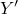

# 2.2.5 方向


**产品：**Abaqus/Standard  Abaqus/Explicit  Abaqus/CAE

##### **参考**

- [""分布定义，"第2.8.1节"](pt01ch02s08aus26.md)
- [""材料库：概述，"第21.1.1节"](pt05ch21s01abo18.md)
- [""材料数据定义，"第21.1.2节"](pt05ch21s01aus109.md)
- [""织物材料行为，"第23.4.1节"](pt05ch23s04abm35.md)
- [""分布载荷，"第34.4.3节"](pt07ch34s04aus122.md)
- [""运动耦合约束，"第35.2.3节"](pt08ch35s02aus131.md)
- [""耦合约束，"第35.3.2节"](pt08ch35s03aus133.md)
- [""惯性 relief，"第11.1.1节"](pt04ch11s01at37.md)
- [*ORIENTATION*](../key/key-link.md#usb-kws-morientation)
- [""创建基准坐标系，"Abaqus/CAE用户指南第62.9节"](../usi/usi-link.md#usi-dtm-csys)

### 概述

用户定义的方向用于为以下内容定义局部坐标系：
- 材料属性定义——例如，各向异性材料或关节材料（如果为实体单元定义了各向异性材料属性，则必须定义局部坐标系）；
- 局部材料方向定义，例如织物材料的平面填充和翘曲纱线方向或各向异性超弹性材料的纤维方向；
- 壳、膜和曲面单元中钢筋的定义；
- 旋转惯性和连接器单元的定义；
- 耦合约束的定义；
- 分布广义牵引、剪切牵引和广义边缘载荷的载荷方向定义；
- Abaqus/Standard中接触的局部切线方向定义；
- 积分点的材料计算；
- 应力、应变和单元截面力分量的输出；和
- Abaqus/Standard中惯性 relief 的刚体运动方向局部系统定义。

用户定义的方向不能用于：
- 同时使用混凝土 smeared crack 材料行为（["混凝土 smeared crack，"第23.6.1节"](pt05ch23s06abm37.md)）的Abaqus/Standard中的点；
- 指定用于定义节点坐标的局部坐标系——请参见["在定义节点的局部坐标系中"（"节点定义，"第2.1.1节"](pt01ch02s01aus05.md#usb-int-inode-system-option)），或["为节点坐标指定局部坐标系"（"节点定义，"第2.1.1节"](pt01ch02s01aus05.md#usb-int-inode-define-csys)）；或者
- 指定用于施加载荷和边界条件的局部坐标系——请参见["变换坐标系，"第2.1.5节"](pt01ch02s01aus09.md)。

由于此系统必须经常因为所建模结构的形状和构造而从点到点变化，所以局部系统的定义方式提供了相当大的通用性。您可以直接定义局部方向。Abaqus中提供的直接数据方法旨在提供足够的通用性以轻松建模大多数情况：它们对于规则几何特别有用。分布（["分布定义，"第2.8.1节"](pt01ch02s08aus26.md)）可用于为任意几何形状的实体连续体、壳和膜（Abaqus/Standard）单元直接定义空间变化的局部坐标系。

在Abaqus/Standard中，您可以选择在用户子程序[`ORIENT`](../sub/sub-link.md#sub-xsl-orient)中定义局部方向。

### 为方向分配名称

您必须为每个方向定义分配一个名称。此名称由各种功能引用方向定义。

| **输入文件用法：** | ``` [*ORIENTATION*](../key/key-link.md#usb-kws-morientation), NAME=*name* ``` |
| --- | --- |

| **Abaqus/CAE用法：** | 任何模块：****工具********基准****：**类型**：**CSYS**：选择任何方法，然后单击**确定**：**名称：** *name* |
| --- | --- |

### 在包含部件实例装配体的模型中定义局部坐标系

在以部件实例装配体形式定义的模型中，您可以在部件、部件实例或装配级别定义局部方向。在部件或部件实例级别定义的方向根据为该部件的每个实例给出的定位数据旋转。

### 直接定义局部坐标系

使用直接方法定义局部系统是一个两阶段过程。

1. 您可以在需要该局部系统的特定位置定义局部坐标系。您可以选择矩形、圆柱或球面坐标系。坐标系通过点*a*、*b*和*c*定义。您可以选择定义点*a*、*b*和*c*的方法。

2. 可选地，您可以通过将这些局部方向之一（、或）标识为旋转轴来指定附加旋转，并给出围绕该轴的旋转角度（以度为单位）。然后，局部系统绕指定轴旋转此角度。对于Abaqus/Standard中的接触曲面、壳、膜、垫片单元以及当方向与复合实体截面关联时，需要定义局部系统的此方法。

#### 可用的坐标系

提供矩形、圆柱和球面坐标系。

##### 定义矩形坐标系

矩形笛卡尔坐标系是默认值。

| **输入文件用法：** | ``` [*ORIENTATION*](../key/key-link.md#usb-kws-morientation), NAME=*name*, SYSTEM=RECTANGULAR ``` |
| --- | --- |
|  | ``` [*ORIENTATION*](../key/key-link.md#usb-kws-morientation), NAME=*name*, SYSTEM=Z RECTANGULAR ``` |

| **Abaqus/CAE用法：** | 任何模块：****工具********基准****：**类型**：**CSYS**：选择任何方法，然后单击**确定**：**矩形** |
| --- | --- |

##### 定义圆柱坐标系

| **输入文件用法：** | ``` [*ORIENTATION*](../key/key-link.md#usb-kws-morientation), NAME=*name*, SYSTEM=CYLINDRICAL ``` |
| --- | --- |

| **Abaqus/CAE用法：** | 任何模块：****工具********基准****：**类型**：**CSYS**：选择任何方法，然后单击**确定**：**圆柱** |
| --- | --- |

##### 定义球面坐标系

| **输入文件用法：** | ``` [*ORIENTATION*](../key/key-link.md#usb-kws-morientation), NAME=*name*, SYSTEM=SPHERICAL ``` |
| --- | --- |

| **Abaqus/CAE用法：** | 任何模块：****工具********基准****：**类型**：**CSYS**：选择任何方法，然后单击**确定**：**球面** |
| --- | --- |

#### 定义坐标系的方法

您可以通过直接指定点*a*、*b*和*c*的位置、通过相对于全局节点编号指定位置、通过相对于局部节点编号指定位置、通过从另一个坐标系指定偏移、或通过指定坐标系中的两条线来定义坐标系。

##### 通过直接指定点*a*、*b*和*c*的位置定义坐标系

您可以直接指定点*a*、*b*和*c*的坐标。这些坐标应该适合所选系统。

对于矩形坐标系，原点（点*c*）的默认位置是全局原点。

| **输入文件用法：** | ``` [*ORIENTATION*](../key/key-link.md#usb-kws-morientation), NAME=*name*, DEFINITION=COORDINATES ``` |
| --- | --- |

##### 通过给出点*a*、*b*和*c*的全局节点编号定义坐标系

您可以通过指定三个全局节点编号来定位点*a*、*b*和*c*。

| **输入文件用法：** | ``` [*ORIENTATION*](../key/key-link.md#usb-kws-morientation), NAME=*name*, DEFINITION=NODES ``` |
| --- | --- |

##### 通过给出点*a*、*b*和*c*的局部节点编号定义坐标系

您可以通过指定单元的局部节点编号来定位点*a*、*b*和*c*。局部节点编号是指在单元连接性中指定节点的顺序。

| **输入文件用法：** | ``` [*ORIENTATION*](../key/key-link.md#usb-kws-morientation), NAME=*name*, DEFINITION=OFFSET TO NODES ``` |
| --- | --- |

##### 通过从另一个坐标系给出偏移定义坐标系

| **输入文件用法：** | 您不能在输入文件中通过从另一个坐标系给出偏移来定义坐标系。 |
| --- | --- |

| **Abaqus/CAE用法：** | 任何模块：****工具********基准****：**类型**：**CSYS**：**从CSYS偏移** |
| --- | --- |

##### 通过给出两条边定义坐标系

您可以通过指定两条边来定义坐标系。第一条边定义*X*-或*R*-轴，*X–Y*或平面通过第二条边。

| **输入文件用法：** | 您不能在输入文件中通过给出两条边来定义坐标系。 |
| --- | --- |

| **Abaqus/CAE用法：** | 任何模块：****工具********基准****：**类型**：**CSYS**：**2条线** |
| --- | --- |

### 为各向异性超弹性材料定义局部材料方向

在建模具有基于不变量的公式的各向异性超弹性材料时（["各向异性超弹性行为"中的"基于不变量的公式"，第22.5.3节"](pt05ch22s05abm09.md#usb-mat-canisohyperelastic-invbased)），您必须定义表征每族纤维的局部方向。这些方向在初始配置中不必正交。您可以相对于材料点处的正交方向系统指定这些局部方向。最多可以将三个局部方向指定为局部方向系统定义的一部分。

| **输入文件用法：** | 使用以下选项定义正交系统和*N*个相对于该系统的局部方向： |
| --- | --- |
|  | ``` [*ORIENTATION*](../key/key-link.md#usb-kws-morientation), LOCAL DIRECTIONS=*N* ``` |

### 在Abaqus/Standard中使用用户子程序定义局部坐标系

在某些情况下，指定局部系统的最简单方法是使用用户子程序。Abaqus/Standard中提供了用户子程序[`ORIENT`](../sub/sub-link.md#sub-xsl-orient)。

| **输入文件用法：** | ``` [*ORIENTATION*](../key/key-link.md#usb-kws-morientation), NAME=*name*, SYSTEM=USER ``` |
| --- | --- |

### 大位移考虑

在大位移分析中，用户定义的方向随材料点的平均刚体运动、连接单元的第一个节点、管道-土壤相互作用单元的管道边缘、Abaqus/Standard中的接触适当曲面、或耦合约束的参考节点旋转。但是，当方向用于Abaqus/Standard中的弹簧、阻尼器或垫片单元时，局部方向始终在空间中保持固定。

### 与壳、膜或垫片单元或接触曲面一起使用

当用户定义的方向与壳、膜或垫片单元或接触曲面一起使用时，Abaqus首先旋转用户定义的局部坐标系（通过附加旋转角度），然后将方向系统投影到单元或接触曲面上。

### 使用与层合壳

有两种方法可以在层合壳的截面定义中使用用户定义的方向。

第一种是将用户定义的方向与整个复合壳截面定义关联。然后，每个层的方向角度可以相对于此截面方向给出。

第二种是为每个层单独指定方向的名称；此方法允许为不同层引用不同的方向定义。

### 使用与层合三维实体单元

当用户定义的方向与复合实体单元一起使用时，必须将三个局部方向之一标识为附加旋转轴。

### 与分布式广义牵引、剪切牵引和广义边缘载荷一起使用

用户定义的方向可用于定义分布广义牵引、剪切牵引和广义边缘载荷的载荷方向所指定的局部坐标系。

### 输出

当用户定义的方向用于单元截面定义时，应力、应变和单元截面力分量在局部系统中输出。

方向系统自动写入输出数据库。
