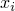

# 2.3.4 解析刚体表面定义


**产品：** Abaqus/Standard  Abaqus/Explicit  Abaqus/CAE  

##### **参考**

- ["表面：概述，" 第 2.3.1 节"](pt01ch02s03aus16.md)
- ["接触相互作用分析：概述，" 第 36.1.1 节"](pt09ch36s01abo33.md)
- ["RSURFU，" Abaqus 用户子程序参考指南第 1.1.16 节](../sub/sub-link.md#sub-rtn-ursurfu)
- [*RIGID BODY](../key/key-link.md#usb-kws-mrigidbody)
- [*SURFACE](../key/key-link.md#usb-kws-msurface)

### 概述

解析刚体表面：
- 可以是二维或三维的；
- 必须定义为模型数据；
- 可与微小滑动、小滑动或有限滑动机械接触公式一起使用；
- 应定向为解析刚体表面的外法线指向其可能接触的任何物体；以及
- 与一个节点（称为刚体参考节点）相关联，其运动控制表面的运动。

### 什么是解析刚体表面及其用途

解析刚体表面是具有可以用直线和曲线段描述的轮廓的几何表面。这些轮廓可以沿生成矢量扫掠或绕轴旋转以形成三维表面。解析刚体表面与刚体参考节点相关联，其运动控制表面的运动。解析刚体表面不贡献刚体的质量或惯性属性（请参阅 ["刚体定义，" 第 2.4.1 节"](pt01ch02s04aus22.md)）。仅当解析表面用于接触相互作用或当单元（如弹簧单元或质量单元）连接到刚体参考节点时，刚体参考节点的自由度才变为活动状态。

解析刚体表面始终是单面的，其方向通过其定义指定。因此，仅在解析刚体表面的外边界上识别接触相互作用。要对薄结构两侧的接触进行建模，请使用包裹薄结构边界的解析刚体表面。

#### 优点

使用解析刚体表面而不是定义基于单元的刚体表面在接触建模中提供了两个重要优点。
- 由于可以用曲线段参数化表面，许多弯曲几何形状可以用解析刚体表面精确建模。结果是更平滑的表面描述，这可以减少接触噪声并提供对物理接触约束的更好近似。
- 使用解析刚体表面而不是由单元面形成的刚体表面可能会降低接触算法产生的计算成本。使用曲线段而不是许多线性面元可以减少接触跟踪操作中花费的时间。由于解析表面的固有二维描述，在三维中可能会实现额外的计算节省。

#### 缺点

使用解析刚体表面进行接触建模也有一些缺点。
- 解析刚体表面必须在接触相互作用中始终作为主表面。因此，不能对两个解析刚体表面之间的接触进行建模。
- 无法在解析刚体表面上绘制接触力和压力的等值线。但是，可以在从属表面上绘制接触力和压力。
- 使用大量（数千个）段来定义解析刚体表面会降低性能。在大多数情况下，不需要使用大量段来定义解析刚体表面，因为允许使用曲线段类型。在极少数情况下需要使用大量段时，如果改用基于单元的刚体表面（请参阅 ["基于单元的表面定义，" 第 2.3.2 节"](pt01ch02s03aus17.md)），分析可能更高效。
- 解析刚体表面不贡献与其关联的刚体的质量和转动惯性属性。因此，如果需要考虑解析刚体表面上的质量分布，则必须使用质量和转动惯性单元为刚体定义等效质量和转动惯性属性，或者应使用表面的有限元离散化而不是解析刚体表面（请参阅 ["刚体定义，" 第 2.4.1 节"](pt01ch02s04aus22.md)）。
- 在 Abaqus/Explicit 中，包含解析刚体表面的刚体的反作用力输出仅针对在参考节点处处于活动状态的约束计算（例如，规定为边界条件的约束）。如果需要对应于未约束自由度的刚体上的净接触力，必须根据刚体的加速度和质量计算。

### 创建解析刚体表面

您可以定义以下类型的简单、二维或三维几何解析表面：
- 平面（二维）表面，
- 三维圆柱（扫掠）表面，以及
- 三维旋转表面。

在 Abaqus/Standard 中，如果这些表面都不合适，您可以使用用户子程序 [`RSURFU`](../sub/sub-link.md#sub-xsl-rsurfu) 定义更通用的解析表面。

解析刚体表面在表面的横截面可以由直线和曲线段表示时很有用。曲线段可以是圆弧或抛物线弧。在二维仿真中，线段在变形模型的全局坐标系中定义。在三维仿真中，必须创建局部二维坐标系，然后在该系统中定义线段。两种标准类型的三维解析刚体表面可用如图所示。

**图 2.3.4–1** 三维刚体表面示例。


您必须指示正在创建的解析表面类型（平面、圆柱或旋转）并为表面分配名称。此外，您必须通过指定解析表面名称和将控制表面运动的刚体参考节点，将解析表面定义为刚体的一部分。

Abaqus 模型可以定义为部件实例的装配（请参阅 ["定义装配，" 第 2.10.1 节"](pt01ch02s10aus28.md)）。部件只能包含一个解析表面。包含解析表面定义的部件也不能包含单元。

| **输入文件用法：** | 使用以下两个选项来创建解析刚体表面： |
| --- | --- |
|  | ``` [*SURFACE](../key/key-link.md#usb-kws-msurface), TYPE=*analytical_surface_type*, NAME=*name* [*RIGID BODY](../key/key-link.md#usb-kws-mrigidbody), ANALYTICAL SURFACE=*name*, REF NODE=*n* ``` |

| **Abaqus/CAE 用法：** | 部件模块：**创建部件**：**名称：** *analytical_rigid_part*：选择**解析刚体**作为**类型** |
| --- | --- |
|  | 然后执行以下操作之一：除 Sketch、Job 和 Visualization 外的任何模块：****工具****表面****创建****：选择 *analytical_rigid_part* 相互作用模块：**创建约束**：**刚体**：**解析表面**：**编辑**：选择 *analytical_rigid_part* 相互作用模块：**创建相互作用**：*任何有效类型*：选择 *analytical_rigid_part* 作为接触涉及的区域之一 |

#### 定义表面轮廓

表面轮廓是定义表面横截面的线段集合。表面类型决定轮廓是扫掠的（圆柱表面）、旋转的（旋转表面），还是在二维情况下按原样使用的（平面表面）。

您通过提供轮廓中每个线段的端点来构建轮廓；起点始终是前一段的端点，或者是第一段的情况，指定为起点的点。必须给出圆弧的圆心。Abaqus 只能定义小于 179.74° 的弧；因此，它将使用数据提供的较短弧（使用两个相邻弧来定义较长的弧）。对于抛物线弧，必须给出位于抛物线上且在弧内的第三点。

#### 二维刚体表面

要定义平面刚体表面，请在全局坐标系中指定形成刚体表面轮廓的线段。如果在部件内定义解析表面，请在局部部件坐标系中指定线段。

| **输入文件用法：** | ``` [*SURFACE](../key/key-link.md#usb-kws-msurface), TYPE=SEGMENTS, NAME=*name* *data lines to define the line segments forming the surface* ``` |
| --- | --- |
|  | 例如，所示二维刚体表面的定义 ``` [*SURFACE](../key/key-link.md#usb-kws-msurface), TYPE=SEGMENTS, NAME=BSURF START, ,  CIRCL, , , ,  LINE, ,  CIRCL, , , ,  [*RIGID BODY](../key/key-link.md#usb-kws-mrigidbody), ANALYTICAL SURFACE=BSURF, REF NODE=101 ``` 其中  和  是如图所示点的全局坐标。 |

| **Abaqus/CAE 用法：** | 部件模块：**创建部件**：**名称：** *analytical_rigid_part*：选择**2D 平面**或**轴对称**作为**建模空间**和**解析刚体**作为**类型** |
| --- | --- |

**图 2.3.4–2** 接触变形体的二维解析刚体表面。


#### 三维圆柱刚体表面

要不是在以部件实例定义的模型中定义圆柱刚体表面，请指定定义局部坐标系的点 *a*、*b* 和 *c*。

