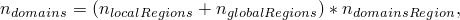
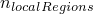
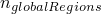
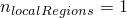

# 3.5.3 Abaqus/Explicit中的并行执行


**产品：**Abaqus/Explicit  Abaqus/CAE  

##### **参考**

- ["获取信息，" 3.2.1节](pt01ch03s02abx01.md)
- ["使用Abaqus环境设置，" 3.3.1节](pt01ch03s03aus30.md)
- ["控制作业并行执行，" Abaqus/CAE用户指南19.8.8节](../usi/usi-link.md#usi-ana-jobeditor-parallelizationbtn)

### 概述

Abaqus/Explicit中的并行执行：
- 减少需要大量增量的分析的计算时间；
- 减少包含大量节点和元素的分析的计算时间；
- 产生的分析结果与用于分析的处理器数无关；
- 可用于使用基于线程的循环级或基于线程的域分解实现的共享内存计算机；并且
- 可用于使用基于MPI的域分解并行实现的共享内存计算机和计算机集群。

### 调用并行处理

Abaqus/Explicit以两种方式实现并行化：域级和循环级。域级方法将模型分解为拓扑域，并将每个域分配给处理器。域级方法是默认方法。循环级方法并行化负责大部分计算成本的低级循环。元素、节点和接触对操作占低级并行化例程的大部分。

通过指定要使用的处理器数来调用并行化。

| **输入文件用法：** | 在命令行上输入以下内容： |
| --- | --- |
|  | **abaqus** **job**=*job-name* **cpus**=*n* 例如，以下输入将在两个处理器上运行名为"beam"的作业：``` abaqus job=beam cpus=2 ``` |

| **Abaqus/CAE用法：** | 作业模块：作业编辑器：**并行化**：切换到**使用多个处理器**，并指定处理器数*n* |
| --- | --- |

### 域级并行化

域级方法将模型分为多个拓扑域。这些域被称为并行域，以区别与分析关联的其他域。域均匀分布在可用处理器上。然后在每个域中独立执行分析。但是，由于域共享公共边界，在每个增量中必须在域之间传递信息。域级方法支持基于MPI和基于线程的并行化模式。

在初始化期间，域级方法划分模型，使结果域花费大致相同的计算费用。负载平衡定义为所有域中最昂贵进程中所有域的计算费用与所有域中最便宜进程中所有域的计算费用之比。对于表现出显著负载不平衡的情况（无论是初始负载平衡不足（静态不平衡）还是随时间发展不平衡（动态不平衡）），可以应用动态负载平衡技术（请参阅["Abaqus/Standard、Abaqus/Explicit和Abaqus/CFD执行，" 3.2.2节](pt01ch03s02abx02.md)）。动态负载平衡基于过度分解：用户选择域数，它是处理器数的倍数。在计算过程中，Abaqus/Explicit将定期测量计算费用并重新分配域上的处理器，以最小化负载不平衡。以下功能不支持动态负载平衡：
- 选择性子循环（["选择性子循环，" 11.7.1节](pt04ch11s07aus75.md)）
- 协同仿真（["协同仿真，" 17.1节](pt04ch17s01.md)）
- 使用结果文件的预定义场（["预定义场，" 34.6.1节](pt07ch34s06aus128.md)）

动态负载平衡方案的效率取决于问题固有的负载不平衡、过度分解程度和硬件效率。大多数不平衡问题在域数是处理器数2到4倍时将获得最佳性能改进。在具有慢速互连（如千兆以太网集群）的系统上，效率可能显著降低。最佳结果是在不需要外部互连时获得的，例如在集群的多核节点内或在共享内存系统上。最有可能从动态负载平衡中受益的问题是计算负载随时间强烈变化和/或空间变化的模型。包含气囊的模型是典型例子，其中接触-撞击活动高度局部化且随时间变化；以及耦合拉格朗日-欧拉问题，其中材料活动随材料在空空间中移动。

为每个域创建元素集和节点集，可以在Abaqus/CAE中检查。集合名为`domain_*n*`，其中*n*是域号。

在分析期间，创建单独的状态（`*job-name*.abq`）和选定结果（`*job-name*.sel`）文件。每个处理器将有一个状态和一个选定结果文件。命名约定是将处理器号附加到文件名。例如，状态文件名为`*job-name*.abq.*n*`，其中*n*是处理器号。分析完成时，单独的文件会自动合并为单个文件（例如，`*job-name*.abq`），并删除单独的文件。

| **输入文件用法：** | 在命令行上输入以下内容： |
| --- | --- |
|  | **abaqus** **job**=*job-name* **cpus**=*n* **parallel**=`domain` **domains**=*m* **dynamic_load_balancing** 例如，以下输入将使用域级并行化方法在两个处理器上运行名为"beam"的作业：``` abaqus job=beam cpus=2 parallel=domain domains=2 ``` 域级并行化方法也可以使用环境文件参数**parallel**=`DOMAIN`和**domains**在环境文件中设置。 |

| **Abaqus/CAE用法：** | 作业模块：作业编辑器：**并行化**：切换到**使用多个处理器**并指定处理器数*n*；**域数：***m*；切换到**激活动态负载平衡**；**并行化方法**：**域** |
| --- | --- |
|  | 当域数是处理器数的倍数时，可以激活动态负载平衡。 |

#### 结果的一致性

分析结果与用于分析的处理器数无关。但是，结果确实取决于域分解期间使用的并行域数。除非单域和多域模型由于以下讨论的尚不支持多并行域的功能而不同，否则这些差异应由有限精度效应触发。例如，节点力组装的顺序可能取决于并行域数，这可能导致计算力中尾数的差异。一些物理系统对小扰动高度敏感，因此在增量中施加的力微小差异可能导致后续增量中结果的显著差异。涉及 buckling和其他分叉的模拟往往对小扰动敏感。

要获得每次运行的持续分析结果，域分解中使用的域数应保持不变。增加域数会略微增加计算成本；因此，除非正在应用动态负载平衡，否则建议将域数设置为等于用于分析执行的最多处理器数。如果您未指定域数，则默认为处理器数。

#### 不允许域级并行化的功能

以下功能不允许使用域级并行化方法：
- 极值输出。
- 稳态检测。

如果包含这些功能，将发出错误消息。

#### 无法跨域拆分的功能

某些功能无法跨域拆分。域分解算法自动考虑这一点，并强制这些功能完全包含在一个域内。如果创建的域少于请求的处理器，Abaqus/Explicit会发出错误消息。即使算法成功创建了请求数量的域，负载也可能不平衡。如果这种行为不可接受，作业应以循环级并行化方法运行。

自适应平滑域不能跨越并行域边界。 adaptive smoothing域边界上的节点以及自适应域表面上的自适应节点不能与其他并行域共享。为在指定并行域时一致地强制执行此操作，相邻自适应平滑域共享的所有节点将被设置为非自适应。在这种情况下，分析结果可能与没有并行域的串行运行的结果显著不同。如果此行为不可取，请将并行域数设置为1，并切换到循环级并行化方法。请参阅["在Abaqus/Explicit中定义ALE自适应网格域，" 12.2.2节](pt04ch12s02aus78.md)，了解详细信息。

接触对不能跨并行域拆分，但单独的接触对不限于在同一并行域中。使用运动接触算法的接触对要求涉及表面的所有节点位于单个并行域内，并且不与其他并行域共享。使用罚接触算法的接触对要求相关节点成为单个并行域的一部分，但这些节点也可能属于其他并行域。如果很大比例的节点参与接触，则使用接触对的分析可能无法良好扩展，特别是使用运动接触约束强制时。通用接触不限制域分解边界。

具有运动约束的节点（["运动约束：概述，" 35.1.1节](pt08ch35s01abo32.md)，表面基壳-实体约束除外）将位于单个并行域内；并且不会与其他并行域共享。但是，不共享节点的两个运动约束可以放在不同的并行域中。

在某些情况下，共享节点的梁元素可能被强制进入同一并行域。这仅发生在梁重心与梁节点位置不重合的梁上，或者对于具有附加惯性的梁（请参阅["Timoshenko梁的梁截面行为添加惯性" 29.3.5节](pt06ch29s03alm10.md#usb-elm-ebeamsectionbehavior-addinertia)）。

#### 用户对域分解的影响

您可以通过指定一个或多个区域来影响域分解，这些区域被独立分解为用户指定的并行域数，或者通过指定应将元素集约束到相同的并行域。

指定域分解区域在模型计算密集的局部区域可能有用。通过将局部区域识别为独立的域分解区域，可以实现性能提升，从而在所有处理器之间分配局部区域的计算。未包含在任何用户指定的域分解区域中的模型部分也被分解为用户指定的并行域数。每个独立域分解的域均匀分布在可用处理器上，结果是过度分解。模拟的总并行域数为



其中



是标识为独立域分解区域的局部区域数；



如果任何元素未包含在标识为独立域分解区域的局部区域中，则等于1；否则为0；并且


是每个域分解区域的域数（请参阅["域级并行化"](pt01ch03s05aus34.md#usb-int-aparallelexecution-domain)）。

可能需要单独域分解区域的示例包括鸟撞击模型（其中接触-撞击活动高度局部化且随时间变化）和具有局部自适应网格细化的耦合欧拉-拉格朗日问题（其中元素细化增加了计算成本）。下面的示例（[图3.5.3-1](pt01ch03s05aus34.md#usb-int-domaindecomporig)）显示球形弹丸撞击平板（带有允许弹丸穿透板的失效模型）。其中一个域包含弹丸以及撞击区域的显著部分。将包含弹丸以及计算密集撞击区域的域分解区域指定为导致更平衡的并行处理（[图3.5.3-2](pt01ch03s05aus34.md#usb-int-domaindecompsplit)）。在此示例中，和；因此，。

**图3.5.3-1** 原始域分解。


**图3.5.3-2** 修改后的域分解。


某些建模功能无法跨域拆分，Abaqus/Explicit会自动合并包含无法拆分的功能的域分解区域。如果区域重叠，Abaqus/Explicit也会自动合并它们。

| **输入文件用法：** | 使用以下选项定义域分解区域： |
| --- | --- |
|  | ``` [*DOMAIN DECOMPOSITION](../key/key-link.md#usb-kws-mdomaindecomp), ELSET=*element_set_name* ``` 使用以下选项将元素集约束到相同的并行域：``` [*DOMAIN DECOMPOSITION](../key/key-link.md#usb-kws-mdomaindecomp) *element_set_name*, SAME DOMAIN ``` |

#### 重启

使用域级并行化时，重启有一定的限制。为确保实现最佳并行加速，用于重启分析的处理器数必须选择为使原始分析中使用的并行域可以均匀分布在处理器上。因为域分解仅基于原始分析和其中定义的步骤中指定的功能，所以影响域分解的功能被限制为仅在会令原始域分解无效时才能在重启步骤中定义。因为新添加的功能将添加到现有域，所以存在负载不平衡和相应并行性能下降的潜在可能性。

重启分析要求将在原始分析期间创建的单独状态和选定结果文件转换为单个文件，如["Abaqus/Standard、Abaqus/Explicit和Abaqus/CFD执行，" 3.2.2节](pt01ch03s02abx02.md)中所述。这应在原始分析结束时自动完成。如果原始分析未能成功完成，则必须在重启前转换状态和选定结果文件。使用域级并行化技术打包的Abaqus/Explicit分析不能以循环级并行化技术重启或继续。

#### 协同仿真

协同仿真技术（["协同仿真：概述，" 17.1.1节](pt04ch17s01abo17.md)）用于Abaqus/Explicit与Abaqus/Standard或第三方分析程序的运行时耦合，可与串行或并行运行的Abaqus/Explicit一起使用。

### 循环级并行化

循环级方法并行化代码中负责大部分计算成本的低级循环。使用循环级并行化，加速因子可能显著低于域级并行化所能实现的加速因子。加速因子将根据分析中包含的功能而变化，因为并非所有功能都利用并行循环。示例是通用接触算法和运动约束。循环级方法在超过四个处理器时可能无法良好扩展，因此不建议将此方法与多个并行域结合使用。循环级方法在Windows平台上不受支持。

此方法的结果不依赖于使用的处理器数。

| **输入文件用法：** | 在命令行上输入以下内容： |
| --- | --- |
|  | **abaqus** **job**=*job-name* **cpus**=*n* **parallel**=`loop` 循环级并行化方法也可以使用环境文件参数**parallel**=`LOOP`在环境文件中设置。 |

| **Abaqus/CAE用法：** | 作业模块：作业编辑器：**并行化**：切换到**使用多个处理器**，并指定处理器数*n*；**并行化方法：循环** |
| --- | --- |

#### 重启

使用循环级并行化时，重启步骤中定义的步骤没有限制。由于性能原因，重启时使用的处理器数必须是原始分析中使用的处理器数的因数。最常见的情况是使用与原始分析相同的处理器数进行重启。使用循环级并行化技术打包的Abaqus/Explicit分析不能以域级并行化技术重启或继续。

### 测量并行性能

并行性能通过比较在单个处理器（串行运行）上运行所需的总时间与在多个处理器（并行运行）上运行所需的总时间来衡量。这个比率称为加速因子。在完美并行化的情况下，加速因子将等于用于并行运行的处理器数。扩展性指的是加速因子随处理器数增加的行为。完美扩展性表示加速因子随处理器数线性增加。对于两种并行化方法，加速因子和扩展行为都高度依赖于问题。一般来说，域级方法将扩展到更多处理器并提供更高的加速因子。

### 输出

输出没有限制。

