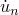
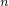

# 4.2.3 Abaqus/CFD输出变量标识符

**产品：**Abaqus/CFD  Abaqus/CAE

##### **参考**

- ["输出，" 4.1.1节](pt02ch04s01aus38.md)
- ["输出到数据和结果文件，" 4.1.2节](pt02ch04s01aus39.md)
- ["输出到输出数据库，" 4.1.3节](pt02ch04s01aus40.md)

### 概述

只能通过后处理从Abaqus/CFD获取结果。

本节中的表格列出了Abaqus/CFD中所有可用的输出变量。可以为场类型或历史类型输出请求这些输出变量，输出到输出数据库（`.odb`）文件（请参见["输出到输出数据库，" 4.1.3节](pt02ch04s01aus40.md)）。可以作为场类型或历史类型输出请求到ODB格式输出数据库的输出变量也可以SIM格式请求输出。以SIM格式请求输出的场类型变量可以在节点、元素或附着在表面上的元素面上请求。

### 输出变量描述中使用的符号

变量描述后面的`.odb` Field和`.odb` History表示输出变量的可用性。如果类别名称后面显示"yes"，则可以将输出变量写入相应的文件；"no"表示该变量对该文件不可用。

### 方向定义

方向定义取决于变量类型。

#### 元素变量的方向定义

对于元素变量，1、2和3指向全局方向（1=*X*，2=*Y*，3=*Z*）。即使在节点处定义了局部坐标系（["变换坐标系，" 2.1.5节](pt01ch02s01aus09.md)），数据仍以全局方向输出。

#### 节点变量的方向定义

对于节点变量，1、2和3指向全局方向（1=*X*，2=*Y*，3=*Z*）。即使在节点处定义了局部坐标系（["变换坐标系，" 2.1.5节](pt01ch02s01aus09.md)），数据仍以全局方向输出。

### 请求分量输出

可以在输出数据库中请求变量的各个分量作为历史类型输出，用于Abaqus/CAE中的*X–Y*绘图。场类型输出不提供单个分量请求。如果需要在Abaqus/CAE中进行等值线绘制而需要特定分量，请请求通用变量的场输出（例如，V表示速度）。然后可以在Abaqus/CAE的Visualization模块中请求此场输出的各个分量的输出。

### 元素变量

您可以请求将元素变量输出到输出数据库文件（请参见["输出到输出数据库中的元素输出，" 4.1.3节](pt02ch04s01aus40.md#usb-out-odboutput-elementoutput)）。

#### 几何量

**COORD**

实体元素质心的坐标。如果网格已移动，则为当前坐标。
.odb Field: yes    .odb History: yes    
**EVOL**

元素体积。
.odb Field: yes    .odb History: yes    

#### 状态和场变量

**DENSITY**

流体密度。
.odb Field: yes    .odb History: yes    
**DIV**

流体速度散度。
.odb Field: yes    .odb History: yes    
**PRESSURE**

流体压力。
.odb Field: yes    .odb History: yes    
**TEMP**

流体温度。
.odb Field: yes    .odb History: yes    
**V**

流体速度。
.odb Field: yes    .odb History: yes    
**VGINV2**

应变率张量（速度梯度张量的对称部分）的第二不变量。
.odb Field: yes    .odb History: no    
**VORTICITY**

速度矢量的旋度。
.odb Field: yes    .odb History: yes    
**QCRIT**

相干结构可视化器，称为Qcriteria。
.odb Field: yes    .odb History: yes    
**VISCOSITY**

元素分子粘度。
.odb Field: yes    .odb History: no    
**SHEARRATE**

使用应变率张量的第二不变量计算的剪切率。
.odb Field: yes    .odb History: no    

#### 湍流变量

**DIST**

壁面法向距离。
.odb Field: yes    .odb History: yes    
**TURBEPS**

能量耗散率。
.odb Field: yes    .odb History: yes    
**TURBKE**

湍流动能。
.odb Field: yes    .odb History: yes    
**TURBOMEGA**

比湍流动能耗散率。
.odb Field: yes    .odb History: yes    
**TURBNU**

湍流涡旋粘度。
.odb Field: yes    .odb History: yes    
**TURBVISCOSITYRATIO**

涡旋与分子粘度比。
.odb Field: yes    .odb History: yes    

### 节点变量

您可以请求将节点变量输出到输出数据库文件（请参见["输出到输出数据库中的节点输出，" 4.1.3节](pt02ch04s01aus40.md#usb-out-odboutput-nodaloutput)）。

#### 几何量

**COORD**

节点的坐标。如果网格已移动，则为当前坐标。
.odb Field: yes    .odb History: no    
**COOR*n***

坐标*n* ()。
.odb Field: yes    .odb History: no    

#### 状态和场变量

**DENSITY**

节点处的流体密度。
.odb Field: yes    .odb History: no    
**DIV**

节点处的流体速度散度。
.odb Field: yes    .odb History: no    
**PRESSURE**

节点处的流体压力。
.odb Field: yes    .odb History: no    
**TEMP**

节点处的流体温度。
.odb Field: yes    .odb History: no    
**U**

节点处的流体位移分量。
.odb Field: yes    .odb History: no    
**U*n***

流体位移分量 ()。
.odb Field: yes    .odb History: no    
**V**

节点处的流体速度分量。
.odb Field: yes    .odb History: no    
**V*n***

流体速度分量 ()。
.odb Field: yes    .odb History: no    
**QCRIT**

相干结构可视化器，称为Qcriteria。
.odb Field: yes    .odb History: no    
**VGINV2**

应变率张量（速度梯度张量的对称部分）的第二不变量。
.odb Field: yes    .odb History: no    
**VORTICITY**

节点处的旋度分量。
.odb Field: yes    .odb History: no    
**VORTICITY*n***

旋度分量 （）。
.odb Field: yes    .odb History: no    
**SHEARRATE**

使用应变率张量的第二不变量计算的节点处剪切率。
.odb Field: yes    .odb History: no    

#### 湍流变量

**DIST**

壁面法向距离。
.odb Field: yes    .odb History: no    
**TURBEPS**

能量耗散率。
.odb Field: yes    .odb History: no    
**TURBKE**

湍流动能。
.odb Field: yes    .odb History: no    
**TURBOMEGA**

比湍流动能耗散率。
.odb Field: yes    .odb History: no    
**TURBNU**

节点处的湍流涡旋粘度。
.odb Field: yes    .odb History: no    
**TURBVISCOSITYRATIO**

涡旋与分子粘度比。
.odb Field: yes    .odb History: no    

### 表面变量

您可以请求将表面变量输出到输出数据库文件（请参见["输出到输出数据库中的Abaqus/CFD表面输出，" 4.1.3节](pt02ch04s01aus40.md#usb-out-odboutput-cfdsurface)）。场输出对应于附着在表面上的元素面。

#### 几何量

**SURFAREA**

表面面积。对于变形网格，它是当前构型中的表面面积。
.odb Field: no    .odb History: yes    

#### 状态和场变量

**AVGPRESS**

面积平均表面压力。
.odb Field: no    .odb History: yes    
**AVGTEMP**

面积平均表面温度。
.odb Field: no    .odb History: yes    
**AVGVEL**

面积平均表面速度矢量。
.odb Field: no    .odb History: yes    
**FORCE**

表面上的总流体Force分量。
.odb Field: no    .odb History: yes    
**HEATFLOW**

给定表面上的综合法向热通量。如果热量添加到系统则热流为正，否则为负。此输出请求不包括对流热流。
.odb Field: no    .odb History: yes    
**HFL**

表面上的热通量矢量。此输出请求不包括对流热流。
.odb Field: yes    .odb History: no    
**HFLN**

表面上的法向热通量。此输出请求不包括对流热流。
.odb Field: yes    .odb History: no    
**MASSFLOW**

通过给定表面的综合质量流率。
.odb Field: no    .odb History: yes    
**NTRACTION**

表面上的流体法向牵引力。
.odb Field: yes    .odb History: no    
**PRESSFORCE**

给定表面上的流体压力Force。
.odb Field: no    .odb History: yes    
**STRACTION**

表面上的流体表面（或剪切）牵引力。
.odb Field: yes    .odb History: no    
**TRACTION**

表面上的流体总牵引力。它等于法向牵引力（NTRACTION）和剪切牵引力（STRACTION）之和。
.odb Field: yes    .odb History: no    
**VISCFORCE**

给定表面上的流体粘性Force。
.odb Field: no    .odb History: yes    
**VOLFLOW**

通过给定表面的综合体积流率。
.odb Field: no    .odb History: yes    
**WALLSHEAR**

表面上的流体剪切应力大小。它是剪切牵引力（STRACTION）矢量的大小。
.odb Field: yes    .odb History: no    

#### 湍流变量

**YPLUS**

以粘性长度或壁面单位测量的壁面法向距离。对于未附加壁面边界条件的表面，输出默认值为0。
.odb Field: yes    .odb History: no    
**YSTAR**

使用湍流动能和粘度缩放的壁面法向距离。仅在指定了湍流模型时可用YSTAR输出。对于未附加壁面边界条件的表面，输出默认值为0。
.odb Field: yes    .odb History: no    

### 整体和部分模型变量

以下列出的输出变量适用于模型的一部分以及整个模型。

#### 几何量

**VOL**

整个集合或整个模型的当前体积。
.odb Field: no    .odb History: yes    

#### 总能量输出量

如果以下整体模型变量与特定分析相关，您可以请求将它们输出到输出数据库文件（请参见["输出到输出数据库中的总能量输出，" 4.1.3节](pt02ch04s01aus40.md#usb-out-odboutput-energy)）。如果未指定输出区域，则计算整体模型变量。当您指定输出区域时，将在用户指定的区域上计算相关能量总和。
**ALLKE**

动能。
.odb Field: no    .odb History: yes    

