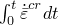
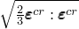

# 6.2.5 准静态分析


**产品：**Abaqus/Standard  Abaqus/CAE  


##### **参考**

- ["定义分析，" 6.1.2节](pt03ch06s01abo05.md)
- ["静态应力分析过程：概述，" 6.2.1节](pt03ch06s02abo06.md)
- [*VISCO](../key/key-link.md#usb-kws-hvisco)
- ["在Abaqus/CAE User's Guide第14.11.1节"配置常规分析过程"中配置具有时间相关材料响应的瞬态静态应力/位移分析"](../usi/usi-link.md#usi-sim-configure-visco)

### 概述

Abaqus/Standard中的准静态应力分析：
- 用于分析具有时间相关材料响应的问题（蠕变、膨胀、粘弹性和双层粘塑性）；
- 用于可以忽略惯性效应的情况；并且
- 可以是线性或非线性的。

有关在Abaqus/Explicit中执行准静态分析的信息，请参见["质量缩放，" 11.6.1节](pt04ch11s06aus74.md)和["显式动态分析，" 6.3.3节](pt03ch06s03at08.md)。有关在Abaqus/Standard中使用动态过程执行准静态分析的信息，请参见["使用直接积分的隐式动态分析，" 6.3.2节](pt03ch06s03at07.md)。

### 增量控制

在准静态分析中，您可以直接控制时间增量，或者由Abaqus/Standard自动控制。在几乎所有情况下，优选自动增量控制。

#### 固定增量控制

如果在准静态分析中直接指定时间增量，则在整个分析过程中将使用等于指定初始时间增量的固定时间增量。

| **输入文件用法：** | ``` [*VISCO](../key/key-link.md#usb-kws-hvisco) ``` |
| --- | --- |

| **Abaqus/CAE用法：** | Step模块：**Create Step**：**General**：**Visco** |
| --- | --- |

#### 自动增量控制

如果选择自动增量控制，时间增量大小受积分精度的限制。用户指定的精度容差参数限制增量期间允许的最大非弹性应变率变化：


其中*t*是增量开始时的时间，是时间增量（因此是增量结束的时间），是等效蠕变应变率。为达到精度，为精度容差参数选择的值对于蠕变问题应在量级，其中是应力中可接受的误差水平，*E*是典型弹性模量，或者对于粘弹性问题应在弹性应变数量级。

| **输入文件用法：** | ``` [*VISCO](../key/key-link.md#usb-kws-hvisco), CETOL=*tolerance* ``` |
| --- | --- |

| **Abaqus/CAE用法：** | Step模块：**Create Step**：**General**：**Visco**：**Incrementation**：**Creep/swelling/viscoelastic strain error tolerance**：*tolerance* |
| --- | --- |

##### 选择显式蠕变积分

如果非弹性应变增量小于弹性应变，则通过非弹性应变的前向差分积分可以有效地求解没有其他非线性的非线性蠕变问题（["率相关塑性：蠕变与膨胀，" 23.2.4节](pt05ch23s02abm20.md)）。此显式方法计算效率高，因为与隐式方法不同，不需要迭代。虽然此方法仅条件稳定，但显式算子的数值稳定性限制在许多情况下足够大，允许在合理数量的时间增量中发展求解。

然而，对于非常低应力水平的蠕变，期望无条件稳定的向后差分算子（隐式方法）。在这种情况下，Abaqus/Standard将自动调用隐式积分方案。

显式积分在计算上可能更便宜，并简化了用户子程序[`CREEP`](../sub/sub-link.md#sub-xsl-creep)中用户定义蠕变定律的实现；您可以限制Abaqus/Standard使用此方法处理蠕变问题（无论是否包含几何非线性）。更多详细信息请参见["率相关塑性：蠕变与膨胀，" 23.2.4节](pt05ch23s02abm20.md)。

| **输入文件用法：** | ``` [*VISCO](../key/key-link.md#usb-kws-hvisco), CETOL=*tolerance*, CREEP=EXPLICIT ``` |
| --- | --- |

| **Abaqus/CAE用法：** | Step模块：**Create Step**：**General**：**Visco**：**Incrementation**：**Creep/swelling/viscoelastic strain error tolerance**：*tolerance*和**Creep/swelling/viscoelastic integration: Explicit** |
| --- | --- |

##### 粘弹性和率相关屈服的积分方案

包含["时域粘弹性，" 22.7.1节](pt05ch22s07abm12.md)的问题始终使用无条件稳定算子积分。这些问题中的时间步长仅受上述定义的精度容差参数限制。

包含["率相关屈服，" 23.2.3节](pt05ch23s02abm19.md)和["并联流变框架，" 22.8.2节](pt05ch22s08abm15.md)的问题始终使用隐式无条件稳定方法积分。精度容差参数不限制非弹性应变率变化，可以设置为任何非零值以激活自动时间增量控制。

#### 不稳定问题

某些类型的分析可能产生局部不稳定，如表面起皱、材料不稳定或局部屈曲。在这种情况下，即使有自动增量控制的帮助，也可能无法获得准静态解。Abaqus/Standard提供通过在整个模型中施加阻尼来稳定此类问题的能力，这样引入的粘性力足够大以防止即时屈曲或坍塌，但又足够小以在问题稳定时不会显著影响行为。可用的自动稳定化方案在["求解非线性问题，" 7.1.1节中的"不稳定问题的自动稳定化"](pt03ch07s01aus49.md#usb-anl-anonlineareqns-stabilize-over)中有详细描述。

### 初始条件

可以指定应力、温度、场变量、依赖求解的状态变量等的初始值，如["Abaqus/Standard和Abaqus/Explicit中的初始条件，" 34.2.1节](pt07ch34s02aus116.md)中所述。

### 边界条件

边界条件可以施加于任何位移或转动自由度（1-6）；开口截面梁单元的翘曲自由度7；或者，如果模型中包含静水压力流体单元，则施加于流体压力自由度8。如果边界条件施加于转动自由度，您必须了解Abaqus如何处理有限转动。参见["Abaqus/Standard和Abaqus/Explicit中的边界条件，" 34.3.1节](pt07ch34s03aus118.md)。

### 载荷

在准静态分析中可以规定以下类型的加载：
- 集中节点力可以施加于位移自由度（1-6）；参见["集中载荷，" 34.4.2节](pt07ch34s04aus121.md)。
- 可以施加分布压力载荷或体力；参见["分布载荷，" 34.4.3节](pt07ch34s04aus122.md)。特定单元可用的分布载荷类型在[第六部分，"单元"](pt06.md)中描述。

### 预定义场

可以在准静态分析中指定以下预定义场，如["预定义场，" 34.6.1节](pt07ch34s06aus128.md)中所述：
- 虽然温度在准静态分析中不是自由度，但可以指定节点温度。如果为材料给出了热膨胀系数（["热膨胀，" 26.1.2节](pt05ch26s01abm52.md)），则施加温度与初始温度之间的任何差异将导致热应变。指定温度也会影响温度依赖性材料属性（如果有）。
- 可以指定用户定义场变量的值。这些值仅影响场变量依赖性材料属性（如果有）。

### 材料选项

Abaqus/Standard中的准静态过程通常用于分析准静态蠕变和膨胀问题，这些问题发生在相当长的时间周期内（["率相关塑性：蠕变与膨胀，" 23.2.4节](pt05ch23s02abm20.md)）。此过程也可用于分析粘弹性材料（["时域粘弹性，" 22.7.1节](pt05ch22s07abm12.md)和["并联流变框架，" 22.8.2节](pt05ch22s08abm15.md)）和双层粘塑性材料（["双层粘塑性，" 23.2.11节](pt05ch23s02abm27.md)）。此外，所有在静态分析过程中有效的材料模型都可以使用。

### 单元

Abaqus/Standard中任何应力/位移单元（包括具有温度或压力自由度的单元）都可用于准静态应力分析——参见["为分析类型选择适当的单元，" 27.1.3节](pt06ch27s01aus112.md)。

### 输出

除了Abaqus/Standard中常用的输出变量（参见["Abaqus/Standard输出变量标识符，" 4.2.1节](pt02ch04s02abv01.md)），还专门为蠕变问题提供以下变量：

单元积分点变量：

| CEEQ | 等效蠕变应变，。 |
| --- | --- |

| CESW | 膨胀应变幅度。 |
| --- | --- |

| CEMAG | 蠕变应变幅度，。 |
| --- | --- |

| CEP | 主蠕变应变。 |
| --- | --- |

| CE | 所有蠕变应变分量以及CEEQ、CESW和CEMAG的输出。 |
| --- | --- |

### 输入文件模板

```
[*HEADING](../key/key-link.md#usb-kws-mheading)
…
[*BOUNDARY](../key/key-link.md#usb-kws-hboundary)
*Data lines to specify zero-valued boundary conditions*
[*INITIAL CONDITIONS](../key/key-link.md#usb-kws-minitialcond)
*Data lines to specify initial conditions*
[*AMPLITUDE](../key/key-link.md#usb-kws-mamplitude)
*Data lines to define amplitude variations*
**
[*STEP](../key/key-link.md#usb-kws-hstep) (,NLGEOM)
[*VISCO](../key/key-link.md#usb-kws-hvisco), CETOL=*tolerance*
*Data line to define time incrementation and a "real" time scale*
[*BOUNDARY](../key/key-link.md#usb-kws-hboundary)
*Data lines to describe nonzero boundary conditions*
[*CLOAD](../key/key-link.md#usb-kws-hcload) and/or [*DLOAD](../key/key-link.md#usb-kws-hdload) and/or [*TEMPERATURE](../key/key-link.md#usb-kws-htemperature) and/or [*FIELD](../key/key-link.md#usb-kws-hfield)
*Data lines to specify loading*
[*END STEP](../key/key-link.md#usb-kws-hendstep)
```


