# 6.2.7 使用直接循环方法的低周疲劳分析


**产品：**Abaqus/Standard  Abaqus/CAE  


##### **参考**

- ["定义分析，" 6.1.2节](pt03ch06s01abo05.md)
- ["静态应力分析过程：概述，" 6.2.1节](pt03ch06s02abo06.md)
- ["直接循环分析，" 6.2.6节](pt03ch06s02at05.md)
- ["裂纹扩展分析，" 11.4.3节](pt04ch11s04aus69.md)
- ["低周疲劳分析中延性材料的损伤与失效，" 24.4节](pt05ch24s04.md)
- ["使用扩展有限元方法将不连续性建模为富集特征，" 10.7.1节](pt04ch10s07at36.md)
- [*DAMAGE EVOLUTION](../key/key-link.md#usb-kws-mdamageevolution)
- [*DAMAGE INITIATION](../key/key-link.md#usb-kws-mdamageinitiation)
- [*DEBOND](../key/key-link.md#usb-kws-hdebond)
- [*DIRECT CYCLIC](../key/key-link.md#usb-kws-hdirectcyclic)
- [*FRACTURE CRITERION](../key/key-link.md#usb-kws-hfracturecriterion)
- [*CONTROLS](../key/key-link.md#usb-kws-hcontrols)
- ["在Abaqus/CAE User's Guide第14.11.1节"配置常规分析过程"中配置直接循环过程"](../usi/usi-link.md#usi-sim-configure-directcyclic)

### 概述

低周疲劳分析：
- 的特征是应力状态足够高，在大多数情况下会发生非弹性变形；
- 是对承受亚临界循环载荷的结构进行的准静态分析；
- 可以与热载荷以及机械载荷相关；
- 使用直接循环方法直接获得结构的稳定循环响应；
- 基于连续损伤力学方法建模延性体材料中的渐进损伤和失效，在这种情况下，损伤起始和演化由每个稳定循环的累积非弹性滞后应变能表征；
- 基于线弹性断裂力学（LEFM）原理与扩展有限元方法，在体材料中沿任意、依赖求解的路径建模离散裂纹扩展，在这种情况下，疲劳裂纹的起始和生长由相对断裂能释放率表征；
- 建模沿层合复合材料中预定义路径在界面处的渐进分层生长，在这种情况下，界面处疲劳分层的起始和生长由相对断裂能释放率表征；
- 使用损伤外推技术加速低周疲劳分析；并且
- 假定在每个加载循环内几何线性行为和固定接触条件。

### 低周疲劳分析的方法

确定结构疲劳极限的传统方法是建立结构材料的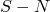曲线（载荷与失效循环次数的关系）。这种方法在许多情况下仍用作预测工程结构抗疲劳性的设计工具。然而，该技术通常过于保守，并且它没有定义循环次数与损伤程度或裂纹长度之间的关系。

另一种方法是当结构响应在许多循环后稳定时，基于非弹性应变/能量使用裂纹/损伤演化律预测疲劳寿命。因为模拟材料在许多加载循环中缓慢渐进损伤的计算成本对于除最简单模型外的所有模型来说都非常昂贵，数值疲劳寿命研究通常涉及对承受实际加载历史一小部分的结构响应进行建模。然后使用经验公式（如Coffin-Manson关系，参见[Coffin, 1954](pt03ch06s02at06.md#adirectcyclicfatigue-coffin1954)和[Manson, 1953](pt03ch06s02at06.md#adirectcyclicfatigue-manson1953)）将此响应外推到许多加载循环，以预测裂纹萌生和扩展的可能性。由于此方法基于恒定的裂纹/损伤增长率，它可能无法真实地预测裂纹或损伤的演化。

#### Abaqus/Standard中的低周疲劳分析

Abaqus/Standard中的直接循环分析能力提供了一种计算有效的建模技术，以获得承受周期加载结构的稳定响应，非常适合在大型结构上执行低周疲劳计算。该能力使用Fourier级数与非线性材料行为时间积分的组合来直接获得结构的稳定响应。使用直接循环方法获得稳定响应的理论和算法在["直接循环算法，" Abaqus Theory Guide第2.2.3节](../stm/stm-link.md#stm-anl-directcyclic)中有详细描述。

直接循环低周疲劳过程建模体材料（如电子芯片封装中的焊点或层合复合材料中的层内裂纹扩展）和材料界面（如层合复合材料中的分层）中的渐进损伤和失效。前者可以基于连续损伤力学方法或线弹性断裂力学与扩展有限元方法的原理。响应通过在加载历史沿线离散点评估结构行为获得（见图6.2.7-1）。这些点的解用于预测在下一个增量（跨越多个加载循环，）期间将发生的材料属性降解。然后使用降解的材料属性计算加载历史下一个增量的解。因此，裂纹/损伤增长率在整个分析中持续更新。

**图6.2.7–1** 弹性刚度降解作为循环次数的函数。


当在加载历史中的给定点计算稳定解时，材料点的弹性材料刚度保持恒定，接触条件保持不变。沿加载历史的每个解代表承受施加周期载荷的结构的稳定响应，每个点具有从先前解计算的材料损伤水平。此过程重复到可以进行疲劳寿命评估的加载历史点。

在体材料中，有两种建模渐进损伤和失效的方法。一种方法基于连续损伤力学。这种方法更适用于延性材料，其中循环加载导致应力反向和塑性应变累积，进而导致裂纹的萌生和扩展。损伤起始和演化由每个循环的稳定累积非弹性滞后应变能表征（如图6.2.7-2所示）。另一种方法基于线弹性断裂力学与扩展有限元方法的原理。这种方法更适用于脆性材料或具有小范围屈服的材料，其中循环加载导致材料强度降解，引起沿任意路径的疲劳裂纹扩展。裂纹的萌生和扩展由基于Paris定律的裂纹尖端正断裂能释放率表征（[Paris, 1961](pt03ch06s02at06.md#adirectcyclicfatigue-paris1961)）。

**图6.2.7–2** 直接循环分析中的塑性安定。

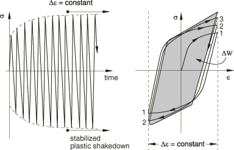

在层合复合材料的界面上，循环加载导致界面强度降解，引起疲劳分层扩展。分层的萌生和扩展也由基于Paris定律的裂纹尖端正断裂能释放率表征（[Paris, 1961](pt03ch06s02at06.md#adirectcyclicfatigue-paris1961)）。

体材料中的渐进损伤机制和界面处的渐进分层生长机制可以同时考虑，失效首先发生在模型中最弱的环节。

使用直接循环方法定义低周疲劳分析类似于定义直接循环分析。有关如何指定Fourier项数、迭代次数和增量大小的详细信息，请参见["直接循环分析，" 6.2.6节](pt03ch06s02at05.md)。当您定义低周疲劳分析步骤时，指定最大循环次数，。

| **输入文件用法：** | ``` [*DIRECT CYCLIC](../key/key-link.md#usb-kws-hdirectcyclic), FATIGUE *first data line* , ,  ``` |
| --- | --- |

| **Abaqus/CAE用法：** | Step模块：**Create Step**：**General**：**Direct cyclic**；**Fatigue:** **Include low-cycle fatigue analysis**，**Maximum number of cycles:** **Value:**  |
| --- | --- |

#### 确定是否使用前一步骤的Fourier系数

使用直接循环方法的低周疲劳步骤可以是分析中的唯一步骤，可以跟随常规或线性扰动步骤，或者可以被常规或线性扰动步骤跟随。可以在单个分析中包含多个低周疲劳分析步骤。在这种情况下，前一步骤中获得Fourier级数系数可用作当前步骤的起始值。默认情况下，Fourier系数被重置为零，从而允许施加与先前低周疲劳步骤中定义的非常不同的循环载荷条件。

与直接循环分析一样，您可以指定重新启动分析中的低周疲劳步骤应使用前一步骤的Fourier系数，从而允许继续分析以模拟更多加载循环。在低周疲劳分析中，在稳定循环结束时写入重新启动文件。因此，作为先前低周疲劳分析的继续的重新启动分析将从开始新的加载循环（参见["重新启动分析，" 9.1.1节](pt04ch09s01aus53.md)）。

| **输入文件用法：** | 使用以下选项指定当前步骤是使用直接循环方法的先前低周疲劳步骤的继续： |
| --- | --- |
|  | ``` [*DIRECT CYCLIC](../key/key-link.md#usb-kws-hdirectcyclic), FATIGUE, CONTINUE=YES ``` 使用以下选项将Fourier级数系数重置为零：``` [*DIRECT CYCLIC](../key/key-link.md#usb-kws-hdirectcyclic), FATIGUE, CONTINUE=NO (default) ``` |

| **Abaqus/CAE用法：** | 使用以下选项指定当前步骤是使用直接循环方法的先前低周疲劳步骤的继续： |
| --- | --- |
|  | Step模块：**Create Step**：**General**：**Direct cyclic**；**Basic:** **Use displacement Fourier coefficients from previous direct cyclic step**；**Fatigue:** **Include low-cycle fatigue analysis** 使用以下选项将Fourier级数系数重置为零：Step模块：**Create Step**：**General**：**Direct cyclic**；**Fatigue:** **Include low-cycle fatigue analysis** |

### 基于连续损伤力学方法的延性体材料中的渐进损伤和损伤外推

Abaqus/Standard中的低周疲劳分析允许对任何响应基于连续体本构模型定义的材料的延性材料进行渐进损伤和失效建模（["材料库：概述，" 21.1.1节](pt05ch21s01abo18.md)）。这包括使用连续方法建模的内聚单元（["使用连续方法定义内聚单元本构响应"中的"有限厚度粘附层建模，" 32.5.5节](pt06ch32s05alm44.md#usb-elm-ecohesivematbehavior-continuum)）。材料点的非弹性定义必须与线性弹性材料模型（["线弹性行为，" 22.2.1节](pt05ch22s02abm02.md)）、多孔弹性材料模型（["多孔材料的弹性行为，" 22.3.1节](pt05ch22s03abm05.md)）或次弹性材料模型（["次弹性行为，" 22.4.1节](pt05ch22s04abm06.md)）结合使用。

损伤萌生后，弹性材料刚度在每个循环中基于累积稳定非弹性滞后能量逐渐降解（如图6.2.7-1所示）。对于低周疲劳分析执行逐循环模拟是不切实际且计算昂贵的；相反，为了加速低周疲劳分析，每个增量将当前体材料中的损伤状态向前外推多个循环，到当前加载循环稳定后的新损伤状态。

#### 损伤起始和演化

损伤起始指的是材料点响应开始降解。在低周疲劳分析中，损伤起始准则由每个循环的累积非弹性滞后能量，表征。和材料常数用于确定损伤萌生的循环数，。在稳定加载循环结束时，，Abaqus/Standard检查任何材料点是否满足损伤起始准则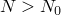；除非满足此准则，否则材料点的材料刚度不会被降解。与损伤起始相关的计算和输出在["低周疲劳中延性材料的损伤起始，" 24.4.2节](pt05ch24s04abm48.md)中有详细讨论。

一旦材料点满足损伤起始准则，损伤状态基于稳定循环的非弹性滞后能量计算和更新。Abaqus/Standard假设弹性刚度的降解可以使用标量损伤变量建模。材料点每个循环的损伤率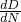基于累积非弹性滞后能量、积分点相关的特征长度和材料常数计算。详情请参见["低周疲劳中延性材料的损伤演化，" 24.4.3节](pt05ch24s04abm49.md)。

通常，当时，材料完全失去其承载能力。如果元素所有积分位置的所有截面点都失去了承载能力，您可以从网格中移除该元素。

#### 体材料中的损伤外推技术

如果在稳定循环结束时任何材料点满足损伤起始准则，，Abaqus/Standard将损伤变量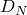从当前循环向前外推到多个循环，的新增量。新损伤状态，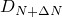，由下式给出：

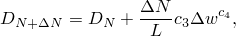

其中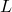是积分点相关的特征长度，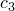和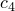是材料常数（更多信息请参见["低周疲劳中延性材料的损伤演化，" 24.4.3节](pt05ch24s04abm49.md)）。

您可以指定在任何给定增量中损伤向前外推的最小（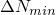）和最大（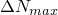）循环数。默认值分别为100和1000。

| **输入文件用法：** | ``` [*DIRECT CYCLIC](../key/key-link.md#usb-kws-hdirectcyclic), FATIGUE *first data line* ,  ``` |
| --- | --- |

| **Abaqus/CAE用法：** | Step模块：**Create Step**：**General**：**Direct cyclic**；**Fatigue:** **Include low-cycle fatigue analysis**，**Cycle increment size:** **Minimum:** ，**Maximum:**  |
| --- | --- |

### 基于线弹性断裂力学与扩展有限元方法的原理沿任意路径的离散裂纹扩展

Abaqus/Standard中的低周疲劳分析允许基于线弹性断裂力学与扩展有限元方法的原理沿任意路径建模离散裂纹扩展。您通过在富集单元中定义基于断裂的表面行为和指定断裂准则来完成裂纹扩展能力的定义。富集单元中裂纹尖端的断裂能释放率基于改进虚拟裂纹闭合技术（VCCT）计算。VCCT使用线弹性断裂力学原理。因此，VCCT适用于脆性疲劳裂纹扩展发生的问题，尽管体材料中可能发生非线性材料变形。有关在富集单元中定义断裂准则和VCCT的更多信息，请参见["使用扩展有限元方法将不连续性建模为富集特征，" 10.7.1节](pt04ch10s07at36.md)。

为加速低周疲劳分析，使用损伤外推技术，在每个稳定循环后将裂纹推进至少一个元素长度。

#### 疲劳裂纹的萌生和扩展

富集单元中疲劳裂纹的萌生和扩展通过使用Paris定律表征，它将相对断裂能释放率，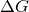与裂纹扩展率联系起来。必须满足两个准则才能萌生疲劳裂纹扩展：一个准则基于材料常数，和当前循环数，；另一个准则基于最大断裂能释放率，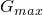，对应于结构加载到其最大值时的循环能量释放率。一旦富集单元满足疲劳裂纹萌生准则，裂纹扩展率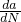是基于材料常数和的分段函数（Paris定律）。疲劳裂纹萌生和扩展的准则在["使用扩展有限元方法将不连续性建模为富集特征，" 10.7.1节](pt04ch10s07at36.md)中有详细讨论。

#### 损伤外推技术

如果在稳定循环结束时富集单元中任何裂纹尖端满足裂纹萌生准则，，Abaqus/Standard通过在裂纹尖端前方断裂至少一个富集单元，将裂纹长度从当前循环向前扩展多个循环，，到。给定材料常数和（如["使用扩展有限元方法将不连续性建模为富集特征，" 10.7.1节](pt04ch10s07at36.md)中所定义），结合裂纹尖端前方富集单元的已知元素长度和可能的扩展方向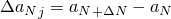，可以计算裂纹尖端前方每个富集单元失效所需的循环数为，其中表示个裂纹尖端前方的富集单元。分析被设置为在加载循环稳定后每个增量至少推进一个富集单元的裂纹。具有最少循环数的元素被识别为断裂，其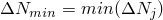表示裂纹扩展等于其元素长度所需的循环数。最关键的元素在稳定循环结束时具有零约束和裂纹表面零刚度完全断裂。当富集单元断裂时，载荷被重新分配，必须为下一个循环计算裂纹尖端前方富集单元的新相对断裂能释放率。此能力允许在每个稳定循环后断裂裂纹尖端前方至少一个富集单元，并精确计算导致疲劳裂纹扩展该长度所需的循环数。

### 沿预定义路径在界面处的渐进分层生长

Abaqus/Standard中的低周疲劳分析还允许建模层合复合材料界面处沿预定义路径的渐进分层生长。必须使用断裂准则定义在模型中指示分层（或裂纹）传播的界面。界面单元中裂纹尖端的断裂能释放率基于虚拟裂纹闭合技术（VCCT）计算。VCCT使用线弹性断裂力学原理。因此，VCCT适用于沿预定义表面发生脆性疲劳分层生长的问题，尽管体材料中可能发生非线性材料变形。有关定义断裂准则和VCCT的更多信息，请参见["裂纹扩展分析，" 11.4.3节](pt04ch11s04aus69.md)。

为加速低周疲劳分析，使用损伤外推技术，在每个稳定循环后在界面处裂纹尖端释放至少一个元素长度。当分析中同时考虑界面处的脆性疲劳分层和体材料中的延性损伤或离散裂纹扩展时，失效首先发生在最弱的环节。

#### 疲劳分层的萌生和扩展

在定义裂纹界面处疲劳分层的萌生和扩展通过使用Paris定律表征，它将相对断裂能释放率，与裂纹扩展率联系起来。必须满足两个准则才能萌生疲劳分层扩展：一个准则基于材料常数，和当前循环数，；另一个准则基于最大断裂能释放率，，对应于结构加载到其最大值时的循环能量释放率。一旦界面处满足分层萌生准则，分层扩展率是基于材料常数和的分段函数（Paris定律）。疲劳分层萌生和扩展的准则在["裂纹扩展分析，" 11.4.3节中的"低周疲劳准则"](pt04ch11s04aus69.md#usb-anl-acrackpropagation-fatigue)中有详细讨论。

#### 界面单元处的损伤外推技术

如果在稳定循环结束时界面中任何裂纹尖端满足分层萌生准则，，Abaqus/Standard通过在界面处释放至少一个单元，将裂纹长度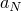从当前循环向前扩展多个循环，，到。给定材料常数和（如["裂纹扩展分析，" 11.4.3节中的"低周疲劳准则"](pt04ch11s04aus69.md#usb-anl-acrackpropagation-fatigue)中所定义），结合裂纹尖端界面单元的已知节点间距，可以计算裂纹尖端处每个界面单元失效所需的循环数为，其中*j*表示第*j*个裂纹尖端的节点。分析被设置为在加载循环稳定后每个增量至少释放一个界面单元。具有最少循环数的元素被识别为释放，其表示裂纹扩展等于其元素长度所需的循环数。最关键的元素在稳定循环结束时具有零约束和零刚度完全释放。当界面单元被释放时，载荷被重新分配，必须为下一个循环计算裂纹尖端处界面单元的新相对断裂能释放率。此能力允许在每个稳定循环后释放裂纹尖端处至少一个界面单元，并精确计算导致疲劳裂纹扩展该长度所需的循环数。

### 控制求解精度

低周疲劳分析使用直接循环方法，通过将Fourier级数近似与使用修正Newton方法的非线性材料行为时间积分相结合，迭代获得稳定循环解。算法的准确性取决于所使用的Fourier项数、为获得稳定解而进行的迭代次数，以及在载荷周期内评估材料响应和残差向量的时间点数。控制直接循环分析求解精度的一些方法在["直接循环分析，" 6.2.6节](pt03ch06s02at05.md)中有详细描述。它们在使用直接循环方法的低周疲劳分析中都保持有效。此外，低周疲劳分析的准确性取决于损伤向前外推的循环数，如下所述。

#### 控制使用连续损伤力学方法时体材料中损伤外推的准确性

为加速低周疲劳分析，在稳定循环结束时使用损伤外推技术。除了指定损伤向前外推的最小和最大循环数（参见上面["体材料中的损伤外推技术"](pt03ch06s02at06.md#usb-anl-adirectcyclicfatigue-bulkextrap)），您可以指定损伤外推容差，，以控制体材料中损伤外推的准确性。默认值为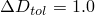。

| **输入文件用法：** | 使用以下选项指定损伤外推容差： |
| --- | --- |
|  | ``` [*DIRECT CYCLIC](../key/key-link.md#usb-kws-hdirectcyclic), FATIGUE *first data line* , , ,  ``` |

| **Abaqus/CAE用法：** | Step模块：**Create Step**：**General**：**Direct cyclic**；**Fatigue:** **Include low-cycle fatigue analysis**，**Damage extrapolation tolerance:**  |
| --- | --- |

##### 确定损伤向前外推的增量

Abaqus/Standard使用自适应算法来确定每个增量中损伤向前外推的循环数。默认情况下，Abaqus/Standard从500个循环开始（最大循环数增量的默认值的一半），并基于

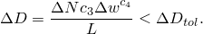

确定任何材料点的最大损伤增量

如果最大损伤增量，，大于您指定的损伤外推容差，则相应减少损伤向前外推的循环数，以确保最大损伤增量小于损伤外推容差。另一方面，如果所有材料点的最大损伤增量小于您指定的损伤外推容差的一半，则相应增加循环数，以确保最大损伤增量等于损伤外推容差。

### 初始条件

可以指定应力，温度、场变量、依赖求解的状态变量等的初始值（参见["Abaqus/Standard和Abaqus/Explicit中的初始条件，" 34.2.1节](pt07ch34s02aus116.md)）。

### 边界条件

边界条件可以施加于任何位移或转动自由度。在分析期间，规定的边界条件必须具有在步骤上循环的幅值定义：起始值必须等于结束值（参见["幅值曲线，" 34.1.2节](pt07ch34s01aus115.md)）。如果分析由多个步骤组成，则适用通常的规则（参见["Abaqus/Standard和Abaqus/Explicit中的边界条件，" 34.3.1节](pt07ch34s03aus118.md)）。在每个新步骤中，边界条件可以修改或完全定义。除非重新定义，否则先前步骤中定义的所有边界条件保持不变。

### 载荷

可以使用直接循环方法的低周疲劳分析中规定以下载荷：
- 集中节点力可以施加于位移自由度（1-6）；参见["集中载荷，" 34.4.2节](pt07ch34s04aus121.md)。
- 可以施加分布压力载荷或体力；参见["分布载荷，" 34.4.3节](pt07ch34s04aus122.md)。特定单元可用的分布载荷类型在[第六部分，"单元"](pt06.md)中描述。

在分析期间，每个载荷必须具有在步骤上循环的幅值定义：起始值必须等于结束值（参见["幅值曲线，" 34.1.2节](pt07ch34s01aus115.md)）。如果分析由多个步骤组成，则适用通常的规则（参见["应用载荷：概述，" 34.4.1节](pt07ch34s04aus120.md)）。在每个新步骤中，加载可以修改或完全定义。除非重新定义，否则先前步骤中定义的所有载荷保持不变。

### 预定义场

可以使用直接循环方法的低周疲劳分析中规定以下预定义场，如["预定义场，" 34.6.1节](pt07ch34s06aus128.md)中所述：
- 温度在使用直接循环方法的低周疲劳分析中不是自由度，但可以将节点温度指定为预定义场。指定的温度值必须在步骤上循环：起始值必须等于结束值（参见["幅值曲线，" 34.1.2节](pt07ch34s01aus115.md)）。如果从结果文件读取温度，您应指定等于步骤结束时温度值的初始温度条件（参见["Abaqus/Standard和Abaqus/Explicit中的初始条件，" 34.2.1节](pt07ch34s02aus116.md)）。或者，您可以将温度斜坡回其初始条件值，如["预定义场，" 34.6.1节](pt07ch34s06aus128.md)中所述。如果为材料给出了热膨胀系数（["热膨胀，" 26.1.2节](pt05ch26s01abm52.md)），则施加温度与初始温度之间的任何差异将导致热应变。指定温度也会影响温度依赖性材料属性（如果有）。
- 可以指定用户定义场变量的值。这些值仅影响场变量依赖性材料属性（如果有）。指定的场变量值必须在步骤上循环。

### 材料选项

大多数描述机械行为的延性材料模型可用于低周疲劳分析。材料点的非弹性定义必须与线性弹性材料模型（["线弹性行为，" 22.2.1节](pt05ch22s02abm02.md)）、多孔弹性材料模型（["多孔材料的弹性行为，" 22.3.1节](pt05ch22s03abm05.md)）或次弹性材料模型（["次弹性行为，" 22.4.1节](pt05ch22s04abm06.md)）结合使用。

以下材料属性在低周疲劳分析期间不活跃：声学属性、热属性（热膨胀除外）、质量扩散属性、电导属性、压电属性和孔隙流体流动属性。

率相关屈服（["率相关屈服，" 23.2.3节](pt05ch23s02abm19.md)）、率相关蠕变（["率相关塑性：蠕变与膨胀，" 23.2.4节](pt05ch23s02abm20.md)）和双层粘塑性（["双层粘塑性，" 23.2.11节](pt05ch23s02abm27.md)也可以在低周疲劳分析期间使用。

### 单元

Abaqus/Standard中任何应力/位移单元都可用于低周疲劳分析（参见["为分析类型选择适当的单元，" 27.1.3节](pt06ch27s01aus112.md)）。这包括有限厚度的内聚单元（["使用连续方法定义内聚单元本构响应"中的"有限厚度粘附层建模，" 32.5.5节](pt06ch32s05alm44.md#usb-elm-ecohesivematbehavior-continuum)）。但是，当基于线弹性断裂力学与扩展有限元方法的原理建模疲劳裂纹扩展时，只有一阶连续应力/位移单元和二阶应力/位移四面体单元可以与富集特征相关联（参见["使用扩展有限元方法将不连续性建模为富集特征，" 10.7.1节](pt04ch10s07at36.md)）。

### 输出

直接循环方法的低周疲劳分析有不同的输出类型可用于后处理和监控。

#### 消息文件信息

与直接循环分析一样，Abaqus/Standard中的直接循环低周疲劳分析在每个加载循环的每个迭代的不同时间增量打印残差力、时间平均力和标志以指示是否在消息（`.msg`）文件中满足平衡。您可以控制在增量中打印信息到消息文件的频率，并且可以抑制输出；默认是每10个增量打印一次输出（参见["输出，" 4.1.1节中的"Abaqus/Standard消息文件"](pt02ch04s01aus38.md#usb-out-ooutput-message-std)，获取更多信息）。

Abaqus/Standard还在每个循环的每个迭代结束时在消息文件中打印使用的Fourier项数、最大残差系数、位移系数最大修正和Fourier级数中的最大位移系数。输出示例如以下所示：

```
									              CYCLE  5 STARTS

									           ITERATION    26 STARTS
	 INC     TIME        STEP       LARG. RESI.   TIME AVG.   FORCE
	         INC         TIME       FORCE         FORCE       EQUV.
	 10      0.250       2.50       1.008E+01     50.9         N
	 20      0.250       5.00       1.622E+01     76.8         N
	 30      0.250       7.50       4.622E-02     99.8         Y

	                     ITERATION    26 SUMMARY
	 NUMBER OF FOURIER TERMS USED 40, TOTAL NUMBER OF INCREMENTS  120
	 CYCLE/STEP TIME   30.0,    TOTAL TIME COMPLETED       31.0
	 AVERAGE FORCE     21.2     TIME AVG. FORCE     25.7

	 MAX. COEFFICIENT OF DISP.                   0.142  AT NODE 24 DOF 2
	 MAX. COEFF. OF RESI. FORCE ON CONST. TERM    31.7  AT NODE 44 DOF 1
	 MAX. COEFF. OF RESI. FORCE ON PERI. TERMS    0.82  AT NODE  6 DOF 3
	 MAX. CORR. TO COEFF. OF DISP. ON CONST. TERM 0.002 AT NODE 50 DOF 3
	 MAX. CORR. TO COEFF. OF DISP. ON PERI. TERMS 0.015 AT NODE 50 DOF 3
```

#### 结果输出

仅在达到稳定循环时才写入单元和节点输出。如果在循环结束时尚未达到稳定循环，则为循环的最后一次迭代写入输出。Abaqus/Standard中的所有标准输出变量（["Abaqus/Standard输出变量标识符，" 4.2.1节](pt02ch04s02abv01.md)）都可用。此外，以下变量可用于基于连续损伤力学方法的延性体材料渐进损伤：

| STATUS | 元素状态（如果元素是活跃的，元素状态为1.0，如果不活跃，则为0.0）。 |
| --- | --- |

| SDEG | 标量刚度降解，*D*。 |
| --- | --- |

| CYCLEINI | 在材料点初始化损伤的循环数。 |
| --- | --- |

以下变量可用于基于线弹性断裂力学与扩展有限元方法的原理沿任意路径的离散裂纹扩展：

| STATUSXFEM | 富集元素的状态。（如果元素完全裂纹，则富集元素的状态为1.0，如果不裂纹，则为0.0。如果元素部分裂纹，则值在1.0和0.0之间。） |
| --- | --- |

| CYCLEINIXFEM | 在富集单元初始化裂纹的循环数。 |
| --- | --- |

| ENRRTXFEM | 应变能释放率范围的所有分量；即最大加载时的能量释放率与最小加载时的能量释放率之间的差异。 |
| --- | --- |

#### 从稳定循环恢复额外结果

您可能希望从稳定循环恢复额外结果。您可以从重新启动数据中提取这些结果（参见["输出，" 4.1.1节中的"从Abaqus/Standard重新启动数据恢复额外结果输出"](pt02ch04s01aus38.md#usb-out-ooutput-postoutput)）。

| **输入文件用法：** | ``` [*POST OUTPUT](../key/key-link.md#usb-kws-hpostoutput), CYCLE=*n* ``` |
| --- | --- |

| **Abaqus/CAE用法：** | 从Abaqus/CAE中的稳定循环恢复额外结果不支持。 |
| --- | --- |

#### 在精确时间指定输出

低周疲劳分析不支持精确时间输出。如果请求精确时间输出，Abaqus将发出警告消息并将输出更改为近似时间输出。

### 限制

使用直接循环方法的低周疲劳分析受以下限制：
- 当使用直接循环分析迭代获得稳定解时，接触条件在给定循环期间不能改变。
- 几何非线性只能包含在直接循环步骤之前的任何常规步骤中；然而，在循环步骤期间仅考虑小位移和应变。

### 输入文件模板

以下是建模基于连续损伤力学方法的延性体材料渐进损伤和失效以及界面处渐进分层生长的示例：

```
[*HEADING](../key/key-link.md#usb-kws-mheading)
…
[*BOUNDARY](../key/key-link.md#usb-kws-hboundary)
*Data lines to specify zero-valued boundary conditions*
[*INITIAL CONDITIONS](../key/key-link.md#usb-kws-minitialcond)
*Data lines to specify initial conditions*
[*AMPLITUDE](../key/key-link.md#usb-kws-mamplitude)
*Data lines to define amplitude variations*
**
[*MATERIAL](../key/key-link.md#usb-kws-mmaterial)
*Options to define material properties*
[*DAMAGE INITIATION](../key/key-link.md#usb-kws-mdamageinitiation), CRITERION=HYSTERESIS ENERGY
*Data lines to define material constants for bulk ductile material damage initiation*
[*DAMAGE EVOLUTION](../key/key-link.md#usb-kws-mdamageevolution), TYPE=HYSTERESIS ENERGY
*Data lines to define material constants for bulk ductile material damage evolution*
**
[*SURFACE](../key/key-link.md#usb-kws-msurface), NAME=*slave*
*Data lines to define slave surface at delamination interface*
[*SURFACE](../key/key-link.md#usb-kws-msurface), NAME=*master*
*Data lines to define master surface at delamination interface*
[*CONTACT PAIR](../key/key-link.md#usb-kws-hcontactpair)
*slave, master*
**
[*STEP](../key/key-link.md#usb-kws-hstep) (,INC=)
*Set  INC equal to the maximum number of increments in a single loading cycle*
[*DIRECT CYCLIC](../key/key-link.md#usb-kws-hdirectcyclic), FATIGUE
*Data line to define time increment, cycle time, initial number of Fourier terms, 
maximum number of Fourier terms, increment in number of Fourier terms,  
and maximum number of iterations*
*Data line to define minimum increment in number of cycles, 
maximum increment in number of cycles, total number of cycles, 
and damage extrapolation tolerance*
[*DEBOND](../key/key-link.md#usb-kws-hdebond), SLAVE=*slave*, MASTER=*master*
[*FRACTURE CRITERION](../key/key-link.md#usb-kws-hfracturecriterion), TYPE=FATIGUE
*Data lines to define material constants used in Paris law and  fracture criterion*
**
[*BOUNDARY](../key/key-link.md#usb-kws-hboundary), AMPLITUDE=
*Data lines to prescribe zero-valued or nonzero boundary conditions*
[*CLOAD](../key/key-link.md#usb-kws-hcload) and/or [*DLOAD](../key/key-link.md#usb-kws-hdload), AMPLITUDE=
*Data lines to specify loads*
[*TEMPERATURE](../key/key-link.md#usb-kws-htemperature) and/or [*FIELD](../key/key-link.md#usb-kws-hfield), AMPLITUDE=
*Data lines to specify values of predefined fields*
**
[*END STEP](../key/key-link.md#usb-kws-hendstep)
```

以下是建模基于线弹性断裂力学与扩展有限元方法的原理的体材料离散裂纹扩展以及界面处渐进分层生长的示例：

```
[*HEADING](../key/key-link.md#usb-kws-mheading)
…
[*ENRICHMENT](../key/key-link.md#usb-kws-menrichment), TYPE=PROPAGATION CRACK, INTERACTION=INTERACTION,
ELSET=ENRICHED
[*BOUNDARY](../key/key-link.md#usb-kws-hboundary)
*Data lines to specify zero-valued boundary conditions*
[*INITIAL CONDITIONS](../key/key-link.md#usb-kws-minitialcond)
*Data lines to specify initial conditions*
[*AMPLITUDE](../key/key-link.md#usb-kws-mamplitude)
*Data lines to define amplitude variations*
**
[*MATERIAL](../key/key-link.md#usb-kws-mmaterial)
*Options to define material properties*
[*SURFACE](../key/key-link.md#usb-kws-msurface), INTERACTION=INTERACTION
[*SURFACE BEHAVIOR](../key/key-link.md#usb-kws-hsurfacebehavior)
[*FRACTURE CRITERION](../key/key-link.md#usb-kws-hfracturecriterion), TYPE=FATIGUE
*Data lines to define material constants used in the Paris law and  fracture criterion in the bulk 
material for enriched elements*
**
[*SURFACE](../key/key-link.md#usb-kws-msurface), NAME=*slave*
*Data lines to define slave surface at delamination interface*
[*SURFACE](../key/key-link.md#usb-kws-msurface), NAME=*master*
*Data lines to define master surface at delamination interface*
[*CONTACT PAIR](../key/key-link.md#usb-kws-hcontactpair)
*slave, master*
**
[*STEP](../key/key-link.md#usb-kws-hstep) (,INC=)
*Set  INC equal to the maximum number of increments in a single loading cycle*
[*DIRECT CYCLIC](../key/key-link.md#usb-kws-hdirectcyclic), FATIGUE
*Data line to define time increment, cycle time, initial number of Fourier terms, 
maximum number of Fourier terms, increment in number of Fourier terms,  
and maximum number of iterations*
*Data line to define minimum increment in number of cycles, 
maximum increment in number of cycles, total number of cycles, 
and damage extrapolation tolerance*
[*DEBOND](../key/key-link.md#usb-kws-hdebond), SLAVE=*slave*, MASTER=*master*
[*FRACTURE CRITERION](../key/key-link.md#usb-kws-hfracturecriterion), TYPE=FATIGUE
*Data lines to define material constants used in the Paris law and  fracture criterion at the interface*
**
[*BOUNDARY](../key/key-link.md#usb-kws-hboundary), AMPLITUDE=
*Data lines to prescribe zero-valued or nonzero boundary conditions*
[*CLOAD](../key/key-link.md#usb-kws-hcload) and/or [*DLOAD](../key/key-link.md#usb-kws-hdload), AMPLITUDE=
*Data lines to specify loads*
[*TEMPERATURE](../key/key-link.md#usb-kws-htemperature) and/or [*FIELD](../key/key-link.md#usb-kws-hfield), AMPLITUDE=
*Data lines to specify values of predefined fields*
**
[*END STEP](../key/key-link.md#usb-kws-hendstep)
```

#### 其他参考

- Coffin, L., "A Study of the Effects of Cyclic Thermal Stresses on a Ductile Metal," Transactions of the American Society of Mechanical Engineering, vol. 76, pp. 931--951, 1954.
- Manson, S., "Behavior of Materials under Condition of Thermal Stress," Heat Transfer Symposium, University of Michigan Engineering Research Institute, Ann Arbor, MI, pp. 9--75, 1953.
- Paris, P., M. Gomaz, and W. Anderson, "A Rational Analytic Theory of Fatigue," The Trend in Engineering, vol. 15, 1961.


