# 6.3.1 动态分析过程：概述


### 概述

Abaqus提供了几种对考虑惯性效应的的问题执行动态分析的方法。当研究非线性动态响应时，必须使用系统的直接积分。在Abaqus/Standard中提供隐式直接积分；在Abaqus/Explicit中提供显式直接积分。模态方法通常用于线性分析，因为在直接积分动力学中必须通过时间对系统的整体运动方程进行积分，这使得直接积分方法比模态方法昂贵得多。在Abaqus/Standard中提供基于子空间的方法，为轻微非线性的系统分析提供了经济有效的方法。

在Abaqus/Standard中，线性问题的动力学研究通常使用系统的特征模态作为计算响应的基础。在这种情况下，首先在频率提取步骤中计算必要的模态和频率。基于模态的过程通常易于使用；动态响应分析本身通常在计算上不昂贵，尽管如果大型模型需要许多模态，特征模态提取可能变成计算密集型。可以在具有"应力刚化"效应的预应力系统中提取特征值（如果基础状态步骤定义包含非线性几何效应，则包括初始应力矩阵），这对于预加载系统的动力学研究可能是必要的。在基于模态的过程中，不能直接规定非零位移和转动。在基于模态的过程中规定运动的方法在["基于模态的过程中的基础运动，" Abaqus Theory Guide第2.5.9节](../stm/stm-link.md#stm-anl-basemotions)中解释。

对于任何动态分析中使用的所有材料必须定义密度，并且可以如以下["动态分析中的阻尼"](pt03ch06s03abo07.md#usb-anl-adynamicproc-damp)中所述在材料或步骤级别指定阻尼（粘性和结构阻尼）。

### 隐式与显式动力学

Abaqus/Standard中提供的直接积分动态过程为运动方程的积分提供了隐式算子选择，而Abaqus/Explicit使用中心差分算子。在隐式动态分析中，必须反转积分算子矩阵，并且在每个时间增量必须求解一组非线性平衡方程。在显式动态分析中，位移和速度根据增量开始时已知的量计算；因此，不需要形成和反转全局质量和刚度矩阵，这意味着与隐式积分方案中的增量相比，每个增量相对便宜。然而，显式动态分析中的时间增量大小受到限制，因为中心差分算子仅条件稳定；而Abaqus/Standard中可用的隐式算子选项是无条件稳定的，因此，对于大多数Abaqus/Standard中的分析，没有可以使用的时间增量大小的限制（精度控制Abaqus/Standard中的时间增量）。

中心差分方法的稳定性限制（可以在不产生大的、快速增长的误差的情况下采取的最大时间增量）与应力波穿过模型中最小单元尺寸所需的时间密切相关；因此，如果在显式动态分析中网格包含小单元或材料中的应力波速度非常高，时间增量可能非常短。因此，该方法在必须建模的总体动态响应时间仅比此稳定性限制长几个数量级的问题中具有计算吸引力；例如，波传播研究或某些"事件和响应"应用。显式过程的许多优点也适用于较慢的（准静态）过程，在适当使用质量缩放来降低波速度的情况下（参见["质量缩放，" 11.6.1节](pt04ch11s06aus74.md)）。

Abaqus/Explicit提供的单元类型比Abaqus/Standard少。例如，只使用一阶位移法单元（4节点四边形、8节点砖块等）和改进的二阶单元，并且模型中的每个自由度必须具有相关的质量或转动惯量。然而，Abaqus/Explicit中提供的方法有一些重要优点：

1. 分析成本仅随问题规模线性增长，而求解与隐式积分相关的非线性方程的成本随问题规模增长比线性更快。因此，Abaqus/Explicit对于非常大的问题很有吸引力。
2. 显式积分方法在求解极度不连续的短期事件或过程时通常比隐式积分方法更有效。
3. 在Abaqus/Explicit中，涉及应力波传播的问题可能比在Abaqus/Standard中计算效率高得多。

在为非线性动态问题选择方法时，您必须考虑所寻求响应的时间长度与显式方法稳定性限制的关系；问题的大小；以及显式方法对一阶纯位移法或改进二阶单元的限制。在某些情况下选择是明显的，但在许多实际感兴趣的问题中，选择取决于具体情况的细节。经验才是唯一有用的指导。

### 直接求解与模态叠加过程

对于涉及非线性响应的动态分析，必须使用直接求解过程。模态叠加过程是执行线性或轻微非线性动态分析的经济有效选项。

#### 直接求解动态分析过程

Abaqus中提供以下直接求解动态分析过程：

**隐式动态分析**：隐式直接积分动态分析（["使用直接积分的隐式动态分析，" 6.3.2节](pt03ch06s03at07.md)）用于在Abaqus/Standard中研究（强）非线性瞬态动态响应。

**基于子空间的显式动态分析**：Abaqus/Standard中的子空间投影方法使用以由多个特征向量跨越的向量空间书写的平衡动态方程的直接、显式积分（["使用直接积分的隐式动态分析，" 6.3.2节](pt03ch06s03at07.md)）。在频率提取步骤中提取的系统特征模态被用作全局基础向量。此方法对于具有不实质改变模态形状的轻微非线性的系统可能非常有效。它不能用于接触分析。

**显式动态分析**：显式直接积分动态分析（["显式动态分析，" 6.3.3节](pt03ch06s03at08.md)）在Abaqus/Explicit中可用。

**直接求解稳态谐波响应分析**：系统的稳态谐波响应可以在Abaqus/Standard中直接以模型的物理自由度计算（["直接求解稳态动态分析，" 6.3.4节](pt03ch06s03at09.md)）。解作为解变量（位移、应力等）作为频率函数的同相（实部和）和异相（虚部）分量给出。此方法的主要优点是可以建模频率依赖效应（如频率依赖阻尼）。直接方法是最准确但也是最昂贵的稳态谐波响应过程。如果刚度中的非对称项很重要或者模型参数依赖于频率，也可以使用直接方法。

#### 模态叠加过程

Abaqus包含完整的模态叠加过程系列。模态叠加过程可以使用称为SIM的高性能线性动力学软件架构运行。SIM架构对于某些大规模线性动力学分析比传统线性动力学架构提供优势，如下文["使用SIM架构进行模态叠加动态分析"](pt03ch06s03abo07.md#usb-anl-alineardynamics)中所述。

在任何模态叠加过程之前，必须使用特征值分析过程（["固有频率提取，" 6.3.5节](pt03ch06s03at10.md)）提取系统的固有频率。可以使用SIM架构执行频率提取。

Abaqus中提供以下模态叠加过程：

**基于模态的稳态谐波响应分析**：基于系统固有模态的稳态动态分析可用于计算系统对谐波激励的线性化响应（["基于模态的稳态动态分析，" 6.3.8节](pt03ch06s03at13.md)）。这种基于模态的方法通常比直接方法便宜。解作为解变量（位移、应力等）作为频率函数的同相（实部）和异相（虚部）分量给出。可以使用SIM架构执行基于模态的稳态谐波分析。

**基于子空间的稳态谐波响应分析**：在这种类型的Abaqus/Standard分析中，稳态动态方程以由多个特征向量跨越的向量空间书写（["基于子空间的稳态动态分析，" 6.3.9节](pt03ch06s03at14.md)）。在频率提取步骤中提取的系统特征模态被用作全局基础向量。该方法很有吸引力，因为它允许建模频率依赖效应，并且比直接分析方法（["直接求解稳态动态分析，" 6.3.4节](pt03ch06s03at09.md)）便宜得多。如果刚度是非对称的，可以使用基于子空间的稳态谐波响应分析，并且可以使用SIM架构执行。

**基于模态的瞬态响应分析**：模态动态过程（["瞬态模态动态分析，" 6.3.7节](pt03ch06s03at12.md)）使用模态叠加为线性问题提供瞬态响应。可以使用SIM架构执行基于模态的瞬态分析。

**响应谱分析**：线性响应谱分析（["响应谱分析，" 6.3.10节](pt03ch06s03at15.md)）通常用于获得系统对用户提供的输入谱（如地震数据）作为频率函数的峰值显著响应的近似上限。该方法计算成本非常低，并提供关于系统谱行为的有用信息。可以使用SIM架构执行响应谱分析。

**随机响应分析**：模型对随机激励的线性化响应可以基于系统的固有模态计算（["随机响应分析，" 6.3.11节](pt03ch06s03at16.md)）。当结构持续受激励且载荷可以以"功率谱密度"（PSD）函数统计表示时，使用此过程。响应以统计量计算，如节点和单元变量的平均值和标准差。可以使用SIM架构执行随机响应分析。

**复特征值提取**：复特征值提取过程执行特征值提取以计算系统的复特征值和相应的复模态形状（["复特征值提取，" 6.3.6节](pt03ch06s03at11.md)）。在频率提取步骤中提取的系统特征模态被用作全局基础向量。可以使用SIM架构执行复特征值提取。

### 使用SIM架构进行模态叠加动态分析

SIM是Abaqus中可用的高性能软件架构，可用于执行模态叠加动态分析。SIM架构对于大规模线性动力学分析（无论模型大小和模态数量）具有最小输出请求的情况比传统架构高效得多。

SIM-based分析可用于有效处理由单元或材料贡献产生的非对角阻尼，如下文["使用SIM架构的基于模态的稳态和瞬态线性动力学分析中的阻尼"](pt03ch06s03abo07.md#usb-anl-alineardynamics-simdamping)中所述。因此，对于具有单元阻尼或频率无关材料的模型，SIM-based过程是基于子空间的线性动力学过程的有效替代方案。

#### 激活SIM架构

要为模态叠加动态分析使用SIM架构，请为初始频率提取过程激活SIM。基于SIM的频率提取过程将模态形状和其他模态系统信息写入特殊的线性动力学数据（`.sim`）文件。默认情况下，此数据文件写入临时目录并在作业完成时删除；但是，如果请求重新启动，则文件保存在用户目录中。分析中所有后续基于模态的稳态或瞬态动态步骤自动使用此线性动力学数据文件（以及扩展的SIM架构）。如果重新启动使用SIM架构的分析，则必须包含线性动力学数据文件。

有关频率提取过程的更多信息，请参见["固有频率提取，" 6.3.5节](pt03ch06s03at10.md)。

| **输入文件用法：** | ``` [*FREQUENCY](../key/key-link.md#usb-kws-hfrequency), SIM ``` |
| --- | --- |

| **Abaqus/CAE用法：** | Step模块：****Step****Create****：**Frequency**：**Use SIM-based linear dynamics procedures** |
| --- | --- |

##### 示例

以下输入文件模板中，整个线性动力学分析将使用SIM架构：

```
[*STEP](../key/key-link.md#usb-kws-hstep)
[*FREQUENCY](../key/key-link.md#usb-kws-hfrequency), EIGENSOLVER=LANCZOS, SIM
*Data line to control eigenvalue extraction*
[*COMPOSITE MODAL DAMPING](../key/key-link.md#usb-kws-hcompositemodaldamp)
*Data lines to define fraction of critical damping*
[*END STEP](../key/key-link.md#usb-kws-hendstep)
**
[*STEP](../key/key-link.md#usb-kws-hstep)
[*MODAL DYNAMIC](../key/key-link.md#usb-kws-hmodaldyn)
*Data line to control time incrementation*
[*SELECT EIGENMODES](../key/key-link.md#usb-kws-hselecteigenmodes)
*Data lines to define the applicable mode ranges*
[*MODAL DAMPING](../key/key-link.md#usb-kws-hmodaldamp), VISCOUS=COMPOSITE
*Data lines to define composite modal damping*
[*END STEP](../key/key-link.md#usb-kws-hendstep)
**
[*STEP](../key/key-link.md#usb-kws-hstep)
[*STEADY STATE DYNAMICS](../key/key-link.md#usb-kws-hsteadystdyn)
*Data lines to specify frequency ranges and bias parameters*
[*SELECT EIGENMODES](../key/key-link.md#usb-kws-hselecteigenmodes)
*Data lines to define the applicable mode ranges*
[*END STEP](../key/key-link.md#usb-kws-hendstep)
**
[*STEP](../key/key-link.md#usb-kws-hstep)
[*STEADY STATE DYNAMICS](../key/key-link.md#usb-kws-hsteadystdyn), SUBSPACE PROJECTION
*Data lines to specify frequency ranges and bias parameters*
[*SELECT EIGENMODES](../key/key-link.md#usb-kws-hselecteigenmodes)
*Data lines to define the applicable mode ranges*
[*END STEP](../key/key-link.md#usb-kws-hendstep)
```

#### SIM-based分析中的输出

输出是线性动力学分析性能的基本因素。由于难以预测线性动力学分析的期望输出量，基于SIM的模态叠加过程中会忽略预选输出请求（复特征值提取除外）。您必须始终指定对输出数据库（`.odb`）文件的输出请求；否则，将不执行分析。

适用于基于SIM的分析的可用输出请求有几项限制：
- 您不能请求对结果（`.fil`）文件的输出。
- 除了随机响应分析外，单元变量不能输出到打印数据（`.dat`）文件。

#### SIM架构的限制

循环对称建模功能不能用于基于SIM的分析。

### 动态分析中的非物理材料属性

Abaqus依赖用户提供的模型数据，并假设材料的物理属性反映实验结果。有意义的材料属性示例是每体积正质量密度、正杨氏模量以及任何可用阻尼系数的正值。然而，在特殊情况下，您可能希望"调整"模型某个区域或部分中的密度、质量、刚度或阻尼的值，以将整体质量、刚度或阻尼达到预期的要求水平。Abaqus中的某些材料选项允许您引入非物理材料属性来实现此调整。

例如，要调整模型的质量，您可以使用负质量值定义非结构质量，在节点区域使用具有负质量的质量单元，或引入具有负密度的附加单元。类似地，要调整阻尼水平，您可以使用负阻尼系数或引入具有负阻尼常数的阻尼器单元以降低整体阻尼水平。可以定义具有负刚度的弹簧来调整模型刚度。

如果您指定非物理但允许的材料属性，Abaqus会发出警告消息。但是，如果您指定不允许的非物理材料属性，Abaqus会发出错误消息。引入非物理材料属性时，您必须意识到整体行为应该是"物理的"；例如，在特征值提取过程中所有节点的质量值必须为正。

使用非物理材料属性有一些容易检查和解释的后果，也有一些超出Abaqus控制范围的后果。因此，在指定属性之前，您应充分理解所述问题和使用非物理材料属性的后果。这在Abaqus/Explicit分析中尤其重要，其中时间增量大小取决于材料属性。例如，基于提供的总体质量密度（正和负）计算分布式质量相关载荷。

### 动态分析中的阻尼

每个非保守系统都表现出一些能量损失，这归因于材料非线性、内部材料摩擦或外部（主要是关节）摩擦行为。传统工程材料如钢和高强度铝合金提供少量内部材料阻尼，不足以防止在共振频率或附近的大放大。现代复合纤维增强材料的阻尼特性增加，其中能量损失通过塑性或粘弹性现象以及基体和增强体之间的界面摩擦发生。热塑性材料表现出更大的材料阻尼。可以向模型添加机械阻尼器以向系统引入阻尼力。一般来说，很难量化系统阻尼的来源。它通常同时来自多个来源；例如，来自滞后加载、粘弹性材料属性和外部关节摩擦过程中的能量损失。

使用特定系统的用户从经验中知道能量损失的来源。Abaqus中有多种方法可以指定准确模拟动态系统中能量损失的阻尼。

#### 阻尼来源

Abaqus有四类阻尼来源：材料和单元阻尼、全局阻尼、模态阻尼以及与时间积分相关的阻尼。如有需要，您可以在模型中包含多个阻尼来源并组合不同的阻尼来源。

##### 材料和单元阻尼

阻尼可以指定为分配给模型的材料定义的一部分（参见["材料阻尼，" 26.1.1节](pt05ch26s01abm51.md)）。此外，Abaqus具有如阻尼器、具有其复刚度矩阵的弹簧和作为阻尼器的连接器等单元，都具有粘性和结构阻尼因子。粘性阻尼可以包含在具有一般截面属性的质量、梁、管道和壳单元中；它也可以用于子结构单元（参见["定义子结构，" 10.1.2节](pt04ch10s01aus59.md)）。在直接稳态动态分析中，您可以使用用户子程序[`UINTER`](../sub/sub-link.md#sub-xsl-uinter)定义由于接触表面之间的相互作用产生的粘性和结构阻尼（参见["UINTER，" Abaqus User Subroutines Reference Guide第1.1.39节](../sub/sub-link.md#sub-rtn-uuinter)）。接触阻尼不适用于线性扰动过程。

在声学单元中，速度比例粘性阻尼使用体积拖拽参数实现（参见["声学介质，" 26.3.1节](pt05ch26s03abm58.md)）。声学无限单元和阻抗条件也向模型添加阻尼。

##### 全局阻尼

在材料或单元阻尼不合适或不充分的情况下，您可以向整个模型应用抽象阻尼因子。Abaqus允许您为粘性（Rayleigh阻尼）和结构阻尼（虚刚度矩阵）指定全局阻尼因子。

##### 模态阻尼

模态阻尼仅适用于基于模态的线性动力学分析。此技术允许您直接向系统模态施加阻尼。根据定义，模态阻尼仅向模态方程系统贡献对角线条目，可以以几种不同方式定义。

##### 与时间积分相关的阻尼

使用有限时间增量大小进行模拟会导致一些阻尼。这种类型的阻尼仅适用于使用直接时间积分的分析。有关此阻尼来源的更多信息，请参见["使用直接积分的隐式动态分析，" 6.3.2节](pt03ch06s03at07.md)。

#### 线性动力学分析中的阻尼

阻尼可以以两种形式应用于线性动力学系统：
- 速度比例粘性阻尼；和
- 位移比例结构阻尼，用于频域动力学。例外是SIM-based瞬态模态动态分析，其中结构阻尼被转换为等效对角粘性阻尼（参见["模态动态分析，" Abaqus Theory Guide第2.5.5节](../stm/stm-link.md#stm-anl-modaldynamic)）。

一种称为复合阻尼的附加阻尼类型作为使用材料密度作为权重因子计算模型平均临界阻尼的手段，适用于基于模态的动力学（不包括子空间投影稳态分析和基于SIM的动态分析）。更多信息，请参见["模态动力学的阻尼选项，" Abaqus Theory Guide第2.5.4节](../stm/stm-link.md#stm-anl-modaldamping)。

线性动力学分析可用的阻尼类型取决于过程类型和用于执行分析的架构（传统或SIM），如[表6.3.1-1](pt03ch06s03abo07.md#traditional-damping)和[表6.3.1-2](pt03ch06s03abo07.md#sim-damping)所概述。为完整起见，[表6.3.1-1](pt03ch06s03abo07.md#traditional-damping)还包括直接稳态动态分析的阻尼选项。除直接指定的模态阻尼外，全局阻尼可用于所有线性动力学过程。材料和单元阻尼可用于基于子空间和基于SIM的线性动力学过程。

**表6.3.1–1** 传统架构的阻尼来源。
| 传统架构 | 阻尼来源 |
| --- | --- |
|  | 模态 | 全局 | 材料和单元 |
| 基于模态的稳态动力学 |  |  |  |
| 基于子空间的稳态动力学 |  |  |  |
| 瞬态模态动力学 |  |  |  |
| 随机响应分析 |  |  |  |
| 复频率 |  |  |  |
| 响应谱 |  |  |  |
| 直接稳态动力学 |  |  |  |

**表6.3.1–2** SIM架构的阻尼来源。
| SIM架构 | 阻尼来源 |
| --- | --- |
|  | 模态 | 全局 | 材料和单元 |
| 基于模态的稳态动力学 |  |  |  |
| 基于子空间的稳态动力学 |  |  |  |
| 瞬态模态动力学 |  |  |  |
| 随机响应分析 |  |  |  |
| 复频率 |  |  |  |
| 响应谱 |  |  |  |

在基于子空间或基于SIM的线性动力学分析中，材料和单元阻尼算子必须首先投影到模态形状基础上。这种投影导致粘性和结构阻尼的完整模态阻尼矩阵；因此，模态稳态响应分析需要在每个频率点求解线性方程组。该系统的大小等于响应计算中使用的模态数量。在基于模态的瞬态分析中，投影的阻尼算子通过将其放在方程系统右边在时间上被显式处理。

仅支持基于子空间和直接积分稳态动态过程的频率相关阻尼。

响应谱或随机响应过程不支持材料和单元阻尼。在这些过程中，只允许模态和全局阻尼，材料或单元阻尼被忽略。

##### 使用SIM架构的基于模态的稳态和瞬态线性动力学分析中的阻尼

基于SIM的线性动力学分析可能包括材料和单元阻尼贡献，它们在模态方程系统中引入对角和非对角项。材料和单元阻尼算子到模态形状基础的投影在固有频率提取过程期间执行，这使得在使用AMS特征求解器时能够执行高性能投影操作。如果阻尼算子依赖于频率，则将在频率提取过程期间指定的属性评估频率处对其进行评估。

当结构和粘性阻尼算子投影到模态形状上时，完整的模态阻尼矩阵存储在线性动力学数据（`.sim`）文件中。完整的模态阻尼矩阵与来自全局阻尼或传统模态阻尼的任何对角贡献组合。组合阻尼算子矩阵包含在后续基于模态的瞬态或稳态动力学步骤中。如果存在非对角（即投影）阻尼贡献并且包含大量模态，则线性动力学计算的性能将受到影响，因为必须在每个频率点执行直接求解。

由阻抗条件引起的声学阻尼被投影到声学特征向量的子空间上。这些贡献在使用SIM架构的基于子空间的稳态动力学分析中被考虑。

基于SIM的频率提取步骤的默认行为是将任何单元和材料阻尼投影到模态形状上。如果不需要，您可以关闭此阻尼投影；但是，在这种情况下，仅对角阻尼可用于后续模态叠加步骤。如果由于性能原因在特定基于模态的线性动力学步骤中不需要投影阻尼矩阵，则可以使用上述["动态分析中的阻尼"](pt03ch06s03abo07.md#usb-anl-adynamicproc-damp)中讨论的阻尼控制技术在该步骤中将其停用。

| **输入文件用法：** | 使用以下选项在基于SIM的分析中投影材料和单元阻尼算子： |
| --- | --- |
|  | ``` [*FREQUENCY](../key/key-link.md#usb-kws-hfrequency), SIM, DAMPING PROJECTION=ON (default) ``` 使用以下选项关闭基于SIM的分析中的阻尼投影：``` [*FREQUENCY](../key/key-link.md#usb-kws-hfrequency), SIM, DAMPING PROJECTION=OFF ``` |

| **Abaqus/CAE用法：** | 控制使用Lanczos特征求解器的基于SIM的频率提取步骤中单元和材料阻尼的投影： |
| --- | --- |
|  | Step模块：****Step****Create****：**Frequency**：**Eigensolver:** **Lanczos**，**Use SIM-based linear dynamics procedures**，切换**Project damping operators** 控制使用AMS特征求解器的频率提取步骤中单元和材料阻尼的投影：Step模块：****Step****Create****：**Frequency**：**Eigensolver:** **AMS**，切换**Project damping operators** |

#### 定义粘性阻尼

Abaqus允许您选择特定的粘性阻尼来源，添加多个来源，或排除粘性阻尼效应。

##### 定义材料/单元粘性阻尼

您可以选择使用材料阻尼属性和/或阻尼单元（如阻尼器或质量单元）建模粘性阻尼矩阵，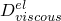。粘性、质量和/或刚度比例阻尼矩阵将包括材料Rayleigh阻尼因子，和，以及单元导向阻尼因子，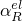（例如，对于质量单元）。材料/基于单元的粘性阻尼矩阵可以写成

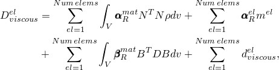

其中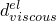表示如阻尼器等单元的粘性阻尼矩阵。在基于模态的过程中，到特征模态的投影导致非对角矩阵。

| **输入文件用法：** | 使用以下选项为具有机械自由度的单元指定材料粘性阻尼： |
| --- | --- |
|  | ``` [*DAMPING](../key/key-link.md#usb-kws-mdamping), ALPHA=, BETA= ``` 使用以下选项为声学单元指定材料粘性阻尼：``` [*ACOUSTIC MEDIUM](../key/key-link.md#usb-kws-macousticmed), VOLUMETRIC DRAG ``` |

| **Abaqus/CAE用法：** | Property模块：material编辑器：****Mechanical****Damping****：**Alpha**：或**Beta**：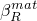 |
| --- | --- |
|  | Property模块：material编辑器：****Other****Acoustic Medium****：**Volumetric Drag** |

##### 定义全局粘性阻尼

您可以分别提供全局质量和刚度比例粘性阻尼因子，和，以使用全局模型质量和刚度矩阵创建全局阻尼矩阵，和：


可以为整个模型（默认）、仅机械自由度场（位移和转动）或仅声场指定这些参数。

| **输入文件用法：** | 使用以下选项指定全局粘性阻尼： |
| --- | --- |
|  | ``` [*GLOBAL DAMPING](../key/key-link.md#usb-kws-hglobaldamping), ALPHA=, BETA= ``` |

| **Abaqus/CAE用法：** | 全局粘性阻尼在Abaqus/CAE中不支持。 |
| --- | --- |

##### 定义粘性模态阻尼

Rayleigh阻尼引入阻尼矩阵，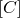，定义为


其中是模型的质量矩阵，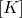是模型的刚度矩阵，和是您定义的因子。

在Abaqus/Standard中，您可以为每个模态独立定义和，因此上述方程变为


其中下标*M*指模态编号，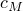、和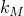是与第*M*个模态相关的阻尼、质量和刚度项。

| **输入文件用法：** | 使用以下选项通过指定模态编号定义Rayleigh阻尼： |
| --- | --- |
|  | ``` [*MODAL DAMPING](../key/key-link.md#usb-kws-hmodaldamp), VISCOUS=RAYLEIGH, DEFINITION=MODE NUMBERS ``` 使用以下选项通过指定频率范围定义Rayleigh阻尼：``` [*MODAL DAMPING](../key/key-link.md#usb-kws-hmodaldamp), VISCOUS=RAYLEIGH, DEFINITION=FREQUENCY RANGE ``` |

| **Abaqus/CAE用法：** | 使用以下输入通过指定模态编号定义Rayleigh阻尼： |
| --- | --- |
|  | Step模块：**Create Step**：**Linear perturbation**：*任何有效步骤类型*：**Damping**：**Specify damping over ranges of: Modes**，**Rayleigh**：**Use Rayleigh damping data** 使用以下输入通过指定频率范围定义Rayleigh阻尼：Step模块：**Create Step**：**Linear perturbation**：*任何有效步骤类型*：**Damping**：**Specify damping over ranges of: Frequencies**，**Rayleigh**：**Use Rayleigh damping data** |

##### 将粘性模态阻尼定义为临界阻尼的分数

您还可以将模型中每个特征模态或指定频率的阻尼定义为临界阻尼的分数。临界阻尼定义为

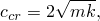

其中*m*是系统的质量，*k*是系统的刚度。临界阻尼分数的典型值，，为临界阻尼的1%到10%，；但Abaqus/Standard接受任何正值。临界阻尼因子可以从步骤到步骤更改。

| **输入文件用法：** | 使用以下选项通过指定模态编号定义临界阻尼分数： |
| --- | --- |
|  | ``` [*MODAL DAMPING](../key/key-link.md#usb-kws-hmodaldamp), VISCOUS=FRACTION OF CRITICAL DAMPING, DEFINITION=MODE NUMBERS ``` 使用以下选项通过指定频率范围定义临界阻尼分数：``` [*MODAL DAMPING](../key/key-link.md#usb-kws-hmodaldamp), VISCOUS=FRACTION OF CRITICAL DAMPING, DEFINITION=FREQUENCY RANGE ``` |

| **Abaqus/CAE用法：** | 使用以下输入通过指定模态编号定义临界阻尼分数： |
| --- | --- |
|  | Step模块：**Create Step**：**Linear perturbation**：*任何有效步骤类型*：**Damping**：**Specify damping over ranges of: Modes**，**Direct modal**：**Use direct damping data** 使用以下输入通过指定频率范围定义临界阻尼分数：Step模块：**Create Step**：**Linear perturbation**：*任何有效步骤类型*：**Damping**：**Specify damping over ranges of: Frequencies**，**Direct modal**：**Use direct damping data** |

##### 解耦结构-声学频率提取的粘性模态阻尼

对于使用AMS特征求解器执行的解耦结构-声学频率提取，您可以为结构和声学模态施加不同的阻尼。此技术仅在为一系列频率指定阻尼时使用。

| **输入文件用法：** | 使用以下选项仅将指定阻尼应用于结构模态： |
| --- | --- |
|  | ``` [*MODAL DAMPING](../key/key-link.md#usb-kws-hmodaldamp), VISCOUS=FRACTION OF CRITICAL DAMPING, DEFINITION=FREQUENCY RANGE, FIELD=MECHANICAL ``` 使用以下选项仅将指定阻尼应用于声学模态：``` [*MODAL DAMPING](../key/key-link.md#usb-kws-hmodaldamp), VISCOUS=FRACTION OF CRITICAL DAMPING, DEFINITION=FREQUENCY RANGE, FIELD=ACOUSTIC ``` 使用以下选项将指定阻尼应用于结构和声学模态（默认）：``` [*MODAL DAMPING](../key/key-link.md#usb-kws-hmodaldamp), VISCOUS=FRACTION OF CRITICAL DAMPING, DEFINITION=FREQUENCY RANGE, FIELD=ALL ``` |

| **Abaqus/CAE用法：** | 不支持在Abaqus/CAE中为结构和声学模态指定不同的阻尼。 |
| --- | --- |

##### 控制粘性阻尼来源

材料/单元和全局粘性阻尼来源可以在步骤级别控制；模态阻尼没有可用的控制。如果提供了材料和单元以及全局粘性阻尼矩阵，除非您请求仅使用单元或全局阻尼因子，否则两者都将作为组合阻尼矩阵使用。组合材料和单元和全局粘性阻尼是

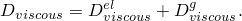

| **输入文件用法：** | 使用以下选项仅激活材料/单元粘性阻尼矩阵： |
| --- | --- |
|  | ``` [*DAMPING CONTROLS](../key/key-link.md#usb-kws-hdampingcontrols), VISCOUS=ELEMENT ``` 使用以下选项仅激活全局粘性阻尼矩阵：``` [*DAMPING CONTROLS](../key/key-link.md#usb-kws-hdampingcontrols), VISCOUS=FACTOR ``` 使用以下选项激活组合材料和单元和全局粘性阻尼矩阵：``` [*DAMPING CONTROLS](../key/key-link.md#usb-kws-hdampingcontrols), VISCOUS=COMBINED ``` |

| **Abaqus/CAE用法：** | 阻尼控制在Abaqus/CAE中不支持。 |
| --- | --- |

##### 排除粘性阻尼效应

您可以选择在步骤级别完全排除粘性阻尼效应。

| **输入文件用法：** | 使用以下选项排除粘性阻尼矩阵： |
| --- | --- |
|  | ``` [*DAMPING CONTROLS](../key/key-link.md#usb-kws-hdampingcontrols), VISCOUS=NONE ``` |

| **Abaqus/CAE用法：** | 阻尼控制在Abaqus/CAE中不支持。 |
| --- | --- |

#### 定义结构阻尼

Abaqus允许您选择特定的结构阻尼来源，添加多个来源，或排除结构阻尼效应。

##### 定义材料/单元结构阻尼

材料/单元结构阻尼矩阵（表示虚刚度并与力或位移成比例）定义为


其中表示材料结构阻尼，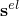表示如具有复刚度的弹簧和连接器等单元的结构阻尼系数，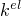是实单元刚度矩阵。在基于模态的过程中，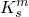到模态形状的投影产生完整的模态阻尼矩阵。当使用基于SIM的模态过程时，投影的材料和单元阻尼矩阵可以与全局和模态阻尼组合（参见下面的["定义和使用全局和模态对角阻尼"](pt03ch06s03abo07.md#usb-anl-adynamicproc-using)）。声学单元不支持材料/单元结构阻尼。

| **输入文件用法：** | 使用以下选项指定材料结构阻尼： |
| --- | --- |
|  | ``` [*DAMPING](../key/key-link.md#usb-kws-mdamping), STRUCTURAL= ``` |

| **Abaqus/CAE用法：** | Property模块：material编辑器：****Mechanical****Damping****：**Structural**： |
| --- | --- |

##### 定义全局结构阻尼

您可以定义全局结构阻尼因子，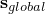，得到

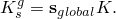

全局结构阻尼可以为整个模型（默认）、仅机械自由度场（位移和转动）或仅声场指定。

| **输入文件用法：** | 使用以下选项指定全局结构阻尼： |
| --- | --- |
|  | ``` [*GLOBAL DAMPING](../key/key-link.md#usb-kws-hglobaldamping), STRUCTURAL= ``` |

| **Abaqus/CAE用法：** | 全局结构阻尼在Abaqus/CAE中不支持。 |
| --- | --- |

##### 定义结构模态阻尼

结构阻尼假定阻尼力与应力引起的力成正比，并与速度相反（参见["材料阻尼"中的"结构阻尼"，" 26.1.1节](pt05ch26s01abm51.md#usb-mat-cdampingopt-structural)，获取更多信息）。这种形式的阻尼仅在位移和速度精确异相90度时使用，如稳态和随机响应分析中激励是纯正弦时。

结构阻尼可以为基于模态的稳态动态和随机响应分析定义为对角模态阻尼。

| **输入文件用法：** | 使用以下选项通过指定模态编号定义结构阻尼： |
| --- | --- |
|  | ``` [*MODAL DAMPING](../key/key-link.md#usb-kws-hmodaldamp), STRUCTURAL, DEFINITION=MODE NUMBERS ``` 使用以下选项通过指定频率范围定义结构阻尼：``` [*MODAL DAMPING](../key/key-link.md#usb-kws-hmodaldamp), STRUCTURAL, DEFINITION=FREQUENCY RANGE ``` |

| **Abaqus/CAE用法：** | 使用以下输入通过指定模态编号定义结构阻尼： |
| --- | --- |
|  | Step模块：**Create Step**：**Linear perturbation**：*任何有效步骤类型*：**Damping**：**Specify damping over ranges of: Modes**，**Structural**：**Use structural damping data** 使用以下输入通过指定频率范围定义结构阻尼：Step模块：**Create Step**：**Linear perturbation**：*任何有效步骤类型*：**Damping**：**Specify damping over ranges of: Frequencies**，**Structural**：**Use structural damping data** |

##### 控制结构阻尼来源

材料/单元和全局结构阻尼来源可以在步骤级别控制；模态阻尼没有可用的控制。如果提供了材料和单元以及全局结构阻尼矩阵，除非您请求仅使用单元或全局阻尼因子，否则两者都将组合。组合结构阻尼矩阵是


| **输入文件用法：** | 使用以下选项仅激活材料/单元结构阻尼矩阵： |
| --- | --- |
|  | ``` [*DAMPING CONTROLS](../key/key-link.md#usb-kws-hdampingcontrols), STRUCTURAL=ELEMENT ``` 使用以下选项仅激活全局结构阻尼矩阵：``` [*DAMPING CONTROLS](../key/key-link.md#usb-kws-hdampingcontrols), STRUCTURAL=FACTOR ``` 使用以下选项激活组合材料和单元和全局结构阻尼矩阵：``` [*DAMPING CONTROLS](../key/key-link.md#usb-kws-hdampingcontrols), STRUCTURAL=COMBINED ``` |

| **Abaqus/CAE用法：** | 阻尼控制在Abaqus/CAE中不支持。 |
| --- | --- |

##### 排除结构阻尼效应

您可以选择在步骤级别完全排除结构阻尼效应。

| **输入文件用法：** | 使用以下选项排除结构阻尼矩阵： |
| --- | --- |
|  | ``` [*DAMPING CONTROLS](../key/key-link.md#usb-kws-hdampingcontrols), STRUCTURAL=NONE ``` |

| **Abaqus/CAE用法：** | 阻尼控制在Abaqus/CAE中不支持。 |
| --- | --- |

#### 同时定义粘性和结构阻尼

频域动力学方程中表示阻尼效应的虚部贡献可能包括粘性和结构阻尼，可以写成


其中是激励频率。

#### 定义复合模态阻尼

复合模态阻尼允许您为模型中的每个材料或单元定义临界阻尼分数的阻尼因子。然后将这些因子组合成每个模态的阻尼因子，作为与每个材料或单元相关的质量矩阵的加权平均值；当使用SIM架构时，您还可以包括刚度矩阵的加权平均值。复合模态阻尼只能通过指定模态编号来定义；不能通过指定频率范围来定义。

##### 为使用传统架构的分析定义复合模态阻尼

您在材料定义中为使用传统架构的分析指定复合模态阻尼。每个特征模态的阻尼计算为：

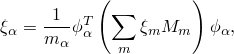

其中是模态中使用的临界阻尼分数，是为材料*m*定义的临界阻尼分数，是与材料*m*相关的质量矩阵，是模态的特征向量，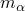是与模态相关的广义质量：


如果您指定复合模态阻尼，Abaqus会在特征频率提取步骤中从您为每个材料定义的阻尼因子计算阻尼系数, COMPOSITE= [*MODAL DAMPING](../key/key-link.md#usb-kws-hmodaldamp), VISCOUS=COMPOSITE ``` |

| **Abaqus/CAE用法：** | Property模块：material编辑器：****Mechanical****Damping****：**Composite：** Step模块：**Create Step**：**Linear perturbation**：*任何有效步骤类型*：**Damping**：**Composite modal**：**Use composite damping data** |
| --- | --- |

##### 为使用SIM架构的分析定义复合模态阻尼

您可以为使用Lanczos特征求解器的基于SIM的分析指定复合模态阻尼。为每个单元指定复合模态阻尼。您还可以为质量和刚度矩阵输入分配临界阻尼分数。 每个特征模态的质量加权阻尼计算为：

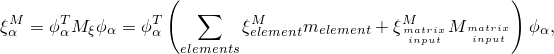

其中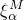是模态中使用的质量加权临界阻尼分数，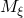是质量矩阵的阻尼部分，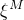是单元质量矩阵和质量矩阵输入的临界阻尼分数，是模态的特征向量。

每个特征模态的刚度加权阻尼计算为：

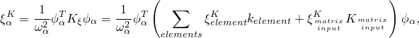

其中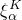是模态中使用的刚度加权临界阻尼分数，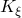是刚度矩阵的阻尼部分，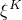是单元刚度和矩阵输入刚度的临界阻尼分数，是模态的特征向量。

| **输入文件用法：** | 使用以下两个选项指定复合模态阻尼： |
| --- | --- |
|  | ``` [*FREQUENCY](../key/key-link.md#usb-kws-hfrequency), EIGENSOLVER=LANCZOS, SIM [*COMPOSITE MODAL DAMPING](../key/key-link.md#usb-kws-hcompositemodaldamp) ``` 使用以下选项为矩阵输入中包含的所有质量矩阵指定临界阻尼分数：``` [*COMPOSITE MODAL DAMPING](../key/key-link.md#usb-kws-hcompositemodaldamp), MASS MATRIX INPUT ``` 使用以下选项为矩阵输入中包含的所有刚度矩阵指定临界阻尼分数：``` [*COMPOSITE MODAL DAMPING](../key/key-link.md#usb-kws-hcompositemodaldamp), STIFFNESS MATRIX INPUT ``` |

| **Abaqus/CAE用法：** | 不支持在Abaqus/CAE中为使用SIM架构的分析定义复合模态阻尼。 |
| --- | --- |

#### 为声场定义全局阻尼

如果您的模型包含声学单元，Abaqus默认将任何指定全局阻尼应用于模型中的声场和结构场。如果需要，您可以指定全局阻尼定义仅适用于声场或仅适用于位移和转动场（在使用耦合声学-结构模态的基于模态的稳态动态分析中不支持）。

| **输入文件用法：** | 使用以下选项将全局阻尼应用于模型中的所有位移、转动和声场： |
| --- | --- |
|  | ``` [*GLOBAL DAMPING](../key/key-link.md#usb-kws-hglobaldamping), FIELD=ALL (default) ``` 使用以下选项仅将全局阻尼应用于模型中的声场：``` [*GLOBAL DAMPING](../key/key-link.md#usb-kws-hglobaldamping), FIELD=ACOUSTIC ``` 使用以下选项仅将全局阻尼应用于模型中的位移和转动场：``` [*GLOBAL DAMPING](../key/key-link.md#usb-kws-hglobaldamping), FIELD=MECHANICAL ``` |

| **Abaqus/CAE用法：** | 全局阻尼在Abaqus/CAE中不支持。 |
| --- | --- |

#### 定义和使用全局和模态对角阻尼

基于模态的过程（如稳态动力学、瞬态模态动态、响应谱和随机响应分析）也可以使用指定每个特征模态的步骤依赖模态阻尼定义。当将不同阻尼类型与多个模态阻尼定义一起使用时，阻尼是相加的。如果多次指定相同的阻尼类型，则使用最后的规定。如果模态阻尼与全局阻尼一起使用，两种阻尼类型都将贡献到阻尼矩阵。

阻尼控制对模态阻尼没有影响。如果使用阻尼控制排除步骤中的某些全局阻尼效应，则所有模态阻尼效应仍包含在步骤中。要排除模态阻尼，必须从步骤定义中明确移除阻尼定义。


