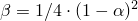
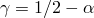
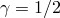
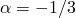
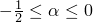
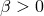
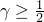
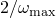

# 6.3.2 使用直接积分的隐式动态分析


**产品：**Abaqus/Standard  Abaqus/CAE  


##### **参考**

- ["定义分析，" 6.1.2节](pt03ch06s01abo05.md)
- ["动态分析过程：概述，" 6.3.1节](pt03ch06s03abo07.md)
- [*DYNAMIC](../key/key-link.md#usb-kws-hdynamic)
- ["在Abaqus/CAE User's Guide第14.11.1节"配置常规分析过程"中配置动态隐式过程"](../usi/usi-link.md#usi-sim-configure-dynamicimplicit)

### 概述

Abaqus/Standard中的直接积分动态分析：
- 当研究非线性动态响应时必须使用；
- 可以完全非线性（常规动态分析）或基于线性系统模态（子空间投影方法）；并且
- 可用于研究各种应用，包括：- 需要瞬态保真度且涉及最小能量耗散的动态响应；- 涉及非线性、接触和适度能量耗散的动态响应；以及- 准静态响应，其中相当大的能量耗散为确定本质上静态的解提供了稳定性并改善收敛行为。

### 常规动态分析

Abaqus/Standard中的常规非线性动态分析使用隐式时间积分来计算系统的瞬态动态或准静态响应。该过程可应用于需要不同数值求解策略的各种应用，如获得收敛所需的数值阻尼量以及自动时间增量算法在求解过程中进行的方式。典型动态应用分为三类：
- 瞬态保真度应用，如卫星系统分析，需要最小的能量耗散。在这些应用中，采取小时间增量以准确解析结构的振动响应，数值能量耗散保持在最小。这些严格的要求往往会降低涉及接触或非线性的模拟的收敛行为。
- 适度耗散应用包含更广泛的动态事件范围，其中通过塑性、粘性阻尼或其他效应耗散中等量的能量。典型应用包括各种插入、冲击和成型分析。这些结构的响应可以是单调的或非单调的。通常对这些应用不感兴趣的是高频振动的准确解析。一些数值能量耗散往往会在不显著降低解的准确性的情况下减少求解噪声并改善这些应用中的收敛行为。
- 准静态应用主要感兴趣的是确定最终静态响应。这些问题通常表现出单调行为，惯性效应主要被引入以正规化不稳定行为。例如，静态不稳定行为可能由于暂时未约束的刚体模态或"snap-through"现象引起。尽可能采取大时间增量以最小计算成本获得最终解。在加载历史的某些阶段可能需要相当大的数值耗散来获得收敛。

瞬态保真度应用的示例在["汽车悬架建模，" Abaqus Example Problems Guide第2.1.7节](../exa/exa-link.md#exa-dyn-jointcautosuspension)中提供。包括适度耗散步骤和准静态步骤的分析在["棘轮机构的冲击分析，" Abaqus Example Problems Guide第2.1.17节](../exa/exa-link.md#exa-dyn-pawlratchet)中描述。

#### 指定应用类型

基于上面列出的分类，在执行常规动态分析时，您应指示您正在研究的应用类型。Abaqus/Standard根据您对应用类型的分类分配数值设置，此分类可以显著影响模拟。在某些情况下，可以通过多个应用类型设置获得准确结果，在这种情况下应考虑分析效率。一个总体趋势是——在三种分类中——高耗散准静态分类往往产生最佳收敛行为，低耗散瞬态保真度分类往往具有最高收敛困难可能性。

| **输入文件用法：** | 使用以下选项用于瞬态保真度应用： |
| --- | --- |
|  | ``` [*DYNAMIC](../key/key-link.md#usb-kws-hdynamic), APPLICATION=TRANSIENT FIDELITY (default for models without contact) ``` 使用以下选项用于适度耗散应用：``` [*DYNAMIC](../key/key-link.md#usb-kws-hdynamic), APPLICATION=MODERATE DISSIPATION (default for models with contact) ``` 使用以下选项用于准静态应用：``` [*DYNAMIC](../key/key-link.md#usb-kws-hdynamic), APPLICATION=QUASI-STATIC ``` |

| **Abaqus/CAE用法：** | Step模块：**Create Step**：**General**：**Dynamic, Implicit** |
| --- | --- |
|  | 在**Edit Step**对话框中指定应用类型：**Basic**：**Application：** **Transient fidelity**、**Moderate dissipation**、**Quasi-static**或**Analysis product default** |

#### 与质量属性相关的建模错误诊断

准确的惯性属性表示对于准确动态分析是必要的。在某些情况下，当Abaqus/Standard检测到可能与惯性属性规范相关的建模错误时，会提供诊断消息。指定惯性属性最常见的方法是材料密度。如果在动态分析中省略了材料密度，Abaqus/Standard会向数据（`.dat`）文件发出警告消息（如果密度仅对某些温度或场变量值为零，则不发出此警告）。指定惯性属性的其他方法包括：
- 点质量和转动惯量定义，以及
- 将没有惯性的约束节点附加到定义了惯性属性的节点。

在某些情况下，Abaqus/Standard尝试求解涉及全局质量矩阵有效反转的方程组，以在常规动态分析期间直接调整速度和加速度，如下面["初始条件"](pt03ch06s03at07.md#usb-anl-adynamic-ic)"和["间歇接触/冲击"](pt03ch06s03at07.md#usb-anl-adynamic-intermit)"中所述。这些附加的速度和加速度调整默认仅对上述瞬态保真度应用类型生效。如果发现全局质量矩阵是奇异的，Abaqus/Standard默认发出错误消息，因为奇异质量表示质量属性由于建模错误而不现实。

虽然关于材料密度缺乏的警告通常会发出，但通常不会为准静态和适度耗散应用类型提供关于全局质量矩阵奇异的特定诊断反馈。奇异质量不一定对准静态分析有害。例如，仅在具有临时静态不稳定性（如最初未约束的刚体模态，一旦接触发生就被约束）的组件或区域中定义惯性属性（如密度）在准静态分析中是合理的。

您可以控制Abaqus/Standard在检测到奇异全局质量矩阵时采取的行动方案。

| **输入文件用法：** | 使用以下默认选项，如果在计算速度和加速度调整时检测到奇异全局质量矩阵，则发出错误消息并停止执行： |
| --- | --- |
|  | ``` [*DYNAMIC](../key/key-link.md#usb-kws-hdynamic), SINGULAR MASS=ERROR ``` 使用以下选项，如果在检测到奇异全局质量矩阵时发出警告消息并避免速度和加速度调整（即，使用当前速度和加速度继续时间积分）：``` [*DYNAMIC](../key/key-link.md#usb-kws-hdynamic), SINGULAR MASS=WARNING ``` 使用以下选项，即使检测到奇异质量矩阵也调整速度和加速度。此设置可能导致大的、非物理的速度和/或加速度调整，这又可能导致糟糕的时间积分求解和人为收敛困难。*此方法通常不推荐；仅应在分析师对如何解释以这种方式获得的结果有透彻理解的特殊情况下使用。*``` [*DYNAMIC](../key/key-link.md#usb-kws-hdynamic), SINGULAR MASS=MAKE ADJUSTMENTS ``` |

| **Abaqus/CAE用法：** | 默认奇异质量设置不能在Abaqus/CAE中修改。 |
| --- | --- |

#### 数值细节

应用类型分类对常规动态分析数值方面的影响如下所述。在大多数情况下，由应用类型确定的设置足以成功执行分析。但是，提供了详细的用户控制以覆盖个别设置。

##### 时间积分方法

默认情况下，Abaqus/Standard使用Hilber-Hughes-Taylor时间积分，除非您指定应用类型是准静态的。Hilber-Hughes-Taylor算子是Newmark 方法的扩展。与Hilber-Hughes-Taylor算子相关的数值参数针对适度耗散和瞬态保真度应用进行不同调整（稍后在本节中讨论）。如果应用分类是准静态的，默认使用后向Euler算子。

这些时间积分算子是隐式的，这意味着必须反转算子矩阵，并且在每个时间增量必须求解一组联立非线性动态平衡方程。此求解使用Newton法迭代完成。这些算子的主要优点是它们对线性系统是无条件稳定的；没有可用于积分线性系统的时间增量大小的数学限制。无条件稳定积分算子在研究结构系统时非常有价值，因为条件稳定积分算子（如显式方法中使用的）可能导致不切实际的小时间步长，从而导致计算昂贵的分析。

使用有限时间增量大小进行模拟通常会引入一定程度的数值阻尼。这种阻尼与["材料阻尼，" 26.1.1节](pt05ch26s01abm51.md)中讨论的材料阻尼不同（在许多情况下，这两种形式的阻尼可以很好地一起工作）。与时间积分相关的阻尼量因算子类型而异（例如，后向Euler算子往往比Hilber-Hughes-Taylor算子更具耗散性），并且在许多情况下（如Hilber-Hughes-Taylor算子）取决于与算子相关的数值参数设置。算子有效处理接触条件的能力通常对于其有用性相当重要。例如，许多时间积分器中的一些接触条件变化可能导致"负阻尼"（非物理能源），这可能非常不可取。

可以覆盖应用类型分类所隐含的时间积分器；例如，您可以使用后向Euler积分器执行适度耗散动态分析。更改默认积分器通常不推荐，但可能在特殊情况下有用。

| **输入文件用法：** | 使用以下选项使用Hilber-Hughes-Taylor积分器，其默认积分器参数设置对应于瞬态保真度应用： |
| --- | --- |
|  | ``` [*DYNAMIC](../key/key-link.md#usb-kws-hdynamic), TIME INTEGRATOR=HHT-TF ``` 使用以下选项使用Hilber-Hughes-Taylor积分器，其默认积分器参数设置对应于适度耗散应用：``` [*DYNAMIC](../key/key-link.md#usb-kws-hdynamic), TIME INTEGRATOR=HHT-MD ``` 使用以下选项使用后向Euler积分器：``` [*DYNAMIC](../key/key-link.md#usb-kws-hdynamic), TIME INTEGRATOR=BWE ``` |

| **Abaqus/CAE用法：** | 默认时间积分器不能在Abaqus/CAE中修改。 |
| --- | --- |

##### 对积分器参数的附加控制

提供了对与Hilber-Hughes-Taylor算子相关的数值参数设置进行修改的附加用户控制（参见[Hilber, Hughes和Taylor (1977)](../stm/stm-link.md#stm-ref-hilber-hughes-taylor)获取数值参数描述）。默认参数设置取决于指定的应用类型，如[表6.3.2-1](pt03ch06s03at07.md#usb-anl-adynamic-hhtparams)所示（参见[Czekanski, El-Abbasi和Meguid (2001)](../stm/stm-link.md#stm-ref-czekanski)获取这些设置的基础）。

**表6.3.2–1** Hilber-Hughes-Taylor积分器的默认参数。
| 参数 | 应用 |
| --- | --- |
|  | Transient Fidelity | Moderate Dissipation |
|  | --0.05 | --0.41421 |
|  | 0.275625 | 0.5 |
|  | 0.55 | 0.91421 |

如果使用Hilber-Hughes-Taylor算子，可以单独调整或修改这些参数。如果这些参数的默认设置对应于[表6.3.2-1](pt03ch06s03at07.md#usb-anl-adynamic-hhtparams)中所示的瞬态保真度设置，并且您明确修改参数，则其他参数将自动调整为和。此关系提供了对与时间积分器相关的数值阻尼的控制，同时保留积分器的理想特性。数值阻尼随时间增量与模态振动周期之比增长。的负值提供阻尼；而导致无阻尼（能量保持）并且正是梯形法则（有时称为Newmark 方法，和)。设置提供最大数值阻尼。当时间增量是被研究模态振荡周期的40%时，它给出约6%的阻尼比。、和的允许值为：、、。

| **输入文件用法：** | ``` [*DYNAMIC](../key/key-link.md#usb-kws-hdynamic), ALPHA=, BETA=, GAMMA= ``` |
| --- | --- |

| **Abaqus/CAE用法：** | 只能在Abaqus/CAE中修改参数： |
| --- | --- |
|  | Step模块：**Create Step**：**General**：**Dynamic, Implicit**：**Other**：**Alpha:** **Specify:**  |

##### 默认增量控制方案

默认情况下，自动时间增量控制用于非线性动态过程。控制隐式动态过程时间增量大小调整的主要因素是Newton迭代的收敛行为和时间积分的准确性。时间增量大小在分析过程中可能相当大地变化。时间增量控制算法的细节取决于您正在研究的动态应用类型。

如果指定准静态类型应用，以下因素默认在时间增量控制算法中考虑（相同因素控制纯静态分析的时间增量大小）：
- 如果增量似乎正在发散或收敛速率缓慢，则减小时间增量大小。
- 如果在先前增量中发生快速收敛，则相当积极地增加时间增量大小。

适度耗散类型应用的分析也使用这些相同因素，以及等于步骤持续时间十分之一的时间增量大小的默认上限。

如果指定瞬态保真度类型应用，以下因素默认在时间增量控制算法中考虑：
- 如果增量似乎正在发散或收敛速率缓慢，则减小时间增量大小。
- 如果在处理增量的第一次尝试期间检测到接触状态变化，则减小时间增量大小。新增量大小被设定为使得增量结束对应于与先前增量大小检测到的接触状态变化的平均时间。（在这种情况下，使用额外的非常小的时间增量来强制跨活动接触界面的速度和加速度兼容性。）
- 如果时间增量一半处的半增量残差（不平衡力）超过半增量残差容差，则减小时间增量大小，对于接触分析为时间平均力的10,000倍，对于无接触分析为时间平均力的1,000倍。
- 如果在先前增量中发生快速收敛，则逐渐增加时间增量。
- 时间增量大小的上限等于步骤持续时间的1/100。

##### 间歇接触/冲击

前述列表中的第二和第三个因素对于作为瞬态保真度应用执行的接触模拟通常导致非常小的时间增量大小（并且由于第四个因素，时间增量大小往往保持很小）。可以通过指定不同的应用类型或使用更详细的用户控制来避免此问题，如下所述。

##### 时间增量控制的一般设置

对时间增量控制算法考虑的因素的高级用户控制可以用于覆盖分析指定应用类型所隐含的默认值。无论您指定的应用类型如何，您都可以强制执行与准静态应用或瞬态保真度应用相关的时间增量控制。

| **输入文件用法：** | 使用以下选项获得与准静态应用相关的激进时间增量控制设置： |
| --- | --- |
|  | ``` [*DYNAMIC](../key/key-link.md#usb-kws-hdynamic), INCREMENTATION=AGGRESSIVE ``` 使用以下选项获得与瞬态保真度应用相关的更保守时间增量控制设置：``` [*DYNAMIC](../key/link.md#usb-kws-hdynamic), INCREMENTATION=CONSERVATIVE ``` |

| **Abaqus/CAE用法：** | 默认时间增量控制设置不能在Abaqus/CAE中修改。 |
| --- | --- |

##### 控制半增量残差

提供了与半增量残差容差相关的控制以调整时间增量。这些控制适用于高级用户，通常不需要修改。

| **输入文件用法：** | 使用以下选项指定不应执行半增量残差检查： |
| --- | --- |
|  | ``` [*DYNAMIC](../key/key-link.md#usb-kws-hdynamic), NOHAF ``` 使用以下选项将半增量残差容差指定为时间平均力（矩）的比例因子：``` [*DYNAMIC](../key/key-link.md#usb-kws-hdynamic), HALFINC SCALE FACTOR=*scale factor* ``` 使用以下选项直接指定半增量残差力容差（半增量残差矩容差是自动计算的半增量残差力容差乘以特征单元长度）：``` [*DYNAMIC](../key/key-link.md#usb-kws-hdynamic), HAFTOL=*tolerance* ``` |

| **Abaqus/CAE用法：** | 使用以下选项指定不应执行半增量残差检查： |
| --- | --- |
|  | Step模块：**Create Step**：**General**：**Dynamic, Implicit**：**Incrementation**：切换**Suppress half-increment residual calculation** 使用以下选项将半增量残差容差指定为时间平均力（矩）的比例因子：Step模块：**Create Step**：**General**：**Dynamic, Implicit**：**Incrementation**：**Half-increment Residual**：**Specify scale factor:** *scale factor* 使用以下选项直接指定半增量残差力容差：Step模块：**Create Step**：**General**：**Dynamic, Implicit**：**Incrementation**：**Half-increment Residual:** **Specify value:** *tolerance* |

##### 控制涉及接触的增量

默认情况下，指定瞬态保真度应用通常会在接触状态变化时导致减小的时间增量大小。随后执行额外非常小的时间增量以强制跨活动接触界面的速度和加速度兼容性。提供对这些增量方面的直接用户控制。

| **输入文件用法：** | 使用以下选项避免在接触状态变化时自动削减增量大小并在接触区域强制速度和加速度兼容性： |
| --- | --- |
|  | ``` [*DYNAMIC](../key/key-link.md#usb-kws-hdynamic), IMPACT=NO ``` 使用以下选项在接触状态变化时自动削减增量大小并在接触区域强制速度和加速度兼容性：``` [*DYNAMIC](../key/key-link.md#usb-kws-hdynamic), IMPACT=AVERAGE TIME ``` 使用以下选项在接触区域强制速度和加速度兼容性，而不自动削减接触状态变化时的增量大小：``` [*DYNAMIC](../key/key-link.md#usb-kws-hdynamic), IMPACT=CURRENT TIME ``` |

| **Abaqus/CAE用法：** | 默认接触增量控制方案不能在Abaqus/CAE中修改。 |
| --- | --- |

##### 直接时间增量控制

您可以直接指定要使用的时间增量大小。此方法通常不推荐，但可能在特殊情况下有用。如果在允许的最大迭代次数内未满足收敛容差，分析将终止。

可以忽略收敛容差：在达到允许的最大迭代次数后，即使未满足收敛容差，也接受增量的解。忽略收敛容差可能导致高度非物理结果，不推荐，除非分析师对如何解释以这种方式获得的结果有透彻理解。

| **输入文件用法：** | 使用以下选项直接指定时间增量： |
| --- | --- |
|  | ``` [*DYNAMIC](../key/key-link.md#usb-kws-hdynamic), DIRECT ``` 使用以下选项在达到最大迭代次数后忽略收敛容差：``` [*DYNAMIC](../key-key.md#usb-kws-hdynamic), DIRECT=NO STOP ``` |

| **Abaqus/CAE用法：** | 使用以下选项直接指定时间增量： |
| --- | --- |
|  | Step模块：**Create Step**：**General**：**Dynamic, Implicit**：**Incrementation**：**Fixed** 使用以下选项在达到最大迭代次数后忽略收敛容差：Step模块：**Create Step**：**General**：**Dynamic, Implicit**：**Other**：**Accept solution after reaching maximum number of iterations** |

##### 载荷的默认幅值

如果您选择了准静态应用分类，则默认情况下会斜坡加载（如施加的力或压力）；这种斜坡倾向于增强鲁棒性，因为负载增量大小与时间增量大小成比例。例如，如果Newton迭代无法为特定时间增量大小收敛，则自动时间增量算法将减小时间增量大小并用更小的负载增量重新开始Newton迭代。

对于其他应用分类，动态过程默认使用阶跃函数施加载荷，使得在步骤的第一增量中施加完整载荷（无论时间增量大小如何），并且载荷幅度在每个步骤上保持恒定。因此，如果第一增量无法用原始时间增量大小收敛，则默认情况下减小时间增量不会减小负载增量。在某些情况下，由于积分算子上惯性的正则化效应与时间增量大小的平方成反比，减小时间增量仍会改善收敛行为。参见["定义分析，" 6.1.2节](pt03ch06s01abo05.md)，获取有关各种过程的默认幅值类型以及如何覆盖默认值的更多信息。

### "子空间投影"方法

Abaqus/Standard为非线性动态问题提供的替代方法是"子空间投影"方法。参见["子空间动力学，" Abaqus Theory Guide第2.4.3节](../stm/stm-link.md#stm-anl-subspacedyn)，获取此方法背后的理论。在这种方法中，线性系统的模态在动态分析之前的特征频率提取步骤（["固有频率提取，" 6.3.5节](pt03ch06s03at10.md)）中提取，并用 作一小组全局基础向量来构建求解。这些模态将包括特征模态，如果在与频率提取步骤中激活，则还包括残余模态。当系统表现出轻微非线性行为时，例如小区域塑性屈服或转动不小但也不太大时，此方法非常有效。

此方法可能非常有效。与其他直接积分方法一样，就计算时间而言，它比纯线性动态分析的模态方法更昂贵，但通常比模型所有运动方程的直接积分要便宜得多。然而，由于子空间投影方法基于系统模态，如果存在无法被形成求解基础的模态很好建模的极端非线性响应，则它将不准确。

| **输入文件用法：** | ``` [*DYNAMIC](../key/key-link.md#usb-kws-hdynamic), SUBSPACE ``` |
| --- | --- |

| **Abaqus/CAE用法：** | Step模块：**Create Step**：**General**：**Dynamic, Subspace** |
| --- | --- |

#### 选择进行投影的模态

您可以选择执行子空间投影的系统模态。可以单独列出模态编号，也可以自动生成。如果您选择不选择模态，则使用先前频率提取步骤中提取的所有模态，包括如果它们被激活的残余模态。

| **输入文件用法：** | 使用以下选项之一： |
| --- | --- |
|  | ``` [*SELECT EIGENMODES](../key/key-link.md#usb-kws-hselecteigenmodes) [*SELECT EIGENMODES](../key/key-link.md#usb-kws-hselecteigenmodes), GENERATE ``` |

| **Abaqus/CAE用法：** | Step模块：**Create Step**：**General**：**Dynamic, Subspace**：**Basic**：**Number of modes to use**：**All**或**Specify** |
| --- | --- |

#### 数值实现

子空间投影方法在Abaqus/Standard中使用显式（中心差分）算子实现，以积分以线性系统模态写的运动方程。这种积分方法在这里特别有效，因为模态相对于质量矩阵是正交的，因此投影系统始终具有对角质量矩阵。

使用固定时间增量：此增量是您指定的时间增量或稳定时间增量的80%中的较小者，对于线性系统为，其中是用作求解基础的模态的最高圆频率。80%因子旨在作为安全因子，使得由非线性效应引起的此最高频率的任何增加不太可能导致积分变得不稳定。80%是相当任意的；在某些情况下它可能是不保守的。您必须监控响应——例如能量平衡——以确保时间增量不会导致不稳定。稳定性是一个关注点，如果非线性可以显著使系统变刚，尽管在许多实际情况下，这种变刚效应在增加系统较低频率方面比影响可能保留以准确表示动态行为的最高频率更突出。

#### 子空间投影方法的准确性

子空间投影方法的有效性取决于线性系统模态作为问题的一组全局插值函数的价值，这是您判断的问题——与决定特定有限元网格是否足够时所需的相同判断。所述的方法对于轻微非线性系统和容易提取足够模态以确保它们能充分描述系统的情况很有价值。

如果在子空间动力学步骤中考虑了非线性几何效应，则可以执行动态模拟一段时间，通过使用另一个频率提取步骤重新提取当前应力几何上的模态，然后用新模态作为子空间基础系统继续分析。此过程可以在某些情况下提高方法的准确性。

### 材料阻尼

您可以引入Rayleigh阻尼，如["材料阻尼，" 26.1.1节](pt05ch26s01abm51.md)中所述。此阻尼将除了与时间积分器相关的数值阻尼（前面讨论的）之外起作用。

| **输入文件用法：** | ``` [*DAMPING](../key/key-link.md#usb-kws-mdamping), ALPHA=, BETA= ``` |
| --- | --- |

| **Abaqus/CAE用法：** | Property模块：material编辑器：****Mechanical****Damping****：**Alpha**和**Beta** |
| --- | --- |

### 初始条件

["Abaqus/Standard和Abaqus/Explicit中的初始条件，" 34.2.1节](pt07ch34s02aus116.md)描述了所有可用的初始条件。无论是否使用节点转换，初始速度必须在全局方向上定义（参见["转换坐标系，" 2.1.5节](pt01ch02s01aus09.md)）。

如果在也指定了位移边界条件的节点上指定了初始速度，则这些初始速度将在这些节点被忽略。但是，如果边界条件引用具有解析定义的时间变化的振幅曲线（即，排除分段线性表格和等间距定义），Abaqus/Standard将计算边界条件所涉及节点的初始速度，作为解析变化（在时间零处求值）的时间导数。

当为动态分析指定初始速度时，它们应与模型上的所有约束一致，特别是时间依赖边界条件。Abaqus/Standard将确保初始速度与边界条件和多点约束一致，但不会检查与内部约束（如材料不可压缩性）的一致性。如果存在冲突，边界条件和多点约束优先于初始条件。

指定的初始速度仅在分析中第一个动态步骤中使用。如果动态步骤不是第一个动态步骤，并且存在紧接在前的动态步骤，则使用前一步骤结束时的速度作为当前步骤的初始速度。如果动态步骤不是第一个动态步骤且紧接在前的步骤不是动态步骤，则假定当前步骤的初始速度为零。

#### 控制动态步骤开始时加速度的计算

默认情况下，Abaqus/Standard将为瞬态保真度应用计算动态步骤开始时的加速度。您可以选择绕过这些加速度计算，在这种情况下，Abaqus/Standard将假定当前步骤的初始加速度为零，除非存在紧接在前的动态步骤。如果紧接在前的步骤也是动态步骤，则绕过加速度计算将导致Abaqus/Standard使用前一步骤结束时的加速度来继续新步骤。如果加载在动态步骤开始时没有突然变化，则绕过加速度计算是合适的，但如果第一增量开始时的加载与前一步骤结束时的加载显著不同，则不正确。在突然施加大载荷的情况下，由于绕过加速度计算引起的高频噪声可能大大增加半增量残差。

| **输入文件用法：** | ``` [*DYNAMIC](../key/key-link.md#usb-kws-hdynamic), INITIAL=NO ``` |
| --- | --- |

| **Abaqus/CAE用法：** | Step模块：**Create Step**：**General**：**Dynamic, Implicit**：**Other**：**Initial acceleration calculations at beginning of step:** **Bypass** |
| --- | --- |

### 边界条件

边界条件可以施加于任何位移或转动自由度（1-6），开口截面梁单元的翘曲自由度7，静水压力流体的流体压力自由度8，或声学单元的声压自由度8（["Abaqus/Standard和Abaqus/Explicit中的边界条件，" 34.3.1节](pt07ch34s03aus118.md)）。

振幅参考可用于在直接积分动态步骤中规定时间变化的边界条件。默认幅值变化在["定义分析，" 6.1.2节](pt03ch06s01abo05.md)中描述。

在直接时间积分动态分析中，当具有规定运动的节点用于方程约束或多点约束以控制另一节点的运动时，方程或多点约束将正确地施加于从属节点的位移和速度。但是，加速度不会严格传递到从属节点，这可能导致一些高频噪声。

在子空间投影方法中，目前不可能直接指定非零边界条件。相反，可以通过使用大点质量和集中载荷的适当组合来近似加速度边界条件。在期望这种边界条件的节点处，附加一个大约比原始模型质量大10^5–10^6倍的大点质量。此外，必须在近似边界条件的方向上指定等于大点质量与期望加速度乘积的集中载荷。由于点质量明显大于模型质量，大质量-集中载荷组合将准确地近似指定方向中的期望加速度。除加速度之外的边界条件必须在可以近似之前转换为加速度历史。

### 载荷

在动态分析中可以规定以下载荷：
- 集中节点力可以施加于位移自由度（1-6）；参见["集中载荷，" 34.4.2节](pt07ch34s04aus121.md)。
- 可以施加分布压力载荷或体力；参见["分布载荷，" 34.4.3节](pt07ch34s04aus122.md)。特定单元可用的分布载荷类型在[第六部分，"单元"](pt06.md)中描述。
- 可以施加分布压力或体积加速度（在声学单元上）；这些在["声学、冲击和耦合声学-结构分析，" 6.10.1节](pt03ch06s10at29.md)中描述。

### 预定义场

可以在动态分析中指定以下预定义场，如["预定义场，" 34.6.1节](pt07ch34s06aus128.md)中所述：
- 虽然温度在应力/位移单元中不是自由度，但可以将节点温度指定为预定义场。如果为材料给出了热膨胀系数（["热膨胀，" 26.1.2节](pt05ch26s01abm52.md)），则施加温度与初始温度之间的任何差异将导致热应变。指定温度也会影响温度依赖性材料属性（如果有）。
- 可以指定用户定义场变量的值。这些值仅影响场变量依赖性材料属性（如果有）。

### 材料选项

大多数描述机械行为的材料模型可用于动态分析。以下材料属性在动态分析期间不活跃：热属性（热膨胀除外）、质量扩散属性、电导属性和孔隙流体流动属性。

率相关材料属性（["时域粘弹性，" 22.7.1节](pt05ch22s07abm12.md)；["弹性体中的滞后，" 22.8.1节](pt05ch22s08abm14.md)；["率相关屈服，" 23.2.3节](pt05ch23s02abm19.md)；和["双层粘塑性，" 23.2.11节](pt05ch23s02abm27.md)）可以包含在动态分析中。

### 单元

除具有扭转的广义轴对称单元外，Abaqus/Standard中任何应力/位移单元（包括具有温度、压力和电势自由度的单元）都可用于动态分析。惯性效应在静水压力流体单元中被忽略，孔隙压力单元中流体的惯性不被考虑。

### 输出

除了Abaqus/Standard中可用的常规输出变量（参见["Abaqus/Standard输出变量标识符，" 4.2.1节](pt02ch04s02abv01.md)），还专门为隐式动态分析提供以下变量：

指定单元集或整个模型的变量：

| XC | 质心的当前坐标。 |
| --- | --- |

| XC*n* | 质心的坐标*n*（）。 |
| --- | --- |

| UC | 质心位移。 |
| --- | --- |

| UC*n* | 质心位移分量*n*（）。 |
| --- | --- |

| URC*n* | 质心转动分量*n*。 |
| --- | --- |

| VC | 等效刚体速度分量。 |
| --- | --- |

| VC*n* | 等效刚体速度分量*n*（）。 |
| --- | --- |

| VRC*n* | 等效刚体角速度分量*n*（）。 |
| --- | --- |

| HC | 关于质心的角动量。 |
| --- | --- |

| HC*n* | 关于质心的角动量分量*n*（）。 |
| --- | --- |

| HO | 关于原点的角动量。 |
| --- | --- |

| HO*n* | 关于原点的角动量分量*n*（）。 |
| --- | --- |

| RI | 关于原点的转动惯量。 |
| --- | --- |

| RI*ij* | 关于原点的转动惯量的分量（）。 |
| --- | --- |

| MASS | 质量。 |
| --- | --- |

| VOL | 当前体积。 |
| --- | --- |

### 输入文件模板

```
[*HEADING](../key/key-link.md#usb-kws-mheading)
…
[*BOUNDARY](../key/key-link.md#usb-kws-hboundary)
*Data lines to specify zero-valued boundary conditions*
[*INITIAL CONDITIONS](../key/key-link.md#usb-kws-minitialcond)
*Data lines to specify initial conditions*
[*AMPLITUDE](../key/key-link.md#usb-kws-mamplitude), NAME=*name*
*Data lines to define amplitude variations*
**
[*STEP](../key/key-link.md#usb-kws-hstep) (,NLGEOM)
*Once NLGEOM is specified, it will be active in all subsequent steps.*
[*DYNAMIC](../key/key-link.md#usb-kws-hdynamic)
*Data line to control automatic time incrementation*
[*BOUNDARY](../key/key-link.md#usb-kws-hboundary)
*Data lines to describe zero-valued or nonzero boundary conditions*
[*CLOAD](../key/key-link.md#usb-kws-hcload) and/or [*DLOAD](../key/key-link.md#usb-kws-hdload) and/or [*INCIDENT WAVE](../key/key-link.md#usb-kws-hincidentwave)
*Data lines to specify loads*
[*TEMPERATURE](../key/key-link.md#usb-kws-htemperature) and/or [*FIELD](../key/key-link.md#usb-kws-hfield)
*Data lines to prescribe predefined fields*
[*CECHARGE](../key/key-link.md#usb-kws-hcecharge) and/or [*DECHARGE](../key/key-link.md#usb-kws-hdecharge) (if electrical potential degrees of
freedom are active)
*Data lines to specify charges *
[*END STEP](../key/key-link.md#usb-kws-hendstep)
```

#### 其他参考

- Czekanski, A., N. El-Abbasi, and S. A. Meguid, "Optimal Time Integration Parameters for Elastodynamic Contact Problems," Communications in Numerical Methods in Engineering, vol. 17, pp. 379--384, 2001.
- Hilber, H. M., T. J. R. Hughes, and R. L. Taylor, "Improved Numerical Dissipation for Time Integration Algorithms in Structural Dynamics," Earthquake Engineering and Structural Dynamics, vol. 5, pp. 283--292, 1977.


