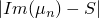
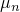

# 6.3.6 复特征值提取


**产品：**Abaqus/Standard  Abaqus/CAE  

##### **参考**

- ["定义分析"，第 6.1.2 节](pt03ch06s01abo05.md)
- ["通用分析步和线性摄动分析步"，第 6.1.3 节](pt03ch06s01aus44.md)
- [*COMPLEX FREQUENCY](../key/key-link.md#usb-kws-hcomplexfrequency)
- [《Abaqus/CAE 用户指南》第 14.11.2 节"配置线性摄动分析步"中的"配置复频率分析步"](../usi/usi-link.md#usi-sim-configure-complexfrequency)

### 概述

复特征值提取分析步：
- 执行特征值提取，计算系统的复特征值及对应的复振型；
- 是线性摄动分析步；
- 要求在复特征值提取步之前先执行特征频率提取步（["固有频率提取"，第 6.3.5 节](pt03ch06s03at10.md)）；
- 可使用高性能 SIM 软件架构（参见["动力分析步：概述"第 6.3.1 节](pt03ch06s03abo07.md#usb-anl-alineardynamics)中"将 SIM 架构用于模态叠加动力分析"）；
- 如果在基态步定义中包含了非线性几何效应，则将包含由预载荷和初始条件引起的初始应力和载荷刚度效应（["通用分析步和线性摄动分析步"，第 6.1.3 节](pt03ch06s01aus44.md)）；
- 可包含摩擦、阻尼和非对称载荷刚度贡献；
- 可包含声学有限单元中由底层平均流引起的非对称阻尼和刚度贡献（["声学、冲击及声-结构耦合分析"，第 6.10.1 节](pt03ch06s10at29.md)）；
- 不能用于定义为循环对称结构的模型（["循环对称模型分析"，第 10.4.3 节](pt04ch10s04at34.md)）。

### 复特征值提取

复特征值提取步使用投影方法提取当前系统的复特征值。有限元模型的特征值问题按以下形式建立：


其中


为质量矩阵（对称，通常为半正定）；


为阻尼矩阵；


为刚度矩阵（可包含初始应力刚度和摩擦效应，因此通常为非对称矩阵）；


为复特征值；


为右复特征向量；


为左复特征向量，定义如下：


*M* 和 *N*

为自由度。

Abaqus/Standard 中的复特征值提取步使用子空间投影方法；因此，在复特征值提取步之前，必须使用特征频率提取步提取具有对称刚度矩阵的无阻尼系统的特征模态。默认情况下，整个子空间均作为基向量使用；可按以下所述缩减该子空间。Abaqus/Standard 始终计算投影子空间中可用的所有复特征模态（考虑用户指定的子空间修改）。用户指定的请求特征模态数量和频率范围对计算的复特征模态数量没有影响，只决定报告的模态数量，且不能超过投影子空间的维度。若要修改计算的特征模态数量，可按以下所述缩减投影子空间，或相应修改前一固有频率提取步中提取的特征模态数量。如果未指定请求的复模态数量或频率范围，则所有计算的模态均将被报告。

为考虑非对称效应，复特征值提取步将自动使用非对称矩阵求解和存储方案。如果指定使用对称求解和存储方案（参见["定义分析"，第 6.1.2 节](pt03ch06s01abo05.md)），则非对称效应将被忽略。

| **输入文件用法：** | ``` [*COMPLEX FREQUENCY](../key/key-link.md#usb-kws-hcomplexfrequency) *复特征模态数, frequency_min, frequency_max* ``` |
| --- | --- |

| **Abaqus/CAE 用法：** | Step 模块：**Create Step**：**Linear perturbation**：**Complex frequency**：**Number of eigenvalues requested: All** 或 **Value**，**Minimum frequency of interest (cycles/time)：***value*，**Maximum frequency of interest (cycles/time)：***value* |
| --- | --- |

#### 移位点

可为复特征值提取步指定一个移位点 *S*（单位：每时间周期数，*S* ≥ 0）。Abaqus/Standard 按  递增顺序报告复特征模态 ，使虚部最接近给定移位点的模态优先报告。此功能在关注特定频率范围时很有用。默认不设移位。

| **输入文件用法：** | ``` [*COMPLEX FREQUENCY](../key/key-link.md#usb-kws-hcomplexfrequency) , , , *S* ``` |
| --- | --- |

| **Abaqus/CAE 用法：** | Step 模块：**Create Step**：**Linear perturbation**：**Complex frequency**：**Frequency shift (cycles/time):** *S* |
| --- | --- |

#### 规格化

复特征值提取分析中，位移规格化和模态复特征向量规格化均可用。在基于 SIM 的分析中，默认使用模态规格化。如果未使用 SIM 架构，则只有位移规格化可用。

如果选择位移规格化，复特征向量将被规格化为每个向量中最大值为 1 且虚部为零。如果选择模态规格化，则只对投影系统的复特征向量（GU）使用位移方法进行规格化，不对有限元子空间中的复特征向量进行规格化。对于大型特征值问题，位移规格化可能较耗时，因此推荐使用模态规格化。

| **输入文件用法：** | 使用以下选项选择位移规格化（如果不使用 SIM 架构，则为唯一选项）： |
| --- | --- |
|  | ``` [*COMPLEX FREQUENCY](../key/key-link.md#usb-kws-hcomplexfrequency), NORMALIZATION=DISPLACEMENT ``` 使用以下选项选择模态规格化（仅在使用 SIM 架构时可用）： ``` [*COMPLEX FREQUENCY](../key/key-link.md#usb-kws-hcomplexfrequency), NORMALIZATION=MODAL ``` |

| **Abaqus/CAE 用法：** | 在 Abaqus/CAE 中无法选择复特征向量的规格化方法；将使用默认方法。 |
| --- | --- |

#### 选择用于投影的特征模态

可选择具有对称刚度矩阵的无阻尼系统特征模态，在其上进行子空间投影。可通过单独指定模态编号、请求 Abaqus/Standard 自动生成模态编号，或请求属于指定频率范围内的特征模态来进行选择。如果不选择特征模态，则将使用前一特征频率提取步中提取的所有模态进行模态叠加。

| **输入文件用法：** | 使用以下选项之一通过模态编号选择特征模态： |
| --- | --- |
|  | ``` [*SELECT EIGENMODES](../key/key-link.md#usb-kws-hselecteigenmodes), DEFINITION=MODE NUMBERS [*SELECT EIGENMODES](../key/key-link.md#usb-kws-hselecteigenmodes), GENERATE, DEFINITION=MODE NUMBERS ``` 使用以下选项通过频率范围定义特征模态： ``` [*SELECT EIGENMODES](../key/key-link.md#usb-kws-hselecteigenmodes), DEFINITION=FREQUENCY RANGE ``` |

| **Abaqus/CAE 用法：** | 在 Abaqus/CAE 中无法选择特征模态；所有提取的模态均用于子空间投影。 |
| --- | --- |

#### 评估频率相关材料属性

当指定了频率相关材料属性时，Abaqus/Standard 提供在复特征值提取步中选择评估这些属性的频率的选项。此评估是必要的，因为在特征值提取步中无法修改算子。如果不选择频率，Abaqus/Standard 将在零频率下评估与频率相关的弹簧和阻尼器的刚度和阻尼，并且不考虑频域黏弹性的刚度和阻尼贡献。如果指定了频率，则会考虑频域黏弹性的刚度和阻尼贡献。

| **输入文件用法：** | ``` [*COMPLEX FREQUENCY](../key/key-link.md#usb-kws-hcomplexfrequency), PROPERTY EVALUATION=*frequency* ``` |
| --- | --- |

| **Abaqus/CAE 用法：** | Step 模块：**Create Step**：**Complex Frequency**：**Other**：**Evaluate dependent properties at frequency:** *value* |
| --- | --- |

#### 右复特征向量和左复特征向量

复特征值提取分析中，可请求右或左复特征向量。默认情况下提取右特征向量。左特征向量仅在基于 SIM 架构的分析中可用。可在同一分析中提取右和左复特征向量，但必须在不同步中请求。如果要同时提取右特征向量和左特征向量，应选择复特征向量的模态规格化。

| **输入文件用法：** | 使用以下选项提取右复特征向量： |
| --- | --- |
|  | ``` [*COMPLEX FREQUENCY](../key/key-link.md#usb-kws-hcomplexfrequency), RIGHT EIGENVECTORS （默认，如果不使用 SIM 架构则为唯一选项） ``` 使用以下选项提取左复特征向量： ``` [*COMPLEX FREQUENCY](../key/key-link.md#usb-kws-hcomplexfrequency), LEFT EIGENVECTORS （仅在使用 SIM 架构时可用） ``` |

| **Abaqus/CAE 用法：** | 在 Abaqus/CAE 中只能提取右复特征向量。 |
| --- | --- |

### 接触条件与滑动摩擦

Abaqus/Standard 自动检测由参考系运动或前一步中传输速度施加的速度差异而导致滑动的接触节点。在这些节点处，切向自由度不受约束，摩擦效应将对刚度矩阵产生非对称贡献。在其他接触节点处，切向自由度受到约束。

施加速度差异的接触节点处的摩擦可引起阻尼项。摩擦引起的阻尼效应有两种。第一种由摩擦力稳定垂直于滑移方向的振动引起，仅在三维分析中存在。第二种由速度相关摩擦系数引起。如果摩擦系数随速度增大而减小（通常如此），则该效应具有去稳定性，也称为"负阻尼"。更多详情参见[《Abaqus 理论指南》第 5.2.3 节"库仑摩擦"](../stm/stm-link.md#stm-ifc-coulombfric)。复特征值求解器允许在阻尼矩阵中包含这些摩擦引起的贡献。

| **输入文件用法：** | ``` [*COMPLEX FREQUENCY](../key/key-link.md#usb-kws-hcomplexfrequency), FRICTION DAMPING=YES ``` |
| --- | --- |

| **Abaqus/CAE 用法：** | Step 模块：**Create Step**：**Linear perturbation**：**Complex frequency**：**Include friction-induced damping effects** |
| --- | --- |

### 阻尼

在复特征值提取分析中，阻尼可通过阻尼器（参见["阻尼器"，第 32.2.1 节](pt06ch32s02alm38.md)）、与材料和单元关联的"瑞利"阻尼（参见["材料阻尼"，第 26.1.1 节](pt05ch26s01abm51.md)）以及无限单元或声学单元上的静边界来定义。此外，如上文["接触条件与滑动摩擦](pt03ch06s03at11.md#complexfreq-sliding)"所述，也可包含摩擦引起的阻尼。

结构阻尼、频域黏弹性的阻尼贡献以及所有类型的模态阻尼（复合模态阻尼除外）均在使用高性能 SIM 架构的复特征值提取中得到支持。

### 规定运动、传输速度和声学流速

运动、传输速度和声学流速影响复频率分析。运动和传输速度必须在前一稳态传输通用步中指定，其效应包含在复频率步中。声学流速在稳态传输步中不起作用，且在稳态传输步中指定的声学流速不传播到摄动步。声学流速必须在每个需要它的线性摄动步中指定。

### 初始条件

复特征值提取不能指定初始条件。

### 边界条件

复特征值提取期间不能定义边界条件。边界条件与前一固有频率提取分析中相同。

### 载荷

复特征值提取期间将忽略施加的载荷（["施加载荷：概述"，第 34.4.1 节](pt07ch34s04aus120.md)）。如果在包含非线性几何效应的前一通用分析步中施加了载荷，则在复特征值提取中将包含在前一通用分析步末尾确定的载荷刚度（参见["通用分析步和线性摄动分析步"，第 6.1.3 节](pt03ch06s01aus44.md)）。

科里奥利分布载荷对阻尼算子产生非对称贡献，目前仅在实体和杆单元中予以考虑。

### 预定义场

复特征值提取期间不能规定预定义场。

### 材料选项

必须定义材料的密度（参见["密度"，第 21.2.1 节](pt05ch21s02abm01.md)）。以下材料属性在复特征值提取期间不活跃：
- 塑性和其他非弹性效应；
- 速率相关材料属性（摩擦除外，如果接触界面存在速度差，摩擦可以是速率相关的）；
- 热属性；
- 质量扩散属性；
- 电学属性（尽管压电材料是活跃的）；
- 孔隙流体流动属性。

### 单元

除带扭转的广义轴对称单元外，Abaqus/Standard 中的任何应力/位移单元（包括带温度或压力自由度的单元）均可用于复特征值提取。

### 输出

特征值的实部（EIGREAL）和虚部（EIGIMAG）（ 和 ）、频率（每时间周期数，EIGFREQ）以及有效阻尼比（DAMPRATIO = ）将自动写入数据文件（`.dat`）和输出数据库文件（`.odb`）作为历程数据。此外，可请求将广义位移（GU，即投影系统的模态）写入输出数据库文件（参见["输出到输出数据库"，第 4.1.3 节](pt02ch04s01aus40.md)）。应力、应变和位移（代表振型）等输出变量也适用于每个特征值；这些量是摄动值，代表振型而非绝对值。

特征值提取步中唯一可用的能量密度是弹性应变能密度 SENER。所有输出变量标识符见["Abaqus/Standard 输出变量标识符"，第 4.2.1 节](pt02ch04s02abv01.md)。

可通过选择所需输出的模态来限制输出到数据文件和输出数据库文件（参见["输出到数据文件和结果文件"，第 4.1.2 节](pt02ch04s01aus39.md)）或["输出到输出数据库"，第 4.1.3 节](pt02ch04s01aus40.md)）。复特征值提取步不能输出到结果文件（`.fil`）。

#### 设置复特征模态的截止值

可设置复特征模态的截止值，使只有特征值实部高于截止值的复模态写入输出数据库文件。默认截止值为 0.0。如果未设置截止值，则所有复模态均输出。

| **输入文件用法：** | 使用以下选项之一选择输出复特征模态： |
| --- | --- |
|  | ``` [*COMPLEX FREQUENCY](../key/key-link.md#usb-kws-hcomplexfrequency), UNSTABLE MODES ONLY [*COMPLEX FREQUENCY](../key/key-link.md#usb-kws-hcomplexfrequency), UNSTABLE MODES ONLY=*value* ``` |

#### SIM 架构

复特征值提取分析可使用 SIM 架构进行。使用 SIM 架构执行复特征值提取步的优点如下：
- 考虑了结构阻尼，包括用黏弹性材料定义的阻尼；
- 可指定模态阻尼；
- 可定义表示刚度、质量和阻尼的矩阵（支持对称和非对称矩阵）；
- 可使用 AMS 特征值求解器生成复特征值提取的投影子空间。

使用 AMS 特征值求解器计算投影子空间时，应通过增大 AMS 参数值和增大最高关注频率来提高 AMS 特征值解的精度。基于 SIM 架构的复特征值提取分析不能使用耦合结构-声学模态。

### 输入文件模板

```
[*HEADING](../key/key-link.md#usb-kws-mheading)
…
[*SURFACE INTERACTION](../key/key-link.md#usb-kws-hsurfaceinteraction)
[*FRICTION](../key/key-link.md#usb-kws-hfriction)
*指定零摩擦系数*
[*BOUNDARY](../key/key-link.md#usb-kws-hboundary)
*指定零值边界条件的数据行*
[*INITIAL CONDITIONS](../key/key-link.md#usb-kws-minitialcond)
*指定初始条件的数据行*
**
[*STEP](../key/key-link.md#usb-kws-hstep) (,NLGEOM)
*如果使用 NLGEOM，则在特征值提取步中将包含初始应力和预载荷刚度效应*
[*STATIC](../key/key-link.md#usb-kws-hstatic)
…
[*CLOAD](../key/key-link.md#usb-kws-hcload) 和/或 [*DLOAD](../key/key-link.md#usb-kws-hdload)
*指定载荷的数据行*
[*TEMPERATURE](../key/key-link.md#usb-kws-htemperature) 和/或 [*FIELD](../key/key-link.md#usb-kws-hfield)
*指定预定义场值的数据行*
[*BOUNDARY](../key/key-link.md#usb-kws-hboundary)
*指定零值或非零边界条件的数据行*
[*END STEP](../key/key-link.md#usb-kws-hendstep)
**
[*STEP](../key/key-link.md#usb-kws-hstep)(,NLGEOM)
[*STATIC](../key/key-link.md#usb-kws-hstatic)
*定义增量的数据行*
[*CHANGE FRICTION](../key/key-link.md#usb-kws-hchangefriction)
[*FRICTION](../key/key-link.md#usb-kws-hfriction)
*重新定义摩擦系数的数据行*
[*MOTION](../key/key-link.md#usb-kws-hmotion), ROTATION 或 TRANSLATION
*定义速度差异的数据行*
[*END STEP](../key/key-link.md#usb-kws-hendstep)
**
[*STEP](../key/key-link.md#usb-kws-hstep)
[*FREQUENCY](../key/key-link.md#usb-kws-hfrequency)
*控制特征值提取的数据行*
[*END STEP](../key/key-link.md#usb-kws-hendstep)
**
[*STEP](../key/key-link.md#usb-kws-hstep)
[*COMPLEX FREQUENCY](../key/key-link.md#usb-kws-hcomplexfrequency)
*控制复特征值提取的数据行*
[*SELECT EIGENMODES](../key/key-link.md#usb-kws-hselecteigenmodes)
*定义适用模态范围的数据行*
[*END STEP](../key/key-link.md#usb-kws-hendstep)
```


