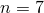
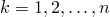
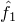
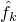
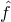
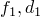
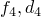
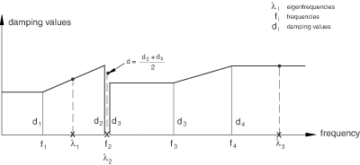

# 6.3.8 基于模态的稳态动力学分析


**产品：** Abaqus/Standard  Abaqus/CAE  

##### **参考文献**

- ["定义分析，" 第6.1.2节](pt03ch06s01abo05.md)
- ["一般和线性扰动过程，" 第6.1.3节](pt03ch06s01aus44.md)
- ["动态分析过程概述，" 第6.3.1节](pt03ch06s03abo07.md)
- ["直接求解稳态动力学分析，" 第6.3.4节](pt03ch06s03at09.md)
- ["固有频率提取，" 第6.3.5节](pt03ch06s03at10.md)
- ["基于子空间的稳态动力学分析，" 第6.3.9节](pt03ch06s03at14.md)
- [*STEADY STATE DYNAMICS](../key/key-link.md#usb-kws-hsteadystdyn)
- ["配置基于模态的稳态动力学分析" "配置线性扰动分析过程，" 第14.11.2节，Abaqus/CAE用户指南](../usi/usi-link.md#usi-sim-configure-steadystatemodal)

### 概述

基于模态的稳态动力学分析：
- 用于计算系统对谐波激励的稳态动态线性化响应；
- 是线性扰动过程；
- 根据系统的固有频率和模态计算响应；
- 需要在稳态动力学分析之前执行特征频率提取过程；
- 可以使用高性能SIM软件架构（参见["动态分析过程概述，" 第6.3.1节中的"使用SIM架构进行模态叠加动态分析"](pt03ch06s03abo07.md#usb-anl-alineardynamics)）；
- 仅在使用SIM架构时可以包括非对角阻尼效应（即来自材料或单元阻尼）；
- 是直接求解稳态动力学分析的替代方案，其中系统响应根据模型的物理自由度计算；
- 比直接求解或基于子空间的稳态动力学计算成本更低；
- 在存在显著材料阻尼时，不如直接求解或基于子空间的稳态分析准确；以及
- 能够将激励频率偏向于产生响应峰值的值。

### 引言

稳态动力学分析提供了系统对给定频率谐波激励的稳态振幅和相位响应。通常，这种分析是通过频率扫描来进行的，通过在一系列不同频率下施加载荷并记录响应来完成的；在Abaqus/Standard中，稳态动力学分析过程用于进行频率扫描。

在基于模态的稳态动力学分析中，响应基于模态叠加技术；系统的模态必须首先使用特征频率提取过程提取。模态将包括特征模态，如果在特征频率提取步骤中激活了残余模态，则还包括残余模态。提取的模态数量必须足以充分模拟系统的动态响应，这需要您自行判断。

在定义基于模态的稳态动力学步骤时，您指定感兴趣的频率范围以及每个范围中需要结果的频率数量（包括范围的边界频率）。此外，您可以指定要使用的频率间隔类型（线性或对数），如下所述（["选择频率间隔"](pt03ch06s03at13.md#usb-anl-asteadystdyn-freqspace)"）。对数频率间隔是默认值。频率以循环/时间为单位给出。

需要结果的这些频率点可以沿着频率轴等距分布（线性或对数刻度），或者可以通过引入偏置参数将它们偏向用户定义频率范围的端点（参见下文["偏置参数"](pt03ch06s03at13.md#usb-anl-asteadystdyn-biasparam)"）。

虽然此过程中的响应是线性振动，但先前的响应可以是非线性的。如果在任何一般分析步骤（在对稳态动力学过程之前的特征频率提取步骤之前）中包含了非线性几何效应（["一般和线性扰动过程，" 第6.1.3节"](pt03ch06s01aus44.md)），则稳态动力学响应中将包括初始应力效应（应力刚化）。

| **输入文件用法：** | ``` [*STEADY STATE DYNAMICS](../key/key-link.md#usb-kws-hsteadystdyn) ``` |
| --- | --- |
|  | 必须从[*STEADY STATE DYNAMICS](../key/key-link.md#usb-kws-hsteadystdyn)选项中省略DIRECT和SUBSPACE PROJECTION参数，以进行基于模态的稳态动力学分析。 |

| **Abaqus/CAE用法：** | 步骤模块：**创建步骤**：**线性扰动**：**稳态** **动力学，模态** |
| --- | --- |

#### 选择输出请求的频率间隔类型

对于基于模态的稳态动力学步骤的输出，允许三种类型的频率间隔。

##### 通过使用系统固有频率指定频率范围

默认情况下，使用固有频率类型的频率间隔；在这种情况下，在每个频率范围内存在以下间隔：
- 第一个间隔：从给定频率范围的下限到该范围内的第一个固有频率。
- 中间间隔：从固有频率到固有频率。
- 最后一个间隔：从该范围内的最高固有频率到频率范围的上限。

对于每个间隔，根据用户定义的点数（包括间隔的边界频率）和可选的偏置函数（如下文讨论，允许在频率范围内的固有频率附近更紧密地间隔采样点）来确定计算结果的频率。因此，可以详细定义共振频率附近的响应详情。[图6.3.8-1](pt03ch06s03at13.md#eigen-freq-range-div-ssd)展示了对5个计算点和等于1的偏置参数的频率范围划分。

| **输入文件用法：** | ``` [*STEADY STATE DYNAMICS](../key/key-link.md#usb-kws-hsteadystdyn), INTERVAL=EIGENFREQUENCY ``` |
| --- | --- |

| **Abaqus/CAE用法：** | 步骤模块：**创建步骤**：**线性扰动**：**稳态** **动力学，模态**：**使用固有频率划分每个频率范围** |
| --- | --- |

**图6.3.8-1** 固有频率类型间隔和5个计算点的范围划分。


##### 通过频率扩展指定频率范围

如果选择了扩展类型的频率间隔，则在频率范围内的每个固有频率周围存在间隔。对于每个间隔，使用用户定义的点数（包括间隔的边界频率）确定计算结果的等距频率。最小频率点数为3。如果用户定义的值小于3（或省略），则假定默认值为3个点。[图6.3.8-2](pt03ch06s03at13.md#usb-anl-asteadystdyn-spread-freq-range-div-ssds)展示了对5个计算点的频率范围划分。

偏置参数不支持扩展类型的频率间隔。

**图6.3.8-2** 扩展类型间隔和5个计算点的范围划分。和是系统的固有频率。


| **输入文件用法：** | ``` [*STEADY STATE DYNAMICS](../key/key-link.md#usb-kws-hsteadystdyn), INTERVAL=SPREAD *lwr_freq, upr_freq, numpts, bias_param, freq_scale_factor, spread* ``` |
| --- | --- |

| **Abaqus/CAE用法：** | 您无法在Abaqus/CAE中通过频率扩展指定频率范围。 |
| --- | --- |

##### 直接指定频率范围

如果选择了替代的范围类型频率间隔，则在指定频率范围内只有一个间隔，从范围的下限到上限。该间隔使用用户定义的点数和可选的偏置函数进行划分，偏置函数可用于将采样频率点偏向范围限制附近。对于范围类型的频率间隔，可能会错过系统固有频率附近的峰值响应，因为将报告输出的采样频率不会偏向固有频率。

| **输入文件用法：** | ``` [*STEADY STATE DYNAMICS](../key/key-link.md#usb-kws-hsteadystdyn), INTERVAL=RANGE ``` |
| --- | --- |

| **Abaqus/CAE用法：** | 步骤模块：**创建步骤**：**线性扰动**：**稳态** **动力学，模态**：**关闭** **使用固有频率划分每个频率范围** |
| --- | --- |

#### 选择频率间隔

对于基于模态的稳态动力学步骤，允许两种类型的频率间隔。对于对数频率间隔（默认值），使用对数刻度划分感兴趣的指定频率范围。或者，如果需要线性刻度，可以使用线性频率间隔。

| **输入文件用法：** | 使用以下任一选项： |
| --- | --- |
|  | ``` [*STEADY STATE DYNAMICS](../key/key-link.md#usb-kws-hsteadystdyn), FREQUENCY SCALE=LOGARITHMIC [*STEADY STATE DYNAMICS](../key/key-link.md#usb-kws-hsteadystdyn), FREQUENCY SCALE=LINEAR ``` |

| **Abaqus/CAE用法：** | 步骤模块：**创建步骤**：**线性扰动**：**稳态动力学，模态**：**刻度：对数**或**线性** |
| --- | --- |

#### 请求多个频率范围

您可以为基于模态的稳态动力学步骤请求多个频率范围或多个单频率点。

| **输入文件用法：** | ``` [*STEADY STATE DYNAMICS](../key/key-link.md#usb-kws-hsteadystdyn) *lwr_freq1, upr_freq1, numpts1, bias_param1, freq_scale_factor1* *lwr_freq2, upr_freq2, numpts2, bias_param2, freq_scale_factor2* ... *single_freq1* *single_freq2* ... ``` |
| --- | --- |
|  | 根据需要重复数据行。 |

| **Abaqus/CAE用法：** | 步骤模块：**创建步骤**：**线性扰动**：**稳态动力学，模态**：**数据**：在表中输入数据，并根据需要添加行 |
| --- | --- |

### 偏置参数

偏置参数可用于在每个频率间隔的中间或端点附近提供更紧密的结果点间隔。[图6.3.8-3](pt03ch06s03at13.md#biased-frequency-spacing-ssd)显示了几个偏置参数对频率间隔影响的示例。

**图6.3.8-3** 对于点数为的偏置参数对频率间隔的影响。


用于计算呈现结果的频率的偏置公式如下：


其中

*y*

；

*n*

是在频率间隔内给出结果的频率点数（上面讨论的）；

*k*

是这样的频率点之一（）；



是频率间隔的下限；


是频率间隔的上限；



是给出第*k*个结果的频率；

*p*

是偏置参数值；以及



是频率或频率的对数，取决于频率刻度参数的值。

大于1.0的偏置参数*p*在频率间隔的端点附近提供更紧密的结果点间隔，而小于1.0的*p*值在间隔中间附近提供更紧密的间隔。固有频率间隔的默认偏置参数为3.0，范围频率间隔的默认偏置参数为1.0。

### 频率刻度因子

频率刻度因子可用于缩放频率点。除频率范围的下限和上限外，所有频率点都乘以此因子。此刻度因子仅在使用系统固有频率指定频率间隔时才能使用（参见上文["通过使用系统固有频率指定频率范围"](pt03ch06s03at13.md#usb-anl-specify)"）。

### 选择模态和指定阻尼

您可以选择用于模态叠加的模态，并为所有选定的模态指定阻尼值。

#### 选择模态

您可以通过单独指定模态编号来选择模态，可以请求Abaqus/Standard自动生成模态编号，或者可以请求属于指定频率范围的模态。如果不选择模态，则在模态叠加中使用先前特征频率提取步骤中提取的所有模态，包括已激活的残余模态。

| **输入文件用法：** | 使用以下选项之一通过指定模态编号来选择模态： |
| --- | --- |
|  | ``` [*SELECT EIGENMODES](../key/key-link.md#usb-kws-hselecteigenmodes), DEFINITION=MODE NUMBERS [*SELECT EIGENMODES](../key/key-link.md#usb-kws-hselecteigenmodes), GENERATE, DEFINITION=MODE NUMBERS ``` 使用以下选项通过指定频率范围来选择模态：``` [*SELECT EIGENMODES](../key/key-link.md#usb-kws-hselecteigenmodes), DEFINITION=FREQUENCY RANGE ``` |

| **Abaqus/CAE用法：** | 您无法在Abaqus/CAE中选择模态；所有提取的模态都用于模态叠加。 |
| --- | --- |

#### 指定模态阻尼

对于稳态分析，几乎总是要指定阻尼（参见["材料阻尼，" 第26.1.1节"](pt05ch26s01abm51.md)）。如果缺少阻尼，当激励频率等于结构的固有频率时，结构的响应将是无界的。要获得定量准确的结果，特别是在自然频率附近，准确指定阻尼属性至关重要。可用的各种阻尼选项在["材料阻尼，" 第26.1.1节"](pt05ch26s01abm51.md)中讨论。您可以为响应计算中使用的全部或部分模态定义阻尼系数。阻尼系数可以为指定模态编号或指定频率范围给出。当通过指定频率范围来定义阻尼时，模态的阻尼系数在指定频率之间线性插值。频率范围可以是不连续的；对于不连续处的固有频率，将应用平均阻尼值。阻尼系数在指定频率范围之外假定为常数。

| **输入文件用法：** | 使用以下选项通过指定模态编号来定义阻尼： |
| --- | --- |
|  | ``` [*MODAL DAMPING](../key/key-link.md#usb-kws-hmodaldamp), DEFINITION=MODE NUMBERS ``` 使用以下选项通过指定频率范围来定义阻尼：``` [*MODAL DAMPING](../key/key-link.md#usb-kws-hmodaldamp), DEFINITION=FREQUENCY RANGE ``` 使用以下选项通过全局因子定义阻尼： |

| **Abaqus/CAE用法：** | 使用以下输入通过指定模态编号来定义阻尼： |
| --- | --- |
|  | 步骤模块：**创建步骤**：**线性扰动**：**稳态动力学，模态**：**阻尼** 在Abaqus/CAE中不支持通过指定频率范围来定义阻尼。 |

##### 指定阻尼的示例

[图6.3.8-4](pt03ch06s03at13.md#amodaldynamics-damprules-1)说明了如何根据以下输入确定不同固有频率处的阻尼系数：

```
[*MODAL DAMPING](../key/key-link.md#usb-kws-hmodaldamp), DEFINITION=FREQUENCY RANGE




```

**图6.3.8-4** 通过频率范围指定的阻尼值。



##### 选择模态和指定阻尼系数的规则

选择模态和指定模态阻尼系数遵循以下规则：
- 默认情况下不包含模态阻尼。
- 模态选择和模态阻尼必须以相同方式指定，使用模态编号或频率范围。
- 如果不选择任何模态，则叠加中将使用先前频率分析中提取的所有模态，包括已激活的残余模态。
- 如果不为已选择的模态指定阻尼系数，则这些模态将使用零阻尼值。
- 阻尼仅应用于所选的模态。
- 所选模态中超出指定频率范围的阻尼系数为常数，等于指定第一个或最后一个频率的阻尼系数（取决于哪个更近）。这与Abaqus解释振幅定义的方式一致。

#### 指定全局阻尼

为方便起见，您可以为所有选定的特征模态指定恒定的全局阻尼因子，用于质量比例和刚度比例黏性阻尼，以及刚度比例结构阻尼。更多详细信息，请参见["动态分析过程概述，" 第6.3.1节中的"动态分析中的阻尼"](pt03ch06s03abo07.md#usb-anl-adynamicproc-damp)。

| **输入文件用法：** | ``` [*GLOBAL DAMPING](../key/key-link.md#usb-kws-hglobaldamping), ALPHA=*factor*, BETA=*factor*, STRUCTURAL=*factor* ``` |
| --- | --- |

| **Abaqus/CAE用法：** | 在Abaqus/CAE中不支持通过全局因子定义阻尼。 |
| --- | --- |

#### 材料阻尼

结构和黏性材料阻尼（参见["材料阻尼，" 第26.1.1节"](pt05ch26s01abm51.md)）在基于SIM的稳态动力学分析中被考虑。由于阻尼到模态形状的投影仅在频率提取步骤期间执行一次，因此使用基于SIM的稳态动力学过程可以显著提高性能优势（参见["动态分析过程概述，" 第6.3.1节中的"使用SIM架构进行模态叠加动态分析"](pt03ch06s03abo07.md#usb-anl-alineardynamics)）。

如果阻尼算子依赖于频率，则将在频率提取过程中指定的属性评估频率下进行评估。

如果需要，您可以停用基于模态的稳态动力学过程中的结构或黏性阻尼。

| **输入文件用法：** | 使用以下选项在特定稳态动力学步骤中停用结构和黏性阻尼： |
| --- | --- |
|  | ``` [*DAMPING CONTROLS](../key/key-link.md#usb-kws-hdampingcontrols), STRUCTURAL=NONE, VISCOUS=NONE ``` |

| **Abaqus/CAE用法：** | 在Abaqus/CAE中不支持阻尼控制。 |
| --- | --- |

### 初始条件

基础状态是先前一般分析步骤结束时模型的当前状态。如果分析的第一步是扰动步骤，则基础状态由初始条件决定（["Abaqus/Standard和Abaqus/Explicit中的初始条件，" 第34.2.1节"](pt07ch34s02aus116.md)）。不能直接在稳态动力学分析中使用直接定义解变量（如速度）的初始条件定义。

### 边界条件

在基于模态的稳态动力学分析中，任何自由度的实部和虚部要么被约束，要么不被约束；一部分被约束而另一部分不被约束在物理上是不可能的。Abaqus/Standard将自动约束自由度的实部和虚部，即使只约束了一部分。

#### 基础运动

在基于模态的动态响应过程中，不可能直接规定非零位移和旋转作为边界条件（["Abaqus/Standard和Abaqus/Explicit中的边界条件，" 第34.3.1节"](pt07ch34s03aus118.md)）。因此，在基于模态的稳态动力学分析中，只能将节点的运动规定为基础运动；在模态叠加过程中，作为边界条件给出的非零位移或加速度历史定义被忽略，并且特征频率提取步骤中支撑条件的变化被标记为错误。模态叠加过程中规定基础运动的方法在["瞬态模态动态分析，" 第6.3.7节"](pt03ch06s03at12.md)中描述。

基础运动可以由位移、速度或加速度历史定义。对于声压，位移用于描述声压历史。如果规定的激发记录以位移或速度历史的形式给出，Abaqus/Standard对其进行微分以获得加速度历史。默认情况下，机械自由度给出加速度历史，声压给出位移。

当使用辅助基时，将为模型中应用的每个"大"质量提取低频特征模态。在这种情况下选择频率下限范围时要小心。"大"质量模态在模态叠加中很重要。但是，不应请求零或任意低频率水平的响应，因为这迫使Abaqus/Standard计算这些"大"质量固有频率之间的响应，这是不希望的。

##### 频率相关基础运动

振幅定义可用于将基础运动的振幅指定为频率的函数（["振幅曲线，" 第34.1.2节"](pt07ch34s01aus115.md)）。

| **输入文件用法：** | 使用以下两个选项： |
| --- | --- |
|  | ``` [*AMPLITUDE](../key/key-link.md#usb-kws-mamplitude), NAME=*name* [*BASE MOTION](../key/key-link.md#usb-kws-hbasemotion), REAL or IMAGINARY, AMPLITUDE=*name* ``` |

| **Abaqus/CAE用法：** | 载荷模块；**创建边界条件**；**步骤：***step_name*；**类别：机械**；**所选步骤的类型：****位移基础运动**或**速度基础运动**或**加速度基础运动**；**基本**标签页：**自由度：****U1**，**U2**，**U3**，**UR1**，**UR2**或**UR3**；**振幅：***name* |

### 载荷

在基于模态的稳态动力学分析中可以规定以下载荷，如["集中载荷，" 第34.4.2节"](pt07ch34s04aus121.md)中所述：
- 可以将集中节点力应用于位移自由度（1-6）。
- 可以施加分布式压力力或体力；特定单元可用的分布式载荷类型在[第六部分，"单元"](pt06.md)中描述。

这些载荷假定在用户指定的频率范围内随时间正弦变化。载荷以其实部和虚部给出。

流体通量载荷不能用于稳态动力学分析。

| **输入文件用法：** | 使用以下输入行之一来定义载荷的实部（同相）： |
| --- | --- |
|  | ``` [*CLOAD](../key/key-link.md#usb-kws-hcload) *or* [*DLOAD](../key/key-link.md#usb-kws-hdload) [*CLOAD](../key/key-link.md#usb-kws-hcload) *or* [*DLOAD](../key/key-link.md#usb-kws-hdload), REAL ``` 使用以下输入行来定义载荷的虚部（异相）：``` [*CLOAD](../key/key-link.md#usb-kws-hcload) *or* [*DLOAD](../key/key-link.md#usb-kws-hdload), IMAGINARY ``` |

| **Abaqus/CAE用法：** | 载荷模块：载荷编辑器：*实部（同相）* **+** *虚部（异相）* **i** |
| --- | --- |

#### 频率相关载荷

振幅定义可用于将载荷的振幅指定为频率的函数（["振幅曲线，" 第34.1.2节"](pt07ch34s01aus115.md)）。

| **输入文件用法：** | 使用以下两个选项： |
| --- | --- |
|  | ``` [*AMPLITUDE](../key/key-link.md#usb-kws-mamplitude), NAME=*name* [*CLOAD](../key/key-link.md#usb-kws-hcload) *or* [*DLOAD](../key/key-link.md#usb-kws-hdload), REAL or IMAGINARY, AMPLITUDE=*name* ``` |

| **Abaqus/CAE用法：** | 载荷或相互作用模块：**创建振幅**：**名称：***name* |
| --- | --- |
|  | 载荷模块：载荷编辑器：*实部（同相）* **+** *虚部（异相）* **i**：**振幅：***name* |

### 预定义场

在基于模态的稳态动力学分析中不允许使用预定义温度场。其他预定义场被忽略。

### 材料选项

与任何动态分析过程一样，必须在需要动态响应的模型任何单独部件的一些区域中指定质量或密度（["密度，" 第21.2.1节"](pt05ch21s02abm01.md)）。以下材料属性在基于模态的稳态动力学分析期间不活跃：塑性和其它非弹性效应、黏弹性效应、热属性、质量扩散属性、电属性（压电分析中的电位除外）以及孔隙流体流动属性——参见["一般和线性扰动过程，" 第6.1.3节"](pt03ch06s01aus44.md)。

### 单元

Abaqus/Standard中可用的以下单元可用于稳态动力学过程：
- 应力/位移单元（除了广义轴对称扭曲单元）；
- 声学单元；
- 压电单元；或
- 静水压力流体单元。

参见["为分析类型选择合适的单元，" 第27.1.3节"](pt06ch27s01aus112.md)。

### 输出

在基于模态的稳态动力学分析中，应变（E）或应力（S）等输出变量的值是具有实部和虚部的复数。对于数据文件输出，第一行打印实部，第二行列出虚部。结果和数据文件输出变量也提供以获取许多变量的幅值和相位（参见["Abaqus/Standard输出变量标识符，" 第4.2.1节"](pt02ch04s02abv01.md)）。在这种情况下，数据文件中的第一行给出幅值，第二行给出相位角。

以下变量专门为稳态动力学分析提供：

单元积分点变量：

| PHS | 所有应力分量的幅值和相位角。 |
| --- | --- |

| PHE | 所有应变分量的幅值和相位角。 |
| --- | --- |

| PHEPG | 电势梯度向量的幅值和相位角。 |
| --- | --- |

| PHEFL | 电通量向量的幅值和相位角。 |
| --- | --- |

| PHMFL | 流体连接单元中质量流率的幅值和相位角。 |
| --- | --- |

| PHMFT | 流体连接单元中总质量流的幅值和相位角。 |
| --- | --- |

对于连接器单元，以下单元输出变量可用：

| PHCTF | 连接器总力的幅值和相位角。 |
| --- | --- |

| PHCEF | 连接器弹性力的幅值和相位角。 |
| --- | --- |

| PHCVF | 连接器黏性力的幅值和相位角。 |
| --- | --- |

| PHCRF | 连接器反力的幅值和相位角。 |
| --- | --- |

| PHCSF | 连接器摩擦力的幅值和相位角。 |
| --- | --- |

| PHCU | 连接器相对位移的幅值和相位角。 |
| --- | --- |

| PHCCU | 连接器本构位移的幅值和相位角。 |
| --- | --- |

节点变量：

| PU | 节点处所有位移/旋转分量的幅值和相位角。 |
| --- | --- |

| PPOR | 节点处流体或声压的幅值和相位角。 |
| --- | --- |

| PHPOT | 节点处电位的幅值和相位角。 |
| --- | --- |

| PRF | 节点处所有反力/力矩的幅值和相位角。 |
| --- | --- |

| PHCHG | 节点处无功电荷的幅值和相位角。 |
| --- | --- |

在基于模态的稳态动力学分析中，不提供单元能量密度（如弹性应变能密度SENER）和整个单元能量（如单元的总动能ELKE）的输出。

标准输出变量U、V、A以及上面列出的变量PU对应于基于模态的分析中相对于主基的运动。总值（包括主基的运动）也可用：

| TU | 节点处所有位移/旋转分量的总幅值。 |
| --- | --- |

| TV | 节点处所有速度分量的总幅值。 |
| --- | --- |

| TA | 节点处所有加速度分量的总幅值。 |
| --- | --- |

| PTU | 节点处所有总位移/旋转分量的幅值和相位角。 |
| --- | --- |

以下模态变量也可用于基于模态的稳态动力学分析，并可输出到数据、结果和/或输出数据库文件（参见["输出到数据和结果文件，" 第4.1.2节"](pt02ch04s01aus39.md)和["输出到输出数据库，" 第4.1.3节"](pt02ch04s01aus40.md)）：

| GU | 所有模态的广义位移。 |
| --- | --- |

| GV | 所有模态的广义速度。 |
| --- | --- |

| GA | 所有模态的广义加速度。 |
| --- | --- |

| GPU | 所有模态的广义位移的相位角。 |
| --- | --- |

| GPV | 所有模态的广义速度的相位角。 |
| --- | --- |

| GPA | 所有模态的广义加速度的相位角。 |
| --- | --- |

| SNE | 每个模态整个模型的弹性应变能。 |
| --- | --- |

| KE | 每个模态整个模型的动能。 |
| --- | --- |

| T | 每个模态整个模型的外功。 |
| --- | --- |

| BM | 基础运动。 |
| --- | --- |

整个模型变量（如ALLIE（总应变能））可用于基于模态的稳态动力学，作为输出到数据、结果和/或输出数据库文件（参见["输出到数据和结果文件，" 第4.1.2节"](pt02ch04s01aus39.md)）。

### 输入文件模板

```
[*HEADING](../key/key-link.md#usb-kws-mheading)
…
[*AMPLITUDE](../key/key-link.md#usb-kws-mamplitude), NAME=loadamp
*数据行定义作为频率（循环/时间）函数的振幅曲线*
[*AMPLITUDE](../key/key-link.md#usb-kws-mamplitude), NAME=base
*数据行定义用于规定基础运动的振幅曲线*
**
[*STEP](../key/key-link.md#usb-kws-hstep), NLGEOM
*包含NLGEOM参数，以便在稳态动力学步骤中包括应力刚化效应*
[*STATIC](../key/key-link.md#usb-kws-hstatic)
***任何可用于预加载结构的一般分析过程*
…
[*CLOAD](../key/key-link.md#usb-kws-hcload) 和/或 [*DLOAD](../key/key-link.md#usb-kws-hdload)
*数据行规定预载荷*
[*TEMPERATURE](../key/key-link.md#usb-kws-htemperature) 和/或 [*FIELD](../key/key-link.md#usb-kws-hfield)
*数据行定义用于预加载结构的预定义场的值*
[*BOUNDARY](../key/key-link.md#usb-kws-hboundary)
*数据行指定边界条件以预加载结构*
[*END STEP](../key/key-link.md#usb-kws-hendstep)
**
[*STEP](../key/key-link.md#usb-kws-hstep)
[*FREQUENCY](../key/key-link.md#usb-kws-hfrequency)
*数据行控制特征值提取*
[*BOUNDARY](../key/key-link.md#usb-kws-hboundary)
*数据行将自由度分配给主基*
[*BOUNDARY](../key/key-link.md#usb-kws-hboundary), BASE NAME=base2
*数据行将自由度分配给辅助基*
[*END STEP](../key/key-link.md#usb-kws-hendstep)
**
[*STEP](../key/key-link.md#usb-kws-hstep)
[*STEADY STATE DYNAMICS](../key/key-link.md#usb-kws-hsteadystdyn)
*数据行指定频率范围和偏置参数*
[*SELECT EIGENMODES](../key/key-link.md#usb-kws-hselecteigenmodes)
*数据行定义适用的模态范围*
[*MODAL DAMPING](../key/key-link.md#usb-kws-hmodaldamp)
*数据行定义模态阻尼因子*
[*BASE MOTION](../key/key-link.md#usb-kws-hbasemotion), DOF=*dof*, AMPLITUDE=base
[*BASE MOTION](../key/key-link.md#usb-kws-hbasemotion), DOF=*dof*, AMPLITUDE=base, BASE NAME=base2
[*CLOAD](../key/key-link.md#usb-kws-hcload) 和/或 [*DLOAD](../key/key-link.md#usb-kws-hdload), AMPLITUDE=loadamp
*数据行指定正弦变化的频率相关载荷*
…
[*END STEP](../key/key-link.md#usb-kws-hendstep)
```
