# 6.3.11 随机响应分析


**产品：**Abaqus/Standard  Abaqus/CAE  

##### **参考**

- [『定义分析，第 6.1.2 节』](pt03ch06s01abo05.md)
- [『一般和线性扰动过程，第 6.1.3 节』](pt03ch06s01aus44.md)
- [『动态分析过程：概述，第 6.3.1 节』](pt03ch06s03abo07.md)
- [*RANDOM RESPONSE](../key/key-link.md#usb-kws-hrandomresp)
- [*PSD-DEFINITION](../key/key-link.md#usb-kws-mpsddef)
- [*CORRELATION](../key/key-link.md#usb-kws-hcorrelat)
- [『在 Abaqus/CAE 用户指南的第 14.11.2 节"配置线性扰动分析过程"中配置随机响应过程』](../usi/usi-link.md#usi-sim-configure-randomresponse)

### 概述

随机响应分析：
- 是一种线性扰动过程，用于给出模型对用户定义的随机激励的线性化动态响应；以及
- 使用在前一个特征频率提取步骤中提取的模态集来计算响应变量（应力、应变、位移等）的功率谱密度以及这些相同变量的相应均方根（RMS）值。

### 随机响应分析

随机响应分析预测系统对以统计方式表示的非确定性连续激励的响应，该激励通过交叉谱密度矩阵表示。由于载荷是非确定性的，只能以统计方式表征；Abaqus/Standard 假设激励是平稳的和遍历的。这些统计测量在『[Abaqus Theory Guide 的第 2.5.8 节"随机响应分析"](../stm/stm-link.md#stm-anl-randomresp)'中有详细解释。随机响应过程可用于确定飞机对湍流的响应、汽车对路面不平度的响应、结构对喷气噪声的响应，或建筑物对地震的响应。

在最一般的情况下，激励被定义为频率相关的交叉谱密度（CSD）矩阵。除涉及移动噪声或用户子程序 [`UCORR`](../sub/sub-link.md#sub-xsl-ucorr) 的情况外，假设对于给定的载荷工况，CSD 矩阵可以分离为一个与频率相关的复值标量函数和一个与频率无关的复值空间相关矩阵的乘积。此假设有助于减少计算时间和所需的用户输入量，但意味着给定载荷工况中 CSD 矩阵的每个元素具有相同的频率依赖性。您可以为每个载荷工况定义不同的频率依赖性，但一个载荷工况中的载荷不会与另一个载荷工况中的载荷相关。因此，系统 CSD 矩阵通过简单求和（叠加）各个载荷工况的 CSD 矩阵来组装。

与频率相关的标量函数可以由用户定义的复值频率函数的加权和组成。这些用户定义的频率函数以功率谱密度为单位指定。您为每个频率函数分配权重，并指定定义特定载荷工况中不同位置和不同方向激励之间相关性的空间相关矩阵的属性。频率函数和相关性的讨论如下；请参阅『[定义频率函数](pt03ch06s03at16.md#usb-anl-arandomresponse-psdfunction)'和『[定义相关性](pt03ch06s03at16.md#usb-anl-arandomresponse-correlation)'。

载荷可以定义为集中点载荷、分布载荷、连接器单元载荷或基底运动激励，如下所述在『[边界条件](pt03ch06s03at16.md#usb-anl-arandomresponse-bc)'和『[载荷](pt03ch06s03at16.md#usb-anl-arandomresponse-load)'中。对于集中点载荷、连接器载荷和基底运动，可以定义多个不相关的载荷工况。载荷工况 1 保留用于在特定步骤中定义的所有分布载荷。在这些步骤中，载荷工况 1 不能用于任何集中点载荷、连接器载荷或基底运动。因此，分布载荷与任何其他载荷之间不存在任何相关性。此外，基底运动激励假设与任何其他载荷类型统计独立（不相关），即使使用相同的载荷工况编号。如果使用相同的载荷工况编号，则假设集中点和连接器单元载荷是相关的。

随机响应过程基于使用系统模态的子集，这些模态必须首先使用特征频率提取过程进行提取。模态将包括特征模态，如果在特征频率提取步骤中激活了残余模态，则也包括残余模态。提取的模态数量必须足以充分模拟系统的动态响应，这取决于您的判断。模型可以在特征频率提取之前进行预加载。如果在用于施加预载荷的一般分析过程中包含几何非线性，则在特征频率提取中使用的刚度中包含初始应力效应（『[一般和线性扰动过程，第 6.1.3 节](pt03ch06s01aus44.md)'）。

模型的随机响应表示为节点和单元变量的功率谱密度值及其均方根值。

#### 定义频率范围

您指定随机响应过程感兴趣的频率范围。响应在感兴趣的最低频率与范围内第一个特征频率之间、范围内每个特征频率之间以及范围内最后一个特征频率与最高频率之间的多个点计算，如[图 6.3.11-1](pt03ch06s03at16.md#eigen-freq-range-div-rr)所示。每个间隔中的默认计算点数为 20；您可以在定义步骤时更改此编号。只有使用足够多的点才能获得准确的 RMS 值，以便 Abaqus/Standard 能够准确积分整个频率范围。偏置函数允许频率刻度上的点更靠近特征频率排列，从而允许详细定义共振频率附近的响应并进行更准确的积分。

**图 6.3.11-1** 使用模态和 5 个计算点划分范围。


| **输入文件用法：** | ``` [*RANDOM RESPONSE](../key/key-link.md#usb-kws-hrandomresp) *lower_freq_limit, upper_freq_limit, num_calc_pts, bias_parameter, freq_scale* ``` |
| --- | --- |

| **Abaqus/CAE 用法：** | 步骤模块：**Create Step**：**Linear perturbation**：**Random response** |
| --- | --- |

#### 偏置参数

偏置参数可用于在每个频率间隔的中间或两端附近提供更紧密的结果点间距。[图 6.3.11-2](pt03ch06s03at16.md#biased-frequency-spacing-rr) 显示了偏置参数对频率间距影响的一些示例。

**图 6.3.11-2** 对于多个点，偏置参数对频率间距的影响 。


用于计算给出结果的频率的偏置公式如下：


其中

*y*

；

*n*

是给出结果的频率点的数量；

*k*

是这样的一个频率点（）；


是频率间隔的下限；


是间隔的上限；


是给出第 k 个结果的频率；

*p*

是偏置参数值；以及


是频率或频率的对数，取决于所选的频率刻度。

大于 1.0 的偏置参数 *p* 在每个频率间隔的两端附近提供更紧密的结果点间距（如上例所示），而小于 1.0 的 *p* 值在每个频率间隔的中间附近提供更紧密的间距。随机响应分析的偏置参数默认值为 3.0。

### 定义频率函数

要定义随机载荷，您需要指定一个频率函数和一个引用该频率函数的交叉相关定义。频率函数定义为模型数据（即它们与步骤无关），必须命名。在给定值之间插值时使用对数-对数刻度。

激励的 CSD 矩阵中的单位类型作为频率函数定义的一部分指定。默认类型是功率单位。如果激励的 CSD 矩阵是由基底运动引起的，则单位必须以 *g* 为单位，您应该定义重力加速度。或者，可以指定分贝单位；此单位类型如下所述。

| **输入文件用法：** | 使用以下选项之一来定义频率函数： |
| --- | --- |
|  | ``` [*PSD-DEFINITION](../key/key-link.md#usb-kws-mpsddef), NAME=*name*, TYPE=FORCE (default; power units) [*PSD-DEFINITION](../key/key-link.md#usb-kws-mpsddef), NAME=*name*, TYPE=BASE, G=*g* [*PSD-DEFINITION](../key/key-link.md#usb-kws-mpsddef), NAME=*name*, TYPE=DB, DB REFERENCE= ``` |

| **Abaqus/CAE 用法：** | Load 模块：**Create Amplitude**；**Type：** **PSD Definition**；**Specification units：** **Power**、**Decibel** 或 **Gravity** |
| --- | --- |

#### 用分贝单位定义交叉谱密度矩阵

在 Abaqus/Standard 中，分贝值 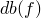 与频率函数 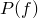 通过以下完整倍频程转换公式关联：

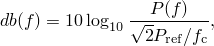

其中 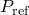 是用户指定的参考功率， 是中心频率（请参阅[表 6.3.11-1](pt03ch06s03at16.md#table-arandomresponse-bands)）。

**表 6.3.11-1** 标准倍频程。

| 频段编号 | 频段中心（频率，Hz） |
| --- | --- |
| 1 | 1.0 |
| 2 | 2.0 |
| 3 | 4.0 |
| 4 | 8.0 |
| 5 | 16.0 |
| 6 | 31.5 |
| 7 | 63.0 |
| 8 | 125.0 |
| 9 | 250.0 |
| 10 | 500.0 |
| 11 | 1000.0 |
| 12 | 2000.0 |
| 13 | 4000.0 |
| 14 | 8000.0 |
| 15 | 16000.0 |

因此，频率函数来自以分贝单位定义的函数，如下所示


如果您有替代频率刻度（例如三分之一倍频程）的数据，则可以获得等效的完整倍频程功率参考值，如『[Abaqus Theory Guide 的第 2.5.8 节"随机响应分析"](../stm/stm-link.md#stm-anl-randomresp)'中所述。

 必须以分贝为单位指定为频段的函数；相关的中心频率在[表 6.3.11-1](pt03ch06s03at16.md#table-arandomresponse-bands)中给出。

#### 定义频率函数的替代方法

您可以在外部文件或用户子程序中定义频率函数。

##### 在外部文件中定义频率函数

定义频率函数的数据可以包含在外部文件中。

| **输入文件用法：** | ``` [*PSD-DEFINITION](../key/key-link.md#usb-kws-mpsddef), NAME=*name*, TYPE=*type*, INPUT=*file name* ``` |
| --- | --- |

| **Abaqus/CAE 用法：** | Load 模块：**Create Amplitude**；**Type：** **PSD Definition**；**Specification units：** **Power**、**Decibel** 或 **Gravity**；**Real**、**Imaginary**、**Frequency** |
| --- | --- |

##### 在用户子程序中定义频率函数

复杂的频率函数可以通过用户子程序 [`UPSD`](../sub/sub-link.md#sub-xsl-upsd) 比直接输入数据更容易定义。

| **输入文件用法：** | ``` [*PSD-DEFINITION](../key/key-link.md#usb-kws-mpsddef), NAME=*name*, TYPE=*type*, USER ``` |
| --- | --- |
|  | 如果指定了 USER 参数，则给出的任何数据行都将被忽略。 |

| **Abaqus/CAE 用法：** | Load 模块：**Create Amplitude**；**Type：** **PSD Definition**；**Specification units：** **Power** 或 **Gravity**；开启 **Specify data in an external user subroutine** |
| --- | --- |

### 定义相关性

您定义施加的节点载荷或基底运动之间的交叉相关性。您还可以通过交叉相关定义分配频率函数的缩放（权重）因子。分布载荷被转换为等效的节点载荷，就交叉相关性而言，它们被视为单独的 point loads。交叉相关性在随机响应步骤中定义，并引用特定的载荷工况编号和频率函数。

可以定义三种类型的相关性：不相关、相关和移动噪声。只要未选择移动噪声类型，就可以根据需要指定尽可能多的相关性来定义随机载荷；如果选择移动噪声类型，则在步骤定义中只能出现一个相关性。
- 对于相关类型，考虑交叉谱密度矩阵中的所有项，这意味着载荷工况内所有自由度上的载荷完全相关（统计上相互依赖）。
- 对于不相关类型，仅考虑交叉谱密度矩阵中的对角项，这意味着一个自由度上的载荷与另一个自由度上的载荷之间不存在相关性。在将不相关类型与分布载荷一起使用时应谨慎，因为等效的节点力将彼此不相关（统计独立）。
- 对于移动噪声类型，相关性矩阵中的项取决于施加载荷的点之间的相对位置。此类型只能与集中点载荷和分布载荷结合使用。此外，移动噪声公式假设交叉相关性引用的频率函数定义了噪声源的参考功率谱密度函数。（这是一个参考功率谱密度，因为以后可以通过指定为分布、集中点或连接器单元载荷的载荷 magnitude 进行缩放。）由于对于实值变量，功率谱密度是实值的，因此当与移动噪声类型的交叉相关性一起使用时，频率函数不得包含虚部。

| **输入文件用法：** | 使用以下选项之一来定义相关性： |
| --- | --- |
|  | ``` [*CORRELATION](../key/key-link.md#usb-kws-hcorrelat), TYPE=CORRELATED, PSD=*name* [*CORRELATION](../key/key-link.md#usb-kws-hcorrelat), TYPE=UNCORRELATED, PSD=*name* [*CORRELATION](../key/key-link.md#usb-kws-hcorrelat), TYPE=MOVING NOISE ``` 对于移动噪声类型，必须在每个数据行上给出对功率谱密度函数的引用。 |

| **Abaqus/CAE 用法：** | Load 模块；**Create Boundary Condition**；**Step：** *random_response_step*；**Category: Mechanical**；**Types for Selected Step:** **Displacement base motion** 或 **Velocity base motion** 或 **Acceleration base motion**；**Correlation** 标签页：开启 **Specify correlation**；**Approach**：**Correlated** 或 **Uncorrelated**；**PSD**：*psd_amplitude_name* |
| --- | --- |

#### 指定相关性矩阵是否为复数

对于相关或不相关的交叉相关性，您可以指定空间相关矩阵中是否包含实部和虚部。此规范不影响为功率谱密度频率函数给出的虚部。

| **输入文件用法：** | 使用以下选项之一： |
| --- | --- |
|  | ``` [*CORRELATION](../key/key-link.md#usb-kws-hcorrelat), TYPE=CORRELATED, COMPLEX=YES or NO, PSD=*name* [*CORRELATION](../key/key-link.md#usb-kws-hcorrelat), TYPE=UNCORRELATED, COMPLEX=YES or NO, PSD=*name* ``` |

| **Abaqus/CAE 用法：** | Load 模块；**Create Boundary Condition**；**Step：** *random_response_step*；**Category: Mechanical**；**Types for Selected Step:** **Displacement base motion** 或 **Velocity base motion** 或 **Acceleration base motion**；**Correlation** 标签页：开启 **Specify correlation**；**Approach**：**Correlated** 或 **Uncorrelated**；**PSD**：*psd_amplitude_name*；**Real**；**Imaginary** |
| --- | --- |

#### 定义相关性的替代方法

您可以在外部输入文件或用户子程序中定义相关性。

##### 在外部输入文件中定义相关性

定义相关性的数据可以包含在外部输入文件中。

| **输入文件用法：** | ``` [*CORRELATION](../key/key-link.md#usb-kws-hcorrelat), TYPE=*type*, PSD=*name*, INPUT=*file_name* ``` |
| --- | --- |

| **Abaqus/CAE 用法：** | 您不能在 Abaqus/CAE 中在外部文件中定义相关性。 |
| --- | --- |

##### 在用户子程序中定义相关性

简单的激励（如不相关的白噪声）很容易定义。涉及更复杂相关性的激励（包括 CSD 矩阵元素具有不同频率依赖性的情况）可以通过用户子程序 [`UCORR`](../sub/sub-link.md#sub-xsl-ucorr) 定义。如果指定了用户子程序，则相关性定义中只需输入载荷工况编号。用户子程序不能用于定义移动噪声相关性。

对于不相关的交叉相关性，仅使用 [`UCORR`](../sub/sub-link.md#sub-xsl-ucorr) 中指定的相关性矩阵的对角项。各种施加载荷与交叉相关性的组合在下面更详细地讨论。

| **输入文件用法：** | 使用以下选项之一： |
| --- | --- |
|  | ``` [*CORRELATION](../key/key-link.md#usb-kws-hcorrelat), TYPE=CORRELATED, USER, COMPLEX=YES or NO, PSD=*name* [*CORRELATION](../key/key-link.md#usb-kws-hcorrelat), TYPE=UNCORRELATED, USER, PSD=*name* ``` |

| **Abaqus/CAE 用法：** | Load 模块；**Create Boundary Condition**；**Step：** *random_response_step*；**Category: Mechanical**；**Types for Selected Step:** **Displacement base motion** 或 **Velocity base motion** 或 **Acceleration base motion**；**Correlation** 标签页：开启 **Specify correlation**；**Approach**：**User** |
| --- | --- |

### 选择模态并指定阻尼

您可以选择要用于模态叠加的模态，并为所有选定的模态指定阻尼值。

#### 选择模态

您可以通过单独指定模态编号来选择模态，请求 Abaqus/Standard 自动生成模态编号，或请求属于指定频率范围的模态。如果您不选择模态，则使用先前特征频率提取步骤中提取的所有模态（包括残余模态，如果它们被激活）进行模态叠加。

| **输入文件用法：** | 使用以下选项之一通过指定模态编号来选择模态： |
| --- | --- |
|  | ``` [*SELECT EIGENMODES](../key/key-link.md#usb-kws-hselecteigenmodes), DEFINITION=MODE NUMBERS [*SELECT EIGENMODES](../key/key-link.md#usb-kws-hselecteigenmodes), GENERATE, DEFINITION=MODE NUMBERS ``` 使用以下选项通过指定频率范围来选择模态： ``` [*SELECT EIGENMODES](../key/key-link.md#usb-kws-hselecteigenmodes), DEFINITION=FREQUENCY RANGE ``` |

| **Abaqus/CAE 用法：** | 您不能在 Abaqus/CAE 中选择模态；使用所有提取的模态进行模态叠加。 |
| --- | --- |

#### 指定阻尼

对于随机响应分析，几乎总是指定阻尼（请参阅『[材料阻尼，第 26.1.1 节](pt05ch26s01abm51.md)'）。如果没有阻尼，当激励频率等于结构的特征频率时，结构的响应将是无界的。为了获得定量的准确结果，特别是在自然频率附近，准确指定阻尼属性至关重要。可用的各种阻尼选项在『[材料阻尼，第 26.1.1 节](pt05ch26s01abm51.md)'中讨论。您可以为响应计算中使用的所有或部分模态定义阻尼系数。阻尼系数可以为指定的模态编号或指定的频率范围给出。当通过指定频率范围定义阻尼时，模态的阻尼系数在指定频率之间线性插值。频率范围可以是不连续的；在不连续处，特征频率将应用平均阻尼值。阻尼系数在指定频率范围之外被认为是恒定的，等于指定的第一个或最后一个频率的阻尼系数（取决于哪个更近）。

| **输入文件用法：** | 使用以下选项通过指定模态编号来定义阻尼： |
| --- | --- |
|  | ``` [*MODAL DAMPING](../key/key-link.md#usb-kws-hmodaldamp), DEFINITION=MODE NUMBERS ``` 使用以下选项通过指定频率范围来定义阻尼： ``` [*MODAL DAMPING](../key/key-link.md#usb-kws-hmodaldamp), DEFINITION=FREQUENCY RANGE ``` |

| **Abaqus/CAE 用法：** | 使用以下输入通过指定模态编号来定义阻尼： |
| --- | --- |
|  | 步骤模块：**Create Step**：**Linear perturbation**：**Random response**：**Damping** 在 Abaqus/CAE 中不支持通过指定频率范围来定义阻尼。 |

##### 指定阻尼的示例

[图 6.3.11-3](pt03ch06s03at16.md#amodaldynamics-damprules-3) 说明了如何确定以下输入在不同特征频率处的阻尼系数：

```
[*MODAL DAMPING](../key/key-link.md#usb-kws-hmodaldamp), DEFINITION=FREQUENCY RANGE


```

**图 6.3.11-3** 通过频率范围指定的阻尼值。


#### 选择模态和指定阻尼系数的规则

以下规则适用于选择模态和指定模态阻尼系数：
- 默认不包含模态阻尼。
- 模态选择和模态阻尼必须以相同的方式指定，使用模态编号或频率范围。
- 如果您不选择任何模态，则使用先前频率分析中提取的所有模态（包括残余模态，如果它们被激活）进行叠加。
- 如果您不为所选模态指定阻尼系数，则这些模态将使用零阻尼值。
- 阻尼仅应用于所选的模态。
- 超出指定频率范围的所选模态的阻尼系数是恒定的，等于为第一个或最后一个频率指定的阻尼系数（取决于哪个更近）。这与 Abaqus 解释幅值定义的方式一致。

### 初始条件

在随机响应分析中指定初始条件是不合适的。

### 边界条件

在基于模态的动态响应过程中，不能直接将非零位移和旋转指定为边界条件（『[Abaqus/Standard 和 Abaqus/Explicit 中的边界条件，第 34.3.1 节](pt07ch34s03aus118.md)'）。因此，在随机响应分析中，节点的运动只能指定为基底运动；作为边界条件给出的非零位移、速度或加速度历史定义将被忽略，并且从特征频率提取步骤开始对支撑条件的任何更改都将被标记为错误。此外，在随机响应分析中，任何幅值定义都将被忽略。

在模态叠加过程中指定运动的方法在『[瞬态模态动态分析，第 6.3.7 节](pt03ch06s03at12.md)'中描述。在随机响应分析中，只能定义一个（主要）基底。

#### 定义多个载荷工况

由基底运动定义的激励被分配到编号的载荷工况。然后在交叉相关性定义中引用这些载荷工况。载荷工况通过交叉相关性定义中的引用与频率函数相关联。可以定义任意数量的载荷工况，但如果在同一步骤中定义了分布载荷，则不能使用载荷工况编号 1。

| **输入文件用法：** | ``` [*BASE MOTION](../key/key-link.md#usb-kws-hbasemotion), LOAD CASE=*n* ``` |
| --- | --- |

| **Abaqus/CAE 用法：** | Abaqus/CAE 中不支持带载荷工况的基底运动。 |
| --- | --- |

#### 将基底运动激励转换为交叉谱密度矩阵

当激励由基底运动提供时，它直接通过模态参与因子投影到特征空间上转换为交叉谱密度矩阵（请参阅『[固有频率提取，第 6.3.5 节](pt03ch06s03at10.md)'），给出

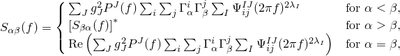

其中上标 * 表示复共轭，其中

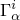

是激励方向 *i* 中模态  的模态参与因子（*i*=1–6）；

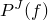

是由第 *J* 个交叉相关性引用并定义为频率 *f*（单位为 *g*）的函数的频率函数；


是一个权重因子矩阵，指示与载荷工况 *I* 的方向 *i* 和 *j* 之间基底运动之间的相关性相关联的 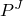 的分数，如下所述；


，1 或 2，取决于与载荷工况 *I* 对应的基底运动是根据加速度谱、速度谱还是位移谱定义的（请参阅『[瞬态模态动态分析，第 6.3.7 节](pt03ch06s03at12.md)'）；以及

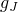

是用户为定义  的相同功率谱密度函数指定的重力加速度。

如果交叉相关性在用户子程序 [`UCORR`](../sub/sub-link.md#sub-xsl-ucorr) 中定义，则 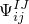 在用户子程序中定义。否则，


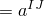 对于所有 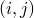（如果激励是相关的）或


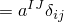（如果激励是不相关的），

其中 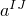 是权重因子的（复）值，用于缩放在载荷工况 *I* 中使用的频率函数 。

### 载荷

随机响应分析的载荷通过交叉谱密度矩阵 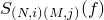 概括定义，其中 *f* 是每单位时间的频率，下标 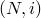 和 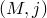 分别指节点 *N* 的自由度 *i* 和节点 *M* 的自由度 *j*。分布载荷被转换为等效的节点载荷，就相关性矩阵的公式而言，以与集中点载荷相同的方式处理。 的单位是（力）^2 或（力矩）^2 每频率。此外，在随机响应分析中，集中点、连接器单元或分布载荷定义上的任何幅值引用都将被忽略。

#### 定义多个载荷工况

分布载荷将自动分配给载荷工况编号 1。您将集中点载荷或连接器单元载荷分配给编号的载荷工况。可以指定任意数量的集中点和连接器单元载荷工况，但如果在同一步骤中存在分布载荷，则不能将载荷工况编号 1 用于集中点或连接器单元载荷。集中点、连接器单元和分布载荷工况通过交叉相关性定义与频率函数相关联。

| **输入文件用法：** | 使用以下一个或多个选项： |
| --- | --- |
|  | ``` [*CLOAD](../key/key-link.md#usb-kws-hcload), LOAD CASE=*n* [*CONNECTOR LOAD](../key/key-link.md#usb-kws-hconnectorload), LOAD CASE=*m* [*DLOAD](../key/key-link.md#usb-kws-hdload) ``` |

#### 相关和不相关载荷

对于相关或不相关的交叉相关性，交叉谱密度矩阵定义为

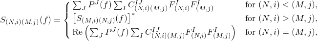

其中上标 * 表示复共轭，其中

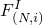

是施加到载荷工况 *I* 节点 *N* 的自由度 *i* 上的载荷 magnitude；


是由第 *J* 个交叉相关性引用并定义为频率 *f*（功率（力）或分贝单位）的函数的频率函数；以及

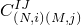

是一个权重因子矩阵，指示与载荷工况 *I* 的  交叉相关性项相关联的  的分数，如下所述。

如果交叉相关性在用户子程序 [`UCORR`](../sub/sub-link.md#sub-xsl-ucorr) 中定义，则  在用户子程序中定义。否则，


 对于所有 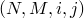（如果激励是相关的）或


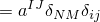（如果激励是不相关的），

其中  是权重因子的（复）值，用于缩放在载荷工况 *I* 中使用的频率函数 。

#### 移动噪声载荷

对于移动噪声交叉相关性，交叉谱密度矩阵定义为

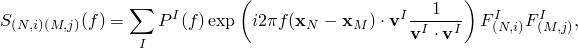

其中


是施加到载荷工况 *I* 节点 *N* 的自由度 *i* 上的载荷 magnitude；

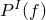

是与载荷工况 *I* 相关联的参考功率谱密度函数，定义为频率 *f*（功率（力）或分贝单位）的函数；

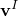

是载荷工况 *I* 给出的噪声传播速度向量；以及

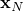

是节点 *N* 的坐标。

移动噪声的这种定义意味着不同的噪声源没有交叉相关性。因此，它最常仅与一个噪声源一起使用（仅 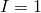）。此外，由于  是移动噪声源的实际功率谱密度，它必须定义为实值函数。

### 预定义场

预定义场（包括温度）不能在随机响应分析中使用。

### 材料选项

与任何动态分析过程一样，必须在需要动态响应的模型各个独立部分的某些区域分配质量或密度（『[密度，第 21.2.1 节](pt05ch21s02abm01.md)'）。以下材料属性在随机响应分析期间不活跃：塑性和其它非弹性效应、率相关属性、热属性、质量扩散属性、电属性和孔隙流体流动属性（请参阅『[一般和线性扰动过程，第 6.1.3 节](pt03ch06s01aus44.md)'）。

### 单元

除了具有扭转的广义轴对称单元外，Abaqus/Standard 中的任何应力/位移单元都可用于随机响应分析（请参阅『[为分析类型选择适当的单元，第 27.1.3 节](pt06ch27s01aus112.md)'）。

### 输出

在随机响应分析中，变量的值是其功率谱密度；Abaqus/Standard 中的所有输出变量都在『[Abaqus/Standard 输出变量标识符，第 4.2.1 节](pt02ch04s02abv01.md)'中列出。功率谱密度值不适用于集中载荷、分布载荷和 SINV。

在随机响应分析中还提供了获取某些变量均方根值的选项，如下所述。总值包括基底运动，而相对值是相对于基底运动测量的。

单元积分点变量：

| RS | 所有应力分量的均方根。 |
| --- | --- |

| RE | 所有应变分量的均方根。 |
| --- | --- |

单元节点变量：

| MISES | Mises 等效应力。 |
| --- | --- |

| RMISES | Mises 等效应力的均方根。 |
| --- | --- |

对于连接器单元，以下单元输出变量可用：

| RCTF | 连接器总力的均方根。 |
| --- | --- |

| RCEF | 连接器弹性力的均方根。 |
| --- | --- |

| RCVF | 连接器粘性力的均方根。 |
| --- | --- |

| RCRF | 连接器反力的均方根。 |
| --- | --- |

| RCSF | 连接器摩擦力的均方根。 |
| --- | --- |

| RCU | 连接器相对位移的均方根。 |
| --- | --- |

| RCCU | 连接器本构位移的均方根。 |
| --- | --- |

节点变量：

| RU | 节点处相对位移/旋转的所有分量的均方根值。 |
| --- | --- |

| RTU | 节点处总位移/旋转的所有分量的均方根值。 |
| --- | --- |

| RV | 节点处相对速度的所有分量的均方根值。 |
| --- | --- |

| RTV | 节点处总速度的所有分量的均方根值。 |
| --- | --- |

| RA | 节点处相对加速度的所有分量的均方根值。 |
| --- | --- |

| RTA | 节点处总加速度的所有分量的均方根值。 |
| --- | --- |

| RRF | 节点处反力和反力矩所有分量的均方根值。 |
| --- | --- |

随机响应分析没有能量值可用。

为了降低随机响应分析的计算成本，您应该仅请求选定单元和节点集的输出。Abaqus/Standard 将仅计算请求的单元和节点变量的响应。

当请求 MISES 或 RMISES 输出时，Abaqus/Standard 将所需数据存储在输出数据库（`.odb`）文件中，而 Abaqus/Viewer 进行响应的实际计算。这些计算需要随机响应步骤之前的频率步骤中的单元应力输出。请注意，在随机响应步骤中的输出请求中指定单元集的名称对这些两个输出变量没有影响。如果需要选定单元集的 MISES 或 RMISES 输出，则需要在 preceding 频率步骤中的单元应力输出请求中指定该单元集的名称。与其他过程不同，随机响应分析的 MISES 和 RMISES 输出在单元节点处计算，而不是在单元积分点处计算。

### 输入文件模板

```
[*HEADING](../key/key-link.md#usb-kws-mheading)
…
[*PSD-DEFINITION](../key/key-link.md#usb-kws-mpsddef), NAME=*name*, TYPE=*type*
*Data lines to define a frequency function (or PSD function for moving noise)*
**
[*STEP](../key/key-link.md#usb-kws-hstep)
[*FREQUENCY](../key/key-link.md#usb-kws-hfrequency)
*Data line to control eigenvalue extraction*
[*BOUNDARY](../key/key-link.md#usb-kws-hboundary)
*Data lines to assign degrees of freedom to the primary base*
[*END STEP](../key/key-link.md#usb-kws-hendstep)
[*STEP](../key/key-link.md#usb-kws-hstep)
[*RANDOM RESPONSE](../key/key-link.md#usb-kws-hrandomresp)
*Data line to specify frequency range of interest*
[*SELECT EIGENMODES](../key/key-link.md#usb-kws-hselecteigenmodes)
*Data lines to define the applicable mode ranges*
[*MODAL DAMPING](../key/key-link.md#usb-kws-hmodaldamp)
*Data line to define modal damping*
[*CORRELATION](../key/key-link.md#usb-kws-hcorrelat), PSD=*name*, TYPE=*type*
*Data lines to specify correlation for various excitation load cases (n, p)*
[*DLOAD](../key/key-link.md#usb-kws-hdload)
*Data lines to define distributed loads*
[*CLOAD](../key/key-link.md#usb-kws-hcload), LOAD CASE=*n*
*Data lines to define concentrated loads in load case n*
[*CONNECTOR LOAD](../key/key-link.md#usb-kws-hconnectorload), LOAD CASE=*m*
*Data lines to define connector loads in load case m*
[*BASE MOTION](../key/key-link.md#usb-kws-hbasemotion), DOF=*dof*, LOAD CASE=*p*
*Data lines to define base motion p*
[*END STEP](../key/key-link.md#usb-kws-hendstep)
```


