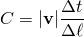
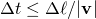
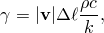

# 6.5.2 非耦合热传递分析


**产品：**Abaqus/Standard  Abaqus/CFD  Abaqus/CAE  

##### **参考**

- [『定义分析，第 6.1.2 节』](pt03ch06s01abo05.md)
- [『热传递分析过程：概述，第 6.5.1 节』](pt03ch06s05abo08.md)
- [*HEAT TRANSFER](../key/key-link.md#usb-kws-hheattrans)
- [『在热传递分析中包含体积热生成，Abaqus/CAE 用户指南第 12.10.2 节』](../usi/usi-link.md#usi-prp-thermal-heatgeneration)
- [『在"配置一般分析过程"的第 14.11.1 节中配置热传递过程』](../usi/usi-link.md#usi-sim-configure-heattransfer)

### 概述

非耦合热传递问题：
- 是那些在不考虑所研究物体中的温度场应力/变形或电场的情况下计算温度场的问题；
- 可以包括传导、边界对流和边界辐射；
- 可以是瞬态或稳态；以及
- 可以是线性或非线性的。

在 Abaqus/Standard 中，非耦合热传递问题：
- 涉及固体中的热传递；
- 可以包括腔体辐射效应——请参阅『[腔体辐射，第 41.1.1 节](pt09ch41s01aus187.md)'；
- 如果使用强制对流/扩散热传递单元，可以包括通过网格的强制对流；
- 可以包括接触表面之间的热相互作用，如间隙辐射、传导和热生成——请参阅『[热接触属性，第 37.2.1 节](pt09ch37s02aus174.md)'；
- 可以包括在用户子程序 [`UMATHT`](../sub/sub-link.md#sub-xsl-umatht) 中定义的热材料行为——请参阅『[用户定义热材料行为，第 26.7.2 节](pt05ch26s07abm70.md)'；以及
- 需要使用热传递单元。

在 Abaqus/CFD 中，非耦合热传递问题：
- 涉及固体中的热传递；
- 不得涉及流体流动；以及
- 需要使用具有固体截面的流体单元类型——请参阅『[流体单元库，第 28.2.2 节](pt06ch28s02ael07.md)'。

### Abaqus/Standard 中的热传递分析

非耦合热传递分析用于模拟固体热传导，具有一般的、温度依赖性电导率、内部能量（包括潜热效应）以及相当一般的对流和辐射边界条件，包括腔体辐射。如果使用强制对流/扩散单元，可以通过网格对流体进行强制对流建模。

#### 热传递分析中非线性的来源

热传递问题可能具有非线性，因为材料属性是温度依赖性的，或者因为边界条件是非线性的。通常，与温度依赖性材料属性相关的非线性是轻微的，因为属性不会随温度快速变化。但是，当包含潜热效应时，分析可能严重非线性（请参阅『[潜热，第 26.2.4 节](pt05ch26s02abm57.md)'）。

边界条件通常是非线性的；例如，薄膜系数可以是表面温度的函数。同样，非线性通常是轻微的，几乎不会造成困难。一个例外是"沸腾"薄膜条件，其中薄膜系数可以非常快速地变化，因为与表面相邻的流体沸腾。可以使用温度依赖性和场变量依赖性薄膜系数轻松模拟（在步骤内或从一步到另一步的）快速变化的薄膜条件。辐射效应始终使热传递问题非线性化。辐射中的非线性随着温度升高而增加。

Abaqus/Standard 使用迭代方案来求解非线性热传递问题。该方案使用牛顿法，并进行了一些修改以在存在高度非线性潜热效应时提高迭代过程的稳定性。

涉及严重非线性的稳态情况有时作为瞬态情况求解更有效，因为热容项的稳定影响。所需的稳态解可以作为非常长的瞬态时间响应获得；瞬态将简单地使该长时间响应的解稳定。

#### 矩阵存储和求解方案

在涉及腔体辐射或强制对流/扩散单元的热传递分析中，方程组是非对称的。在这些情况下自动调用非对称矩阵存储和求解方案（请参阅『[定义分析，第 6.1.2 节](pt03ch06s01abo05.md)'）。

#### 稳态分析

稳态分析意味着控制热传递方程中的内部能量项（比热项）被省略。因此，问题没有固有的物理上有意义的时间尺度。尽管如此，您可以为分析步骤分配初始时间增量、总时间段以及允许的最大和最小时间增量，这对于输出标识以及指定具有不同 magnitude 的预定温度和通量通常很方便。

应在步骤内给出要在稳态热传递步骤期间施加的任何通量或边界条件更改，使用适当的幅值引用来指定它们的"时间"变化（『[幅值曲线，第 34.1.2 节](pt07ch34s01aus115.md)'）。如果为步骤指定了没有幅值引用的通量和边界条件，则假定它们在步骤期间随"时间"线性变化，从前一步骤结束时的 magnitude（或零，如果这是分析的开始）到热传递步骤结束时的 newly 指定 magnitude。

| **输入文件用法：** | ``` [*HEAT TRANSFER](../key/key-link.md#usb-kws-hheattrans), STEADY STATE ``` |
| --- | --- |

| **Abaqus/CAE 用法：** | 步骤模块：**Create Step**：**General**：**Heat transfer**：**Response:** **Steady state** |
| --- | --- |

##### 自动增量

选择稳态分析时，您可以建议初始"时间"增量并为步骤定义"时间"周期；然后 Abaqus/Standard 将相应地逐步完成步骤。默认情况下，Abaqus/Standard 自动为步骤的每个增量确定合适的增量大小。

##### 固定增量

您也可以使用固定增量方案，其中 Abaqus/Standard 在整个步骤持续时间内使用相同的增量大小。建议的初始"时间"增量  定义了增量大小。

| **输入文件用法：** | 将初始增量、最小增量大小和最大增量大小设置为相同的值： |
| --- | --- |
|  | ``` [*HEAT TRANSFER](../key/key-link.md#usb-kws-hheattrans), STEADY STATE , , ,  ``` |

| **Abaqus/CAE 用法：** | 步骤模块：**Create Step**：**General**：**Heat transfer**：**Response: Steady-state**：**Incrementation**：**Type: Fixed**：**Increment size:**  |
| --- | --- |

#### 瞬态分析

纯传导单元中的瞬态问题时间积分使用后向欧拉法（有时也称为改进的 Crank-Nicholson 算子）进行。此方法对于线性问题是无条件稳定的。

强制对流/扩散单元使用梯形法则进行时间积分。它们包括数值扩散控制（"上游"Petrov-Galerkin 方法）和可选的数值色散控制。具有色散控制的单元在流体瞬态响应重要的情况下提供改进的求解精度。人工色散控制对时间增量大小引入稳定性限制，使得局部 Courant 数



必须小于 1，其中  是时间增量， 是速度向量的大小， 是流动方向上特征单元长度；即，热不能在单个时间增量内通过对流通过多个单元长度  传输。在均匀速度场中，最小的单元将决定稳定时间增量。在网格设计阶段近似计算 Courant 数 *C* 有助于避免过小的稳定时间增量。不具有色散控制的单元没有这种稳定性限制；因此，在瞬态情况下使用没有此功能的单元可能更经济，因为流体本身的瞬态效应不是求解的关键部分（例如，当重要求解是包含在模型中的固体中的温度场时，且流体中的特征瞬态时间比固体中的特征瞬态时间短得多）。

瞬态热传递分析中的时间增量可以由您直接控制或由 Abaqus/Standard 自动控制。通常首选自动时间增量。

##### 自动增量

可以根据用户预定的每个增量最大允许节点温度变化  自动选择时间增量。Abaqus/Standard 将限制时间增量以确保在任何分析增量期间任何节点（具有边界条件的节点除外）都不会超过此值（请参阅『[瞬态问题中的时间积分精度，第 7.2.4 节](pt03ch07s02aus52.md)'）。

| **输入文件用法：** | ``` [*HEAT TRANSFER](../key/key-link.md#usb-kws-hheattrans), DELTMX= ``` |
| --- | --- |

| **Abaqus/CAE 用法：** | 步骤模块：**Create Step**：**General**：**Heat transfer**：**Response: Transient**：**Incrementation**：**Type: Automatic**：**Max. allowable temperature change per increment:**  |
| --- | --- |

##### 固定增量

如果您选择直接增量且未指定 ，则在整个分析中将使用等于用户指定的初始时间增量  的固定时间增量。

| **输入文件用法：** | ``` [*HEAT TRANSFER](../key/key-link.md#usb-kws-hheattrans)  ``` |
| --- | --- |

| **Abaqus/CAE 用法：** | 步骤模块：**Create Step**：**General**：**Heat transfer**：**Response: Transient**：**Incrementation**：**Type: Fixed**：**Increment size:**  |
| --- | --- |

##### 由于小时间增量导致的虚假振荡

在使用二阶单元的瞬态热传递分析中，最小可用时间增量与单元大小之间存在关系。简单准则为


其中  是时间增量， 是密度，*c* 是比热，*k* 是热导率， 是典型单元尺寸（例如单元一侧的长度）。如果在二阶单元网格中使用小于此值的时间增量，则求解中可能出现虚假振荡，特别是在温度快速变化的边界附近。这些振荡是非物理的，如果存在温度依赖性材料属性，则可能会导致问题。Abaqus/Standard 不对用户定义的初始时间增量提供检查；您必须确保给定值不违反上述准则。

在使用一阶单元的瞬态分析中，热容项是集成的，这消除了此类振荡，但可能导致局部不准确的求解，特别是在小时间增量的热通量方面。如果需要更小的时间增量，则应在温度变化的区域中使用更精细的网格。

除非您作为热传递步骤定义的一部分指定最大允许时间增量大小，否则时间增量大小没有上限（积分过程是无条件稳定的，至少对于线性问题是这样）。但是，如果模型中包含具有数值色散控制的强制对流/扩散单元（包括元素类型 DCC*xx*D），则允许时间增量存在数值稳定性限制。要求是 ，其中  是流体速度的大小， 是流动方向上特征单元长度。Abaqus/Standard 将自动调整时间增量以满足此稳定性限制。

##### 结束瞬态分析

瞬态分析可以通过完成指定的时间周期来终止，也可以继续直到达到稳态条件。默认情况下，分析将在给定时间周期完成时结束。或者，您可以指定分析在达到稳态后或给定时间周期后结束，以先到者为准。稳态由温度变化率定义：当每个温度自由度的温度以小于用户指定的速率（作为步骤定义的一部分给出）变化时，分析终止。

| **输入文件用法：** | 使用以下选项在达到时间周期时结束分析： |
| --- | --- |
|  | ``` [*HEAT TRANSFER](../key/key-link.md#usb-kws-hheattrans), END=PERIOD (default) ``` 使用以下选项基于温度变化率结束分析： ``` [*HEAT TRANSFER](../key/key-link.md#usb-kws-hheattrans), END=SS ``` |

| **Abaqus/CAE 用法：** | 步骤模块：**Create Step**：**General**：**Heat transfer**：**Response: Transient**：**Incrementation**：**End step when temperature change is less than** |
| --- | --- |

#### 内部热生成

材料内部的体积热生成可以在用户子程序 [`HETVAL`](../sub/sub-link.md#sub-xsl-hetval) 或用户子程序 [`UMATHT`](../sub/sub-link.md#sub-xsl-umatht) 中定义。这些用户子程序是互斥的。

##### 在用户子程序 [`HETVAL`](../sub/sub-link.md#sub-xsl-hetval) 中定义内部热生成

如果使用用户子程序 [`HETVAL`](../sub/sub-link.md#sub-xsl-hetval) 定义内部热生成，则热生成必须与材料定义中的其他热属性定义一起包含。

热生成可能与解过程中发生的（相对较低）能量相变有关。这种热生成通常依赖于状态变量（如转变分数），这些变量本身随解演变并存储为依赖求解的状态变量（请参阅『[用户子程序：概述，第 18.1.1 节](pt04ch18s01aus104.md)'）。热生成在用户子程序 [`HETVAL`](../sub/sub-link.md#sub-xsl-hetval) 中计算，其中任何相关的状态变量也可以更新。对于材料定义中包含热生成的材料计算点，将调用该子程序。

| **输入文件用法：** | ``` [*HEAT GENERATION](../key/key-link.md#usb-kws-mheatgen) ``` |
| --- | --- |

| **Abaqus/CAE 用法：** | 属性模块：材料编辑器：**Thermal**：**Heat Generation** |
| --- | --- |

##### 在用户子程序 [`UMATHT`](../sub/sub-link.md#sub-xsl-umatht) 中定义内部热生成

如果使用用户子程序 [`UMATHT`](../sub/sub-link.md#sub-xsl-umatht) 定义内部热生成，则所有其他热属性也必须在子程序中定义。

| **输入文件用法：** | ``` [*USER MATERIAL](../key/key-link.md#usb-kws-musermaterial) ``` |
| --- | --- |

| **Abaqus/CAE 用法：** | 属性模块：材料编辑器：**General**：**User Material**：**User material type: Thermal** |
| --- | --- |

#### 通过网格的强制对流

如果使用强制对流/扩散热传递单元，则可以预定通过网格流动的流体的速度。流体与相邻强制对流/扩散热传递单元之间的传导将受到流体质量流率的影响。例如，如果管道充满具有初始温度曲线的流体，该曲线包含温度脉冲，则初始温度脉冲不仅会扩散（由于流体和管道中的传导），还会被传输（或对流）沿管道向下。由于流体速度是预定的，因此称为强制对流。

当由热梯度产生的流体密度差异引起流体运动时（浮力驱动的流动），就会发生自然对流。强制对流/扩散单元不是为了处理此现象而设计的；必须预定流动。

您可以指定节点处每单位面积的质量流率（或一维单元通过整个截面的质量流率）。Abaqus/Standard 将质量流率插值到材料点。随着对流支配扩散，包含对流的瞬态热传递方程的数值求解变得越来越困难。Peclet 数  是一个无量纲参数，指示对流相对于扩散的主导程度：



其中  是速度向量的大小， 是密度，*c* 是比热，*k* 是热导率， 是流动方向上特征单元长度。 的较大值表示在由单元大小  定义的空间尺度上，对流支配扩散。一般来说，不应使用大于约 1000 的 Peclet 数。

Abaqus/Standard 中使用 Petrov-Galerkin 有限元来准确模拟具有高 Peclet 数的系统；这些单元使用非对称的上游加权函数来控制数值扩散和色散，从而稳定结果。上风项部分取决于单元 Peclet 数，如『[Abaqus Theory Guide 的第 2.11.3 节"对流/扩散"](../stm/stm-link.md#stm-anl-convectelems)'中所述。

如果流体沿着预定温度快速变化的边界流动，则实际上它会受到热瞬态的影响，即使对于稳态分析也是如此。这种瞬态可能导致与本节前面讨论的瞬态热传递分析中观察到的相同类型的虚假温度振荡。由于 Abaqus/Standard 对流热传递使用一阶单元，因此可以通过集成热容项来消除振荡。但是，上游加权函数阻止了流动方向上的集成。因此，虚假振荡仍可能发生，特别是如果流动不完全与发生温度变化的边界相切。

| **输入文件用法：** | 在热传递步骤定义中使用以下选项来预定流体速度： |
| --- | --- |
|  | ``` [*MASS FLOW RATE](../key/key-link.md#usb-kws-hmassflowrate) ``` |

| **Abaqus/CAE 用法：** | 质量流率在 Abaqus/CAE 中不受支持。 |
| --- | --- |

##### 修改或移除质量流率

默认情况下，给出的质量流率是对现有流率的修改或作为先前定义的任何质量流率的附加应用。您可以移除所有先前定义的质量流率，并可选择指定新的质量流率。

| **输入文件用法：** | 使用以下选项修改现有流率或指定附加流率： |
| --- | --- |
|  | ``` [*MASS FLOW RATE](../key/key-link.md#usb-kws-hmassflowrate), OP=MOD (default) ``` 使用以下选项释放所有先前施加的流率并指定新的流率： ``` [*MASS FLOW RATE](../key/key-link.md#usb-kws-hmassflowrate), OP=NEW ``` |

| **Abaqus/CAE 用法：** | 质量流率在 Abaqus/CAE 中不受支持。 |
| --- | --- |

##### 指定时间依赖性质量流率

如果需要，可以将质量流率与幅值定义结合使用，以将流率大小控制为时间的函数（『[幅值曲线，第 34.1.2 节](pt07ch34s01aus115.md)'）。

| **输入文件用法：** | 使用以下两个选项来定义时间依赖性质量流率： |
| --- | --- |
|  | ``` [*AMPLITUDE](../key/key-link.md#usb-kws-mamplitude), NAME=*name* [*MASS FLOW RATE](../key/key-link.md#usb-kws-hmassflowrate), AMPLITUDE=*name* ``` |

| **Abaqus/CAE 用法：** | 质量流率在 Abaqus/CAE 中不受支持。 |
| --- | --- |

##### 在用户子程序中定义质量流率

质量流率可以通过用户子程序 [`UMASFL`](../sub/sub-link.md#sub-xsl-umasfl) 定义。[`UMASFL`](../sub/sub-link.md#sub-xsl-umasfl) 将为每个指定节点调用。任何直接给定的质量流率值都将被忽略。

| **输入文件用法：** | ``` [*MASS FLOW RATE](../key/key-link.md#usb-kws-hmassflowrate), USER ``` |
| --- | --- |

| **Abaqus/CAE 用法：** | 质量流率在 Abaqus/CAE 中不受支持。 |
| --- | --- |

##### 从备用文件读取质量流率数据

质量流率的数据可以包含在备用文件中。请参阅『[输入语法规则，第 1.2.1 节](pt01ch01s02aus01.md)'了解文件名语法。

| **输入文件用法：** | ``` [*MASS FLOW RATE](../key/key-link.md#usb-kws-hmassflowrate), INPUT=*file_name* ``` |
| --- | --- |

| **Abaqus/CAE 用法：** | 质量流率在 Abaqus/CAE 中不受支持。 |
| --- | --- |

#### 腔体辐射

可以在热传递步骤中激活腔体辐射。此功能涉及腔体表面所有面之间的相互作用热传递，取决于面温度、面发射率以及每个面 pair 之间的几何视角因子。当热发射率是温度或场变量的函数时，除了最大温度变化外，您还可以指定增量中的最大允许发射率变化，以控制时间增量。请参阅『[腔体辐射，第 41.1.1 节](pt09ch41s01aus187.md)'了解更多信息。

| **输入文件用法：** | 在步骤定义中使用以下选项来激活腔体辐射： |
| --- | --- |
|  | ``` [*RADIATION VIEW FACTOR](../key/key-link.md#usb-kws-hradviewfactor) ``` 使用以下选项指定最大允许发射率变化： ``` [*HEAT TRANSFER](../key/key-link.md#usb-kws-hheattrans), MXDEM=*max_delta_emissivity* ``` |

| **Abaqus/CAE 用法：** | 您可以为热传递步骤指定最大允许发射率变化。 |
| --- | --- |
|  | 步骤模块：**Create Step**：**General**：**Heat transfer**：**Incrementation**：**Max. allowable emissivity change per increment** |

### Abaqus/CFD 中的热传递分析

非耦合热传递分析可在 Abaqus/CFD 中用于模拟固体中的热传导，前提是模型中没有流体。此功能与带热传递的流体分析不同，后者覆盖在『[流体动力学分析，第 6.6 节](pt03ch06s06.md)'中。固体应使用具有固体截面类型的流体单元类型建模（请参阅『[流体单元库，第 28.2.2 节](pt06ch28s02ael07.md)'）。支持一般的温度依赖性电导率、对流和辐射边界条件。可以通过温度依赖性材料属性和辐射边界条件引入非线性。固体热传递分析使用有限体积公式实现。

#### 稳态分析

稳态分析意味着控制热传递方程中的内部能量项（比热项）被省略。因此，问题没有固有的物理上有意义的时间尺度。在这种情况下，时间增量输入数据被忽略，Abaqus/CFD 自动迭代直到达到稳态条件。对于输出目的，时间增量大小设置为统一，模拟"时间"可以解释为迭代计数。在稳态热传递步骤中使用的任何通量或边界条件应使用随时间恒定的值。

| **输入文件用法：** | ``` [*HEAT TRANSFER](../key/key-link.md#usb-kws-hheattrans), CENTERING=ELEMENT, TYPE=THERMAL FLOW, STEADY STATE ``` |
| --- | --- |

#### 瞬态分析

瞬态分析使用梯形法则和您指定的固定时间增量大小进行。在每个时间增量上线性化材料响应。当存在辐射边界条件时，在每个增量内自动执行迭代。

| **输入文件用法：** | ``` [*HEAT TRANSFER](../key/key-link.md#usb-kws-hheattrans), CENTERING=ELEMENT, TYPE=THERMAL FLOW  ``` |
| --- | --- |

#### 线性方程求解器

Abaqus/CFD 中热传导方程的求解方法依赖于可扩展的并行预处理 Krylov 求解器。为所有线性方程求解器规定了一组预选的默认收敛准则和迭代限制。默认求解器设置应在各种热传递问题中提供计算效率和稳健的求解。但是，Abaqus/CFD 提供了对诊断信息、收敛准则和可选求解器的完全访问。

| **输入文件用法：** | ``` [*ENERGY EQUATION SOLVER](../key/key-link.md#usb-kws-henergyequationsolver) ``` |
| --- | --- |

### 初始条件

默认情况下，所有节点的初始温度为零。您可以指定非零初始温度（请参阅『[Abaqus/Standard 和 Abaqus/Explicit 中的初始条件，第 34.2.1 节](pt07ch34s02aus116.md)'）。

#### 通过网格的强制对流

在涉及通过网格强制对流的 Abaqus/Standard 热传递分析中，您可以在模型中强制对流/扩散热传递单元的节点上定义非零初始质量流率，如『[Abaqus/Standard 和 Abaqus/Explicit 中的初始条件，第 34.2.1 节](pt07ch34s02aus116.md)'中所述。

对于单元类型 DCC1D2 和 DCC1D2D，质量流率从单元的第一个节点到第二个节点为正。对于二维和三维单元，质量流率的方向通过在 *x*-、*y*- 和 *z*- 方向上给出分量来定义。

| **输入文件用法：** | ``` [*INITIAL CONDITIONS](../key/key-link.md#usb-kws-minitialcond), TYPE=MASS FLOW RATE ``` |
| --- | --- |

| **Abaqus/CAE 用法：** | 质量流率在 Abaqus/CAE 中不受支持。 |
| --- | --- |

### 边界条件

在 Abaqus/Standard 中，边界条件可用于在热传递分析中的节点上预定温度（自由度 11）（请参阅『[Abaqus/Standard 和 Abaqus/Explicit 中的边界条件，第 34.3.1 节](pt07ch34s03aus118.md)'）。壳单元通过厚度具有额外的温度自由度 12、13 等（请参阅『[约定，第 1.2.2 节](pt01ch01s02aus02.md)'）。边界条件可以通过引用幅值曲线指定为时间的函数（请参阅『[幅值曲线，第 34.1.2 节](pt07ch34s01aus115.md)'）。

在 Abaqus/CFD 的有限体积公式中，温度是一种基于单元的自由度。您可以使用边界条件来预定表面温度，Abaqus/CFD 计算满足热传导方程的单元值。请参阅『[Abaqus/CFD 中的边界条件，第 34.3.2 节](pt07ch34s03aus119.md)'。

对于纯扩散热传递单元，没有预定边界条件（自然边界条件）的边界对应于绝缘表面。对于强制对流/扩散单元，仅与传导相关的通量为零；能量可以自由地对流穿过无约束表面。这种自然边界条件正确地模拟了流体穿过表面的区域（例如，在网格的上游和下游边界），并防止能量虚假反射回网格。

### 载荷

可以在热传递分析中预定以下类型的载荷，如『[热载荷，第 34.4.4 节](pt07ch34s04aus123.md)'中所述：
- 集中热通量（仅限 Abaqus/Standard）。
- 体积通量和分布表面通量。
- 平均温度辐射条件。
- 对流薄膜条件和辐射条件；薄膜属性可以成为温度的函数。

如『[腔体辐射，第 41.1.1 节](pt09ch41s01aus187.md)'中所述，还可以在 Abaqus/Standard 中包含腔体辐射效应。

### 预定义场

预定义温度场不允许在热传递分析中使用。应该使用边界条件来指定温度，如前所述。

可以在热传递分析中指定其他预定义场变量。这些值将影响场变量依赖性材料属性（如果有）。请参阅『[预定义场，第 34.6.1 节](pt07ch34s06aus128.md)'。

### 材料选项

热传递分析中材料的热导率必须定义。对于瞬态热传递问题，还必须定义材料的比热和密度。如果内部能量因相变而变化很重要，则可以为 Abaqus/Standard 中的扩散热传递单元定义潜热。不能为强制对流/扩散单元直接定义潜热。请参阅『[热属性：概述，第 26.2.1 节](pt05ch26s02abo23.md)'了解在 Abaqus 中定义热属性的详细信息。

或者，可以使用用户子程序 [`UMATHT`](../sub/sub-link.md#sub-xsl-umatht) 在 Abaqus/Standard 中定义材料的热本构行为，包括内部热生成。例如，如果建模的材料可以经历复杂的相变，则可以在用户子程序 [`UMATHT`](../sub/sub-link.md#sub-xsl-umatht) 中足够详细地定义比热以捕获相变。

在非耦合热传递分析问题中，热膨胀系数没有意义，因为不考虑结构的变形。

### 单元

Abaqus/Standard 中的热传递单元库包括扩散热传递单元，它们允许热存储（比热和潜热效应）和热传导。

Abaqus/Standard 中也可使用强制对流/扩散热传递单元：除了热存储和热传导外，这些单元还允许通过网格流动的流体引起的强制对流。这些单元不能与潜热一起使用——请参阅『[固体（连续体）单元，第 28.1.1 节](pt06ch28s01alm01.md)'了解更多详细信息。具有色散控制的强制对流/扩散单元可用于必须准确计算流体中温度瞬态的问题。请参阅『[为分析类型选择适当的单元，第 27.1.3 节](pt06ch27s01aus112.md)'。

通过 Abaqus/Standard 中壳热传递单元的厚度提供多个温度。请参阅『[选择壳单元，第 29.6.2 节](pt06ch29s06alm16.md)'。

Abaqus/Standard 中的一阶热传递单元（例如 2 节点 link、4 节点四边形和 8 节点 brick）在热容项的角点处使用数值积分规则，以及分布式表面通量的计算。一阶扩散单元在包含潜热效应的情况下是首选的，因为它们使用这种特殊积分技术来提供具有大潜热的准确解。强制对流/扩散单元不能使用这种特殊积分技术，因此不适合具有潜热效应的问题。二阶热传递单元使用常规高斯积分。因此，二阶单元是求解平滑问题（无潜热效应）时的首选，并且通常对于相同节点数的网格给出更准确的结果。

Abaqus/Standard 中还提供相邻表面之间的热相互作用和热间隙单元，以模拟固体与流体之间或两个紧密相邻固体之间边界层上的热传递。请参阅『[热接触属性，第 37.2.1 节](pt09ch37s02aus174.md)'。

在 Abaqus/CFD 中，应使用具有固体截面的流体单元来构建非耦合固体热传递模型（请参阅『[流体单元库，第 28.2.2 节](pt06ch28s02ael07.md)'）。这些模型中不允许使用流体材料。此功能与带热传递的流体分析不同，后者使用具有流体截面的流体单元（请参阅『[流体动力学分析，第 6.6 节](pt03ch06s06.md)'）。

### 输出

根据您执行的是 Abaqus/Standard 还是 Abaqus/CFD 分析，可获得不同类型的热传递输出。

#### Abaqus/Standard 中的输出

以下热传递输出变量可用：

单元积分点变量：

| HFL | 热通量向量的大小和分量。 |
| --- | --- |

| HFL*n* | 热通量向量的分量 *n*（*n*=1, 2, 3）。 |
| --- | --- |

| HFLM | 热通量向量的大小。 |
| --- | --- |

| TEMP | 积分点温度。 |
| --- | --- |

| MFR | 用户指定的质量流率。 |
| --- | --- |

| MFR*n* | 质量流率的分量 *n*（*n*=1, 2, 3）。 |
| --- | --- |

整个单元变量：

| FLUXS | 均匀分布热通量的当前值。 |
| --- | --- |

| NFLUX | 由热传导引起的节点通量（内部通量）。 |
| --- | --- |

| FILM | 薄膜条件的当前值。 |
| --- | --- |

| RAD | 辐射条件的当前值。 |
| --- | --- |

节点变量：

| NT | 节点温度。 |
| --- | --- |

| NT*n* | 节点处温度自由度 *n*（*n*=11, 12, …）。 |
| --- | --- |

| RFL | 由预定温度引起的反通量值。 |
| --- | --- |

| RFL*n* | 节点处反通量值 *n*（*n*=11, 12, …）。 |
| --- | --- |

| CFL | 集中通量值。 |
| --- | --- |

| CFL*n* | 节点处集中通量值 *n*（*n*=11, 12, …）。 |
| --- | --- |

| RFLE | 节点处的总通量，包括在对流/扩散单元中通过对流穿过节点的通量，但不包括由于用户定义的集中通量、分布通量、薄膜条件、辐射条件和腔体辐射引起的外部通量。由于 RFLE 是一个标量节点输出变量，在具有共享节点的两个表面上求和时应小心。如果两个表面上的节点集都包含共享节点，则公共节点上的 RFLE 输出将贡献给两个表面上此输出量的总和。 |
| --- | --- |

| RFLE*n* | 节点处总通量值 *n*（*n*=11, 12, …）。 |
| --- | --- |

Abaqus/Standard 中可用的所有输出变量都在『[Abaqus/Standard 输出变量标识符，第 4.2.1 节](pt02ch04s02abv01.md)'中列出。

#### Abaqus/CFD 中的输出

以下热传递输出变量可用：

单元变量：

| TEMP | 温度当前值。 |
| --- | --- |

节点变量：

| TEMP | 温度当前值。 |
| --- | --- |

表面变量：

| AVGTEMP | 面积平均表面温度。 |
| --- | --- |

| HEATFLOW | 表面上的集成法向热流。热流在热量添加到系统时为正。此输出请求不包括对流热流。 |
| --- | --- |

| HFL | 表面上的热通量向量。此输出请求不包括对流热流。 |
| --- | --- |

| HFLN | 表面上的法向热通量。此输出请求不包括对流热流。 |
| --- | --- |

Abaqus/CFD 中可用的所有输出变量都在『[Abaqus/CFD 输出变量标识符，第 4.2.3 节](pt02ch04s02cbv01.md)'中列出。

### 输入文件模板

```
[*HEADING](../key/key-link.md#usb-kws-mheading)
…
[*PHYSICAL CONSTANTS](../key/key-link.md#usb-kws-mphysicalconsts), ABSOLUTE ZERO= 
[*INITIAL CONDITIONS](../key/key-link.md#usb-kws-minitialcond), TYPE=TEMPERATURE
*Data lines to prescribe initial temperatures at the nodes*
[*AMPLITUDE](../key/key-link.md#usb-kws-mamplitude), NAME=trefamp
*Data lines to define amplitude curve to be used for radiation reference temperature, *
[*FILM PROPERTY](../key/key-link.md#usb-kws-mfilmproperty), NAME=film
*Data lines to define the convection film coefficient, h, as a function of temperature*
**
[*STEP](../key/key-link.md#usb-kws-hstep)
Transient analysis including forced convection through the mesh
[*HEAT TRANSFER](../key/key-link.md#usb-kws-hheattrans), END=SS, DELTMX=
*Data line to define incrementation and steady state*
**
[*CFLUX](../key/key-link.md#usb-kws-hcflux) and/or [*DFLUX](../key/key-link.md#usb-kws-hdflux)
*Data lines to define concentrated and/or distributed fluxes*
[*FILM](../key/key-link.md#usb-kws-hfilm)
*Data lines referring to film property table* film
[*RADIATE](../key/key-link.md#usb-kws-hradiate), AMPLITUDE=trefamp
*Data lines to define boundary radiation*
**
[*EL PRINT](../key/key-link.md#usb-kws-helprint)
 TEMP, HFL
 NFLUX, FILM, RAD
[*NODE PRINT](../key/key-link.md#usb-kws-hnodeprint)
 NT11, RFL
[*END STEP](../key/key-link.md#usb-kws-hendstep)
```


