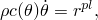
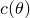

# 6.5.4 绝热分析


**产品：**Abaqus/Standard  Abaqus/Explicit  Abaqus/CAE  

##### **参考**

- [『定义分析，第 6.1.2 节』](pt03ch06s01abo05.md)
- [『热传递分析过程：概述，第 6.5.1 节』](pt03ch06s05abo08.md)
- [*DYNAMIC](../key/key-link.md#usb-kws-hdynamic)
- [*STATIC](../key/key-link.md#usb-kws-hstatic)
- [*DENSITY](../key/key-link.md#usb-kws-mdensity)
- [*INELASTIC HEAT FRACTION](../key/key-link.md#usb-kws-minelastheatfrac)
- [*SPECIFIC HEAT](../key/key-link.md#usb-kws-mspecificheat)
- [『配置一般分析过程，Abaqus/CAE 用户指南第 14.11.1 节』](../usi/usi-link.md#usi-sim-configure-general)
- [『定义热材料模型，Abaqus/CAE 用户指南第 12.10 节』](../usi/usi-link.md#usi-prp-thermal)

### 概述

绝热应力分析：
- 用于机械变形导致加热但事件发生得非常快以至于热量没有时间通过材料扩散的情况——例如，非常高速的成型过程；
-可以作为动态分析的一部分进行（『[使用直接积分的隐式动态分析，第 6.3.2 节](pt03ch06s03at07.md)，或『[显式动态分析，第 6.3.3 节](pt03ch06s03at08.md)'），或作为静态分析的一部分进行（『[静态应力分析，第 6.2.2 节](pt03ch06s02at01.md)'）；
- 在 Abaqus/Standard 中仅适用于具有 Mises 屈服面的各向同性硬化金属塑性模型（『[经典金属塑性，第 23.2.1 节](pt05ch23s02abm17.md)'）；
- 在 Abaqus/Explicit 中仅与金属塑性模型相关（包括 Mises 和 Hill 屈服面）；
- 如果模型的部分仅是弹性的，则可以进行——弹性区域不发生温度变化；以及
- 需要指定材料的密度、比热和非弹性热分数（非弹性耗散率中作为热通量出现的部分）。

### 绝热分析

绝热热应力分析通常用于模拟涉及大量非弹性应变的高速制造过程，其中材料因变形而产生的加热是一个重要效应，因为材料属性是温度依赖性的。温度升高直接根据非弹性变形引起的绝热热能增加在材料积分点计算；温度不是问题中的自由度。绝热分析不考虑热传导。对于非弹性加热和热传导都很重要的问题，必须执行全耦合温度-位移分析（『[全耦合热应力分析，第 6.5.3 节](pt03ch06s05at19.md)'）。

在绝热分析中，塑性应变产生每单位体积的热通量


其中  是添加到热能平衡中的热通量， 是用户指定的非弹性热分数（假定为常数；下文讨论）， 是应力， 是塑性应变率。在每个积分点求解的热方程为



其中  是材料密度， 是比热（请参阅『[密度，第 21.2.1 节](pt05ch21s02abm01.md)'和『[比热，第 26.2.3 节](pt05ch26s02abm56.md)'）。

| **输入文件用法：** | 使用以下任何过程执行绝热分析： |
| --- | --- |
|  | ``` [*DYNAMIC](../key/key-link.md#usb-kws-hdynamic), ADIABATIC [*DYNAMIC](../key/key-link.md#usb-kws-hdynamic), EXPLICIT, ADIABATIC [*STATIC](../key/key-link.md#usb-kws-hstatic), ADIABATIC ``` |

| **Abaqus/CAE 用法：** | 使用以下任何过程执行绝热分析： |
| --- | --- |
|  | 步骤模块：**Create Step**: **Dynamic, Implicit**: **Basic**: **Include adiabatic heating effects****Create Step**: **Dynamic, Explicit**: **Basic**: **Include adiabatic heating effects****Create Step**: **Static, General**: **Basic**: **Include adiabatic heating effects** |

### Abaqus/Standard 中的后续热扩散分析

在 Abaqus/Standard 中，可以在绝热计算之后执行热扩散分析（例如，研究突然变形后组件的冷却）。在这种情况下，必须将绝热分析结束时的温度作为在节点处平均的单元变量写入 Abaqus/Standard 结果文件。由于绝热分析中的温度值只能使用 TEMP 输出变量标识符作为单元量写入结果文件，因此它们不能直接作为初始条件读入后续热扩散分析。但是，如果您在后处理结果文件以产生第二个结果文件，其中温度数据作为节点量提供，则可以执行后续热传递分析，并将这些温度作为初始条件。请参阅『[预定义场，第 34.6.1 节](pt07ch34s06aus128.md)'和『[访问结果文件信息，第 5.1.3 节](pt02ch05s01aus43.md)'了解更多详细信息。或者，您可以对结果文件进行后处理以产生包含由节点和温度组成的数据对的数据列表。

从热传递分析获得的温度 NT 可用于驱动先前应力分析的继续。此应力分析应从绝热分析结束处重启，并将提供对热传递分析期间获得的温度场变化的响应。在这种情况下，Abaqus/Standard 将自动从热传递分析获得的结果文件中读取温度，并将其应用于重启的分析。

#### 示例

以下输入选项可用于执行使用绝热分析温度的热传递分析，然后继续应力分析：

```
**Static adiabatic analysis
 …
[*STEP](../key/key-link.md#usb-kws-hstep)
[*STATIC](../key/key-link.md#usb-kws-hstatic), ADIABATIC
 …
**Write the temperatures to the results file as element 
**variables averaged at the nodes
[*EL FILE](../key/key-link.md#usb-kws-helfile), POSITION=AVERAGED AT NODES
 TEMP
[*END STEP](../key/key-link.md#usb-kws-hendstep)
**Heat transfer analysis using the temperatures from the 
**static analysis as initial conditions
 …
[*INITIAL CONDITIONS](../key/key-link.md#usb-kws-minitialcond), TYPE=TEMPERATURE, FILE=*new results file*,
 STEP=*step*, INC=*increment*
[*STEP](../key/key-link.md#usb-kws-hstep)
[*HEAT TRANSFER](../key/key-link.md#usb-kws-hheattrans)
 …
[*NODE FILE](../key/key-link.md#usb-kws-hnodefile)
 NT
[*END STEP](../key/key-link.md#usb-kws-hendstep)
**Restart from the adiabatic analysis using temperatures 
**obtained from the heat transfer analysis
[*RESTART](../key/key-link.md#usb-kws-mrestart), WRITE, READ, STEP=k, INC=i, END STEP
 …
[*STEP](../key/key-link.md#usb-kws-hstep)
[*STATIC](../key/key-link.md#usb-kws-hstatic) 
 … 
[*TEMPERATURE](../key/key-link.md#usb-kws-htemperature), FILE=*heat_transfer_results_file*
 … 
[*END STEP](../key/key-link.md#usb-kws-hendstep)
```

#### 全耦合温度-位移分析

如果分析延续到热扩散需要全耦合温度-位移分析（请参阅『[全耦合热应力分析，第 6.5.3 节](pt03ch06s05at19.md)'），最简单（但更昂贵）的方法是在整个绝热分析中使用耦合温度-位移单元。在静态或动态绝热计算结束时，必须将温度作为在节点处平均的单元变量写入结果文件。此外，必须约束所有温度自由度，因为它们在绝热分析中未使用。然后可以重启绝热分析，以将温度从绝热分析获得的正确温度分布应用到模型中每个节点的温度自由度。为了创建边界条件的输入，必须对从绝热分析获得的结果文件进行后处理，并提取模型中每个节点的 TEMP 值（请参阅『[访问结果文件信息，第 5.1.3 节](pt02ch05s01aus43.md)'）。可以在后续耦合温度-位移分析步骤中根据需要释放温度边界条件。

##### 示例

以下输入选项可用于执行使用绝热分析温度的耦合温度-位移分析：

```
**Static adiabatic analysis, coupled temperature-displacement
**plane stress elements
 …
[*ELEMENT](../key/key-link.md#usb-kws-melement), TYPE=CPS4T, ELSET=EALL
 …
[*BOUNDARY](../key/key-link.md#usb-kws-hboundary)
*nodes*, 11, 11, 0.0
[*STEP](../key/key-link.md#usb-kws-hstep)
[*STATIC](../key/key-link.md#usb-kws-hstatic), ADIABATIC
 …
**Write the temperatures to the results file as element 
**variables averaged at the nodes
[*EL FILE](../key/key-link.md#usb-kws-helfile), POSITION=AVERAGED AT NODES
 TEMP
[*END STEP](../key/key-link.md#usb-kws-hendstep)
**Restart from the adiabatic analysis
[*RESTART](../key/key-link.md#usb-kws-mrestart), WRITE, READ, STEP=k, INC=i, END STEP
 …
[*STEP](../key/key-link.md#usb-kws-hstep)
[*STATIC](../key/key-link.md#usb-kws-hstatic)
**Dummy step to associate the temperature variable TEMP with 
**the temperature degree of freedom at each node
 1.0, 1.0
 …
[*BOUNDARY](../key/key-link.md#usb-kws-hboundary), OP=NEW
 *node*, 11, 11, *temperature*
 …
[*END STEP](../key/key-link.md#usb-kws-hendstep)
**Coupled temperature displacement run for cool down of 
**structure: continuation of the restart analysis
 …
[*STEP](../key/key-link.md#usb-kws-hstep)
[*COUPLED TEMPERATURE-DISPLACEMENT](../key/key-link.md#usb-kws-hcouptempdisp)
 0.1, 1.0
 …
[*BOUNDARY](../key/key-link.md#usb-kws-hboundary), OP=NEW
**no temperature boundary condition specified
[*END STEP](../key/key-link.md#usb-kws-hendstep)
```

### 初始条件

可以将初始温度作为初始条件预定在节点上。也可以指定应力、场变量、依赖求解的状态变量等的初始值（请参阅『[Abaqus/Standard 和 Abaqus/Explicit 中的初始条件，第 34.2.1 节](pt07ch34s02aus116.md)'）。

### 边界条件

边界条件可以以与非绝热动态、显式动态或静态分析步骤相同的方式施加到位移自由度（请参阅『[Abaqus/Standard 和 Abaqus/Explicit 中的边界条件，第 34.3.1 节](pt07ch34s03aus118.md)'）。温度不是绝热分析中的自由度。

### 载荷

绝热分析可用的载荷选项与与非绝热动态、显式动态或静态分析步骤可用的载荷选项相同（请参阅『[施加载荷：概述，第 34.4.1 节](pt07ch34s04aus120.md)'）。

可以预定以下类型的机械载荷：
- 集中节点力可以施加到位移自由度（1-6）；请参阅『[集中载荷，第 34.4.2 节](pt07ch34s04aus121.md)'。
- 可以施加分布压力力或体积力；请参阅『[分布载荷，第 34.4.3 节](pt07ch34s04aus122.md)'。特定单元可用的分布载荷类型在[第六部分，"单元"](pt06.md)中描述。

### 预定义场

在绝热分析步骤期间不能使用预定义温度场。

可以指定用户定义场变量的值；这些值仅影响场变量依赖性材料属性（如果有）。请参阅『[预定义场，第 34.6.1 节](pt07ch34s06aus128.md)'。

### 材料选项

在 Abaqus/Standard 中，仅允许具有各向同性弹性和各向同性硬化的 Mises 塑性（『[非弹性行为，第 23.1.1 节](pt05ch23s01abo20.md)'）用于绝热应力分析。不允许运动硬化或组合硬化，但可以包括率效应。但是，模型的部分可以仅包括弹性材料；弹性区域不发生温度变化，因为没有热生成源。在 Abaqus/Explicit 中，绝热应力分析允许 Mises 和 Hill 塑性。

对于其中热量将由塑性耗散产生的材料，您必须在材料定义中指定密度、非弹性热分数和比热。如果需要，您也可以指定潜热（『[潜热，第 26.2.4 节](pt05ch26s02abm57.md)'）。

非弹性热分数是用于计算温度升高的非弹性耗散量。非弹性热分数的默认值为 0.9。如果材料定义中未包含非弹性热分数，则分析中不会包含由非弹性变形产生的热量。

在 Abaqus/Standard 中，绝热分析也可以通过用户子程序 [`UMAT`](../sub/sub-link.md#sub-xsl-umat) 进行。在这种情况下，必须将温度定义为依赖求解的状态变量，并且所有耦合项必须包含在用户子程序中。如果为材料定义了电导率（『[电导率，第 26.2.2 节](pt05ch26s02abm55.md)'），则在绝热分析步骤期间它将被忽略。

| **输入文件用法：** | 所有以下选项必须包含在材料定义中： |
| --- | --- |
|  | ``` [*DENSITY](../key/key-link.md#usb-kws-mdensity) [*INELASTIC HEAT FRACTION](../key/key-link.md#usb-kws-minelastheatfrac) [*SPECIFIC HEAT](../key/key-link.md#usb-kws-mspecificheat) ``` 如果潜热效应很重要，可以包含以下选项： ``` [*LATENT HEAT](../key/key-link.md#usb-kws-mlatentheat) ``` |

| **Abaqus/CAE 用法：** | 所有以下内容必须包含在材料定义中： |
| --- | --- |
|  | 属性模块：材料编辑器：**General****Density**材料编辑器：**Thermal****Inelastic Heat Fraction**材料编辑器：**Thermal****Specific Heat**如果潜热效应很重要，可以包含以下内容：属性模块：材料编辑器：**Thermal****Latent Heat** |

#### 温度依赖性材料属性

材料属性可以是温度依赖性的。由于绝热分析中温度变化的唯一来源是非弹性变形，因此温度只能升高。这种温度升高可能导致热膨胀（通常是小效应），如果流动应力因温度升高而降低，则可能导致变形局部化。由于绝热假设仅适用于快速事件，而非弹性变形通常仅在变形显著时才导致显著温度升高，因此在绝热分析中应变率通常很大。因此，如果材料是率敏感的，则由温度升高引起的材料软化可能因率相关强化而有所抵消。

### 单元

Abaqus 中任何应力/位移或耦合温度-位移单元都可用于绝热分析（请参阅『[为分析类型选择适当的单元，第 27.1.3 节](pt06ch27s01aus112.md)'）。质量或弹簧单元不会对材料加热产生贡献，因为它们不能产生塑性应变。

如果在绝热分析中使用了耦合温度-位移单元，则温度自由度将被忽略。

### 输出

由于温度在材料计算点更新，因此可以使用输出变量 TEMP 输出温度，而不是使用输出变量 NT。

绝热分析可用的单元输出包括应力；应变；能量；状态、场和用户定义变量的值；以及复合失效度量。可用的节点输出包括位移、反力和坐标。所有输出变量标识符都在『[Abaqus/Standard 输出变量标识符，第 4.2.1 节](pt02ch04s02abv01.md)'和『[Abaqus/Explicit 输出变量标识符，第 4.2.2 节](pt02ch04s02xbv01.md)'中列出。

### 输入文件模板

```
[*HEADING](../key/key-link.md#usb-kws-mheading)
…
[*MATERIAL](../key/key-link.md#usb-kws-mmaterial), NAME=*name*
[*ELASTIC](../key/key-link.md#usb-kws-melastic), TYPE=ISOTROPIC
*Data lines to define isotropic linear elasticity*
[*PLASTIC](../key/key-link.md#usb-kws-mplastic)
*Data lines to define metal plasticity*
[*DENSITY](../key/key-link.md#usb-kws-mdensity)
*Data lines to define density*
[*INELASTIC HEAT FRACTION](../key/key-link.md#usb-kws-minelastheatfrac)
*Data line to define inelastic heat fraction*
[*SPECIFIC HEAT](../key/key-link.md#usb-kws-mspecificheat)
*Data lines to define specific heat*
… 
[*BOUNDARY](../key/key-link.md#usb-kws-hboundary)
*Data lines to specify zero-valued boundary conditions*
[*INITIAL CONDITIONS](../key/key-link.md#usb-kws-minitialcond), TYPE=*type*
*Data lines to specify initial conditions*
[*AMPLITUDE](../key/key-link.md#usb-kws-mamplitude), NAME=*name*
*Data lines to define amplitude variations*
**

[*STEP](../key/key-link.md#usb-kws-hstep), NLGEOM
*The NLGEOM parameter is used in Abaqus/Standard to include geometric nonlinearity*
[*DYNAMIC](../key/key-link.md#usb-kws-hdynamic), ADIABATIC *or* [*DYNAMIC](../key/key-link.md#usb-kws-hdynamic), EXPLICIT, ADIABATIC *or* 
[*STATIC](../key/key-link.md#usb-kws-hstatic), ADIABATIC
*Data line to control time incrementation or to specify the time period of the step*
[*BOUNDARY](../key/key-link.md#usb-kws-hboundary), AMPLITUDE=*name*
*Data lines to describe nonzero or zero-valued boundary conditions*
[*CLOAD](../key/key-link.md#usb-kws-hcload) and/or [*DLOAD](../key/key-link.md#usb-kws-hdload) and/or [*DSLOAD](../key/key-link.md#usb-kws-hdsload)
*Data lines to specify loads*
[*FIELD](../key/key-link.md#usb-kws-hfield)
*Data lines to specify field variable values*
[*END STEP](../key/key-link.md#usb-kws-hendstep)
```


