# 6.6.2 不可压缩流体动力学分析


**产品：** Abaqus/CFD  Abaqus/CAE

##### **参考文献**

- ["定义分析"，第6.1.2节](pt03ch06s01abo05.md)
- ["流体动力学分析过程：概述"，第6.6.1节](pt03ch06s06abo09.md)

### 概述

不可压缩流体动力学分析：
- 是一种速度场无散度且压力不包含热力学分量的分析；
- 是一种声波中包含的能量相对于对流传输的能量较小的分析（即马赫数在 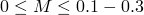 范围内）；
- 可以是层流或湍流，稳态或瞬态；
- 可用于研究内部或外部流动；
- 可包含能量传输和浮力；
- 可与变形网格一起用于ALE计算；
- 可与共轭传热或流固耦合一起执行。

### 不可压缩流体动力学分析

不可压缩流动是最常遇到的流动状态之一，涵盖了多种问题，包括：大气扩散、食品加工、汽车空气动力学设计、生物医学流动、电子冷却，以及制造过程（如化学气相沉积、模具填充和铸造）。

您可以执行瞬态或稳态不可压缩流动分析。

| **输入文件用法：** | 使用以下选项进行瞬态不可压缩流动分析： |
| --- | --- |
|  | ``` [*CFD](../key/key-link.md#usb-kws-hcfd), INCOMPRESSIBLE NAVIER STOKES ``` 使用以下选项进行稳态不可压缩流动分析： ``` [*CFD](../key/key-link.md#usb-kws-hcfd), INCOMPRESSIBLE NAVIER STOKES, STEADY STATE ``` |

| **Abaqus/CAE 用法：** | 在 Abaqus/CAE 中只能定义瞬态不可压缩流动分析。 |
| --- | --- |
|  | 分析步模块：**创建分析步**：**通用**：**流动**；**流动类型**：**不可压缩** |

### 控制方程

任意控制体积的瞬态动量方程积分形式可以写为

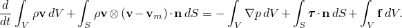

对于稳态情况，动量守恒方程的积分形式变为

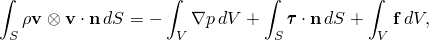

其中


是任意控制体积，表面积为 ，


是  的外法线，


是流体密度，


是压力，


是速度向量，

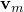

是移动网格的速度，


是体积力，


是粘性剪应力。

粘性剪应力  也称为偏应力 ，其中 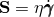。有关更多信息，请参见["粘度"，第26.1.4节](pt05ch26s01abm54.md)。

不可压缩性要求速度场满足无散度条件，表示为

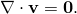

### 数值实现

求解不可压缩 Navier-Stokes 方程存在许多算法问题，这是由于无散度速度条件以及为工程应用中复杂几何形状获得解所需的空间和时间分辨率。Abaqus/CFD 不可压缩求解器使用守恒方程的积分形式。对于瞬态问题，采用了一种先进的二阶投影方法，适用于任意变形域。对于稳态情况，求解方法基于固定网格上的 SIMPLE 算法。对于投影和 SIMPLE 算法，均采用以节点为中心的有限元离散化来处理压力，以单元为中心的有限体积离散化来处理所有其他传输变量（如速度、温度、湍流等）。这种混合方法保证了精确的解，并消除了虚假压力模式的可能（无需任何人工耗散），同时保留了与传统有限体积方法相关的局部守恒性质。所有传输方程均采用基于边的实现方式，允许单一实现涵盖从简单的四面体和六面体单元到任意多面体的多种单元拓扑。Abaqus/CFD 支持四面体、楔形和六面体单元。

#### 投影方法（用于瞬态分析）

投影方法的基本概念是合理分离压力场和速度场，以高效求解不可压缩 Navier-Stokes 方程。在过去二十年中，投影方法在涉及层流和湍流流体动力学、大密度变化、化学反应、自由表面、模具填充和非牛顿行为的问题中得到了广泛应用。

在实践中，投影用于移除速度场中非无散度的部分（"div-free"）。投影通过使用 Helmholtz 分解将速度场分解为无散度和无旋分量来实现。投影算子的构造使其满足规定的边界条件并且是范数递减的，从而产生一个稳健的不可压缩流求解算法。

#### SIMPLE 方法（用于稳态分析）

SIMPLE（半隐式压力耦合方程方法）方法是一种基于压力的方法，旨在高效模拟稳态流动。

SIMPLE 方法的核心思想是通过在每个单元上强制质量连续性来创建离散的压力修正方程。然后，通过将离散的压力修正（以及由此得到的离散压力）场与动量方程的离散形式相关联，获得无散度速度场。

#### 最小二乘梯度估计

Abaqus/CFD 中的求解方法使用线性完备的二阶精确最小二乘梯度估计。这使得可以精确评估对流和扩散过程的双边通量。Abaqus/CFD 中的所有传输方程都使用二阶最小二乘算子。

#### 对流方法

Abaqus/CFD 中的对流处理是基于边的、保持单调性的，并且在空间上保持平滑变化至二阶精度。对流算法依赖于最小二乘梯度估计和与拓扑无关的非结构化网格斜率限制器。陡峭的梯度在大约2-3个单元内被捕获；即 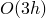，并且斜率限制与局部扩散限制器的结合防止了对流场中的过冲/下冲。对于瞬态求解器，动量和传输方程中的对流项可以显式或隐式处理（参见下文中["时间增量"中的讨论](pt03ch06s06aus48.md#usb-anl-aifluiddyn-incrementation)）。

### 能量方程

在 Abaqus/CFD 中，能量传输方程可选择性激活，用于非等温流动。对于小密度变化，Boussinesq 近似提供了动量方程和能量方程之间的耦合。在湍流中，能量传输包括基于湍流涡粘性和湍流普朗特数的湍流热通量。Abaqus/CFD 提供基于温度形式的能量方程。

能量方程的瞬态形式（温度形式）可从热力学第一定律获得，表示为

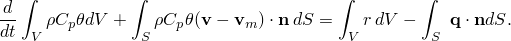

对于稳态情况，表示为

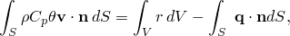

其中  是定压比热， 是温度， 是由傅里叶定律定义的传导热通量， 是外部向单位体积供应的热量。能量方程在 Abaqus/CFD 中以温度形式求解。

| **输入文件用法：** | 使用以下选项指定等温流动问题（默认）： |
| --- | --- |
|  | ``` [*CFD](../key/key-link.md#usb-kws-hcfd), ENERGY EQUATION=NO ENERGY ``` 使用以下选项指定以温度为主要传输标量变量的热（传热）问题： ``` [*CFD](../key/key-link.md#usb-kws-hcfd), ENERGY EQUATION=TEMPERATURE ``` |

| **Abaqus/CAE 用法：** | 使用以下选项指定等温流动问题： |
| --- | --- |
|  | 分析步模块：**创建分析步**：**通用**：**流动**；**基本**选项卡页面：**能量方程**：**无** 使用以下选项指定以温度为主要传输标量变量的热（传热）问题：分析步模块：**创建分析步**：**通用**：**流动**；**基本**选项卡页面：**能量方程**：**温度** |

### 湍流模型

湍流建模是计算流体动力学中的关键技术。没有一个通用的湍流模型能充分处理所有可能的流动条件和几何配置。这被目前可用的众多湍流模型和建模方法所复杂化；例如，雷诺平均 Navier-Stokes（RANS）、非稳态雷诺平均 Navier-Stokes（URANS）、大涡模拟（LES）、隐式大涡模拟（ILES）和混合 RANS/LES（HRLES）。最终，您必须确保给定湍流模型中做出的近似与所建模的物理问题一致。

Abaqus/CFD 中可用的湍流流动模型包括：ILES、Spalart-Allmaras（SA）、*k*- RNG、*k*- realizable 和 *k*- SST。这些模型涵盖了相当广泛的流动问题，包括稳态和瞬态流动、流固耦合（FSI）和共轭传热（CHT）。

#### 隐式大涡模拟（ILES）（仅用于瞬态分析）

大涡模拟依赖于湍流中长度和时间尺度的分离，以及一种允许直接模拟网格分辨的流动结构并对未分辨的亚网格特征进行建模的建模方法。隐式 LES 是一种建模高雷诺数流动的方法，它将计算效率、易于实现与预测性计算和灵活应用相结合。在 Abaqus/CFD 中，ILES 依赖于对流算子的离散保持单调性形式来隐式定义亚网格尺度模型。该模型本质上是瞬态的，需要对不可压缩 Navier-Stokes 方程进行时间精确求解，其中时间尺度大约等于分辨尺度流动特征的涡翻转时间。此外，该模型必须在三维中运行，这通常相对于更传统的稳态 RANS 模拟需要更大的网格密度和严格的网格分辨率标准。然而，这种方法非常灵活，可应用于广泛的流动和 FSI 问题。

| **输入文件用法：** | 使用 [*CFD](../key/key-link.md#usb-kws-hcfd) 选项，不使用 [*TURBULENCE MODEL](../key/key-link.md#usb-kws-hturbulence) 选项。 |
| --- | --- |

| **Abaqus/CAE 用法：** | 分析步模块：**创建分析步**：**通用**：**流动**；**湍流**选项卡页面：**无** |
| --- | --- |

#### Spalart-Allmaras（SA）湍流模型

Spalart-Allmaras（SA）模型是一种单方程湍流模型，使用涡粘性变量和非线性传输方程。该模型基于经验主义、量纲分析和对伽利略不变性的要求而开发。该模型已得到广泛应用，并针对二维混合层、尾流和平板边界层进行了校准。该模型在存在逆压梯度的情况下能产生相当精确的湍流预测，并可用于发生分离的流动。该模型在空间上是局部的，在边界层中只需要适度的分辨率。虽然最初是为外部流动和自由剪切流动设计的，Spalart-Allmaras 模型也可用于内部流动。

单方程 Spalart-Allmaras 模型的基本形式由一个湍流涡粘性  的传输方程组成。该模型需要从壁面到法向距离，用于控制近壁区域湍流粘性的阻尼函数。Abaqus/CFD 自动计算法向距离函数，允许简单指定模型边界条件。

Spalart-Allmaras 模型湍流粘性传输方程的瞬态形式为

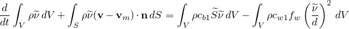

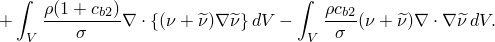

方程的稳态形式为

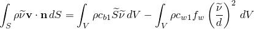


上述两个方程中使用的阻尼函数和模型系数定义为：

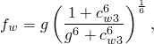

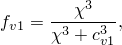

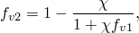

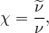

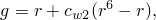

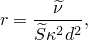

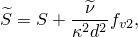

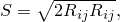

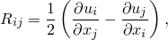

其中  是从壁面的法向距离，有效湍流粘性定义为

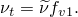

Spalart-Allmaras 模型系数如[表6.6.2--1](pt03ch06s06aus48.md#table-spalartproperties)所示。此外，可以指定湍流普朗特数 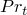。

**表6.6.2--1** Spalart-Allmaras 模型系数。
|  | 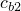 | 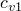 |  | 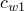 |  |  |  | 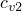 |
| --- | --- | --- | --- | --- | --- | --- | --- | --- |
| 0.1355 | 0.622 | 7.1 | 0.6667 | 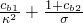 | 0.3 | 2 | 0.41 | 5 |

如果近壁区域被分辨（近壁分辨率使得无量纲壁面距离约为3），Spalart-Allmaras 模型可以提供非常精确的边界层结果。然而，Abaqus/CFD 中 Spalart-Allmaras 模型的边界条件实现也允许使用较粗的网格。

| **输入文件用法：** | 同时使用以下两个选项： |
| --- | --- |
|  | ``` [*CFD](../key/key-link.md#usb-kws-hcfd) [*TURBULENCE MODEL](../key/key-link.md#usb-kws-hturbulence), TYPE=SPALART ALLMARAS ``` |

| **Abaqus/CAE 用法：** | 分析步模块：**创建分析步**：**通用**：**流动**；**湍流**选项卡页面：**Spalart-Allmaras** |
| --- | --- |

##### 壁面函数

Spalart-Allmaras 湍流模型可以通过其内置的低雷诺数阻尼函数在整个湍流边界层的内层进行积分。然而，该模型通常需要极其精细的近壁分辨率，量级为 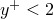，才能准确预测整个边界层中的涡粘性。一般来说， 的近壁分辨率要求是在复杂高雷诺数流动问题中需要执行的非常严格的约束。因此，实现了一种壁面函数方法来放宽 Spalart-Allmaras 模型所需的近壁分辨率。

传统的壁面函数方法基于壁面律，这是一种在平衡壁面约束流动中获得的半经验通用速度剖面，当流动速度  和壁面法向距离  用运动粘度  和摩擦速度 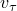（称为粘性单位或壁面单位）进行归一化时：摩擦速度计算如下：

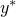 计算如下：

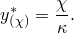

壁面律计算为 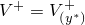。摩擦速度可以从粘性层和对数层关系计算为

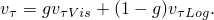

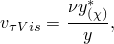

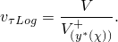

混合函数定义为

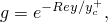

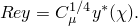

壁面函数定义为

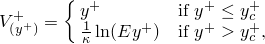

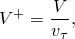

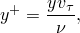

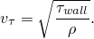

在上述方程中， 是密度，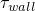 是壁面剪应力，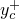 是线性和对数速度剖面的交点，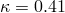 和 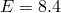 是常数。

传统壁面函数方法已在 Abaqus/CFD 中被调整为一种形式，对于粗网格渐近于标准壁面函数，但对于细网格也能给出与无壁面函数方法相同的结果。它被称为混合壁面函数。Spalart-Allmaras 模型中混合壁面函数方法实现的关键方面是获得摩擦速度作为  和局部速度场的函数，如前所述。计算出摩擦速度后，壁面剪应力可以由以下公式获得：

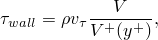

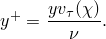

混合壁面函数方法与近壁分辨率无关；因此，所实现的壁面律 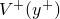 需要准确预测粘性底层、对数层和缓冲层（连接粘性区和对数区的区域），因为靠近壁面的单元中心可以位于内层的任何位置。因此，实现了由 [Reichardt (1951)](pt03ch06s06aus48.md#usb-ref-reichardt) 提出的再现整个壁面律的单一平滑关联：

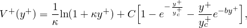

其中


##### 在动量方程中的实现

对于网格分辨率不足以捕捉近壁梯度的情况，需要近壁模型来在粗网格中提供正确的壁面剪应力。壁面剪应力通过壁面函数方法由有效边粘度获得：


##### 能量壁面函数

壁面函数方法可以通过使用温度壁面律扩展到能量方程，这是一种在平衡壁面约束流动中获得的半经验通用温度剖面，当温度  和壁面法向距离  用壁面单位归一化时。标准温度壁面函数定义为


其中  是温度壁面函数中粘性底层和对数层的交点， 是壁面温度， 是普朗特数， 是湍流普朗特数， 是壁面热通量， 是定压比热系数， 使用 [Jayatilleke (1969)](pt03ch06s06aus48.md#usb-ref-jayatilleke) 表达式计算：


对于混合壁面函数方法，实现了由 [Kader (1981)](pt03ch06s06aus48.md#usb-ref-kader) 提出的连续温度壁面函数：


混合函数定义为


最后，热通量从预计算的  流动物性温度场和连续温度壁面函数获得：


##### 在能量方程中的实现

对于网格分辨率不足以捕捉近壁梯度的情况，需要近壁模型来在粗网格中提供正确的壁面热通量。壁面热通量通过壁面函数方法由有效边热导率获得。


#### k--epsilon RNG 湍流模型

*k*- RNG 模型是一种双方程湍流模型，演化湍流动能 *k* 的方程和能量耗散率  的方程。模型方程从基本物理原理和量纲分析发展而来；*k* 的方程使用第一性原理推导， 的方程使用物理洞察力假设。RNG 版本的主要优势是模型系数使用物理学中常用的重正化群理论的数学方法获得。这种校准方法消除了在大多数湍流 RANS 模型中使用有限组经典流动校准模型系数时引入的大部分不确定性。此外，它修改了 epsilon 方程（[Yakhot et al., 1992](pt03ch06s06aus48.md#usb-ref-yakhot)）。模型方程如下：


其中  是雷诺应力张量，封闭如下：


湍流粘性  为


和


上述 *k*- 传输方程右侧的第二和第三项分别代表 *k* 和  的产生和耗散。

*k*- RNG 模型系数如[表6.6.2--2](pt03ch06s06aus48.md#table-k-eps-coefficients)所示。此外，可以指定湍流普朗特数（）。

**表6.6.2--2** *k*- RNG 模型系数。
|  |  |  |  |  |  |  |
| --- | --- | --- | --- | --- | --- | --- |
| 0.085 | 1.42 | 1.68 | 0.72 | 0.72 | 0.012 | 4.38 |

| **输入文件用法：** | 同时使用以下两个选项： |
| --- | --- |
|  | ``` [*CFD](../key/key-link.md#usb-kws-hcfd) [*TURBULENCE MODEL](../key/key-link.md#usb-kws-hturbulence), TYPE=RNG KEPSILON ``` |

| **Abaqus/CAE 用法：** | 分析步模块：**创建分析步**：**通用**：**流动**；**湍流**选项卡页面：**k-epsilon 重正化群（RNG）** |
| --- | --- |

##### 壁面函数

众所周知，*k*- 模型存在局限性，特别是在壁面约束流动中，通常会在近壁区域产生较高的涡粘性值。对于许多工业应用中常遇到的高雷诺数流动，使用细网格完全分辨壁面附近发生的薄粘性底层可能不经济。因此，对于无法分辨粘性底层的网格，使用壁面函数来表示粘性底层对传输过程的影响。在 Abaqus/CFD 中，壁面函数用于避免需要高度分辨的边界层网格。这种方法依赖壁面律来获得壁面剪应力。

壁面律是壁面约束流动在无压力梯度时发展的通用速度剖面。壁面律为


其中


 是壁面切向速度， 是运动粘度， 是密度， 是壁面剪应力， 是线性和对数速度剖面的交点， 和  是常数。

标准壁面律剖面在使用上有限制。例如，在回流中，湍流动能 *k* 在分离点和再附着点变为零，根据定义， 在这些点为零。这种奇异行为导致预测结果出现错误。为克服这一问题，标准壁面律根据 [Launder 和 Spalding (1974)](pt03ch06s06aus48.md#usb-ref-launderspalding) 提出的方法，基于摩擦速度的新尺度进行了修改。修改后的摩擦速度为


这在流动再附着、分离和流动冲击点不具有奇异行为。相应地，壁面距离重新缩放如下：


修改后的壁面律在均匀壁面剪应力且湍流动能的产生和耗散平衡的条件下（即湍流结构处于平衡状态时）退化为标准壁面律。在这些条件下，，因此 。

修改壁面律的壁面剪应力可以计算为（[Albets-Chico, et al., 2008](pt03ch06s06aus48.md#usb-ref-albets)）


其中下标 *p* 表示评估所有感兴趣量的壁面单元中心。壁面函数的使用要求修改壁面层单元的 *k* 和  的传输方程。具体来说，湍流动能 *k* 的主导传输方程中的产生项和耗散项被修改以考虑壁面的存在。

按照 [Craft et al. (2002](pt03ch06s06aus48.md#usb-ref-craft)) 中概述的程序，使用如下所示的 *k* 的平均产生值用于传输方程。该平均值基于壁面单元的两层模型获得（即壁面单元被分为部分粘性底层区域和部分湍流对数层或惯性层区域）。


其中  是给定壁面单元所有顶点的壁面法向距离的最大值， 是粘性底层边缘的壁面法向距离，其中


类似地，基于两层积分，也为壁面单元规定了 *k* 的平均耗散率值，由以下公式给出


壁面层单元的  传输方程不被求解。相反， 的值在点 *p* 直接规定如下：


因此，*k* 和  传输方程的积分在壁面处以零通量（即齐次 Neumann 边界条件）进行。

##### 壁面函数指南

壁面函数的主要优势是放宽了对壁面网格分辨率的要求。然而，使用壁面函数的主要缺点是对近壁网格分辨率的依赖性。基于壁面律方法的壁面函数通常对于壁面单元中心位于完全湍流层（惯性层或对数层）中的情况效果最佳，这些函数正是为此设计的。这实际上对缩放壁面坐标  的值施加了下限。对于复杂几何形状，确保所有近壁单元都位于粘性底层之外是困难的。对数区域的精确位置取决于解，可能随时间变化。为适应更灵活的网格，实现了分辨率不敏感壁面函数（[Durbin, 2009](pt03ch06s06aus48.md#usb-ref-durbin)）。简而言之，该壁面函数基于限制  的最小值，使得第一个壁面附着单元的速度梯度值与位于粘性底层边缘时的值相同。壁面约束流动的最佳实践是在边界层区域中至少有8-10个点，其中 （参见 [Casey 和 Wintergerste, 2000](pt03ch06s06aus48.md#usb-ref-casey)）。

##### 动量方程的修改

使用壁面函数时，基于分子粘度  和数值估计的速度梯度计算壁面剪应力或动量粘性通量可能产生大的误差。因此，需要对动量方程进行适当的修改以考虑分辨率不足导致的壁面摩擦。必要的修改通过修改壁面单元的粘度来实现，以校正速度梯度的错误估计（[Bredberg, 2000](#usb-ref-bredberg)）。这在壁面单元中的实现如下：


##### 能量壁面函数

壁面函数方法可以通过使用温度壁面律扩展到能量方程，这是一种在平衡壁面约束流动中获得的半经验通用温度剖面，当温度  和壁面法向距离  用壁面单位归一化时。标准温度壁面函数定义为


其中  是温度壁面函数中粘性底层和对数层的交点， 是壁面温度， 是普朗特数， 是湍流普朗特数， 是壁面热通量， 是定压比热系数， 使用 [Jayatilleke (1969)](pt03ch06s06aus48.md#usb-ref-jayatilleke) 表达式计算：


最后，热通量从预计算的  流动物性温度场和连续温度壁面函数获得：


##### 在能量方程中的实现

对于网格分辨率不足以捕捉近壁梯度的情况，需要近壁模型来在粗网格中提供正确的壁面热通量。壁面热通量通过壁面函数方法由有效边热导率获得：


#### k--epsilon realizable 湍流模型

*k*- realizable 模型是一种双方程湍流模型，演化湍流动能 *k* 的方程和能量耗散率  的方程。模型方程从基本物理原理和量纲分析发展而来；*k* 的方程使用第一性原理推导， 的方程使用物理洞察力假设。此特定版本使用可实现性约束，在雷诺应力中施加数学一致性（如强制正应力的正性和 Cauchy-Schwarz 不等式）来修改模型系数和 epsilon 方程。这些修改保证了预测雷诺应力中的物理一致性，从而提高了预测精度（[Shih et al., 1995](pt03ch06s06aus48.md#usb-ref-tsan)）。模型方程如下：


其中雷诺应力张量定义为


涡粘性  定义为


湍流粘性系数使用可实现性约束计算：


其中


可实现性条件施加在  方程的产生系数中，得到


*k*- realizable 模型系数如[表6.6.2--2](pt03ch06s06aus48.md#table-k-eps-coefficients)所示。此外，可以指定湍流普朗特数 。

**表6.6.2--3** *k*- realizable 模型系数。
|  |  |  |  |  |
| --- | --- | --- | --- | --- |
| 4.0 | 1.9 | 1.0 | 1.2 | 0.43 |

| **输入文件用法：** | 同时使用以下两个选项： |
| --- | --- |
|  | ``` [*CFD](../key/key-link.md#usb-kws-hcfd) [*TURBULENCE MODEL](../key/key-link.md#usb-kws-hturbulence), TYPE=KEPSILON REALIZABLE ``` |

| **Abaqus/CAE 用法：** | *k*-- realizable 湍流模型在 Abaqus/CAE 中不受支持。 |
| --- | --- |

##### 两层模型

为了在网格不够细以分辨壁面约束流动中内层的情况下提高 *k*- realizable 模型的精度，实现了一种近壁模型，称为两层模型。遵循 [Chen 和 Patel (1988](pt03ch06s06aus48.md#usb-ref-chen)) 的工作，在内层中使用  和  的代数方程替代其湍流模型方程：


其中


代数方程  为


其中  是壁面法向距离。两