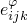
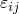
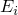
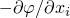
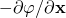
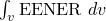

# 6.7.2 压电分析


**产品：**Abaqus/Standard  Abaqus/CAE  

##### **参考**

- ["压电行为"，第 26.5.2 节](pt05ch26s05abm62.md)
- ["定义分析"，第 6.1.2 节](pt03ch06s01abo05.md)
- ["电磁分析步概述"，第 6.7.1 节](pt03ch06s07abo10.md)
- [《Abaqus/CAE 用户指南》第 16.9.30 节"定义集中电荷"](../usi/usi-link.md#usi-lbi-loadeditors-conccharge)
- [《Abaqus/CAE 用户指南》第 16.9.31 节"定义面电荷"](../usi/usi-link.md#usi-lbi-loadeditors-surfacecharge)
- [《Abaqus/CAE 用户指南》第 16.9.32 节"定义体电荷"](../usi/usi-link.md#usi-lbi-loadeditors-bodycharge)

### 概述

耦合压电问题：
- 是指材料中电势梯度引起应变，而应力引起电势梯度的问题；
- 使用特征频率提取、模态动力、静力、动力或稳态动力分析步求解；
- 需要使用压电单元和压电材料属性；
- 可在一维、二维和三维连续体问题中执行；
- 可用于线性和非线性分析（但在非线性分析中，本构行为的压电部分假定为线性）。

### 压电响应

压电材料的电气响应假定由压电效应和介电效应组成：


其中


为电势，


为第 *i* 个材料方向上电通量矢量（也称为电位移）的分量，



为压电应力耦合，



为小应变分量，


为完全约束材料的介电矩阵，



为第 *i* 个材料方向上电势梯度的负值，。

压电和介电属性的定义见["压电行为"，第 26.5.2 节](pt05ch26s05abm62.md)。Abaqus 中压电分析能力的理论基础定义于[《Abaqus 理论指南》第 2.10.1 节"压电分析"](../stm/stm-link.md#stm-anl-piezoelectric)。

### 压电分析可用的分析步

压电分析可与以下分析步配合使用：
- ["静力应力分析"，第 6.2.2 节](pt03ch06s02at01.md)
- ["使用直接积分的隐式动力分析"，第 6.3.2 节](pt03ch06s03at07.md)
- ["直接求解稳态动力分析"，第 6.3.4 节](pt03ch06s03at09.md)
- ["固有频率提取"，第 6.3.5 节](pt03ch06s03at10.md)
- ["瞬态模态动力分析"，第 6.3.7 节](pt03ch06s03at12.md)
- ["基于模态的稳态动力分析"，第 6.3.8 节](pt03ch06s03at13.md)
- ["基于子空间的稳态动力分析"，第 6.3.9 节](pt03ch06s03at14.md)

### 初始条件

压电量的初始条件不能指定。有关可在静力或动力分析步中施加的初始条件，请参见["Abaqus/Standard 和 Abaqus/Explicit 的初始条件"，第 34.2.1 节](pt07ch34s02aus116.md)。

### 边界条件

节点处的电势（自由度 9）可使用边界条件规定（参见["Abaqus/Standard 和 Abaqus/Explicit 的边界条件"，第 34.3.1 节](pt07ch34s03aus118.md)）。位移和转动自由度也可按相关静力和动力分析步章节所述通过边界条件规定。参见["Abaqus/Standard 和 Abaqus/Explicit 的边界条件"，第 34.3.1 节](pt07ch34s03aus118.md)。

边界条件可通过引用幅值曲线来规定为时间的函数（["幅值曲线"，第 34.1.2 节](pt07ch34s01aus115.md)）。

在包含压电单元的特征频率提取步（["固有频率提取"，第 6.3.5 节](pt03ch06s03at10.md)）中，电势自由度至少必须在一个节点处被约束，以消除单元算子介电部分的奇异性。

### 载荷

压电分析中可施加力学载荷和电气载荷。

#### 施加力学载荷

压电分析中可规定以下类型的力学载荷：
- 集中节点力可施加于位移自由度（1~6）；参见["集中载荷"，第 34.4.2 节](pt07ch34s04aus121.md)。
- 可施加分布压力或体力；参见["分布载荷"，第 34.4.3 节](pt07ch34s04aus122.md)。

#### 施加电气载荷

可规定以下类型的电气载荷，如["电磁载荷"，第 34.4.5 节](pt07ch34s04aus124.md)所述：
- 集中电荷。
- 分布面电荷和体电荷。

#### 基于模态和子空间分析步中的载荷

由于"无质量"模态效应，电荷载荷只能与特征值提取步中的残余模态配合使用。由于电势自由度没有关联质量，这些自由度在特征值提取期间会被有效消除（类似 Guyan 缩减或质量凝聚）。残余模态代表与电荷载荷对应的静力响应，可在特征空间中充分表示电势自由度。

### 预定义场

以下预定义场可在压电分析中指定，如["预定义场"，第 34.6.1 节](pt07ch34s06aus128.md)所述：
- 虽然温度不是压电单元的自由度，但可指定节点温度。指定的温度仅影响温度相关的材料属性（如有）。
- 可指定用户自定义场变量值。这些值仅影响场变量相关的材料属性（如有）。

### 材料选项

压电耦合矩阵和介电矩阵作为压电材料定义的一部分来指定，如["压电行为"，第 26.5.2 节](pt05ch26s05abm62.md)所述。它们仅在材料定义与耦合压电单元配合使用时才有意义。

材料的力学行为只能包含线弹性（["线弹性行为"，第 22.2.1 节](pt05ch22s02abm02.md)）。

### 单元

压电分析中必须使用压电单元（参见["为分析类型选择合适的单元"，第 27.1.3 节](pt06ch27s01aus112.md)）。电势  是这些单元每个节点的第 9 自由度。此外，在不需要考虑压电效应的模型部分，可使用常规应力/位移单元。

### 输出

以下输出变量适用于压电分析中的电气求解：

单元积分点变量：

| EENER | 静电能量密度。 |
| --- | --- |

| EPG | 电势梯度矢量负值的量级和分量，。 |
| --- | --- |

| EPGM | 电势梯度矢量的量级。 |
| --- | --- |

| EPG*n* | 电势梯度矢量负值的第 *n* 分量（*n*=1, 2, 3）。 |
| --- | --- |

| EFLX | 电通量（位移）矢量的量级和分量，。 |
| --- | --- |

| EFLXM | 电通量（位移）矢量的量级。 |
| --- | --- |

| EFLX*n* | 电通量（位移）矢量的第 *n* 分量（*n*=1, 2, 3）。 |
| --- | --- |

整个单元变量：

| CHRGS | 分布电荷值。 |
| --- | --- |

| ELCTE | 单元中的总静电能，。 |
| --- | --- |

节点变量：

| EPOT | 节点处的电势自由度。 |
| --- | --- |

| RCHG | 反应电气节点电荷（规定电势的共轭量）。 |
| --- | --- |

| CECHG | 集中电气节点电荷。 |
| --- | --- |

### 局限性

Abaqus 在总能量平衡方程中不考虑压电效应，这在某些情况下可能导致模型总能量的表观不平衡。例如，若一根压电杆一端固定，两端施加电位差，则由于压电效应发生变形。随后若将杆固定在变形位置并去除电位差，由于约束将产生应变能。这导致模型总能量等效增加。

### 输入文件模板

```
[*HEADING](../key/key-link.md#usb-kws-mheading)
…
[*MATERIAL](../key/key-link.md#usb-kws-mmaterial), NAME=*matl*
[*ELASTIC](../key/key-link.md#usb-kws-melastic)
*定义线弹性的数据行*
[*PIEZOELECTRIC](../key/key-link.md#usb-kws-mpiezoelect)
*定义压电行为的数据行*
[*DIELECTRIC](../key/key-link.md#usb-kws-mdielectric)
*定义介电行为的数据行*
…
[*AMPLITUDE](../key/key-link.md#usb-kws-mamplitude), NAME=*name*
*定义集中电荷用幅值曲线的数据行*
**
[*STEP](../key/key-link.md#usb-kws-hstep), （可选 NLGEOM）
[*STATIC](../key/key-link.md#usb-kws-hstatic)
** 或 [*DYNAMIC](../key/key-link.md#usb-kws-hdynamic), [*FREQUENCY](../key/key-link.md#usb-kws-hfrequency), [*MODAL DYNAMIC](../key/key-link.md#usb-kws-hmodaldyn), 
** [*STEADY STATE DYNAMICS](../key/key-link.md#usb-kws-hsteadystdyn) (, DIRECT 或 , SUBSPACE PROJECTION)
[*BOUNDARY](../key/key-link.md#usb-kws-hboundary)
*定义电势和位移（转动）自由度边界条件的数据行*
[*CECHARGE](../key/key-link.md#usb-kws-hcecharge), AMPLITUDE=*name*
*定义时变集中电荷的数据行*
[*DECHARGE](../key/key-link.md#usb-kws-hdecharge) 和/或 [*DSECHARGE](../key/key-link.md#usb-kws-hdsecharge)
*定义分布电荷的数据行*
[*CLOAD](../key/key-link.md#usb-kws-hcload) 和/或 [*DLOAD](../key/key-link.md#usb-kws-hdload) 和/或 [*DSLOAD](../key/key-link.md#usb-kws-hdsload)
*定义力学载荷的数据行*
[*END STEP](../key/key-link.md#usb-kws-hendstep)
```


