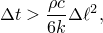
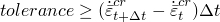
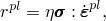
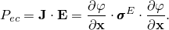
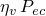
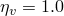
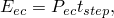
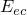
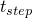

# 6.7.4 全耦合热-电-结构分析


**产品：**Abaqus/Standard  Abaqus/CAE  

##### **参考**

- ["定义分析"，第 6.1.2 节](pt03ch06s01abo05.md)
- ["全耦合热-应力分析"，第 6.5.3 节](pt03ch06s05at19.md)
- ["耦合热-电分析"，第 6.7.3 节](pt03ch06s07at22.md)
- [*COUPLED TEMPERATURE-DISPLACEMENT](../key/key-link.md#usb-kws-hcouptempdisp)
- [《Abaqus/CAE 用户指南》第 14.11.1 节"配置通用分析步"中的"配置全耦合同步热传导、电气和结构分析步"](../usi/usi-link.md#usi-sim-configure-coupledheatelectricstruct)

### 概述

全耦合热-电-结构分析：
- 在位移、温度和电势场之间的耦合使得必须同时获得所有三个场的解时执行；
- 要求模型中存在具有位移、温度和电势自由度的单元；
- 允许瞬态或稳态热力学求解、静态位移求解和稳态电气求解；
- 可包含热接触相互作用，如间隙辐射、间隙传导和面间间隙热生成（参见["热接触属性"，第 37.2.1 节](pt09ch37s02aus174.md)）；
- 可包含电气接触相互作用，如间隙电导（参见["电气接触属性"，第 37.3.1 节](pt09ch37s03aus175.md)）；
- 不能包含空腔辐射效应，但可包含辐射边界条件（参见["热载荷"，第 34.4.4 节](pt07ch34s04aus123.md)）；
- 仅对分配有温度自由度单元的属性考虑材料属性的温度相关性；
- 忽略惯性效应；
- 可以是瞬态或稳态的。

### 全耦合热-电-结构分析

全耦合热-电-结构分析是耦合热-位移分析（参见["全耦合热-应力分析"，第 6.5.3 节](pt03ch06s05at19.md)）与耦合热-电分析（参见["耦合热-电分析"，第 6.7.3 节](pt03ch06s07at22.md)）的结合。

温度和电气自由度之间的耦合源于温度相关的电导率和内热生成（焦耳加热，是电流密度的函数）。问题的热力部分可包含导热和热存储（["热属性：概述"，第 26.2.1 节](pt05ch26s02abo23.md)）。不考虑流体流过网格引起的强制对流。

温度和位移自由度之间的耦合源于温度相关材料属性、热膨胀以及内热生成（是材料非弹性变形的函数）。此外，某些问题中存在接触条件，面之间传导的热量可能强烈依赖于面分离和/或跨界面传递的压力以及摩擦（参见["力学接触属性：概述"，第 37.1.1 节](pt09ch37s01aus165.md)和["热接触属性"，第 37.2.1 节](pt09ch37s02aus174.md)）。

电气和位移自由度之间的耦合出现在接触面之间有电流流动的问题中。导电可能强烈依赖于面分离和/或跨界面传递的压力（参见["电气接触属性"，第 37.3.1 节](pt09ch37s03aus175.md)）。

需要全耦合热-电-结构分析的仿真示例是电阻点焊。在典型点焊过程中，两个或多个薄金属板被两个电极夹紧。大电流在电极之间通过，熔化电极之间的金属并形成焊缝。焊缝质量取决于许多参数，包括金属板之间的电导（可以是接触压力和温度的函数）。

#### 稳态分析

稳态分析直接提供稳态解。稳态热分析意味着控制传热方程中的内能项（比热项）被省略。假设静态位移解。电气问题中只考虑直流电，假设系统电容可忽略。电气瞬态效应非常迅速，可忽略不计。

| **输入文件用法：** | ``` [*COUPLED TEMPERATURE-DISPLACEMENT](../key/key-link.md#usb-kws-hcouptempdisp), ELECTRICAL, STEADY STATE ``` |
| --- | --- |

| **Abaqus/CAE 用法：** | Step 模块：**Create Step**：**General**：**Coupled thermal-electrical-structural**：**Basic**：**Response: Steady state** |
| --- | --- |

##### 为分析指定"时间"尺度

在稳态情况下，应为步骤指定任意"时间"尺度：指定"时间"周期和"时间"增量参数。此时间尺度便于在步骤中更改载荷和边界条件，以及获得高度非线性（但稳态）情况的解；然而，对于后一目的，瞬态分析通常提供了处理非线性的自然方式。

##### 考虑摩擦滑移热生成

通常在稳态情况下忽略摩擦滑移热生成。但若使用运动来指定磁盘制动器类型问题中的平移或转动节点速度，或者用户子程序 [`FRIC`](../sub/sub-link.md#sub-xsl-fric) 通过变量 `SFD` 提供增量摩擦耗散，则仍可考虑摩擦热生成。如果存在摩擦热生成，进入两个接触面的热通量取决于面的滑移速率。在这种情况下，"时间"尺度不能描述为任意的，应执行瞬态分析。

#### 瞬态分析

或者，可以执行瞬态耦合热-电-结构分析。与稳态分析一样，忽略电气瞬态效应，并假设静态位移解。可直接控制瞬态分析中的时间增量，或 Abaqus/Standard 可自动控制。通常优先采用自动时间增量。

##### 由最大允许温度变化控制的自动增量

时间增量可根据用户规定的每增量最大允许节点温度变化  自动选择。Abaqus/Standard 将限制时间增量，确保在分析的任意增量中，任意节点（有边界条件的节点除外）不超过此值（参见["瞬态问题中的时间积分精度"，第 7.2.4 节](pt03ch07s02aus52.md)）。

| **输入文件用法：** | ``` [*COUPLED TEMPERATURE-DISPLACEMENT](../key/key-link.md#usb-kws-hcouptempdisp), ELECTRICAL, DELTMX= ``` |
| --- | --- |

| **Abaqus/CAE 用法：** | Step 模块：**Create Step**：**General**：**Coupled thermal-electrical-structural**：**Basic**：**Response: Transient**；**Incrementation**：**Type: Automatic**：**Max. allowable temperature change per increment:**  |
| --- | --- |

##### 固定增量

如果不指定 ，则整个分析中使用等于用户指定初始时间增量  的固定时间增量。

| **输入文件用法：** | ``` [*COUPLED TEMPERATURE-DISPLACEMENT](../key/key-link.md#usb-kws-hcouptempdisp), ELECTRICAL  ``` |
| --- | --- |

| **Abaqus/CAE 用法：** | Step 模块：**Create Step**：**General**：**Coupled thermal-electrical-structural**：**Basic**：**Response: Transient**；**Incrementation**：**Type: Fixed**：**Increment size:**  |
| --- | --- |

##### 小时间增量引起的虚假振荡

使用二阶单元的瞬态分析中，最小可用时间增量与单元尺寸之间存在关系。一个简单准则是



其中  为时间增量， 为密度，*c* 为比热，*k* 为热导率， 为典型单元尺寸（如单元边长）。如果在二阶单元网格中使用小于该值的时间增量，解中可能出现虚假振荡，尤其在温度快速变化的边界附近。这些振荡是非物理的，若存在温度相关材料属性可能造成问题。在使用一阶单元的瞬态分析中，热容量项被集中处理，消除了此类振荡，但可能导致小时间增量下局部解的不准确。如果需要更小的时间增量，应在温度快速变化的区域使用更细密的网格。

时间增量大小没有上限（积分步骤无条件稳定），除非非线性引起收敛问题。

##### 由蠕变响应控制的自动增量

时间相关（蠕变）材料行为积分的精度由用户指定的精度容差参数  控制。该参数用于规定增量中任意点允许的最大应变速率变化，如["速率相关塑性：蠕变和膨胀"，第 23.2.4 节](pt05ch23s02abm20.md)所述。精度容差参数可与每增量最大允许节点温度变化 （上述）一起指定；但是，指定精度容差参数将激活自动增量，即使未指定 。

| **输入文件用法：** | ``` [*COUPLED TEMPERATURE-DISPLACEMENT](../key/key-link.md#usb-kws-hcouptempdisp), ELECTRICAL, DELTMX=, CETOL=*tolerance* ``` |
| --- | --- |

| **Abaqus/CAE 用法：** | Step 模块：**Create Step**：**General**：**Coupled thermal-electrical-structural**：**Basic**：**Response: Transient**，勾选 **Include creep/swelling/viscoelastic behavior**；**Incrementation**：**Type: Automatic**：**Max. allowable temperature change per increment:** ，**Creep/swelling/viscoelastic strain error tolerance:** *tolerance* |
| --- | --- |

##### 选择显式蠕变积分

在没有其他非线性的非线性蠕变问题（["速率相关塑性：蠕变和膨胀"，第 23.2.4 节](pt05ch23s02abm20.md)）中，若非弹性应变增量小于弹性应变，则可通过对非弹性应变进行前向差分积分来高效求解。此显式方法在计算上很高效，因为与隐式方法不同，只要没有其他非线性就不需要迭代。虽然此方法只有条件稳定，但显式算子的数值稳定极限在许多情况下足够大，可以在合理数量的时间增量内推进求解。

然而，对于大多数全耦合热-电-结构分析，向后差分算子（隐式方法）的无条件稳定性是可取的。在这种情况下，隐式积分方案可由 Abaqus/Standard 自动调用。

显式积分在计算上成本较低，并简化了用户子程序 [`CREEP`](../sub/sub-link.md#sub-xsl-creep) 中用户自定义蠕变定律的实现；可限制 Abaqus/Standard 将此方法用于蠕变问题（无论是否包含几何非线性）。详情参见["速率相关塑性：蠕变和膨胀"，第 23.2.4 节](pt05ch23s02abm20.md)。

| **输入文件用法：** | ``` [*COUPLED TEMPERATURE-DISPLACEMENT](../key/key-link.md#usb-kws-hcouptempdisp), ELECTRICAL, CETOL=*tolerance*, CREEP=EXPLICIT ``` |
| --- | --- |

| **Abaqus/CAE 用法：** | Step 模块：**Create Step**：**General**：**Coupled thermal-electrical-structural**：**Basic**：**Response: Transient**，勾选 **Include creep/swelling/viscoelastic behavior**；**Incrementation**：**Creep/swelling/viscoelastic strain error tolerance:** *tolerance*，**Creep/swelling/viscoelastic integration: Explicit** |
| --- | --- |

##### 排除蠕变和黏弹性响应

可指定即使定义了蠕变或黏弹性材料属性，在某步骤中也不会发生蠕变或黏弹性响应。

| **输入文件用法：** | ``` [*COUPLED TEMPERATURE-DISPLACEMENT](../key/key-link.md#usb-kws-hcouptempdisp), ELECTRICAL, DELTMX=, CREEP=NONE ``` |
| --- | --- |

| **Abaqus/CAE 用法：** | Step 模块：**Create Step**：**General**：**Coupled thermal-electrical-structural**：**Basic**：**Response: Transient**，取消勾选 **Include creep/swelling/viscoelastic behavior** |
| --- | --- |

##### 不稳定问题

某些类型的分析可能出现局部不稳定性，如面起皱、材料不稳定性或局部屈曲。在这种情况下，即使借助自动增量也可能无法获得准静态解。Abaqus/Standard 提供了一种通过在整个模型中施加阻尼来稳定此类问题的方法，引入的黏性力足够大以防止瞬时屈曲或坍塌，但又足够小不会在问题稳定时显著影响行为。可用的自动稳定方案在["求解非线性问题"第 7.1.1 节](pt03ch07s01aus49.md#usb-anl-anonlineareqns-stabilize-over)中的"不稳定问题的自动稳定"中有详细说明。

#### 单位

在两个或三个不同场均活跃的耦合问题中，选择问题的单位时要谨慎。如果单位选择使得每个场方程生成的项相差许多数量级，某些计算机上的精度可能不足以解决耦合方程的数值病态问题。因此，应选择避免病态矩阵的单位。例如，考虑在应力平衡方程中使用 MPa（而非 Pa）来减小应力平衡方程、热通量连续性方程和守恒方程之间量级的差异。

### 初始条件

默认情况下，所有节点的初始温度为零。可指定非零初始温度。还可定义初始应力、场变量等；["Abaqus/Standard 和 Abaqus/Explicit 的初始条件"，第 34.2.1 节](pt07ch34s02aus116.md)描述了全耦合热-电-结构分析中可用的所有初始条件。

### 边界条件

边界条件可用于规定全耦合热-电-结构分析中节点处的温度（自由度 11）、位移/转动（自由度 1~6）或电势（自由度 9）（参见["Abaqus/Standard 和 Abaqus/Explicit 的边界条件"，第 34.3.1 节](pt07ch34s03aus118.md)）。

边界条件可通过引用幅值曲线来规定为时间的函数（["幅值曲线"，第 34.1.2 节](pt07ch34s01aus115.md)）。

### 载荷

全耦合热-电-结构分析中可规定以下类型的热载荷，如["热载荷"，第 34.4.4 节](pt07ch34s04aus123.md)所述：
- 集中热通量。
- 体通量和分布面通量。
- 基于节点的薄膜和辐射条件。
- 平均温度辐射条件。
- 基于单元和面的薄膜和辐射条件。

可规定以下类型的力学载荷：
- 集中节点力可施加于位移自由度（1~6）；参见["集中载荷"，第 34.4.2 节](pt07ch34s04aus121.md)。
- 可施加分布压力或体力；参见["分布载荷"，第 34.4.3 节](pt07ch34s04aus122.md)。

可规定以下类型的电气载荷，如["电磁载荷"，第 34.4.5 节](pt07ch34s04aus124.md)所述：
- 集中电流。
- 分布面电流密度和体电流密度。

### 预定义场

全耦合热-电-结构分析中不允许预定义温度场。应使用边界条件来规定温度自由度 11，如前所述。

其他预定义场变量可在全耦合热-电-结构分析中指定。这些值仅影响场变量相关的材料属性（如有）。参见["预定义场"，第 34.6.1 节](pt07ch34s06aus128.md)。

### 材料选项

全耦合热-电-结构分析中的材料必须定义热属性（如导热性）、力学属性（如弹性）和电气属性（如电导率）。有关 Abaqus 中可用材料模型的详情，参见[第 V 部分"材料"](pt05.md)。

可指定内部热生成；参见["非耦合传热分析"，第 6.5.2 节](pt03ch06s05at18.md)。

如果材料属性定义中包含热膨胀（["热膨胀"，第 26.1.2 节](pt05ch26s01abm52.md)），将产生热应变。

全耦合热-电-结构分析可用于分析通常发生在相当长时间段内的静态蠕变和膨胀问题（["速率相关塑性：蠕变和膨胀"，第 23.2.4 节](pt05ch23s02abm20.md)）、黏弹性材料（["时域黏弹性"，第 22.7.1 节](pt05ch22s07abm12.md)）或黏塑性材料（["速率相关屈服"，第 23.2.3 节](pt05ch23s02abm19.md)）。

#### 非弹性能量耗散作为热源

可在全耦合热-电-结构分析中指定非弹性热分数，以提供非弹性能量耗散作为热源。塑性应变产生的每单位体积热通量为



其中  是加入热能平衡的热通量， 是用户定义系数（假定为常数）， 是应力， 是塑性应变速率。

非弹性热分数通常用于涉及大量非弹性应变的高速制造过程仿真中，其中材料因变形产生的加热显著影响温度相关材料属性。产生的热量作为热平衡方程中的体积热通量源项处理。

可为使用 Mises 或 Hill 屈服面的塑性行为材料指定非弹性热分数（["非弹性行为"，第 23.1.1 节](pt05ch23s01abo20.md)）。不能与组合各向同性/随动强化模型一起使用。可为 Abaqus/Explicit 中的用户自定义材料行为指定非弹性热分数，并将其乘以用户子程序中编码的非弹性能量耗散以获得热通量。在 Abaqus/Standard 中，非弹性热分数不能与用户自定义材料行为一起使用；在这种情况下，必须添加到热能平衡中的热通量直接在用户子程序中计算。

在 Abaqus/Standard 中，非弹性热分数也可为包含时域黏弹性的超弹性材料定义指定（["时域黏弹性"，第 22.7.1 节](pt05ch22s07abm12.md)）。

非弹性热分数的默认值为 0.9。如果材料定义中不包含非弹性热分数行为，则分析中不包含由非弹性变形产生的热量。

| **输入文件用法：** | ``` [*INELASTIC HEAT FRACTION](../key/key-link.md#usb-kws-minelastheatfrac)  ``` |
| --- | --- |

| **Abaqus/CAE 用法：** | Property 模块：材料编辑器：**Thermal**：**Inelastic Heat Fraction**：**Fraction:**  |
| --- | --- |

#### 指定由电流产生的热能量

焦耳定律描述了电流流过导体时耗散的电能速率 ：



在体内作为内热释放的能量为 ，其中  是能量转换系数。在材料定义中指定 。如果材料描述中不包含焦耳热分数，则假定所有电能转化为热量（）。给定的分数可包含单位换算系数（如需要）。

| **输入文件用法：** | ``` [*JOULE HEAT FRACTION](../key/key-link.md#usb-kws-mjouleheatfrac) ``` |
| --- | --- |

| **Abaqus/CAE 用法：** | Property 模块：材料编辑器：**Thermal** → **Joule Heat Fraction** |
| --- | --- |

### 单元

具有位移、温度和电势作为节点变量的耦合热-电-结构单元可用。同步温度/电势/位移求解需要使用此类单元；纯位移和温度-位移单元可用于全耦合热-电-结构分析中的部分模型，但纯传热单元不能使用。

Abaqus 中的一阶耦合热-电-结构单元使用单元上的常数温度来计算热膨胀。Abaqus 中的二阶耦合热-电-结构单元对温度使用比位移更低阶的插值（位移的抛物线变化和温度的线性变化），以获得热应变和力学应变的相容变化。

### 输出

输出变量的完整列表参见["Abaqus/Standard 输出变量标识符"，第 4.2.1 节](pt02ch04s02abv01.md)。可用输出类型的说明参见["输出"，第 4.1.1 节](pt02ch04s01aus38.md)。

#### 稳态全耦合热-电-结构分析的注意事项

在稳态全耦合热-电-结构分析中，积分点处因电流流动耗散的电能（输出变量 JENER）使用以下关系计算：



其中  表示因电流流动耗散的电能， 为当前步骤时间。上述关系假定电能耗散速率  在步骤中具有等于当前计算值的常数。

输出变量 JENER 以及派生输出变量 ELJD 和 ALLJD 只包含当前步骤中耗散的电能值。类似地，电流流动对输出变量 ALLWK 的贡献只包含当前步骤中完成的外功。

### 输入文件模板

```
[*HEADING](../key/key-link.md#usb-kws-mheading)
…
** 指定耦合热-电-结构单元类型
[*ELEMENT](../key/key-link.md#usb-kws-melement), TYPE=Q3D8
…
**
[*STEP](../key/key-link.md#usb-kws-hstep)
[*COUPLED TEMPERATURE-DISPLACEMENT](../key/key-link.md#usb-kws-hcouptempdisp), ELECTRICAL
*定义增量的数据行*
[*BOUNDARY](../key/key-link.md#usb-kws-hboundary)
*定义位移、温度或电势自由度非零边界条件的数据行*
[*CFLUX](../key/key-link.md#usb-kws-hcflux) 和/或 [*CFILM](../key/key-link.md#usb-kws-hcfilm) 和/或
[*CRADIATE](../key/key-link.md#usb-kws-hcradiate) 和/或 [*DFLUX](../key/key-link.md#usb-kws-hdflux) 和/或
[*DSFLUX](../key/key-link.md#usb-kws-hdsflux) 和/或 [*FILM](../key/key-link.md#usb-kws-hfilm) 和/或
[*SFILM](../key/key-link.md#usb-kws-hsfilm) 和/或 [*RADIATE](../key/key-link.md#usb-kws-hradiate) 和/或
[*SRADIATE](../key/key-link.md#usb-kws-hsradiate)
*定义热载荷的数据行*
[*CLOAD](../key/key-link.md#usb-kws-hcload) 和/或 [*DLOAD](../key/key-link.md#usb-kws-hdload) 和/或 [*DSLOAD](../key/key-link.md#usb-kws-hdsload)
*定义力学载荷的数据行*
[*CECURRENT](../key/key-link.md#usb-kws-hcecurrent)
*定义集中电流的数据行*
[*DECURRENT](../key/key-link.md#usb-kws-hdecurrent) 和/或 [*DSECURRENT](../key/key-link.md#usb-kws-hdsecurrent)
*定义分布电流密度的数据行*
[*FIELD](../key/key-link.md#usb-kws-hfield)
*定义场变量值的数据行*
[*END STEP](../key/key-link.md#usb-kws-hendstep)
```


