# 6.7.6 磁静态分析


**产品：**Abaqus/Standard  

##### **参考**

- ["电磁分析步概述"，第 6.7.1 节](pt03ch06s07abo10.md)
- ["磁导率"，第 26.5.3 节](pt05ch26s05abm63.md)
- ["电磁载荷"，第 34.4.5 节](pt07ch34s04aus124.md)
- [*MAGNETOSTATIC](../key/key-link.md#usb-kws-hmagnetostatic)
- [*D EM POTENTIAL](../key/key-link.md#usb-kws-hdempotential)
- [*DECURRENT](../key/key-link.md#usb-kws-hdecurrent)
- [*DSECURRENT](../key/key-link.md#usb-kws-hdsecurrent)
- [《Abaqus 用户子程序参考指南》第 1.1.24 节"UDECURRENT"](../sub/sub-link.md#sub-rtn-uudecurrent)
- [《Abaqus 用户子程序参考指南》第 1.1.25 节"UDEMPOTENTIAL"](../sub/sub-link.md#sub-rtn-uudempotential)
- [《Abaqus 用户子程序参考指南》第 1.1.27 节"UDSECURRENT"](../sub/sub-link.md#sub-rtn-uudsecurrent)

### 概述

磁静态问题：
- 求解描述电磁现象的麦克斯韦方程的磁静态近似，并计算由直流电产生的磁场；
- 只涉及磁场，假定磁场随时间变化缓慢，使得电磁耦合可忽略；
- 要求在整个域中使用电磁单元；
- 要求在整个域中指定磁导率；
- 可用非线性磁性行为求解；
- 可在二维和三维空间中使用连续体单元求解。

### 磁静态分析

直流电在载流区域周围的空间中产生静态磁场。对于直流电幅值可假定为常数或随时间缓慢变化的应用，可忽略磁场和电场之间的耦合。麦克斯韦方程的磁静态近似只涉及磁场。磁静态分析为上述假设有效的应用提供解。

磁静态分析中必须使用电磁单元来模拟所有区域的响应，包括载流线圈和周围空间等区域。为获得准确的解，建模空间的外边界必须在各侧距感兴趣区域至少几个特征长度尺度以外。

电磁单元使用基于单元边的场插值，而非标准的基于节点的插值。用户定义的节点仅定义单元的几何形状；单元的自由度与这些节点无关，这对施加边界条件有影响（见下面的["边界条件](pt03ch06s07at25.md#usb-anl-amagnetostatic-bc)"）。

### 控制场方程

磁场由描述电磁现象的麦克斯韦方程的磁静态近似控制。

引入磁矢量势  是方便的，使磁通量密度矢量 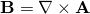。求解过程寻求由模型某些区域中施加的直流体电流密度分布 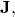 引起的静态磁响应。麦克斯韦方程的磁静态近似为

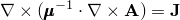

以场量  和  以及磁导率张量 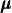 表示。磁导率通过本构方程 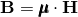 将磁通量密度  与磁场  联系起来。

上述方程的变分形式为

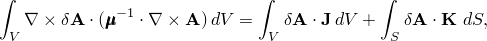

其中 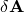 表示磁矢量势的变分， 表示外表面处施加的切向面电流密度（如有）。

Abaqus/Standard 求解麦克斯韦方程的变分形式，以获得磁矢量势的分量。其他场量由磁矢量势导出。以下讨论中，控制方程针对线性介质编写。

#### 定义磁性行为

电磁介质的磁性行为可以是线性或非线性的。线性磁性行为的特征是磁导率张量假定与磁场无关。通过直接指定绝对磁导率张量  来定义，可以是各向同性、正交各向异性或完全各向异性的（参见["磁导率"，第 26.5.3 节](pt05ch26s05abm63.md)）。磁导率也可以取决于温度和/或预定义场变量。

非线性磁性行为的特征是磁导率取决于磁场强度。Abaqus 中的非线性磁性材料模型适用于理想软磁材料，其特征是在 B-H 空间中的响应单调递增，其中 B 和 H 分别指磁通量密度矢量和磁场矢量的强度。非线性磁性行为通过直接指定一条或多条 B-H 曲线来定义，这些曲线提供 B 作为 H、可选温度和/或预定义场变量的函数，在一个或多个方向上。非线性磁性行为可以是各向同性、正交各向异性或横向各向同性的（这是更一般正交各向异性行为的特殊情况）。

### 磁静态分析

磁静态分析提供给定施加直流电值下的磁通量密度和磁场。

| **输入文件用法：** | ``` [*MAGNETOSTATIC](../key/key-link.md#usb-kws-hmagnetostatic) ``` |
| --- | --- |

### 磁静态分析中的病态问题

在磁静态分析中，刚度矩阵可能严重病态；即可能有许多奇异性。Abaqus 使用特殊的迭代求解技术来防止病态矩阵对计算的磁场产生负面影响。默认实现对许多问题效果良好。但是，在某些情况下，默认数值方案可能无法收敛。Abaqus 提供了一种稳定化方案来帮助减轻病态效应。可通过指定稳定化因子为该稳定化算法提供输入，如果使用稳定化方案，默认假定为 1.0。稳定化因子越高，稳定化越多；稳定化因子越低，稳定化越少。

| **输入文件用法：** | ``` [*MAGNETOSTATIC](../key/key-link.md#usb-kws-hmagnetostatic), STABILIZATION=*stabilization factor* ``` |
| --- | --- |

### 初始条件

可指定温度和/或预定义场变量的初始值。这些值仅影响温度和/或场变量相关的材料属性（如有）。磁静态分析中不能指定磁场的初始条件。

### 边界条件

电磁单元使用基于单元边的场插值。单元的自由度与仅定义单元几何形状的用户定义节点无关。因此，标准的基于节点的边界条件指定方法不能与电磁单元一起使用。

Abaqus 中的边界条件通常指文献中传统上称为 Dirichlet 型边界条件的情况，其中主变量的值在整个边界或边界的一部分上已知。另一种，Neumann 型边界条件，指在边界的某些部分上主变量的共轭值已知的情况。在 Abaqus 中，Neumann 型边界条件在有限元公式中表示为面载荷。

对于包括磁静态问题在内的电磁边界值问题，封闭面上的 Dirichlet 边界条件必须指定为 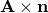，其中  是面的外法线，如本节所述。Neumann 边界条件必须指定为面电流密度矢量 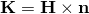，如下面["载荷](pt03ch06s07at25.md#usb-anl-amagnetostatic-loads)"中所述。

在 Abaqus 中，Dirichlet 边界条件指定为（基于单元的）面上的磁矢量势 ，这些面代表模型中的对称面和/或外边界；Abaqus 为代表性面计算 。模型可能跨越的域最多为问题某特征长度尺度的 10 倍。在这种情况下，磁场假设在远场已充分衰减，磁矢量势的值可在远场边界处设为零。另一方面，在磁性材料嵌入均匀远场磁场中等应用中，可能需要在外边界的某些部分指定非零磁矢量势值。在这种情况下，模拟相同物理现象的替代方法是在远场边界指定相应的唯一面电流密度值 （见下面["载荷](pt03ch06s07at25.md#usb-anl-amagnetostatic-loads)"）。 可根据已知的远场磁场值计算。

在磁静态分析中，边界条件假定为常数或随时间缓慢变化。时间变化可使用幅值定义指定（["幅值曲线"，第 34.1.2 节](pt07ch34s01aus115.md)）。

没有任何规定边界条件的面对应于零面电流或无载荷的面。

在（基于单元的）面上规定边界条件时（参见["基于单元的面定义"，第 2.3.2 节](pt01ch02s03aus17.md)），必须指定面名称、区域类型标签（S）、边界条件类型标签、可选方向名称、磁矢量势的幅值以及磁矢量势的方向矢量。可选方向名称定义了磁矢量势分量所定义的局部坐标系。默认情况下，分量相对于全局方向定义。

指定的矢量分量由 Abaqus 归一化，因此不影响边界条件的幅值。

非均匀边界条件可用用户子程序 [`UDEMPOTENTIAL`](../sub/sub-link.md#sub-xsl-udempotential) 定义。

| **输入文件用法：** | 使用以下选项定义基于单元面上边界条件的实（同相）和虚（异相）部分： |
| --- | --- |
|  | ``` [*D EM POTENTIAL](../key/key-link.md#usb-kws-hdempotential) *面名称, S, bc 类型标签, 方向, 幅值, 方向矢量* ``` 其中边界条件类型标签（*bc type label*）可以是 MVP（均匀边界条件）或 MVPNU（非均匀边界条件）。 |

### 载荷

磁静态分析中可施加以下类型的电磁载荷（详情参见["电磁载荷"第 34.4.5 节](pt07ch34s04aus124.md#usb-prc-electromag-eddy)中"为涡流和/或磁静态分析规定电磁载荷"）：
- 基于单元的分布体电流密度矢量 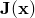
- 基于面的分布面电流密度矢量 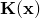

分析中规定的载荷可使用幅值定义进行变化（["幅值曲线"，第 34.1.2 节](pt07ch34s01aus115.md)）。

### 预定义场

磁静态分析中可指定预定义温度和场变量。这些值仅影响温度和/或场变量相关的材料属性（如有）。参见["预定义场"，第 34.6.1 节](pt07ch34s06aus128.md)。

### 材料选项

模型中各处必须定义磁性行为（参见["磁导率"，第 26.5.3 节](pt05ch26s05abm63.md)），可通过指定绝对磁导率张量来定义线性磁性行为，或通过指定基于 B-H 曲线的响应来定义非线性磁性行为。磁静态分析中忽略所有其他材料属性，包括电导率。磁性行为可以是预定义温度和/或场变量的函数。

永磁体（参见["磁导率"，第 26.5.3 节](pt05ch26s05abm63.md)）可包含在磁静态分析中。

### 单元

磁静态分析中必须使用电磁单元来模拟所有区域。与使用基于节点插值的常规有限单元不同，这些单元使用基于边的插值，以磁矢量势沿单元边的切向分量作为主要自由度。

电磁单元在 Abaqus/Standard 中以二维（仅平面）和三维形式提供（参见["为分析类型选择合适的单元"，第 27.1.3 节](pt06ch27s01aus112.md)）。平面单元以面内磁矢量势为基础建立，因此磁通量密度和磁场矢量只有面外分量。

### 输出

磁静态分析只向输出数据库（`.odb`）文件提供输出（参见["输出到输出数据库"，第 4.1.3 节](pt02ch04s01aus40.md)）。不能输出到数据文件（`.dat`）和结果文件（`.fil`）。

单元形心变量：

| EMB | 磁通量密度矢量  的量级和分量。 |
| --- | --- |

| EMCDA | 施加体电流密度矢量的量级和分量。 |
| --- | --- |

| EMH | 磁场矢量  的量级和分量。 |
| --- | --- |

| TEMP | 单元形心处的温度。 |
| --- | --- |

整个单元变量：

| EVOL | 单元体积。 |
| --- | --- |

### 输入文件模板

```
[*HEADING](../key/key-link.md#usb-kws-mheading)
…
[*MATERIAL](../key/key-link.md#usb-kws-mmaterial), NAME=*mat1*
[*MAGNETIC PERMEABILITY](../key/key-link.md#usb-kws-mmagpermeability), NONLINEAR
*定义线性磁性行为磁导率的数据行；非线性磁性行为此处不需要数据*
[*NONLINEAR BH](../key/key-link.md#usb-kws-mnonlinearbh), DIR=*direction*
*定义非线性 B-H 曲线的数据行*
**
[*STEP](../key/key-link.md#usb-kws-hstep)
[*MAGNETOSTATIC](../key/key-link.md#usb-kws-hmagnetostatic)
*定义时间增量的数据行*
[*D EM POTENTIAL](../key/key-link.md#usb-kws-hdempotential)
*定义磁矢量势边界条件的数据行*
[*DECURRENT](../key/key-link.md#usb-kws-hdecurrent)
*定义基于单元的分布体电流密度矢量的数据行*
[*DSECURRENT](../key/key-link.md#usb-kws-hdsecurrent)
*定义基于面的分布面电流密度矢量的数据行*
[*OUTPUT](../key/key-link.md#usb-kws-houtput), FIELD 或 HISTORY
*请求基于单元输出的数据行*
[*END STEP](../key/key-link.md#usb-kws-hendstep)
```


