# 6.8.2 地静力应力状态

**产品：** Abaqus/Standard  Abaqus/CAE  

##### **参考**

- ["定义分析，" 第 6.1.2 节](pt03ch06s01abo05.md)
- ["耦合孔隙流体扩散与应力分析，" 第 6.8.1 节](pt03ch06s08at26.md)
- [*GEOSTATIC](../key/key-link.md#usb-kws-hgeostatic)
- ["在"配置一般分析程序"中配置地静力应力场程序，" Abaqus/CAE 用户指南第 14.11.1 节](../usi/usi-link.md#usi-sim-configure-geostatic)

### 概述

地静力应力场程序：
- 用于验证初始地静力应力场是否与施加荷载和边界条件平衡，并在必要时迭代以获得平衡；
- 当使用孔压单元时，考虑孔压自由度；当使用耦合温度-孔压单元时，考虑温度自由度；
- 通常是岩土分析的第一步，随后是耦合孔隙流体扩散/应力（有或没有传热）或静态分析程序；并且
- 可以是线性或非线性的。

### 建立地静力平衡

地静力程序通常用作岩土分析的第一步；在这种情况下，重力荷载在此步骤中施加。理想情况下，荷载和初始应力应精确平衡并产生零变形。但是，在复杂问题中，可能难以指定精确平衡的初始应力和荷载。

Abaqus/Standard 提供了两种建立初始平衡的程序。第一种程序适用于初始应力状态至少近似已知的问题。第二种增强程序也适用于初始应力未知的情况；它仅支持有限数量的单元和材料。

#### 当初始应力状态近似已知时建立平衡

地静力程序要求初始应力接近平衡状态；否则，对应于平衡状态的位移可能很大。Abaqus/Standard 在地静力程序期间检查平衡，并在需要时迭代以获得与规定边界条件和荷载平衡的应力状态。然后将此应力状态（它是由初始条件定义的应力场的修改，见 ["Abaqus/Standard 和 Abaqus/Explicit 中的初始条件，" 第 34.2.1 节](pt07ch34s02aus116.md)）用作后续静态或耦合孔隙流体扩散/应力（有或没有传热）分析的初始应力场。

如果作为初始条件给出的应力在地静力荷载下远离平衡，并且问题定义中存在某些非线性，则此迭代过程可能会失败。因此，应确保初始应力合理地接近平衡。

如果地静力步骤中产生的变形与后续荷载引起的变形相比显著，则应重新检查初始状态的定义。

如果在地静力步骤中通过使用耦合温度-孔压单元建模传热，则指定的初始温度场和热荷载（如果指定）必须使系统相对接近热平衡状态。在地静力步骤中假设稳态传热。

| **输入文件用法：** | ``` [*GEOSTATIC](../key/key-link.md#usb-kws-hgeostatic) ``` |
| --- | --- |

| **Abaqus/CAE 用法：** | Step 模块：**Create Step**：**General**：**Geostatic** |
| --- | --- |

#### 当初始应力状态未知时建立平衡

为了在初始应力状态未知或仅近似已知的情况下获得平衡，可以调用增强程序。Abaqus 自动计算与初始荷载和初始配置对应的平衡，仅允许在用户指定容差内的小位移。（默认容差为 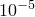。）该程序适用于有限数量的单元和材料，旨在用于材料响应主要为弹性的分析；即非弹性变形很小。

该程序支持几何线性和几何非线性分析。但是，一般来说，几何线性情况下的性能会更好。因此，即使在后续步骤中执行几何非线性分析，在几何线性步骤中获得初始平衡也可能是有利的。

| **输入文件用法：** | 使用以下选项调用增强程序： |
| --- | --- |
|  | ``` [*GEOSTATIC](../key/key-link.md#usb-kws-hgeostatic), UTOL=*位移容差* ``` |

| **Abaqus/CAE 用法：** | Step 模块：**Create Step**：**General**：**Geostatic**：**Incrementation** 选项卡：**Automatic**：**Max. displacement change** |
| --- | --- |

##### 限制

以下限制适用于增强程序：
- 它仅支持有限数量的单元（见下方["单元"](pt03ch06s08at27.md#usb-anl-ageostatstress-elements)）和材料（见下方["材料选项"](pt03ch06s08at27.md#usb-anl-ageostatstress-material)）。当该程序与不支持的单元或材料模型一起使用时，Abaqus 会发出警告消息。在这种情况下，用户有责任确保指定的位移容差大于分析中的位移；否则，可能会出现收敛问题。
- 只有在前一个分析中使用过该程序的情况下，才能在重启动分析中使用它。

#### 耦合传热的可选建模

当使用耦合温度-孔压单元时，默认情况下在这些单元中建模传热。但是，可以选择在地静力步骤中关闭这些单元内的传热。如果温度和相关热流效应不重要，此功能有助于减少计算时间。

| **输入文件用法：** | 使用以下选项抑制传热建模： |
| --- | --- |
|  | ``` [*GEOSTATIC](../key/key-link.md#usb-kws-hgeostatic), HEAT=NO ``` |

| **Abaqus/CAE 用法：** | 在 Abaqus/CAE 中不支持关闭物理的传热部分。 |
| --- | --- |

#### 多孔介质中的竖向平衡

大多数岩土工程问题从地静力状态开始，这是未扰动土体或岩体在地静力荷载下的稳态平衡状态。平衡状态通常包括水平和竖向应力分量。正确建立这些初始条件非常重要，以使问题从平衡状态开始。由于此类问题通常涉及完全或部分饱和流动，必须定义多孔介质的初始孔隙比 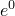、初始孔压  和初始有效应力。

如果重力荷载的大小和方向通过使用重力分布荷载类型定义，则使用总孔压而非超静孔压的解（见["耦合孔隙流体扩散与应力分析，" 第 6.8.1 节](pt03ch06s08at26.md)）。本讨论基于总孔压公式。

在本讨论中，*z* 轴竖直向上，忽略大气压。假设孔隙流体在地静力程序期间处于静水平衡状态，使得

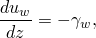

其中  是用户定义的孔隙流体重度（见["渗透率，" 第 26.6.2 节](pt05ch26s06abm64.md)）。（如果多孔介质中有显著的稳态孔隙流体流动，孔隙流体不处于静水平衡：在这种情况下，必须执行稳态耦合孔隙流体扩散/应力分析来建立任何后续瞬态计算的初始条件——见["耦合孔隙流体扩散与应力分析，" 第 6.8.1 节](pt03ch06s08at26.md)。）如果我们还假设  与 *z* 无关（通常是这样，因为流体几乎不可压缩），则可以对此方程进行积分以定义

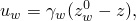

其中 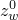 是*自由面*的高度，在此处 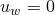，在此高度以上 ，孔隙流体仅部分饱和。

通常假设没有显著的剪切应力 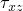、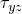。则竖向平衡为

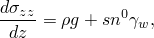

其中  是多孔固体材料的干密度（单位体积的干质量），*g* 是重力加速度， 是材料的初始孔隙率，*s* 是饱和度 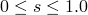（见["渗透率，" 第 26.6.2 节](pt05ch26s06abm64.md)）。由于孔隙率是孔隙体积与总体积之比，孔隙比是孔隙体积与固体体积之比，故  由初始孔隙比定义为

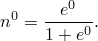

Abaqus/Standard 要求将有效应力的初始值  作为初始条件给出（["Abaqus/Standard 和 Abaqus/Explicit 中的初始条件，" 第 34.2.1 节](pt07ch34s02aus116.md)）。有效应力由总应力  定义为

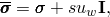

其中  是单位矩阵。将此定义与 *z* 方向的平衡方程及孔隙流体的静水平衡结合，得到

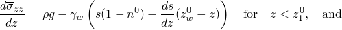

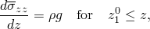

同样使用  与 *z* 无关的假设。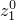 是将干土与部分饱和土分开的表面位置。假设对于 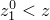 土体是干燥的（），对于 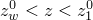 是部分饱和的，对于 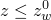 是完全饱和的。

在许多情况下，*s* 是常数。例如，在完全饱和流动中，自由面以下处处 。如果进一步假设初始孔隙率  和多孔介质的干密度  也是常数，则上述方程容易积分得到

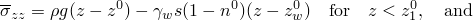

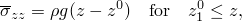

其中  是多孔介质表面的位置，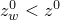。

在 *s*、 和/或  随高度变化的更复杂情况下，必须在竖直方向上积分方程以定义 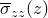 的初始值。

#### 多孔介质中的水平平衡

在许多岩土工程应用中，还存在水平应力，通常由构造作用引起。如果孔隙流体处于静水平衡且 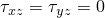，则水平方向的平衡要求有效应力的水平分量不随水平位置变化：仅 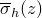，其中 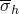 是有效应力的任意水平分量。

### 初始条件

初始有效地静力应力场  通过定义初始应力条件给出。除非使用增强程序，否则初始应力状态必须接近与施加荷载和边界条件的平衡。参见["Abaqus/Standard 和 Abaqus/Explicit 中的初始条件，" 第 34.2.1 节](pt07ch34s02aus116.md)。

可以指定初始应力仅随高程变化，如["Abaqus/Standard 和 Abaqus/Explicit 中的初始条件，" 第 34.2.1 节](pt07ch34s02aus116.md) 中所述。在这种情况下，水平应力通常假设为竖向应力的一个分数：这些分数在 *x* 方向和 *y* 方向中定义。

在涉及部分或完全饱和多孔介质的问题中，必须给出初始孔隙流体压力 、孔隙比  和饱和度值 *s*（见["耦合孔隙流体扩散与应力分析，" 第 6.8.1 节](pt03ch06s08at26.md)）。

在部分饱和情况下，初始孔压和饱和度值必须在吸收曲线和排水曲线上或之间（见["吸附，" 第 26.6.4 节](pt05ch26s06abm66.md)）。部分饱和问题的示例在 [Abaqus 基准指南第 1.9.3 节"部分饱和多孔介质中的毛细现象"](../bmk/bmk-link.md#bmk-anl-wicking) 中说明。

如果在地静力程序期间建模传热，也可以在模型中指定初始温度。

### 边界条件

边界条件可以施加到位移自由度 1–6 和孔压自由度 8 上（["Abaqus/Standard 和 Abaqus/Explicit 中的边界条件，" 第 34.3.1 节](pt07ch34s03aus118.md)）。如果使用耦合温度-孔压单元，也可以将温度自由度 11 的边界条件施加到属于这些单元的节点。如果使用增强程序并施加非零边界条件，用户有责任确保与指定容差对应的位移大于分析中的位移；否则，非零边界节点处的位移将被重置为零，使用指定的容差。

边界条件应与初始应力和施加荷载平衡。如果水平应力非零，则必须通过固定有限元模型任何非水平边缘在水平方向上的边界条件或使用无限单元（["无限单元，" 第 28.3.1 节](pt06ch28s03alm03.md)）来维持水平平衡。如果建模传热，温度边界条件应与初始温度场和施加的热荷载平衡。

### 荷载

在地静力应力场程序中可以施加以下类型的荷载：
- 集中节点力可以施加到位移自由度（1–6）；参见["集中荷载，" 第 34.4.2 节](pt07ch34s04aus121.md)。
- 也可以施加分布压力或体力；参见["分布荷载，" 第 34.4.3 节](pt07ch34s04aus122.md)。特定单元可用的分布荷载类型在[第 VI 部分，"单元"](pt06.md) 中描述。重力荷载的大小和方向通过使用重力或体力分布荷载类型定义。
- 孔隙流体流动按["孔隙流体流动，" 第 34.4.7 节](pt07ch34s04aus126.md) 中所述控制。

如果建模传热，还可以施加以下类型的热荷载（["热荷载，" 第 34.4.4 节](pt07ch34s04aus123.md)）。在地静力分析期间，Abaqus/CAE 不支持这些荷载。
- 集中热通量。
- 体通量和分布面通量。
- 对流膜条件和辐射条件；膜属性可以是温度的函数。

### 预定义场

在地静力应力场程序中可以指定以下预定义场，如["预定义场，" 第 34.6.1 节](pt07ch34s06aus128.md) 所述：
- 对于不建模传热且使用普通孔压单元的地静力分析，温度不是自由度，可以指定节点温度。
- 在还建模传热的地静力分析中，不允许预定义温度场。应改用边界条件来指定温度，如前所述。
- 可以指定用户定义场变量的值；这些值仅影响场变量相关的材料属性（如果有）。

### 材料选项

Abaqus/Standard 中任何可用的力学本构模型都可以用于建模多孔固体材料。但是，增强程序只能与弹性、多孔弹性、扩展剑桥黏土塑性和 Mohr-Coulomb 塑性模型一起使用。如果位移大于与指定容差对应的位移，使用不支持的材料模型与此程序可能导致收敛性差或不收敛。如果程序与不支持的材料模型一起使用，Abaqus 将发出警告消息。

如果将在地静力程序之后分析多孔介质，应定义渗透率和吸附等孔隙流体流动量（见["孔隙流体流动属性，" 第 26.6.1 节](pt05ch26s06abo24.md)）。

如果建模传热，应为固体和孔隙流体相定义热属性，如导率、比热和密度（有关如何为两相分别指定热属性的详细信息，见["耦合孔隙流体扩散与应力分析"第 6.8.1 节中的"建模传热时的热属性"](pt03ch06s08at26.md#usb-anl-acoupdiffstress-thermal-mat)）。

### 单元

Abaqus/Standard 中任何应力/位移单元都可以在地静力程序中使用。连续体孔压单元也可以用于建模变形多孔介质中的流体。除了位移自由度 1–3 之外，这些单元还具有孔压自由度 8。但是，增强程序只能与具有孔压自由度的连续体和粘结单元以及相应的应力/位移单元一起使用。如果位移大于与指定容差对应的位移，使用不支持的单元与此程序可能导致收敛性差或不收敛。如果程序与不支持的单元一起使用，Abaqus 将发出警告消息。

如果需要建模传热，可以使用耦合温度、孔压和位移的连续体单元。除了孔压自由度 8 和位移自由度 1–3 之外，这些单元还具有温度自由度 11。有关更多信息，参见["为分析类型选择适当的单元，" 第 27.1.3 节](pt06ch27s01aus112.md)。

### 输出

耦合孔隙流体扩散/应力分析可用的单元输出包括通常的力学量，如（有效）应力、应变、能量以及状态变量、场变量和用户定义变量的值。此外，以下与孔隙流体流动相关的量也是可用的：

| VOIDR | 孔隙比 *e*。 |
| --- | --- |

| POR | 孔压 。 |
| --- | --- |

| SAT | 饱和度 *s*。 |
| --- | --- |

| GELVR | 凝胶体积比 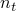。 |
| --- | --- |

| FLUVR | 总流体体积比 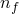。 |
| --- | --- |

| FLVEL | 孔隙流体有效速度矢量  的大小和分量。 |
| --- | --- |

| FLVELM | 孔隙流体有效速度矢量的大小 。 |
| --- | --- |

| FLVEL*n* | 孔隙流体有效速度矢量的第 *n* 个分量（*n*=1, 2, 3）。 |
| --- | --- |

如果建模传热，以下与传热相关的单元输出变量也是可用的：

| HFL | 热通量矢量的大小和分量。 |
| --- | --- |

| HFL*n* | 热通量矢量的第 *n* 个分量（*n*=1, 2, 3）。 |
| --- | --- |

| HFLM | 热通量矢量的大小。 |
| --- | --- |

| TEMP | 积分点温度。 |
| --- | --- |

可用的节点输出包括通常的力学量，如位移、反力和坐标。此外，以下与孔隙流体流动相关的量也是可用的：

| POR | 节点处的孔压。 |
| --- | --- |

| RVF | 由规定压力引起的反应流体体积通量。此通量是为维持规定压力边界条件而通过节点进入或离开模型的流体体积速率。RVF 的正值表示流体进入模型。 |
| --- | --- |

如果建模传热，以下与传热相关的节点输出变量也是可用的：

| NT | 节点点温度。 |
| --- | --- |

| RFL | 由规定温度引起的反应通量值。 |
| --- | --- |

| RFL*n* | 节点处的第 *n* 个反应通量值（*n*=11, 12, …）。 |
| --- | --- |

| CFL | 集中通量值。 |
| --- | --- |

| CFL*n* | 节点处的第 *n* 个集中通量值（*n*=11, 12, …）。 |
| --- | --- |

所有输出变量标识符在["Abaqus/Standard 输出变量标识符，" 第 4.2.1 节](pt02ch04s02abv01.md) 中列出。

### 输入文件模板

```
[*HEADING](../key/key-link.md#usb-kws-mheading)
…
[*MATERIAL](../key/key-link.md#usb-kws-mmaterial), NAME=mat1
*定义固体材料力学属性的数据行*
…
[*DENSITY](../key/key-link.md#usb-kws-mdensity)
*定义干材料密度的数据行*
[*PERMEABILITY](../key/key-link.md#usb-kws-mpermeabil), SPECIFIC=
*定义渗透率 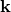 作为孔隙比 *e* 函数的数据行*
[*CONDUCTIVITY](../key/key-link.md#usb-kws-mconductivity)
*如果建模传热，定义固体颗粒热导率的数据行*
[*CONDUCTIVITY](../key/key-link.md#usb-kws-mconductivity),TYPE=ISO, PORE FLUID
*如果建模传热，定义渗透流体热导率的数据行*
[*SPECIFIC HEAT](../key/key-link.md#usb-kws-mspecificheat)
*如果在后续步骤中建模瞬态传热，定义固体颗粒比热的数据行*
[*SPECIFIC HEAT](../key/key-link.md#usb-kws-mspecificheat),PORE FLUID
*如果在后续步骤中建模瞬态传热，定义渗透流体比热的数据行*
[*DENSITY](../key/key-link.md#usb-kws-mdensity)
*如果在后续步骤中建模瞬态传热，定义固体颗粒密度的数据行*
[*DENSITY](../key/key-link.md#usb-kws-mdensity),PORE FLUID
*如果在后续步骤中建模瞬态传热，定义渗透流体密度的数据行*
[*LATENT HEAT](../key/key-link.md#usb-kws-mlatentheat)
*如果建模由温度变化引起的相变，定义固体颗粒潜热的数据行*
[*LATENT HEAT](../key/key-link.md#usb-kws-mlatentheat),PORE FLUID
*如果建模由温度变化引起的相变，定义渗透流体潜热的数据行*
…
[*INITIAL CONDITIONS](../key/key-link.md#usb-kws-minitialcond), TYPE=STRESS, GEOSTATIC
*定义初始应力状态的数据行*
[*INITIAL CONDITIONS](../key/key-link.md#usb-kws-minitialcond), TYPE=PORE PRESSURE
*定义孔隙流体压力初始值的数据行*
[*INITIAL CONDITIONS](../key/key-link.md#usb-kws-minitialcond), TYPE=RATIO
*定义孔隙比初始值的数据行*
[*INITIAL CONDITIONS](../key/key-link.md#usb-kws-minitialcond), TYPE=SATURATION
*定义初始饱和度的数据行*
[*INITIAL CONDITIONS](../key/key-link.md#usb-kws-minitialcond), TYPE=TEMPERATURE
*定义初始温度的数据行*
[*BOUNDARY](../key/key-link.md#usb-kws-hboundary)
*定义零值边界条件的数据行*
**
[*STEP](../key/key-link.md#usb-kws-hstep)
[*GEOSTATIC](../key/key-link.md#usb-kws-hgeostatic)
[*CLOAD](../key/key-link.md#usb-kws-hcload) 和/或 [*DLOAD](../key/key-link.md#usb-kws-hdload) 和/或 [*DSLOAD](../key/key-link.md#usb-kws-hdsload)
*指定力学荷载的数据行*
[*FLOW](../key/key-link.md#usb-kws-hflow) 和/或 [*SFLOW](../key/key-link.md#usb-kws-hsflow) 和/或 [*DFLOW](../key/key-link.md#usb-kws-hdflow) 和/或 [*DSFLOW](../key/key-link.md#usb-kws-hdsflow)
*指定孔隙流体流动的数据行*
[*CFLUX](../key/key-link.md#usb-kws-hcflux) 和/或 [*DFLUX](../key/key-link.md#usb-kws-hdflux)
*如果建模传热，定义集中和/或分布热通量的数据行*
[*BOUNDARY](../key/key-link.md#usb-kws-hboundary)
*指定位移或孔压的数据行*
[*END STEP](../key/key-link.md#usb-kws-hendstep)
```
