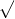

# 8.1.1 Analysis techniques: overview

Abaqus provides an extensive selection of analysis techniques. These techniques provide powerful tools for performing your analysis more efficiently and effectively.

### Analysis continuation techniques

In many cases your analysis results represent a significant investment of computational effort. As a result, you will often want to reduce computation costs by utilizing results from an analysis that has already been performed. In other cases your overall analysis history will be comprised of distinct Abaqus jobs, each representing a portion of the response history of the model. Abaqus provides the following analysis continuation techniques:
- Abaqus allows you to restart an analysis, as long as you request that certain files containing model and state data be saved in the original analysis. See ["Restarting an analysis," Section 9.1.1](pt04ch09s01aus53.md).
- You can perform part of an analysis with Abaqus/Standard or Abaqus/Explicit and continue the analysis with the other product. You can transfer results from Abaqus/Standard to Abaqus/Explicit, from Abaqus/Explicit to Abaqus/Standard, and from Abaqus/Standard to Abaqus/Standard. See ["Transferring results between Abaqus analyses: overview," Section 9.2.1](pt04ch09s02aus54.md).

### Modeling abstractions

All Abaqus models involve certain abstractions. In addition to the traditional abstractions associated with the finite element method, you can include techniques in your model to obtain more cost-effective solutions. Abaqus provides the following techniques for modeling abstractions:
- You can create substructures by grouping a number of elements together and retaining only the degrees of freedom needed to interface with adjacent structures. This technique is particularly useful when a substructure is to be reused in the same analysis, in different analyses, or by different analysts. See ["Using substructures," Section 10.1.1](pt04ch10s01aus58.md).
- You can analyze local regions of a model in greater detail and interpolate the solution results from a larger coarser global model. See ["Submodeling: overview," Section 10.2.1](pt04ch10s02aus60.md).
- You can allow for the mathematical abstraction of model data such as mesh and material information by generating global or element matrices representing the stiffness, mass, viscous damping, structural damping, and load vectors in a model. See ["Generating matrices," Section 10.3.1](pt04ch10s03at32.md).
- You can create a three-dimensional model in Abaqus/Standard by revolving various forms of axisymmetric and three-dimensional model sectors about an axis of symmetry (see ["Symmetric model generation," Section 10.4.1](pt04ch10s04aus63.md)). You can also transfer the solution obtained in an original axisymmetric model to the new model (see ["Transferring results from a symmetric mesh or a partial three-dimensional mesh to a full three-dimensional mesh," Section 10.4.2](pt04ch10s04aus64.md)). In addition, for models that exhibit cyclic symmetry you can extract eigenmodes and perform mode-based steady-state dynamic analysis by modeling only a single repetitive sector of the model (see ["Analysis of models that exhibit cyclic symmetry," Section 10.4.3](pt04ch10s04at34.md)).
- Using the periodic media analysis technique, you can effectively model systems that are repetitive in nature, such as manufacturing processes involving conveyor belts or continuous forming operations. See ["Periodic media analysis," Section 10.5.1](pt04ch10s05aus65.md).
- You can define a complex beam cross-section, including multiple materials and complex geometry, and automatically generate beam element cross-section properties. See ["Meshed beam cross-sections," Section 10.6.1](pt04ch10s06at35.md).

- Using the extended finite element method, you can model discontinuities, such as cracks, as an enriched feature without creating a mesh to match the geometry of the discontinuity. See ["Modeling discontinuities as an enriched feature using the extended finite element method," Section 10.7.1](pt04ch10s07at36.md).

### Special-purpose techniques

Certain analysis techniques do not fall into a general classification and are grouped here as special-purpose techniques. Abaqus provides the following special-purpose techniques:
- You can use the inertia relief technique as an inexpensive alternative to performing a full dynamic analysis on a free or partially constrained body subjected to loads derived from rigid body accelerations. See ["Inertia relief," Section 11.1.1](pt04ch11s01at37.md).
- You can selectively remove, and later reintroduce, parts of a model. See ["Element and contact pair removal and reactivation," Section 11.2.1](pt04ch11s02aus66.md).
- You can introduce small imperfections into a model, typically for postbuckling analysis. See ["Introducing a geometric imperfection into a model," Section 11.3.1](pt04ch11s03aus67.md).
- You can evaluate fracture performance through contour integral evaluation, through crack propagation modeling techniques, or by using line spring elements in conjunction with shell elements. See ["Fracture mechanics: overview," Section 11.4.1](pt04ch11s04abo13.md).
- You can model coupling between the deformation of a fluid-filled structure and the pressure exerted by a contained fluid (see ["Surface-based fluid cavities: overview," Section 11.5.1](pt04ch11s05aus70.md)).
- In Abaqus/Explicit you can use the mass scaling technique to control the stable time increment and increase computational efficiency. See ["Mass scaling," Section 11.6.1](pt04ch11s06aus74.md).
- You can use selective subcycling to allow different time increments to be used for different groups of elements, which can reduce the run time for an analysis when a small region of elements in the model controls the stable time increment. See ["Selective subcycling," Section 11.7.1](pt04ch11s07aus75.md).
- You can use steady-state detection to detect the time in a quasi-static uni-directional Abaqus/Explicit simulation when a steady-state condition has been reached and then terminate the simulation. See ["Steady-state detection," Section 11.8.1](pt04ch11s08aus76.md).

### Adaptivity techniques

Adaptivity techniques enable modification of your mesh to obtain a better solution. Abaqus provides the following adaptivity techniques:
- You can use ALE adaptive meshing to control mesh distortion or to model material loss. See ["ALE adaptive meshing: overview," Section 12.2.1](pt04ch12s02abo14.md).
- You can use adaptive remeshing with Abaqus/Standard and Abaqus/CAE to iteratively improve your mesh to obtain a more accurate solution. See ["Adaptive remeshing: overview," Section 12.3.1](pt04ch12s03abo15.md).
- You can use mesh-to-mesh solution mapping as part of a mesh replacement strategy for distortion control. See ["Mesh-to-mesh solution mapping," Section 12.4.1](pt04ch12s04aus86.md).

See ["Adaptivity techniques," Section 12.1.1](pt04ch12s01aus77.md), for a comparison of the adaptivity methods.

### Optimization techniques

You can use structural optimization, an iterative process that helps you refine your designs, to perform topology and shape optimization. In Abaqus/CAE you create the model to be optimized and define, configure, and execute the structural optimization. See ["Structural optimization: overview," Section 13.1.1](pt04ch13s01abo16.md).

### Eulerian analysis

You can use Abaqus/Explicit to simulate extreme deformation, up to and including fluid flow, in an Eulerian analysis. Eulerian materials can be coupled to Lagrangian structures to analyze fluid-structure interactions. See ["Eulerian analysis," Section 14.1.1](pt04ch14s01aus90.md).

### Particle methods

Using the smoothed particle hydrodynamics technique, you can model violent free-surface fluid flow (such as wave impact) and extremely high deformation/obliteration of solid structures (such as ballistics). See ["Smoothed particle hydrodynamics," Section 15.2.1](pt04ch15s02aus95.md).

Using the discrete element technique, you can model particulate media and perform analyses such as granular material mixing or segregation, transport, and deposition of particulate materials. See ["Discrete element method," Section 15.1.1](pt04ch15s01aus94.md).

### Sequentially coupled multiphysics analyses

In Abaqus/Standard you can perform sequentially coupled multiphysics analyses when the coupling between one or more of the physical fields in a model is only important in one direction. See ["Sequentially coupled multiphysics analyses," Section 16.1](pt04ch16s01.md).

### Co-simulation

You can use the co-simulation technique for run-time coupling of two Abaqus analyses or of Abaqus with third-party analysis programs to perform multiphysics simulation. See ["Co-simulation: overview," Section 17.1.1](pt04ch17s01abo17.md).

### Extending Abaqus analysis functionality

You can use the flexibility of user subroutines to increase the functionality of Abaqus. See ["User subroutines and utilities," Section 18.1](pt04ch18s01.md).

### Design sensitivity analysis

You can use design sensitivity analysis (DSA) techniques to determine sensitivities of responses with respect to specified design parameters. You can use these techniques for design studies within Abaqus/Standard or in conjunction with third-party design optimization tools. See ["Design sensitivity analysis," Section 19.1.1](pt04ch19s01aus107.md).

### Parametric studies

You can use parametric studies to perform multiple analyses in which you can systematically vary modeling parameters that you define. See ["Scripting parametric studies," Section 20.1.1](pt04ch20s01aus108.md), and ["Parametric studies: commands," Section 20.2](pt04ch20s02.md).

### Availability of analysis techniques

The availability of the analysis techniques provided in Abaqus is summarized in [Table 8.1.1--1](pt04ch08s01abo12.md#usb-aba-techniques). In addition, optimization techniques are available in Abaqus/CAE (see ["Structural optimization: overview," Section 13.1](pt04ch13s01.md)).

**Table 8.1.1–1** Availability of analysis techniques in Abaqus.
| Technique | Abaqus/Standard | Abaqus/Explicit | Abaqus/CFD |
| --- | --- | --- | --- |
| ["Restarting an analysis," Section 9.1](pt04ch09s01.md) |  |  |  |
| ["Importing and transferring results," Section 9.2](pt04ch09s02.md) |  |  |  |
| ["Substructuring," Section 10.1](pt04ch10s01.md) |  |  |  |
| ["Submodeling," Section 10.2](pt04ch10s02.md) |  |  |  |
| ["Generating matrices," Section 10.3](pt04ch10s03.md) |  |  |  |
| ["Symmetric model generation, results transfer, and analysis of cyclic symmetry models," Section 10.4](pt04ch10s04.md) |  |  |  |
| ["Periodic media analysis," Section 10.5](pt04ch10s05.md) |  |  |  |
| ["Meshed beam cross-sections," Section 10.6](pt04ch10s06.md) |  |  |  |
| ["Modeling discontinuities as an enriched feature using the extended finite element method," Section 10.7](pt04ch10s07.md) |  |  |  |
| ["Inertia relief," Section 11.1](pt04ch11s01.md) |  |  |  |
| ["Mesh modification or replacement," Section 11.2](pt04ch11s02.md) |  |  |  |
| ["Geometric imperfections," Section 11.3](pt04ch11s03.md) |  |  |  |
| ["Fracture mechanics," Section 11.4](pt04ch11s04.md) |  |  |  |
| ["Surface-based fluid modeling," Section 11.5](pt04ch11s05.md) |  |  |  |
| ["Mass scaling," Section 11.6](pt04ch11s06.md) |  |  |  |
| ["Selective subcycling," Section 11.7](pt04ch11s07.md) |  |  |  |
| ["Steady-state detection," Section 11.8](pt04ch11s08.md) |  |  |  |
| ["ALE adaptive meshing," Section 12.2](pt04ch12s02.md) |  |  |  |
| ["Adaptive remeshing," Section 12.3](pt04ch12s03.md) |  |  |  |
| ["Analysis continuation after mesh replacement," Section 12.4](pt04ch12s04.md) |  |  |  |
| ["Eulerian analysis," Section 14.1](pt04ch14s01.md) |  |  |  |
| ["Continuum particle analyses," Section 15.2](pt04ch15s02.md) |  |  |  |
| ["Discrete element method," Section 15.1](pt04ch15s01.md) |  |  |  |
| ["Sequentially coupled multiphysics analyses," Section 16.1](pt04ch16s01.md) |  |  |  |
| ["Co-simulation," Section 17.1](pt04ch17s01.md) |  |  |  |
| ["User subroutines and utilities," Section 18.1](pt04ch18s01.md) |  |  |  |
| ["Design sensitivity analysis," Section 19.1](pt04ch19s01.md) |  |  |  |
| ["Scripting parametric studies," Section 20.1](pt04ch20s01.md) |  |  |  |

