# 10.7.1 使用扩展有限元方法将不连续性建模为富集特征


**产品：** Abaqus/Standard  Abaqus/CAE  Abaqus/Viewer

**参考资料**

- [*ENRICHMENT](../key/key-link.md#usb-kws-menrichment)
- [*ENRICHMENT ACTIVATION](../key/key-link.md#usb-kws-henrichmentactivation)
- ["使用扩展有限元方法模拟断裂力学，" Abaqus/CAE用户指南第31.3节](../usi/usi-link.md#usi-eng-xfem)

### 概述

将不连续性（如裂纹）建模为富集特征：
- 通常称为扩展有限元方法（XFEM）；
- 是基于单位分解概念的传统有限元方法的扩展；
- 通过用特殊位移函数富集自由度来允许单元内存在不连续性；
- 能够对裂纹内的流体压力场以及裂纹元素表面内的流体流动进行建模，如水力压裂；
- 不需要网格与不连续性几何形状匹配；
- 是一种非常有吸引力和有效的模拟沿任意、依赖解的路径的离散裂纹萌生和扩展的方法，无需在主体材料中重新网格划分；
- 可以同时与基于表面的内聚行为方法（参见["基于表面的内聚行为，" 第37.1.10节](pt09ch37s01alm63.md)）或虚拟裂纹闭合技术（参见["裂纹扩展分析，" 第11.4.3节](pt04ch11s04aus69.md)）结合使用，这最适合模拟界面分层；
- 可以使用静态过程（参见["静态应力分析，" 第6.2.2节](pt03ch06s02at01.md)）、隐式动态过程（参见["使用直接积分的隐式动态分析，" 第6.3.2节](pt03ch06s03at07.md)）、使用直接循环方法的低周疲劳分析（参见["使用直接循环方法的低周疲劳分析，" 第6.2.7节](pt03ch06s02at06.md)）、地静应力场过程（参见["地静应力状态，" 第6.8.2节](pt03ch06s08at27.md)）或耦合孔隙流体扩散/应力分析（参见["耦合孔隙流体扩散和应力分析，" 第6.8.1节](pt03ch06s08at26.md)）执行；
- 还可以用于对任意静止表面裂纹进行轮廓积分评估，无需在裂纹尖端附近细化网格；
- 允许基于小滑移公式的裂纹元素表面接触相互作用；
- 允许将分布压力载荷施加到裂纹元素表面；
- 允许在裂纹元素表面上输出一些表面变量；
- 允许材料和几何非线性；并且
- 仅适用于一阶应力/位移固体连续单元、一阶位移/孔隙压力固体连续单元和二阶应力/位移四面体单元。

### 建模方法

用传统有限元方法对裂纹等静止不连续性进行建模，需要网格符合几何不连续性。因此，需要在裂纹尖端附近进行相当多的网格细化，以充分捕获奇异性渐近场。建模增长中的裂纹更加麻烦，因为随着裂纹的进展，网格必须不断更新以匹配不连续性的几何形状。

扩展有限元方法（XFEM）减轻了与裂纹表面网格划分相关的缺点。扩展有限元方法首先由[Belytschko和Black（1999）](pt04ch10s07at36.md#aenrichment-belytschko1999)引入。它是基于Melenk和Babuska（1996）提出的单位分解概念的经典有限元方法的扩展，允许将局部富集函数容易地纳入有限元近似。不连续性的存在由与附加自由度结合的特殊富集函数确保。然而，有限元框架及其属性（如稀疏性和对称性）得以保留。

#### 引入节点富集函数

为了断裂分析的目的，富集函数通常由捕获裂纹尖端附近奇异性的近尖渐近函数和表示裂纹表面之间位移跳跃的不连续函数组成。带有单位分解富集的位移向量函数的近似为


其中是通常的节点形函数；上述方程右边第一项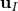是与有限元解连续部分相关的通常节点位移向量；第二项是节点富集自由度向量与裂纹表面间相关不连续跳跃函数的乘积；第三项是节点富集自由度向量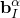与相关弹性渐近裂纹尖端函数的乘积。右边第一项适用于模型中的所有节点；第二项适用于其形函数支撑被裂纹内部切割的节点；第三项仅用于其形函数支撑被裂纹尖端切割的节点。

**图10.7.1-1** 光滑裂纹的法向和切向坐标说明。

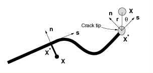

[图10.7.1-1](pt04ch10s07at36.md#anl-aenrichment-crack)说明了裂纹表面间的不连续跳跃函数，其定义为


其中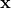是采样（高斯）点，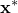是距最近的裂纹上的点，是裂纹在处的单位外向法线。

[图10.7.1-1](pt04ch10s07at36.md#anl-aenrichment-crack)说明了各向同性弹性材料中的渐近裂纹尖端函数，其定义为


其中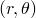是以裂纹尖端为原点的极坐标系，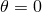与裂纹尖端处裂纹相切。

这些函数张成弹性静力学的渐近裂纹尖端函数，考虑了裂纹面的不连续性。渐近裂纹尖端函数的使用不限于各向同性弹性材料中的裂纹建模。相同的方法可用于表示沿双材料界面、在双材料界面上或弹塑性幂律硬化材料中的裂纹。然而，在这三种情况下，需要不同形式的渐近裂纹尖端函数，具体取决于裂纹位置和非弹性材料变形的程度。渐近裂纹尖端函数的不同形式分别在[Sukumar（2004）](pt04ch10s07at36.md#aenrichment-sukumar2004)、[Sukumar和Prevost（2003）](pt04ch10s07at36.md#aenrichment-sukumar2003)以及[Elguedj（2006）](pt04ch10s07at36.md#aenrichment-elguedj2006)的文章中讨论。

准确建模裂纹尖端奇异性需要不断跟踪裂纹扩展的位置，而且由于裂纹在非各向同性材料中的位置决定了奇异性程度，因此非常麻烦。因此，我们仅在Abaqus/Standard中建模静止裂纹时考虑渐近奇异性函数。移动裂纹使用下面描述的两种替代方法之一进行建模。

#### 使用内聚段方法和虚拟节点建模移动裂纹

XFEM框架内的另一种方法是基于牵引-分离内聚行为的方法。此方法在Abaqus/Standard中用于模拟裂纹萌生和扩展。这是一种非常通用的相互作用建模能力，可用于建模脆性或韧性断裂。Abaqus/Standard中其他可用的裂纹萌生和扩展能力基于内聚单元（["使用牵引-分离描述定义内聚单元的 constituto 响应，" 第32.5.6节](pt06ch32s05alm45.md)）或基于表面的内聚行为（["基于表面的内聚行为，" 第37.1.10节](pt09ch37s01alm63.md)）。与这些方法不同，这些方法需要内聚表面与单元边界对齐，并且裂纹沿预定路径扩展，XFEM基于的内聚段方法可用于模拟沿任意、依赖解的路径在主体材料中的裂纹萌生和扩展，因为裂纹传播不与网格中的单元边界绑定。在这种情况下，不需要近尖渐近奇异性，仅考虑裂纹元素间的位移跳跃。因此，裂纹必须一次传播整个单元，以避免对应力奇异性建模的需要。

引入了叠加在原始真实节点上的虚拟节点来表示裂纹元素的间断，如图[图10.7.1-2](pt04ch10s07at36.md#anl-aenrichment-phantom)所示。当元素完整时，每个虚拟节点完全约束到其对应的真实节点。当元素被裂纹切割时，裂纹元素分成两部分。每部分由一些真实节点和虚拟节点的组合形成，具体取决于裂纹的方向。每个虚拟节点及其对应的真实节点不再绑定在一起，可以分离。

**图10.7.1-2** 虚拟节点方法原理。


分离的大小由内聚律控制，直到裂纹元素的粘结强度为零，之后虚拟节点和真实节点独立移动。为了获得一组完整的插值基，裂纹元素中属于真实域的部分扩展到虚拟域。然后，真实域中的位移可以通过使用虚拟域中节点的自由度进行插值。位移场的跳跃通过仅从真实节点一侧到裂纹的面积进行积分来实现；即，和。该方法提供了一种有效且有吸引力的工程方法，已被[Song（2006）](pt04ch10s07at36.md#aenrichment-song2006)和[Remmers（2008）](pt04ch10s07at36.md#aenrichment-remmers2008)用于模拟固体中多裂纹的萌生和扩展。如果网格足够细化，已证明该方法几乎不存在网格依赖性。

##### 建模水力压裂

上面讨论的内聚段方法与虚拟节点结合使用，也可扩展到建模水力压裂。在这种情况下，在每个富集元素的边缘上引入了具有孔隙压力自由分的附加虚拟节点，以对裂纹元素表面内的流体流动进行建模，同时结合叠加在原始真实节点上的虚拟节点来表示裂纹元素中间断和流体压力的不连续性。每个元素边缘上的虚拟节点在该边缘被裂纹相交之前不会被激活。裂纹元素中的孔隙流体流模式如图[图10.7.1-3](pt04ch10s07at36.md#anl-aenrichment-fluidflow)所示。流体被认为是不可压缩的。流体流动连续性得到维持，包括裂纹元素表面内和表面间的切向和法向流动，以及裂纹元素表面张开速率。裂纹元素表面上的流体压力对富集元素中内聚段的牵引-分离行为有贡献，从而能够对水力压裂进行建模。

**图10.7.1-3** 裂纹元素内的流动。

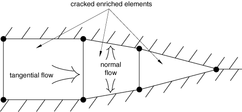

#### 基于线性弹性断裂力学（LEFM）原理和虚拟节点建模移动裂纹

XFEM框架内建模移动裂纹的另一种方法是基于线性弹性断裂力学（LEFM）原理。因此，它更适合于脆性裂纹扩展发生的问题。与上述XFEM基于的内聚段方法类似，不考虑近尖渐近奇异性，仅考虑裂纹元素间的位移跳跃。因此，裂纹必须一次传播整个单元，以避免对应力奇异性建模的需要。裂纹尖端的应变能释放率基于改进的虚拟裂纹闭合技术（VCCT）计算，该技术已用于沿已知和部分粘合表面模拟分层（参见["裂纹扩展分析，" 第11.4.3节](pt04ch11s04aus69.md)）。但是，与该方法不同，XFEM基于的LEFM方法可用于模拟沿任意、依赖解的路径在主体材料中的裂纹扩展，无需模型中预先存在裂纹。

该建模技术与上述XFEM基于的内聚段方法非常相似，其中引入虚拟节点来表示当断裂准则满足时裂纹元素的间断。当富集元素中等效应变能释放率超过裂纹尖端的临界应变能释放率时，真实节点和相应的虚拟节点将分离。牵引力最初作为相等且相反的力承载在裂纹元素两个表面上。牵引力在两个表面之间的分离上线性减小，耗散的应变能等于分离萌生所需的临界应变能或裂纹扩展所需的临界应变能，取决于指定的是VCCT还是增强VCCT准则。

##### 基于LEFM原理建模低周疲劳裂纹扩展

XFEM基于的LEFM方法也可用于模拟在直接循环方法低周疲劳分析中使用亚临界循环载荷的离散裂纹增长（["使用直接循环方法的低周疲劳分析，" 第6.2.7节](pt03ch06s02at06.md)）。富集元素中裂纹尖端的断裂能释放率基于上述改进的VCCT技术计算。萌生和裂纹增长由Paris定律表征，该定律将相对断裂能释放率与裂纹扩展速率联系起来，如图[图10.7.1-4](pt04ch10s07at36.md#usb-anl-aenrichment-parislaw-nls)所示。该方法已用于模拟沿已知和部分粘合表面的亚临界循环载荷下的渐进分层（参见["低周疲劳准则" "裂纹扩展分析，" 第11.4.3节](pt04ch11s04aus69.md#usb-anl-acrackpropagation-fatigue)）。但是，与该方法不同，XFEM基于的LEFM方法可用于模拟沿任意、依赖解的路径在主体材料中的疲劳裂纹扩展。

**图10.7.1-4** 由Paris定律控制的疲劳裂纹增长。


#### 使用水平集方法描述不连续几何形状

促进扩展有限元分析中裂纹处理的关键发展是裂纹几何形状的描述，因为不需要网格符合裂纹几何形状。水平集方法是一种强大的数值技术，用于分析和计算界面运动，自然适合扩展有限元方法，使得无需重新网格划分即可对任意裂纹扩展进行建模。裂纹几何形状由两个近似正交的有符号距离函数描述，如图[图10.7.1-5](pt04ch10s07at36.md#anl-aenrichment-levelset)所示。第一个描述裂纹表面，而第二个用于构建正交表面，使得两个表面的交点给出裂纹前缘。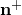表示裂纹表面的正法线；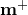表示裂纹前缘的正法线。不需要边界或界面的显式表示，因为它们完全由节点数据描述。通常每个节点需要两个有符号距离函数来描述裂纹几何形状。

**图10.7.1-5** 用两个有符号距离函数和表示的三维非平面裂纹。

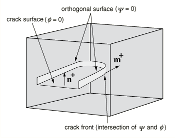

### 定义富集特征及其属性

您必须指定富集特征及其属性。一个或多个预先存在的裂纹可以与富集特征相关联。此外，在分析过程中，一个或多个裂纹可以在富集特征中萌生，而无需任何初始缺陷。但是，仅当同一时间增量内多个单元中满足损伤萌生准则时，才能在单个富集特征中萌生多个裂纹。否则，在给定富集特征中的所有预先存在的裂纹通过该富集特征的边界扩展之前，不会萌生其他裂纹。如果预计在分析过程中不同位置顺序发生多个裂纹萌生，则可以在模型中指定多个富集特征。富集自由度仅在元素被裂纹相交时激活。只能将应力/位移固体连续单元与富集特征相关联。

| **输入文件用法：** | ``` [*ENRICHMENT](../key/key-link.md#usb-kws-menrichment) ``` |
| --- | --- |

| **Abaqus/CAE用法：** | Interaction模块：****Special****Crack****Create****XFEM**** |
| --- | --- |

#### 定义富集类型

您可以选择对任意静止裂纹或沿任意、依赖解的路径的离散裂纹扩展进行建模。前者需要用渐近函数富集裂纹尖端周围的元素，并用裂纹表面间跳跃函数富集被裂纹内部切割的元素。后者意味着裂纹扩展使用内聚段方法或与虚拟节点结合的线性弹性断裂力学方法进行建模。但是，这些选项是互斥的，不能在同一模型中同时指定。

| **输入文件用法：** | 使用以下选项指定裂纹扩展分析（默认）： |
| --- | --- |
|  | ``` [*ENRICHMENT](../key/key-link.md#usb-kws-menrichment), TYPE=PROPAGATION CRACK ``` 使用以下选项指定静止裂纹分析： ``` [*ENRICHMENT](../key/key-link.md#usb-kws-menrichment), TYPE=STATIONARY CRACK ``` |

| **Abaqus/CAE用法：** | 使用以下输入指定裂纹扩展分析： |
| --- | --- |
|  | Interaction模块：裂纹编辑器：切换**Allow crack growth** 使用以下输入指定静止裂纹分析： Interaction模块：裂纹编辑器：切换**Allow crack growth** |
| --- | --- |

#### 为富集特征分配名称

您必须为富集特征（如裂纹）分配名称。此名称可用于定义裂纹表面的初始位置、识别用于轮廓积分输出的裂纹、激活或停用裂纹扩展分析，以及生成裂纹元素表面。

| **输入文件用法：** | ``` [*ENRICHMENT](../key/key-link.md#usb-kws-menrichment), NAME=*name* ``` |
| --- | --- |

| **Abaqus/CAE用法：** | Interaction模块：****Special****Crack****Create****: **XFEM**: **Name**: *name* |
| --- | --- |

#### 识别富集区域

您必须将富集定义与模型的区域相关联。只有这些区域内元素中的自由度可能用特殊函数富集。该区域应包括当前被裂纹切割的元素以及裂纹扩展时可能被切割的元素。

| **输入文件用法：** | ``` [*ENRICHMENT](../key/key-link.md#usb-kws-menrichment), ELSET=*element set name* ``` |
| --- | --- |

| **Abaqus/CAE用法：** | Interaction模块：****Special****Crack****Create********: **XFEM**: **Select the crack domain**: select region |
| --- | --- |

#### 定义裂纹表面

当裂纹在模型中传播时，在分析过程中被裂纹切割的那些富集元素上生成代表裂纹元素两个面的裂纹表面。您必须将富集特征的名称与表面相关联（参见上文["为富集特征分配名称](pt04ch10s07at36.md#usb-anl-aenrichment-name)"）。

生成的裂纹表面仅支持分布压力载荷的施加和一些表面变量的输出。

| **输入文件用法：** | ``` [*SURFACE](../key/key-link.md#usb-kws-msurface), TYPE=XFEM ``` |
| --- | --- |

| **Abaqus/CAE用法：** | Abaqus/CAE不支持基于XFEM的裂纹表面。 |
| --- | --- |

#### 使用小滑移公式定义裂纹元素表面的接触

当元素被裂纹切割时，必须考虑裂纹表面的压缩行为。公式 governing 行为与用于基于表面的小滑移惩罚接触的公式非常相似（["机械接触属性：概述，" 第37.1.1节](pt09ch37s01aus165.md)）。

对于被静止裂纹或使用线性弹性断裂力学方法的移动裂纹切割的元素，假设裂纹元素的弹性内聚强度为零。因此，当裂纹表面接触时，压缩行为完全由上述选项定义。对于使用内聚段方法的移动裂纹，情况更复杂；牵引-分离内聚行为以及裂纹表面的压缩行为参与裂纹元素。在接触法线方向上，governing 压缩行为的压力-闭合关系与内聚行为不相互作用，因为它们各自描述了不同接触制度中的表面间相互作用。压力-闭合关系仅在裂纹"闭合"时governing 行为；内聚行为仅在裂纹"张开"时（即不接触）对接触法向应力有贡献。

如果元素在剪切方向上的弹性内聚刚度未受损，则假设内聚行为处于活跃状态。任何切向滑移都被假定为纯弹性，由元素的弹性内聚强度抵抗，从而产生剪切力。如果定义了损伤，则内聚剪切应力的贡献开始随着损伤演化而降低。一旦达到最大降解，内聚剪切应力的贡献为零。摩擦模型激活并开始对剪切应力做出贡献。

| **输入文件用法：** | 使用以下选项使用小滑移公式定义裂纹表面的接触： |
| --- | --- |
|  | ``` [*ENRICHMENT](../key/key-link.md#usb-kws-menrichment), INTERACTION=*interaction_property_name* [*SURFACE INTERACTION](../key/key-link.md#usb-kws-hsurfaceinteraction), NAME=*interaction_property_name* [*SURFACE BEHAVIOR](../key/key-link.md#usb-kws-hsurfacebehavior) ``` |

| **Abaqus/CAE用法：** | Interaction模块：裂纹编辑器：切换**Specify contact property** |
| --- | --- |

### 将内聚材料概念应用于XFEM基于的内聚行为

XFEM基于的内聚段进行裂纹扩展分析的公式和定律与具有牵引-分离构成行为的内聚单元（["使用牵引-分离描述定义内聚单元的 constituto 响应，" 第32.5.6节](pt06ch32s05alm45.md)）和基于表面的内聚行为（["基于表面的内聚行为，" 第37.1.10节](pt09ch37s01alm63.md)）使用的公式和定律非常相似。相似之处包括线性弹性牵引-分离模型、损伤萌生准则和损伤演化定律。

#### 线性弹性牵引-分离行为

Abaqus中可用的牵引-分离模型假设初始线性弹性行为，随后是损伤的萌生和演化。弹性行为用弹性构成矩阵表示，该矩阵将裂纹元素的法向和剪切应力与法向和剪切分离联系起来。

名义牵引应力向量由以下分量组成：、和（在三维问题中），分别表示法向和两个剪切牵引。相应的分离表示为、和。弹性行为可以写为

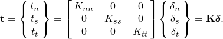

法向和切向刚度分量不会耦合：纯法向分离本身不会在剪切方向产生内聚力，纯剪切滑移且无法向分离不会在法向产生任何内聚力。

项、和基于富集元素的弹性属性计算。为富集区域中的材料指定弹性属性足以定义弹性刚度和牵引-分离行为。

#### 损伤建模

损伤建模允许您模拟富集元素的退化并最终失效。失效机制包括两个要素：损伤萌生准则和损伤演化定律。初始响应假设为线性的，如上一节所述。然而，一旦满足损伤萌生准则，损伤可根据用户定义的损伤演化定律发生。[图10.7.1-6](pt04ch10s07at36.md#anl-aenrichment-cohesivelaw)显示了一个典型的线性和一个典型的非线性牵引-分离响应以及失效机制。富集元素在纯压缩下不会发生损伤。

**图10.7.1-6** 典型的线性（a）和非线性（b）牵引-分离响应。


富集元素中内聚行为牵引-分离响应的损伤在用于常规材料的相同通用框架内定义（参见["渐进损伤和失效，" 第24.1.1节](pt05ch24s01abo21.md)）。但是，与具有牵引-分离行为的内聚单元不同，您不必在富集元素中指定无损牵引-分离行为。

#### 裂纹萌生和裂纹扩展方向

裂纹萌生是指富集元素中内聚响应退化的开始。当应力或应变满足指定的裂纹萌生准则时，退化过程开始。可用于裂纹萌生准则的Abaqus/Standard内置模型包括：
- 最大主应力准则，
- 最大主应变准则，
- 最大名义应力准则，
- 最大名义应变准则，
- 二次牵引-相互作用准则，和
- 二次分离-相互作用准则。

此外，可以在用户子程序[`UDMGINI`](../sub/sub-link.md#sub-xsl-udmgini)中指定用户定义的损伤萌生准则。

在给定的容差内，当断裂准则*f*在平衡增量中达到1.0时，引入附加裂纹或扩展现有裂纹的长度：

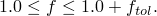

您可以指定容差。如果，则时间增量被回调，使得裂纹萌生准则得到满足。的默认值为0.05。

| **输入文件用法：** | ``` [*DAMAGE INITIATION](../key/key-link.md#usb-kws-mdamageinitiation), TOLERANCE= ``` |
| --- | --- |

| **Abaqus/CAE用法：** | Property模块：材料编辑器：**Mechanical**：**Damage for Traction Separation Laws**：**Quade Damage**、**Maxe Damage**、**Quads Damage**、**Maxs Damage**、**Maxpe Damage**或**Maxps Damage**：**Tolerance**： |
| --- | --- |

##### 指定裂纹方向

当指定最大主应力或最大主应变准则时，当断裂准则满足时，新引入的裂纹始终与最大主应力/应变方向正交。但是，当使用其他Abaqus/Standard内置裂纹萌生准则之一时，您必须指定新引入的裂纹在断裂准则满足时是与单元局部1方向正交还是与单元局部2方向正交（参见["约定，" 第1.2.2节](pt01ch01s02aus02.md)）。默认情况下，裂纹与单元局部1方向正交。如果指定了用户定义的损伤萌生准则，则可以在用户子程序[`UDMGINI`](../sub/sub-link.md#sub-xsl-udmgini)中定义裂纹平面或裂纹线的法线方向。

| **输入文件用法：** | 当指定最大名义应力、最大名义应变、二次牵引-相互作用或二次分离-相互作用准则时，使用以下选项之一指定裂纹方向： |
| --- | --- |
|  | ``` [*DAMAGE INITIATION](../key/key-link.md#usb-kws-mdamageinitiation), NORMAL DIRECTION=1（默认） ``` ``` [*DAMAGE INITIATION](../key/key-link.md#usb-kws-mdamageinitiation), NORMAL DIRECTION=2 ``` |

| **Abaqus/CAE用法：** | Property模块：材料编辑器：****Mechanical****Damage for Traction Separation Laws****: **Quade Damage**、**Maxe Damage**、**Quads Damage**或**Maxs Damage**：**Direction relative to local 1-direction (for XFEM)**: **Normal**或**Parallel** |
| --- | --- |

##### 最大主应力准则

最大主应力准则可以表示为


其中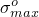表示最大允许主应力。符号表示Macaulay括号，具有通常的解释（即如果则为，如果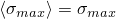则为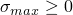）。Macaulay括号用于表示纯压缩应力状态不会萌生损伤。当最大主应力比（如同上定义）达到1时，假设损伤萌生。

| **输入文件用法：** | ``` [*DAMAGE INITIATION](../key/key-link.md#usb-kws-mdamageinitiation), CRITERION=MAXPS ``` |
| --- | --- |

| **Abaqus/CAE用法：** | Property模块：材料编辑器：**Mechanical**：**Damage for Traction Separation Laws**：**Maxps Damage** |
| --- | --- |

##### 最大主应变准则

最大主应变准则可以表示为


其中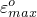表示最大允许主应变，Macaulay括号表示纯压缩应变不会萌生损伤。当最大主应变比（如同上定义）达到1时，假设损伤萌生。

| **输入文件用法：** | ``` [*DAMAGE INITIATION](../key/key-link.md#usb-kws-mdamageinitiation), CRITERION=MAXPE ``` |
| --- | --- |

| **Abaqus/CAE用法：** | Property模块：材料编辑器：**Mechanical**：**Damage for Traction Separation Laws**：**Maxpe Damage** |
| --- | --- |

##### 最大名义应力准则

最大名义应力准则可以表示为


名义牵引应力向量由三个分量组成（在二维问题中为两个）。是垂直于可能裂纹表面的分量，和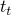是可能裂纹表面上的两个剪切分量。根据您指定的内容（参见上文["指定裂纹方向](pt04ch10s07at36.md#usb-anl-aenrichment-crack-dir)"），可能裂纹表面将与单元局部1方向或单元局部2方向正交。这里，、和表示名义应力的峰值。符号表示Macaulay括号，具有通常的解释。Macaulay括号用于表示纯压缩应力状态不会萌生损伤。当最大名义应力比（如同上定义）达到1时，假设损伤萌生。

| **输入文件用法：** | ``` [*DAMAGE INITIATION](../key/key-link.md#usb-kws-mdamageinitiation), CRITERION=MAXS ``` |
| --- | --- |

| **Abaqus/CAE用法：** | Property模块：材料编辑器：**Mechanical**：**Damage for Traction Separation Laws**：**Maxs Damage** |
| --- | --- |

##### 最大名义应变准则

最大名义应变准则可以表示为


当最大名义应变比（如同上定义）达到1时，假设损伤萌生。

| **输入文件用法：** | ``` [*DAMAGE INITIATION](../key/key-link.md#usb-kws-mdamageinitiation), CRITERION=MAXE ``` |
| --- | --- |

| **Abaqus/CAE用法：** | Property模块：材料编辑器：**Mechanical**：**Damage for Traction Separation Laws**：**Maxe Damage** |
| --- | --- |

##### 二次名义应力准则

二次名义应力准则可以表示为

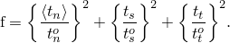

当涉及应力比的二次相互作用函数（如同上定义）达到1时，假设损伤萌生。

| **输入文件用法：** | ``` [*DAMAGE INITIATION](../key/key-link.md#usb-kws-mdamageinitiation), CRITERION=QUADS ``` |
| --- | --- |

| **Abaqus/CAE用法：** | Property模块：材料编辑器：**Mechanical**：**Damage for Traction Separation Laws**：**Quads Damage** |
| --- | --- |

##### 二次名义应变准则

二次名义应变准则可以表示为

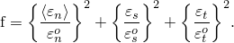

当涉及名义应变比的二次相互作用函数（如同上定义）达到1时，假设损伤萌生。

| **输入文件用法：** | ``` [*DAMAGE INITIATION](../key/key-link.md#usb-kws-mdamageinitiation), CRITERION=QUADE ``` |
| --- | --- |

| **Abaqus/CAE用法：** | Property模块：材料编辑器：**Mechanical**：**Damage for Traction Separation Laws**：**Quade Damage** |
| --- | --- |

##### 用户定义的损伤萌生准则

用户子程序[`UDMGINI`](../sub/sub-link.md#sub-xsl-udmgini)为实现用户定义的损伤萌生准则提供了通用能力。

您可以在用户子程序[`UDMGINI`](../sub/sub-link.md#sub-xsl-udmgini)中定义多个损伤萌生机制。您用断裂准则及其相关的裂纹平面或裂纹线法线方向表示每个损伤萌生机制。虽然您可以定义多个损伤萌生机制，但富集元素的实际损伤萌生由最严重的损伤萌生机制控制：

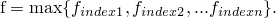

当f（如同上定义）达到1时，假设损伤萌生。

您必须指定用户子程序[`UDMGINI`](../sub/sub-link.md#sub-xsl-udmgini)中需要的任何材料常数，作为用户定义的损伤萌生准则定义的一部分。

| **输入文件用法：** | 使用以下选项定义用户定义的损伤萌生准则： |
| --- | --- |
|  | ``` [*DAMAGE INITIATION](../key/key-link.md#usb-kws-mdamageinitiation), CRITERION=USER ``` 使用以下选项指定用户定义损伤萌生准则中的失效机制总数： ``` [*DAMAGE INITIATION](../key/key-link.md#usb-kws-mdamageinitiation), CRITERION=USER, FAILURE MECHANISMS= ``` 使用以下选项为用户定义的损伤萌生准则定义属性： ``` [*DAMAGE INITIATION](../key/key-link.md#usb-kws-mdamageinitiation), CRITERION=USER, PROPERTIES=*number_of_constants* ``` |

| **Abaqus/CAE用法：** | Abaqus/CAE不支持用户定义的损伤萌生准则。 |
| --- | --- |

#### 裂纹尖端前方应力和应变场的局部计算

准确有效地评估裂纹尖端前方的应力/应变场对于评估裂纹萌生准则和在需要时计算裂纹扩展方向都很重要。Abaqus/Standard提供了多种计算这些场的选项。

##### 形心处的应力 and strain values

默认情况下，使用裂纹尖端前方元素形心处计算的应力/应变来确定损伤萌生准则是否满足以及确定裂纹扩展方向。参见[图10.7.1-7](pt04ch10s07at36.md#anl-aenrichment-centroid)。

**图10.7.1-7** 形心和裂纹尖端位置。

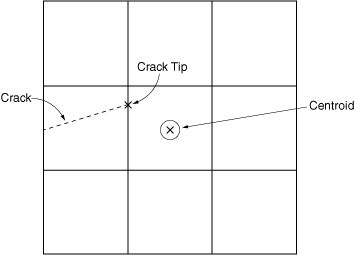

| **输入文件用法：** | ``` [*DAMAGE INITIATION](../key/key-link.md#usb-kws-mdamageinitiation), POSITION=CENTROID（默认） ``` |
| --- | --- |

| **Abaqus/CAE用法：** | Property模块：材料编辑器：****Mechanical****Damage for Traction Separation Laws****: **Quade Damage**、**Maxe Damage**、**Quads Damage**、**Maxs Damage**、**Maxpe Damage**或**Maxps Damage**：****Position****Centroid**** |
| --- | --- |

##### 在裂纹尖端计算应力 and strain fields

对于足够细化的网格，形心近似是准确且经济的。但是，如果裂纹尖端附近有限元网格相对于应力/应变场的梯度较粗，则默认的形心近似可能不够。在这种情况下，您可以使用推断到裂纹尖端的应力/应变来确定损伤萌生准则是否满足以及确定裂纹扩展方向。参见[图10.7.1-7](pt04ch10s07at36.md#anl-aenrichment-centroid)。

| **输入文件用法：** | ``` [*DAMAGE INITIATION](../key/key-link.md#usb-kws-mdamageinitiation), POSITION=CRACKTIP ``` |
| --- | --- |

| **Abaqus/CAE用法：** | Property模块：材料编辑器：****Mechanical****Damage for Traction Separation Laws****: **Quade Damage**、**Maxe Damage**、**Quads Damage**、**Maxs Damage**、**Maxpe Damage**或**Maxps Damage**：****Position****Crack tip**** |
| --- | --- |

##### 结合裂纹尖端和形心计算

您也可以选择结合这两种替代方法：您可以使用推断到裂纹尖端的应力/应变值来确定损伤萌生准则是否满足，并且可以使用元素形心处的应力/应变值来确定裂纹扩展方向。

| **输入文件用法：** | ``` [*DAMAGE INITIATION](../key/key-link.md#usb-kws-mdamageinitiation), POSITION=COMBINED ``` |
| --- | --- |

| **Abaqus/CAE用法：** | Property模块：材料编辑器：****Mechanical****Damage for Traction Separation Laws****: **Quade Damage**、**Maxe Damage**、**Quads Damage**、**Maxs Damage**、**Maxpe Damage**或**Maxps Damage**：****Position****Combined**** |
| --- | --- |

#### 非局部平均以提高裂纹扩展方向的准确性

上面讨论的评估应力和应变场的三个选项是局部计算，因为评估的场是裂纹尖端前方单个元素的局部计算。在粗和/或非结构化网格的情况下，裂纹尖端前方应力和应变场的非局部平均可以导致对这些场的更准确评估，这可以提高计算扩展方向的准确性。参见[图10.7.1-8](pt04ch10s07at36.md#anl-aenrichment-nonlocal)。

**图10.7.1-8** 非局部平均区域。


| **输入文件用法：** | ``` [*DAMAGE INITIATION](../key/key-link.md#usb-kws-mdamageinitiation), POSITION=NONLOCAL ``` |
| --- | --- |

| **Abaqus/CAE用法：** | Abaqus/CAE不支持裂纹尖端前方应力/应变的非局部平均。 |
| --- | --- |

##### 指定用于非局部平均的模型区域

要控制裂纹方向计算中用于非局部平均的元素范围，您可以指定一个半径，裂纹尖端前方此半径内的元素被包括在内。默认半径是富集区域中典型元素特征长度的三倍。

| **输入文件用法：** | ``` [*DAMAGE INITIATION](../key/key-link.md#usb-kws-mdamageinitiation), R CRACK DIRECTION= ``` |
| --- | --- |

| **Abaqus/CAE用法：** | Abaqus/CAE不支持指定非局部平均的模型范围。 |
| --- | --- |

##### 平均前对应力/应变场进行平滑

为了进一步改善非局部平均，您可以请求在裂纹前方对应力/应变场进行初始平滑。在这种情况下，Abaqus/Standard将场值平均到元素节点，然后对平滑后的场进行插值到积分点。平滑完成后，应用非局部平均。默认情况下不应用平滑。

| **输入文件用法：** | 使用以下选项之一： |
| --- | --- |
|  | ``` [*DAMAGE INITIATION](../key/key-link.md#usb-kws-mdamageinitiation), SMOOTHING=NONE（默认） [*DAMAGE INITIATION](../key/key-link.md#usb-kws-mdamageinitiation), SMOOTHING=NODAL ``` |

| **Abaqus/CAE用法：** | Abaqus/CAE不支持平均前对应力/应变场进行平滑。 |
| --- | --- |

##### 非局部平均的加权方案

Abaqus/Standard为场平滑提供了多种加权方案，对非局部平均提供额外控制。例如，您可能希望对靠近裂纹尖端的元素给予更高的权重。您可以指定权重函数，基于从元素积分点到裂纹尖端的距离来计算平均应力/应变。默认情况下，对用于平均的所有元素应用均匀加权；或者，您可以使用高斯函数或三次样条函数。您也可以使用用户子程序定义权重函数。

高斯函数表示为：

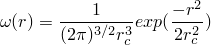


| **输入文件用法：** | 使用以下选项之一： |
| --- | --- |
|  | ``` [*DAMAGE INITIATION](../key/key-link.md#usb-kws-mdamageinitiation), WEIGHTING METHOD=UNIFORM（默认） [*DAMAGE INITIATION](../key/key-link.md#usb-kws-mdamageinitiation), WEIGHTING METHOD=GAUSS [*DAMAGE INITIATION](../key/key-link.md#usb-kws-mdamageinitiation), WEIGHTING METHOD=CUBIC SPLINE [*DAMAGE INITIATION](../key/key-link.md#usb-kws-mdamageinitiation), WEIGHTING METHOD=USER ``` |

| **Abaqus/CAE用法：** | Abaqus/CAE不支持指定非局部平均的加权方案。 |
| --- | --- |

#### 损伤演化

损伤演化定律描述了一旦达到相应的萌生准则，内聚刚度退化的速率。描述损伤演化的通用框架概念上类似于用于基于表面的内聚行为中损伤演化的框架（["基于表面的内聚行为，" 第37.1.10节](pt09ch37s01alm63.md)）。

标量损伤变量*D*表示裂纹表面与裂纹元素边缘交点处的整体损伤平均值。它最初值为0。如果建模损伤演化，则*D*在损伤萌生后进一步加载时从0单调演化到1。法向和剪切应力分量受损伤影响，按以下公式：


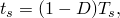

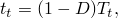

其中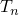、和是无损伤情况下当前分离的弹性牵引-分离行为预测的法向和剪切应力分量。

为了描述界面上法向和剪切分离组合下的损伤演化，定义有效分离为


| **输入文件用法：** | 使用以下选项指定损伤演化定律： |
| --- | --- |
|  | ``` [*DAMAGE EVOLUTION](../key/key-link.md#usb-kws-mdamageevolution) ``` |

| **Abaqus/CAE用法：** | Property模块：材料编辑器：****Mechanical****Damage for Traction Separation Laws****: **Maxpe Damage**或**Maxps Damage**：****Suboptions****Damage Evolution**** |
| --- | --- |

##### 与用户定义的损伤萌生准则结合使用

应该为用户子程序[`UDMGINI`](../sub/sub-link.md#sub-xsl-udmgini)中定义的每个损伤萌生准则指定单独的损伤演化定律。每个损伤萌生准则及其相应损伤演化定律的组合称为失效机制。损伤将仅针对每个元素的一个失效机制累积，对应于首先达到损伤萌生准则的机制。

| **输入文件用法：** | 使用以下选项为多个用户定义的损伤萌生准则指定损伤演化定律： |
| --- | --- |
|  | ``` [*DAMAGE INITIATION](../key/key-link.md#usb-kws-mdamageinitiation), CRITERION=USER, FAILURE MECHANISMS= [*DAMAGE EVOLUTION](../key/key-link.md#usb-kws-mdamageevolution), FAILURE INDEX=1 [*DAMAGE EVOLUTION](../key/key-link.md#usb-kws-mdamageevolution), FAILURE INDEX=2 ... [*DAMAGE EVOLUTION](../key/key-link.md#usb-kws-mdamageevolution), FAILURE INDEX= ``` |

| **Abaqus/CAE用法：** | Abaqus/CAE不支持用户定义的损伤萌生准则。 |
| --- | --- |

#### Abaqus/Standard中的粘性正则化

表现出各种软化行为和刚度退化形式的模型通常会导致Abaqus/Standard严重的收敛困难。可以使用内聚行为构成方程在富集元素中的粘性正则化来克服一些收敛困难。粘性正则化阻尼导致切线刚度矩阵对于足够小的时间增量保持正定。

整个模型与粘性正则化相关联的近似能量可使用输出变量ALLVD获得。

| **输入文件用法：** | 使用以下选项指定粘性正则化： |
| --- | --- |
|  | ``` [*DAMAGE STABILIZATION](../key/key-link.md#usb-kws-mdamagestabilization) ``` |

| **Abaqus/CAE用法：** | Property模块：材料编辑器：****Mechanical****Damage for Traction Separation Laws****: **Quade Damage**、**Maxe Damage**、**Quads Damage**、**Maxs Damage**、**Maxpe Damage**或**Maxps Damage**：****Suboptions****Damage Stabilization Cohesive**** |
| --- | --- |

#### 定义裂纹元素表面内流体流动的构成响应

XFEM基于的裂纹元素表面内流体流动的公式和定律与裂纹元素间隙内流体流动使用的公式和定律非常相似（["定义裂纹元素间隙内流体的构成响应，" 第32.5.7节](pt06ch32s05alm46.md)）。相似之处包括牵引-分离模型、损伤萌生准则、损伤演化定律和流体流动行为。流体构成响应包括富集元素中裂纹元素表面内的切向流动和法向流动。

##### 切向流动

裂纹元素表面内的切向流动可以用牛顿流体或幂律流体建模。默认情况下，裂纹元素表面内没有孔隙流体的切向流动。要允许切向流动，需要结合孔隙流体材料定义定义间隙流动属性。

对于牛顿流体，体积流率密度向量由下式给出


其中是切向渗透率（对流体流动的阻力），是沿裂纹元素表面的压力梯度，是裂纹元素表面的张开量。

Abaqus根据Reynolds方程定义切向渗透率或流动阻力：


其中是流体粘度，是裂纹元素表面的张开量。您还可以指定值的上限。

对于幂律流体，构成关系定义为


其中是剪切应力，是剪切应变率，是流体稠度，是幂律系数。Abaqus将切向体积流率密度定义为


其中是裂纹元素表面的张开量。

默认情况下，裂纹元素表面之间的间隙在牛顿流体和幂律流体中的初始张开量为0.002。但是，您可以直接指定此张开量。

| **输入文件用法：** | 使用以下选项为牛顿流体定义切向流动： |
| --- | --- |
|  | ``` [*GAP FLOW](../key/key-link.md#usb-kws-mgapflow), TYPE=NEWTONIAN, KMAX ``` 使用以下选项为幂律流体定义切向流动： ``` [*GAP FLOW](../key/key-link.md#usb-kws-mgapflow), TYPE=POWER LAW ``` 使用以下选项直接定义初始间隙张开量： ``` [*SECTION CONTROLS](../key/key-link.md#usb-kws-msectioncontrols), INITIAL GAP OPENING ``` |

| **Abaqus/CAE用法：** | 使用以下选项为牛顿流体定义切向流动： |
| --- | --- |
|  | Property模块：材料编辑器：****Other****Pore Fluid****Gap Flow****: Type: **Newtonian**: 切换**Maximum Permeability**并输入的值 使用以下选项为幂律流体定义切向流动： Property模块：材料编辑器：****Other****Pore Fluid****Gap Flow****: Type: **Power law** Abaqus/CAE不支持初始间隙张开量。 |
| --- | --- |

##### 穿过裂纹元素表面的法向流动

您可以通过为孔隙流体材料定义流体渗漏系数来允许法向流动。此系数定义位于裂纹元素边缘的虚拟节点与裂纹元素表面之间的压力-流动关系。流体渗漏系数可以解释为裂纹元素表面上一层有限材料的渗透率，如图[图10.7.1-9](pt04ch10s07at36.md#aenrichment-leakoff)所示。

**图10.7.1-9** 渗漏系数解释为渗透层。


法向流动定义为


和


其中和是分别进入裂纹元素顶面和底面的流率；是位于裂纹元素边缘的虚拟节点处的压力；和分别是裂纹元素顶面和底面上的孔隙压力。您可以选择将渗漏系数定义为温度和场变量的函数。

或者，您可以使用用户子程序[`UFLUIDLEAKOFF`](../sub/sub-link.md#sub-xsl-ufluidleakoff)来定义更复杂的渗漏行为，包括通过使用依赖于解的状态变量定义时间累积阻力或污垢的能力。

| **输入文件用法：** | 使用以下选项定义渗漏系数： |
| --- | --- |
|  | ``` [*FLUID LEAKOFF](../key/key-link.md#usb-kws-mfluidleakoff) ``` 使用以下选项将渗漏系数定义为温度和场变量的函数： ``` [*FLUID LEAKOFF](../key/key-link.md#usb-kws-mfluidleakoff), DEPENDENCIES ``` 使用以下选项在用户子程序[`UFLUIDLEAKOFF`](../sub/sub-link.md#sub-xsl-ufluidleakoff)中定义更复杂的渗漏行为： ``` [*FLUID LEAKOFF](../key/key-link.md#usb-kws-mfluidleakoff), USER ``` |

| **Abaqus/CAE用法：** | 使用以下选项定义渗漏系数： |
| --- | --- |
|  | Property模块：材料编辑器：****Other****Pore Fluid****Fluid Leakoff****: Type: **Coefficients** 使用以下选项将渗漏系数定义为温度和场变量的函数： Property模块：材料编辑器：****Other****Pore Fluid****Fluid Leakoff****: Type: **Coefficients**: 切换**Use temperature-dependent data**并选择场变量数量。 使用以下选项在用户子程序[`UFLUIDLEAKOFF`](../sub/sub-link.md#sub-xsl-ufluidleakoff)中定义更复杂的渗漏行为： Property模块：材料编辑器：****Other****Pore Fluid****Fluid Leakoff****: Type: **User** |
| --- | --- |

### 将VCCT技术应用于XFEM基于的LEFM方法

XFEM基于的线性弹性断裂力学方法进行裂纹扩展分析的公式和定律与沿已知和部分粘合表面模拟分层的公式和定律非常相似（参见["裂纹扩展分析，" 第11.4.3节](pt04ch11s04aus69.md)），其中应变能释放率在裂纹尖端基于改进的虚拟裂纹闭合技术（VCCT）计算。但是，与该方法不同，XFEM基于的LEFM方法可用于模拟沿任意、依赖解的路径在主体材料中的裂纹扩展，有或无初始裂纹。您通过在富集元素中定义基于表面的断裂行为和指定断裂准则来完成裂纹扩展能力的定义。

#### 裂纹萌生和裂纹扩展方向

顾名思义，XFEM基于的LEFM方法本质上需要模型中存在裂纹，因为它基于线性弹性断裂力学原理。裂纹可以是预先存在的，也可以在分析过程中萌生。如果给定富集区域没有预先存在的裂纹，则XFEM基于的LEFM方法不会被激活，直到裂纹萌生。裂纹萌生由六个内置应力或应变准则或用户定义的裂纹萌生准则控制，详见["裂纹萌生和裂纹扩展方向](pt04ch10s07at36.md#usb-anl-aenrichment-crack-init)"。在富集区域中萌生裂纹后，裂纹的后续扩展由XFEM基于的LEFM准则控制。

| **输入文件用法：** | 当富集区域中没有预先存在的裂纹时，使用以下选项在材料定义中指定裂纹萌生准则： |
| --- | --- |
|  | ``` [*DAMAGE INITIATION](../key/key-link.md#usb-kws-mdamageinitiation), TOLERANCE= ``` |

| **Abaqus/CAE用法：** | Property模块：材料编辑器：**Mechanical**：**Damage for Traction Separation Laws**：**Quade Damage**、**Maxe Damage**、**Quads Damage**、**Maxs Damage**、**Maxpe Damage**或**Maxps Damage**： |
| --- | --- |

##### 指定预先存在的裂纹何时扩展

如果富集区域中存在预先存在的裂纹，则当断裂准则*f*在平衡增量中达到1.0时（在给定容差内），裂纹扩展：


您可以指定容差。如果，则时间增量被回调，使得裂纹扩展准则得到满足。的默认值为0.2。

| **输入文件用法：** | 使用以下两个选项： |
| --- | --- |
|  | ``` [*SURFACE BEHAVIOR](../key/key-link.md#usb-kws-hsurfacebehavior) [*FRACTURE CRITERION](../key/key-link.md#usb-kws-hfracturecriterion), TOLERANCE=, TYPE=VCCT ``` |

| **Abaqus/CAE用法：** | Interaction模块：****Interaction****Property****Create****, **Contact**, ****Mechanical****Fracture Criterion****, **Tolerance**:  |
| --- | --- |

##### 指定裂纹扩展方向

当断裂准则满足时，必须指定裂纹扩展方向。裂纹可以沿最大切向应力方向法向扩展，与单元局部1方向正交（参见["约定，" 第1.2.2节](pt01ch01s02aus02.md)），或与单元局部2方向正交。默认情况下，裂纹沿最大切向应力方向法向扩展。

| **输入文件用法：** | 当断裂准则满足时，使用以下选项之一指定裂纹方向： |
| --- | --- |
|  | ``` [*FRACTURE CRITERION](../key/key-link.md#usb-kws-hfracturecriterion), NORMAL DIRECTION=MTS（默认） ``` ``` [*FRACTURE CRITERION](../key/key-link.md#usb-kws-hfracturecriterion), NORMAL DIRECTION=1 ``` ``` [*FRACTURE CRITERION](../key/key-link.md#usb-kws-hfracturecriterion), NORMAL DIRECTION=2 ``` |

| **Abaqus/CAE用法：** | Interaction模块：接触属性编辑器：****Mechanical****Fracture Criterion****: **Direction of crack growth relative to local 1-direction**: **Maximum tangential stress**、**Normal**或**Parallel** |
| --- | --- |

#### 混合模式行为

Abaqus提供了三种常见的混合模式公式来计算等效断裂能释放率：BK律、幂律和Reeder律模型。在任何给定分析中模型的选择并不总是明确的；适当的模型最好通过经验选择。

##### BK律

BK律模型由Benzeggagh和Kenane（1996）描述，公式如下：

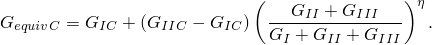

要定义此模型，您必须提供和。此模型提供了将I型、II型和III型能量释放率组合成单一标量断裂准则的幂律关系。

| **输入文件用法：** | ``` [*FRACTURE CRITERION](../key/key-link.md#usb-kws-hfracturecriterion), TYPE=VCCT, MIXED MODE BEHAVIOR=BK ``` |
| --- | --- |

| **Abaqus/CAE用法：** | Interaction模块：接触属性编辑器：****Mechanical****Fracture Criterion****: **Mixed mode behavior**: **BK**，并在数据表中输入临界能量释放率 |
| --- | --- |

##### 幂律

幂律模型由Wu和Reuter（1965）描述，公式如下：

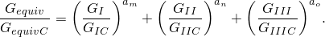

要定义此模型，您必须提供和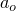。

| **输入文件用法：** | ``` [*FRACTURE CRITERION](../key/key-link.md#usb-kws-hfracturecriterion), TYPE=VCCT, MIXED MODE BEHAVIOR=POWER ``` |
| --- | --- |

| **Abaqus/CAE用法：** | Interaction模块：接触属性编辑器：****Mechanical****Fracture Criterion****: **Mixed mode behavior**: **Power**，并在数据表中输入临界能量释放率 |
| --- | --- |

##### Reeder律

Reeder律模型由Reeder等人（2002）描述，公式如下：


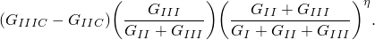

要定义此模型，您必须提供和。Reeder律最适用于时，Reeder律简化为BK律。Reeder律仅适用于三维问题。

| **输入文件用法：** | ``` [*FRACTURE CRITERION](../key/key-link.md#usb-kws-hfracturecriterion), TYPE=VCCT, MIXED MODE BEHAVIOR=REEDER ``` |
| --- | --- |

| **Abaqus/CAE用法：** | Interaction模块：接触属性编辑器：****Mechanical****Fracture Criterion****: **Mixed mode behavior**: **Reeder**，并在数据表中输入临界能量释放率 |
| --- | --- |

##### 定义可变临界能量释放率

您可以通过在节点处指定临界能量释放率来定义具有可变能量释放率的VCCT准则。

如果您指出将指定节点临界能量释放率，则忽略您指定的任何恒定临界能量释放率，并从节点进行插值。必须在富集区域的所有节点上定义临界能量释放率。

| **输入文件用法：** | 使用以下两个选项： |
| --- | --- |
|  | ``` [*FRACTURE CRITERION](../key/key-link.md#usb-kws-hfracturecriterion), TYPE=VCCT, NODAL ENERGY RATE [*NODAL ENERGY RATE](../key/key-link.md#usb-kws-mnodalenergyrate) ``` |

| **Abaqus/CAE用法：** | Abaqus/CAE不支持使用可变能量释放率定义VCCT准则。 |
| --- | --- |

#### 增强VCCT准则

增强VCCT准则的公式和定律与VCCT准则非常相似。但是，与VCCT准则不同，裂纹的萌生和扩展可以由两个不同的临界断裂能释放率控制：和。在涉及I、II和III型断裂的一般情况下，当断裂准则满足时；即，


裂纹元素两个表面上的牵引力在分离上线性减小，耗散的应变能等于裂纹扩展所需的临界等效应变能，，而不是分离萌生所需的临界等效应变能，。计算的公式与不同混合模式断裂准则的公式相同。

| **输入文件用法：** | 使用以下两个选项： |
| --- | --- |
|  | ``` [*SURFACE BEHAVIOR](../key/key-link.md#usb-kws-hsurfacebehavior) [*FRACTURE CRITERION](../key/key-link.md#usb-kws-hfracturecriterion), TYPE=ENHANCED VCCT ``` |

| **Abaqus/CAE用法：** | Abaqus/CAE不支持指定增强VCCT准则。 |
| --- | --- |

#### 基于LEFM原理的低周疲劳准则

如果您指定了低周疲劳准则，则可以模拟富集元素在亚临界循环载荷下的渐进裂纹增长。此准则只能在使用直接循环方法的低周疲劳分析中使用（["使用直接循环方法的低周疲劳分析，" 第6.2.7节](pt03ch06s02at06.md)）。低周疲劳步可以是唯一步，可以跟随一般静态步，或者可以跟随一般静态步。您可以在单次分析中包含多个低周疲劳分析步。如果在没有预先存在裂纹的模型中执行疲劳分析，则必须用静态步先行裂纹萌生，如["裂纹萌生和裂纹扩展方向](pt04ch10s07at36.md#usb-anl-aenrichment-crack-nucleation)"中所讨论的。

裂纹萌生和疲劳裂纹增长由Paris定律表征，该定律将相对断裂能释放率与裂纹扩展速率联系起来，如图[图10.7.1-4](pt04ch10s07at36.md#usb-anl-aenrichment-parislaw-nls)所示。富集元素中裂纹尖端的断裂能释放率基于上述VCCT技术计算。

Paris区域由能量释放率阈值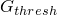限定，低于该阈值不考虑疲劳裂纹萌生或增长；能量释放率上限，高于该值疲劳裂纹将以加速速率增长。是根据用户指定的混合模式准则和主体材料的断裂强度计算的临界等效应变能释放率。上面已为不同的混合模式断裂准则提供了计算的公式。您可以指定的比值以及的比值。默认值分别为和。

| **输入文件用法：** | 使用以下两个选项： |
| --- | --- |
|  | ``` [*SURFACE BEHAVIOR](../key/key-link.md#usb-kws-hsurfacebehavior) [*FRACTURE CRITERION](../key/key-link.md#usb-kws-hfracturecriterion), TYPE=FATIGUE ``` |

| **Abaqus/CAE用法：** | Abaqus/CAE不支持指定低周疲劳准则。 |
| --- | --- |

##### 疲劳裂纹增长萌生

疲劳裂纹增长萌生是指富集元素裂纹尖端疲劳裂纹增长的开始。在低周疲劳分析中，疲劳裂纹增长萌生准则由表征，这是结构在其最大值和最小值之间加载时的相对断裂能释放率。疲劳裂纹增长萌生准则定义为

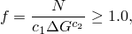

其中和是材料常数，是循环数。除非上述方程满足，且对应于结构加载到其最大值时的循环能量释放率的最大断裂能释放率大于，否则裂纹尖端前方的富集元素不会被断裂。

##### 使用Paris定律的疲劳裂纹增长

一旦富集元素中疲劳裂纹增长萌生准则得到满足，裂纹增长速率可以根据相对断裂能释放率计算。如果，裂纹增长速率由Paris定律给出：


其中和是材料常数。

在循环从当前循环向前扩展，增量循环数从和，结合裂纹尖端前方富集元素的元素长度和可能的裂纹扩展方向，可以计算裂纹尖端前方每个富集元素失效所需的循环数，，其中*j*表示th裂纹尖端的富集元素。设置分析以在加载循环稳定后至少向前推进一个富集元素。识别具有少循环数的元素被断裂，其表示为使其裂纹长度增长等于其元素长度所需的循环数。最关键的元素在稳定循环结束时完全断裂，约束和刚度为零。当富集元素断裂时，载荷重新分配，必须为下一个循环的裂纹尖端前方富集元素计算新的相对断裂能释放率。此能力允许在每个稳定循环后完全断裂裂纹尖端前方的至少一个富集元素，并精确计算导致疲劳裂纹增长超过该长度所需的循环数。

如果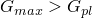，则裂纹尖端前方的富集元素仅通过将循环数增加一来断裂。

#### XFEM基于的LEFM方法的粘性正则化

模拟具有不稳定扩展裂纹的结构具有挑战性且困难。可能会不时出现不收敛行为。通过使用粘性正则化技术为XFEM基于的LEFM方法引入局部阻尼。粘性正则化阻尼导致软化材料的切线刚度矩阵对于足够小的时间增量保持为正。

| **输入文件用法：** | 使用以下选项之一 |
| --- | --- |
|  | ``` [*FRACTURE CRITERION](../key/key-link.md#usb-kws-hfracturecriterion), TYPE=VCCT, VISCOSITY= ``` ``` [*FRACTURE CRITERION](../key/key-link.md#usb-kws-hfracturecriterion), TYPE=ENHANCED VCCT, VISCOSITY= ``` |

| **Abaqus/CAE用法：** | Interaction模块：接触属性编辑器：****Mechanical****Fracture Criterion****: **Viscosity**:  |
| --- | --- |

### 将分布压力载荷施加到裂纹元素表面

当元素在分析过程中被裂纹切割时，会在分析过程中生成基于XFEM的裂纹表面（参见上文["定义裂纹表面](pt04ch10s07at36.md#usb-anl-aenrichment-surf)"）。分布压力载荷可以施加到裂纹元素表面。

| **输入文件用法：** | 使用以下选项将分布压力载荷定义到裂纹表面： |
| --- | --- |
|  | ``` [*DSLOAD](../key/key-link.md#usb-kws-hdsload) *surface name*, P或PNU, *magnitude* ``` |

| **Abaqus/CAE用法：** | Abaqus/CAE不支持基于XFEM的裂纹表面。 |
| --- | --- |

### 指定富集特征的初始位置

因为不需要网格符合几何不连续性，所以必须在模型中指定预先存在裂纹的初始位置。为此提供了水平集方法。每个节点通常需要两个有符号距离函数来描述裂纹几何形状。第一个描述裂纹表面，而第二个用于构建正交表面，使得两个表面的交点给出裂纹前缘（参见["Abaqus/Standard和Abaqus/Explicit中的初始条件，" 第34.2.1节](pt07ch34s02aus116.md)）。

第一个有符号距离函数必须大于或小于零，不能等于零。如果必须在元素边界处定义初始裂纹，则必须为第一个有符号距离函数指定一个非常小的正或负值。

| **输入文件用法：** | 使用以下选项指定富集特征的初始位置： |
| --- | --- |
|  | ``` [*INITIAL CONDITIONS](../key/key-link.md#usb-kws-minitialcond), TYPE=ENRICHMENT ``` |

| **Abaqus/CAE用法：** | Interaction模块：裂纹编辑器：**Crack location**: **Select**: select region |
| --- | --- |

### 激活和停用富集特征

裂纹扩展能力可以在步定义中激活或停用。

| **输入文件用法：** | 使用以下选项在步定义中激活裂纹扩展能力： |
| --- | --- |
|  | ``` [*ENRICHMENT ACTIVATION](../key/key-link.md#usb-kws-henrichmentactivation), NAME=*name*, ACTIVATE=ON（默认） ``` 使用以下选项在步定义中停用裂纹扩展能力： ``` [*ENRICHMENT ACTIVATION](../key/key-link.md#usb-kws-henrichmentactivation), NAME=*name*, ACTIVATE=OFF ``` 使用以下选项在步定义中自动停用裂纹扩展能力： ``` [*ENRICHMENT ACTIVATION](../key/key-link.md#usb-kws-henrichmentactivation), NAME=*name*, ACTIVATE=AUTO OFF ``` |

| **Abaqus/CAE用法：** | 要在步中修改裂纹扩展能力的状态，您必须首先创建一个**XFEM crack growth**相互作用： |
| --- | --- |
|  | Interaction模块：**Create Interaction**：选择初始步：**XFEM Crack Growth**：选择裂纹：**Interaction manager**：在步中选择相互作用：**Edit**：切换 on/off **Allow crack growth in this step** |
| --- | --- |

### 轮廓积分

当使用传统有限元方法（["轮廓积分评估，" 第11.4.2节](pt04ch11s04aus68.md)）评估轮廓积分时，必须明确定义裂纹前缘，并指定虚拟裂纹扩展方向，此外还需要使网格与裂纹几何形状匹配。通常需要细化网格，并且在三维曲面上获取裂纹的准确轮廓积分结果可能很麻烦。扩展有限元与水平集方法的结合减轻了这些缺点。通过与附加自由度结合的特殊富集函数确保了足够的奇异渐近场和不连续性。此外，裂纹前缘和虚拟裂纹扩展方向由水平集有符号距离函数自动确定。

| **输入文件用法：** | 使用以下选项获取扩展有限元方法对命名富集特征的轮廓积分： |
| --- | --- |
|  | ``` [*CONTOUR INTEGRAL](../key/key-link.md#usb-kws-hcontintegral), XFEM, CRACK NAME=*name* ``` |

| **Abaqus/CAE用法：** | Step模块：历史输出请求编辑器：**Domain: Crack**: *crack name* |
| --- | --- |

#### 指定富集半径

虽然XFEM减轻了围绕裂纹前缘细化网格的缺点，但您必须在裂纹前缘周围生成足够数量的元素以获得路径无关的轮廓。从裂纹前缘小半径内的元素组被富集并参与轮廓积分计算。默认富集半径是富集区域中典型元素特征长度的三倍。您必须将富集半径内的元素包含在用于定义富集区域的元素集中。

| **输入文件用法：** | 使用以下选项指定富集半径： |
| --- | --- |
|  | ``` [*ENRICHMENT](../key/key-link.md#usb-kws-menrichment), ENRICHMENT RADIUS ``` |

| **Abaqus/CAE用法：** | Interaction模块：裂纹编辑器：**Enrichment radius**: **Analysis default**或**Specify** |
| --- | --- |

### 过程

可以将不连续性建模为富集特征的过程包括：
- 静态分析（参见["静态应力分析，" 第6.2.2节](pt03ch06s02at01.md)）；
- 隐式动态分析（参见["使用直接积分的隐式动态分析，" 第6.3.2节](pt03ch06s03at07.md)）；或
- 使用直接循环方法的低周疲劳分析（["使用直接循环方法的低周疲劳分析，" 第6.2.7节](pt03ch06s02at06.md)）。
- 地静应力场分析（参见["地静应力状态，" 第6.8.2节](pt03ch06s08at27.md)）；或
- 耦合孔隙流体扩散/应力分析（参见["耦合孔隙流体扩散和应力分析，" 第6.8.1节](pt03ch06s08at26.md)）。

### 初始条件

可以指定富集特征的初始边界或界面的初始条件（参见["Abaqus/Standard和Abaqus/Explicit中的初始条件，" 第34.2.1节](pt07ch34s02aus116.md)）。

### 边界条件

可以将边界条件施加到位移或孔隙压力自由度（参见["Abaqus/Standard和Abaqus/Explicit中的边界条件，" 第34.3.1节](pt07ch34s03aus118.md)）。

### 载荷

可以在具有富集特征的模型中指定以下类型的载荷：
- 集中节点力可以施加到位移自由度（1-3）或孔隙压力自由度（8）；参见["集中载荷，" 第34.4.2节](pt07ch34s04aus121.md)。
- 可以施加分布压力力或体力；参见["分布载荷，" 第34.4.3节](pt07ch34s04aus122.md)。特定单元可用的分布载荷类型在[第六部分，"单元"](pt06.md)中描述。

### 预定义场

可以在具有富集特征的模型中指定以下预定义场，如["预定义场，" 第34.6.1节](pt07ch34s06aus128.md)中所述：
- 节点温度（尽管温度不是应力/位移单元中的自由度）。指定温度影响温度依赖的临界应力和应变失效准则。
- 用户定义场变量的值。指定的值影响场变量依赖的材料属性。

### 材料选项

Abaqus/Standard中的任何机械构成模型，包括用户定义材料（使用用户子程序["UMAT，" Abaqus用户子程序参考指南第1.1.41节](../sub/sub-link.md#sub-rtn-uumat)定义），都可用于对裂纹扩展分析中富集元素的机械行为进行建模。参见[第五部分，"材料"](pt05.md)。材料点的非弹性定义必须与线性弹性材料模型（["线性弹性行为，" 第22.2.1节](pt05ch22s02abm02.md)）或超弹性材料模型（["超弹性行为，" 第22.4.1节](pt05ch22s04abm06.md)）结合使用。在评估静止裂纹的轮廓积分时，仅支持各向同性弹性材料。

### 单元

只能将一阶固体连续应力/位移单元、一阶位移/孔隙压力固体连续单元和二阶应力/位移四面体单元与富集特征相关联。对于扩展裂纹，这些包括双线性平面应变和平面应力单元、双线性轴对称单元、线性砖单元、线性四面体单元和二阶四面体单元。对于静止裂纹，这些包括线性砖单元、线性四面体单元和二阶四面体单元。

对于不兼容模式单元，Abaqus/Standard在元素在拉伸载荷下断裂后立即丢弃由不兼容变形模式引起的贡献。因此，即使该裂纹元素完全卸载并且重新建立裂纹元素表面的接触，裂纹元素中的应力水平可能无法完全恢复到其原始卸载状态。

### 输出

除了Abaqus中可用的标准输出标识符（["Abaqus/Standard输出变量标识符，" 第4.2.1节](pt02ch04s02abv01.md)）外，对于具有富集特征的模型，以下节点、整个单元和表面变量具有特殊含义。

节点变量：

| PHILSM | 描述裂纹表面的有符号距离函数。 |
| --- | --- |

| PSILSM | 描述初始裂纹前缘的有符号距离函数。 |
| --- | --- |

整个单元变量：

| STATUSXFEM | 富集元素的状态。（如果元素完全断裂，则富集元素的状态为1.0；如果元素不包含裂纹，则为0.0。如果元素部分断裂，则STATUSXFEM的值介于1.0和0.0之间。） |
| --- | --- |

| ENRRTXFEM | 使用扩展有限元方法的线性弹性断裂力学时的所有应变能释放率分量。 |
| --- | --- |

| LOADSXFEM | 施加到裂纹表面的分布压力载荷。 |
| --- | --- |

以下整个单元输出变量仅在裂纹富集元素表面内启用流体流动时可用：

| GFVRXFEM | 富集元素的间隙流体体积率。 |
| --- | --- |

| PFOPENXFEM | 富集元素的断裂张开量。 |
| --- | --- |

| PORPRES | 富集元素的流体压力。 |
| --- | --- |

| LEAKVRTXFEM | 富集元素顶部的渗漏流率。 |
| --- | --- |

| LEAKVRBXFEM | 富集元素底部的渗漏流率。 |
| --- | --- |

| ALEAKVRTXFEM | 富集元素顶部的累积渗漏流体体积。 |
| --- | --- |

| ALEAKVRBXFEM | 富集元素底部的累积渗漏流体体积。 |
| --- | --- |

表面变量：

| CRKDISP | 富集元素中裂纹表面的裂纹张开和相对切向运动。 |
| --- | --- |

| CSDMG | 富集元素中裂纹表面的损伤变量。 |
| --- | --- |

#### 使用非对称矩阵存储和求解

当富集元素中激活孔隙压力自由度时，矩阵是非对称的；因此，可能需要非对称矩阵存储和求解来改善收敛（参见["Abaqus/Standard中的矩阵存储和求解方案" "定义分析，" 第6.1.2节](pt03ch06s01abo05.md#usb-anl-unsymm)）。

#### 可视化

裂纹可以通过有符号距离函数PHILSM的等值面进行可视化。

如果裂纹穿过富集元素的一个非常小的角落，则在Abaqus/CAE（Ab

aqus/Viewer）的Visualization模块中显示轮廓时，富集元素中裂纹前缘沿的位移可能会扭曲。然而，在仅查看变形形状时不存在这种扭曲。

当元素被裂纹切割时，裂纹元素分成两部分，每部分由真实域和虚拟域组成，如图[图10.7.1-2](pt04ch10s07at36.md#anl-aenrichment-phantom)所示。裂纹元素的轮廓图积分点值考虑裂纹元素两部分的真实域的贡献。但是，当您探测裂纹元素时，仅报告包含真实域和虚拟域的元素部分的贡献。

在评估静止裂纹中的轮廓积分时，在用奇异渐近裂纹尖端场富化的元素中引入了额外的积分站。但是，在Abaqus/CAE（Ab

aqus/Viewer）的Visualization模块中不支持对这些附加积分点的元素输出变量进行可视化。

### 限制条件

富集特征存在以下限制条件：
- 富集元素不能被多个裂纹相交。
- 在一个增量中不允许裂纹转向超过90度。
- 对于静止裂纹，仅考虑各向同性弹性材料中的渐近裂纹尖端场。
- 不支持自适应重新网格划分。
- 不支持复合实体单元。

### 输入文件模板

以下是通过XFEM基于的内聚段方法建模裂纹扩展的示例：

```
[*HEADING](../key/key-link.md#usb-kws-mheading)
...
[*NODE](../key/key-link.md#usb-kws-mnode), NSET=ALL
...
[*ELEMENT](../key/key-link.md#usb-kws-melement), TYPE=C3D8, ELSET=REGULAR
[*ELEMENT](../key/key-link.md#usb-kws-melement), TYPE=C3D8, ELSET=ENRICHED
...
[*SOLID SECTION](../key/key-link.md#usb-kws-msolidsection), MATERIAL=STEEL1, ELSET=REGULAR
[*SOLID SECTION](../key/key-link.md#usb-kws-msolidsection), MATERIAL=STEEL12, ELSET=ENRICHED

[*ENRICHMENT](../key/key-link.md#usb-kws-menrichment), TYPE=PROPAGATION CRACK, ELSET=ENRICHED, 
NAME=ENRICHMENT, INTERACTION=INTERACTION
[*SURFACE](../key/key-link.md#usb-kws-msurface), TYPE=XFEM, NAME=SURF_NAME
*Data lines to specify the names of enriched features*
[*MATERIAL](../key/key-link.md#usb-kws-mmaterial), NAME=STEEL1
...
[*MATERIAL](../key/key-link.md#usb-kws-mmaterial), NAME=STEEL2
[*DAMAGE INITIATION](../key/key-link.md#usb-kws-mdamageinitiation), CRITERION=MAXPS, TOLERANCE=0.05
[*DAMAGE EVOLUTION](../key/key-link.md#usb-kws-mdamageevolution), TYPE=ENERGY
*Data lines to specify the failure mechanism*
...
[*SURFACE INTERACTION](../key/key-link.md#usb-kws-hsurfaceinteraction), NAME=INTERACTION
[*SURFACE BEHAVIOR](../key/key-link.md#usb-kws-hsurfacebehavior)
*Data lines to specify the contact of cracked element surfaces*
...
[*STEP](../key/key-link.md#usb-kws-hstep)
[*STATIC](../key/key-link.md#usb-kws-hstatic)
...
[*END STEP](../key/key-link.md#usb-kws-hendstep)
[*STEP](../key/key-link.md#usb-kws-hstep)
[*STATIC](../key/key-link.md#usb-kws-hstatic)
...

[*ENRICHMENT ACTIVATION](../key/key-link.md#usb-kws-henrichmentactivation), TYPE=PROPAGATION CRACK, 
NAME=ENRICHMENT, ACTIVATE=OFF
...
[*END STEP](../key/key-link.md#usb-kws-hendstep)
```

以下是通过XFEM基于的LEFM方法建模裂纹扩展的示例：

```
[*HEADING](../key/key-link.md#usb-kws-mheading)
...
[*NODE](../key/key-link.md#usb-kws-mnode), NSET=ALL
...
[*ELEMENT](../key/key-link.md#usb-kws-melement), TYPE=C3D8, ELSET=REGULAR
[*ELEMENT](../key/key-link.md#usb-kws-melement), TYPE=C3D8, ELSET=ENRICHED
...
[*SOLID SECTION](../key/key-link.md#usb-kws-msolidsection), MATERIAL=STEEL1, ELSET=REGULAR
[*SOLID SECTION](../key/key-link.md#usb-kws-msolidsection), MATERIAL=STEEL12, ELSET=ENRICHED

[*ENRICHMENT](../key/key-link.md#usb-kws-menrichment), TYPE=PROPAGATION CRACK, ELSET=ENRICHED, 
NAME=ENRICHMENT, INTERACTION=INTERACTION
[*MATERIAL](../key/key-link.md#usb-kws-mmaterial), NAME=STEEL1
...
[*MATERIAL](../key/key-link.md#usb-kws-mmaterial), NAME=STEEL2
[*DAMAGE INITIATION](../key/key-link.md#usb-kws-mdamageinitiation), CRITERION=MAXPS, TOLERANCE=0.05
*Data lines to specify the crack nucleation mechanism*
...
[*SURFACE INTERACTION](../key/key-link.md#usb-kws-hsurfaceinteraction), NAME=INTERACTION
[*SURFACE BEHAVIOR](../key/key-link.md#usb-kws-hsurfacebehavior)
[*FRACTURE CRITERION](../key/key-link.md#usb-kws-hfracturecriterion), TYPE=VCCT, TOLERANCE=0.05,VISCOSITY=0.00001
*Data lines to specify the crack propagation criterion*
...
[*END STEP](../key/key-link.md#usb-kws-hendstep)
```

以下是使用扩展有限元方法计算静止裂纹轮廓积分的示例：

```
[*HEADING](../key/key-link.md#usb-kws-mheading)
...
[*NODE](../key/key-link.md#usb-kws-mnode), NSET=ALL
...
[*ELEMENT](../key/key-link.md#usb-kws-melement), TYPE=C3D8, ELSET=REGULAR
[*ELEMENT](../key/key-link.md#usb-kws-melement), TYPE=C3D8, ELSET=ENRICHED
...
[*SOLID SECTION](../key/key-link.md#usb-kws-msolidsection), MATERIAL=STEEL1, ELSET=REGULAR
[*SOLID SECTION](../key/key-link.md#usb-kws-msolidsection), MATERIAL=STEEL12, ELSET=ENRICHED

[*ENRICHMENT](../key/key-link.md#usb-kws-menrichment), TYPE=STATIONARY CRACK, ELSET=ENRICHED, 
NAME=ENRICHMENT, ENRICHMENT RADIUS
[*MATERIAL](../key/key-link.md#usb-kws-mmaterial), NAME=STEEL1
...
[*MATERIAL](../key/key-link.md#usb-kws-mmaterial), NAME=STEEL2
...
[*STEP](../key/key-link.md#usb-kws-hstep)
[*STATIC](../key/key-link.md#usb-kws-hstatic)
...
[*CONTOUR INTEGRAL](../key/key-link.md#usb-kws-hcontintegral), CRACK NAME=ENRICHMENT, XFEM
[*END STEP](../key/key-link.md#usb-kws-hendstep)

```

#### 其他参考资料

- Belytschko, T., and T. Black, "Elastic Crack Growth in Finite Elements with Minimal Remeshing," International Journal for Numerical Methods in Engineering, vol. 45, pp. 601--620, 1999.
- Benzeggagh, M., and M. Kenane, "Measurement of Mixed-Mode Delamination Fracture Toughness of Unidirectional Glass/Epoxy Composites with Mixed-Mode Bending Apparatus," Composite Science and Technology, vol. 56 439, 1996.
- Elguedj, T., A. Gravouil, and A. Combescure, "Appropriate Extended Functions for X-FEM Simulation of Plastic Fracture Mechanics," Computer Methods in Applied Mechanics and Engineering, vol. 195, pp. 501--515, 2006.
- Melenk, J., and I. Babuska, "The Partition of Unity Finite Element Method: Basic Theory and Applications," Computer Methods in Applied Mechanics and Engineering, vol. 39, pp. 289--314, 1996.
- Reeder, J., S. Kyongchan, P. B. Chunchu, and D. R.. Ambur, "Postbuckling and Growth of Delaminations in Composite Plates Subjected to Axial Compression"43rd AIAA/ASME/ASCE/AHS/ASC Structures, Structural Dynamics, and Materials Conference, Denver, Colorado, vol. 1746, p. 10, 2002.
- Remmers, J. J. C., R. de Borst, and A. Needleman, "The Simulation of Dynamic Crack Propagation using the Cohesive Segments Method," Journal of the Mechanics and Physics of Solids, vol. 56, pp. 70--92, 2008.
- Song, J. H., P. M. A. Areias, and T. Belytschko, "A Method for Dynamic Crack and Shear Band Propagation with Phantom Nodes," International Journal for Numerical Methods in Engineering, vol. 67, pp. 868--893, 2006.
- Sukumar, N., Z. Y. Huang, J.-H. Prevost, and Z. Suo, "Partition of Unity Enrichment for Bimaterial Interface Cracks," International Journal for Numerical Methods in Engineering, vol. 59, pp. 1075--1102, 2004.
- Sukumar, N., and J.-H. Prevost, "Modeling Quasi-Static Crack Growth with the Extended Finite Element Method Part I: Computer Implementation," International Journal for Solids and Structures, vol. 40, pp. 7513--7537, 2003.
- Wu, E. M., and R. C. Reuter Jr., "Crack Extension in Fiberglass Reinforced Plastics," T and M Report, University of Illinois, vol. 275, 1965.

