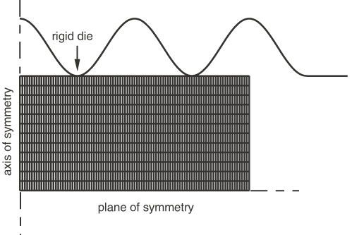
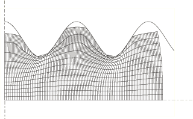
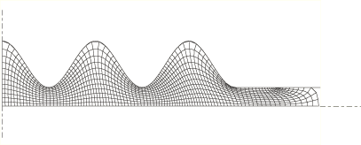
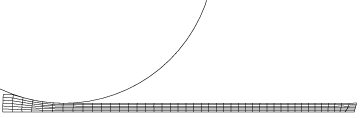

# 12.2.1 ALE adaptive meshing: overview


The adaptive meshing technique in Abaqus combines the features of pure Lagrangian analysis and pure Eulerian analysis. This type of adaptive meshing is often referred to as Arbitrary Lagrangian-Eulerian (ALE) analysis. The Abaqus documentation often refers to “ALE adaptive meshing” simply as “adaptive meshing.”

ALE adaptive meshing is a tool that makes it possible to maintain a high-quality mesh throughout an analysis, even when large deformation or loss of material occurs, by allowing the mesh to move independently of the material. ALE adaptive meshing does not alter the topology (elements and connectivity) of the mesh, which implies some limitations on the ability of this method to maintain a high-quality mesh upon extreme deformation. Refer to ["Adaptivity techniques," Section 12.1.1](pt04ch12s01aus77.md), for a comparison between ALE adaptive meshing and other Abaqus adaptivity methods.

ALE adaptive meshing is distinct from the pure Eulerian analysis capability in Abaqus/Explicit. The pure Eulerian capability supports multiple materials and voids within a single element, which allows effective handling of analyses involving extreme deformation (such as fluid flow). In contrast, ALE elements are always 100% full of a single material; while this formulation limits the deformation of material in the model to the deformation of the elements, it allows more precise definitions of material boundaries and more complex contact interactions. For more information on pure Eulerian analysis, see ["Eulerian analysis," Section 14.1.1](pt04ch14s01aus90.md).

Although the adaptive meshing techniques and the user interface are similar in Abaqus/Explicit and Abaqus/Standard, the use-cases and the level of functionality are different. Adaptive meshing in Abaqus/Explicit is intended to model large-deformation problems. It does not attempt to minimize discretization errors in small-deformation analyses. Adaptive meshing in Abaqus/Standard is intended for use in acoustic domains and for modeling the effects of ablation, or wear, of material. A comparison between the adaptive remeshing functionality in Abaqus/Explicit and Abaqus/Standard is provided in this section.

### Features of ALE adaptive meshing

ALE adaptive meshing:
- can often maintain a high-quality mesh under severe material deformation by allowing the mesh to move independently of the underlying material; and
- maintains a topologically similar mesh throughout the analysis (i.e., elements are not created or destroyed).

In Abaqus/Explicit ALE adaptive meshing:- can be used to analyze Lagrangian problems (in which no material leaves the mesh) and Eulerian problems (in which material flows through the mesh);
- can be used as a continuous adaptive meshing tool for transient analysis problems undergoing large deformations (such as dynamic impact, penetration, and forging problems);
- can be used as a solution technique to model steady-state processes (such as extrusion or rolling);
- can be used as a tool to analyze the transient phase in a steady-state process; and
- can be used in explicit dynamics (including adiabatic thermal analysis) and fully coupled thermal-stress procedures.

In Abaqus/Standard ALE adaptive meshing:- can be used to solve Lagrangian problems (in which no material leaves the mesh) and to model effects of ablation, or wear (in which material is eroded at the boundary);
- can be used to update the acoustic mesh when structural preloading causes significant geometric changes in the acoustic domain; and
- can be used in geometrically nonlinear static, steady-state transport, coupled pore fluid flow and stress, and coupled temperature-displacement procedures.

### Activating ALE adaptive meshing

Adaptive meshing can be applied to an entire model or to individual parts of a model. A Lagrangian adaptive mesh domain will be created, so that the domain as a whole will follow the material originally inside it, which is the proper physical interpretation for most structural analyses. Additional options are provided for controlling the mesh. In Abaqus/Explicit analyses you can define Eulerian boundaries to allow material to flow into or out of the domain modeled.

The subsequent sections of ["ALE adaptive meshing," Section 12.2](pt04ch12s02.md), describe the various options that can be used with adaptive meshing. Although these options give you the ability to exercise detailed control over adaptive meshing, they are not necessary for many Lagrangian problems.
- To take full advantage of all the adaptive mesh features in Abaqus, it is important to understand the concepts of adaptive mesh domains, boundary regions, boundary edges, geometric features, and mesh constraints. These concepts are explained in ["Defining ALE adaptive mesh domains in Abaqus/Explicit," Section 12.2.2](pt04ch12s02aus78.md), and ["Defining ALE adaptive mesh domains in Abaqus/Standard," Section 12.2.6](pt04ch12s02aus82.md). Instructions for applying boundary conditions, loads, and surfaces to adaptive mesh boundaries are also provided in those sections.
- ["ALE adaptive meshing and remapping in Abaqus/Explicit," Section 12.2.3](pt04ch12s02aus79.md), and ["ALE adaptive meshing and remapping in Abaqus/Standard," Section 12.2.7](pt04ch12s02aus83.md), outline the methods used to move the mesh and to remap solution variables to the new mesh. These sections also present options for controlling these algorithms. Although the default methods have been chosen to work well for a wide variety of problems, you may wish to override the defaults to balance the robustness and efficiency of adaptive meshing or to extend the use of adaptive meshing to relatively difficult or unusual applications.
- Various output and diagnostics are available for verifying the formation of adaptive mesh domains and for interpreting the results of an analysis. These options are explained in ["Output and diagnostics for ALE adaptive meshing in Abaqus/Explicit," Section 12.2.5](pt04ch12s02aus81.md).
- ["Modeling techniques for Eulerian adaptive mesh domains in Abaqus/Explicit," Section 12.2.4](pt04ch12s02aus80.md), gives advice, in the form of examples and modeling hints, on setting up and interpreting Eulerian problems in Abaqus/Explicit using adaptive meshing.

| **Input File Usage: ** | ``` [*ADAPTIVE MESH](../key/key-link.md#usb-kws-hadaptivemesh), ELSET=*elset_name* ``` |
| --- | --- |

| **Abaqus/CAE Usage: ** | Step module: ****Other****ALE Adaptive Mesh Domain****Edit****: toggle on **Use the ALE adaptive mesh domain below**, and click **Edit** to select the region |
| --- | --- |

### Uses for ALE adaptive meshing

Adaptive meshing is of great value in a variety of problems. Abaqus/Explicit and Abaqus/Standard each employ adaptive meshing in ways that provide the greatest value within the particular solver.

#### Uses in Abaqus/Explicit

 In problems where large deformation is anticipated the improved mesh quality resulting from adaptive meshing can prevent the analysis from terminating as a result of severe mesh distortion. In these situations you can use adaptive meshing to obtain faster, more accurate, and more robust solutions than with pure Lagrangian analyses.

Adaptive meshing is particularly effective for simulations of metal forming processes such as forging, extrusion, and rolling because these types of problems usually involve large amounts of nonrecoverable deformation. Because the final shape of the product can be drastically different from the original shape, a mesh that is optimal for the original product geometry can become unsuitable in later stages of the process when large material deformation leads to severe element distortion and entanglement. Element aspect ratios can also degrade in zones with high strain concentrations. Both of these factors can lead to a loss of accuracy, a reduction in the size of the stable time increment, or even termination of the problem.

#### Uses in Abaqus/Standard

You can use adaptive meshing to enable acoustic domain meshes to follow the large deformations of the bounding structure. In other applications you can use adaptive meshing and adaptive mesh constraints to model arbitrarily large amounts of ablation of material away from the domain.

Adaptive meshing of acoustic regions greatly extends the utility of acoustic analysis procedures. Abaqus can be used to model the response of a coupled structural-acoustic system subjected to structural preloads. By default, the structural-acoustic calculations are based on the original configuration of the acoustic domain. This approximation is adequate as long as the boundary between the fluid and structure does not experience large deformation during application of the preload. However, when the geometry of the acoustic domain changes significantly as a result of structural loading, the original acoustic configuration must be updated. An example is the interior cavity of a tire subjected to inflation, rim mounting, and footprint pressure loads. 

The acoustic elements in Abaqus do not have mechanical behavior and, therefore, cannot model the deformation of the fluid when the structure undergoes large deformation. Abaqus/Standard solves the problem of computing the current configuration of the acoustic domain by periodically creating a new acoustic mesh that uses the same topology as the original mesh but with the nodal locations adjusted so that the deformation of the structural-acoustic boundary does not lead to severe distortion of the acoustic elements. 

 The geometric changes associated with the new acoustic mesh are then taken into account in a subsequent coupled structural-acoustic analysis. However, it is assumed that the material properties of the fluid, such as the density, do not change as a result of mesh smoothing. 

Adaptive meshing can also model effects of ablation, or wear, by enabling you to define boundary mesh motions independent of the underlying material motion. An example is the wearing of a tire during its life, an effect that can significantly affect the performance of the structure.

### Comparison of ALE adaptive meshing in Abaqus/Explicit and Abaqus/Standard

Adaptive meshing in Abaqus/Explicit is generally more robust and provides more features for controlling the mesh than does adaptive meshing in Abaqus/Standard.

#### ALE adaptive meshing in Abaqus/Explicit

Adaptive meshing in Abaqus/Explicit is designed to handle a large variety of problem classes, and employs a variety of smoothing methods, with controls that you can use to tailor the adaptivity to specific problems. The Abaqus/Explicit implementation allows you to do the following:
- to create entirely Eulerian models;
- to improve the quality of the mesh initially, before deformation begins; and
- to define tracer particles, which enable tracking and output of material-based results quantities.

#### ALE adaptive meshing in Abaqus/Standard

 Adaptive meshing in Abaqus/Standard uses a single smoothing algorithm that works well for structural acoustic analyses and the modeling of ablation processes. The Abaqus/Standard implementation of adaptive meshing has the following limitations:
- Initial mesh sweeps cannot be used to improve the quality of the initial mesh definition.
- The method is not intended to be used in general classes of large-deformation problems, such as bulk forming.
- Diagnostics capabilities are currently limited.

### Illustrative examples

To illustrate the value of adaptive meshing, simple examples of transient and steady-state forming applications follow. For simplicity, two-dimensional cases are shown. In each case Abaqus/Explicit is used in the simulation.

#### Axisymmetric forging

In this example a well-lubricated rigid die of sinusoidal shape moves down to deform a blank of rectangular cross-section (see [Figure 12.2.1--1](pt04ch12s02abo14.md#forging-odb-undef)). 

**Figure 12.2.1–1** A blank and a sinusoidal die.



The indentation depth is 80% of the original blank thickness. Material extrudes upward and outward (radially) as the blank is indented. The die is modeled with an analytical rigid surface, and the blank is modeled with axisymmetric continuum elements in a regular mesh configuration. The blank is assumed to have elastic-plastic material properties.

A pure Lagrangian analysis of this problem does not run to completion because of excessive distortion in several elements, as shown in [Figure 12.2.1--2](pt04ch12s02abo14.md#over-forge-noale). The contact surface cannot be treated correctly because of the gross distortion of the elements at the troughs of the sinusoidal rigid surface.

**Figure 12.2.1–2** Eventually, the purely Lagrangian analysis will terminate because of excessive element distortion.



Adaptive meshing allows the problem to run to completion. A Lagrangian adaptive mesh domain is created for the entire blank. Abaqus/Explicit automatically chooses suitable defaults for adaptive meshing; hence, the adaptive mesh approach requires only two additional input lines:

```
[*HEADING](../key/key-link.md#usb-kws-mheading)
 ...
[*ELSET](../key/key-link.md#usb-kws-melset), ELSET=BLANK
***************************
[*STEP](../key/key-link.md#usb-kws-hstep)
[*DYNAMIC](../key/key-link.md#usb-kws-hdynamic), EXPLICIT
 ...
[*ADAPTIVE MESH](../key/key-link.md#usb-kws-hadaptivemesh), ELSET=BLANK
 ...
[*END STEP](../key/key-link.md#usb-kws-hendstep)
```

[Figure 12.2.1--3](pt04ch12s02abo14.md#over-forge-partial) and [Figure 12.2.1--4](pt04ch12s02abo14.md#over-forge-final) show the deformed mesh at various stages of the forming analysis. Because the mesh refinement is maintained on the areas of the slave surface that contact the die troughs as the material flows radially, contact conditions are resolved correctly throughout the analysis.

**Figure 12.2.1–3** Deformed configuration at an intermediate stage of the analysis.


**Figure 12.2.1–4** Deformed configuration upon completion of the analysis.



#### Steady-state rolling example

This example shows how adaptive meshing can be used in a steady-state simulation to allow the flow of material through Eulerian boundaries on the problem domain. A steel plate is passed through a symmetric roll stand to reduce its height by 50%. This simulation is run until it reaches steady-state conditions. 

[Figure 12.2.1--5](pt04ch12s02abo14.md#over-roll-lag-undef) and [Figure 12.2.1--6](pt04ch12s02abo14.md#over-roll-lag-final) show the initial and final (steady-state) configurations in a purely Lagrangian model of this problem.

**Figure 12.2.1–5** The initial configuration of the roller and the undeformed blank in the pure Lagrangian model.


**Figure 12.2.1–6** The final steady-state configuration in the pure Lagrangian model.



[Figure 12.2.1--7](pt04ch12s02abo14.md#over-roll-eul) shows this problem modeled using an Eulerian adaptive mesh domain, where material flows through the mesh. 

**Figure 12.2.1–7** The initial Eulerian adaptive mesh domain.


Only the region near the roller is modeled. The exact location of the free surface does not need to be known to set up the problem: it is created in a likely location, and the final steady-state position is found as part of the solution. Although not shown, a focused mesh can be used to capture steep strain gradients directly beneath the roller. The Eulerian domain reaches the same steady-state solution as obtained with the Lagrangian approach. 

The Eulerian adaptive mesh domain is created by defining an inflow and an outflow boundary on the adaptive mesh domain. Adaptive mesh constraints are applied normal to these boundaries so that material will flow through the mesh (see ["Defining ALE adaptive mesh domains in Abaqus/Explicit," Section 12.2.2](pt04ch12s02aus78.md)). Frictional contact between the roller and the blank pulls material through the adaptive mesh domain.

The problem is set up by making the following modifications to the input file for the pure Lagrangian analysis:

```
[*HEADING](../key/key-link.md#usb-kws-mheading)
 ...
[*ELSET](../key/key-link.md#usb-kws-melset), ELSET=BILLET
 ...
[*ELSET](../key/key-link.md#usb-kws-melset), ELSET=INFLOW
 ...
[*ELSET](../key/key-link.md#usb-kws-melset), ELSET=OUTFLOW
 ...
[*NSET](../key/key-link.md#usb-kws-mnset), NSET=INFLOW
 ...
[*NSET](../key/key-link.md#usb-kws-mnset), NSET=OUTFLOW
 ...
[*SURFACE](../key/key-link.md#usb-kws-msurface), NAME=INFLOW, REGION TYPE=EULERIAN
 INFLOW, S1
[*SURFACE](../key/key-link.md#usb-kws-msurface), NAME=OUTFLOW, REGION TYPE=EULERIAN
 OUTFLOW, S2
***************************
[*STEP](../key/key-link.md#usb-kws-hstep)
[*DYNAMIC](../key/key-link.md#usb-kws-hdynamic), EXPLICIT
*Data line to specify the time period of the step*
 ...
[*ADAPTIVE MESH](../key/key-link.md#usb-kws-hadaptivemesh), ELSET=BILLET, CONTROLS=ADAPT
[*ADAPTIVE MESH CONTROLS](../key/key-link.md#usb-kws-hadaptivemeshcontrols), NAME=ADAPT
[*ADAPTIVE MESH CONSTRAINT](../key/key-link.md#usb-kws-hadaptivemeshconstraint), TYPE=DISPLACEMENT
 INFLOW, 1, 1, 0.0
 100, 2, 2, 0.0
 OUTFLOW, 1, 1, 0.0
 ...
[*END STEP](../key/key-link.md#usb-kws-hendstep)
```
Adaptive mesh controls were not required to solve this problem; they were included for illustrative purposes (see ["ALE adaptive meshing and remapping in Abaqus/Explicit," Section 12.2.3](pt04ch12s02aus79.md), for details).


