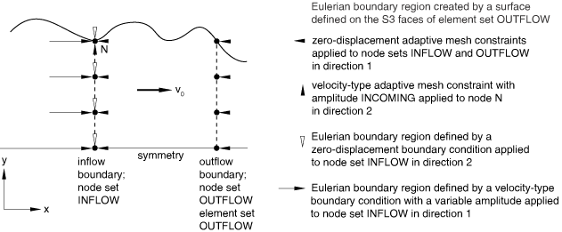
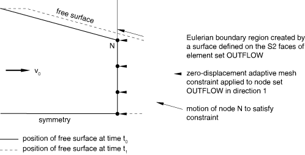
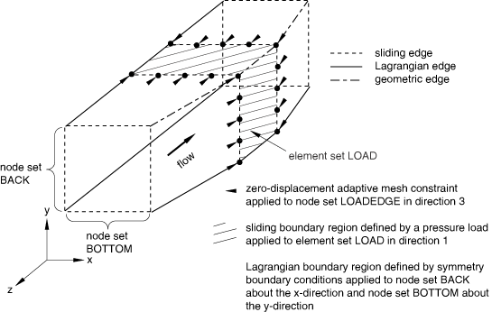
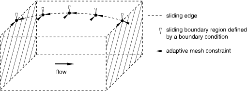

# 12.2.4 Abaqus/Explicit中欧拉自适应网格域的建模技术

**产品：** Abaqus/Explicit Abaqus/CAE

##### **参考**

- ["ALE自适应网格划分：概述，" Section 12.2.1](pt04ch12s02abo14.md)
- ["在Abaqus/Explicit中定义ALE自适应网格域，" Section 12.2.2](pt04ch12s02aus78.md)
- [*ADAPTIVE MESH CONSTRAINT](../key/key-link.md#usb-kws-hadaptivemeshconstraint)
- ["Understanding ALE adaptive meshing," Section 14.6 of the Abaqus/CAE User's Guide](../usi/usi-link.md#usi-sim-conc-other-adaptmesh)

### 概述

欧拉自适应网格域：
- 用于模拟流过网格的材料
- 通常有两个欧拉边界区域，一个流入和一个流出，由拉格朗日和/或滑移边界区域连接

正确的网格约束组合以及施加到欧拉边界区域的材料边界条件取决于该区域是作为流入边界还是流出边界。分配给与欧拉边界区域连接的边界区域的区域类型和网格约束也必须选择以模拟正确的物理行为。

Abaqus/Explicit中的自适应网格划分技术在网格约束不足时是稳健的；本节中的建模技术旨在提供正确定义欧拉模型的指导。

### 欧拉边界上的ALE自适应网格约束

ALE自适应网格约束应垂直于欧拉边界区域施加；否则，边界上网格运动的含义不清楚。如果垂直于边界没有施加网格约束，Abaqus/Explicit将把该区域视为滑移边界，网格将沿垂直于边界的方向跟随材料。

虽然在欧拉边界区域节点上指定自适应网格约束没有限制，但在大多数情况下应遵循以下准则：
- 网格约束应施加到欧拉边界区域上的每个节点，包括角点和边。
- 网格约束应仅垂直于欧拉边界区域或在所有方向上施加。网格约束不应仅在平行于欧拉边界区域的方向上指定；此类约束含义模糊，可能导致边界上网格运动不理想。

欧拉边界上的载荷和边界条件作用于瞬时与表面上网格重合的材料。当与空间自适应网格约束结合使用时，可以定义物理上有意义的欧拉流动条件。

### 定义流入欧拉边界

通过欧拉边界流入自适应网格域的材料将具有与紧邻边界的单元内材料相同的应力和材料状态。因此，重要的是将这些单元的应力和材料状态保持在所需值（ 在许多情况下将为零，以模拟流入欧拉域的无应力材料）。为实现此目标：
- 将流入边界放置在远离高解梯度的足够上游，以确保流入边界的响应平滑
- 在边界处施加足够的网格和材料约束（如本节后面所述）

为了物理上有意义，流入边界区域的大小和形状必须保持。例如，对于稳态过程模拟，其中进入自适应网格域的工件横截面是已知的并影响下游响应，施加足够的约束是至关重要的。流入边界适当的约束类型取决于流入边界区域的位置是已知还是作为解的一部分。

#### 已知流入边界位置

在许多问题中，流入边界的面积、形状和位置是先验已知的。例如，在正挤压稳态分析中，流入欧拉边界可用于模拟材料流入自适应网格域。流入边界的大小基于已知的坯料横截面，流入边界的位置由于材料上的约束条件而是固定的。

当流入边界的面积、形状和位置已知时，应同时施加材料和网格约束。[图12.2.4-1](pt04ch12s02aus80.md#aaleeulertech-inflow-known)显示了一个二维正挤压问题的典型模型设置，其中将规定的质量流率或规定的均匀压力施加到已知流入边界。在流入边界区域的所有节点上施加边界条件，以规定平行于边界表面方向的材料约束。防止材料平行于流入边界移动有助于维持相邻欧拉边界的单元的应力和材料状态。

**图12.2.4-1** 已知流入边界。

在流入边界上的所有节点在法向施加自适应网格约束。此外，在围绕欧拉边界区域的边和角的所有切向方向施加网格约束。这些约束固定了流入边界处横截面的位置和大小。

如果在流入边界处的材料上施加非均匀边界条件或载荷，或者如果紧邻边界的单元内的初始材料状态在切向方向不均匀，则将切向网格约束严格施加到欧拉边界区域内部的节点上。

虽然流入欧拉边界切向和沿边和角的网格和材料约束的施加看起来是多余的，但它们实际上是独立的。例如，考虑具有可变横截面的长坯料，如[图12.2.4-2](pt04ch12s02aus80.md#aaleeulertech-variable)中所示。

**图12.2.4-2** 建模具有可变横截面的坯料。

自适应网格域及其流入和流出欧拉边界区域被假定为代表坯料沿其长度的一部分。整个坯料沿其长度（x方向）以刚体速度移动，使得材料从一个欧拉边界流入，从另一个流出。在流入边界处的材料上施加边界条件以维持此速度。在流入和流出边界区域法向施加网格约束。在节点N的y方向施加的网格约束用于规定已知的变化流入材料横截面。此节点的运动不影响进入域的材料的速度场。

#### 未知流入边界位置

有时，流入边界区域的位置仅大致已知；其精确位置将从解中确定。对于这些问题，仅在垂直于欧拉边界区域的方向施加自适应网格约束。在欧拉边界区域的边和角没有切向网格约束的情况下，Abaqus/Explicit将在切向方向随材料移动这些边和角，但在法向随网格约束移动。因此，应使用多点约束（见["General multi-point constraints," Section 35.2.2](pt08ch35s02aus130.md)）或线性约束方程（见["Linear constraint equations," Section 35.2.1](pt08ch35s02aus129.md))使用材料约束来保持流入边界的横截面积。

例如，考虑具有不对称配置中多个辊的稳态轧制模拟，如[图12.2.4-3](pt04ch12s02aus80.md#aaleeulertech-inflow-unknow)中所示。

**图12.2.4-3** 未知流入边界位置。

将分析域延伸到上游导板可能不切合实际，但以任意位置在y和z方向空间固定流入边界可能导致工件在辊之间找到平衡位置时产生不现实的应力。网格约束在法向施加到欧拉边界区域，以固定流入边界相对于辊在x方向的位置。使用PIN MPC施加的材料约束用于确保材料以均匀速度进入域，并且横截面不旋转。材料约束将保持横截面的形状，同时允许其横向移动到正确的平衡位置。由于没有使用切向网格约束，网格将在平行于欧拉边界区域的方向上跟随材料。

### 定义流出欧拉边界

通常，自适应网格约束应仅施加在作为流出边界的欧拉边界区域表面的法向。不应在与作为自由表面的拉格朗日（或滑移）边界区域相邻的流出边界的边或角上施加切向网格约束。与流入边界相反，流出边界在自由表面相邻的横截面由域中的解确定。在欧拉边界区域与作为自由表面的拉格朗日或滑移边界区域相遇的边或角处，Abaqus/Explicit将同时满足施加到欧拉边界区域法向的网格约束和拉格朗日或滑移边界区域固有的网格约束，从而正确处理流出边界相邻自由表面的演化。[图12.2.4-4](pt04ch12s02aus80.md#aaleeulertech-free-surface)显示了流出边界从到的演化，其中材料继续通过流出边界流出。

**图12.2.4-4** Abaqus/Explicit将在欧拉流出边界处尊重自由表面。

欧拉流出边界的网格约束通过使节点N沿着材料自由表面移动来施加，使得流出边界随上游到达的材料"膨胀"。虽然图中未显示，但网格平滑导致流出边界上的所有其他节点（对称平面上的节点除外）向上朝向节点N移动，因为边界膨胀。

流出欧拉边界不需要特殊的材料边界条件。仅当它们与上游定义的相同（例如，沿欧拉域长度的对称平面）时，才推荐在流出边界切向施加边界条件。但是，为了提高稳态过程模拟中收敛到稳态解的速度，通常使用多点约束或线性约束方程将材料速度约束为垂直于流出边界均匀。

### 定义同时作为流入和流出边界的欧拉边界区域

虽然很少适合，但欧拉边界区域可以在同一分析步的不同时间既作为流入边界又作为流出边界。这种边界处的自适应网格约束和材料边界条件应选择得对流入和流出情况都有物理意义。

对于在欧拉边界区域的边和角上且没有切向网格约束的每个节点，Abaqus/Explicit将在每个自适应网格划分增量中确定该节点处的边界是作为流入还是流出边界。如果检测到流入条件，节点将在切向方向随材料移动，但在法向随网格约束移动。如果检测到流出条件，节点的移动将同时跟随相邻拉格朗日边界区域并满足欧拉边界区域法向的网格约束。

### 欧拉域上的拉格朗日与滑移边界区域

许多使用欧拉自适应网格域的应用，包括稳态过程模拟，具有主要的材料流动方向，并使用控制体方法对过程区域进行建模。这些问题通常包括两个欧拉边界区域，代表流入边界和流出边界。欧拉边界之间的剩余表面可以是拉格朗日或滑移边界区域。确定在两个欧拉边界区域之间使用哪种类型的边界区域取决于所需的载荷或边界条件类型：
- 使用滑移边界区域来定义沿控制体长度一部分在空间位置作用的边界条件或载荷。施加自适应网格约束以在流动方向（以及可能横向于流动的方向）上空间固定网格边界。例如，可以在控制体圆周上施加分布压力载荷，如图12.2.4-5所示。**图12.2.4-5** 沿欧拉控制体长度一部分施加空间压力载荷。 分布压力载荷使用滑移边界区域定义。网格约束施加到边界区域以在流动方向空间固定边界区域。类似地，可以在已知位置以已知力将集中载荷施加到特定空间位置，以模拟非常尖锐物体压入工件的效应。
- 使用滑移边界区域来定义沿欧拉控制体长度在流入和流出边界之间沿整个长度施加且横向于流动以空间方式作用的边界条件或载荷。如果载荷仅在横向方向的一部分表面上作用，可能需要在横向于流动的方向施加网格约束。例如，沿域长度作用的刀口边界条件如图12.2.4-6所示。沿横向方向（如果应用线是弯曲的，则沿该线）施加网格约束以保持边界条件空间固定。**图12.2.4-6** 沿欧拉控制体整个长度施加边界条件。
- 使用拉格朗日边界区域（默认）来定义沿欧拉控制体表面在流入和流出边界之间沿整个长度施加且横向于流动以拉格朗日方式作用的边界条件或载荷。在三维中，对称条件通常应在横向于流动方向的拉格朗日方式作用。在许多情况下，几何边将阻止材料从对称平面流到自由表面。但是，由于几何边可以随着表面变平而被停用，因此对于这些问题，应使用拉格朗日边界区域来定义对称平面。在[图12.2.4-5](pt04ch12s02aus80.md#aaleeulertech-press-strip)中，假定四分之一对称，对称平面使用拉格朗日边界区域定义。产生的从一条欧拉边界延伸到另一条的拉格朗日边将对称平面与自由表面分开。
- 通常，不能为使用欧拉控制体的流入和流出边界之间的特定材料部分上的边界条件或载荷建模。因为载荷或边界条件下的网格必须跟随材料，它最终将受到欧拉边界的限制。载荷和边界条件的这种处理通常与稳态模型不一致，不应在使用欧拉自适应网格域的实际模拟中出现。
