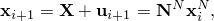
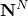

# 12.2.7 Abaqus/Standard 中的 ALE 自适应网格划分和重映射


**产品：** Abaqus/Standard  Abaqus/CAE  

##### **参考文献**

- ["在 Abaqus/Standard 中定义 ALE 自适应网格域," 第 12.2.6 节](pt04ch12s02aus82.md)
- [*ADAPTIVE MESH](../key/key-link.md#usb-kws-hadaptivemesh)
- [*ADAPTIVE MESH CONSTRAINT](../key/key-link.md#usb-kws-hadaptivemeshconstraint)
- [*ADAPTIVE MESH CONTROLS](../key/key-link.md#usb-kws-hadaptivemeshcontrols)
- ["自定义 ALE 自适应网格划分," Abaqus/CAE 用户指南第 14.14 节](../usi/usi-link.md#usi-sim-other-adaptmesh)

### 概述

ALE 自适应网格划分包括两个基本任务：
- 通过称为扫掠的过程创建新网格，以及
- 使用称为平流的过程将解变量从旧网格重映射到新网格。

您可以控制网格扫掠过程，之后如果需要，Abaqus/Standard 将自动执行平流。为创建新网格选择的默认方法经过仔细选择，可用于声学分析和模拟烧蚀或材料磨损效应。但是，您可能需要覆盖默认选择以平衡自适应网格划分的鲁棒性和效率，或将自适应网格划分扩展用于其他类型的应用。

自适应网格平滑作为步骤定义的一部分进行定义。Abaqus/Standard 中的自适应网格划分使用算子分裂方法，其中每个分析增量包括一个拉格朗日阶段和一个欧拉阶段。拉格朗日阶段是典型的 Abaqus/Standard 求解增量，其中不发生网格扫掠或平流。一旦平衡方程收敛，就应用网格平滑。在通过网格扫掠过程调整节点之后，材料点量在欧拉阶段被平流，以考虑模型在其当前配置中的重新网格划分。选择这种算子分裂方法是为了避免在平流和材料应变同时发生时产生的非对称雅可比项。不需要对声学单元进行平流，也不会对其应用平流。

### ALE 自适应网格扫掠算法

自适应网格平滑在结构平衡方程收敛后执行。网格平滑方程通过在自适应网格域上迭代扫掠来显式求解。在每次网格扫掠期间，域中的节点被重新定位——基于在前一次网格扫掠期间获得的相邻节点的位置——以减少单元畸变。节点的新位置，，获得如下



其中是节点的原始位置，是节点位移，是在前一次网格扫掠期间获得的相邻节点位置，是从以下一种或多种方法的加权混合物中获得权函数。在扫掠期间应用的位移与力学行为无关。

#### 原始配置投影

原始配置投影是 Abaqus/Standard 中的默认方法，通过最小二乘最小化程序确定权函数，该程序最小化将网格投影回原始配置时的节点位移。这种平滑方法仅影响网格的变形，而不影响原始网格。

#### 体积平滑

体积平滑通过计算围绕节点的单元中心的体积加权平均值来确定权函数。在图 12.2.7--1 中，节点 M 的新位置由四个周围单元的中心位置 C 的体积加权平均值确定。体积加权将倾向于将节点 M 从单元中心 C1 推开，朝向单元中心 C3，从而减少单元畸变。

**图 12.2.7–1** 网格扫掠期间节点的重新定位。


体积平滑在结构域中得到支持，其中每个节点在二维中被四个单元包围或在三维中被八个单元包围。

#### 组合平滑方法

Abaqus/Standard 中的默认平滑方法是原始配置投影。要选择替代平滑方法或组合平滑方法，请为每种方法指定加权因子。当使用多种平滑方法时，通过计算每种选定方法预测的位置的加权平均值来重新定位节点。所有权重必须为零或正数，并且它们的和必须非零。权重仅在相对意义上重要；它们的值被归一化，使它们的和为 1.0。

| **输入文件用法：** | ``` [*ADAPTIVE MESH CONTROLS](../key/key-link.md#usb-kws-hadaptivemeshcontrols), NAME=*name* *original configuration projection weight, volume smoothing weight* ``` |
| --- | --- |
|  | 例如，可以使用以下选项来定义原始配置投影和体积平滑的等比例混合： ``` [*ADAPTIVE MESH CONTROLS](../key/key-link.md#usb-kws-hadaptivemeshcontrols), NAME=*name* 0.5, 0.5 ``` |

| **Abaqus/CAE 用法：** | Step 模块：****Other****ALE Adaptive Mesh Controls****Create****: **Name**: *name*, **Original configuration projection:** *original configuration projection weight*, **Volumetric:** *volume smoothing weight* |
| --- | --- |

#### 基本平滑方法的几何增强

基本平滑方法的传统形式在高度畸变的域中可能表现不佳。您可以使用基本平滑算法的几何增强形式作为减轻畸变的技术。这些形式是启发式的，仅基于节点位置。由于其启发式性质，几何增强可能并不总是改善网格平滑。

| **输入文件用法：** | 使用以下选项将几何增强应用于平滑算法： |
| --- | --- |
|  | ``` [*ADAPTIVE MESH CONTROLS](../key/key-link.md#usb-kws-hadaptivemeshcontrols), NAME=*name*, GEOMETRIC ENHANCEMENT=YES ``` |

| **Abaqus/CAE 用法：** | Step 模块：****Other****ALE Adaptive Mesh Controls****Create****: **Name**: *name*, 勾选 **Use enhanced algorithm based on evolving element geometry** |
| --- | --- |

#### 扫掠算法的应用

网格平滑过程从网格在其当前位移平衡配置下开始。没有位移自由度的节点（如连接到声学单元的节点）保持在其最新配置。网格平滑由当前配置中的畸变和边界约束驱动。这些边界约束可以直接通过自适应网格约束来描述。对于结构-声学边界，结构网格边界提供了一个约束，控制相邻声学单元区域的平滑。

当这些边界约束远大于自适应网格域中的特征单元长度时，可能会发生显著的几何变化，例如角的形成。为防止此类变化，约束在一系列"子增量"上逐渐应用到域边界。使用的子增量数基于最大表面位移和特征单元尺寸的幅度来确定。

其余节点（不受约束驱动的节点）被识别为内部节点、自由表面节点、边缘节点或角节点。这些节点按照 ["在 Abaqus/Standard 中定义 ALE 自适应网格域," 第 12.2.6 节](pt04ch12s02aus82.md) 中描述的方式处理。

在网格扫掠结束时，检查新几何形状以确保单元在网格平滑期间没有变得严重畸变。Abaqus/Standard 以不同方式响应严重畸变，具体取决于所使用的单元和过程。当自适应网格划分与声学单元一起使用时，将使用减小的时间增量重复当前分析增量，然后再次尝试自适应网格平滑。当自适应网格划分与其他单元一起使用时，严重畸变导致放弃该增量的网格平滑。在也定义了自适应网格约束的情况下，Abaqus/Standard 会中止，因为无法满足约束。

#### 控制 ALE 自适应网格平滑的频率

在大多数情况下，自适应网格划分的频率是影响网格质量最大的参数。默认情况下，网格平滑将在每个收敛的结构分析增量之后执行。您可以更改自适应网格划分的频率，但定义了自适应网格约束时除外。

| **输入文件用法：** | ``` [*ADAPTIVE MESH](../key/key-link.md#usb-kws-hadaptivemesh), FREQUENCY=*number of increments* ``` |
| --- | --- |

| **Abaqus/CAE 用法：** | Step 模块：****Other****ALE Adaptive Mesh Domain****Edit****：勾选 **Use the adaptive mesh domain below**, **Frequency:** *number of increments* |
| --- | --- |

#### 控制 ALE 自适应网格平滑的收敛

自适应网格平滑方程通过在自适应网格域上迭代扫掠来显式求解。在每次网格扫掠期间，域中的节点被重新定位——基于相邻节点的当前位置——以减少单元畸变。

网格平滑在收敛增量结束后执行。您可以通过定义所需网格扫掠次数来控制网格平滑的强度。当位移较大时，通常需要更多迭代。当用于声学分析时，当声学域中单元的体积相对于结构加载期间体积增加时，通常需要更多迭代。

您可以指定在每个自适应网格增量中执行的网格扫掠次数。默认网格扫掠次数为一。

通过重复应用网格扫掠算法，网格将收敛；换言之，获得的节点位置不会随着进一步的网格扫掠而改变。但是，通常不需要应用网格平滑直到获得收敛网格；主要目标是减少单元畸变。

| **输入文件用法：** | ``` [*ADAPTIVE MESH](../key/key-link.md#usb-kws-hadaptivemesh), MESH SWEEPS=*number of sweeps* ``` |
| --- | --- |

| **Abaqus/CAE 用法：** | Step 模块：****Other****ALE Adaptive Mesh Domain****Edit****：勾选 **Use the adaptive mesh domain below**, **Remeshing sweeps per increment:** *number of sweeps* |
| --- | --- |

### ALE 自适应网格平流算法

Abaqus/Standard 应用基于 Lax-Wendroff 方法的显式方法来积分平流方程。Lax-Wendroff 方法的关键原理是使用材料时间导数、参考导数和空间导数之间的经典关系，用空间导数替换材料点量的时间导数。更新格式是二阶精确的，并提供一些上风。平流节点量首先将它们转换为材料点量。

平流材料量通常会导致平衡丢失，主要有两个原因。第一个原因是平流过程本身的误差。为最小化平流误差，Abaqus/Standard 通过要求自适应域中每个单元的 Courant 数小于一来限制平流速度的大小。在 Courant 数大于一的情况下，您将收到通知，Abaqus/Standard 将生成每个增量的多次平流传递。平衡丢失的第二个原因是 Changed 网格对底层材料量表示的变化。例如，考虑一个区域，该区域具有一些应力梯度，最初由两个单元跨越。网格平滑后，相同区域可能有超过两个单元。这将导致内部力计算中的体积积分略有不同，即使平流没有误差。

平衡中这些误差源仅在网格太粗而无法提供良好解且网格平滑以如此小的频率进行以使网格运动大于平均单元尺寸时才显著。在实际应用中，这些误差通常可以忽略不计，平衡的丢失通常很小，并且由平衡丢失产生的残差落在 Abaqus/Standard 收敛标准的范围内。任何平衡丢失都不会传播，因为平衡将在下一个增量的拉格朗日阶段结束时再次满足。

#### 平流对后续步骤的影响

为确保仅在满足平衡的配置中输出结果，Abaqus/Standard总是在拉格朗日阶段结束时输出结果。跟随拉格朗日阶段的欧拉阶段将使得结构在下一个增量中处于不平衡状态。这一序列的后果是，在最后一个欧拉阶段在步骤结束时完成后，下一步开始时平衡将不会精确满足，并且步骤结束时的解将与下一步零增量的解略有不同。可以通过跟随自适应网格划分步骤之后的一个步骤来再次建立平衡，该步骤移除所有自适应网格域并允许结构平衡。一增量步骤通常就足够了。当后续步骤是使用先前步骤的解作为基态的扰动过程时，这一点尤其重要。

跟随自适应网格步骤的频率步骤也会受到影响，因为单元质量在网格平滑期间不会平流。根据自适应网格运动和网格平滑引起的单元尺寸变化的程度，对单元质量的影响可能很显著。在自适应网格划分先于频率步骤的情况下，Abaqus 将提供警告消息；在这些情况下，您应在解释频率步骤结果时评估更新网格配置的影响。

### 输出

在自适应网格划分中，单元的积分点通常不会在整个分析中引用相同的材料点。材料变量的等值线图将显示正确的空间分布，但历史图没有意义。节点的位移包含材料位移以及网格运动引起的位移。您可以使用部分模型变量 VOLC 获取因自适应网格约束而丢失的体积度量，这在使用自适应网格约束模拟烧蚀时很有用。

每个自适应网格域中的自适应网格划分摘要被写入消息（`.msg`）文件。此摘要包括将结构位移转移到流体的载荷增量总数、执行的网格扫掠总次数、最大位移增量的幅度，以及测量最大位移增量的节点和自由度。当几何特征在网格平滑期间发生变化时，会发出警告消息。

可以请求更详细的自适应网格平滑诊断输出；参见 ["Abaqus/Standard 消息文件" in "输出," 第 4.1.1 节](pt02ch04s01aus38.md#usb-out-ooutput-message-std)。此输出提供每次网格扫掠期间最大位移的幅度以及发生最大位移增量的节点和自由度。此外，还列出了经历几何特征变化的节点。

#### 其他参考文献

- Lax, P. D., and B. Wendroff, "Difference Schemes for Hyperbolic Equations with High-Order Accuracy," Communications on Pure and Applied Mathematics, vol. 17 381, 1964.
- Lax, P. D., and B. Wendroff, "Systems of Conservations Laws," Communications on Pure and Applied Mathematics, vol. 13, pp. 217--237, 1960.
