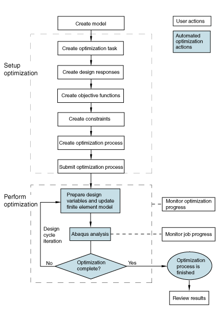

# 13.1.1 Structural optimization: overview

Structural optimization using Abaqus is an iterative process that helps you refine your designs. The result of a well-designed structural optimization is a component that is lightweight, rigid, and durable. Abaqus provides three approaches to structural optimization—topology optimization, shape optimization, and sizing optimization. Topology optimization starts with an initial model and determines an optimum design by modifying the properties of the material in selected elements, effectively removing elements from the analysis. Shape and sizing optimization further refine the model. Shape optimization modifies the surface of the component by moving the surface nodes to reduce local stress concentrations. Sizing optimization modifies the sheet thickness of sheet metal components; typically, to increase the stiffness or reduce vibration. Topology, shape, and sizing optimization are governed by a set of objectives and constraints.

Optimization is a tool for shortening the development process by adding value to a designer's experience and intuition with an automated procedure. To optimize your model, you need to know what to optimize. It is not sufficient to say that you want to minimize stresses or maximize eigenvalues, your statements must be more specific. For example, you might want to minimize the maximal nodal stresses experienced during two load cases. Similarly, you might want to maximize the sum of the first five eigenvalues. The goal of an optimization is called the objective function. In addition, you can enforce certain values during the optimization. For example, you can specify that the displacement of a given node must not exceed a certain value. An enforced value is called a constraint. 

You use Abaqus/CAE to create the model to be optimized and to define, configure, and execute the structural optimization. For more information, see [Chapter 18, "The Optimization module," of the Abaqus/CAE User's Guide](../usi/usi-link.md#usi-opz).

### Terminology

Structural optimization introduces its own terminology. The following terms are used throughout the Abaqus documentation and the Abaqus/CAE user interface:

**Design area**: The design area is the region of your model that the structural optimization modifies. The design area can be the whole model, or it can be a subset of the model containing only selected regions. Given the prescribed conditions (such as boundary conditions, loads, and manufacturing constraints),
- a topology optimization process removes and adds material from elements in the design area while it attempts to reach an optimal design, and
- a shape optimization modifies the surface of the design area by moving surface nodes, and
- a sizing optimization modifies the thickness of the design area by changing the thickness of shell elements.

**Design variables**: For an optimization problem, the design variables represent the parameters to be changed during the optimization. For a topology optimization, the densities of the elements in the design area are the design variables. The Optimization Module changes the density during each iteration of the optimization and couples the stiffness of each element with the density. In effect, the optimization removes elements from your model by giving them a mass and stiffness that is small enough to ensure they no longer participate in the overall response of the structure. The model with the revised material properties is then analyzed by Abaqus.For a shape optimization, the displacements of the surface nodes in the design area are the design variables. During the optimization, the Optimization Module either moves a node outward (growth) or inward (shrinkage) or leaves the position unchanged (neutral). Restrictions influence the amount a surface node can move and the direction in which it can move. The optimization directly modifies only the position of the corner nodes of elements; the Optimization Module interpolates the displacement of midside nodes from the movement of the corner nodes.For a sizing optimization, the thicknesses of the shell elements in the design area are the design variables. The Optimization Module can adjust the thickness of individual shell elements, or you can require clustering—the simultaneous modification of shell thicknesses in specific areas.

**Design cycle**: Optimization is an iterative design process that updates the design variables, executes an Abaqus analysis of the modified model, and reviews the results to determine if an optimized solution has been reached. Each optimization iteration is called a design cycle.

**Optimization task**: An optimization task contains the definition of your optimization, such as the design responses, objectives, constraints, and geometric restrictions. To run an optimization, you execute an optimization process. An optimization process refers to an optimization task.

**Design responses**: The inputs to the optimization are called the design responses. Design responses can be read directly from the Abaqus output database (`.odb`) file; for example, stiffness, stress, eigenfrequencies, and displacements. Alternatively, the Optimization Module can read data from the output database file and calculate the design responses from your model; for example, its weight, center of mass, or relative displacements. A design response is associated with a region of your model; however, it consists of a single scalar value, such as the maximum stress within a region or the total volume of the model. In addition, a design response can be associated with a particular step or load case. 

**Objective functions**: Objective functions define the objective of the optimization. An objective function is a single scalar value extracted from a design response, such as the maximum displacement or the maximum stress. An objective function can be formulated from multiple design responses. If you specify that the objective functions minimize or maximize the design responses, the Optimization Module calculates the objective function by adding each of the values determined from the design responses. In addition, if you have multiple objective functions, you can use a weighting factor to scale their influence on the optimization.

**Constraints**: Constraints are also a single scalar value extracted from a design response; however, a constraint cannot be derived from a combination of design responses. Constraints restrict the value of a design response; for example, you can specify that the volume must be reduced by 45% or the absolute displacement in a region must not exceed 1 mm. You can also apply manufacturing and geometric constraints that are independent of the optimization; for example, a structure must be able to be cast or stamped or the diameter of a bearing surface cannot be changed.

**Stop conditions**: A global stop condition defines the maximum number of iterations an optimization can perform. A local stop condition specifies that the optimization should end when a local minimum (or maximum) has been reached. 

### Structural optimization with Abaqus/CAE

The following steps are required to incorporate structural optimization into your Abaqus/CAE model: 
- You create an Abaqus model that can be optimized. For example, the design area must include only supported elements and materials. See ["Creating Abaqus optimization models," Section 13.2.3](pt04ch13s02aus89.md).
- You create an optimization task. See ["Creating and configuring an optimization task," Section 18.6 of the Abaqus/CAE User's Guide](../usi/usi-link.md#usi-opz-taskeditor).
- You create design responses. See ["Design responses," Section 13.2.1](pt04ch13s02aus87.md).
- You use the design responses to create objective functions and constraints. See ["Objectives and constraints," Section 13.2.2](pt04ch13s02aus88.md).
- You create an optimization process and submit it for analysis. See ["What is an optimization process?," Section 19.5.1 of the Abaqus/CAE User's Guide](../usi/usi-link.md#usi-ana-opt-whatis).

Based on the definition of the optimization task and the optimization process, the Optimization Module iteratively: 
- prepares the design variables (element densities or surface node positions) and updates the Abaqus finite element model, and
- executes an Abaqus/Standard analysis.

These iterations or design cycles continue until either: - the maximum number of design cycles is reached, or
- the specified stop conditions are reached.

[Figure 13.1.1--1](pt04ch13s01abo16.md#aoptimization-bigloop-nls) shows the interaction of Abaqus and the optimization process.

**Figure 13.1.1–1** User actions and automated Abaqus/CAE actions in the optimization process.

### Topology optimization

Topology optimization starts with an initial design (the original design area), which also contains any prescribed conditions (such as boundary conditions and loads). The optimization process determines a new material distribution by changing the density and the stiffness of the elements in the initial design while continuing to satisfy the optimization constraints, such as the minimum volume or the maximum displacement of a region. 

[Figure 13.1.1--2](pt04ch13s01abo16.md#aoptimization-progression) show the progression of a topology optimization of an automotive control arm during 17 design cycles. The objective function in the optimization is trying to minimize the maximum strain energy calculated from all the elements in the arm, in effect maximizing the structural stiffness of the arm. The constraint is forcing the optimization to reduce the volume by 57% from the initial value. During the optimization the density and the stiffness of the elements in the center of the arm are reduced so that the elements are, in effect, “removed” from the analysis. However, the elements are still present, and they could play a role in the analysis if their density and stiffness increase as the optimization continues. A geometry restriction forces the optimization to create a model that could be cast and removed from a mold—the Optimization Module cannot create voids and undercuts.

**Figure 13.1.1–2** The progression of a topology optimization.

Abaqus can apply the following objectives to a topology optimization process:
- strain energy (a measure of structural stiffness),
- eigenfrequencies,
- internal and reaction forces,
- weight and volume,
- center of gravity, and
- moment of inertia.

You can apply the same variables as constraints to a topology optimization process. In addition, you can apply a number of manufacturing constraints that ensure the proposed design can be created using standard production processes, such as casting and stamping. You can also freeze selected regions and apply member size, symmetry, and coupling constraints.

An example of using topology optimization is provided in ["Topology optimization of an automotive control arm," Section 11.1.1 of the Abaqus Example Problems Guide](../exa/exa-link.md#exa-opt-controlarm). The example includes a Python script that you can run from Abaqus/CAE to create the model and configure the optimization. 

### General versus condition-based topology optimization

Topology optimization supports two algorithms—the general algorithm, which is more flexible and can be applied to most problems, and the condition-based algorithm, which is more efficient but has limited capabilities. By default, the Optimization Module uses the general algorithm; however, you can choose which algorithm to use when you create the optimization task. Each algorithm has a different approach for determining the optimized solution.

#### Algorithms

General topology optimization uses an algorithm that adjusts the density and stiffness of the design variables while trying to satisfy the objective function and the constraints. The general algorithm is partly described in Bendse and Sigmund (2003). In contrast, condition-based topology optimization uses a more efficient algorithm that uses the strain energy and the stresses at the nodes as input data and does not need to calculate the local stiffness of the design variables. The condition-based algorithm was developed at the University of Karlsruhe, Germany and is described in Bakhtiary (1996). 

#### Elements with intermediate densities

The general algorithm generates intermediate elements in the final design (their relative density is between zero and one). In contrast, the condition-based optimization algorithm generates elements in the final design that are either void (their relative density is very close to zero) or solid (their relative density is equal to one).

#### Number of optimization design cycles

The number of design cycles used by the general optimization algorithm is unknown before the optimization starts, but normally the number of design cycles is between 30 and 45. The condition-based optimization algorithm is more efficient and searches for a solution until it reaches the maximum number of optimization design cycles (15 by default). 

#### Analysis types

The general algorithm supports the responses of linear and nonlinear static and linear eigenfrequency finite element analyses. Both algorithms support geometrical nonlinearities and contact, and many nonlinear materials are also supported. 

 Furthermore, prescribed displacements are allowed in the Abaqus model for static topology optimization. However, prescribed displacements are not allowed for modal analysis. You can use topology optimization on a structure that uses a composite material; however, the individual laminates of a composite material cannot be modified using topology optimization. For example, you cannot change the orientation of the fibers.

#### Objective functions and constraints

The general topology optimization algorithm can use one objective function and several constraints, where the constraints are all inequality constraints. A variety of design responses can be used to define the objective and the constraints, such as strain energy, displacements and rotations, reaction and internal forces, eigenfrequencies, and material volume and weight. The condition-based topology optimization algorithm is more efficient; however, it is less flexible and supports only strain energy (a measure of stiffness) as the objective function and the material volume as an equality constraint. 

### Shape optimization

Shape optimization uses an algorithm that is similar to the algorithm used by condition-based topology optimization. You use shape optimization at the end of the design process when the general layout of a component is fixed, and only minor changes are allowed by repositioning surface nodes in selected regions. A shape optimization starts with a finite element model that needs minor improvement or with the finite element model generated by a topology optimization. 

Typically, the objective of a shape optimization is to minimize stress concentrations using the results of a stress analysis to modify the surface geometry of a component until the required stress level is reached. Shape optimization tries to position the surface nodes of the selected region until the stress across the region is constant (stress homogenization). [Figure 13.1.1--3](pt04ch13s01abo16.md#aoptimization-shape-nls) shows a region at the base of a connecting rod where the surface nodes have been moved by shape optimization to reduce the effect of a stress concentration.

**Figure 13.1.1–3** The effect of shape optimization.

You can apply the following objectives to a shape optimization process:
- stresses and contact stresses,
- selected natural frequencies, and
- elastic, plastic, and total strain and strain energy density.

You can apply only a volume constraint to a shape optimization. In addition, you can apply a number of manufacturing geometric restrictions that ensure the proposed design can continue to be produced using casting or stamping processes. You can also freeze selected regions and apply member size, symmetry, and coupling restrictions.

An example of using shape optimization is provided in ["Shape optimization of a connecting rod," Section 11.2.1 of the Abaqus Example Problems Guide](../exa/exa-link.md#exa-opt-conrod). The example includes a Python script that you can run from Abaqus/CAE to create the model and configure the optimization. 

#### Applying mesh smoothing to a shape optimization

During a shape optimization, the Optimization Module modifies the surface of your model. If the Optimization Module modifies only the surface nodes without adjusting the inner nodes, the layer of surface elements becomes distorted. Therefore, the results of the Abaqus analysis are no longer reliable, and the quality of the optimization suffers. To maintain the quality of the surface elements, the Optimization Module can apply mesh smoothing to selected regions, which adjusts the position of the inner nodes in relation to the movement of the surface nodes. You must have a good quality finite element mesh before you start the shape optimization, especially in areas where you expect the shape to change.

The Optimization Module can apply mesh smoothing to the standard continuum elements, such as triangular, quadrilateral, and tetrahedral elements. Other element types are ignored during the mesh smoothing. You can specify the relative quality of the smoothed mesh, and you can specify the range of angles (quadrilateral and triangular elements) or the range of aspect ratios (tetrahedral elements) that define an element that is considered good quality. Elements that are considered poor are given a quality rating. The poorer an element is rated, the greater the consideration it will be given in improving the element quality.

Mesh smoothing can be computationally expensive. The mesh smoothing algorithm is element-based; and computing time increases in regions with many elements with limited degrees of freedom, such as regions with small tetrahedral elements. You should apply mesh smoothing only to regions where you expect the surface nodes to move—regions that will benefit from mesh smoothing. The nodes in the regions to which you apply mesh smoothing must be free to move. For example, you should not apply mesh smoothing to fixed nodes or to frozen regions. 

You can apply limits to the result of mesh smoothing by applying minimum and maximum growth restrictions to the selected region. See ["Creating a growth restriction" in "Creating a geometric restriction in a shape optimization," Section 18.10.3 of the Abaqus/CAE User's Guide](../usi/usi-link.md#usi-opz-shape-growthrestrict), for more information.

Mesh smoothing can be applied to regions that are included in the design region and to regions that are outside the design region. In particular, you can prevent element distortion by applying mesh smoothing to the region of transition between the design region and the rest of your model. However, the design region must be contained within the region to which you apply mesh smoothing.

Free surface nodes are defined as the nodes that lie outside the design area and are not included in a geometric restriction. By default, the Optimization Module fixes all degrees of freedom of all of the free surface nodes, and they are not modified during the mesh smoothing operation. Alternatively, you can choose to allow the free surface nodes to move along with a specified number of layers of nodes adjacent to the nodes in the design area. (A “layer” of nodes is created from only corner nodes; midside nodes are not taken into consideration.) 

You should allow free surface nodes to move in regions that are adjacent to the design area to create a smooth transition between optimized and non-optimized regions. However, in some cases you will want free surface nodes to remain fixed; for example, on a planar face that does not play a role in your optimized model and must remain planar.

By default, a constrained Laplacian mesh smoothing algorithm is used. Alternatively, if you have a relatively small model (less than 1000 nodes in the mesh smooth area), you can select a local gradient mesh smoothing algorithm. In each iteration the local gradient mesh smoothing algorithm identifies the elements with the worst element quality and improves them by displacing the nodes. Local gradient mesh smoothing usually generates elements having the optimal shape, where the optimal is defined as the ratio of the element volume (area for shell elements) to the corresponding power of its diameter. For larger models the local gradient mesh smoothing algorithm tends to stop before the optimal mesh quality is reached because the computation time becomes excessive. When the mesh smoothing ends prematurely, only the elements with the worst element quality will be smoothed. 

### Sizing optimization

Similar to shape optimization, you use sizing optimization at the end of the design process when the general layout of a component is fixed, and only minor changes are allowed by changing the shell thickness in selected regions. A sizing optimization starts with a finite element model that needs minor improvement or with the finite element model generated by a topology optimization. The Optimization Module uses a general algorithm for solving sizing optimization problems based on the method of moving asymptotes, which is described in Svanberg (1985). 

Typically, the objective of a sizing optimization is to maximize the stiffness of a component while satisfying a weight objective. 

Abaqus can apply the following objectives to a sizing optimization process:
- strain energy (a measure of structural stiffness),
- eigenfrequencies,
- internal and reaction forces,
- dynamic displacements, velocities, and accelerations,
- weight and volume,
- center of gravity, and
- moment of inertia.

You can apply the same variables as constraints to a sizing optimization process. In addition, you can apply geometric restrictions that freeze selected areas and apply member size and symmetry constraints. You can also provide upper and lower bounds for the shell element thickness and group regions into “clusters” of equal shell thickness. You can use the Visualization module to view the variation in shell thickness after a sizing optimization.

An example of using sizing optimization is provided in ["Sizing optimization of a gear shift control holder," Section 11.3.1 of the Abaqus Example Problems Guide](../exa/exa-link.md#exa-opt-gearshift). The example includes a Python script that you can run from Abaqus/CAE to create the model and configure the optimization.

#### Applying clustering to a sizing optimization

When you configure a sizing optimization, you can specify that selected regions should contain “clusters” of shell elements of equal thickness. You can use clustering to generate strengthening ribs or rings in the sheet metal structure you are optimizing or to define borders between regions of equal thickness. Clustered regions can be reproduced in manufacturing using sheets of constant thickness; for example, a vehicle “body in white” formed by welding and stamping individual sheet metal structures. To allow for maximum design flexibility, you should first optimize your structure without specifying clustering and use the initial design to decide which regions to cluster in your final optimization. 

[Figure 13.1.1--4](pt04ch13s01abo16.md#usb-aoptimization-sizing-thickness) shows a sheet metal arm that was optimized with “free” sizing optimization that allows the thickness to be modified in the design area regardless of the thickness of adjacent shell elements. [Figure 13.1.1--5](pt04ch13s01abo16.md#usb-aoptimization-sizing-clusterthickness) shows the same model with a clustered ring of shell elements of equal thickness in the design area. The part generated by free optimization is stiffer than the part generated by clustered optimization, but the part generated by free optimization would be impractical to manufacture.

**Figure 13.1.1–4** Absolute value of shell thickness after free optimizing.

**Figure 13.1.1–5** Absolute value of shell thickness after optimizing with clustering.

