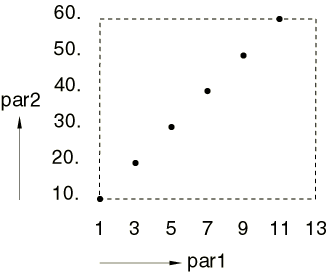
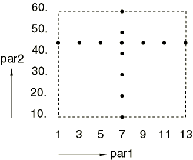

# 20.1.1 参数化研究脚本


**产品：** Abaqus/Standard  Abaqus/Explicit  

##### **参考文献**

- ["参数化输入，" 第 1.4.1 节](pt01ch01s04aus04.md)
- ["参数化形状变化，" 第 2.1.2 节](pt01ch02s01aus06.md)
- ["参数化研究，" 第 3.2.10 节](pt01ch03s02abx10.md)

### 概述

参数化研究允许您生成、执行和收集多个分析的結果，这些分析仅在用于代替输入量的某些参数值上有所不同。

参数化研究可以通过以下方式执行：
- 创建一个"模板"参数化输入文件，从中生成不同的参数化变体。
- 准备一个脚本（扩展名为 `.psf` 的文件），其中包含 Python（[Lutz, 1996](pt04ch20s01aus108.md#usb-ref-lutz2)）指令，用于生成、执行和收集参数化输入文件的参数化变体的输出。

本节讨论用于参数化研究脚本编写的 Python 命令。

### 简介

参数化研究需要执行多个分析，以提供有关结构或组件在设计空间中不同设计点的行为信息。这些分析的输入仅在分配给参数化关键字输入文件（以 `.inp` 扩展名标识）中参数的值上有所不同。

Abaqus 中的参数化研究需要一个用户开发的 Python 脚本（以 `.psf` 扩展名标识的文件），其中包含用于定义参数化研究的 Python 命令。例如，考虑一个您希望执行参数化研究的情况，其中壳的厚度是变化的。您需要创建一个参数化输入文件（在此示例中，名为 `shell.inp` 的文件），其中包含参数定义

```
[*PARAMETER](../key/key-link.md#usb-kws-mparameter)
thick1 = 5.
```
 和参数用法：
```
[*SHELL SECTION](../key/key-link.md#usb-kws-mshellsection),ELSET=*name*, MATERIAL=*name*
<thick1>
```
您可以通过开发一个 `.psf` 文件来创建参数化研究，该文件包含指定要分析的不同设计的 Python 指令，如下所示：
```
**thick = ParStudy**(**par**='thick1', **name**='shell')
**thick.define**(CONTINUOUS, **par**='thick1', **domain**=(10., 20.))
**thick.sample**(NUMBER, **par**='thick1', **number**=5)
**thick.combine**(MESH)
```
这些脚本命令创建五个设计，对应的截面厚度为 10.、12.5、15.、17.5 和 20.0。每个这些厚度将依次替换 `shell.inp` 中参数定义中指定的 5. 值。然后您可以在 `.psf` 文件中提供额外的 Python 脚本命令，指示 Abaqus 执行以下操作：
- 使用 `shell.inp` 文件作为模板，生成多个 `shell_*id*.inp` 文件和相应的 Abaqus 作业。（附加到输入文件名的标识符 *id* 对于参数化研究中的每个设计是唯一的。）此操作的 Python 命令示例为 ``` **thick.generate**(**template**='shell') ``` 在此示例中，`shell_*id*.inp` 文件仅在壳厚度使用的值上有所不同。
- 执行代表参数化研究不同变体的所有 Abaqus 作业。此操作的 Python 命令为 ``` **thick.execute**(ALL) ```

您通常希望查看参数化研究生成的大量数据中的某些关键结果。Abaqus 提供以下功能：
- 指定参数化研究结果来源的命令。例如： ``` **thick.output**(**file**=ODB, **step**=1, **inc**=LAST) ``` 上述命令将输出位置设置为输出数据库（`.odb`）文件第一步的最后一帧。默认行为是从结果（`.fil`）文件给定步骤的最后一帧收集结果。
- 从参数化研究生成的多个分析中收集所需结果并将其报告到文件或表格中的命令。例如，用于收集和报告每个设计中关键节点位移值的 Python 脚本命令序列为： ``` **thick.gather**(**results**='n33_u', **variable**='U', **node**=33, **step**=1) **thick.report**(PRINT, **par**='thick1', **results**=('n33_u.2')) ``` 上述命令收集结果记录 `'n33_u'`（分析第一步结束时节点 33 的位移向量）用于每个设计，然后打印所有设计的位移 U2 分量（结果记录的第二分量）的表格。
- 使用 Abaqus/CAE 的可视化模块可视化跨多个分析收集的 *X--Y* 绘图数据的能力。一个典型示例是获取关键节点位移值与壳厚度值的 *X--Y* 绘图。这是通过将适当的参数化研究结果收集到 ASCII 文件中来实现的，该文件可以读入可视化模块以显示绘图。

### 参数化研究的组织

Abaqus 中的参数化研究与定义设计空间的特定参数集相关联。在参数化研究中只能更改参数的值。如果您希望考虑一组不同的参数，则必须创建一个新的参数化研究。选择要纳入参数化研究的参数后，必须指定如何定义每个参数。参数的区别在于它们是连续的还是离散的，并且可以具有域和参考值。

设计空间中要分析的设计点是通过为每个参数指定样本值（采样）并组合参数样本以创建设计点集来创建的。提供了一些简单的命令用于参数值采样和组合采样参数值；这些命令将在后面详细描述。

在可以指定参数样本的任何组合之前，必须给出参数化研究中参数的初始定义和采样。在第一次组合之后，可以在指定下一次组合之前更改任何单个参数的初始定义和/或采样，从而在一个参数化研究中提供很大的灵活性。

参数定义中给出的参数的可能值域和参考值可以通过在采样期间不同地指定它们来临时重新定义。只要在采样期间指定了这些，您就不需要在参数定义中指定参数域和参考值。

可以对所有设计施加设计约束。违反任何约束的设计将被消除。

最后，在所有参数化研究变体都经过分析之后，您可以收集和报告跨参数化研究所有或部分设计的结果。

总之，Abaqus 中的参数化研究组织如下：
- 创建参数化研究。
- 定义参数：定义参数类型（连续或离散）以及可能的参数域和参考值。
- 采样参数：指定采样选项和数据，并可能临时重新定义参数域和参考值。
- 组合参数样本以创建设计集。
- 约束设计（可选）。
- 生成设计和分析作业数据。
- 执行所研究设计的选定设计的分析作业。
- 收集所研究设计的选定设计的关键结果。
- 报告收集的结果。

**注意：** 步骤序列——定义、采样和组合——可以根据需要重复多次，以创建所有所需的设计集。可以在一个输入文件中包含的模型上执行多个参数化研究。通常，会在输入文件中定义和使用更多参数来代替输入量，而不是任何特定参数化研究中涉及的参数。在这些情况下，未涉及特定参数化研究的参数将保留其在输入文件中定义的值用于该参数化研究的目的。因此，我们可以将输入文件中定义的参数值视为代表标称设计；参数化研究通过覆盖某些（或全部）参数的值来创建修改后的设计。

### 定义设计空间

设计空间由选择在研究中变化的参数以及参数类型和可能值的规定来定义。

#### 参数化研究创建

使用 ***aStudy*=ParStudy** 脚本命令（请参阅 ["创建参数化研究，" 第 20.2.8 节](pt04ch20s02asr08.md)）创建参数化研究并选择要考虑变化的独立参数。***aStudy*** 是您分配给该命令创建的参数化研究对象的 Python 变量名。参数化研究对象的方法用于执行参数化研究的所有操作。

| **输入文件用法：** | ``` ***aStudy*=ParStudy** (**par**=, **name**=, **verbose**=, **directory**=) ``` |
| --- | --- |

#### 参数定义

使用 ***aStudy*.define** 命令（请参阅 ["为参数化研究定义参数，" 第 20.2.3 节](pt04ch20s02asr03.md)）指定参数类型（选择 CONTINUOUS 或 DISCRETE 标记；标记是用于在特定命令中选择选项的符号常量），并可选地指定参数可能值的域和参数的参考值。如果在此命令中未指定域和/或参考值，则可以在参数采样中指定。

参数的重新定义被视为完全重新定义；也就是说，不会保留该参数先前定义的任何信息。

| **输入文件用法：** | ``` ***aStudy*.define** (*token*, **par**=, **domain**=, **reference**=) ``` |
| --- | --- |

##### CONTINUOUS 参数类型

在这种情况下，参数可以取连续域中由最小值和最大值指定的任何值；例如，**domain**=(3., 10.)。

##### DISCRETE 参数类型

在这种情况下，参数只能取定义离散域的列表中指定的值；例如，**domain**=(1, 4, 9, 16)。

### 采样和组合参数值以创建设计点集

在组合操作用于创建第一组设计点之前，必须对参数化研究中的每个参数进行采样。在执行后续组合操作之前，可以重新定义或重新采样参数化研究中的任何参数。

#### 参数采样

使用 ***aStudy*.sample** 命令（请参阅 ["为参数化研究采样参数，" 第 20.2.10 节](pt04ch20s02asr10.md)）并选择可用标记之一（INTERVAL、NUMBER、REFERENCE 或 VALUES）来选择如何进行采样。必须给出的采样数据取决于如何进行采样，如下所述。

##### 按 INTERVAL 采样

此采样命令假定您指定了参数可能值的域，并希望在该域中以固定间隔采样参数值。始终对参数的极值进行采样。采样的参数值数量取决于间隔和域。因为极值被采样，最后一个采样间隔通常小于您指定的间隔。

此采样命令中的域规范是可选的：
- 如果在此命令中指定了域，它会临时重新定义 **define** 命令中指定的域。
- 如果在此命令中未指定域，则使用 **define** 命令中的域规范进行采样。
- 当在此命令或 **define** 命令中都未指定域时，会标记错误。

采样间隔对连续参数和离散参数的解释不同：- 对于连续值参数，采样间隔的间距基于数值。例如，为具有 **domain**=(10., 35.) 的连续参数指定 **interval**=10. 将为该参数采样值 10.、20.、30. 和 35.
- 对于离散值参数，采样间隔的间距基于值列表的索引。索引意味着条目在列表中的位置，从位置 0 开始，继续位置 1、2、3 等。在这种情况下 **interval** 必须是整数。例如，为具有 **domain**=(1., 2., 3., 5., 7., 10.) 的离散参数指定 **interval**=2 将为该参数创建样本值 10.、5.、2. 和 1.

间隔可以具有正或负值（不允许零）。正间隔表示从连续参数的最小值或离散参数的值列表中的第一个值开始采样（正向采样）。负间隔表示从连续参数的最大值或离散参数的值列表中的最后一个值开始采样（反向采样）。当使用 TUPLE 组合操作时，反向采样很有用（请参阅参数样本组合的讨论）。

INTERVAL 选项的两个特殊情况值得注意：
- 大于连续参数值范围或离散参数值数量的正间隔值将采样连续参数的最小值和最大值，或离散参数列表中的第一个和最后一个值。
- 大于连续参数值范围或离散参数值数量（绝对值）的负间隔值将采样连续参数的最大值和最小值，或离散参数列表中的最后一个和第一个值。

| **输入文件用法：** | ``` ***aStudy*.sample** (INTERVAL, **par**=, **interval**=, **domain**=) ``` |
| --- | --- |

##### 按 NUMBER 采样

此采样选项假定您指定了参数可能值的域，并希望在该域中采样固定数量的参数值。除下面记录的特殊情况外，始终对参数的极值进行采样。参数以相等间隔采样（离散参数有一些例外，如下所述），间隔大小取决于采样的值数量以及域。

此采样命令中的域规范是可选的：
- 如果在此命令中指定了域，它会临时重新定义 **define** 命令中指定的域。
- 如果在此命令中未指定域，则使用 **define** 命令中的域规范进行采样。
- 当在此命令或 **define** 命令中都未指定域时，会标记错误。

采样间隔对连续参数和离散参数的计算和解释不同：- 对于连续值参数，采样间隔的间距基于数值。例如，为具有 **domain**=(10., 25.) 的连续参数指定 **number**=4 将为该参数采样值 10.、15.、20. 和 25.
- 对于离散值参数，采样间隔的间距基于值列表的索引（索引从零开始）。例如，为具有 **domain**=(1., 2., 3., 5., 7., 10., 12.) 的离散参数指定 **number**=3 将为该参数创建样本值 1.、5. 和 12。您指定的离散参数样本数量可能不允许等间隔采样；例如，为上述离散参数指定 **number**=5 或 **number**=6 不允许等间隔采样。通过将采样索引四舍五入到列表中最接近的索引来解决这个问题。例如，为上述离散参数指定 **number**=5 将创建样本值 1.、3.、5.、10. 和 12。采样值 1. 和 12. 是因为它们是极值。第二个采样值为列表中第三个值（值 3.）的解释如下：采样间隔 =（最高索引 - 最低索引）/（**number** - 1）= (6 - 0)/(5 - 1) = 1.5；然后第二个采样值应该是索引 = 0 + 1.5 = 1.5 的值；由于索引必须是整数，我们四舍五入到索引 = 2，从而采样列表中的第三个值。可以类似地解释其他采样值。相同的规则适用于字符串类型离散参数。例如，为具有 **domain**=('C3D8', 'C3D8R', 'C3D8I', 'C3D8H') 的离散参数指定 **number**=3 将创建样本值 'C3D8'、'C3D8I' 和 'C3D8H'。

NUMBER 选项的三个特殊情况值得注意：
- 指定 **number**=1 将采样参数的中间值，当感兴趣的是设计空间中心时很有用。这是 NUMBER 选项不采样参数极值的唯一情况。
- 指定 **number**=2 将采样参数的极值，当感兴趣的是设计空间边界时很有用。
- 指定 **number**=3 将采样参数的中间值和极值，当感兴趣的是设计空间的中心和边界时很有用。

不允许指定 **number**=0。允许 **number** 为负值；这表示采样按相反顺序进行。对于连续参数，反向顺序意味着第一个采样值最大，最后一个采样值最小。对于离散参数，反向顺序意味着第一个采样值是列表中的最后一个，最后一个采样值是列表中的第一个。当使用 TUPLE 组合操作时，反向采样很有用（请参阅参数样本组合的讨论）。

| **输入文件用法：** | ``` ***aStudy*.sample** (NUMBER, **par**=, **number**=, **domain**=) ``` |
| --- | --- |

##### 按 REFERENCE 采样

此采样选项允许您为参数指定参考值，并相对于此参考值采样参数值。这对于研究与现有（参考）设计不同的替代设计很有用。

此采样命令在与参考值对称的位置以给定间隔的倍数创建样本值；此外，参考值也被采样。样本中的参数值数量取决于您指定的对称对数量。

此采样选项中的参考值规范是可选的：
- 如果在此命令中指定了参考值，它会临时重新定义 **define** 命令中指定的参考。
- 如果在此命令中未指定参考值，则使用 **define** 命令中的参考规范进行采样。
- 当在此命令或 **define** 命令中都未指定参考值时，会标记错误。

参考值对连续参数和离散参数的解释不同：- 对于连续值参数，**reference** 是要创建对称样本的参数的数值。
- 对于离散值参数，**reference** 是要创建对称样本的值列表的索引。

超出参数域定义的参考值会标记为错误。

采样间隔对连续参数和离散参数的解释不同：
- 对于连续值参数，采样间隔的间距基于数值。例如，为连续参数指定 **reference**=50.、**interval**=10. 和 **numSymPairs**=2 将为该参数创建样本值 30.、40.、50.、60. 和 70.
- 对于离散值参数，采样间隔的间距基于值列表的索引（索引从零开始）；在这种情况下 **interval** 必须是整数值。例如，为具有 **domain**=[1, 2, 3, 5, 7, 10, 12, 15, 20, 25] 的离散参数指定 **reference**=5、**interval**=2 和 **numSymPairs**=2 将为该参数创建样本值 25、15、10、5 和 2。

指定的 **interval** 可以为正或负，但不允许为零。正间隔表示采样值列表从连续参数的最小采样值开始，或从离散参数的值列表中最接近开头的采样值开始（正向采样）。负间隔表示采样值列表从连续参数的最大采样值开始，或从离散参数的值列表中最接近结尾的采样值开始（反向采样）。当使用 TUPLE 组合操作时，反向采样很有用（请参阅参数样本组合的讨论）。

您指定的symmetrical pairs数量必须为零或正整数；将symmetrical pairs数量设置为零表示只采样参考值。

此命令中的域规范是可选的：
- 如果在此命令中指定了域，它会临时重新定义 **define** 命令中指定的域。
- 如果在此命令中未指定域，则使用 **define** 命令中的域规范进行采样。
- 对于离散值参数，当在此命令或 **define** 命令中都未指定域时，会标记错误。

离散值参数需要域规范（在此命令中或 **define** 命令中），因为必须知道可以采样的可能离散值。虽然对于连续值参数不需要域规范，但可以给出。对于离散参数或连续参数，域规范可用于限制使用 REFERENCE 选项采样的值数量，因为域被视为可能采样值的界限。例如，为具有 **domain**=(35., 100.) 的连续参数指定 **reference**=50.、**interval**=10. 和 **numSymPairs**=3 将为该参数采样值 40.、50.、60.、70. 和 80.。域的最小值在此采样中作为界限。

| **输入文件用法：** | ``` ***aStudy*.sample** (REFERENCE, **par**=, **reference**=, **interval**=, **numSymPairs**=, **domain**=) ``` |
| --- | --- |

##### 按 VALUES 采样

此采样选项假定您希望直接创建参数样本值。无论参数是连续还是离散的，您都必须指定实际的参数值。

**define** 命令中指定的参数域在使用此选项时不会影响为参数采样的值。

| **输入文件用法：** | ``` ***aStudy*.sample** (VALUES, **par**=, **values**=) ``` |
| --- | --- |

#### 参数样本的组合

使用 ***aStudy*.combine** 命令（请参阅 ["为参数化研究组合参数样本，" 第 20.2.1 节](pt04ch20s02asr01.md)）从参数样本创建设计点集。使用以下标记之一选择如何进行组合：MESH、TUPLE 或 CROSS。每个组合命令的使用都会导致创建多个设计点，这些点被分组为设计集。如果组合操作创建的设计与现有设计集中的设计重复，则立即删除重复设计。参数化研究中的设计总数（在应用任何设计约束之前）是每个设计集中设计数量的总和。

您可以为设计集命名；如果不命名，则默认命名。默认命名约定是：参数化研究中第一个非用户命名的设计集为 *p1*，第二个为 *p2*，依此类推。设计集名称用于帮助识别各个设计。如果您使用与先前指定的设计集名称相同的名称命名设计集，则表示这是设计集的重新指定，从而覆盖先前存在的那个。

| **输入文件用法：** | ``` ***aStudy*.combine** (*token*, **name**=) ``` |
| --- | --- |

##### MESH 组合

此组合选项表示要将参数的所有采样值与参数化研究中每个其他参数的所有采样值组合。

以下示例说明了 MESH 组合选项的用法。在具有如下定义和采样的参数的两参数研究中

```
**study=ParStudy**(**par**=('par1', 'par2'))
**study.define**(DISCRETE, **par**='par1',
    **domain**=(1, 3, 5, 7, 9, 11, 13))
**study.sample**(REFERENCE, **par**='par1', **reference**=0,
    **interval**=2, **numSymPairs**=2)
**study.define**(CONTINUOUS, **par**='par2', **domain**=(10., 60.))
**study.sample**(INTERVAL, **par**='par2', **interval**=20.)
```
 组合命令
```
**study.combine**(MESH, **name**='dSet1')
```
 创建以下 12 个设计点（`par1`, `par2`）：(1, 10.)、(5, 10.)、(9, 10.)、(1, 30.)、(5, 30.)、(9, 30.)、(1, 50.)、(5, 50.)、(9, 50.)、(1, 60.)、(5, 60.) 和 (9, 60.)（请参阅 [图 20.1.1--1](pt04ch20s01aus108.md#iparstudies-mesh1)）。

**图 20.1.1–1** 使用 combine 命令的 MESH 选项在设计集 `dSet1` 中创建的设计点。


 在重新指定参数采样之后第二次使用 combine 命令

```
**study.sample**(NUMBER, **par**='par1', **number**=3)
**study.sample**(NUMBER, **par**='par2', **number**=3)
**study.combine**(MESH, **name**='dSet2')
```
 在以下九个点创建设计：(1, 10.)、(7, 10.)、(13, 10.)、(1, 35.)、(7, 35.)、(13, 35.)、(1, 60.)、(7, 60.) 和 (13, 60.)（请参阅 [图 20.1.1--2](pt04ch20s01aus108.md#iparstudies-mesh2)）。两个参数的极值和中间值被组合。

**图 20.1.1–2** 重新定义参数采样后，使用 combine 命令的 MESH 选项在设计集 `dSet2` 中创建的设计点。


##### TUPLE 组合

此组合选项创建由采样参数值的 *n* 元组组成的设计集，其中 *n* 是参数化研究中的参数数量。每个 *n* 元组由每个参数的一个采样值组成。例如，在三参数研究中，三个参数的第一个采样值组成第一个 3 元组，三个参数的第二个采样值组成第二个 3 元组，依此类推。当任何参数样本用完采样值时，元组的创建停止。

以下示例说明了 TUPLE 组合操作的用法。对于具有如下定义和采样的参数的两参数研究

```
**study=ParStudy**(**par**=('par1', 'par2'))
**study.define**(DISCRETE, **par**='par1',
    **domain**=(1, 3, 5, 7, 9, 11, 13))
**study.define**(CONTINUOUS, **par**='par2', **domain**=(10., 60.))
**study.sample**(INTERVAL, **par**='par1', **interval**=1)
**study.sample**(INTERVAL, **par**='par2', **interval**=10.)
```
 组合操作
```
**study.combine**(TUPLE, **name**='dSet3')
```
 在以下 6 个点创建设计：(1, 10.)、(3, 20.)、(5, 30.)、(7, 40.)、(9, 50.) 和 (11, 60.)（请参阅 [图 20.1.1--3](pt04ch20s01aus108.md#iparstudies-tuple1)）。这表示两参数空间中的对角线模式。我们看到所有 `par2` 值都用于元组组合，但最后一个 `par1` 值未使用，因为没有更多的 `par2` 样本值来形成额外的元组。

**图 20.1.1–3** 使用 combine 命令的 TUPLE 选项在设计集 `dSet3` 中创建的设计点。



 在重新指定 `par2` 采样后第二次调用上述 combine 命令

```
**study.sample**(INTERVAL, **par**='par2', **interval**=-10.)
**study.combine**(TUPLE, **name**='dSet4')
```
 在以下 6 个点创建设计：(1, 60.)、(3, 50.)、(5, 40.)、(7, 30.)、(9, 20.) 和 (11, 10.)（请参阅 [图 20.1.1--4](pt04ch20s01aus108.md#iparstudies-tuple2)）。这表示两参数空间中的另一条对角线。

**图 20.1.1–4** 重新定义参数采样后，使用 combine 命令的 TUPLE 选项在设计集 `dSet4` 中创建的设计点。


##### CROSS 组合

此组合选项创建"十字形"形式的设计，如下所示：将为单个参数采样的每个值与参数化研究中所有其他参数的 **define** 命令中指定的参考值组合。要使用 CROSS 组合选项，必须为参数化研究中的所有参数在 **define** 命令中指定参考值。

**define** 命令中为参数指定的参考值不必与该参数采样规则采样的值一致。但是，如果参考值与采样值不一致，则参考参数值不会添加到该参数的采样值列表中；它仅用于形成 CROSS 组合。

以下示例说明了 CROSS 组合选项的用法。对于具有如下定义和采样的参数的两参数研究

```
**study=ParStudy**(**par**=('par1', 'par2'))
**study.define**(DISCRETE, **par**='par1',
    **domain**=(1, 3, 5, 7, 9, 11, 13), reference=3)
**study.define**(CONTINUOUS, **par**='par2',
    **domain**=(10., 60.), reference=40.)
**study.sample**(REFERENCE, **par**='par1', **interval**=1,
    **numSymPairs**=3)
**study.sample**(INTERVAL, **par**='par2', **interval**=10.)
```
 组合交叉选项
```
**study.combine**(CROSS, name='dSet5')
```
 在以下 12 个点创建设计：(1, 40.)、(3, 40.)、(5, 40.)、(7, 40.)、(9, 40.)、(11, 40.)、(13, 40.)、(7, 10.)、(7, 20.)、(7, 30.)、(7, 50.) 和 (7, 60.)（请参阅 [图 20.1.1--5](pt04ch20s01aus108.md#iparstudies-cross1)）。此组合是十字形模式，其中十字交叉点在 (7, 40.) [7 是离散参数 `par1` 的第四个值（**reference**=3）]。

**图 20.1.1–5** 使用 combine 命令的 CROSS 选项在设计集 `dSet5` 中创建的设计点。


 在重新定义 `par2` 后第二次调用上述 combine 命令

```
**study.define**(CONTINUOUS, **par**='par2', **domain**=(10., 60.),
    **reference**=45.)
**study.combine**(CROSS, **name**='dSet6')
```
 在以下 13 个设计点创建设计：(1, 45.)、(3, 45.)、(5, 45.)、(7, 45.)、(9, 45.)、(11, 45.)、(13, 45.)、(7, 10.)、(7, 20.)、(7, 30.)、(7, 40.)、(7, 50.) 和 (7, 60.)（请参阅 [图 20.1.1--6](pt04ch20s01aus108.md#iparstudies-cross2)）。

#### 约束设计

可以使用 ***aStudy*.constrain** 脚本命令（请参阅 ["在参数化研究中约束参数值组合，" 第 20.2.2 节](pt04ch20s02asr02.md)）指定确定参数化研究中允许的设计点的约束。指定此类约束后，立即消除违反约束的现有设计。

例如，约束命令

```
**aStudy.constrain**('height*width < 12.')
```
 其中 `height` 和 `width` 是参数化研究中的参数，可用于强制所有设计中的矩形梁横截面积小于 12.0。

| **输入文件用法：** | ``` ***aStudy*.constrain** ('*constraint expression*') ``` |
| --- | --- |

**图 20.1.1–6** 当参数 `par2` 被重新定义时，使用 combine 命令的 CROSS 选项在设计集 `dSet6` 中创建的设计点。



### 参数化研究设计的生成和执行

一旦指定了所需的设计点，就有必要生成相应的分析作业数据并执行分析。

#### 生成分析作业数据

使用 ***aStudy*.generate** 脚本命令（请参阅 ["生成参数化研究的分析作业数据，" 第 20.2.6 节](pt04ch20s02asr06.md)）为每个设计生成输入文件。

必须指定参数化模板输入文件的名称，从中生成每个设计的输入文件。

参数化研究生成的输入文件的命名约定如下：
- 每个分析作业的名称将以模板输入文件名称开头；例如，`shell`。
- 参数化研究名称（您在 **ParStudy** 命令中使用 **name=** 选项指定的）被附加，前面加下划线 (_)；例如，对于使用 `study = ParStudy(name='thickness')` 命令定义的参数化研究，为 `shell_thickness`。（如果未给出参数化研究名称，则参数化研究名称默认为定义该研究的 Python 脚本文件的名称。）如果模板输入文件名称和参数化研究名称相同，则不会重复该名称。
- 设计集名称（在 **combine** 命令中指定或默认创建的）被附加，前面加下划线 (_)；例如，`shell_thickness_p1` 表示上述参数化研究的第一个设计集（默认命名）。
- 设计名称（在 **combine** 命令中自动创建的）被附加，前面加下划线 (_)；例如，`shell_thickness_p1_c1` 表示上述参数化研究第一个设计集中的第一个设计。

通常，输入文件每个都有 `.inp` 扩展名。您可以在执行之前检查和/或编辑这些输入文件。

**generate** 命令创建一个带有 `.var` 扩展名的文件，其中包含参数化研究的描述。此文件被赋予参数化研究名称——例如，`*studyName*.var`——并包含所有生成的设计及其关联的每个设计的参数值的列表。您可以检查和/或编辑此文件；但是，编辑此文件将影响跨参数化研究设计收集结果（请参阅"收集结果"）。

每次使用 **generate** 命令时，都会创建新版本的 `*studyName*.var` 文件，反映所有先前 **combine** 命令指定的设计。

generate 命令执行之前执行 define、sample 和 combine 步骤。因此，您可能引用模板输入文件中不存在或不是独立参数的参数。这些错误由 **generate** 命令检测和标记。

| **输入文件用法：** | ``` ***aStudy*.generate** (**template**) ``` |
| --- | --- |

#### 执行参数化研究设计的分析

使用 ***aStudy*.execute** 命令（请参阅 ["执行参数化研究设计的分析，" 第 20.2.4 节](pt04ch20s02asr04.md)）执行研究设计的分析。

该命令将在 Python 进程的控制下提交多个分析作业以执行。通过指定此命令的 ALL 或 DISTRIBUTED 选项，可以评估所有设计而无需进一步的用户交互，或者您可以通过指定 INTERACTIVE 选项以交互方式控制分析的执行。在交互情况下，系统会提示您进一步执行指令。提示允许您：
- 指定在进程暂停并再次提示您之前要执行的若干分析。
- 执行剩余的分析而不需要进一步的用户交互。
- 指定在进程暂停并再次提示您之前要跳过的若干分析的执行。
- 停止执行。

交互选项很有用，因为它提供了以下机会：
- 研究已执行分析的结果。
- 删除分析生成的不必要文件，以在分析许多设计时节省磁盘空间。
- 仅分析参数化研究的某些设计。

ALL 和 INTERACTIVE 标记用于在您的机器上顺序执行 Abaqus 分析。DISTRIBUTED 标记可用于在多台机器或一台机器的多个 CPU 上调度分析作业。

DISTRIBUTED 选项仅在 UNIX 操作系统变体上可用。特别是，其实现依赖于操作系统对 `rsh`、`rcp` 和 `xhost` UNIX 命令的支持。由于使用这些命令，对于参数化研究的分布式执行，参数化研究本身必须在您的本地计算机上执行。如果在分析期间输出二进制结果，则本地和远程计算机必须二进制兼容。在使用分布式执行功能之前，需要在 Abaqus 环境文件中配置适当的队列接口。

当您发出 **execute** 命令时，默认情况下，每个参数化研究设计的分析都由 Abaqus 在后台模式下执行，与使用的命令选项无关。Abaqus 分析每个设计创建的文件将覆盖任何同名现有文件，而不会提示您。

您可以使用 **execOptions** 选项为每个分析的执行命令添加任何必要的 Abaqus 执行选项（请参阅 ["Abaqus/Standard、Abaqus/Explicit 和 Abaqus/CFD 执行，" 第 3.2.2 节](pt01ch03s02abx02.md)）。

| **输入文件用法：** | ``` ***aStudy*.execute** (*token*, **files**= , **queues**= , **execOptions**= ) ``` |
| --- | --- |

### 参数化研究结果

一旦执行了与参数化研究关联的分析，就可以检查跨不同设计的关键结果的变化。首先，必须从每个分析的结果文件或输出数据库中收集结果；然后，必须报告这些结果。

***aStudy*.output** 命令（请参阅 ["指定参数化研究结果的来源，" 第 20.2.7 节](pt04ch20s02asr07.md)）可用于指定要收集的结果的来源。***aStudy*.output** 命令的所有参数都是可选的：要收集结果的文件的规范、分析步骤，以及增量（非频率步骤）或模式（频率步骤）的规范。如果未指定文件，则将使用结果（`.fil`）文件。如果未指定步骤，则必须在 **gather** 命令中指定（请参阅下面的讨论）。增量（非频率步骤）或模式（频率步骤）的默认值是步骤的最后一个增量以及在步骤中计算的第一个模式，除非在 **gather** 命令中指定。某些参数仅适用于输出（`.odb`）数据库：实例名称、请求类型（场或历史）、要收集结果的帧值，以及在访问不同输出数据库时是否应覆盖用于访问输出数据库的内存。

收集结果的来源规范在所有后续 **gather** 命令中保持有效，直到重新指定来源。收集来源的重新指定被视为完全重新指定；也就是说，不会保留先前收集来源规范的任何信息。

| **输入文件用法：** | ``` ***aStudy*.output** (**file**=, **instance**=, **overlay**=, **request**=, **step**=, **frameValue**= | **inc**= | **mode**=) ``` |
| --- | --- | --- | --- |

#### 收集结果

使用 ***aStudy*.gather** 命令（请参阅 ["收集参数化研究的结果，" 第 20.2.5 节](pt04ch20s02asr05.md)）从每个分析的结果文件或输出数据库中收集结果。

在每次使用 **gather** 命令时，必须指定与收集的结果记录关联的名称。此标签用于在 **report** 命令中引用结果记录。

从结果（`.fil`）文件收集结果时，必须通过指定 ["Abaqus/Standard 输出变量标识符，" 第 4.2.1 节](pt02ch04s02abv01.md) 或 ["Abaqus/Explicit 输出变量标识符，" 第 4.2.2 节](pt02ch04s02xbv01.md) 中 `.fil` 列标题下显示的可用输出变量标识符密钥之一来选择要收集的每个结果记录。例如，可以指定 U 或 S 变量标识符密钥，但不能指定 U1 或 S11 变量标识符密钥。此外，可以指定 MODAL 变量标识符密钥来收集特征值结果记录（那些用记录密钥 1980 写入结果文件的）；在这种情况下，不需要变量位置数据。

从输出（`.odb`）数据库收集结果时，必须通过指定 ["Abaqus/Standard 输出变量标识符，" 第 4.2.1 节](pt02ch04s02abv01.md) 或 ["Abaqus/Explicit 输出变量标识符，" 第 4.2.2 节](pt02ch04s02xbv01.md) 中 `.odb` 列标题下显示的可用输出变量标识符密钥之一来选择要收集的每个结果记录。对于场输出，不得指定分量，而对于历史输出，需要分量编号；例如，可以为场输出指定 U 或 S 变量标识符密钥，而可以为历史输出指定 U1 或 S11 变量标识符密钥。除非输出在装配级别，否则必须将实例名称作为参数提供给 **gather** 命令。一个例外情况是输出（`.odb`）数据库是从未定义为部件实例装配的模型生成的，这从输出数据库中存在名为 Assembly-1 的单个装配和名为 PART-1-1 的单个部件实例推断出来。在这种情况下，您不必明确引用实例 PART-1-1。

结果记录的分量名称是自动创建的。例如，命令

```
**myStudy.gather**(**results**='e52_stress', **variable**='S', **element**=52)
```
 创建一个结果记录 `e52_stress`，其六个分量（三维实体单元的情况下）命名为：`e52_stress.1`（S11 应力分量）、`e52_stress.2`（S22 应力分量）、`e52_stress.3`（S33 应力分量）、`e52_stress.4`（S12 应力分量）、`e52_stress.5`（S13 应力分量）和 `e52_stress.6`（S23 应力分量）。

必须给出的变量位置数据取决于指定的输出变量标识符密钥。（有关位置数据的说明，请参阅 ["收集参数化研究的结果，" 第 20.2.5 节](pt04ch20s02asr05.md)。）必须给出足够的变量位置数据以定义唯一的结果记录。

| **输入文件用法：** | ``` ***aStudy*.gather** (**request**=, **results**=, **step**=, **frameValue**= | **inc**= | **mode**=, **variable**=, *additional location data*) ``` |
| --- | --- | --- | --- |

#### 报告结果

使用 ***aStudy*.report** 脚本命令（请参阅 ["报告参数化研究结果，" 第 20.2.9 节](pt04ch20s02asr09.md)）来报告从参数化研究的结果文件中收集的结果。使用 PRINT、FILE 或 XYPLOT 选项指定要产生的报告类型：
- PRINT 表示将结果表格（带标题）打印到默认输出设备（屏幕）。您可能希望限制表格中的列数，以使表格可读。
- FILE 表示将结果表格（带标题）写入 ASCII 文件。
- XYPLOT 表示将结果表格（不带标题）写入 ASCII 文件，该文件可以稍后读入 Abaqus/CAE 的可视化模块以显示 *X--Y* 绘图。

表格中的每一行代表参数化研究中的一个设计。表格中的列可以表示参数的值、收集的结果的值或设计名称。

可以在 **report** 命令中指定一个或多个参数。如果未指定参数，默认为参数化研究中的所有参数都包含在表格中。与每个参数对应的列显示包含在表格中的每个设计中该参数的值。

可以指定设计集名称以将表格中的行限制为该集合的一部分的设计（请参阅前面描述的 **combine** 命令）。如果未指定设计集，默认为表格中包含所有设计。

使用 **variations**=ON 指定表格的第一列必须显示设计名称。如果未指定 **variations**=ON 或包含 **variations**=OFF，则表格中不包含设计名称列。

必须将结果名称指定为序列；例如，单元 33 的 Mises 应力、单元 52 的 S22 应力和节点 10 的 U3 位移在以下三个单独的命令中收集：

```
**myStudy.gather**(**results**='e33_sinv', **variable**='SINV', **element**=33)
**myStudy.gather**(**results**='e52_s', **variable**='S', **element**=52)
**myStudy.gather**(**results**='n10_u', **variable**='U', **node**=10)
```
 可以使用以下 **report** 命令在单个表格中打印这些结果：
```
**myStudy.report**(PRINT,
    **results**=('e33_sinv.1', 'e52_s.2', 'n10_u.3'))
```
 此示例不仅显示如何将不同类型（单元、节点等）的收集结果收集在单个表格中，还显示如何引用结果记录的分量（Mises 应力是 SINV 的第一个分量，S22 是 S 的第二个分量，U3 是 U 的第三个分量——请参阅 ["结果文件输出格式，" 第 5.1.2 节](pt02ch05s01afi01.md) 或 [Abaqus 脚本用户指南](../cmd/cmd-link.md#cmd)，了解结果如何分别存储在结果文件和输出数据库中）。

当使用 FILE 或 XYPLOT 标记时，必须给出文件名以指定要写入结果的文件。在同一会话中发出使用相同文件名的后续 **report** 命令会将新结果追加到文件。但是，在不同会话中发出使用相同文件名的后续 **report** 命令会覆盖现有文件。

| **输入文件用法：** | ``` ***aStudy*.report** (*token*, **results**=, **par**=, **designSet**=, **variations**=, **file**=) ``` |
| --- | --- |

### 参数化研究的执行

要执行参数化研究，必须准备参数化输入文件（`*inputFile*.inp`）。此输入文件是用于生成研究参数化变体的模板，必须包含使用参数代替输入量所需的参数定义。参数必须在模板文件中定义；它们不能在模板文件引用的任何 include 文件中定义。

此外，必须准备一个 Python 脚本文件 `*scriptFile*.psf`，其中包含用于参数化研究操作的脚本指令。

通常，您使用编辑器准备 Python 脚本文件，然后使用 Abaqus 执行命令 **abaqus** **script**=*scriptFile* 调用此文件的执行。此命令启动 Python 解释器并执行脚本文件中的指令。或者，您可以简单地启动 Python 解释器，不提供脚本文件，使用 Abaqus 执行命令 **abaqus** **script**。在这种情况下，Python 解释器保持活动状态，您可以交互方式执行其他命令或执行包含在文件中的其他命令（例如 *fileName*），使用 Python 命令 **execfile('*fileName*')**。在 UNIX 机器上可以使用 **[Ctrl]**+**d** 终止 Python 解释器，在 Windows 机器上可以使用 **[Ctrl]**+**z**。

通常最好执行先前准备的脚本文件，因为您可能希望迭代开发脚本；在这种情况下，您只需返回并编辑脚本文件并重新执行，直到对结果满意为止。

您可以使用常规操作系统命令监视参数化变体分析的进度。

#### 在多个会话中执行

在执行研究的参数化变体之后，您可能希望多次收集和报告结果。可以在一个会话中定义、生成和执行参数化研究，并在单独的会话中收集和报告结果。当您开始新会话时，只需要重新发出用于创建参数化研究的命令。

### 参数化研究结果的可视化

特定参数化研究变体分析的结果可以像单个分析的任何其他结果一样进行可视化。

跨参数化研究设计收集的结果的可视化需要收集结果。对于可视化，必须将结果报告到 ASCII 文件（使用 **gather** 命令中的 XYPLOT 选项），这些文件可以由 Abaqus/CAE 的可视化模块读取，以产生结果相对于参数值或设计名称的 *X–Y* 绘图。

### 脚本命令

参数化研究使用 Python 语言（[Lutz, 1996](pt04ch20s01aus108.md#usb-ref-lutz2)）在扩展名为 `.psf` 的文件中进行脚本编写。提供了一个从 **ParStudy** 类构造的参数化研究对象，其方法使参数化研究的脚本编写变得简单；这些方法在本章中描述。

### 脚本命令语法

脚本命令通常具有以下形式：

```
***aStudy*.*method*** (*token*, *data*)
```
***aStudy*** 是方法适用的参数化研究对象；此对象是使用参数化研究构造函数命令构造的。***method*** 是要使用的方法；例如，**define**、**sample** 或 **execute**。

大多数（但不是全部）命令有一个 *token*，用于选择命令的选项；例如，***aStudy*.define (CONTINUOUS, par= )** 表示正在为参数化研究定义一个或多个连续参数。标记始终以大写字母给出，它们是互斥的。

对于大多数（但不是全部）命令，必须指定额外的 *data*。

### Python 语言规则

脚本文件中的参数化研究脚本必须遵循 Python 语言的语法和语义。这里描述了该语言的一些重要方面（更一般的 Python 语言规则在 ["参数化输入，" 第 1.4.1 节](pt01ch01s04aus04.md)中讨论）。

#### 注释

注释必须以 # 符号为前缀。注释被认为一直延续到行尾。例如，

```
#
# This parametric study ...
#
studyTempEffects.generate(template='shell') #use shell input file
```

#### 大小写敏感性

所有变量和方法名称、标记和字符串字面量在所有操作系统上都区分大小写。例如，

```
study.execute( ) # is valid
study.Execute( ) # is not valid because of the capital E
```

```
study.sample(NUMBER, ...) # uses the valid token NUMBER
study.sample(number, ...) # lower case token is not valid
```

```
study.generate(template='aFile') # 'aFile' is different
study.generate(template='afile') # from 'afile'
```

#### 字符串

字符串通过使用成对的单引号（' '）或双引号（" "）来表示。不能使用反向单引号（` `）来实现此目的。例如，

```
"double quoted string"
'single quoted string'
```

#### 打印

Python **print** 命令可用于获取任何 Python 对象的打印表示。例如，

```
print 'MY TEXT'
```
 将在标准输出设备上打印 `MY TEXT`。

#### 列表和元组

参数化研究的脚本方法接受整数、实数和字符串类型。这些原始类型在许多情况下可以可选地包含在元组或列表结构中。尽管列表和元组在 Python 中有一些差异，但它们可以在参数化研究脚本命令中互换使用；它们只是表示有序的 item 序列。列表或元组中的 item 必须用逗号分隔，并用括号或方括号括起来。例如，

```
aStudy.define(CONTINUOUS, par=('xCoord',))# tuple contains a
                                          # single string item
aStudy.define(CONTINUOUS, par=['xCoord']) # list contains a
                                          # single string item
aStudy.define(CONTINUOUS, par=('xCoord', 'yCoord')) # tuple
aStudy.define(CONTINUOUS, par=['xCoord', 'yCoord']) # list
```

#### 缩进

Python 使用缩进来分组语句块。因此，Python 语句应该与前一条语句位于同一列，除非 Python 需要语句分组。

### 访问参数化研究的数据

在某些情况下，直接以编程方式访问参数化研究的数据是必要的。因此，研究的所有重要数据都存储在存储库中，可以作为参数化研究对象的数据成员访问。存储库具有与 Python 字典类似的接口和行为。存储库数据存储为键值对；并提供了用于访问存储库键和值的方法。语法 `*aValue = aRepository[aKey]*` 用于检索与存储库键关联的值。使用存储库的 **keys()** 方法获取存储库的键列表；例如，`*allKeys = aRepository*.keys()`。类似地，使用存储库的 **values()** 方法获取存储库的值列表；例如，`*allValues = aRepository*.values()`。以下参数化研究脚本显示了一个示例，说明如何访问参数化研究的参数存储库以及如何获取参数 `t1` 的参数名称列表和样本值列表：

```
studyTempEffect = ParStudy(par=('t1', 't2'))
studyTempEffect.define(CONTINUOUS, par=('t1', 't2'))
studyTempEffect.sample(VALUES, par='t1', values=(200.,300.,400.))
studyTempEffect.sample(VALUES, par='t2', values=(250.,350.,450.))
parRepository = studyTempEffect.parameter
listOfParameters = parRepository.keys()
t1Sample = parRepository['t1'].sample
```
 该脚本产生以下赋值：`listOfParameters = ['t1', 't2']` 和 `t1Sample = [200.0, 300.0, 400.0]`。Python **print** 命令可用于获取存储库内容的信息。

#### 参数化研究存储库

参数化研究具有以下作为数据成员的存储库和对象：
- ***aStudy*.parameter**：按参数名称键控的参数对象存储库。每个参数对象具有 **name**、**type**、**domain**、**reference** 和 **sample** 数据成员。
- ***aStudy*.designSet**：按设计集名称键控的设计集存储库。每个设计集表示为设计点列表。
- ***aStudy*.job**：按相应分析输入文件名称（不带 `.inp` 扩展名）键控的分析作业对象存储库。每个作业对象具有 **design**、**status**、**root**、**designSet** 和 **designName** 数据成员。
- ***aStudy*.resultData**：结果记录存储库，键是由结果名称、下划线字符 (_) 和设计名称依次附加构造的名称。对于从结果（`.fil`）文件检索的结果，每个结果记录采用相应输出变量的结果（`.fil`）文件记录格式。对于从输出（`.odb`）数据库检索的场结果，每个结果记录将是包含结果分量的元组。从输出（`.odb`）数据库检索的历史结果只能检索单个分量，结果记录将是包含单个值的元组。
- ***aStudy*.table**：表对象，包含由上次使用 **report** 命令格式化的表格表示。表对象具有 **title**、**variation**、**designs** 和 **results** 数据成员。

#### 其他参考文献

- Lutz, M., *Programming Python, *O'Reilly & Associates, Inc., 1996.


