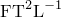

# 21.2.1 密度

**产品：** Abaqus/Standard  Abaqus/Explicit  Abaqus/CFD  Abaqus/CAE  

**参考**

- ["材料库概述，" 第21.1.1节](pt05ch21s01abo18.md)
- [*DENSITY*](../key/key-link.md#usb-kws-mdensity)
- ["指定材料质量密度，" Abaqus/CAE用户指南第12.8.1节](../usi/usi-link.md#usi-prp-general-density)

### 概述

材料的质量密度：
- 在Abaqus/Standard中必须为特征频率和瞬态动力学分析、瞬态热传导分析、绝热应力分析和声学分析定义；
- 在Abaqus/Standard中必须为重力、离心力和旋转加速度载荷定义；
- 在Abaqus/Explicit中必须为除静水压力流体外的所有材料定义；
- 在Abaqus/CFD中必须为所有流体定义；
- 可以指定为温度和预定义变量的函数；
- 可以从非结构特征（如汽车金属板上的油漆）分布到底层单元的非结构质量定义；以及
- 可以在Abaqus/Standard中为实体连续体单元使用分布定义。

### 定义密度

密度可以定义为温度和场变量的函数。但是，对于Abaqus/Standard中除声学、热传导、耦合温度-位移和耦合热电单元外的所有单元，密度是初始温度和场变量的函数，仅随体积变化。在分析过程中，如果温度和场变量发生变化，密度不会更新。对于Abaqus/Explicit，例外情况仅包括声学单元。对于Abaqus/CFD，密度在不可压缩流动中被视为常数。

对于Abaqus/Standard中的声学、热传导、耦合温度-位移和耦合热电单元，以及Abaqus/Explicit中的声学单元，密度将持续更新到当前温度和场变量对应的值。

在Abaqus/Standard分析中，可以使用分布为均匀实体连续体单元定义空间变化的质量密度（["分布定义，" 第2.8.1节](pt01ch02s08aus26.md)）。分布必须包含密度的默认值。如果使用分布，则不能定义密度对温度和/或场变量的依赖关系。

| **输入文件用法：** | 使用以下任一选项： |
| --- | --- |
|  | ``` [*DENSITY*](../key/key-link.md#usb-kws-mdensity) [*DENSITY*](../key/key-link.md#usb-kws-mdensity), DEPENDENCIES=*n* ``` |

| **Abaqus/CAE用法：** | 属性模块：材料编辑器：**General****Density**** |
| --- | --- |
|  | 可以切换**Use temperature-dependent data**来定义密度作为温度的函数，和/或选择**Number of field variables**来定义密度作为场变量的函数。 |

### 单位

由于Abaqus没有内置的单位系统，您必须确保密度使用一致的单位给出。一致单位的使用，特别是密度的使用，在["约定，" 第1.2.2节](pt01ch01s02aus02.md)中讨论。如果使用英制单位，必须特别小心，确保密度使用的单位是，其中质量以为单位定义。

### 单元

本节描述的密度行为用于为所有单元指定质量密度，刚性单元除外。刚性单元的质量密度作为刚性体定义的一部分指定（见["刚性单元，" 第30.3.1节](pt06ch30s03alm23.md)）。

在Abaqus/Explicit中，必须为不属于刚性体的所有单元定义非零质量密度。

在Abaqus/Standard中，必须为热传导单元和声学单元定义密度；可以为应力/位移单元、耦合温度-位移单元和包含孔隙压力的单元定义质量密度。对于将孔隙压力作为自由度的单元，在耦合孔隙流体流动/应力分析中，应给出多孔介质的干材料密度。

如果您有声学介质的复杂密度，应在此处输入其实部，并将虚部转换为体积阻力，如["声学介质，" 第26.3.1节](pt05ch26s03abm58.md)中所讨论。

可以通过将质量涂抹到通常与非结构特征相邻的单元集上来添加具有可忽略结构刚度的特征的质量贡献。非结构质量可以以总质量值、单位体积质量、单位面积质量或单位长度质量的形式指定（见["非结构质量定义，" 第2.7.1节](pt01ch02s07aus25.md)）。非结构质量定义为指定单元集添加额外质量，不会改变底层材料密度。
