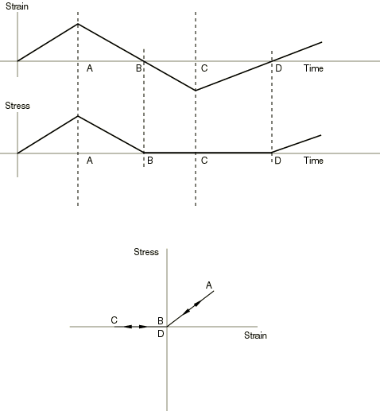

# 22.2.2 无压缩或无拉伸

**产品：** Abaqus/Standard  Abaqus/CAE  

**警告：**除与桁架或梁单元一起使用外，Abaqus/Standard不会为该选项形成精确的材料刚度。因此，收敛有时可能会很慢。

**参考**

- ["材料库概述，" 第21.1.1节](pt05ch21s01abo18.md)
- ["弹性行为概述，" 第22.1.1节](pt05ch22s01abo19.md)
- ["线弹性行为，" 第22.2.1节](pt05ch22s02abm02.md)
- [*NO COMPRESSION*](../key/key-link.md#usb-kws-mnocompress)
- [*NO TENSION*](../key/key-link.md#usb-kws-mnotension)
- ["在"定义弹性"中指定弹性材料特性，" 第12.9.1节](../usi/usi-link.md#usi-prp-mechanical-elastic-elastic-overview)

### 概述

无压缩和无拉伸弹性模型：
- 用于修改材料的线弹性，使得不能产生压应力或拉应力；以及
- 只能与弹性定义结合使用。

### 定义修改后的弹性行为

修改后的弹性行为通过首先假设线弹性求解主应力，然后将相应的主应力值设为零来获得。相关的刚度矩阵分量也将被设为零。这些模型不依赖于历史：被设为零的主应力方向在每次迭代时重新计算。

对于一维应力情况（如桁架或平面中梁的一层），无压缩效应如图[图22.2.2-1](pt05ch22s02abm03.md#cnocompcnoten-ela)所示。无压缩和无拉伸定义仅修改材料的弹性响应。

**图22.2.2-1** 具有施加应变循环的无压缩弹性情况。



| **输入文件用法：** | 使用以下选项之一： |
| --- | --- |
|  | ``` [*NO COMPRESSION*](../key/key-link.md#usb-kws-mnocompress) [*NO TENSION*](../key/key-link.md#usb-kws-mnotension) ``` |

| **Abaqus/CAE用法：** | 属性模块：材料编辑器：**Mechanical****Elasticity****Elastic****: **No compression**或**No tension** |
| --- | --- |

### 稳定性

使用无压缩或无拉伸弹性可能会使模型不稳定：可能会出现收敛困难。有时可以通过在每个使用无压缩（或无拉伸）模型的单元上覆盖另一个使用较小杨氏模量值的单元来克服这些困难（与使用修改弹性的单元的杨氏模量相比很小）。该技术创建了一个小的"人工"刚度，可以稳定模型。

### 材料选项

无压缩和无拉伸定义只能与弹性定义结合使用。这些定义不能与任何其他材料选项一起使用。

### 单元

无压缩和无拉伸弹性模型可用于Abaqus/Standard中的任何应力/位移单元。但是，如果使用通用截面定义对截面属性进行预积分，则不能与壳单元或梁单元一起使用。
