# 22.7.1 时域粘弹性

**产品：** Abaqus/Standard  Abaqus/Explicit  Abaqus/CAE  

**参考**

- ["材料库概述，" 第21.1.1节](pt05ch21s01abo18.md)
- ["弹性行为概述，" 第22.1.1节](pt05ch22s01abo19.md)
- ["频域粘弹性，" 第22.7.2节](pt05ch22s07abm13.md)
- [*VISCOELASTIC*](../key/key-link.md#usb-kws-mviscoelast)
- [*SHEAR TEST DATA*](../key/key-link.md#usb-kws-msheartestdata)
- [*VOLUMETRIC TEST DATA*](../key/key-link.md#usb-kws-mvoltestdata)
- [*COMBINED TEST DATA*](../key/key-link.md#usb-kws-mcombinedtestdata)
- [*TRS*](../key/key-link.md#usb-kws-mtrs)
- ["在"定义弹性"中定义时域粘弹性，" 第12.9.1节](../usi/usi-link.md#usi-prp-mechanical-elastic-viscoelastic-time)

### 概述

时域粘弹性材料模型：
- 描述各向同性率依赖材料行为，用于必须建模主要由"粘性"（内阻尼）效应引起的耗散损失的材料；
- 假设在多轴应力状态下剪切（偏）行为和体积行为是独立的（与弹性泡沫一起使用时除外）；
- 只能与["线弹性行为，" 第22.2.1节](pt05ch22s02abm02.md)；["橡胶状材料的超弹性行为，" 第22.5.1节](pt05ch22s05abm07.md)；或["弹性泡沫中的超弹性行为，" 第22.5.2节](pt05ch22s05abm08.md)结合使用来定义连续弹性材料特性；
- 可在Abaqus/Explicit中与["内聚单元的牵引-分离行为线弹性"结合使用，见"定义内聚单元的本构响应使用牵引-分离描述，" 第32.5.6节](pt06ch32s05alm45.md#usb-elm-ecohesivebehavior-tractionelastic)；
- 仅在瞬态静力分析（["准静力分析，" 第6.2.5节](pt03ch06s02at04.md)）、瞬态隐式动力学分析（["使用直接积分的隐式动力学分析，" 第6.3.2节](pt03ch06s03at07.md)）、显式动力学分析（["显式动力学分析，" 第6.3.3节](pt03ch06s03at08.md)）、稳态传输分析（["稳态传输分析，" 第6.4.1节](pt03ch06s04at17.md)）、完全耦合温度-位移分析（["完全耦合热应力分析，" 第6.5.3节](pt03ch06s05at19.md)）、完全耦合热-电-结构分析（["完全耦合热-电-结构分析，" 第6.7.4节](pt03ch06s07at23.md)）或瞬态（固结）耦合孔隙流体扩散和应力分析（["耦合孔隙流体扩散和应力分析，" 第6.8.1节](pt03ch06s08at26.md)）期间激活；
- 可用于大应变问题；
- 可使用时间相关蠕变测试数据、时间相关松弛测试数据或频率相关循环测试数据进行校准；以及
- 可用于在完全耦合温度-位移分析（["完全耦合热应力分析，" 第6.5.3节](pt03ch06s05at19.md)）或完全耦合热-电-结构分析（["完全耦合热-电-结构分析，" 第6.7.4节](pt03ch06s07at23.md)）中将粘性耗散与温度场耦合。

### 定义剪切行为

时域粘弹性在Abaqus中可用于小应变应用，其中率无关弹性响应可以用线弹性材料模型定义；和大应变应用，其中率无关弹性响应必须用超弹性或超泡沫材料模型定义。

#### 小应变

考虑一个小应变剪切测试，其中随时间变化的剪切应变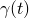被施加到材料上。响应是剪应力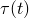。粘弹性材料模型将定义为

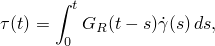

其中是时间相关的"剪切松弛模量"，表征材料的响应。本构行为可以通过考虑松弛测试来说明，其中应变突然施加到试样上，然后保持很长时间。实验开始时，当应变突然施加时，取为零时间，因此

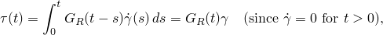

其中是固定应变。粘弹性材料模型是"长期弹性"的，因为当承受恒定应变很长时间后，响应稳定为恒定应力；即当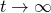时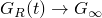。

剪切松弛模量可以写成无量纲形式：

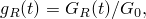

其中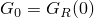是瞬时剪切模量，因此应力表达式为

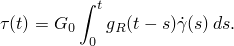

无量纲松弛函数具有极限值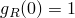和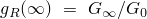。

##### Abaqus/Explicit中的各向异性弹性

剪应力方程可以通过分部积分进行转换：

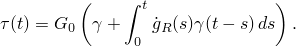

将该方程写成以下形式很方便

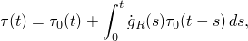

其中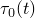是时间*t*时的瞬时剪应力。这可以推广到多维情况

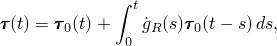

其中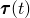是应力张量的偏部分，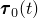是瞬时应力张量的偏部分。这里假设粘弹性是各向同性的；即松弛函数与加载方向无关。

这种形式允许向各向异性弹性变形的直接推广，其中瞬时应力张量的偏部分计算为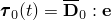。这里是瞬时偏弹性张量，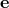是应变张量的偏部分。

#### 大应变

上述形式也允许向非线性弹性变形的直接推广，其中瞬时应力的偏部分使用超弹性应变能势计算。这种推广产生线性粘弹性模型，因为无量纲应力松弛函数与变形幅度无关。

在上述方程中，在时间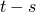施加的瞬时应力影响时间*t*时的应力。因此，为了创建适当的有限应变公式，有必要将时间存在于配置中的应力映射到时间*t*的配置。在Abaqus中，这通过相对变形梯度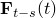的"标准-前推"变换来完成：

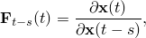

这产生以下遗传积分：

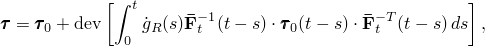

其中是基尔霍夫应力的偏部分。

有限应变理论在["有限应变粘弹性，" Abaqus理论指南第4.8.2节](../stm/stm-link.md#stm-mat-finitestrvisco)中有更详细的描述。

### 定义体积行为

体积行为可以写成与剪切行为相似的形式：

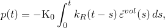

其中*p*是静水压力，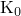是瞬时弹性体积模量，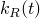是无量纲体积松弛模量，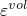是体积应变。

上述展开适用于小应变和有限应变，因为体积应变通常很小，不需要将压力从时间映射到时间*t*。

### 在Abaqus/Explicit中为牵引-分离弹性定义粘弹性行为

时域粘弹性可在Abaqus/Explicit中用于使用牵引-分离弹性（["内聚单元的牵引-分离弹性" in "线弹性行为，" 第22.2.1节](pt05ch22s02abm02.md#usb-mat-clinearelastic-traction)）对内聚单元的率依赖行为进行建模。在这种情况下，正应力和两个剪切名义牵引力的演化方程采用以下形式：


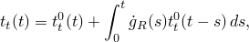

其中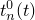、和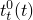分别是时间*t*时在法向和两个局部剪切方向上的瞬时名义牵引力。函数和现在分别表示无量纲剪切和法向松弛模量。注意，在重新解释剪切和体积松弛为剪切和法向松弛之后，前几节讨论的连续弹性响应的粘弹性公式与牵引-分离行为的公式之间存在密切的相似性。

对于解耦牵引弹性情况，粘弹性法向和剪切行为被认为是独立的。法向松弛模量定义为

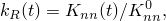

其中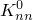是瞬时法向模量。剪切松弛模量被认为是各向同性的，因此与局部剪切方向无关：

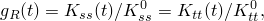

其中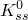和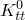是瞬时剪切模量。

对于耦合牵引-分离弹性情况，法向和剪切松弛模量必须相同，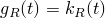，并且必须对两种行为使用相同的松弛数据。

### 温度效应

温度对材料行为的影响通过瞬时应力对温度的依赖以及简化时间概念引入。线弹性剪应力的表达式被重写为

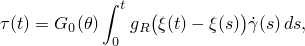

其中瞬时剪切模量依赖于温度，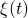是简化时间，定义为

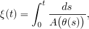

其中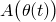是时间*t*时的偏移函数。这种温度依赖性的简化时间概念通常被称为热流变简单（TRS）温度依赖性。偏移函数通常用Williams-Landel-Ferry（WLF）形式近似。详见下文["热流变简单温度效应"](pt05ch22s07abm12.md#usb-mat-ctimevisco-trs)中关于Abaqus中可用的WLF和其他形式的偏移函数的描述。

简化时间概念也用于体积行为、大应变公式和牵引-分离公式。

### 数值实现

Abaqus假设粘弹性材料由无量纲松弛模量的Prony级数展开定义：

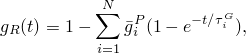

其中*N*、和、是材料常数。对于线性各向同性弹性，代入小应变剪应力表达式得到

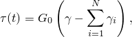

其中

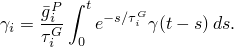

被解释为控制应力松弛的状态变量，

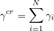

是"蠕变"应变：总机械应变与瞬时弹性应变（应力除以瞬时弹性模量）之间的差值。在Abaqus/Standard中，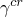可用作蠕变应变输出变量CE（["Abaqus/Standard输出变量标识符，" 第4.2.1节](pt02ch04s02abv01.md)）。

类似的Prony级数展开用于体积响应，这对小应变和有限应变应用都有效：

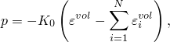

其中

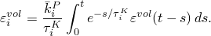

Abaqus假设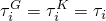。

对于线性各向异性弹性，Prony级数展开与偏应力的广义小应变表达式结合，产生

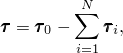

其中

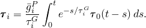

被解释为控制应力松弛的状态变量。

对于有限应变，Prony级数展开与剪应力的有限应变表达式结合，产生偏应力的以下表达式：


其中


被解释为控制应力松弛的状态变量。

对于牵引-分离弹性，Prony级数展开产生


其中


被解释为控制牵引应力松弛的状态变量。

如果瞬时材料行为由线弹性或超弹性定义，体积和剪切行为可以独立定义。但是，如果瞬时行为由超泡沫模型定义，偏本构和体积本构行为是耦合的，必须对两种行为使用相同的松弛数据。对于线性各向异性弹性，当弹性定义使得偏响应和体积响应耦合时，两种行为应使用相同的松弛数据。类似地，对于耦合牵引-分离弹性，必须对法向和剪切行为使用相同的松弛数据。

在上述所有表达式中，通过将替换为并将替换为，可以容易地引入温度依赖性。

### 确定粘弹性材料参数

上述方程用于建模粘弹性材料的时间相关剪切和体积行为。松弛参数可以通过四种方式之一定义：直接指定Prony系列参数、包含蠕变测试数据、包含松弛测试数据或包含从正弦振荡实验获得的频率相关数据。无论使用何种方法定义粘弹性材料，温度效应的包含方式相同。

Abaqus/CAE允许您通过基于实验测试数据或系数自动创建响应曲线来评估粘弹性材料的行为。仅当粘弹性材料在时域中定义并包含超弹性和/或弹性材料数据时，才能对其进行评估。见["评估超弹性和粘弹性材料行为，" Abaqus/CAE用户指南第12.4.7节](../usi/usi-link.md#usi-prp-editor-evaluate)。

#### 直接指定

Prony系列参数、和可以为Prony系列中的每一项直接定义。可以使用的项数没有限制。如果松弛时间仅与两个模量之一相关联，则将另一个留空或输入零。数据应按松弛时间升序给出。给出的数据行数定义Prony系列中的项数*N*。如果此模型与超泡沫材料模型结合使用，则两个模量比必须相同（。

| **输入文件用法：** | ``` [*VISCOELASTIC*](../key/key-link.md#usb-kws-mviscoelast), TIME=PRONY ``` |
| --- | --- |
|  | 数据行根据需要重复，以定义Prony系列中的第一、第二、第三等项。 |

| **Abaqus/CAE用法：** | 属性模块：材料编辑器：**Mechanical****Elasticity****Viscoelastic****: **Domain: Time**和**Time: Prony** |
| --- | --- |
|  | 在表格中根据需要输入尽可能多的数据行，以定义Prony系列中的第一、第二、第三等项。 |

#### 蠕变测试数据

如果指定了蠕变测试数据，Abaqus将自动计算Prony系列中的项。归一化剪切和体积柔量定义为


其中是剪切柔量，是总剪切应变，是剪切蠕变测试中的恒定剪应力；是体积柔量，是总体积应变，是体积蠕变测试中的恒定压力。在时间时，。

蠕变数据通过卷积积分转换为松弛数据


然后Abaqus使用归一化剪切模量和归一化体积模量进行非线性最小二乘拟合，以确定Prony系列参数。

##### 连续使用剪切和体积测试数据

剪切测试数据和体积测试数据可以连续使用来定义作为时间函数的归一化剪切和体积柔量。对每个数据集执行单独的最小二乘拟合；两个推导的Prony系列参数集和合并为一个参数集。

| **输入文件用法：** | 使用以下三个选项。第一个选项是必需的。第二个和第三个选项只需要其中一个。 |
| --- | --- |
|  | ``` [*VISCOELASTIC*](../key/key-link.md#usb-kws-mviscoelast), TIME=CREEP TEST DATA [*SHEAR TEST DATA*](../key/key-link.md#usb-kws-msheartestdata) [*VOLUMETRIC TEST DATA*](../key/key-link.md#usb-kws-mvoltestdata) ``` |

| **Abaqus/CAE用法：** | 属性模块：材料编辑器：**Mechanical****Elasticity****Viscoelastic****: **Domain: Time**和**Time: Creep test data** |
| --- | --- |
|  | 此外，选择以下一个或两个：****Test Data****Shear Test Data********Test Data****Volumetric Test Data**** |

##### 使用组合测试数据

或者，组合测试数据可用于同时指定作为时间函数的归一化剪切和体积柔量。对组合测试数据集执行单一最小二乘拟合，以确定一组Prony系列参数。

| **输入文件用法：** | 使用以下两个选项： |
| --- | --- |
|  | ``` [*VISCOELASTIC*](../key/key-link.md#usb-kws-mviscoelast), TIME=CREEP TEST DATA [*COMBINED TEST DATA*](../key/key-link.md#usb-kws-mcombinedtestdata) ``` |

| **Abaqus/CAE用法：** | 属性模块：材料编辑器：**Mechanical****Elasticity****Viscoelastic****: **Domain: Time**、**Time: Creep test data**和****Test Data****Combined Test Data**** |
| --- | --- |

#### 松弛测试数据

与蠕变测试数据一样，Abaqus将从松弛测试数据自动计算Prony系列参数。

##### 连续使用剪切和体积测试数据

同样，剪切测试数据和体积测试数据可以连续使用来定义作为时间函数的松弛模量。对每个数据集执行单独的非线性最小二乘拟合；两个推导的Prony系列参数集和合并为一个参数集。

| **输入文件用法：** | 使用以下三个选项。第一个选项是必需的。第二个和第三个选项只需要其中一个。 |
| --- | --- |
|  | ``` [*VISCOELASTIC*](../key/key-link.md#usb-kws-mviscoelast), TIME=RELAXATION TEST DATA [*SHEAR TEST DATA*](../key/key-link.md#usb-kws-msheartestdata) [*VOLUMETRIC TEST DATA*](../key/key-link.md#usb-kws-mvoltestdata) ``` |

| **Abaqus/CAE用法：** | 属性模块：材料编辑器：**Mechanical****Elasticity****Viscoelastic****: **Domain: Time**和**Time: Relaxation test data** |
| --- | --- |
|  | 此外，选择以下一个或两个：****Test Data****Shear Test Data********Test Data****Volumetric Test Data**** |

##### 使用组合测试数据

或者，组合测试数据可用于同时指定作为时间函数的松弛模量。对组合测试数据集执行单一最小二乘拟合，以确定一组Prony系列参数。

| **输入文件用法：** | 使用以下两个选项： |
| --- | --- |
|  | ``` [*VISCOELASTIC*](../key/key-link.md#usb-kws-mviscoelast), TIME=RELAXATION TEST DATA [*COMBINED TEST DATA*](../key/key-link.md#usb-kws-mcombinedtestdata) ``` |

| **Abaqus/CAE用法：** | 属性模块：材料编辑器：**Mechanical****Elasticity****Viscoelastic****: **Domain: Time**、**Time: Relaxation test data**和****Test Data****Combined Test Data**** |
| --- | --- |

#### 频率相关测试数据

Prony系列项也可以使用频率相关测试数据进行校准。在这种情况下，Abaqus使用将Prony系列松弛函数与存储和损耗模量相关的解析表达式。通过利用傅里叶变换将Prony系列项从时域转换到频域，得到的剪切模量表达式可以写成如下形式：


其中是存储模量，是损耗模量，是角频率，*N*是Prony系列中的项数。这些表达式用于在*M*频率下获得的存储和损耗模量循环测试数据，通过最小化误差函数来确定Prony系列参数：


其中和是测试数据，分别是瞬时和长期剪切模量和。体积模量和的表达式类似编写。

频率域数据以表格形式定义，给出和的实部和虚部——其中是圆频率——作为每单位时间频率的函数。是无量纲剪切松弛函数的傅里叶变换。给定频率相关存储和损耗模量、、和，和的实部和虚部由下式给出


其中和是从弹性或超弹性特性确定的长期剪切和体积模量。

| **输入文件用法：** | ``` [*VISCOELASTIC*](../key/key-link.md#usb-kws-mviscoelast), TIME=FREQUENCY DATA ``` |
| --- | --- |

| **Abaqus/CAE用法：** | 属性模块：材料编辑器：**Mechanical****Elasticity****Viscoelastic****: **Domain: Time**和**Time: Frequency data** |
| --- | --- |

#### 校准Prony系列参数

您可以指定与粘弹性材料Prony系列参数校准相关的两个可选参数：误差容限和。误差容限是数据点在最小二乘拟合中的允许平均均方根误差，默认值为0.01。是Prony系列中的最大项数*N*，其默认值（和最大值）为13。Abaqus将执行从到的最小二乘拟合，直到对相对于误差容限的最低*N*达到收敛。

以下是关于从测试数据确定Prony系列项数的一些指南。基于这些指南，您可以选择。
- 应有足够的数据对来确定Prony系列项中的所有参数。因此，假设*N*是Prony系列的项数，剪切测试数据中应有至少个数据点，体积测试数据中应有个数据点，组合测试数据中应有个数据点，频域中应有个数据点。
- Prony系列的项数通常不应超过测试数据所跨越的对数"十年"数。对数"十年"数定义为，其中和分别是测试数据中的最大和最小时间。

| **输入文件用法：** | ``` [*VISCOELASTIC*](../key/key-link.md#usb-kws-mviscoelast), ERRTOL=*error_tolerance*, NMAX= ``` |
| --- | --- |

| **Abaqus/CAE用法：** | 属性模块：材料编辑器：**Mechanical****Elasticity****Viscoelastic****: **Domain: Time**；**Time: Creep test data**、**Relaxation test data**或**Frequency data**；**Prony系列中的最大项数：** ；和**允许的平均均方根误差：** *error_tolerance* |
| --- | --- |

#### 热流变简单温度效应

无论使用何种方法定义粘弹性行为，都可以通过指定用于定义偏移函数的方法来包含热流变简单温度效应。Abaqus支持以下形式的偏移函数：Williams-Landel-Ferry（WLF）形式、Arrhenius形式和用户定义形式。

也可以在具有粘性剪切行为的状态方程模型定义中包含热流变简单温度效应（见["粘性剪切行为" in "状态方程，" 第25.2.1节](pt05ch25s02abm50.md#usb-mat-ceos-deviatoricviscous)）。

##### Williams-Landel-Ferry（WLF）形式

偏移函数可以由Williams-Landel-Ferry（WLF）近似定义，其形式为：


其中是给出松弛数据的参考温度；是感兴趣温度；、是在该温度下获得的校准常数。如果，变形将是弹性的，基于瞬时模量。

关于WLF方程的更多信息，请参见["粘弹性，" Abaqus理论指南第4.8.1节](../stm/stm-link.md#stm-mat-viscoelastic)。

| **输入文件用法：** | ``` [*TRS*](../key/key-link.md#usb-kws-mtrs), DEFINITION=WLF ``` |
| --- | --- |

| **Abaqus/CAE用法：** | 属性模块：材料编辑器：**Mechanical****Elasticity****Viscoelastic****: **Domain: Time**、**Time: *any method***和****Suboptions****Trs****: **Shift function: WLF** |
| --- | --- |

##### Arrhenius形式

Arrhenius偏移函数通常用于半结晶聚合物。它的形式为


其中是激活能，是通用气体常数，是我所用温度标尺中的绝对零度，是给出松弛数据的参考温度，是感兴趣温度。

| **输入文件用法：** | 使用以下选项定义Arrhenius偏移函数： |
| --- | --- |
|  | ``` [*TRS*](../key/key-link.md#usb-kws-mtrs), DEFINITION=ARRHENIUS ``` 此外，使用[*PHYSICAL CONSTANTS*](../key/key-link.md#usb-kws-mphysicalconsts)选项指定通用气体常数和绝对零度。 |

| **Abaqus/CAE用法：** | Arrhenius偏移函数在Abaqus/CAE中不受支持。 |
| --- | --- |

##### 用户定义形式

偏移函数可以替代地在Abaqus/Standard中的用户子程序[`UTRS`](../sub/sub-link.md#sub-xsl-utrs)和Abaqus/Explicit中的[`VUTRS`](../sub/sub-link.md#sub-xsl-vutrs)中指定。

| **输入文件用法：** | ``` [*TRS*](../key/key-link.md#usb-kws-mtrs), DEFINITION=USER ``` |
| --- | --- |

| **Abaqus/CAE用法：** | 属性模块：材料编辑器：**Mechanical****Elasticity****Viscoelastic****: **Domain: Time**、**Time: *any method***和****Suboptions****Trs****: **Shift function: User subroutine UTRS** |
| --- | --- |

### 定义材料响应的率无关部分

在所有情况下，都必须指定弹性模量来定义材料行为的率无关部分。小应变线弹性行为由弹性材料模型（["线弹性行为，" 第22.2.1节](pt05ch22s02abm02.md)）定义，大变形行为由超弹性（["橡胶状材料的超弹性行为，" 第22.5.1节](pt05ch22s05abm07.md)）或超泡沫（["弹性泡沫中的超弹性行为，" 第22.5.2节](pt05ch22s05abm08.md)）材料模型定义。对于这些模型中的任何一个，率无关弹性可以根据瞬时弹性模量或长期弹性模量来定义。选择根据瞬时模量还是长期模量定义弹性只是一种方便的问题；它对解决方案没有影响。

有效松弛模量通过将瞬时弹性模量与无量纲松弛函数相乘获得，如下所述。

#### 线弹性各向同性材料

对于线弹性各向同性材料行为


和


其中和是由用户定义的瞬时弹性模量和的值确定的瞬时剪切和体积模量：和。

如果定义了长期弹性模量，则瞬时模量由下式确定


#### 线弹性各向异性材料

对于线弹性各向异性材料行为，松驰系数应用于弹性模量


和


其中和是由用户定义的瞬时弹性模量的值确定的瞬时偏弹性张量和体积模量。如果指定了剪切和体积松驰系数且它们不相等，则如果弹性模量使得偏响应和体积响应耦合，Abaqus会发出错误消息。

如果定义了长期弹性模量，则瞬时模量由下式确定


#### 超弹性材料

对于超弹性材料行为，松驰系数应用于定义能量函数的常数或直接应用于能量函数。对于多项式函数及其特殊情况（减缩多项式、Mooney-Rivlin、neo-Hookean和Yeoh）


对于Ogden函数


对于Arruda-Boyce和Van der Waals函数


对于Marlow函数


对于控制多项式模型和Ogden模型可压缩行为的系数


对于Arruda-Boyce和Van der Waals函数


对于Marlow函数


如果定义了长期弹性模量，则瞬时模量由下式确定


而瞬时体积柔量模量由下式获得


对于Marlow函数，我们有


#### Mullins效应

如果为底层超弹性行为定义了长期模量，则Mullins效应中参数的瞬时值由下式确定


#### 弹性泡沫

对于弹性泡沫材料行为，瞬时剪切和体积松驰系数被认为是相等的，并应用于能量函数中的材料常数），
- 瞬态隐式动力学分析（["使用直接积分的隐式动力学分析，" 第6.3.2节](pt03ch06s03at07.md)），
- 显式动力学分析（["显式动力学分析，" 第6.3.3节](pt03ch06s03at08.md)），
- 稳态传输分析（["稳态传输分析，" 第6.4.1节](pt03ch06s04at17.md)），
- 完全耦合温度-位移分析（["完全耦合热应力分析，" 第6.5.3节](pt03ch06s05at19.md)），
- 完全耦合热-电-结构分析（["完全耦合热-电-结构分析，" 第6.7.4节](pt03ch06s07at23.md)），和
- 瞬态（固结）耦合孔隙流体扩散和应力分析（["耦合孔隙流体扩散和应力分析，" 第6.8.1节](pt03ch06s08at26.md)）。

在静力分析中，粘弹性材料响应始终被忽略。在完全耦合温度-位移分析、完全耦合热-电-结构分析或土壤固结分析中，也可以通过指定在步骤期间没有发生蠕变或粘弹性响应来忽略它（见["完全耦合热应力分析，" 第6.5.3节](pt03ch06s05at19.md)或["耦合孔隙流体扩散和应力分析，" 第6.8.1节](pt03ch06s08at26.md)）。在这些情况下，假设加载是瞬时施加的，因此得到的响应对应于基于瞬时弹性模量的弹性解。

Abaqus/Standard还提供选项，可以在静力或稳态传输分析中直接获得完全松弛的长期弹性解，而无需执行瞬态分析。长期值用于此目的。粘性阻尼应力（与每个Prony系列项相关的内应力）如果在步骤结束时指定了长期值，则会从步骤开始时的值逐渐增加到其长期值。

### 材料选项

粘弹性材料模型必须与弹性材料模型结合使用。它与各向同性线弹性模型（["线弹性行为，" 第22.2.1节](pt05ch22s02abm02.md)）结合使用来定义经典的、线性的、小应变的粘弹性行为，或与超弹性（["橡胶状材料的超弹性行为，" 第22.5.1节](pt05ch22s05abm07.md)）或超泡沫（["弹性泡沫中的超弹性行为，" 第22.5.2节](pt05ch22s05abm08.md)）模型结合使用来定义大变形、非线性粘弹性行为。它也可以与各向异性线弹性和Abaqus/Explicit中的牵引-分离弹性行为结合使用。为这些模型定义的弹性特性可以依赖于温度。

粘弹性不能与任何塑性模型结合使用。有关更多详细信息，请参见["组合材料行为，" 第21.1.3节](pt05ch21s01aus110.md)。

### 单元

时域粘弹性材料模型可用于Abaqus中的任何应力/位移、耦合温度-位移或热-电-结构单元。

### 输出

除了Abaqus中可用的标准输出标识符（["Abaqus/Standard输出变量标识符，" 第4.2.1节](pt02ch04s02abv01.md)和["Abaqus/Explicit输出变量标识符，" 第4.2.2节](pt02ch04s02xbv01.md)），如果在Abaqus/Standard中定义了粘弹性，以下变量具有特殊含义：

| EE | 对应于时间*t*时应力状态和瞬时弹性材料特性的弹性应变。 |
| --- | --- |

| CE | 定义为总应变与弹性应变之差的等效蠕变应变。 |
| --- | --- |

#### 稳态传输分析的注意事项

当稳态传输分析（["稳态传输分析，" 第6.4.1节](pt03ch06s04at17.md)）与大应变粘弹性结合使用时，粘性耗散CENER计算为材料点绕流线传输每转一圈所耗散的能量；即


因此，给定流线中的所有材料点报告相同的CENER值，其他导出量如ELCD和ALLCD也表示每转一圈的耗散。可恢复弹性应变能密度SENER近似为


其中是当前增量开始时的增量能量输入，是当前增量开始时的时间。由于上述方程中出现的量使用了两种不同的单位，因此无法为SENER、ELSE、ALLSE和ALLIE等量分配适当的含义。

#### 大应变粘弹性的注意事项

对于大应变粘弹性，Abaus/Standard仅近似计算粘性能量耗散。

由于性能原因，Abaqus/Explicit不计算大应变粘弹性的粘性耗散。相反，粘性耗散的贡献包含在应变能输出SENER中；CENER输出为零。因此，在解释Abaqus/Explicit中大应变粘弹性材料应变能结果时必须特别小心，因为它们包含粘性耗散效应。
