# 23.1.1 Inelastic behavior

The material library in Abaqus includes several models of inelastic behavior:

**Classical metal plasticity**: The yield and inelastic flow of a metal at relatively low temperatures, where loading is relatively monotonic and creep effects are not important, can typically be described with the classical metal plasticity models (["Classical metal plasticity," Section 23.2.1](pt05ch23s02abm17.md)). In Abaqus these models use standard Mises or Hill yield surfaces with associated plastic flow. Perfect plasticity and isotropic hardening definitions are both available in the classical metal plasticity models. Common applications include crash analyses, metal forming, and general collapse studies; the models are simple and adequate for such cases.

**Models for metals subjected to cyclic loading**: A linear kinematic hardening model or a nonlinear isotropic/kinematic hardening model (["Models for metals subjected to cyclic loading," Section 23.2.2](pt05ch23s02abm18.md)) can be used in Abaqus to simulate the behavior of materials that are subjected to cyclic loading. The evolution law in these models consists of a kinematic hardening component (which describes the translation of the yield surface in stress space) and, for the nonlinear isotropic/kinematic hardening model, of an isotropic component (which describes the change of the elastic range). The Bauschinger effect and plastic shakedown can be modeled with both models, but the nonlinear isotropic/kinematic hardening model provides more accurate predictions. Ratchetting and relaxation of the mean stress are accounted for only by the nonlinear isotropic/kinematic model. In addition to these two models, the ORNL model in Abaqus/Standard can be used when simple life estimation is desired for the design of stainless steels subjected to low-cycle fatigue and creep fatigue (see below).

**Rate-dependent yield**: As strain rates increase, many materials show an increase in their yield strength. Rate dependence (["Rate-dependent yield," Section 23.2.3](pt05ch23s02abm19.md)) can be defined in Abaqus for a number of plasticity models. Rate dependence can be used in both static and dynamic procedures. Applicable models include classical metal plasticity, extended Drucker-Prager plasticity, and crushable foam plasticity.

**Creep and swelling**: Abaqus/Standard provides a material model for classical metal creep behavior and time-dependent volumetric swelling behavior (["Rate-dependent plasticity: creep and swelling," Section 23.2.4](pt05ch23s02abm20.md)). This model is intended for relatively slow (quasi-static) inelastic deformation of a model such as the high-temperature creeping flow of a metal or a piece of glass. The creep strain rate is assumed to be purely deviatoric, meaning that there is no volume change associated with this part of the inelastic straining. Creep can be used with the classical metal plasticity model, with the ORNL model, and to define rate-dependent gasket behavior (["Defining the gasket behavior directly using a gasket behavior model," Section 32.6.6](pt06ch32s06alm51.md)). Swelling can be used with the classical metal plasticity model. (Usage with the Drucker-Prager models is explained below.)

**Annealing or melting**: Abaqus provides a modeling capability for situations in which a loss of memory related to hardening occurs above a certain user-defined temperature, known as the annealing temperature (["Annealing or melting," Section 23.2.5](pt05ch23s02abm21.md)). It is intended for use with metals subjected to high-temperature deformation processes, in which the material may undergo melting and possibly resolidification or some other form of annealing. In Abaqus annealing or melting can be modeled with classical metal plasticity (Mises and Hill); in Abaqus/Explicit annealing or melting can also be modeled with Johnson-Cook plasticity. The annealing temperature is assumed to be a material property. See ["Annealing procedure," Section 6.12.1](pt03ch06s12at31.md), for information on an alternative method for simulating annealing in Abaqus/Explicit.

**Anisotropic yield and creep**: Abaqus provides an anisotropic yield model (["Anisotropic yield/creep," Section 23.2.6](pt05ch23s02abm22.md)), which is available for use with materials modeled with classical metal plasticity (["Classical metal plasticity," Section 23.2.1](pt05ch23s02abm17.md)), kinematic hardening (["Models for metals subjected to cyclic loading," Section 23.2.2](pt05ch23s02abm18.md)), and/or creep (["Rate-dependent plasticity: creep and swelling," Section 23.2.4](pt05ch23s02abm20.md)) that exhibit different yield stresses in different directions. The Abaqus/Standard model includes creep; creep behavior is not available in Abaqus/Explicit. The model allows for the specification of different stress ratios for each stress component to define the initial anisotropy. The model is not adequate for cases in which the anisotropy changes significantly as the material deforms as a result of loading.

**Johnson-Cook plasticity**: The Johnson-Cook plasticity model in Abaqus/Explicit (["Johnson-Cook plasticity," Section 23.2.7](pt05ch23s02abm23.md)) is particularly suited to model high-strain-rate deformation of metals. This model is a particular type of Mises plasticity that includes analytical forms of the hardening law and rate dependence. It is generally used in adiabatic transient dynamic analysis.

**Dynamic failure models**: Two types of dynamic failure models are offered in Abaqus/Explicit for the Mises and Johnson-Cook plasticity models (["Dynamic failure models," Section 23.2.8](pt05ch23s02abm24.md)). One is the shear failure model, where the failure criterion is based on the accumulated equivalent plastic strain. Another is the tensile failure model, which uses the hydrostatic pressure stress as a failure measure to model dynamic spall or a pressure cutoff. Both models offer a number of failure choices including element removal and are applicable mainly in truly dynamic situations. In contrast, the progressive failure and damage models ([Chapter 24, "Progressive Damage and Failure](pt05ch24.md)”) are suitable for both quasi-static and dynamic situations and have other significant advantages.

**Porous metal plasticity**: The porous metal plasticity model (["Porous metal plasticity," Section 23.2.9](pt05ch23s02abm25.md)) is used to model materials that exhibit damage in the form of void initiation and growth, and it can also be used for some powder metal process simulations at high relative densities (relative density is defined as the ratio of the volume of solid material to the total volume of the material). The model is based on Gurson's porous metal plasticity theory with void nucleation and is intended for use with materials that have a relative density that is greater than 0.9. The model is adequate for relatively monotonic loading.

**Cast iron plasticity**: The cast iron plasticity model (["Cast iron plasticity," Section 23.2.10](pt05ch23s02abm26.md)) is used to model gray cast iron, which exhibits markedly different inelastic behavior in tension and compression. The microstructure of gray cast iron consists of a distribution of graphite flakes in a steel matrix. In tension the graphite flakes act as stress concentrators, while in compression the flakes serve to transmit stresses. The resulting material is brittle in tension, but in compression it is similar in behavior to steel. The differences in tensile and compressive plastic response include: (i) a yield stress in tension that is three to five times lower than the yield stress in compression; (ii) permanent volume increase in tension, but negligible inelastic volume change in compression; (iii) different hardening behavior in tension and compression. The model is adequate for relatively monotonic loading.

**Two-layer viscoplasticity**: The two-layer viscoplasticity model in Abaqus/Standard (["Two-layer viscoplasticity," Section 23.2.11](pt05ch23s02abm27.md)) is useful for modeling materials in which significant time-dependent behavior as well as plasticity is observed. For metals this typically occurs at elevated temperatures. The model has been shown to provide good results for thermomechanical loading.

**ORNL constitutive model**: The ORNL plasticity model in Abaqus/Standard (["ORNL -- Oak Ridge National Laboratory constitutive model," Section 23.2.12](pt05ch23s02abm28.md)) is intended for cyclic loading and high-temperature creep of type 304 and 316 stainless steel. Plasticity and creep calculations are provided according to the specification in Nuclear Standard NEF 9-5T, “Guidelines and Procedures for Design of Class I Elevated Temperature Nuclear System Components.” This model is an extension of the linear kinematic hardening model (discussed above), which attempts to provide for simple life estimation for design purposes when low-cycle fatigue and creep fatigue are critical issues.

**Deformation plasticity**: Abaqus/Standard provides a deformation theory Ramberg-Osgood plasticity model (["Deformation plasticity," Section 23.2.13](pt05ch23s02abm29.md)) for use in developing fully plastic solutions for fracture mechanics applications in ductile metals. The model is most commonly applied in static loading with small-displacement analysis for which the fully plastic solution must be developed in a part of the model.

**Extended Drucker-Prager plasticity and creep**: The extended Drucker-Prager family of plasticity models (["Extended Drucker-Prager models," Section 23.3.1](pt05ch23s03abm30.md)) describes the behavior of granular materials or polymers in which the yield behavior depends on the equivalent pressure stress. The inelastic deformation may sometimes be associated with frictional mechanisms such as sliding of particles across each other.This class of models provides a choice of three different yield criteria. The differences in criteria are based on the shape of the yield surface in the meridional plane, which can be a linear form, a hyperbolic form, or a general exponent form. Inelastic time-dependent (creep) behavior coupled with the plastic behavior is also available  in Abaqus/Standard for the linear form of the model. Creep behavior is not available in Abaqus/Explicit.

**Modified Drucker-Prager/Cap plasticity and creep**: The modified Drucker-Prager/Cap plasticity model (["Modified Drucker-Prager/Cap model," Section 23.3.2](pt05ch23s03abm31.md)) can be used to simulate geological materials that exhibit pressure-dependent yield. The addition of a cap yield surface helps control volume dilatancy when the material yields in shear and provides an inelastic hardening mechanism to represent plastic compaction. In Abaqus/Standard inelastic time-dependent (creep) behavior coupled with the plastic behavior is also available for this model; two creep mechanisms are possible: a cohesion, Drucker-Prager-like mechanism and a consolidation, cap-like mechanism.

**Mohr-Coulomb plasticity**: The Mohr-Coulomb plasticity model (["Mohr-Coulomb plasticity," Section 23.3.3](pt05ch23s03abm32.md)) can be used for design applications in the geotechnical engineering area. The model uses the classical Mohr-Coloumb yield criterion: a straight line in the meridional plane and an irregular hexagonal section in the deviatoric plane. However, the Abaqus Mohr-Coulomb model has a completely smooth flow potential instead of the classical hexagonal pyramid: the flow potential is a hyperbola in the meridional plane, and it uses the smooth deviatoric section proposed by Mentrey and Willam.

**Critical state (clay) plasticity**: The clay plasticity model (["Critical state (clay) plasticity model," Section 23.3.4](pt05ch23s03abm33.md)) describes the inelastic response of cohesionless soils. The model provides a reasonable match to the experimentally observed behavior of saturated clays. This model defines the inelastic behavior of a material by a yield function that depends on the three stress invariants, an associated flow assumption to define the plastic strain rate, and a strain hardening theory that changes the size of the yield surface according to the inelastic volumetric strain.

**Crushable foam plasticity**: The foam plasticity model (["Crushable foam plasticity models," Section 23.3.5](pt05ch23s03abm34.md)) is intended for modeling crushable foams that are typically used as energy absorption structures; however, other crushable materials such as balsa wood can also be simulated with this model. This model is most appropriate for relatively monotonic loading. The crushable foam model with isotropic hardening is applicable to polymeric foams as well as metallic foams.

**Jointed material**: The jointed material model in Abaqus/Standard (["Jointed material model," Section 23.5.1](pt05ch23s05abm36.md)) is intended to provide a simple, continuum model for a material that contains a high density of parallel joint surfaces in different orientations, such as sedimentary rock. This model is intended for applications where stresses are mainly compressive, and it provides a joint opening capability when the stress normal to the joint tries to become tensile.

**Concrete**: Three different constitutive models are offered in Abaqus for the analysis of concrete at low confining pressures: the smeared crack concrete model in Abaqus/Standard (["Concrete smeared cracking," Section 23.6.1](pt05ch23s06abm37.md)); the brittle cracking model in Abaqus/Explicit (["Cracking model for concrete," Section 23.6.2](pt05ch23s06abm38.md)); and the concrete damaged plasticity model in both Abaqus/Standard and Abaqus/Explicit (["Concrete damaged plasticity," Section 23.6.3](pt05ch23s06abm39.md)). Each model is designed to provide a general capability for modeling plain and reinforced concrete (as well as other similar quasi-brittle materials) in all types of structures: beams, trusses, shells, and solids.The smeared crack concrete model in Abaqus/Standard is intended for applications in which the concrete is subjected to essentially monotonic straining and a material point exhibits either tensile cracking or compressive crushing. Plastic straining in compression is controlled by a “compression” yield surface. Cracking is assumed to be the most important aspect of the behavior, and the representation of cracking and postcracking anisotropic behavior dominates the modeling.The brittle cracking model in Abaqus/Explicit is intended for applications in which the concrete behavior is dominated by tensile cracking and compressive failure is not important. The model includes consideration of the anisotropy induced by cracking. In compression, the model assumes elastic behavior. A simple brittle failure criterion is available to allow the removal of elements from a mesh.The concrete damaged plasticity model in Abaqus/Standard and Abaqus/Explicit is based on the assumption of scalar (isotropic) damage and is designed for applications in which the concrete is subjected to arbitrary loading conditions, including cyclic loading. The model takes into consideration the degradation of the elastic stiffness induced by plastic straining both in tension and compression. It also accounts for stiffness recovery effects under cyclic loading.

**Progressive damage and failure**: Abaqus/Explicit offers a general capability for modeling progressive damage and failure in ductile metals and fiber-reinforced composites ([Chapter 24, "Progressive Damage and Failure](pt05ch24.md)”).

### Plasticity theories

Most materials of engineering interest initially respond elastically. Elastic behavior means that the deformation is fully recoverable: when the load is removed, the specimen returns to its original shape. If the load exceeds some limit (the “yield load”), the deformation is no longer fully recoverable. Some part of the deformation will remain when the load is removed, as, for example, when a paperclip is bent too much or when a billet of metal is rolled or forged in a manufacturing process. Plasticity theories model the material's mechanical response as it undergoes such nonrecoverable deformation in a ductile fashion. The theories have been developed most intensively for metals, but they are also applied to soils, concrete, rock, ice, crushable foam, and so on. These materials behave in very different ways. For example, large values of pure hydrostatic pressure cause very little inelastic deformation in metals, but quite small hydrostatic pressure values may cause a significant, nonrecoverable volume change in a soil sample. Nonetheless, the fundamental concepts of plasticity theories are sufficiently general that models based on these concepts have been developed successfully for a wide range of materials.

Most of the plasticity models in Abaqus are “incremental” theories in which the mechanical strain rate is decomposed into an elastic part and a plastic (inelastic) part. Incremental plasticity models are usually formulated in terms of 
- a *yield surface*, which generalizes the concept of "yield load" into a test function that can be used to determine if the material responds purely elastically at a particular state of stress, temperature, etc;
- a *flow rule*, which defines the inelastic deformation that occurs if the material point is no longer responding purely elastically; and
- evolution laws that define the *hardening*---the way in which the yield and/or flow definitions change as inelastic deformation occurs.

Abaqus/Standard also has a “deformation” plasticity model, in which the stress is defined from the total mechanical strain. This is a Ramberg-Osgood model (["Deformation plasticity," Section 23.2.13](pt05ch23s02abm29.md)) and is intended primarily for ductile fracture mechanics applications, where fully plastic solutions are often required.

### Elastic response

The Abaqus plasticity models also need an elasticity definition to deal with the recoverable part of the strain. In Abaqus the elasticity is defined by including linear elastic behavior or, if relevant for some plasticity models, porous elastic behavior in the same material definition (see ["Material data definition," Section 21.1.2](pt05ch21s01aus109.md)). In the case of the Mises and Johnson-Cook plasticity models in Abaqus/Explicit the elasticity can alternatively be defined using an equation of state with associated deviatoric behavior (see ["Equation of state," Section 25.2.1](pt05ch25s02abm50.md)).

When performing an elastic-plastic analysis at finite strains, Abaqus assumes that the plastic strains dominate the deformation and that the elastic strains are small. This restriction is imposed by the elasticity models that Abaqus uses. It is justified because most materials have a well-defined yield point that is a very small percentage of their Young's modulus; for example, the yield stress of metals is typically less than 1% of the Young's modulus of the material. Therefore, the elastic strains will also be less than this percentage, and the elastic response of the material can be modeled quite accurately as being linear.

In Abaqus/Explicit the elastic strain energy reported is updated incrementally. The incremental change in elastic strain energy (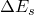) is computed as 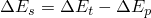, where 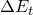 is the incremental change in total strain energy and 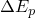 is the incremental change in plastic energy dissipation.  is much smaller than  and  for increments in which the deformation is almost all plastic. Approximations in the calculations of  and  result in deviations from the true solutions that are insignificant compared to  and  but can be significant relative to . Typically, the elastic strain energy solution is quite accurate, but in some rare cases the approximations in the calculations of  and  can lead to a negative value reported for the elastic strain energy. These negative values are most likely to occur in an analysis that uses rate-dependent plasticity. As long as the absolute value of the elastic strain energy is very small compared to the total strain energy, a negative value for the elastic strain energy should not be considered an indication of a serious solution problem.

### Stress and strain measures

Most materials that exhibit ductile behavior (large inelastic strains) yield at stress levels that are orders of magnitude less than the elastic modulus of the material, which implies that the relevant stress and strain measures are “true” stress (Cauchy stress) and logarithmic strain. Material data for all of these models should, therefore, be given in these measures.

If you have nominal stress-strain data for a uniaxial test and the material is isotropic, a simple conversion to true stress and logarithmic plastic strain is 

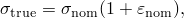

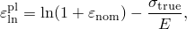

where *E* is the Young's modulus.

#### Example of stress-strain data input

The example below illustrates the input of material data for the classical metal plasticity model with isotropic hardening (["Classical metal plasticity," Section 23.2.1](pt05ch23s02abm17.md)). Stress-strain data representing the material hardening behavior are necessary to define the model. An experimental hardening curve might appear as that shown in [Figure 23.1.1--1](pt05ch23s01abo20.md#cplastic-hardening). 

**Figure 23.1.1–1** Experimental hardening curve.

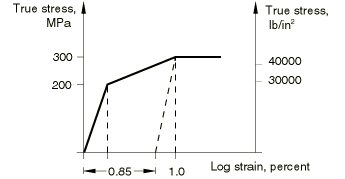

First yield occurs at 200 MPa (29000 lb/in2). The material then hardens to 300 MPa (43511 lb/in2) at one percent strain, after which it is perfectly plastic. Assuming that the Young's modulus is 200000 MPa (29  106 lb/in2), the plastic strain at the one percent strain point is .01  300/200000=.0085. When the units are newtons and millimeters, the input is

| Yield Stress | Plastic Strain |
| --- | --- |
| 200. | 0. |
| 300. | .0085 |

Plastic strain values, not total strain values, are used in defining the hardening behavior. Furthermore, the first data pair must correspond with the onset of plasticity (the plastic strain value must be zero in the first pair). These concepts are applicable when hardening data are defined in a tabular form for any of the following plasticity models: 
- ["Classical metal plasticity," Section 23.2.1](pt05ch23s02abm17.md)
- ["Models for metals subjected to cyclic loading," Section 23.2.2](pt05ch23s02abm18.md)
- ["Porous metal plasticity," Section 23.2.9](pt05ch23s02abm25.md) (isotropic hardening classical metal plasticity must be defined for use with this model)
- ["Cast iron plasticity," Section 23.2.10](pt05ch23s02abm26.md)
- ["ORNL -- Oak Ridge National Laboratory constitutive model," Section 23.2.12](pt05ch23s02abm28.md)
- ["Extended Drucker-Prager models," Section 23.3.1](pt05ch23s03abm30.md)
- ["Modified Drucker-Prager/Cap model," Section 23.3.2](pt05ch23s03abm31.md)
- ["Mohr-Coulomb plasticity," Section 23.3.3](pt05ch23s03abm32.md)
- ["Critical state (clay) plasticity model," Section 23.3.4](pt05ch23s03abm33.md)
- ["Crushable foam plasticity models," Section 23.3.5](pt05ch23s03abm34.md)
- ["Concrete smeared cracking," Section 23.6.1](pt05ch23s06abm37.md)

The input required to define hardening is discussed in the referenced sections.

#### Specifying initial equivalent plastic strains

Initial values of equivalent plastic strain can be specified in Abaqus for elements that use classical metal plasticity (["Classical metal plasticity," Section 23.2.1](pt05ch23s02abm17.md)) or Drucker-Prager plasticity (["Extended Drucker-Prager models," Section 23.3.1](pt05ch23s03abm30.md)) by defining initial hardening conditions (["Initial conditions in Abaqus/Standard and Abaqus/Explicit," Section 34.2.1](pt07ch34s02aus116.md)). The equivalent plastic strain (output variable PEEQ) then contains the initial value of equivalent plastic strain plus any additional equivalent plastic strain due to plastic straining during the analysis. However, the plastic strain tensor (output variable PE) contains only the amount of straining due to deformation during the analysis.

The simple one-dimensional example shown in [Figure 23.1.1--2](pt05ch23s01abo20.md#cplastic-equiv-pl-strain) illustrates the concept. 

**Figure 23.1.1–2** Initial equivalent plastic strain example.

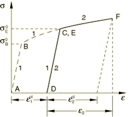

The material is in an annealed configuration at point *A*; its yield stress is 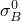. It is then hardened by loading it along the path 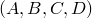; the new yield stress is 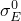. A new analysis that employs the same hardening curve as the first analysis takes this material along the path 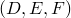, starting from point *D*, by specifying a total strain, 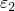. Plastic strain 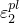 will result and can be output (for instance) using output variable PE11. To obtain the correct yield stress, , the equivalent plastic strain at point *E*, 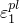, should be provided as an initial condition. Likewise, the correct yield stress at point *F* is obtained from an equivalent plastic strain PEEQ 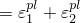.

