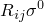
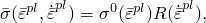
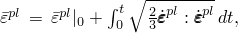

# 23.2.1 经典金属塑性


**产品：** Abaqus/Standard   Abaqus/Explicit   Abaqus/CAE   

##### **参考资料**

- ["率相关屈服，" 第23.2.3节](pt05ch23s02abm19.md)
- ["各向异性屈服/蠕变，" 第23.2.6节](pt05ch23s02abm22.md)
- ["Johnson-Cook塑性，" 第23.2.7节](pt05ch23s02abm23.md)
- [第24章，"渐进损伤与失效"](pt05ch24.md)
- ["动态失效模型，" 第23.2.8节](pt05ch23s02abm24.md)
- ["材料库：概述，" 第21.1.1节](pt05ch21s01abo18.md)
- ["非弹性行为，" 第23.1.1节](pt05ch23s01abo20.md)
- ["UHARD，" Abaqus用户子程序参考指南第1.1.36节](../sub/sub-link.md#sub-rtn-uuhard)
- [*PLASTIC](../key/key-link.md#usb-kws-mplastic)
- [*RATE DEPENDENT](../key/key-link.md#usb-kws-mratedependent)
- [*POTENTIAL](../key/key-link.md#usb-kws-mpotential)
- ["在Abaqus/CAE用户指南的"定义塑性"中定义经典金属塑性，" 第12.9.2节](../usi/usi-link.md#usi-prp-mechanical-plastic-plastic)

### 概述

经典金属塑性模型：
- 使用Mises或Hill屈服面与相关塑性流动，分别允许各向同性和各向异性屈服；
- 使用理想塑性或各向同性硬化行为；
- 可在率相关效应重要时使用；
- 适用于碰撞分析、金属成型和一般坍塌研究等应用（Abaqus中也提供了包含运动硬化的塑性模型，因此更适合涉及循环加载的情况：见["金属承受循环加载的模型，" 第23.2.2节](pt05ch23s02abm18.md)）；
- 可用于任何使用具有位移自由度的单元的过程；
- 可用于完全耦合温度-位移分析（["完全耦合热应力分析，" 第6.5.3节](pt03ch06s05at19.md)）、完全耦合热-电-结构分析（["完全耦合热-电-结构分析，" 第6.7.4节](pt03ch06s07at23.md)）或绝热热应力分析（["绝热分析，" 第6.5.4节](pt03ch06s05at20.md)），使得塑性耗散导致材料加热；
- 可与Abaqus中的渐进损伤和失效模型结合使用（["韧性金属的损伤与失效：概述，" 第24.2.1节](pt05ch24s02abm41.md)）以指定不同的损伤起始标准和损伤演化规律，允许材料刚度的渐进退化和从网格中移除单元；
- 可与Abaqus/Explicit中的剪切失效模型结合使用，以提供简单的韧性动态失效标准，允许从网格中移除单元，尽管通常建议使用上面讨论的渐进损伤和失效方法；
- 可与Abaqus/Explicit中的拉伸失效模型结合使用，以提供拉伸散裂标准，提供多种失效选择并从网格中移除单元；并且
- 必须与线弹性材料模型（["线弹性行为，" 第22.2.1节](pt05ch22s02abm02.md)）或状态方程材料模型（["状态方程，" 第25.2.1节](pt05ch25s02abm50.md)）结合使用。

### 屈服面

Mises和Hill屈服面假设金属的屈服与等效压力应力无关：对于大多数金属（在正压力应力下），这一观察结果得到了实验证实，但在高静水张力条件下可能不准确，此时材料中可能出现空隙成核和生长。这种条件可能出现在裂纹尖端的应力场和一些极端热加载情况下（如焊接过程中可能发生的情况）。Abaqus为这种情况提供了多孔金属塑性模型。该模型在["多孔金属塑性，" 第23.2.9节](pt05ch23s02abm25.md)中描述。

#### Mises屈服面

Mises屈服面用于定义各向同性屈服。它通过给出单轴屈服应力作为单轴等效塑性应变、温度和/或场变量的函数值来定义。在Abaqus/Standard中，屈服应力也可以通过用户子程序 [`UHARD`](../sub/sub-link.md#sub-xsl-uhard) 定义。

| **输入文件用法：** | ``` [*PLASTIC](../key/key-link.md#usb-kws-mplastic) ``` |
| --- | --- |

| **Abaqus/CAE用法：** | 属性模块：材料编辑器：****Mechanical****Plasticity****Plastic**** |
| --- | --- |

#### Hill屈服面

Hill屈服面允许建模各向异性屈服。您必须为金属塑性模型指定参考屈服应力 ，并单独定义一组屈服比 。这些数据定义对应于每个应力分量的屈服应力为 。Hill势函数在["各向异性屈服/蠕变，" 第23.2.6节](pt05ch23s02abm22.md)中详细讨论。屈服比可用于定义与薄金属成型相关的三种常见各向异性形式：横向各向异性、平面各向异性和一般各向异性。

| **输入文件用法：** | 使用以下两个选项： |
| --- | --- |
|  | ``` [*PLASTIC](../key/key-link.md#usb-kws-mplastic)* (指定参考屈服应力 )* [*POTENTIAL](../key/key-link.md#usb-kws-mpotential)* (指定屈服比 )* ``` |

| **Abaqus/CAE用法：** | 属性模块：材料编辑器：****Mechanical****Plasticity****Plastic****: ****Suboptions****Potential**** |
| --- | --- |

### 硬化

在Abaqus中，可以定义理想塑性材料（无硬化），也可以指定加工硬化。各向同性硬化（包括Johnson-Cook硬化）在Abaqus/Standard和Abaqus/Explicit中都可用。此外，Abaqus为承受循环加载的材料提供运动硬化。

#### 理想塑性

理想塑性意味着屈服应力不随塑性应变变化。它可以以表格形式定义，适用于一系列温度和/或场变量；每个温度和/或场变量指定一个屈服应力值以指定屈服的开始。

| **输入文件用法：** | ``` [*PLASTIC](../key/key-link.md#usb-kws-mplastic) ``` |
| --- | --- |

| **Abaqus/CAE用法：** | 属性模块：材料编辑器：****Mechanical****Plasticity****Plastic**** |
| --- | --- |

#### 各向同性硬化

各向同性硬化意味着屈服面在所有方向上均匀改变大小，使得当塑性应变发生时，屈服应力在所有应力方向上增加（或减少）。Abaqus提供了一个各向同性硬化模型，适用于涉及整体塑性应变的情况，或者应变在分析过程中在应变空间中基本上沿相同方向进行的情况。尽管该模型被称为"硬化"模型，但可以定义应变软化或先硬化后软化。各向同性硬化塑性在["各向同性弹塑性，" Abaqus理论指南第4.3.2节](../stm/stm-link.md#stm-mat-isoelastoplast)中有更详细的讨论。

如果定义各向同性硬化，屈服应力  可以作为塑性应变以及温度和/或其他预定义场变量的表格函数给出。在给定状态下的屈服应力只是从该数据表进行插值得到的，对于超过表格数据最后给出的塑性应变值，它保持不变。

Abaqus/Explicit将把数据正则化为以自变量偶数间隔定义的表。在某些情况下，当屈服应力在自变量（塑性应变）的不均匀间隔上定义且自变量的范围相对于最小间隔较大时，Abaqus/Explicit可能无法在合理数量的间隔中获得准确的数据正则化。在这种情况下，程序将在处理完所有数据后停止，并发出错误消息，您必须重新定义材料数据。见["材料数据定义，" 第21.1.2节](pt05ch21s01aus109.md)，获取数据正则化的更详细讨论。

| **输入文件用法：** | ``` [*PLASTIC](../key/key-link.md#usb-kws-mplastic), HARDENING=ISOTROPIC (默认，如果省略参数) ``` |
| --- | --- |

| **Abaqus/CAE用法：** | 属性模块：材料编辑器：****Mechanical****Plasticity****Plastic****: **Hardening: Isotropic** |
| --- | --- |

#### Johnson-Cook各向同性硬化

Johnson-Cook硬化是一种特殊类型的各向同性硬化，其中屈服应力作为等效塑性应变、应变率和温度的解析函数给出。这种硬化规律适用于建模包括大多数金属在内的高速率变形。Hill势函数（见["各向异性屈服/蠕变，" 第23.2.6节](pt05ch23s02abm22.md)）不能与Johnson-Cook硬化结合使用。更多详情见["Johnson-Cook塑性，" 第23.2.7节](pt05ch23s02abm23.md)。

| **输入文件用法：** | ``` [*PLASTIC](../key/key-link.md#usb-kws-mplastic), HARDENING=JOHNSON COOK ``` |
| --- | --- |

| **Abaqus/CAE用法：** | 属性模块：材料编辑器：****Mechanical****Plasticity****Plastic****: **Hardening: Johnson-Cook** |
| --- | --- |

#### 用户子程序

在Abaqus/Standard中，各向同性硬化的屈服应力  也可以通过用户子程序 [`UHARD`](../sub/sub-link.md#sub-xsl-uhard) 描述。

| **输入文件用法：** | ``` [*PLASTIC](../key/key-link.md#usb-kws-mplastic), HARDENING=USER ``` |
| --- | --- |

| **Abaqus/CAE用法：** | 属性模块：材料编辑器：****Mechanical****Plasticity****Plastic****: **Hardening: User** |
| --- | --- |

#### 运动硬化

Abaqus提供了两种运动硬化模型来建模金属的循环加载。线性运动模型用恒定硬化率近似硬化行为。更一般的非线性各向同性/运动组合模型将提供更好的预测，但需要更详细的校准。更多详情见["金属承受循环加载的模型，" 第23.2.2节](pt05ch23s02abm18.md)。

| **输入文件用法：** | 使用以下选项指定线性运动模型： |
| --- | --- |
|  | ``` [*PLASTIC](../key/key-link.md#usb-kws-mplastic), HARDENING=KINEMATIC ``` 使用以下选项指定非线性组合各向同性/运动模型： ``` [*PLASTIC](../key/key-link.md#usb-kws-mplastic), HARDENING=COMBINED ``` |

| **Abaqus/CAE用法：** | 属性模块：材料编辑器：****Mechanical****Plasticity****Plastic****: **Hardening: Kinematic** or **Combined** |
| --- | --- |

### 流动规则

Abaqus使用相关塑性流动。因此，当材料屈服时，非弹性变形率方向与屈服面法线方向相同（塑性变形是体积不变的）。这个假设对于大多数金属计算通常是可以接受的；最明显不适用的情形是对金属板中塑性流动局部化的详细研究，因为板会形成纹理并最终撕裂。只要这些效应的细节不重要（或可以从不太详细的标准推断，例如达到以应变定义的成型极限），Abaqus中使用平滑Mises或Hill屈服面的相关流动模型通常可以准确预测行为。

### 率相关性

随着应变率的增加，许多材料表现出屈服强度的增加。当应变率在0.1到每秒1之间时，这个效应对许多金属变得重要；当应变率在每秒10到100之间时，这可能非常重要，这是高能动态事件或制造过程的特征。

有多种方法可以引入应变率相关屈服应力。

#### 直接表格数据

测试数据可以作为不同等效塑性应变率下屈服应力值与等效塑性应变的表格提供（）；每个应变率一个表。直接表格数据不能与Johnson-Cook硬化结合使用。管理此数据输入的指南在["率相关屈服，" 第23.2.3节](pt05ch23s02abm19.md)中提供。

| **输入文件用法：** | ``` [*PLASTIC](../key/key-link.md#usb-kws-mplastic), RATE= ``` |
| --- | --- |

| **Abaqus/CAE用法：** | 属性模块：材料编辑器：****Mechanical****Plasticity****Plastic****: **Use strain-rate-dependent data** |
| --- | --- |

#### 屈服应力比

或者，您可以通过缩放函数指定应变率相关性。在这种情况下，您只输入一条硬化曲线，即静态硬化曲线，然后将率相关硬化曲线表示为静态关系的形式；即，我们假设



其中  是静态屈服应力， 是等效塑性应变， 是等效塑性应变率，R是一个比值，定义为在  时的 。此方法在["率相关屈服，" 第23.2.3节](pt05ch23s02abm19.md)中有进一步描述。

| **输入文件用法：** | 使用以下两个选项： |
| --- | --- |
|  | ``` [*PLASTIC](../key/key-link.md#usb-kws-mplastic)* (指定静态屈服应力 )* [*RATE DEPENDENT](../key/key-link.md#usb-kws-mratedependent)* (指定比值 )* ``` |

| **Abaqus/CAE用法：** | 属性模块：材料编辑器：****Mechanical****Plasticity****Plastic****: ****Suboptions****Rate Dependent**** |
| --- | --- |

#### 用户子程序

在Abaqus/Standard中，用户子程序 [`UHARD`](../sub/sub-link.md#sub-xsl-uhard) 可用于定义率相关屈服应力。您提供当前等效塑性应变和等效塑性应变率，负责返回屈服应力和导数。

| **输入文件用法：** | ``` [*PLASTIC](../key/key-link.md#usb-kws-mplastic), HARDENING=USER ``` |
| --- | --- |

| **Abaqus/CAE用法：** | 属性模块：材料编辑器：****Mechanical****Plasticity****Plastic****: **Hardening: User** |
| --- | --- |

### 渐进损伤和失效

在Abaqus中，金属塑性材料模型可以与["韧性金属的损伤与失效：概述，" 第24.2.1节](pt05ch24s02abm41.md)中讨论的渐进损伤和失效模型结合使用。该能力允许指定一个或多个损伤起始标准，包括韧性、剪切、成型极限图（FLD）、成型极限应力图（FLSD）、Mschenborn-Sonne成型极限图（MSFLD），以及Abaqus/Explicit中的Marciniak-Kuczynski（M-K）标准。损伤起始后，材料刚度根据指定的损伤演化响应进行渐进退化。该模型提供两种失效选择，包括由于结构撕裂或扯裂而从网格中移除单元。渐进损伤模型允许材料刚度的平滑退化，使它们适用于准静态和动态情况。与下面讨论的动态失效模型相比，这是一个很大的优势。

| **输入文件用法：** | 使用以下选项： |
| --- | --- |
|  | ``` [*PLASTIC](../key/key-link.md#usb-kws-mplastic) [*DAMAGE INITIATION](../key/key-link.md#usb-kws-mdamageinitiation) [*DAMAGE EVOLUTION](../key/key-link.md#usb-kws-mdamageevolution) ``` |

| **Abaqus/CAE用法：** | 属性模块：材料编辑器：****Mechanical****Damage for Ductile Metals*****criterion*****: ****Suboptions****Damage Evolution**** |
| --- | --- |

### Abaqus/Explicit中的剪切和拉伸动态失效

在Abaqus/Explicit中，金属塑性材料模型可以与适用于真正动态情况的剪切和拉伸失效模型（["动态失效模型，" 第23.2.8节](pt05ch23s02abm24.md)）结合使用；但是，通常更倾向于使用上面讨论的渐进损伤和失效模型。

#### 剪切失效

剪切失效模型提供了一个简单的失效标准，适用于包括大多数金属在内的高应变率变形。它提供两种失效选择，包括由于结构撕裂或扯裂而从网格中移除单元。剪切失效标准基于等效塑性应变值，主要适用于高应变率真正的动态问题。更多详情见["动态失效模型，" 第23.2.8节](pt05ch23s02abm24.md)。

| **输入文件用法：** | 使用以下两个选项： |
| --- | --- |
|  | ``` [*PLASTIC](../key/key-link.md#usb-kws-mplastic) [*SHEAR FAILURE](../key/key-link.md#usb-kws-mshearfailure) ``` |

| **Abaqus/CAE用法：** | 剪切失效模型在Abaqus/CAE中不受支持。 |
| --- | --- |

#### 拉伸失效

拉伸失效模型使用静水压力应力作为失效度量来建模动态散裂或压力截止。它提供多种失效选择，包括单元移除。与剪切失效模型类似，拉伸失效模型适用于金属的高应变率变形，适用于真正的动态问题。更多详情见["动态失效模型，" 第23.2.8节](pt05ch23s02abm24.md)。

| **输入文件用法：** | 使用以下两个选项： |
| --- | --- |
|  | ``` [*PLASTIC](../key/key-link.md#usb-kws-mplastic) [*TENSILE FAILURE](../key/key-link.md#usb-kws-mtensilefailure) ``` |

| **Abaqus/CAE用法：** | 拉伸失效模型在Abaqus/CAE中不受支持。 |
| --- | --- |

### 塑性功产生的热量

Abaqus可选地允许塑性耗散导致材料加热。热量生成通常用于整体金属成型或涉及大量非弹性应变的高速制造过程的模拟，其中材料因变形而产生的加热由于材料特性的温度依赖性而成为重要效应。它仅适用于绝热热应力分析（["绝热分析，" 第6.5.4节](pt03ch06s05at20.md)）、完全耦合温度-位移分析（["完全耦合热应力分析，" 第6.5.3节](pt03ch06s05at19.md)）或完全耦合热-电-结构分析（["完全耦合热-电-结构分析，" 第6.7.4节](pt03ch06s07at23.md)）。

此效应通过定义每体积热通量的非弹性耗散率分数来引入。

| **输入文件用法：** | 在同一材料数据块中使用以下所有选项： |
| --- | --- |
|  | ``` [*PLASTIC](../key/key-link.md#usb-kws-mplastic) [*SPECIFIC HEAT](../key/key-link.md#usb-kws-mspecificheat) [*DENSITY](../key/key-link.md#usb-kws-mdensity) [*INELASTIC HEAT FRACTION](../key/key-link.md#usb-kws-minelastheatfrac) ``` |

| **Abaqus/CAE用法：** | 对同一材料使用以下所有选项： |
| --- | --- |
|  | 属性模块：材料编辑器：****Mechanical****Plasticity****Plastic********Thermal****Specific Heat********General****Density********Thermal****Inelastic Heat Fraction**** |

### 初始条件

当我们需要研究已经承受了一些加工硬化的材料的行为时，可以提供初始等效塑性应变值来指定对应于加工硬化状态的屈服应力（见["Abaqus/Standard和Abaqus/Explicit中的初始条件，" 第34.2.1节](pt07ch34s02aus116.md)）。

| **输入文件用法：** | ``` [*INITIAL CONDITIONS](../key/key-link.md#usb-kws-minitialcond), TYPE=HARDENING ``` |
| --- | --- |

| **Abaqus/CAE用法：** | 加载模块：**Create Predefined Field**: **Step: Initial**，为**Category**选择**Mechanical**，为**Types for Selected Step**选择**Hardening** |
| --- | --- |

#### Abaqus/Standard中的用户子程序规范

对于更复杂的情况，初始条件可以通过用户子程序 [`HARDINI`](../sub/sub-link.md#sub-xsl-hardini) 在Abaqus/Standard中定义。

| **输入文件用法：** | ``` [*INITIAL CONDITIONS](../key/key-link.md#usb-kws-minitialcond), TYPE=HARDENING, USER ``` |
| --- | --- |

| **Abaqus/CAE用法：** | 加载模块：**Create Predefined Field**: **Step: Initial**，为**Category**选择**Mechanical**，为**Types for Selected Step**选择**Hardening**；**Definition: User-defined** |
| --- | --- |

### 单元

经典金属塑性可用于任何包含力学行为的单元（具有位移自由度的单元）。

### 输出

除了Abaqus中可用的标准输出标识符（["Abaqus/Standard输出变量标识符，" 第4.2.1节](pt02ch04s02abv01.md) 和 ["Abaqus/Explicit输出变量标识符，" 第4.2.2节](pt02ch04s02xbv01.md)），以下变量对经典金属塑性模型具有特殊含义：

| PEEQ | 等效塑性应变，，其中  是初始等效塑性应变（零或用户指定；见["初始条件](pt05ch23s02abm17.md#usb-mat-cmetalplastic-initialcond)"）。 |
| --- | --- |

| YIELDS | 屈服应力，。 |
| --- | --- |


