# 23.2.2 金属承受循环加载的模型


**产品：** Abaqus/Standard   Abaqus/Explicit   Abaqus/CAE   

##### **参考资料**

- ["材料库：概述，" 第21.1.1节](pt05ch21s01abo18.md)
- ["非弹性行为，" 第23.1.1节](pt05ch23s01abo20.md)
- ["各向异性屈服/蠕变，" 第23.2.6节](pt05ch23s02abm22.md)
- ["UHARD，" Abaqus用户子程序参考指南第1.1.36节](../sub/sub-link.md#sub-rtn-uuhard)
- [*CYCLIC HARDENING](../key/key-link.md#usb-kws-mcyclichardening)
- [*PLASTIC](../key/key-link.md#usb-kws-mplastic)
- [*POTENTIAL](../key/key-link.md#usb-kws-mpotential)
- ["在Abaqus/CAE用户指南的"定义塑性"中定义经典金属塑性，" 第12.9.2节](../usi/usi-link.md#usi-prp-mechanical-plastic-plastic)

### 概述

运动硬化模型：
- 用于模拟承受循环加载的材料非弹性行为；
- 包括线性运动硬化模型和非线性各向同性/运动硬化模型；
- 包括具有多个背应力的非线性各向同性/运动硬化模型；
- 可用于任何使用具有位移自由度的单元的过程；
- 在Abaqus/Standard中不能用于绝热分析，非线性各向同性/运动硬化模型不能用于耦合温度-位移分析；
- 可用于建模率相关屈服；
- 可与蠕变和膨胀结合使用（在Abaqus/Standard中）；并且
- 需要使用线弹性材料模型来定义响应的弹性部分。

### 屈服面

用于建模承受循环加载的金属行为的运动硬化模型是压力无关塑性模型；换句话说，金属的屈服与等效压力应力无关。这些模型适用于承受循环加载条件的大多数金属，除了多孔金属。线性运动硬化模型可用于Mises或Hill屈服面。非线性各向同性/运动模型在Abaqus/Standard中只能与Mises屈服面一起使用，在Abaqus/Explicit中可与Mises或Hill屈服面一起使用。压力无关屈服面由以下函数定义

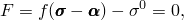

其中  是屈服应力， 是关于背应力  的等效Mises应力或Hill势。例如，等效Mises应力定义为

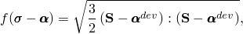

其中 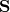 是偏应力张量（定义为 ，其中  是应力张量，p是等效压力应力， 是单位张量）， 是背应力张量的偏部分。

### 流动规则

运动硬化模型假设相关塑性流动：

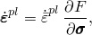

其中  是塑性流动率， 是等效塑性应变率。等效塑性应变的演化从以下等效塑性功表达式获得：

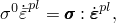

对于各向同性Mises塑性得到 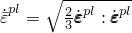。只要微观细节（如金属组件由于循环疲劳载荷而破裂时发生的塑性流动局部化）不重要，相关塑性流动的假设对于承受循环加载的金属是可接受的。

### 硬化

线性运动硬化模型具有恒定硬化模量，非线性各向同性/运动硬化模型同时具有非线性运动和 nonlinear isotropic硬化分量。

#### 线性运动硬化模型

该模型的演化定律包括一个线性运动硬化分量，描述屈服面在应力空间中通过背应力的平移 。当忽略温度依赖性时，这个演化定律是线性Ziegler硬化定律

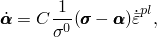

其中  是等效塑性应变率，C是运动硬化模量。在该模型中，定义屈服面大小的等效应力  保持不变，，其中  是零塑性应变时定义屈服面大小的等效应力。

#### 非线性各向同性/运动硬化模型

该模型的演化定律由两个分量组成：一个非线性运动硬化分量，描述屈服面在应力空间中通过背应力的平移 ；和一个各向同性硬化分量，描述定义屈服面大小的等效应力  随塑性变形的演化。

运动硬化分量被定义为一个纯运动项（线性Ziegler硬化定律）和一个松弛项（*recall*项）的加法组合，它引入非线性。此外，可以叠加几个运动硬化分量（背应力），这可能在某些情况下显著改善结果。当忽略温度和场变量依赖性时，每个背应力的硬化定律为

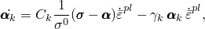

总体背应力由以下关系计算

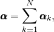

其中  是背应力的数量， 和 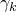 是必须从循环测试数据校准的材料参数。 是初始运动硬化模量， 决定运动硬化模量随塑性变形增加而减小的速率。运动硬化定律可以分离为偏部分和静水部分；只有偏部分对材料行为有影响。当  和  为零时，模型简化为各向同性硬化模型。当所有  等于零时，恢复线性Ziegler硬化定律。材料参数的校准在下面的["运动硬化模型的使用和校准](pt05ch23s02abm18.md#usb-mat-usagecalibration)"中讨论。[图23.2.2--1](pt05ch23s02abm18.md#chardening-comb-backstresses-eqplstrain) 显示了具有三个背应力的非线性运动硬化的示例。

**图23.2.2–1** 具有三个背应力的运动硬化模型。

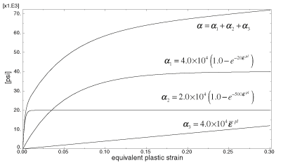

每个背应力覆盖不同的应变范围，对于大应变保持线性硬化定律。

模型的各向同性硬化行为定义了屈服面大小  随等效塑性应变  的演化。可以通过以表格形式直接将  指定为  的函数，在用户子程序 [`UHARD`](../sub/sub-link.md#sub-xsl-uhard) 中指定 （仅在Abaqus/Standard中），或使用简单指数定律


其中  是零塑性应变时的屈服应力， 和 *b* 是材料参数。 是屈服面大小的最大变化，*b* 定义屈服面大小随塑性应变发展而变化的速率。当定义屈服面大小的等效应力保持恒定（）时，模型简化为非线性运动硬化模型。

[图23.2.2--2](pt05ch23s02abm18.md#chardening-comb-1d-rep) 示出了单向加载时运动和各向同性硬化分量的演化，[图23.2.2--3](pt05ch23s02abm18.md#chardening-comb-3d-rep) 示出了多轴加载时的情况。运动硬化分量的演化定律意味着背应力包含在半径为 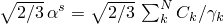 的圆柱内，其中  是饱和时（大使性应变） 的大小。它还意味着任何应力点必须位于半径为 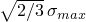 的圆柱内（使用[图23.2.2--2](pt05ch23s02abm18.md#chardening-comb-1d-rep) 的符号），因为屈服面保持有界。在大使性应变下，任何应力点都包含在半径为 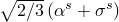 的圆柱内，其中 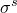 是大使性应变时定义屈服面大小的等效应力。如果为各向同性分量提供了表格数据， 是定义屈服面大小的最后给出的值。如果使用用户子程序 [`UHARD`](../sub/sub-link.md#sub-xsl-uhard)，该值将取决于您的实现；否则，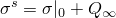。

**图23.2.2–2** 非线性各向同性/运动硬化模型中硬化的二维表示。


**图23.2.2–3** 非线性各向同性/运动硬化模型中硬化的三维表示。

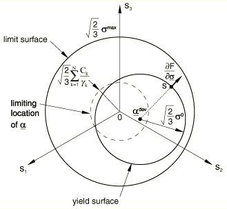

### 预测的材料行为

在运动硬化模型中，由于运动硬化分量，屈服面的中心在应力空间中移动。此外，当使用非线性各向同性/运动硬化模型时，屈服面范围可能由于各向同性分量而扩大或收缩。这些特性允许建模承受循环载荷或温度的金属的非弹性变形，导致显著的塑性变形，可能还有低循环疲劳失效。这些模型考虑了以下现象：

**Bauschinger效应**：这种效应的特征是在初始加载期间发生塑性变形后，在载荷反转时屈服应力降低。这种现象随着持续循环而减少。线性运动硬化分量考虑了这种效应，但非线性分量改善了循环的形状。使用具有多个背应力的非线性模型可以进一步改善循环的形状。

**具有塑性安定化的循环硬化**：这种现象是对称应力或应变控制实验的特征。软或退火金属倾向于硬化到稳定极限，而初始硬化的金属倾向于软化。[图23.2.2--4](pt05ch23s02abm18.md#chardening-shakedown) 说明了在规定对称应变循环下硬化的金属的行为。

**图23.2.2–4** 塑性安定化。

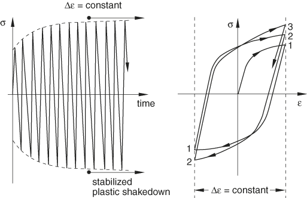

单独使用的模型的运动硬化分量预测一次应力循环后的塑性安定化。各向同性分量与非线性运动分量的组合预测几次循环后的安定化。

**棘轮效应**：应力之间不对称循环在指定限制内将导致沿平均应力方向的渐进"蠕变"或"棘轮"（[图23.2.2--5](pt05ch23s02abm18.md#chardening-ratchetting)）。

**图23.2.2–5** 棘轮效应。

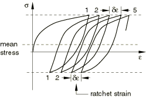

通常，瞬态棘轮效应随后在低平均应力下稳定（零棘轮应变），而在高平均应力下观察到累积棘轮应变的恒定增加。单独使用非线性运动硬化分量（没有各向同性硬化分量）预测恒定棘轮应变。通过添加各向同性硬化来改善棘轮效应的预测，在这种情况下棘轮应变可能减小直到变为恒定。然而，一般来说，具有单个背应力的非线性硬化模型预测过于显著的棘轮效应。通过叠加几个运动硬化模型（背应力）可以实现建模棘轮效应的显著改善，并选择一个模型为线性或近似线性（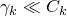），这将导致不太显著的棘轮效应。

**平均应力松弛**：这种现象是不对称应变实验的特征，如[图23.2.2--6](pt05ch23s02abm18.md#chardening-mean-st-relax)所示。

**图23.2.2–6** 平均应力松弛。

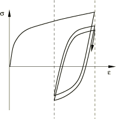

随着循环次数的增加，平均应力趋于零。非线性各向同性/运动硬化模型的非线性运动硬化分量考虑了这个行为。

#### 局限性

如上所述，线性运动模型是一个简单模型，只对承受循环加载的金属行为给出第一近似。非线性各向同性/运动硬化模型可以在许多涉及循环加载的情况下提供更准确的结果，但它仍然具有以下局限性：
- 各向同性硬化在所有应变范围内是相同的。然而，物理观察表明，各向同性硬化的量取决于应变范围的幅度。此外，如果试样在两个不同的应变范围内循环，一个接着另一个，第一个循环中的变形会影响第二个循环中的各向同性硬化。因此，该模型只是实际循环行为的粗略近似。应该根据应用中重要的预期应变循环的大小进行校准。
- 对于比例和非比例加载循环预测相同的循环硬化行为。物理观察表明，承受非比例加载的材料的循环硬化行为可能与相似应变幅度的单轴行为非常不同。

例题["简单比例和非比例循环测试，" Abaqus基准指南第3.2.8节](../bmk/bmk-link.md#bmk-mat-cyclictests)、["循环加载下的缺口梁，" Abaqus例题指南第1.1.7节](../exa/exa-link.md#exa-sta-cyclicnotchedbeam)和["拉伸和压缩下的单轴棘轮，" Abaqus例题指南第1.1.8节](../exa/exa-link.md#exa-sta-ratchetting)说明了具有塑性安定化的循环硬化、棘轮效应和非线性各向同性/运动硬化模型的平均应力松弛现象及其局限性。

### 运动硬化模型的使用和校准

线性运动模型用恒定硬化率近似硬化行为。这个硬化率应该与在对应于应用中预期的应变范围内的稳定循环中测量的平均硬化率相匹配。稳定循环是通过在固定应变范围内循环直到达到稳态条件获得的；即，直到应力-应变曲线不再从一次循环改变到下一次。更通用的非线性模型将提供更好的预测，但需要更详细的校准。

#### 线性运动硬化模型

从半循环单向拉伸或压缩实验获得的测试数据必须线性化，因为这个简单模型只能预测线性硬化。数据通常基于在覆盖与应用中预期发生的应变范围相对应的应变范围内的应变循环的稳定行为的测量。Abaqus期望您只提供两个数据对来定义这种线性行为：零塑性应变时的屈服应力  和有限塑性应变值  时的屈服应力 。线性运动硬化模量C从以下关系确定

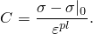

您可以提供多组两个数据对作为温度的函数，以定义线性运动硬化模量随温度的变化。如果该模型需要Hill屈服面，您必须单独指定一组屈服比 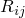（有关如何指定屈服比的信息，见["各向异性屈服/蠕变，" 第23.2.6节](pt05ch23s02abm22.md)）。

该模型仅对相对较小的应变（小于5%）给出物理上合理的结果。

| **输入文件用法：** | ``` [*PLASTIC](../key/key-link.md#usb-kws-mplastic), HARDENING=KINEMATIC ``` |
| --- | --- |

| **Abaqus/CAE用法：** | 属性模块：材料编辑器：****Mechanical****Plasticity****Plastic****: **Hardening: Kinematic** |
| --- | --- |

#### 非线性各向同性/运动硬化模型

定义屈服面大小的等效应力  随等效塑性应变  的演化定义了模型的各向同性硬化分量。您可以通过指数定律或直接以表格形式定义这个各向同性硬化分量。如果屈服面在整个加载过程中保持固定，则不需要定义它。在Abaqus/Explicit中，如果该模型需要Hill屈服面，您必须单独指定一组屈服比 （有关如何指定屈服比的信息，见["各向异性屈服/蠕变，" 第23.2.6节](pt05ch23s02abm22.md)）。Hill屈服面不能与Abaqus/Standard中的该模型结合使用。

材料参数  和  决定模型的运动硬化分量。Abaqus提供了三种不同的方式来为模型的运动硬化分量提供数据：可以直接指定参数  和 ，可以给出半循环测试数据，或者可以给出从稳定循环获得的测试数据。校准模型所需的实验如下所述。

##### 通过指数定律定义各向同性硬化分量

如果已经从测试数据校准，则直接指定指数定律 、 和 *b* 的材料参数。这些参数可以指定为温度和/或场变量的函数。

| **输入文件用法：** | ``` [*CYCLIC HARDENING](../key/key-link.md#usb-kws-mcyclichardening), PARAMETERS ``` |
| --- | --- |

| **Abaqus/CAE用法：** | 属性模块：材料编辑器：****Mechanical****Plasticity****Plastic****: ****Suboptions****Cyclic Hardening****: toggle on **Use parameters**. |
| --- | --- |

##### 通过表格数据定义各向同性硬化分量

可以通过将定义屈服面大小的等效应力  指定为等效塑性应变  的表格函数来引入各向同性硬化。获取这些数据的最简单方法是进行具有应变范围 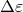 的对称应变控制循环实验。由于材料的弹性模量相对于其硬化模量较大，该实验可以近似解释为在相同塑性应变范围 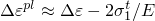 上的重复循环（使用[图23.2.2--7](pt05ch23s02abm18.md#chardening-sym-str-exa) 的符号，其中E是材料的杨氏模量）。

**图23.2.2–7** 对称应变循环实验。

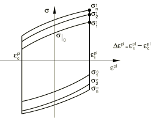

定义屈服面大小的等效应力在零等效塑性应变时为 ；对于峰值拉伸应力点，通过从屈服应力中分离运动分量获得（见[图23.2.2--2](pt05ch23s02abm18.md#chardening-comb-1d-rep)），为

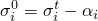

对于每个循环i，其中 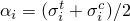。由于模型预测在特定应变水平下每次循环大致相同的背应力值，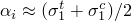。对应于  的等效塑性应变为

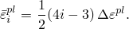

数据对（、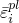），包括零等效塑性应变时的值 ，以表格形式指定。定义屈服面大小的表格值应该为材料可能承受的整个等效塑性应变范围提供。数据可以作为温度和/或场变量的函数提供。

为了获得准确的循环硬化数据（如低循环疲劳计算所需的那样），校准实验应该在与分析中预期的应变范围相对应的应变范围  下进行，因为材料模型不会预测不同应变范围下的不同各向同性硬化行为。此限制还意味着，即使组件由相同材料制成，也可能必须将其分为具有不同硬化属性的多个区域，对应于不同的预期应变范围。场变量和这些属性的场变量依赖性也可以用于此目的。

Abaqus允许在非线性各向同性/运动硬化模型的各向同性分量中指定应变率效应。率相关各向同性硬化数据可以通过将定义屈服面大小的等效应力  指定为不同等效塑性应变率  值下等效塑性应变  的表格函数来定义。

| **输入文件用法：** | 使用以下选项用表格数据定义各向同性硬化： |
| --- | --- |
|  | ``` [*CYCLIC HARDENING](../key/key-link.md#usb-kws-mcyclichardening) ``` 使用以下选项用表格数据定义率相关各向同性硬化： ``` [*CYCLIC HARDENING](../key/key-link.md#usb-kws-mcyclichardening), RATE= ``` |

| **Abaqus/CAE用法：** | 属性模块：材料编辑器：****Mechanical****Plasticity****Plastic****: **Hardening: Combined**: ****Suboptions****Cyclic Hardening**** |
| --- | --- |

##### 在Abaqus/Standard中的用户子程序中定义各向同性硬化分量

在用户子程序 [`UHARD`](../sub/sub-link.md#sub-xsl-uhard) 中直接指定 。 可能依赖于等效塑性应变和温度。如果运动硬化分量使用半循环测试数据指定，则不能使用此方法。

| **输入文件用法：** | ``` [*CYCLIC HARDENING](../key/key-link.md#usb-kws-mcyclichardening), USER ``` |
| --- | --- |

| **Abaqus/CAE用法：** | 您不能在Abaqus/CAE中的用户子程序 [`UHARD`](../sub/sub-link.md#sub-xsl-uhard) 中定义各向同性硬化分量。 |
| --- | --- |

##### 通过直接指定材料参数来定义运动硬化分量

如果已经从测试数据校准，参数  和  可以直接指定为温度和/或场变量的函数。当  依赖温度和/或场变量时，模型在热机械加载下的响应通常将依赖于材料点经历的温度和/或场变量的*历史*。这种对温度历史的依赖很小，随塑性变形的增加而消失。但是，如果不需要此效应，应指定  的常数值，使材料响应完全独立于温度和场变量的历史。当前用于积分非线性各向同性/运动硬化模型的算法在  的值由于温度和/或场变量依赖性在增量中适度变化时提供准确解；但是，如果  的值在增量中突然变化，此算法可能无法以足够的精度提供解。

| **输入文件用法：** | ``` [*PLASTIC](../key/key-link.md#usb-kws-mplastic), HARDENING=COMBINED, DATA TYPE=PARAMETERS, NUMBER BACKSTRESSES=*n* ``` |
| --- | --- |

| **Abaqus/CAE用法：** | 属性模块：材料编辑器：****Mechanical****Plasticity****Plastic****: **Hardening: Combined**, **Data type: Parameters**, **Number of backstresses**: *n* |
| --- | --- |

##### 通过指定半循环测试数据来定义运动硬化分量

如果有有限的测试数据可用， 和  可以基于从单向拉伸或压缩实验的第一次半循环获得的应力-应变数据。这种测试数据的实例如[图23.2.2--8](pt05ch23s02abm18.md#chardening-half-cycle)所示。当模拟只涉及少数加载循环时，这种方法通常是适当的。

**图23.2.2–8** 半循环应力-应变数据。

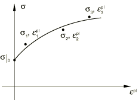

对于每个数据点（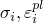），从测试数据中获得  的值（ 是通过对该数据点处的所有背应力求和获得的总体背应力）为

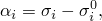

其中 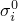 是对于各向同性硬化分量在相应塑性应变时用户定义的屈服面大小，或者如果未定义各向同性硬化分量，则是初始屈服应力。

背应力演化定律在半循环上的积分产生表达式

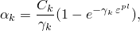

用于校准  和 。

当测试数据作为温度和/或场变量的函数给出时，Abaqus确定多组材料参数（、、...、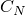、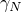），每个对应于温度和/或场变量的给定组合。通常，这导致温度历史（和/或场变量历史）依赖的材料行为，因为  的值随温度和/或场变量的变化而变化。这种对温度历史的依赖很小，随塑性变形的增加而消失。但是，您可以使用参数  的常数值使材料响应完全独立于温度和场变量的历史。这可以通过首先运行数据检查分析来实现；在数据检查期间，可以从数据文件中提供的信息确定  的适当常数值。然后可以如上所述直接输入参数  和常数参数  的值。

如果使用具有多个背应力的模型，Abaqus获得不同初始猜测值的硬化参数，并选择与提供的实验数据相关性最好的参数。但是，您应该仔细检查获得的参数。在某些情况下，在选择参数集之前获得不同数量背应力的硬化参数可能是有利的。

| **输入文件用法：** | ``` [*PLASTIC](../key/key-link.md#usb-kws-mplastic), HARDENING=COMBINED, DATA TYPE=HALF CYCLE, NUMBER BACKSTRESSES=*n* ``` |
| --- | --- |

| **Abaqus/CAE用法：** | 属性模块：材料编辑器：****Mechanical****Plasticity****Plastic****: **Hardening: Combined**, **Data type: Half Cycle**, **Number of backstresses**: *n* |
| --- | --- |

##### 通过指定来自稳定循环的测试数据来定义运动硬化分量

可以从承受对称应变循环的试样的稳定循环中获得应力-应变数据。通过在固定应变范围  上循环试样直到达到稳态条件来获得稳定循环；即，直到应力-应变曲线不再从一次循环改变到下一次。这种稳定循环如[图23.2.2--9](pt05ch23s02abm18.md#chardening-stable-cycle)所示。每个数据对（）必须与应变轴移动到 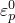 一起指定，使得

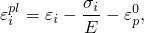

因此，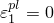。

**图23.2.2–9** 稳定循环的应力-应变数据。


对于每对（），从测试数据中获得  的值（ 是通过对该数据点处的所有背应力求和获得的总体背应力）为

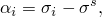

其中 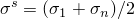 是屈服面的稳定大小。

在第一个数据对的精确匹配下（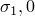），对这个单轴应变循环上的背应力演化定律进行积分，提供表达式

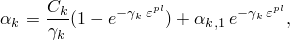

其中 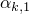 表示第一个数据点处  背应力的 （ 背应力的初始值）。上述方程使参数  和  的校准成为可能。

如果不同应变范围的应力-应变曲线形状显著不同，您可能需要获得  和  的多个校准值。可以在Abaqus中直接输入在不同应变范围获得的应力-应变曲线的表格数据。对应于每个应变范围的校准值与参数平均值一起报告在数据文件中（如果请求模型定义数据；见["控制写入数据文件的分析输入文件处理器信息量"在"输出，" 第4.1.1节](pt02ch04s01aus38.md#usb-out-ooutput-data-control)）。Abaqus将在分析中使用平均值组。这些参数可能需要调整以改善与分析中预期应变范围的测试数据的匹配。

当测试数据作为温度和/或场变量的函数给出时，Abaqus确定多组材料参数（、、...、、），每个对应于温度和/或场变量的给定组合。通常，这导致温度历史（和/或场变量历史）依赖的材料行为，因为  的值随温度和/或场变量的变化而变化。这种对温度历史的依赖很小，随塑性变形的增加而消失。但是，您可以使用参数  的常数值使材料响应完全独立于温度和场变量的历史。这可以通过首先运行数据检查分析来实现；在数据检查期间，可以从数据文件中提供的信息确定  的适当常数值。然后可以如上所述直接输入参数  和常数参数  的值。

如果使用具有多个背应力的模型，Abaqus获得不同初始猜测值的硬化参数，并选择与提供的实验数据相关性最好的参数。但是，您应该仔细检查获得的参数。在某些情况下，在选择参数集之前获得不同数量背应力的硬化参数可能是有利的。

应该通过指定零塑性应变时定义屈服面大小的等效应力，以及等效应力作为等效塑性应变函数的演化来定义各向同性硬化分量。如果未定义此分量，Abaqus将假定没有发生循环硬化，因此定义屈服面大小的等效应力恒定且等于 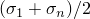（或者当提供多个应变范围时这些量的平均值）。由于此大小对应于饱和循环的大小，这不太可能提供实际行为的准确预测，特别是在初始循环中。

| **输入文件用法：** | ``` [*PLASTIC](../key/key-link.md#usb-kws-mplastic), HARDENING=COMBINED, DATA TYPE=STABILIZED, NUMBER BACKSTRESSES=*n* ``` |
| --- | --- |

| **Abaqus/CAE用法：** | 属性模块：材料编辑器：****Mechanical****Plasticity****Plastic****: **Hardening: Combined**, **Data type: Stabilized**, **Number of backstresses**: *n* |
| --- | --- |

### 初始条件

当我们需要研究已经承受了一些硬化的材料的行为时，Abaqus允许您为等效塑性应变  和背应力  规定初始条件。当使用非线性各向同性/运动硬化模型时，每个背应力  的初始条件必须满足以下条件

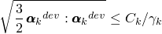

对于模型产生运动硬化响应。Abaqus允许指定违反这些条件的初始背应力。但是，在这种情况下，对应于违反条件的背应力的响应产生运动软化响应：背应力的大小随塑性变形从其初始值到饱和值而减小。如果任何背应力违反条件，则材料的整体响应不能保证产生运动硬化响应。当使用线性运动硬化模型时，背应力的初始条件没有限制。

您可以直接将  和  的初始值指定为初始条件（见["Abaqus/Standard和Abaqus/Explicit中的初始条件，" 第34.2.1节](pt07ch34s02aus116.md)）。

| **输入文件用法：** | ``` [*INITIAL CONDITIONS](../key/key-link.md#usb-kws-minitialcond), TYPE=HARDENING, NUMBER BACKSTRESSES=*n* ``` |
| --- | --- |

| **Abaqus/CAE用法：** | 加载模块：**Create Predefined Field**: **Step: Initial**，为**Category**选择**Mechanical**，为**Types for Selected Step**选择**Hardening**；**Number of backstresses**: *n* |
| --- | --- |

#### Abaqus/Standard中的用户子程序规范

对于Abaqus/Standard中更复杂的情况，可以通过用户子程序 [`HARDINI`](../sub/sub-link.md#sub-xsl-hardini) 定义初始条件。

| **输入文件用法：** | ``` [*INITIAL CONDITIONS](../key/key-link.md#usb-kws-minitialcond), TYPE=HARDENING, USER, NUMBER BACKSTRESSES=*n* ``` |
| --- | --- |

| **Abaqus/CAE用法：** | 加载模块：**Create Predefined Field**: **Step: Initial**，为**Category**选择**Mechanical**，为**Types for Selected Step**选择**Hardening**；**Definition: User-defined**, **Number of backstresses**: *n* |
| --- | --- |

### 单元

这些模型可用于Abaqus/Standard中包含力学行为的单元（具有位移自由度的单元），除了空间中的某些梁单元。空间中的梁单元，包括由扭转引起的剪切应力（即非薄壁、开截面）且不包括周向应力（即非PIPE单元）不能与非线性运动硬化模型结合使用。在Abaqus/Explicit中，运动硬化模型可用于包含力学行为的任何单元，除了当模型与Hill屈服面结合使用时的一维单元（梁、管道和桁架）。

### 输出

除了Abaqus中可用的标准输出标识符（["Abaqus/Standard输出变量标识符，" 第4.2.1节](pt02ch04s02abv01.md) 和 ["Abaqus/Explicit输出变量标识符，" 第4.2.2节](pt02ch04s02xbv01.md)），以下变量对运动硬化模型具有特殊含义：

| ALPHA | 总运动硬化平移张量分量，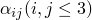。 |
| --- | --- |

| ALPHA*k* | 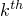 运动硬化平移张量分量（）。 |
| --- | --- |

| ALPHAN | 所有运动硬化平移张量的所有张量分量，除了总平移张量。 |
| --- | --- |

| PEEQ | 等效塑性应变，，其中  是初始等效塑性应变（零或用户指定；见["初始条件](pt05ch23s02abm18.md#usb-mat-chardening-initialcond)"）。 |
| --- | --- |

| PENER | 塑性功，定义为：。对于运动硬化模型，这个量不保证单调递增。要获得单调递增的量，需要将塑性耗散计算为：。在Abaqus/Standard中，这个量可以在用户子程序 [`UVARM`](../sub/sub-link.md#sub-xsl-uvarm) 中计算为用户定义的输出变量。 |
| --- | --- |

| YIELDS | 屈服应力，。 |
| --- | --- |


