# 23.2.4 率相关塑性：蠕变和膨胀


**产品：** Abaqus/Standard   Abaqus/CAE   

##### **参考资料**

- ["材料库：概述，" 第21.1.1节](pt05ch21s01abo18.md)
- ["非弹性行为，" 第23.1.1节](pt05ch23s01abo20.md)
- ["直接定义垫片行为，" 第32.6.6节](pt06ch32s06alm51.md)
- [*CREEP](../key/key-link.md#usb-kws-mcreep)
- [*CREEP STRAIN RATE CONTROL](../key/key-link.md#usb-kws-hcreepstrainrate)
- [*POTENTIAL](../key/key-link.md#usb-kws-mpotential)
- [*SWELLING](../key/key-link.md#usb-kws-mswelling)
- [*RATIOS](../key/key-link.md#usb-kws-mswellratios)
- ["在Abaqus/CAE用户指南的"定义塑性"中定义蠕变定律，" 第12.9.2节](../usi/usi-link.md#usi-prp-mechanical-plastic-creep)
- ["在Abaqus/CAE用户指南的"定义塑性"中定义膨胀，" 第12.9.2节](../usi/usi-link.md#usi-prp-mechanical-plastic-swelling)

### 概述

Abaqus/Standard中的经典偏量金属蠕变行为：
- 可以使用用户子程序[`CREEP`](../sub/sub-link.md#sub-xsl-creep)定义，也可以通过提供参数作为某些简单蠕变定律的输入来定义；
- 可以模拟各向同性蠕变（使用Mises应力势）或各向异性蠕变（使用Hill各向异性应力势）；
- 仅在使用耦合温度-位移过程、瞬态土壤固结过程和准静态过程时激活；
- 要求将材料的弹性定义为线性弹性行为；
- 可以修改为实现核标准NEF 9-5T"一级高温核系统组件设计指南和程序"中规定的辅助蠕变硬化规则；这些规则通过橡树岭国家实验室开发的本构模型来执行(["ORNL -- 橡树岭国家实验室本构模型，" 第23.2.12节](pt05ch23s02abm28.md))；
- 可以与蠕变应变率控制结合使用，以在蠕变应变率必须保持在一定范围内的分析中使用；并且
- 如果各向异性蠕变和塑性同时发生，可能会导致计算的蠕变应变出现错误（见下文讨论）。

Abaqus/Standard中的率相关垫片行为：
- 在垫片厚度方向行为的模型中使用单向蠕变；
- 可以使用用户子程序[`CREEP`](../sub/sub-link.md#sub-xsl-creep)定义，也可以通过提供参数作为某些简单蠕变定律的输入来定义；
- 仅在使用准静态过程时激活；并且
- 需要使用弹塑性模型来定义垫片厚度方向行为的率无关部分。

Abaqus/Standard中的体积膨胀行为：
- 可以使用用户子程序[`CREEP`](../sub/sub-link.md#sub-xsl-creep)定义或提供表格输入；
- 可以是各向同性或各向异性的；
- 仅在使用耦合温度-位移过程、瞬态土壤固结过程和准静态过程时激活；并且
- 要求将材料的弹性定义为线性弹性行为。

### 蠕变行为

蠕变行为由等效单轴行为（蠕变"定律"）指定。在实际案例中，蠕变定律通常形式非常复杂以拟合实验数据；因此，这些定律使用用户子程序[`CREEP`](../sub/sub-link.md#sub-xsl-creep)定义，如下所述。或者，在Abaqus/Standard中提供了五种常见的蠕变定律：幂律、双曲正弦律、双幂律、Anand定律和Darveaux定律。这些标准蠕变定律用于模拟二次或稳态蠕变。蠕变通过在材料模型定义中包含蠕变行为来定义(["材料数据定义，" 第21.1.2节](pt05ch21s01aus109.md))。或者，蠕变可以与垫片行为结合使用来定义垫片的率相关行为。

| **输入文件用法：** | 使用以下选项在材料模型定义中包含蠕变行为： |
| --- | --- |
|  | ``` [*MATERIAL](../key/key-link.md#usb-kws-mmaterial) [*CREEP](../key/key-link.md#usb-kws-mcreep) ``` 使用以下选项结合垫片行为定义蠕变： ``` [*GASKET BEHAVIOR](../key/key-link.md#usb-kws-mgasketbehavior) [*CREEP](../key/key-link.md#usb-kws-mcreep) ``` |

| **Abaqus/CAE用法：** | 属性模块：材料编辑器：****Mechanical****Plasticity****Creep**** |
| --- | --- |

#### 选择蠕变模型

幂律蠕变模型因其简单而吸引人。然而，其应用范围有限。幂律蠕变模型的时间硬化版本通常仅在应力状态基本保持不变的情况下推荐使用。幂律蠕变模型的应变硬化版本应在分析过程中应力状态发生变化时使用。在应力恒定且没有温度和/或场依赖性的情况下，幂律的时间硬化和应变硬化版本是等效的。对于任一版本的幂律，应力应该相对较低。

在高应力区域（如裂纹尖端附近），蠕变应变率通常表现出应力指数依赖性。双曲正弦蠕变定律在高应力水平（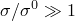，其中是屈服应力）下表现出指数依赖性，在低应力水平下简化为幂律（没有明确的时间依赖性）。

双幂律、Anand和Darveaux模型特别适用于模拟电子封装中焊锡合金的行为，已被证明可以在广泛的温度和应变率范围内产生准确的结果。

上述模型都不适用于循环加载下的蠕变建模。ORNL模型(["ORNL -- 橡树岭国家实验室本构模型，" 第23.2.12节](pt05ch23s02abm28.md))是一个针对不锈钢的经验模型，可以对循环加载给出近似结果，而无需数值执行循环加载。通常，循环加载的蠕变模型很复杂，必须通过用户子程序[`CREEP`](../sub/sub-link.md#sub-xsl-creep)或用户子程序[`UMAT`](../sub/sub-link.md#sub-xsl-umat)添加到模型中。

#### 同时模拟蠕变和塑性

如果蠕变和塑性同时发生且隐式蠕变积分生效，两种行为可能会相互作用，需要求解耦合的本构方程组。如果蠕变和塑性是各向同性的，Abaqus/Standard会正确考虑这种耦合行为，即使弹性是各向异性的。然而，如果蠕变和塑性是各向异性的，Abaqus/Standard在积分蠕变方程时不会考虑塑性，这可能导致蠕变应变的重大误差。这种情况仅在塑性和蠕变同时激活时才会发生，例如在长期载荷增加期间；在塑性占主导地位的短期预加载阶段，然后是蠕变阶段（不再发生进一步屈服），不会出现问题。蠕变定律的积分和率相关塑性在["率相关金属塑性（蠕变），" Abaqus理论指南第4.3.4节](../stm/stm-link.md#stm-mat-ratedepplast)中讨论。

#### 幂律模型

幂律模型可以以其"时间硬化"形式或相应的"应变硬化"形式使用。

##### 时间硬化形式

"时间硬化"形式是两种形式的幂律模型中较简单的一种：

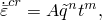

其中


是单轴等效蠕变应变率，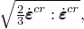


是单轴等效偏应力，

*t*

是总时间或蠕变时间，和

*A*、*n*和*m*

由您定义为温度的函数。

是根据是否定义各向同性或各向异性蠕变行为（见下文）是Mises等效应力或Hill各向异性等效偏应力。对于物理上合理的行为，*A*和*n*必须为正，。

| **输入文件用法：** | ``` [*CREEP](../key/key-link.md#usb-kws-mcreep), LAW=TIME ``` |
| --- | --- |

| **Abaqus/CAE用法：** | 属性模块：材料编辑器：****Mechanical****Plasticity****Creep****: **Law: Time-Hardening** |
| --- | --- |

##### 时间相关行为

在"时间硬化"幂律模型中，可以使用总时间或蠕变时间。总时间是所有一般分析步骤中累积的时间。蠕变时间是具有时间相关材料行为的程序的时间总和。如果使用总时间，建议对于任何不激活蠕变的分析步骤使用相对于蠕变时间较小的步骤时间；这是必要的，以避免在后续步骤中硬化行为的变化。

| **输入文件用法：** | 使用以下选项之一： |
| --- | --- |
|  | ``` [*CREEP](../key/key-link.md#usb-kws-mcreep), TIME=TOTAL (default) [*CREEP](../key/key-link.md#usb-kws-mcreep), TIME=CREEP ``` |

| **Abaqus/CAE用法：** | 在Abaqus/CAE中不支持指定时间类型。 |
| --- | --- |

##### 应变硬化形式

幂律的"应变硬化"形式为

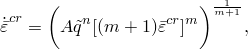

其中和在上面定义，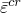是等效蠕变应变。

| **输入文件用法：** | ``` [*CREEP](../key/key-link.md#usb-kws-mcreep), LAW=STRAIN ``` |
| --- | --- |

| **Abaqus/CAE用法：** | 属性模块：材料编辑器：****Mechanical****Plasticity****Creep****: **Law: Strain-Hardening** |
| --- | --- |

##### 数值困难

根据幂律任何形式选择的单位，对于典型的蠕变应变率，*A*的值可能非常小。如果*A*小于10^-27，数值困难可能导致材料计算中的错误；因此，应使用不同的单位系统来避免蠕变应变增量计算中的此类困难。

#### 双曲正弦定律模型

双曲正弦定律采用以下形式

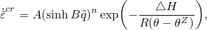

其中

和

在上面定义，


是温度，


是用户定义的所用温度标尺上的绝对零度值，


是激活能，

*R*

是通用气体常数，和

*A*、*B*和*n*

是其他材料参数。

该模型包含温度依赖性，这在上述表达式中是明显的；然而，参数*A*、*B*、*n*、和*R*不能定义为温度的函数。

| **输入文件用法：** | 使用以下两个选项： |
| --- | --- |
|  | ``` [*CREEP](../key/key-link.md#usb-kws-mcreep), LAW=HYPERB [*PHYSICAL CONSTANTS](../key/key-link.md#usb-kws-mphysicalconsts), ABSOLUTE ZERO= ``` |

| **Abaqus/CAE用法：** | 定义以下两者： |
| --- | --- |
|  | 属性模块：材料编辑器：****Mechanical****Plasticity****Creep****: **Law: Hyperbolic-Sine** 任何模块：****Model****Edit Attributes*****model_name*****: **Absolute zero temperature** |

##### 数值困难

与幂律一样，对于典型的蠕变应变率，*A*可能非常小。如果*A*非常小（例如小于10^-27），请使用其他单位系统以避免蠕变应变增量计算中的数值困难。

#### Anand模型

Anand模型采用以下形式

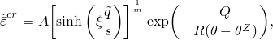

其中

、、*R*、和

在上面定义，


是激活能，


是变形阻力，和

、和

是材料参数。

变形阻力（初始为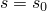）的演化方程为

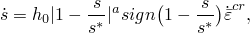

其中

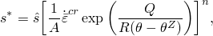

其中

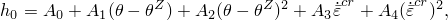

和、、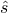、、、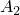、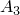和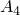是材料参数。

此外，初始变形阻力是温度的函数，形式为

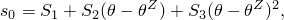

其中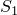、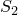和是材料参数。

| **输入文件用法：** | 使用以下两个选项： |
| --- | --- |
|  | ``` [*CREEP](../key/key-link.md#usb-kws-mcreep), LAW=ANAND [*PHYSICAL CONSTANTS](../key/key-link.md#usb-kws-mphysicalconsts), ABSOLUTE ZERO= ``` |

| **Abaqus/CAE用法：** | 在Abaqus/CAE中不支持指定Anand定律。 |
| --- | --- |

#### Darveaux模型

Darveaux模型涉及初级和次级蠕变。次级蠕变（稳态）分量用标准双曲正弦定律描述

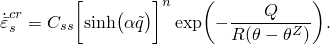

稳态定律通过以下方式修改以包括初级蠕变效应

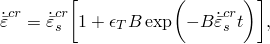

其中

、、*R*、*Q*、和

在上面定义，

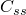

是稳态蠕变预因子，


是稳态蠕变幂律分解，和

、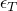和

是其他材料参数。

| **输入文件用法：** | 使用以下两个选项： |
| --- | --- |
|  | ``` [*CREEP](../key/key-link.md#usb-kws-mcreep), LAW=DARVEAUX [*PHYSICAL CONSTANTS](../key/key-link.md#usb-kws-mphysicalconsts), ABSOLUTE ZERO= ``` |

| **Abaqus/CAE用法：** | 在Abaqus/CAE中不支持指定Darveaux定律。 |
| --- | --- |

#### 双幂律模型

双幂律采用以下形式

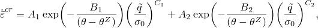

其中

、、和

在上面定义，


是归一化应力，和

、、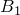、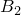、和

是其他材料参数。

| **输入文件用法：** | 使用以下两个选项： |
| --- | --- |
|  | ``` [*CREEP](../key/key-link.md#usb-kws-mcreep), LAW=DOUBLE POWER [*PHYSICAL CONSTANTS](../key/key-link.md#usb-kws-mphysicalconsts), ABSOLUTE ZERO= ``` |

| **Abaqus/CAE用法：** | 在Abaqus/CAE中不支持指定双幂律。 |
| --- | --- |

#### 各向异性蠕变

可以定义各向异性蠕变来指定出现在Hill函数中的应力比。您必须在每个方向上定义比值，这些比值将在计算蠕变应变率时用于缩放应力值。比值可以定义为常数或依赖于温度和其他预定义场变量。这些比值是相对于用户定义的局部材料方向或默认方向定义的（见["方向，" 第2.2.5节](pt01ch02s02aus15.md)）。更多详细信息在["各向异性屈服/蠕变，" 第23.2.6节](pt05ch23s02abm22.md)中提供。当蠕变用于定义率相关垫片行为时，各向异性蠕变不可用，因为只有垫片厚度方向行为可以具有率相关行为。

| **输入文件用法：** | ``` [*POTENTIAL](../key/key-link.md#usb-kws-mpotential) ``` |
| --- | --- |

| **Abaqus/CAE用法：** | 属性模块：材料编辑器：****Mechanical****Plasticity****Creep****: ****Suboptions****Potential**** |
| --- | --- |

### 体积膨胀行为

与蠕变定律一样，体积膨胀定律通常很复杂，最方便的是在用户子程序[`CREEP`](../sub/sub-link.md#sub-xsl-creep)中指定，如下所述。然而，也提供了一种表格输入方式，形式为

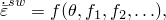

其中是由膨胀引起的体积应变率，、、是预定义场，如涉及核辐射效应的情况下的辐射通量。最多可以指定六个预定义场。

体积膨胀不能用于定义率相关垫片行为。

| **输入文件用法：** | ``` [*SWELLING](../key/key-link.md#usb-kws-mswelling) ``` |
| --- | --- |

| **Abaqus/CAE用法：** | 属性模块：材料编辑器：****Mechanical****Plasticity****Swelling**** |
| --- | --- |

#### 各向异性膨胀

可以容易地在膨胀行为中包括各向异性。如果定义各向异性膨胀行为，各向异性膨胀应变率表示为

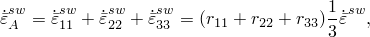

其中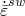是体积膨胀应变率，您可以直接定义（见上文）或在用户子程序[`CREEP`](../sub/sub-link.md#sub-xsl-creep)中定义。比值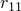、和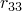也是用户定义的。膨胀应变率分量的方向由局部材料方向定义，可以是用户定义的或默认方向（见["方向，" 第2.2.5节](pt01ch02s02aus15.md)）。

| **输入文件用法：** | 使用以下两个选项： |
| --- | --- |
|  | ``` [*SWELLING](../key/key-link.md#usb-kws-mswelling) [*RATIOS](../key/key-link.md#usb-kws-mswellratios) ``` |

| **Abaqus/CAE用法：** | 属性模块：材料编辑器：****Mechanical****Plasticity****Swelling****: ****Suboptions****Ratios**** |
| --- | --- |

### 用户子程序[`CREEP`](../sub/sub-link.md#sub-xsl-creep)

用户子程序[`CREEP`](../sub/sub-link.md#sub-xsl-creep)为实现粘塑性模型（如蠕变和膨胀模型）提供了非常通用的能力，其中应变率势能可以写为等效压力应力*p*、Mises或Hill等效偏应力以及任意数量解相关状态变量的函数。解相关状态变量与本构定义结合使用；它们的值随解而演化，可以在此子程序中定义。示例是与模型相关的硬化变量。

用户子程序也可用于定义非常一般的率和时间相关厚度方向垫片行为。当应变率势能需要更一般的形式时，可以使用用户子程序[`UMAT`](../sub/sub-link.md#sub-xsl-umat)（["用户定义的力学材料行为，" 第26.7.1节](pt05ch26s07abm69.md)）。

| **输入文件用法：** | 使用以下一个或两个选项。只有第一个选项可用于定义垫片行为。 |
| --- | --- |
|  | ``` [*CREEP](../key/key-link.md#usb-kws-mcreep), LAW=USER [*SWELLING](../key/key-link.md#usb-kws-mswelling), LAW=USER ``` |

| **Abaqus/CAE用法：** | 使用以下一个或两个模型。只有第一个模型可用于定义垫片行为。 |
| --- | --- |
|  | 属性模块：材料编辑器：****Mechanical****Plasticity****Creep****: **Law: User defined******Mechanical****Plasticity****Swelling****: **Law: User subroutine CREEP** |

### 在分析步骤中移除蠕变效应

您可以指定在某些分析步骤期间不能发生蠕变（或粘弹性）响应，即使已定义蠕变（或粘弹性）材料属性。

| **输入文件用法：** | 使用以下选项之一： |
| --- | --- |
|  | ``` [*COUPLED TEMPERATURE-DISPLACEMENT](../key/key-link.md#usb-kws-hcouptempdisp), CREEP=NONE [*SOILS](../key/key-link.md#usb-kws-hsoils), CONSOLIDATION, CREEP=NONE ``` |

| **Abaqus/CAE用法：** | 使用以下选项之一： |
| --- | --- |
|  | 步骤模块：****Create Step**：****Coupled temp-displacement**：关闭****Include creep/swelling/viscoelastic behavior**** **Soils**：****Pore fluid response: Transient consolidation**：关闭****Include creep/swelling/viscoelastic behavior**** |

### 积分

根据所使用的过程、为过程指定的参数、塑性是否存在以及是否请求几何非线性，可以在新裂分析中使用显式积分、隐式积分或两种积分方案。

#### 显式和隐式方案的应用

非线性蠕变问题通常通过前向差分积分非弹性应变（"初始应变"方法）有效地求解。这种显式方法计算效率高，因为与隐式方法不同，不需要迭代。虽然这种方法仅在条件稳定的情况下有效，但显式算子的数值稳定性限制通常足够大，以允许在少量时间增量中求解。

Abaqus/Standard使用显式或隐式积分方案，或在同一步骤中从显式切换到隐式。首先概述这些方案，然后描述哪些过程使用这些积分方案。

1. 积分方案1：基于稳定性或塑性是否激活，从显式积分切换到隐式积分。显式积分中使用的稳定性限制在下一节中讨论。
2. 积分方案2：当塑性激活时，从显式积分切换到隐式积分。稳定性准则在这里不起作用。
3. 积分方案3：始终使用隐式积分。

上述积分方案的使用由过程类型、您选择的要使用的积分类型以及是否请求几何非线性决定。对于准静态和耦合温度-位移过程，如果您不选择积分类型，对于几何线性分析使用积分方案1，对于几何非线性分析使用积分方案3。您可以强制Abaqus/Standard在耦合温度-位移或准静态过程中对蠕变和膨胀效应使用显式积分，当塑性在整个步骤中不激活（积分方案2）。无论是否请求几何非线性（见["一般和线性扰动过程，" 第6.1.3节](pt03ch06s01aus44.md)），都可以使用显式积分。

对于瞬态土壤固结过程，无论执行几何线性还是非线性分析，始终使用隐式积分方案（积分方案3）。

| **输入文件用法：** | 使用以下选项之一将Abaqus/Standard限制为使用显式积分： |
| --- | --- |
|  | ``` [*VISCO](../key/key-link.md#usb-kws-hvisco), CREEP=EXPLICIT [*COUPLED TEMPERATURE-DISPLACEMENT](../key/key-link.md#usb-kws-hcouptempdisp), CREEP=EXPLICIT ``` |

| **Abaqus/CAE用法：** | 使用以下选项之一将Abaqus/Standard限制为使用显式积分： |
| --- | --- |
|  | 步骤模块：****Create Step**：****Visco**：****Incrementation**：****Creep/swelling/viscoelastic integration: ****Explicit**** **Coupled temp-displacement**：打开****Include creep/swelling/viscoelastic behavior**：****Incrementation**：****Creep/swelling/viscoelastic integration: Explicit**** |

#### 显式积分期间稳定极限的自动监控

Abaqus/Standard在显式积分期间自动监控稳定性极限。如果在模型中的任何点，蠕变应变增量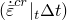大于总弹性应变，问题将变得不稳定。因此，通过以下方式计算每个增量的稳定时间步长，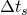：

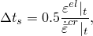

其中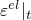是时间*t*（增量开始时）的等效总弹性应变，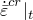是时间*t*的等效蠕变应变率。此外，

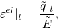

其中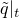是时间*t*的Mises应力，和

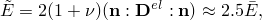

其中

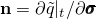

是偏应力势的梯度，


是弹性矩阵，和

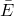

是有效弹性模量——对于各向同性弹性，可以近似为杨氏模量。

对于执行显式积分的每个增量，稳定时间增量与临界时间增量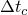进行比较，计算如下：

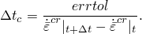

量*errtol*是您定义的误差容限，如下所述。如果小于，被用作时间增量，这意味着稳定性准则比精度要求更严格地限制时间步长。如果在九个连续增量中小于，您没有将Abaqus/Standard限制为如上所述的显式积分，并且分析中剩余时间足够（剩余时间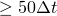），Abaqus/Standard将自动切换到后向差分算子（无条件稳定的隐式方法）。如果使用隐式算法，将重新形成刚度矩阵。

#### 为自动增量指定容差

必须选择积分容差，以准确计算应力增量中的误差，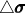。考虑一个一维示例。应力增量，，为

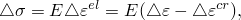

其中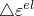、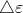和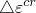分别是单轴弹性、总和蠕变应变增量，*E*是弹性模量。为了准确计算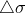，蠕变应变增量中的误差，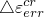，必须与相比较小；即，


将中的误差测量为


导致


您为适用过程定义*errtol*，方法是选择可接受的应力误差容差并除以典型弹性模量；因此，它应该是典型应力和问题中有效弹性模量之比的一小部分。重要的是要认识到，选择*errtol*值的这种方法通常是相当保守的，通常可以获得具有更高值可接受的解决方案。

| **输入文件用法：** | 使用以下选项之一： |
| --- | --- |
|  | ``` [*VISCO](../key/key-link.md#usb-kws-hvisco), CETOL=*errtol* [*COUPLED TEMPERATURE-DISPLACEMENT](../key/key-link.md#usb-kws-hcouptempdisp), CETOL=*errtol* [*SOILS](../key/key-link.md#usb-kws-hsoils), CONSOLIDATION, CETOL=*errtol* ``` |

| **Abaqus/CAE用法：** | 使用以下选项之一： |
| --- | --- |
|  | 步骤模块：****Create Step**：****Visco**：****Incrementation**：打开****Creep/swelling/viscoelastic strain error tolerance****，然后输入一个值 ****Coupled temp-displacement**：打开****Include creep/swelling/viscoelastic behavior**：****Incrementation**：打开****Creep/swelling/viscoelastic strain error tolerance****，然后输入一个值 ****Soils**：****Pore fluid response: Transient consolidation**：打开****Include creep/swelling/viscoelastic behavior**：****Incrementation**：打开****Creep/swelling/viscoelastic strain error tolerance****，然后输入一个值 |

### 使用蠕变应变率加载控制

在超塑性成型中，施加载荷以使物体变形。超塑性材料可以变形到非常大的应变，前提是变形的应变率保持在非常严格的容差范围内。超塑性分析的目标是预测必须如何控制压力以尽可能快地形成组件，同时不超过任何地方的超塑性应变率。

要使用Abaqus/Standard实现此目的，控制算法如下。在增量期间，Abaqus/Standard计算，即在指定元素集中任何积分点的等效蠕变应变率与目标蠕变应变率之比的最大值。如果在给定增量中小于0.2或大于3.0，则放弃该增量并使用以下载荷修改重新启动：


其中*p*是新载荷大小，是旧载荷大小。如果，则接受该增量；并在下一个时间增量开始时，载荷大小修改如下：


当您激活上述算法时，可以基于在定义元素集中找到的最大等效蠕变应变率来控制蠕变和/或膨胀问题中的载荷。作为最低要求，此方法用于定义目标等效蠕变应变率；但是，如果需要，也可以将目标蠕变应变率定义为等效蠕变应变（测量为对数应变）、温度和其他预定义场变量的函数。每个温度下的蠕变应变依赖性曲线必须始终从零等效蠕变应变开始。

使用解相关振幅来定义载荷的最小和最大限制（见["在Abaqus/CAE用户指南的"振幅曲线"中定义超塑性成型分析的解相关振幅，" 第34.1.2节](pt07ch34s01aus115.md#usb-prc-pamplitude-data-sol)）。可以使用任意数量或组合的载荷。的当前值可作为输出，如下所述。

| **输入文件用法：** | 使用以下所有选项： |
| --- | --- |
|  | ``` [*AMPLITUDE](../key/key-link.md#usb-kws-mamplitude), NAME=*name*, DEFINITION=SOLUTION DEPENDENT [*CLOAD](../key/key-link.md#usb-kws-hcload), [*DLOAD](../key/key-link.md#usb-kws-hdload), [*DSLOAD](../key/key-link.md#usb-kws-hdsload),和/或[*BOUNDARY](../key/key-link.md#usb-kws-hboundary) 配合 AMPLITUDE=*name* [*CREEP STRAIN RATE CONTROL](../key/key-link.md#usb-kws-hcreepstrainrate), AMPLITUDE=*name*, ELSET=*elset* ``` [*AMPLITUDE](../key/key-link.md#usb-kws-mamplitude)选项必须出现在输入文件的模型定义部分，而载荷选项（[*CLOAD](../key/key-link.md#usb-kws-hcload)、[*DLOAD](../key/link.md#usb-kws-hdload)、[*DSLOAD](../key/link.md#usb-kws-hdsload)和[*BOUNDARY](../key/link.md#usb-kws-hboundary)）和[*CREEP STRAIN RATE CONTROL](../key/key-link.md#usb-kws-hcreepstrainrate)选项应出现在每个相关步骤定义中。 |

| **Abaqus/CAE用法：** | 在Abaqus/CAE中不支持蠕变应变率控制。 |
| --- | --- |

### 单元

率相关塑性（蠕变和膨胀行为）可用于Abaqus/Standard中任何具有位移自由度的连续体、壳、膜、垫片和梁单元。蠕变（但不是膨胀）也可以结合垫片行为定义在任何垫片单元的厚度方向上定义。

### 输出

除了Abaqus/Standard中可用的标准输出标识符（["Abaqus/Standard输出变量标识符，" 第4.2.1节](pt02ch04s02abv01.md)），以下变量与蠕变和膨胀模型直接相关：

| CEEQ | 等效蠕变应变，。 |
| --- | --- |

| CESW | 膨胀应变大小。 |
| --- | --- |

以下输出仅与上述蠕变应变率加载控制分析相关，在增量开始时自动打印，并在请求任何输出到结果文件和输出数据库文件时写入：

| RATIO | 等效蠕变应变率与目标蠕变应变率之比的最大值，。 |
| --- | --- |

| AMPCU | 解相关振幅的当前值。 |
| --- | --- |

