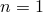
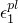
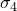
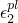
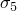
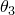

# 23.2.5 退火或熔化


**产品：** Abaqus/Standard   Abaqus/Explicit   Abaqus/CAE   

##### **参考资料**

- ["材料库：概述，" 第21.1.1节](pt05ch21s01abo18.md)
- [*ANNEAL TEMPERATURE](../key/key-link.md#usb-kws-mannealtemp)
- ["在Abaqus/CAE用户指南的"定义塑性"中指定弹塑性材料的退火温度，" 第12.9.2节](../usi/usi-link.md#usi-prp-mechanical-plastic-plastic-anneal)

### 概述

此功能：
- 旨在模拟金属在高温过程中熔化和再凝固的影响，或者当材料点的温度升高到某一水平时退火的影响；
- 仅适用于Mises、Johnson-Cook和Hill塑性模型；
- 旨在与适当的温度相关材料属性结合使用（特别是，该模型假定在退火温度或以上时表现为理想塑性行为）；并且
- 可以通过简单地定义退火或熔化温度来进行建模。

### 退火或熔化的影响

当材料点的温度超过用户指定的值（称为退火温度）时，Abaqus假定材料点失去其硬化记忆。通过将等效塑性应变设置为零来消除先前加工硬化的影响。对于运动硬化和组合硬化模型，背应力张量也被重置为零。如果材料点的温度在后续时间降到退火温度以下，材料点可以再次加工硬化。根据温度历史，材料点可能会多次失去和累积记忆，在熔化建模的背景下，这对应于反复熔化和再凝固。当达到退火温度时，任何累积的材料损伤都不会愈合。损伤将在退火后根据任何有效的损伤模型继续累积（见["延性金属的损伤和失效：概述，" 第24.2.1节](pt05ch24s02abm41.md)）。

在Abaqus/Explicit中，可以定义退火步骤来模拟整个模型的退火过程，与温度无关；详见["退火过程，" 第6.12.1节](pt03ch06s12at31.md)。

### 材料属性

退火温度是可以选择定义为场变量函数的材料属性。此材料属性必须与适当的材料属性定义结合使用，作为温度函数的Mises塑性模型。特别是，硬化行为必须定义为温度的函数，并且在退火温度或以上必须指定零硬化。通常，硬化来自两个来源。第一个来源可以大致分类为静态的，其影响是通过固定应变率下屈服应力相对于塑性应变的变化率来测量的。第二个来源可以大致分类为率相关的，其影响是通过固定塑性应变下屈服应力相对于应变率的变化率来测量的。

对于Mises塑性模型，如果描述硬化的材料数据（静态和率相关贡献）完全通过在不同应变率值下屈服应力与塑性应变的表格输入来指定（见["率相关屈服，" 第23.2.3节](pt05ch23s02abm19.md)），则在每个应变率下硬化的（温度相关）静态部分通过定义几条屈服应力与塑性应变曲线（每条在不同温度下）来指定。对于金属，在固定应变率下，屈服应力通常随温度升高而降低。Abaqus期望在退火温度或以上硬化在每个应变率下消失，如果您在其他方面指定，则会发出错误消息。可以通过在退火温度或以上的屈服应力与塑性应变曲线中指定单个数据点（零塑性应变处）来指定零（静态）硬化。此外，您还必须确保在退火温度或以上，屈服应力不随应变率变化。这可以通过在上述单数据点方法中指定所有应变率下相同的屈服应力值来实现。

或者，硬化的静态部分可以在零应变率下定义，率相关部分可以利用过应力幂律定义（见["率相关屈服，" 第23.2.3节](pt05ch23s02abm19.md)）。在这种情况下，可以通过在退火温度或以上的屈服应力与塑性应变曲线中指定单个数据点（零塑性应变处）来指定退火温度或以上的零静态硬化。也可以适当选择过应力幂律参数以确保在退火温度或以上屈服应力不随应变率变化。这可以通过为参数（相对于静态屈服应力）选择一个大的值并将参数设置为零来实现。

对于在Abaqus/Standard中通过用户子程序[`UHARD`](../sub/sub-link.md#sub-xsl-uhard)定义的硬化，Abaqus/Standard在实际计算期间检查退火温度或以上的硬化斜率，如果您没有正确指定，则会发出错误消息。

Abaqus/Explicit中的Johnson-Cook塑性模型需要单独的熔化温度来定义硬化行为。如果为金属塑性模型指定的退火温度小于指定的熔化温度，则在退火温度移除硬化记忆，熔化温度严格用于定义硬化函数。否则，硬化记忆会在熔化温度自动移除。

| **输入文件用法：** | ``` [*ANNEAL TEMPERATURE](../key/key-link.md#usb-kws-mannealtemp) ``` |
| --- | --- |

| **Abaqus/CAE用法：** | 属性模块：材料编辑器：****Mechanical****Plasticity****Plastic****: ****Suboptions****Anneal Temperature**** |
| --- | --- |

#### 示例：退火或熔化

以下是退火或熔化功能典型用法的示例输入。假设您已经定义了三个不同温度下（包括退火温度）各向同性硬化模型的静态应力与塑性应变行为（见[图23.2.5-1](pt05ch23s02abm21.md#usb-annealmelt)）。还假设塑性行为是率无关的。

**图23.2.5-1** 应力与塑性应变行为。


塑性响应对应于退火温度以下的线性硬化和退火温度下的理想塑性。未显示也可能依赖温度的弹性属性。

| 塑性数据，各向同性硬化： |
| --- |
| 屈服应力 | 塑性应变 | 温度 |
|  | 0 |  |
|  |  |  |
|  | 0 |  |
|  |  |  |
|  | 0 |  |
| 退火温度:  |

### 单元

此功能可用于所有包含力学行为的单元（具有位移自由度的单元）。

### 输出

只有等效塑性应变（输出变量PEEQ）和背应力（输出变量ALPHA）在熔化温度重置为零。塑性应变张量（输出变量PE）不会重置为零，并在分析过程中提供总塑性变形的度量。在Abaqus/Standard中，塑性应变张量还提供塑性应变大小的度量（输出变量PEMAG）。

