# 23.2.7 Johnson-Cook塑性


**产品：** Abaqus/Standard   Abaqus/Explicit   Abaqus/CAE   

##### **参考资料**

- ["经典金属塑性，" 第23.2.1节](pt05ch23s02abm17.md)
- ["率相关屈服，" 第23.2.3节](pt05ch23s02abm19.md)
- ["状态方程，" 第25.2.1节](pt05ch25s02abm50.md)
- [第24章，"渐进损伤和失效"](pt05ch24.md)
- ["动态失效模型，" 第23.2.8节](pt05ch23s02abm24.md)
- ["退火或熔化，" 第23.2.5节](pt05ch23s02abm21.md)
- ["材料库：概述，" 第21.1.1节](pt05ch21s01abo18.md)
- ["非弹性行为，" 第23.1.1节](pt05ch23s01abo20.md)
- [*ANNEAL TEMPERATURE](../key/key-link.md#usb-kws-mannealtemp)
- [*PLASTIC](../key/key-link.md#usb-kws-mplastic)
- [*RATE DEPENDENT](../key/key-link.md#usb-kws-mratedependent)
- [*SHEAR FAILURE](../key/key-link.md#usb-kws-mshearfailure)
- [*TENSILE FAILURE](../key/key-link.md#usb-kws-mtensilefailure)
- [*DAMAGE INITIATION](../key/key-link.md#usb-kws-mdamageinitiation)
- [*DAMAGE EVOLUTION](../key/key-link.md#usb-kws-mdamageevolution)
- ["在Abaqus/CAE用户指南的"定义塑性"中使用Johnson-Cook硬化模型定义经典金属塑性，" 第12.9.2节](../usi/usi-link.md#usi-prp-mechanical-plastic-plastic-johnsoncook)

### 概述

Johnson-Cook塑性模型：
- 是一种具有解析形式硬化定律和率相关性的特定类型的Mises塑性模型；
- 适用于许多材料（包括大多数金属）的高应变率变形；
- 通常用于绝热瞬态动态模拟；
- 可与Abaqus/Explicit中的Johnson-Cook动态失效模型结合使用；
- 可与Abaqus/Explicit中的拉伸失效模型结合使用来模拟拉伸层裂或压力截止；
- 可与渐进损伤和失效模型结合使用（[第24章，"渐进损伤和失效"](pt05ch24.md)）来指定不同的损伤起始准则和损伤演化定律，允许材料刚度的渐进降解以及从网格中移除单元；并且
- 必须与线性弹性材料模型（["线性弹性行为，" 第22.2.1节](pt05ch22s02abm02.md)）或状态方程材料模型（["状态方程，" 第25.2.1节](pt05ch25s02abm50.md)）结合使用。

### 屈服面和流动规则

Johnson-Cook塑性模型使用具有相关流动的Mises屈服面。

### Johnson-Cook硬化

Johnson-Cook硬化是一种特定类型的各向同性硬化，其中静态屈服应力，，假定为以下形式

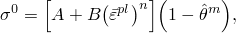

其中是等效塑性应变，*A*、*B*、*n*和*m*是在转变温度或以下测量的材料参数。是如下的无量纲温度


其中是当前温度，是熔化温度，是转变温度，定义为屈服应力没有温度依赖性的温度或以下。材料参数必须在转变温度或以下测量。

当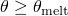时，材料将熔化并表现得像流体；由于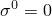，将没有剪切阻力。硬化记忆将通过把等效塑性应变设置为零来移除。如果为模型指定了背应力，这些也将被设置为零。

如果您在材料定义中包含退火行为，并且为金属塑性模型指定的退火温度小于指定的熔化温度，则硬化记忆将在退火温度被移除，熔化温度将严格用于定义硬化函数。否则，硬化记忆将在熔化温度自动移除。如果材料点的温度在后续时间降至退火温度以下，材料点可以再次加工硬化。更多详细信息，请参见["退火或熔化，" 第23.2.5节](pt05ch23s02abm21.md)。

您在金属塑性材料定义中提供*A*、*B*、*n*、*m*、和的值。

| **输入文件用法：** | ``` [*PLASTIC](../key/key-link.md#usb-kws-mplastic), HARDENING=JOHNSON COOK ``` |
| --- | --- |

| **Abaqus/CAE用法：** | 属性模块：材料编辑器：****Mechanical****Plasticity****Plastic****: **Hardening: Johnson-Cook** |
| --- | --- |

### Johnson-Cook应变率相关性

Johnson-Cook应变率相关性假定

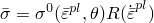

和

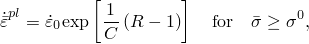

其中


是非零应变率下的屈服应力；


是等效塑性应变率；

和*C*

是在转变温度或以下测量的材料常数；

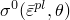

是静态屈服应力；和

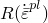

是非零应变率下屈服应力与静态屈服应力的比值（因此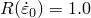）。

因此，屈服应力表示为

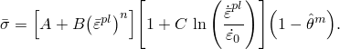

当您定义Johnson-Cook率相关性时，提供*C*和的值。

使用Johnson-Cook硬化不一定需要使用Johnson-Cook应变率相关性。

| **输入文件用法：** | 使用以下两个选项： |
| --- | --- |
|  | ``` [*PLASTIC](../key/key-link.md#usb-kws-mplastic), HARDENING=JOHNSON COOK [*RATE DEPENDENT](../key/key-link.md#usb-kws-mratedependent), TYPE=JOHNSON COOK ``` |

| **Abaqus/CAE用法：** | 属性模块：材料编辑器：****Mechanical****Plasticity****Plastic****: **Hardening: Johnson-Cook**: ****Suboptions****Rate Dependent****: **Hardening: Johnson-Cook** |
| --- | --- |

### Johnson-Cook动态失效

Abaqus/Explicit为Johnson-Cook塑性模型提供了一个特定的动态失效模型，该模型仅适用于金属的高应变率变形。该模型被称为"Johnson-Cook动态失效模型"。Abaqus/Explicit还提供了作为损伤起始准则系列一部分的Johnson-Cook失效模型的更通用实现，这是模拟材料渐进损伤和失效的推荐技术（见["延性金属的损伤和失效：概述，" 第24.2.1节](pt05ch24s02abm41.md)）。Johnson-Cook动态失效模型基于单元积分点处的等效塑性应变值；当损伤参数超过1时，假定发生失效。损伤参数，，定义为

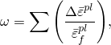

其中是等效塑性应变增量，是失效时的应变，汇总在分析的所有增量上执行。失效时的应变，，假定依赖于无量纲塑性应变率，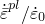；无量纲压力-偏应力比，（其中*p*是压力应力，*q*是Mises应力）；以及Johnson-Cook硬化模型中先前定义的无量纲温度，。假设依赖性是可分离的，形式为

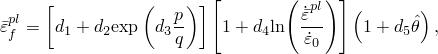

其中至是在转变温度或以下测量的失效参数，是参考应变率。当您定义Johnson-Cook动态失效模型时，提供至的值。此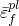表达式与[Johnson和Cook（1985）](pt05ch23s02abm23.md#usb-mat-ref-jc)发布的原始公式不同，参数的符号不同。这一差异是因为大多数材料在压力-偏应力比增加时会增加；因此，在上述表达式中通常为正值。

当满足此失效准则时，偏应力分量被设置为零，并在分析的剩余部分保持为零。根据您的选择，压力应力也可能在计算的剩余部分被设置为零（如果是这种情况，您必须指定单元删除，单元将被删除），或者可能要求在计算的剩余部分保持为压缩（如果是这种情况，您必须选择不使用单元删除）。默认情况下，满足失效准则的单元被删除。

Johnson-Cook动态失效模型适用于金属的高应变率变形；因此，它最适用于真正的动态情况。对于需要单元移除的准静态问题，推荐使用渐进损伤和失效模型（[第24章，"渐进损伤和失效"](pt05ch24.md)"）或多孔金属塑性模型（["多孔金属塑性，" 第23.2.9节](pt05ch23s02abm25.md)）。

使用Johnson-Cook动态失效模型需要使用Johnson-Cook硬化，但不一定需要使用Johnson-Cook应变率相关性。但是，只有在定义了Johnson-Cook应变率相关性时，才会包含Johnson-Cook动态失效准则中的率相关项。["延性金属的损伤起始，" 第24.2.2节](pt05ch24s02abm42.md)中描述的Johnson-Cook损伤起始准则没有这些限制。

| **输入文件用法：** | 使用以下两个选项： |
| --- | --- |
|  | ``` [*PLASTIC](../key/key-link.md#usb-kws-mplastic), HARDENING=JOHNSON COOK [*SHEAR FAILURE](../key/key-link.md#usb-kws-mshearfailure), TYPE=JOHNSON COOK, ELEMENT DELETION=YES or NO ``` |

| **Abaqus/CAE用法：** | Johnson-Cook动态失效在Abaqus/CAE中不支持。 |
| --- | --- |

### 渐进损伤和失效

Johnson-Cook塑性模型可以与["延性金属的损伤和失效：概述，" 第24.2.1节](pt05ch24s02abm41.md)中讨论的渐进损伤和失效模型结合使用。该功能允许指定一个或多个损伤起始准则，包括延性、剪切、成形极限图（FLD）、成形极限应力图（FLSD）、Mschenborn-Sonne成形极限图（MSFLD），以及Abaqus/Explicit中的Marciniak-Kuczynski（M-K）准则。损伤起始后，材料刚度根据指定的损伤演化响应逐渐降解。该模型提供两种失效选择，包括由于结构撕裂或撕裂而从网格中移除单元。渐进损伤模型允许材料刚度的平滑降解，使其适用于准静态和动态情况。与上面讨论的动态失效模型相比，这是一个很大的优势。

| **输入文件用法：** | 使用以下选项： |
| --- | --- |
|  | ``` [*PLASTIC](../key/key-link.md#usb-kws-mplastic), HARDENING=JOHNSON COOK [*DAMAGE INITIATION](../key/key-link.md#usb-kws-mdamageinitiation) [*DAMAGE EVOLUTION](../key/key-link.md#usb-kws-mdamageevolution) ``` |

| **Abaqus/CAE用法：** | 属性模块：材料编辑器：****Mechanical****Damage for Ductile Metals*****damage initiation type*****: 指定损伤起始准则：****Suboptions****Damage Evolution****: 指定损伤演化参数 |
| --- | --- |

### 拉伸失效

在Abaqus/Explicit中，拉伸失效模型可以与Johnson-Cook塑性模型结合使用来定义材料的拉伸失效。拉伸失效模型使用静水压力应力作为失效度量来模拟动态层裂或压力截止，并提供多种失效选择，包括单元移除。与Johnson-Cook动态失效模型类似，Abaqus/Explicit拉伸失效模型适用于金属的高应变率变形，最适用于真正的动态问题。更多详细信息，请参见["动态失效模型，" 第23.2.8节](pt05ch23s02abm24.md)。

| **输入文件用法：** | 使用以下两个选项： |
| --- | --- |
|  | ``` [*PLASTIC](../key/key-link.md#usb-kws-mplastic), HARDENING=JOHNSON COOK [*TENSILE FAILURE](../key/key-link.md#usb-kws-mtensilefailure) ``` |

| **Abaqus/CAE用法：** | 拉伸失效模型在Abaqus/CAE中不支持。 |
| --- | --- |

### 塑性功产生的热

Abaqus允许执行绝热热应力分析（["绝热分析，" 第6.5.4节](pt03ch06s05at20.md)）、完全耦合温度-位移分析（["完全耦合热应力分析，" 第6.5.3节](pt05ch26s01abm52.md)）或完全耦合热-电-结构分析（["完全耦合热-电-结构分析，" 第6.7.4节](pt03ch06s07at23.md)），其中计算由材料塑性应变产生的热量。这种方法通常用于模拟涉及大量非弹性应变的大型金属成型或高速制造过程，其中由变形引起的材料加热由于材料属性的温度依赖性而成为重要效应。由于Johnson-Cook塑性模型是由高应变率瞬态动态应用推动的，因此该模型中的温度变化通常通过假设绝热条件（元素之间没有热传递）来计算。热量由塑性功产生，产生的温升使用材料的比热计算。

此效果通过定义每体积热通量的非弹性耗散速率的分数来引入。

| **输入文件用法：** | 在同一材料数据块中使用以下所有选项： |
| --- | --- |
|  | ``` [*PLASTIC](../key/key-link.md#usb-kws-mplastic), HARDENING=JOHNSON COOK [*SPECIFIC HEAT](../key/key-link.md#usb-kws-mspecificheat) [*DENSITY](../key/key-link.md#usb-kws-mdensity) [*INELASTIC HEAT FRACTION](../key/key-link.md#usb-kws-minelastheatfrac) ``` |

| **Abaqus/CAE用法：** | 在同一材料定义中使用以下所有选项： |
| --- | --- |
|  | 属性模块：材料编辑器：****Mechanical****Plasticity****Plastic****: **Hardening: Johnson-Cook** ****Thermal****Specific Heat**** ****General****Density**** ****Thermal****Inelastic Heat Fraction**** |

### 初始条件

当我们需要研究已经承受了一些加工硬化的材料的行为时，可以提供初始等效塑性应变值来指定与加工硬化状态对应的屈服应力（见["Abaqus/Standard和Abaqus/Explicit中的初始条件，" 第34.2.1节](pt07ch34s02aus116.md)）。也可以指定初始背应力，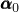。背应力表示屈服面的恒定运动学偏移，这在不考虑平衡解的情况下对建模残余应力的影响很有用。

| **输入文件用法：** | ``` [*INITIAL CONDITIONS](../key/key-link.md#usb-kws-minitialcond), TYPE=HARDENING ``` |
| --- | --- |

| **Abaqus/CAE用法：** | 载荷模块：****Create Predefined Field**：****Step: Initial**，为****Category****选择****Mechanical****，为****Types for Selected Step****选择****Hardening**** |
| --- | --- |

### 单元

Johnson-Cook塑性模型可与Abaqus中包含力学行为（具有位移自由度）的任何单元一起使用。

### 输出

除了Abaqus中可用的标准输出标识符（["Abaqus/Standard输出变量标识符，" 第4.2.1节](pt02ch04s02abv01.md)和["Abaqus/Explicit输出变量标识符，" 第4.2.2节](pt02ch04s02xbv01.md)），以下变量对Johnson-Cook塑性模型具有特殊含义：

| PEEQ | 等效塑性应变，，其中是初始等效塑性应变（零或用户指定；见["初始条件"](pt05ch23s02abm23.md#usb-mat-cjohnsoncook-initialcond)）。 |
| --- | --- |

| STATUS | 单元状态。如果单元是活动的，则为1.0；如果单元不是活动的，则为0.0。 |
| --- | --- |

| YIELDS | 屈服应力，。 |
| --- | --- |

#### 额外参考资料

- Johnson, G. R., and W. H. Cook, "Fracture Characteristics of Three Metals Subjected to Various Strains, Strain rates, Temperatures and Pressures," Engineering Fracture Mechanics, vol. 21, no.1, pp. 31--48, 1985.

