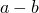
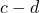
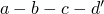

# 24.1.1 Progressive damage and failure

Abaqus provides the following models to predict progressive damage and failure:

**Progressive damage and failure for ductile metals**: Abaqus offers a general capability for modeling progressive damage and failure in ductile metals. The functionality can be used in conjunction with the Mises, Johnson-Cook, Hill, and Drucker-Prager plasticity models (["Damage and failure for ductile metals: overview," Section 24.2.1](pt05ch24s02abm41.md)). The capability supports the specification of one or more damage initiation criteria, including ductile, shear, forming limit diagram (FLD), forming limit stress diagram (FLSD), Mschenborn-Sonne forming limit diagram (MSFLD), and Marciniak-Kuczynski (M-K) criteria. After damage initiation, the material stiffness is degraded progressively according to the specified damage evolution response. The progressive damage models allow for a smooth degradation of the material stiffness, which makes them suitable for both quasi-static and dynamic situations, a great advantage over the dynamic failure models (["Dynamic failure models," Section 23.2.8](pt05ch23s02abm24.md)).The Johnson-Cook and Marciniak-Kuczynski (M-K) damage initiation criteria are not available in Abaqus/Standard.

**Progressive damage and failure for fiber-reinforced materials**: Abaqus offers a capability to model anisotropic damage in fiber-reinforced materials (["Damage and failure for fiber-reinforced composites: overview," Section 24.3.1](pt05ch24s03abm44.md)). The response of the undamaged material is assumed to be linearly elastic, and the model is intended to predict behavior of fiber-reinforced materials for which damage can be initiated without a large amount of plastic deformation. The Hashin's initiation criteria are used to predict the onset of damage, and the damage evolution law is based on the energy dissipated during the damage process and linear material softening.

**Progressive damage and failure for ductile materials in low-cycle fatigue analysis**: Abaqus/Standard offers a capability to model progressive damage and failure for ductile materials due to stress reversals and the accumulation of inelastic strain in a low-cycle fatigue analysis using the direct cyclic approach (see ["Low-cycle fatigue analysis using the direct cyclic approach," Section 6.2.7](pt03ch06s02at06.md)). The damage initiation criterion and damage evolution are characterized by the accumulated inelastic hysteresis energy per stabilized cycle (see ["Damage and failure for ductile materials in low-cycle fatigue analysis: overview," Section 24.4.1](pt05ch24s04abm47.md)). After damage initiation, the elastic material stiffness is degraded progressively according to the specified damage evolution response.

In addition, Abaqus offers a concrete damaged model (["Concrete damaged plasticity," Section 23.6.3](pt05ch23s06abm39.md)), dynamic failure models (["Dynamic failure models," Section 23.2.8](pt05ch23s02abm24.md)), and specialized capabilities for modeling damage and failure in cohesive elements (["Defining the constitutive response of cohesive elements using a traction-separation description," Section 32.5.6](pt06ch32s05alm45.md)) and in connectors (["Connector damage behavior," Section 31.2.7](pt06ch31s02alm33.md)).

This section provides an overview of the progressive damage and failure capability and a brief description of the concepts of damage initiation and evolution. The discussion in this section is limited to damage models for ductile metals and fiber-reinforced materials.

### General framework for modeling damage and failure

Abaqus offers a general framework for material failure modeling that allows the combination of multiple failure mechanisms acting simultaneously on the same material. Material failure refers to the complete loss of load-carrying capacity that results from progressive degradation of the material stiffness. The stiffness degradation process is modeled using damage mechanics.

To help understand the failure modeling capabilities in Abaqus, consider the response of a typical metal specimen during a simple tensile test. The stress-strain response, such as that illustrated in [Figure 24.1.1--1](pt05ch24s01abo21.md#failure-uniaxial-test), will show distinct phases. The material response is initially linear elastic, , followed by plastic yielding with strain hardening, . Beyond point *c* there is a marked reduction of load-carrying capacity until rupture, . The deformation during this last phase is localized in a neck region of the specimen. Point *c* identifies the material state at the onset of damage, which is referred to as the damage initiation criterion. Beyond this point, the stress-strain response  is governed by the evolution of the degradation of the stiffness in the region of strain localization. In the context of damage mechanics  can be viewed as the degraded response of the curve  that the material would have followed in the absence of damage.

**Figure 24.1.1–1** Typical uniaxial stress-strain response of a metal specimen.

 Thus, in Abaqus the specification of a failure mechanism consists of four distinct parts: 
- the definition of the effective (or undamaged) material response (e.g.,  in [Figure 24.1.1--1](pt05ch24s01abo21.md#failure-uniaxial-test)),
- a damage initiation criterion (e.g., *c* in [Figure 24.1.1--1](pt05ch24s01abo21.md#failure-uniaxial-test)),
- a damage evolution law (e.g.,  in [Figure 24.1.1--1](pt05ch24s01abo21.md#failure-uniaxial-test)), and
- a choice of element deletion whereby elements can be removed from the calculations once the material stiffness is fully degraded (e.g., *d* in [Figure 24.1.1--1](pt05ch24s01abo21.md#failure-uniaxial-test)).

 These parts will be discussed separately for ductile metals (["Damage and failure for ductile metals: overview," Section 24.2.1](pt05ch24s02abm41.md)) and fiber-reinforced materials (["Damage and failure for fiber-reinforced composites: overview," Section 24.3.1](pt05ch24s03abm44.md)).

### Mesh dependency

In continuum mechanics the constitutive model is normally expressed in terms of stress-strain relations. When the material exhibits strain-softening behavior, leading to strain localization, this formulation results in a strong mesh dependency of the finite element results in that the energy dissipated decreases upon mesh refinement. In Abaqus all of the available damage evolution models use a formulation intended to alleviate the mesh dependency. This is accomplished by introducing a characteristic length into the formulation, which in Abaqus is related to the element size, and expressing the softening part of the constitutive law as a stress-displacement relation. In this case the energy dissipated during the damage process is specified per unit area, not per unit volume. This energy is treated as an additional material parameter, and it is used to compute the displacement at which full material damage occurs. This is consistent with the concept of critical energy release rate as a material parameter for fracture mechanics. This formulation ensures that the correct amount of energy is dissipated and greatly alleviates the mesh dependency.

