# 26.1.4 粘度

**产品：** Abaqus/Explicit  Abaqus/CFD  Abaqus/CAE  

##### **参考文献**

- ["Viscous shear behavior" in "Equation of state," Section 25.2.1](pt05ch25s02abm50.md#usb-mat-ceos-deviatoricviscous)
- [*VISCOSITY](../key/key-link.md#usb-kws-mviscosity)
- [*EOS](../key/key-link.md#usb-kws-meos)
- [*TRS](../key/key-link.md#usb-kws-mtrs)
- ["Defining viscosity" in "Defining other mechanical models," Section 12.9.4 of the Abaqus/CAE User's Guide](../usi/usi-link.md#usi-prp-mechanical-other-viscosity)

### 概述

材料剪切粘度是流体抵抗流动的内部属性。它可以在 Abaqus/Explicit 和 Abaqus/CFD 中指定。

Abaqus/Explicit 中的材料剪切粘度：
- 可以是温度和剪切应变率的函数；以及
- 必须与状态方程结合使用（["Equation of state," Section 25.2.1](pt05ch25s02abm50.md)）。

Abaqus/CFD 中的材料剪切粘度：
- 对于牛顿模型，可以只是温度的函数；
- 可以是剪切应变率的函数；以及
- 不支持场依赖变体。

### 粘性剪切行为

粘性流体流动的阻力由偏应力与应变率之间的关系描述：


其中， 是偏应力， 是应变率的偏应力部分， 是粘度，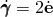 是工程剪切应变率。

牛顿流体的特征是粘度仅取决于温度，。在更一般的非牛顿流体情况下，粘度是温度和剪切应变率的函数：

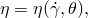

其中，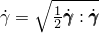 是等效剪切应变率。

### 粘度模型

除了牛顿粘性流体模型外，Abaqus/CFD 和 Abaqus/Explicit 还支持多种非线性粘度模型来描述非牛顿流体：幂律、Carreau-Yasuda、Cross、Herschel-Bulkley、Powell-Eyring 和 Ellis-Meter。粘度的其他函数形式也可以表格形式指定。此外，在 Abaqus/Explicit 中可以使用用户子程序 [`VUVISCOSITY`](../sub/sub-link.md#sub-sxl-vuviscosity)。

#### 牛顿模型

牛顿模型用于模拟由牛顿流体的 Navier-Poisson 定律控制的粘性层流，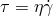。牛顿流体的特征是粘度仅取决于温度，。你需要在定义牛顿粘性偏应力行为时将粘度指定为温度的表格函数。

| **输入文件用法：** | ``` [*VISCOSITY](../key/key-link.md#usb-kws-mviscosity), DEFINITION=NEWTONIAN (default) ``` |
| --- | --- |

| **Abaqus/CAE 用法：** | 属性模块：材料编辑器：****Mechanical****Viscosity**** |
| --- | --- |

#### 幂律模型

幂律模型通常用于描述非牛顿流体的粘度。粘度表示为：


其中， 是流动一致性指数， 是流动行为指数。当 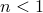 时，流体是剪切变稀（或假塑性）：表观粘度随剪切速率增加而减小。当  时，流体是剪切增稠（或扩张性）；当  时，流体是牛顿流体。

| **输入文件用法：** | ``` [*VISCOSITY](../key/key-link.md#usb-kws-mviscosity), DEFINITION=POWER LAW ``` |
| --- | --- |

| **Abaqus/CAE 用法：** | Abaqus/CAE 中不支持幂律模型。 |
| --- | --- |

#### Carreau-Yasuda

Carreau-Yasuda 模型描述了聚合物的剪切变稀行为。粘度表示为：


其中， 是低剪切率牛顿粘度， 是无限剪切粘度（在高剪切应变率下）， 是流体的自然时间常数， 表示幂律 regime 中的流动行为指数。

| **输入文件用法：** | ``` [*VISCOSITY](../key/key-link.md#usb-kws-mviscosity), DEFINITION=CARREAU-YASUDA ``` |
| --- | --- |

| **Abaqus/CAE 用法：** | Abaqus/CAE 中不支持 Carreau-Yasuda 模型。 |
| --- | --- |

#### Cross

Cross 模型通常用于需要描述粘度低剪切率行为的情况。粘度表示为：

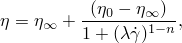

其中， 是牛顿粘度， 是无限剪切粘度， 是流体的自然时间常数， 是幂律 regime 中的流动行为指数。

| **输入文件用法：** | ``` [*VISCOSITY](../key/key-link.md#usb-kws-mviscosity), DEFINITION=CROSS ``` |
| --- | --- |

| **Abaqus/CAE 用法：** | Abaqus/CAE 中不支持 Cross 模型。 |
| --- | --- |

#### Herschel-Bulkley

Herschel-Bulkley 模型可用于描述表现出屈服响应的粘塑性流体（如 Bingham 塑料）的行为。粘度表示为：

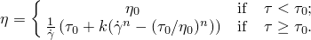

这里， 是"屈服"应力， 是惩罚粘度，用于在非常低的应变率区间（当应力低于屈服应力时）建模"刚性"行为。随着应变率增加，一旦超过屈服阈值，粘度过渡到幂律模型。

| **输入文件用法：** | ``` [*VISCOSITY](../key/key-link.md#usb-kws-mviscosity), DEFINITION=HERSCHEL-BULKLEY ``` |
| --- | --- |

| **Abaqus/CAE 用法：** | Abaqus/CAE 中不支持 Herschel-Bulkley 模型。 |
| --- | --- |

#### Powell-Eyring

该模型源自速率过程理论，主要与分子流体相关，但可在某些情况下用于描述聚合物溶液和粘弹性悬浮体在宽范围剪切速率下的粘性行为。粘度表示为：


其中， 是牛顿粘度， 是无限剪切粘度， 表示测量系统的特征时间。

| **输入文件用法：** | ``` [*VISCOSITY](../key/key-link.md#usb-kws-mviscosity), DEFINITION=POWELL-EYRING ``` |
| --- | --- |

| **Abaqus/CAE 用法：** | Abaqus/CAE 中不支持 Powell-Eyring 模型。 |
| --- | --- |

#### Ellis-Meter

Ellis-Meter 模型将粘度表示为有效剪切应力的函数：

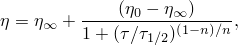

其中，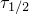 是有效剪切应力，此时粘度是牛顿极限  和无限剪切粘度  之间的 50%， 表示幂律 regime 中的流动指数。

| **输入文件用法：** | ``` [*VISCOSITY](../key/key-link.md#usb-kws-mviscosity), DEFINITION=ELLIS-METER ``` |
| --- | --- |

| **Abaqus/CAE 用法：** | Abaqus/CAE 中不支持 Ellis-Meter 模型。 |
| --- | --- |

#### 表格形式

在 Abaqus/Explicit 中，粘度可以直接指定为剪切应变率和温度的表格函数。在 Abaqus/CFD 中，仅支持剪切应变率依赖。

| **输入文件用法：** | ``` [*VISCOSITY](../key/key-link.md#usb-kws-mviscosity), DEFINITION=TABULAR ``` |
| --- | --- |

| **Abaqus/CAE 用法：** | 在 Abaqus/CAE 中不支持直接将粘度指定为表格函数。 |
| --- | --- |

#### 用户定义（仅限 Abaqus/Explicit）

在 Abaqus/Explicit 中，你可以在用户子程序 [`VUVISCOSITY`](../sub/sub-link.md#sub-sxl-vuviscosity) 中指定用户定义的粘度（见["VUVISCOSITY," Section 1.2.24 of the Abaqus User Subroutines Reference Guide](../sub/sub-link.md#sub-rtn-uexpuviscosity)）。

| **输入文件用法：** | ``` [*VISCOSITY](../key/key-link.md#usb-kws-mviscosity), DEFINITION=USER ``` |
| --- | --- |

| **Abaqus/CAE 用法：** | Abaqus/CAE 中不支持用户定义的粘度。 |
| --- | --- |

### 粘度的温度依赖性（仅限 Abaqus/Explicit）

许多工业相关聚合物材料的粘度温度依赖性服从以下形式的时间-温度平移关系：


其中， 是平移函数， 是已知粘度与剪切应变率关系的参考温度。这种温度依赖性概念通常称为热流变简单（TRS）温度依赖性。在低剪切率的牛顿极限下，当 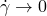 时，我们有：


因此，平移函数定义为感兴趣温度下的牛顿粘度与所选参考状态下的牛顿粘度之比：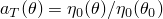。

| **输入文件用法：** | 使用以下选项定义热流变简单（TRS）温度依赖粘度： |
| --- | --- |
|  | ``` [*VISCOSITY](../key/key-link.md#usb-kws-mviscosity) [*TRS](../key/key-link.md#usb-kws-mtrs) ``` |

| **Abaqus/CAE 用法：** | Abaqus/CAE 中不支持定义热流变简单温度依赖粘度。 |
| --- | --- |

### 材料选项

Abaqus/Explicit 中的材料剪切粘度必须与状态方程结合使用来定义材料的体积机械行为（见["Equation of state," Section 25.2.1](pt05ch25s02abm50.md)）。

### 元素

材料剪切粘度可用于 Abaqus/Explicit 中除平面应力元素外的任何固体（连续体）元素，以及 Abaqus/CFD 中的任何流体（连续体）元素。

