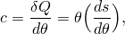
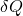
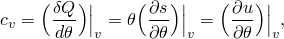
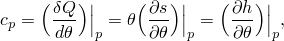
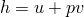

# 26.2.3 比热容


**产品：** Abaqus/Standard  Abaqus/Explicit  Abaqus/CFD  Abaqus/CAE  

##### **参考**

- ["材料库：概述，" 第21.1.1节](pt05ch21s01abo18.md)
- ["热属性：概述，" 第26.2.1节](pt05ch26s02abo23.md)
- [*SPECIFIC HEAT](../key/key-link.md#usb-kws-mspecificheat)
- ["定义比热容，" Abaqus/CAE用户指南第12.10.6节](../usi/usi-link.md#usi-prp-thermal-specificheat)

### 概述

材料的比热容：
- 是瞬态["非耦合热传导分析，" 第6.5.2节](pt03ch06s05at18.md)、瞬态["完全耦合热应力分析，" 第6.5.3节](pt03ch06s05at19.md)、瞬态["耦合热电分析，" 第6.7.3节](pt03ch06s07at22.md)和["绝热分析，" 第6.5.4节](pt03ch06s05at20.md)所必需的；
- 当能量方程激活时，必须为Abaqus/CFD分析定义（["能量方程" in "不可压缩流体动力学分析，" 第6.6.2节](pt03ch06s06aus48.md#usb-anl-aifluiddyn-energy)）；
- 必须与密度定义一起出现（参见["密度，" 第21.2.1节](pt05ch21s02abm01.md)）；
- 可以是线性的或非线性的（通过定义为温度的函数）；以及
- 可以指定为温度和/或场变量的函数。

### 定义比热容

物质比热容的定义是使单位质量温度升高一度所需的热量。从数学上，这一物理表述可以表示为：



其中  是单位质量吸收的无限小热量， 是单位质量的熵。由于热传递取决于整个过程遇到的条件（路径函数），因此必须指定用于过程中以明确表征比热容的条件。因此，在恒定体积条件下供应热量的过程将比热容定义为：



其中  是单位质量的内能。

而在恒定压力条件下供应热量的过程将比热容定义为：



其中  是单位质量的焓。一般来说，比热容是温度的函数。对于固体和液体， 和  是等价的；因此，无需区分它们。在可能的情况下，相变过程中内能或焓的大变化应使用["潜热，" 第26.2.4节](pt05ch26s02abm57.md)来建模，而不是比热容。

#### 定义恒容比热容

单位质量的比热容作为温度和场变量的函数给出。默认情况下，假定恒容比热容。

| **输入文件用法：** | ``` [*SPECIFIC HEAT](../key/key-link.md#usb-kws-mspecificheat) ``` |
| --- | --- |
|  | 在Abaqus/CFD中也可以使用以下选项：``` [*SPECIFIC HEAT](../key/key-link.md#usb-kws-mspecificheat), TYPE=CONSTANT VOLUME ``` |

| **Abaqus/CAE用法：** | 属性模块：材料编辑器：****热****比热容****；**类型**：****恒容**** |
| --- | --- |

#### 定义恒压比热容

在Abaqus/CFD中，当能量方程用于热流问题时需要恒压比热容。

| **输入文件用法：** | ``` [*SPECIFIC HEAT](../key/key-link.md#usb-kws-mspecificheat), TYPE=CONSTANT PRESSURE ``` |
| --- | --- |

| **Abaqus/CAE用法：** | 属性模块：材料编辑器：****热****比热容****；**类型**：****恒压**** |
| --- | --- |

### 单元

比热容效应可以针对Abaqus中的所有热传导、耦合热电结构、耦合温度位移、耦合热电和流体单元定义。比热容也可以为应力/位移单元定义，用于绝热应力分析。

对于所有瞬态热分析，即使模型中唯一的单元是用户定义的单元（["用户定义单元，" 第32.15.1节](pt06ch32s15alm60.md)），也必须定义比热容，在这种情况下必须指定一个虚拟比热容。


