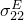
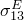

# 26.5.1 电导率


**产品：** Abaqus/Standard  Abaqus/CAE  

##### **参考**

- ["材料库：概述，" 第21.1.1节](pt05ch21s01abo18.md)
- [*ELECTRICAL CONDUCTIVITY](../key/key-link.md#usb-kws-melectricconduct)
- ["定义电导率，" Abaqus/CAE用户指南第12.11.1节](../usi/usi-link.md#usi-prp-electrical-electricalconductivity)

### 概述

材料的电导率：
- 必须为["耦合热电分析，" 第6.7.3节](pt03ch06s07at22.md)定义；
- 必须为["完全耦合热电结构分析，" 第6.7.4节](pt03ch06s07at23.md)定义；
- 必须用于定义导体的电磁响应，以进行["涡流分析，" 第6.7.5节](pt03ch06s07at24.md)；
- 可以是线性的或非线性的（通过定义为温度的函数）；
- 可以是各向同性、正交各向异性或完全各向异性的；
- 可以指定为温度和/或场变量的函数；以及
- 可以为["涡流分析，" 第6.7.5节](pt03ch06s07at24.md)指定为频率的函数。

### 电导率的方向依赖性

可以定义各向同性、正交各向异性或完全各向异性电导率。对于非各向同性电导率，必须指定材料方向的本地方向（["方向，" 第2.2.5节](pt01ch02s02aus15.md)）。

#### 各向同性电导率

对于各向同性电导率，在每个温度和场变量值下只需要一个电导率值。各向同性电导率是默认值。

| **输入文件用法：** | ``` [*ELECTRICAL CONDUCTIVITY](../key/key-link.md#usb-kws-melectricconduct), TYPE=ISOTROPIC ``` |
| --- | --- |

| **Abaqus/CAE用法：** | 属性模块：材料编辑器：****电气/磁性****电导率****：**类型：各向同性** |
| --- | --- |

#### 正交各向异性电导率

对于正交各向异性电导率，在每个温度和场变量值下需要三个电导率值（、、）。

| **输入文件用法：** | ``` [*ELECTRICAL CONDUCTIVITY](../key/key-link.md#usb-kws-melectricconduct), TYPE=ORTHOTROPIC ``` |
| --- | --- |

| **Abaqus/CAE用法：** | 属性模块：材料编辑器：****电气/磁性****电导率****：**类型：正交各向异性** |
| --- | --- |

#### 各向异性电导率

对于完全各向异性电导率，在每个温度和场变量值下需要六个值（、、、、、）。

| **输入文件用法：** | ``` [*ELECTRICAL CONDUCTIVITY](../key/key-link.md#usb-kws-melectricconduct), TYPE=ANISOTROPIC ``` |
| --- | --- |

| **Abaqus/CAE用法：** | 属性模块：材料编辑器：****电气/磁性****电导率****：**类型：各向异性** |
| --- | --- |

### 与频率相关的电导率

在涡流分析中，电导率可以定义为频率的函数。

| **输入文件用法：** | ``` [*ELECTRICAL CONDUCTIVITY](../key/key-link.md#usb-kws-melectricconduct), FREQUENCY ``` |
| --- | --- |

| **Abaqus/CAE用法：** | 属性模块：材料编辑器：****电气/磁性****电导率****：切换****使用频率相关数据** |
| --- | --- |

### 单元

电导率仅在耦合热电单元、耦合热电结构单元和电磁单元中激活（参见["为分析类型选择合适的单元，" 第27.1.3节](pt06ch27s01aus112.md)）。


