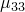
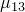
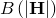
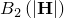
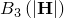
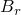
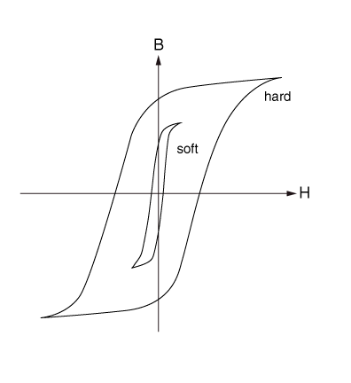
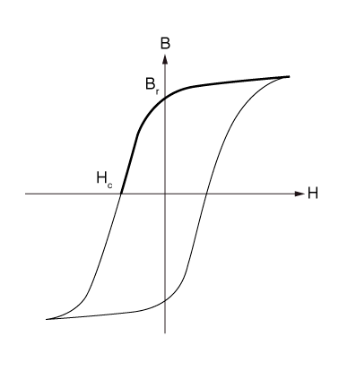

# 26.5.3 磁导率


**产品：** Abaqus/Standard  Abaqus/CAE  

##### **参考**

- ["材料库：概述，" 第21.1.1节](pt05ch21s01abo18.md)
- [*MAGNETIC PERMEABILITY](../key/key-link.md#usb-kws-mmagpermeability)
- [*NONLINEAR BH](../key/key-link.md#usb-kws-mnonlinearbh)
- [*PERMANENT MAGNETIZATION](../key/key-link.md#usb-kws-mpermanentmagnetization)
- ["定义磁导率，" Abaqus/CAE用户指南第12.11.4节](../usi/usi-link.md#usi-prp-electrical-magneticpermeability)

### 概述

材料的磁导率：
- 必须为["涡流分析，" 第6.7.5节](pt03ch06s07at24.md)和["静磁分析，" 第6.7.6节](pt03ch06s07at25.md)定义；
- 可以直接指定用于线性磁行为，或通过一条或多条B-H曲线指定用于非线性磁行为；
- 可以是各向同性、正交各向异性（或在线性情况下）完全各向异性的；
- 可以指定为温度和/或场变量的函数；
- 可以在时间谐波涡流程序中指定为频率的函数；以及
- 可以与永久磁化结合。

### 线性磁行为

线性磁行为通过直接指定磁导率来定义。

#### 磁导率的方向依赖性

可以定义各向同性、正交各向异性或完全各向异性磁导率。对于非各向同性磁导率，必须指定材料方向的本地方向（["方向，" 第2.2.5节](pt01ch02s02aus15.md)）。

##### 各向同性磁导率

对于各向同性磁导率，在每个温度和场变量值下只需要一个磁导率值。各向同性磁导率是默认值。

| **输入文件用法：** | ``` [*MAGNETIC PERMEABILITY](../key/key-link.md#usb-kws-mmagpermeability), TYPE=ISOTROPIC ``` |
| --- | --- |

| **Abaqus/CAE用法：** | 属性模块：材料编辑器：****电气/磁性****磁导率****：**类型：各向同性** |
| --- | --- |

##### 正交各向异性磁导率

对于正交各向异性磁导率，在每个温度和场变量值下需要三个磁导率值（、）。

| **输入文件用法：** | ``` [*MAGNETIC PERMEABILITY](../key/key-link.md#usb-kws-mmagpermeability), TYPE=ORTHOTROPIC ``` |
| --- | --- |

| **Abaqus/CAE用法：** | 属性模块：材料编辑器：****电气/磁性****磁导率****：**类型：正交各向异性** |
| --- | --- |

##### 各向异性磁导率

对于完全各向异性磁导率，在每个温度和场变量值下需要六个值（、、、、）。

| **输入文件用法：** | ``` [*MAGNETIC PERMEABILITY](../key/key-link.md#usb-kws-mmagpermeability), TYPE=ANISOTROPIC ``` |
| --- | --- |

| **Abaqus/CAE用法：** | 属性模块：材料编辑器：****电气/磁性****磁导率****：**类型：各向异性** |
| --- | --- |

#### 与频率相关的磁导率

在时间谐波涡流分析中，磁导率可以定义为频率的函数。

| **输入文件用法：** | ``` [*MAGNETIC PERMEABILITY](../key/key-link.md#usb-kws-mmagpermeability), FREQUENCY ``` |
| --- | --- |

| **Abaqus/CAE用法：** | 属性模块：材料编辑器：****电气/磁性****磁导率****：切换****使用频率相关数据** |
| --- | --- |

### 非线性磁行为

非线性磁行为以依赖于磁场强度的磁导率为特征。Abaqus中的非线性磁性材料模型适用于理想软磁材料，没有任何磁滞效应（参见[图26.5.3-1](pt05ch26s05abm63.md#cmagpermeability-hardsoft)），其特征是在B-H空间中单调增加的响应，其中B和H分别指磁通密度向量和磁场向量的强度。非线性磁行为通过直接指定一条或多条B-H曲线来定义，这些曲线提供B作为H以及可选的温度和/或预定义场变量的函数在一个或多个方向上的值。非线性磁行为可以是各向同性、正交各向异性或横向各向同性（这是更一般的正交各向异性行为的特例）。如果非线性磁行为不是各向同性，则需要多条B-H曲线来定义。

#### 非线性磁行为的方向依赖性

可以定义各向同性、正交各向异性或横向各向异性非线性磁行为。对于非各向同性非线性磁行为，必须指定材料方向的本地方向（["方向，" 第2.2.5节](pt01ch02s02aus15.md)）。

##### 各向同性非线性磁行为

对于各向同性非线性磁响应，在每个温度和场变量值下只需要一条B-H曲线。各向同性磁导率是默认值。Abaqus假定非线性磁行为受以下规律控制


| **输入文件用法：** | 您通过B-H曲线定义 ： |
| --- | --- |
|  | ``` [*MAGNETIC PERMEABILITY](../key/key-link.md#usb-kws-mmagpermeability), NONLINEAR, TYPE=ISOTROPIC [*NONLINEAR BH](../key/key-link.md#usb-kws-mnonlinearbh), DIR=*direction* ``` 任何方向（即全局方向1、2或3中的非线性行为）的B-H曲线都足以作为非线性磁行为，因为假定所有方向的非线性行为相同。 |

| **Abaqus/CAE用法：** | 属性模块：材料编辑器：****电气/磁性****磁导率****：切换****使用非线性B-H曲线指定**：**类型：各向同性** |
| --- | --- |

##### 正交各向异性非线性磁行为

对于正交各向异性非线性磁响应，在每个温度和场变量值下需要三条B-H曲线（每个局部方向1、2和3各一条）。Abaqus假定局部材料方向中的非线性磁行为受以下规律控制


其中  指一个对角矩阵。

横向各向异性非线性磁行为是正交各向异性行为的一种特例，其中任意两个方向的行为相同而与第三个方向的行为不同。

| **输入文件用法：** | 您分别通过三条独立的B-H曲线（在方向1、2和3中各一条）定义 、 和 ： |
| --- | --- |
|  | ``` [*MAGNETIC PERMEABILITY](../key/key-link.md#usb-kws-mmagpermeability), NONLINEAR, TYPE=ORTHOTROPIC [*NONLINEAR BH](../key/key-link.md#usb-kws-mnonlinearbh), DIR=1 … [*NONLINEAR BH](../key/key-link.md#usb-kws-mnonlinearbh), DIR=2 … [*NONLINEAR BH](../key/key-link.md#usb-kws-mnonlinearbh), DIR=3 … ``` |

| **Abaqus/CAE用法：** | 属性模块：材料编辑器：****电气/磁性****磁导率****：切换****使用非线性B-H曲线指定**：**类型：正交各向异性** |
| --- | --- |

### 永久磁化

铁磁材料可以通过放置在磁场中进行磁化，这通常是通过在待磁化材料周围缠绕线圈系统施加电流来实现的。这些材料可分为软磁材料和硬磁材料（参见[图26.5.3-1](pt05ch26s05abm63.md#cmagpermeability-hardsoft)）。软磁材料在移除施加的电流后会失去其磁化（参见["非线性磁行为"](pt05ch26s05abm63.md#usb-cmagpermeabiltiy-nonlinear)"）。硬磁材料在移除施加的电流后会永久保留其磁化。永久磁铁中剩余的磁化称为剩磁，在[图26.5.3-2](pt05ch26s05abm63.md#cmagpermeability-hard)中用  表示。可以通过在相反方向施加电流来消除这种磁化；完全消除磁化的反向磁场强度称为矫顽力，在[图26.5.3-2](pt05ch26s05abm63.md#cmagpermeability-hard)中用  表示。

**图26.5.3-1** 硬磁和软磁材料的响应。



**图26.5.3-2** 永久磁铁中的剩磁和矫顽力。



Abaqus中的永久磁化适用于在剩磁点附近工作的硬磁材料。这种行为捕获了[图26.5.3-2](pt05ch26s05abm63.md#cmagpermeability-hard)中磁滞回线较深的下降线周围的磁化或退磁响应。底层磁导率可以是线性的或非线性的。在任一情况下，永久磁化都通过其矫顽力定义，因此


对于线性各向同性、正交各向异性或各向异性磁行为，以及


对于非线性各向同性 - 响应。

| **输入文件用法：** | 指定具有底层线性磁导率的永久磁化： |
| --- | --- |
|  | ``` [*MAGNETIC PERMEABILITY](../key/key-link.md#usb-kws-mmagpermeability) [*PERMANENT MAGNETIZATION](../key/key-link.md#usb-kws-mpermanentmagnetization) *global system中的磁化方向* *矫顽力的大小* ``` 指定具有底层非线性磁导率的永久磁化（非线性响应在磁滞曲线的左上部分）： ``` [*MAGNETIC PERMEABILITY](../key/key-link.md#usb-kws-mmagpermeability), NONLINEAR [*NONLINEAR BH](../key/key-link.md#usb-kws-mnonlinearbh) *input* - *通过右移*  [*PERMANENT MAGNETIZATION](../key/key-link.md#usb-kws-mpermanentmagnetization) *global system中的磁化方向* *矫顽力的大小* ``` |

| **Abaqus/CAE用法：** | Abaqus/CAE不支持永久磁化。 |
| --- | --- |

### 单元

磁材料行为仅在电磁单元中激活（参见["为分析类型选择合适的单元，" 第27.1.3节](pt06ch27s01aus112.md)）。


