# 27.1.4 截面控制


**产品：** Abaqus/Standard  Abaqus/Explicit  Abaqus/CAE  

##### **参考**

- [*SECTION CONTROLS](../key/key-link.md#usb-kws-msectioncontrols)
- [*HOURGLASS STIFFNESS](../key/key-link.md#usb-kws-mhourglasstiff)
- ["单元类型分配，" Abaqus/CAE用户指南第17.5.3节](../usi/usi-link.md#usi-mgn-conc-elem-assign)

### 概述

Abaqus/Standard中的截面控制：
- 为具有减缩积分的大多数一阶单元选择沙漏控制公式；
- 为C3D10I单元定义扭曲控制；
- 为所有减缩积分单元选择沙漏控制比例因子；以及
- 为具有包括损伤演化的本构行为的平面应力公式单元（平面应力、壳、连续体壳和薄膜单元）、可与韧性金属损伤演化模型一起使用的任何单元以及可与低循环疲劳分析中的损伤演化律一起使用的任何单元，选择单元删除选项和最大退化值。

Abaqus/Explicit中的截面控制：
- 为所有减缩积分单元选择沙漏控制公式或比例因子；
- 为实体单元定义扭曲控制；
- 为壳单元选择钻孔刚度的比例因子或停用小应变壳单元S3RS和S4RS的钻孔刚度；
- 为薄膜单元中任何初始应力的加载选择幅度；
- 为六面体实体单元选择运动学公式；
- 为实体和壳单元选择公式的精度阶；
- 为线性和二次体粘度参数选择比例因子；
- 为具有包括损伤演化的本构行为的单元选择单元删除选项和最大退化值；以及
- 控制与平滑粒子流体力学（SPH）分析相关的许多方面。

在Abaqus/CAE中，截面控制在您分配单元类型时为特定网格区域指定，称为单元控制。

### 使用截面控制

在Abaqus/Standard中，截面控制用于为实体、壳和薄膜单元选择增强沙漏控制公式。与默认总刚度公式相比，此公式以稍高的计算成本提供更好的粗网格精度，并在高应变水平的非线性材料响应时表现更好。截面控制也可用于选择可能与后续Abaqus/Explicit分析相关的一些单元公式。

在Abaqus/Explicit中，实体、壳和薄膜单元的默认公式已选择为在广泛的准静态和显式动力学模拟上令人满意地执行。然而，某些公式会产生精度和性能之间的权衡。Abaqus/Explicit提供截面控制来修改这些单元公式，以便您可以优化特定应用的目标。Abaqus/Explicit中的截面控制也可用于指定线性和二次体粘度的比例因子。您还可以控制薄膜单元中的初始应力，用于安全气囊碰撞模拟等应用，并根据幅度定义逐渐引入初始应力。

此外，截面控制用于指定最大刚度退化，并在单元完全损坏（即材料刚度完全退化后）选择单元行为，包括从网格中移除损坏的单元。此功能仅适用于具有渐进损伤的材料定义的单元（参见["渐进损伤和失效，" 第24.1.1节](pt05ch24s01abo21.md)；["连接器损伤行为，" 第31.2.7节](pt06ch31s02alm33.md)；和["使用牵引-分离描述定义内聚单元的本构响应，" 第32.5.6节](pt06ch32s05alm45.md)）。在Abaqus/Standard中，此功能仅限于
- 具有包括损伤演化的牵引-分离本构响应的内聚单元，
- 可与纤维增强复合材料损伤演化模型一起使用的平面应力公式的任何单元，
- 可与韧性金属损伤演化模型一起使用的任何单元，
- 可与低循环疲劳分析中的损伤演化律一起使用的任何单元，和
- 具有包括损伤演化的本构响应的连接器单元。

| **输入文件用法：** | 使用以下选项指定截面控制定义： |
| --- | --- |
|  | ``` [*SECTION CONTROLS](../key/key-link.md#usb-kws-msectioncontrols), NAME=*name* ``` 此选项与以下一个或多个选项结合使用，将截面控制定义与单元截面定义关联： ``` [*COHESIVE SECTION](../key/key-link.md#usb-kws-mcohesivesection), CONTROLS=*name* [*CONNECTOR SECTION](../key/key-link.md#usb-kws-mconnectorsection), CONTROLS=*name* [*EULERIAN SECTION](../key/key-link.md#usb-kws-meulsection), CONTROLS=*name* [*MEMBRANE SECTION](../key/key-link.md#usb-kws-mmembranesection), CONTROLS=*name* [*SHELL GENERAL SECTION](../key/key-link.md#usb-kws-mshellgensect), CONTROLS=*name* [*SHELL SECTION](../key/key-link.md#usb-kws-mshellsection), CONTROLS=*name* [*SOLID SECTION](../key/key-link.md#usb-kws-msolidsection), CONTROLS=*name* ``` 您可以将单个截面控制定义应用于多个单元截面定义。 |

| **Abaqus/CAE用法：** | 网格模块：****网格****单元类型****：**单元控制** |
| --- | --- |

### 抑制沙漏模式的方法

减缩积分单元的公式仅考虑单元中增量位移场的线性变化部分来计算物理应变增量的增量。剩余的节点增量位移场部分是沙漏场，可以表示为沙漏模式。

这些模式的激发可能导致严重的网格扭曲，没有应力抵抗变形。类似地，C3D4H单元类型的公式在约束方程中仅考虑增量压力拉格朗日场。节点增量压力拉格朗日插值的剩余部分由沙漏模式组成。

沙漏控制试图在不引入对单元物理响应过度约束的情况下最小化这些问题。

Abaqus中提供了几种抑制沙漏模式的方法，如下所述。

#### Abaqus/Explicit中的积分粘弹性方法

Abaqus/Explicit中可用的积分粘弹性方法在分析步骤早期产生更大的沙漏阻力，其中突然动态加载更可能发生。

设 *q* 为沙漏模式幅度，*Q* 为与 *q* 共轭的力（或力矩）。积分粘弹性方法定义为

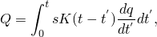

其中 *K* 是Abaqus/Explicit选择的沙漏刚度，*s* 是多达三个比例因子 、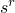 和  之一（默认情况下，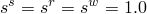）。比例因子是无量纲的，与特定位移自由度相关。对于实体和薄膜单元， 缩放所有沙漏刚度。对于壳单元， 缩放与面内位移自由度相关的沙漏刚度， 缩放与旋转自由度相关的沙漏刚度。此外， 缩放与小应变壳单元横位移相关的沙漏刚度。

积分粘弹性形式的沙漏控制可用于所有减缩积分单元，是Abaqus/Explicit中的默认形式，超弹性、超泡沫和低密度泡沫材料除外。它是计算上最密集的沙漏控制方法。不支持欧拉EC3D8R单元。

| **输入文件用法：** | ``` [*SECTION CONTROLS](../key/key-link.md#usb-kws-msectioncontrols), NAME=*name*, HOURGLASS=RELAX STIFFNESS , ,  ``` |
| --- | --- |

| **Abaqus/CAE用法：** | 网格模块：****网格****单元类型****：**沙漏控制：松弛刚度**，**位移沙漏比例因子：******，**旋转沙漏比例因子：******，**面外位移沙漏比例因子：****** |
| --- | --- |

#### Abaqus/Explicit中的Kelvin粘弹性方法

Abaqus/Explicit中可用的Kelvin型粘弹性方法定义为

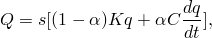

其中 *K* 是线性刚度，*C* 是线性粘性系数。这个一般形式将纯刚度和纯粘性沙漏控制作为极限情况。当组合使用时，刚度项在整个模拟过程中保持对沙漏的标称阻力，粘性项在动态加载条件下产生额外的沙漏阻力。

Abaqus/Explicit中提供了三种指定Kelvin粘弹性沙漏控制的方法。

##### 指定纯刚度方法

纯刚度形式的沙漏控制可用于所有减缩积分单元，推荐用于准静态和瞬态动力学模拟。

| **输入文件用法：** | ``` [*SECTION CONTROLS](../key/key-link.md#usb-kws-msectioncontrols), NAME=*name*, HOURGLASS=STIFFNESS , ,  ``` |
| --- | --- |

| **Abaqus/CAE用法：** | 网格模块：****网格****单元类型****：**沙漏控制：刚度**，**位移沙漏比例因子：******，**旋转沙漏比例因子：******，**面外位移沙漏比例因子：****** |
| --- | --- |

##### 指定纯粘性方法

纯粘性形式的沙漏控制仅适用于具有减缩积分的实体和薄膜单元，是Abaqus/Explicit中欧拉EC3D8R单元的默认形式。它是计算上最有效的沙漏控制形式，已被证明对高速动态模拟有效。但是，不建议将纯粘性方法用于低频动态或准静态问题，因为沙漏模式中的连续（静态）加载将导致过度的沙漏变形，因为缺乏任何标称刚度。

| **输入文件用法：** | ``` [*SECTION CONTROLS](../key/key-link.md#usb-kws-msectioncontrols), NAME=*name*, HOURGLASS=VISCOUS , ,  ``` |
| --- | --- |

| **Abaqus/CAE用法：** | 网格模块：****网格****单元类型****：**沙漏控制：粘性**，**位移沙漏比例因子：******，**旋转沙漏比例因子：******，**面外位移沙漏比例因子：****** |
| --- | --- |

##### 指定刚度和粘性沙漏控制的组合

刚度和粘性沙漏控制的线性组合仅适用于具有减缩积分的实体和薄膜单元。您可以指定混合权重因子 （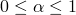）来缩放刚度和粘性贡献。指定等于0.0或1.0的权重因子分别导致纯刚度和纯粘性沙漏控制的极限情况。默认权重因子为0.5。

| **输入文件用法：** | ``` [*SECTION CONTROLS](../key/key-link.md#usb-kws-msectioncontrols), NAME=*name*, HOURGLASS=COMBINED, WEIGHT FACTOR= , ,  ``` |
| --- | --- |

| **Abaqus/CAE用法：** | 网格模块：****网格****单元类型****：**沙漏控制：组合**，**刚度-粘性权重因子：******，**位移沙漏比例因子：******，**旋转沙漏比例因子：******，**面外位移沙漏比例因子：****** |
| --- | --- |

#### Abaqus/Standard中的总刚度方法

Abaqus/Standard中可用的总刚度方法是Abaqus/Standard中所有一阶减缩积分单元的默认沙漏控制方法，超弹性、超泡沫或滞后材料除外。它是Abaqus/Standard中S8R5、S9R5和M3D9R单元以及C3D4H单元的压力拉格朗日插值的唯一可用沙漏控制方法。一阶减缩积分单元的沙漏刚度因子取决于剪切模量，而C3D4H单元的因子取决于体积模量。可以对这些刚度因子应用比例因子来增加或减少沙漏刚度。

设 *q* 为沙漏模式幅度，*Q* 为与 *q* 共轭的力（力矩、压力或体积通量）。薄膜或实体单元中或壳单元中薄膜沙漏控制的沙漏控制的总刚度方法定义为

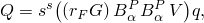

其中 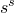 是无量纲比例因子（默认情况下，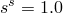）； 是具有应力单位的沙漏刚度因子；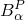 是用于在单元中定义恒定梯度的梯度插值器（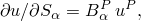，其中上标 *P* 指单元节点，下标  指方向，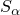 是材料坐标）；*V* 是单元体积。类似地，C3D4H单元的压力拉格朗日插值的沙漏控制定义为

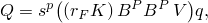

其中 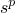 是无量纲比例因子（默认情况下，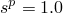）；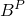 是体积梯度算子；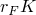 是可压缩超弹性和超泡沫材料的应力单位的沙漏刚度因子，对于所有其他材料为应力柔量的单位。壳单元中弯曲沙漏控制的总刚度方法定义为

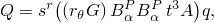

其中  是比例因子（默认情况下，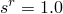）， 是沙漏刚度因子，*t* 是壳单元的厚度，*A* 是壳单元的面积。

| **输入文件用法：** | ``` [*SECTION CONTROLS](../key/key-link.md#usb-kws-msectioncontrols), NAME=*name*, HOURGLASS=STIFFNESS , , , , ,  ``` |
| --- | --- |

| **Abaqus/CAE用法：** | 网格模块：****网格****单元类型****：**沙漏控制：刚度**，**位移沙漏比例因子：******，**旋转沙漏比例因子：****** |
| --- | --- |

##### 默认沙漏刚度值

通常，沙漏控制刚度根据与材料相关的弹性定义。在大多数情况下，一阶减缩积分单元的控制刚度基于材料初始剪切模量的典型值，例如可能作为弹性材料定义（["线性弹性行为，" 第22.2.1节](pt05ch22s02abm02.md)）的一部分给出。类似地，C3D4H单元的减缩积分压力和体积拉格朗日插值的沙漏控制刚度基于初始体积模量的典型值。对于各向同性弹性或超弹性材料，*G* 是剪切模量。对于非各向同性弹性材料，使用平均模量计算沙漏刚度：对于通过指定弹性刚度矩阵项定义的正交各向同性弹性或各向异性弹性

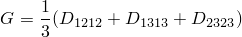

对于通过指定工程常数定义的正交各向同性弹性或平面应力中的正交各向同性弹性

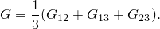

如果弹性模量依赖于温度或场变量，则使用表中的第一个值。刚度因子的默认值在下面定义。

对于薄膜或实体单元

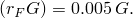

对于壳中的薄膜沙漏控制

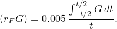

对于壳中弯曲沙漏模式的控制

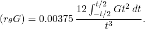

对于通过直接指定等效截面属性定义的一般壳截面，*t* 定义为

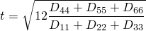

并使用截面的有效剪切模量来计算沙漏刚度：

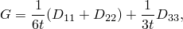

其中  是截面刚度矩阵。

##### 用户定义的沙漏刚度

当初始剪切模量未定义时，必须定义沙漏刚度参数；例如，当使用用户子程序 [`UMAT`](../sub/sub-link.md#sub-xsl-umat) 描述具有沙漏模式的单元的材料行为时。在某些情况下，为沙漏控制刚度提供的默认值可能不合适，您应该定义该值。

在某些耦合孔隙流体扩散和应力分析中，介质中的孔隙压力可能接近材料骨架刚度的大小，如弹性模量等本构参数所测量。在某些润湿相对相对柔顺材料（如组织或织物）的部分饱和评估中，预期会出现这些情况。当在这种分析中使用减缩积分或修改的四面体或三角形单元时，默认选择的基于骨架材料本构参数缩放的沙漏控制刚度参数可能不足以控制大孔隙压力场存在时的沙漏。在这些情况下，适当的沙漏控制刚度应随单元上孔隙压力变化的预期幅度而缩放。

| **输入文件用法：** | 使用以下选项指定沙漏刚度因子的非默认值： |
| --- | --- |
|  | ``` [*HOURGLASS STIFFNESS](../key/key-link.md#usb-kws-mhourglasstiff) , , , *壳的钻孔沙漏比例因子* ``` 此选项必须紧跟以下选项之一之后： ``` [*MEMBRANE SECTION](../key/key-link.md#usb-kws-mmembranesection) [*SHELL GENERAL SECTION](../key/key-link.md#usb-kws-mshellgensect) [*SHELL SECTION](../key/key-link.md#usb-kws-mshellsection) [*SOLID SECTION](../key/key-link.md#usb-kws-msolidsection) ``` |

| **Abaqus/CAE用法：** | 网格模块：****网格****单元类型****：**沙漏刚度：指定****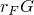 或对于壳 **薄膜沙漏刚度：指定******，**弯曲沙漏刚度：指定****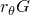**，**和钻孔沙漏比例因子：指定****壳的钻孔沙漏比例因子** |
| --- | --- |

#### Abaqus/Standard和Abaqus/Explicit中的增强沙漏控制方法

Abaqus/Standard和Abaqus/Exclusive中可用的增强沙漏控制方法代表了纯刚度方法的改进，其中刚度系数基于增强假设应变方法；不需要比例因子。它是Abaqus/Explicit中超弹性、超泡沫和低密度泡沫材料以及Abaqus/Standard中超弹性、超泡沫和滞后材料的默认沙漏控制方法。与其他沙漏控制方法相比，此方法使用线性弹性材料的粗网格提供更准确的位移解。它还为非线性材料提供更强的沙漏阻力。虽然通常有益，但这可能在显示弯曲下塑性屈服的等问题中给出过于刚性的响应。在Abaqus/Explicit中，增强沙漏方法通常会预测超弹性或超泡沫材料在卸载时更好地返回原始配置。

增强沙漏控制方法在Abaqus/Standard和Abaqus/Explicit之间兼容。建议对Abaqus/Standard和Abaqus/Explicit都使用增强沙漏控制进行所有导入分析。参见["在Abaqus/Explicit和Abaqus/Standard之间传输结果，" 第9.2.2节](pt04ch09s02aus55.md)。

增强沙漏方法不适用于富集单元（参见["使用扩展有限元方法将不连续性建模为富集特征，" 第10.7.1节](pt04ch10s07at36.md)）。

##### 指定增强沙漏控制方法

增强沙漏控制方法可用于具有减缩积分的一阶实体、薄膜和有限应变壳单元。在Abaqus/Explicit中，不能与具有自适应网格划分的超弹性或超泡沫材料一起使用（见下文讨论）。

| **输入文件用法：** | ``` [*SECTION CONTROLS](../key/key-link.md#usb-kws-msectioncontrols), NAME=*name*, HOURGLASS=ENHANCED ``` |
| --- | --- |
|  | 此选项后指定的数据行上的任何比例因子都将被忽略。 |

| **Abaqus/CAE用法：** | 网格模块：****网格****单元类型****：**沙漏控制：增强** |
| --- | --- |

##### 自适应网格域中超弹性和超泡沫材料的特殊考虑

增强沙漏方法不能与包含在自适应网格域中的超弹性或超泡沫材料一起使用。因此，如果您决定在自适应网格域中使用超弹性或超泡沫材料，必须指定截面控制以选择不同的沙漏控制方法。在由有限应变弹性材料建模的域中使用自适应网格划分时，不建议使用此方法，因为使用增强沙漏方法以及单元扭曲控制（见下文）通常可以预测更好的结果。因此，对于这些材料，建议在不进行自适应网格划分但使用增强沙漏控制的情况下运行分析。

##### 在耦合孔隙压力分析中的使用

当在具有增强沙漏控制的耦合孔隙流体扩散和应力分析或耦合温度-孔隙压力分析中使用一阶减缩积分或修改的四面体或三角形单元时，基于骨架材料本构参数的沙漏控制刚度可能不足以控制大孔隙压力场存在时的沙漏。由于增强沙漏控制不允许您更改沙漏控制刚度，建议在这些情况下使用总刚度沙漏控制，并具有适当缩放的沙漏控制刚度，缩放比例与单元上孔隙压力变化的预期幅度相对应。

### 在Abaqus/Explicit中控制可压碎材料的单元扭曲

许多具有体积压碎材料（如可压碎泡沫）的分析会看到大的压缩和剪切变形，特别是当可压碎材料用作刚性或重组件之间的能量吸收器时。可压碎材料的材料行为在高压缩下通常显著刚化。当使用更细的网格时，材料模型的刚化行为足以防止在高压缩载荷下发生过多的负单元体积或其他过度扭曲。然而，当网格相对于应变梯度和压缩量粗糙时，分析可能会过早失败。

Abaqus/Explicit提供扭曲控制以防止实体单元在这些情况下反转或过度扭曲。使用的约束方法防止单元上的每个节点向单元中心内侧切入，超过单元将变得非凸的点。约束使用惩罚方法强制执行，您可以控制相关的扭曲长度比。

扭曲控制仅适用于实体单元，不能在与自适应网格域一起使用时激活。扭曲控制默认对具有超弹性、超泡沫或低密度泡沫材料的单元激活。在由超弹性或超泡沫材料建模的域中使用自适应网格划分时，不建议使用此方法，因为使用增强沙漏方法与单元扭曲控制相结合通常可以预测更好的结果。但是，如果您决定在自适应网格域中使用超弹性或超泡沫材料，必须指定截面控制以停用扭曲控制。

如果使用扭曲控制，则可以根据请求输出扭曲控制消耗的能量（参见["Abaqus/Explicit输出变量标识符，" 第4.2.2节](pt02ch04s02xbv01.md)，了解详情）。虽然是为能量吸收、体积压碎材料的分析开发的，但扭曲控制可用于任何材料模型。但是，在解释结果时必须小心，因为扭曲控制约束可能会抑制合法的变形模式并锁定网格。扭曲控制无法防止由于时间不稳定、沙漏不稳定或物理上不真实的变形而导致的单元扭曲。

| **输入文件用法：** | 使用以下选项激活扭曲控制： |
| --- | --- |
|  | ``` [*SECTION CONTROLS](../key/key-link.md#usb-kws-msectioncontrols), NAME=*name*, DISTORTION CONTROL=YES ``` 使用以下选项停用扭曲控制： ``` [*SECTION CONTROLS](../key/key-link.md#usb-kws-msectioncontrols), NAME=*name*, DISTORTION CONTROL=NO ``` |

| **Abaqus/CAE用法：** | 网格模块：****网格****单元类型****：**扭曲控制：是**或**否** |
| --- | --- |

#### 控制扭曲长度比

默认情况下，当节点移动到约束实际平面的一个小偏移距离处时，将应用约束惩罚力。这似乎提高了方法的鲁棒性，并限制了由于单元特征长度严重缩短而导致的时间增量减少。偏移距离由扭曲长度比乘以初始单元特征长度确定。扭曲长度比 *r* 的默认值为0.1。您可以通过为 *r* 指定值来更改扭曲长度比，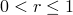。

| **输入文件用法：** | ``` [*SECTION CONTROLS](../key/key-link.md#usb-kws-msectioncontrols), NAME=*name*, DISTORTION CONTROL=YES, LENGTH RATIO=*r* ``` |
| --- | --- |

| **Abaqus/CAE用法：** | 网格模块：****网格****单元类型****：**扭曲控制：是**，**长度比：****r* |
| --- | --- |

### 在Abaqus/Explicit中选择钻孔刚度的比例因子

钻孔约束保持单元节点旋转与壳法线方向一致。缺乏这种约束可能导致这些单元节点的大旋转。截面控制可用于为单个单元集选择默认钻孔刚度的比例因子。

| **输入文件用法：** | 使用以下选项指定钻孔刚度的比例因子： |
| --- | --- |
|  | ``` [*SECTION CONTROLS](../key/key-link.md#usb-kws-msectioncontrols), NAME=*name* , , , , , , ,* scale factor for drill stiffness* ``` |

### Abaqus/Explicit中应变壳单元S3RS和S4RS中的钻孔约束

小应变壳单元S3RS和S4RS的公式包括钻孔约束，默认情况下启用。或者，您可以停用这些单元的钻孔约束。对于有限应变常规壳单元（如S4R），钻孔约束始终启用，但如上所述，默认钻孔刚度值可以缩放。

| **输入文件用法：** | 使用以下选项激活钻孔约束（默认）： |
| --- | --- |
|  | ``` [*SECTION CONTROLS](../key/key-link.md#usb-kws-msectioncontrols), DRILL STIFFNESS=ON ``` 使用以下选项停用钻孔约束： ``` [*SECTION CONTROLS](../key/key-link.md#usb-kws-msectioncontrols), DRILL STIFFNESS=OFF ``` |

### Abaqus/Explicit中薄膜单元初始应力的加载

对于安全气囊碰撞模拟等应用，初始应变（因此初始应力）通过与初始构型不同的参考构型引入模型。通常将初始构型中限制安全气囊的组件从数值模型中排除，导致分析开始时安全气囊在初始应力下运动。Abaqus/Explicit提供了一种基于幅度定义的技术，根据幅度定义逐渐引入薄膜单元中的初始应力。幅度必须定义为其值从零开始并达到最终值1。在幅度保持为零的持续时间内不会应用初始应力。

| **输入文件用法：** | 使用以下两个选项： |
| --- | --- |
|  | ``` [*AMPLITUDE](../key/key-link.md#usb-kws-mamplitude), NAME=*name* [*SECTION CONTROLS](../key/key-link.md#usb-kws-msectioncontrols), RAMP INITIAL STRESS=*name* ``` |

### 为六面体实体单元定义运动学公式

Abaqus中减缩积分实体单元的默认运动学公式基于均匀应变算子和沙漏形状向量。详细信息可在["实体等参四边形和六面体，" Abaqus理论指南第3.2.4节](../stm/stm-link.md#stm-elm-solidisoquadhex)中找到。这些运动学假设导致单元通过一般构型的常应变补丁测试，并在大型刚体旋转下给出零应变。但是，该公式相对昂贵，特别是在三维中。

Abaqus/Explicit为C3D8R实体单元提供两种替代运动学公式，可以降低计算成本。每种运动学公式在补丁测试和各种单元配置的的大型刚体旋转下的性能总结在表27.1.4-1中。每种运动学公式的适用应用总结在表27.1.4-2中。

**表27.1.4-1** 各种单元配置的补丁测试和大型刚体旋转的单元性能。
|  | 单元配置 | 运动学公式类型 |
| --- | --- | --- |
| 平均应变 | 正交 | 质心 |
| 三维补丁测试的满足性 | 平行六面体 | 是 | 是 | 是 |
| 一般 | 是 | 否 | 否 |
| 刚体旋转下的零应变 | 平行六面体 | 是 | 是 | 是 |
| 一般 | 是 | 是 | 否 |

**表27.1.4-2** 不同单元公式及其适用应用。默认公式在下面突出显示。
| 运动学公式 | 精度阶 | 适用应用 |
| --- | --- | --- |
| 平均应变 | 二阶 | 所有；推荐用于涉及大量旋转（>5）的问题。 |
| 平均应变 | 一阶 | 所有；除涉及大量旋转（>5）的问题外。 |
| 正交 | --- | 所有；除高约束、非常粗糙的网格或高度扭曲的单元的问题外。 |
| 质心 | --- | 刚体旋转少且网格细化合理的问题。 |

您可以为8节点砖块单元指定运动学公式。

#### 默认公式

均匀应变和沙漏形状向量的默认平均应变公式是Abaqus/Standard中唯一可用的公式。建议用于所有问题，特别适用于高约束应用，如闭模成型和衬套分析。

| **输入文件用法：** | ``` [*SECTION CONTROLS](../key/key-link.md#usb-kws-msectioncontrols), KINEMATIC SPLIT=AVERAGE STRAIN ``` |
| --- | --- |

| **Abaqus/CAE用法：** | 网格模块：****网格****单元类型****：**运动学分割：平均应变** |
| --- | --- |

#### Abaqus/Explicit中的正交公式

使用Abaqus/Explicit中可用的正交公式可以获得明显的计算成本降低。该公式基于质心应变算子和沙漏形状向量的轻微修改。质心应变算子需要的浮点运算比均匀应变算子少三倍。具有正交运动学分割的单元仅对矩形或平行六面体单元配置通过补丁测试。但是，数值经验表明，当网格细化时，单元收敛于一般单元配置的精确解。它在大刚体运动中也表现良好。

此公式在计算速度和精度之间提供了良好的平衡。建议用于除高度扭曲单元、非常粗糙的网格或高约束问题外的所有分析。此公式的适用应用包括弹性跌落测试。

| **输入文件用法：** | ``` [*SECTION CONTROLS](../key/key-link.md#usb-kws-msectioncontrols), NAME=*name*, KINEMATIC SPLIT=ORTHOGONAL ``` |
| --- | --- |

| **Abaqus/CAE用法：** | 网格模块：****网格****单元类型****：**运动学分割：正交** |
| --- | --- |

#### Abaqus/Explicit中的质心公式

Abaqus/Explicit中最快的公式通过选择质心公式来指定。质心公式基于质心应变算子和沙漏基础向量。使用沙漏基础向量而不是沙漏形状向量将沙漏模式计算减少三倍。但是，沙漏基础向量对于一般单元配置与刚体旋转不正交，因此使用此公式时，大的刚体旋转可能会产生沙漏应变。

此公式仅应用于提高具有合理网格细化且没有大量刚体旋转的问题的计算性能（例如，瞬态平板轧制模拟）。

| **输入文件用法：** | ``` [*SECTION CONTROLS](../key/key-link.md#usb-kws-msectioncontrols), NAME=*name*, KINEMATIC SPLIT=CENTROID ``` |
| --- | --- |

| **Abaqus/CAE用法：** | 网格模块：****网格****单元类型****：**运动学分割：质心** |
| --- | --- |

### 在实体和壳单元公式中选择精度阶

Abaqus/Standard为所有单元仅提供二阶精度公式。

Abaqus/Explicit为实体和壳单元提供一阶和二阶精度公式。一阶精度是默认的，对于几乎所有Abaqus/Explicit问题都提供足够的精度，因为固有的小时间增量大小。二阶精度通常需要用于承受大量旋转（>5）的组件的分析。对于三维实体，二阶精度公式仅适用于默认平均应变运动学公式。

#### 一阶精度

在Abaqus/Explicit中，实体和壳单元的一阶精度公式是默认的。此公式在Abaqus/Standard中不可用。

| **输入文件用法：** | ``` [*SECTION CONTROLS](../key/key-link.md#usb-kws-msectioncontrols), NAME=*name*, SECOND ORDER ACCURACY=NO ``` |
| --- | --- |

| **Abaqus/CAE用法：** | 网格模块：****网格****单元类型****：**二阶精度：否** |
| --- | --- |

#### 二阶精度

二阶精度单元公式适用于具有大量旋转（>5）的问题。这是Abaqus/Standard中唯一可用的公式。["螺旋桨旋转模拟，" Abyqsus基准指南第2.3.15节](../bmk/bmk-link.md#bmk-elm-propeller)说明了Abaqus/Explicit中二阶精确壳和实体单元在承受约100次旋转时的性能。

| **输入文件用法：** | ``` [*SECTION CONTROLS](../key/key-link.md#usb-kws-msectioncontrols), NAME=*name*, SECOND ORDER ACCURACY=YES ``` |
| --- | --- |

| **Abaqus/CAE用法：** | 网格模块：****网格****单元类型****：**二阶精度：是** |
| --- | --- |

### 在Abaqus/Explicit中选择体粘度的比例因子

体粘度引入与体积应变相关的阻尼。其目的是改善高速动态事件的建模。Abaqus/Explicit包含两种形式的体粘度，线性和二次，可以在整个模型的每个分析步骤中定义，如["体粘度" in "显式动力学分析，" 第6.3.3节](pt03ch06s03at08.md#usb-anl-aexpdynamic-bulkviscosity)中所讨论。截面控制可用于为单个单元集选择线性和二次体粘度的比例因子。

体粘度产生的压力项可能在高度可压缩材料的体积响应中引入意外结果；因此，建议为这些材料指定等于零的比例因子来抑制体粘度。

| **输入文件用法：** | 使用以下选项指定线性和二次体粘度的比例因子： |
| --- | --- |
|  | ``` [*SECTION CONTROLS](../key/key-link.md#usb-kws-msectioncontrols), NAME=*name* , , , *线性体粘度比例因子, 二次体粘度比例因子* ``` |

| **Abaqus/CAE用法：** | 网格模块：****网格****单元类型****：**线性体粘度比例因子**或**二次体粘度比例因子** |
| --- | --- |

### 控制具有损伤演化的材料的单元删除和最大退化

Abaqus提供了建模材料渐进损伤和失效的一般能力（["渐进损伤和失效，" 第24.1.1节](pt05ch24s01abo21.md)）。在Abaqus/Standard中，此功能仅适用于内聚单元、连接器单元、具有平面应力公式的单元（平面应力、壳、连续体壳和薄膜单元）、可与韧性金属损伤演化模型一起使用的任何单元，以及可与低循环疲劳分析中的损伤演化律一起使用的任何单元。在Abaqus/Explicit中，此功能适用于除连接器单元外的所有具有渐进损伤行为的单元。提供截面控制以指定最大刚度退化 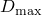，以及当退化达到此水平时是否删除单元。默认情况下，当单元完全损坏时（即 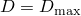）删除单元。单元删除的选择也影响如何应用损伤；详细信息可在以下章节中找到：
- ["韧性金属的最大退化和单元移除选择" in "损伤演化和单元移除，" 第24.2.3节](pt05ch24s02abm43.md#usb-mat-cdamageevol-deletion)；
- ["Abaqus/Standard中的最大退化和单元移除选择" in "连接器损伤行为，" 第31.2.7节](pt06ch31s02alm33.md#usb-elm-econndamagebehav-delete)；
- ["最大退化和单元移除选择" in "使用牵引-分离描述定义内聚单元的本构响应，" 第32.5.6节](pt06ch32s05alm45.md#usb-elm-ecohesivebehavior-deletion)；
- ["纤维增强复合材料的最大退化和单元移除选择" in "损伤演化和单元移除，" 第24.3.3节](pt05ch24s03abm46.md#usb-mat-cdamagefibercomposite-deletion)；和
- ["低循环疲劳中韧性材料的损伤演化，" 第24.4.3节](pt05ch24s04abm49.md)。

| **输入文件用法：** | 使用以下选项从网格中删除单元： |
| --- | --- |
|  | ``` [*SECTION CONTROLS](../key/key-link.md#usb-kws-msectioncontrols), ELEMENT DELETION=YES ``` 使用以下选项将单元保留在计算中： ``` [*SECTION CONTROLS](../key/key-link.md#usb-kws-msectioncontrols), ELEMENT DELETION=NO ``` 使用以下选项指定 ： ``` [*SECTION CONTROLS](../key/key-link.md#usb-kws-msectioncontrols), MAX DEGRADATION=. ``` |

| **Abaqus/CAE用法：** | 使用以下选项控制完全损坏的单元是否保留在计算中： |
| --- | --- |
|  | 网格模块：****网格****单元类型****：**单元删除** 使用以下选项确定何时认为单元完全损坏： 网格模块：****网格****单元类型****：**最大退化** |

### 在Abaqus/Standard中结合内聚单元、连接器单元以及可与韧性金属和纤维增强复合材料损伤演化模型一起使用的单元使用粘性正则化

展示软化行为和刚度退化的材料模型通常在隐式分析程序（如Abaqus/Standard）中导致严重的收敛困难。克服一些这些收敛困难的一种常用技术是使用本构方程的粘性正则化，这会导致软化材料的切线刚度矩阵在足够小的时间增量下为正。

用于描述内聚单元本构行为的牵引-分离律可以在Abaqus/Standard中使用粘度进行正则化，方法允许应力超出牵引-分离律定义的限制。正则化过程的详细信息在["Abaqus/Standard中的粘性正则化" in "使用牵引-分离描述定义内聚单元的本构响应，" 第32.5.6节](pt06ch32s05alm45.md#usb-elm-ecohesivebehavior-regularize)中讨论。相同的技术也用于正则化以下内容：
- 损坏（软化）连接器响应（参见["连接器损伤行为，" 第31.2.7节](pt06ch31s02alm33.md)），
- 当与纤维增强材料损伤模型一起使用时具有平面应力公式的单元的损坏响应（参见["粘性正则化" in "纤维增强复合材料的损伤演化和单元移除，" 第24.3.3节](pt05ch24s03abm46.md#usb-mat-cdamagefibercomposite-regularize)），和
- 与韧性金属损伤模型一起使用的单元的损伤响应（参见["韧性金属的损伤演化和单元移除，" 第24.2.3节](pt05ch24s02abm43.md)）。

您指定用于正则化过程的粘度量。默认情况下，不包含粘度，因此不执行粘性正则化。

| **输入文件用法：** | ``` [*SECTION CONTROLS](../key/key-link.md#usb-kws-msectioncontrols), VISCOSITY= ``` |
| --- | --- |

| **Abaqus/CAE用法：** | 网格模块：****网格****单元类型****：**粘度** |
| --- | --- |

### 在Abaqus/Standard中结合连接器单元使用粘性阻尼

连接器单元中的材料失效通常在Abaqus/Standard中导致收敛问题。为了避免此类收敛问题，您可以通过指定阻尼系数的值来引入连接器组件中的粘性阻尼，如["连接器失效行为，" 第31.2.9节](pt06ch31s02alm35.md)中所讨论。默认情况下，不包含阻尼。

| **输入文件用法：** | ``` [*SECTION CONTROLS](../key/key-link.md#usb-kws-msectioncontrols), VISCOSITY= ``` |
| --- | --- |

| **Abaqus/CAE用法：** | 网格模块：****网格****单元类型****：**粘度** |
| --- | --- |

### 在导入分析中使用截面控制

进行导入分析的推荐程序是在原始分析中指定增强沙漏控制公式。一旦在原始分析中指定了截面控制，就不能在后续导入分析中修改。这确保了增强沙漏控制公式在原始分析和导入分析中都使用。其他截面控制的默认值通常适当，不应更改。有关在导入分析中使用截面控制的更多详细信息，请参见["在Abaqus/Explicit和Abaqus/Standard之间传输结果，" 第9.2.2节](pt04ch09s02aus55.md)。

### 将截面控制用于屈曲-扭转型连接器

当屈曲-扭转型连接器的两个局部坐标系的第三轴完全对准时，会发生数值奇点，可能导致收敛困难。为了避免这种情况，可以对第二个连接器节点处定义的局部坐标系应用小扰动。

| **输入文件用法：** | ``` [*SECTION CONTROLS](../key/key-link.md#usb-kws-msectioncontrols), PERTURBATION=*small angle* ``` |
| --- | --- |

| **Abaqus/CAE用法：** | 您不能在Abaqus/CAE中为屈曲-扭转型连接器指定扰动。 |
| --- | --- |

### 将截面控制用于平滑粒子流体力学（SPH）

您可以控制Abaqus/Explicit中实现的平滑粒子流体力学（SPH）公式的许多方面。

#### 使用截面控制指定SPH核

对于平滑粒子流体力学分析，您可以选择用于插值的核阶次。有关可使用的各种核的讨论参考列表，请参见["平滑粒子流体力学，" 第15.2.1节](pt04ch15s02aus95.md)。

| **输入文件用法：** | 使用以下选项之一： |
| --- | --- |
|  | ``` [*SECTION CONTROLS](../key/key-link.md#usb-kws-msectioncontrols), KERNEL=CUBIC [*SECTION CONTROLS](../key/key-link.md#usb-kws-msectioncontrols), KERNEL=QUADRATIC [*SECTION CONTROLS](../key/key-link.md#usb-kws-msectioncontrols), KERNEL=QUINTIC ``` |

| **Abaqus/CAE用法：** | 在Abaqus/CAE中，您只能在与将连续体单元转换为SPH粒子的Abaqus/Explicit分析中选择用于插值的核阶次。 |
| --- | --- |
|  | 网格模块：****网格****单元类型****：**转换为粒子**：**核**：**三次**、**二次**或**五次** |

#### 使用截面控制指定其他SPH公式参数

您可以控制平滑长度的计算方式（参见["平滑粒子流体力学，" 第15.2.1节](pt04ch15s02aus95.md)）。您可以指定平滑长度（长度单位）以精确控制与给定粒子相关的影响半径。或者，您可以通过指定无量纲平滑长度因子来缩放默认平滑长度。默认情况下，平滑长度在整个分析过程中保持不变。您可以指定可变平滑长度，该长度将根据速度场的散度（这是压缩或膨胀行为的度量）随分析增加或减少。

默认情况下，与PC3D单元关联的粒子的最大数量不能超过140。您可以修改此数字；但是，较大的值会导致更大的内存需求，并且在大多数情况下会导致显著的性能下降。

您可以指定用于粒子修改坐标更新的平均速度过滤系数。该系数的零值（默认）导致经典SPH方法。如["平滑粒子流体力学，" 第15.2.1节](pt04ch15s02aus95.md)中所讨论，该系数的非零值导致XSPH方法。

默认情况下，SPH核满足零阶完备性要求。也可以使用一阶完备性校正（归一化）核，这在文献中有时称为归一化SPH（NSPH）方法。在高变形固体力学分析中，使用此核可能会获得更准确的结果。

| **输入文件用法：** | ``` [*SECTION CONTROLS](../key/key-link.md#usb-kws-msectioncontrols) *第一数据行* *平滑长度*, *平滑长度因子*, *可变平滑长度标志*,*最大相邻粒子数*, *平均速度过滤系数*, *校正核标志* ``` |
| --- | --- |

| **Abaqus/CAE用法：** | 在Abaqus/CAE中，您只能在与将连续体单元转换为SPH粒子的Abaqus/Explicit分析中指定SPH参数的截面控制。 |
| --- | --- |

#### 使用截面控制指定用于SPH粒子的控制框

您还可以控制执行粒子搜索（为所有粒子找到所有邻居）的矩形区域。默认情况下，使用比模型初始尺寸在所有方向大10%的区域，并位于模型几何中心。当粒子在此框外时，它像自由飞行点质量一样行为，不对SPH计算做出贡献。如果需要，您可以通过指定两个对角角点（右下和左上）的坐标来放大（或缩小）此矩形区域。

| **输入文件用法：** | ``` [*SECTION CONTROLS](../key/key-link.md#usb-kws-msectioncontrols) *第一数据行* *第二数据行* *X、Y和Z坐标（右下角）和X、Y和Z坐标**（左上角）* ``` |
| --- | --- |

| **Abaqus/CAE用法：** | 在Abaqus/CAE中，您只能在与将连续体单元转换为SPH粒子的Abaqus/Explicit分析中指定SPH参数的截面控制。 |
| --- | --- |

#### 使用截面控制将连续体单元转换为粒子

当满足特定标准时，减缩积分连续体单元可以转换为粒子，如["有限元转换为SPH粒子，" 第15.2.2节](pt04ch15s02aus96.md)中所讨论。您可以指定每个父单元生成的粒子数。有几个标准可以触发转换。

| **输入文件用法：** | 使用以下选项防止有限单元转换为粒子： |
| --- | --- |
|  | ``` [*SECTION CONTROLS](../key/key-link.md#usb-kws-msectioncontrols), ELEMENT CONVERSION=NO (default) ``` 使用以下选项触发有限单元到粒子的转换： ``` [*SECTION CONTROLS](../key/key-link.md#usb-kws-msectioncontrols), ELEMENT CONVERSION=YES ``` |

| **Abaqus/CAE用法：** | 网格模块：****网格****单元类型****：**转换为粒子**：**否**或**是** |
| --- | --- |

##### 指定生成的粒子数

您指定每个等参方向要生成的粒子数。粒子数可以从1到7。

| **输入文件用法：** | ``` [*SECTION CONTROLS](../key/key-link.md#usb-kws-msectioncontrols), ELEMENT CONVERSION=YES *第一数据行* *第二数据行* *第三数据行* *每个等参方向要生成的粒子数* ``` |
| --- | --- |

| **Abaqus/CAE用法：** | 网格模块：****网格****单元类型****：**转换为粒子**：**是**，**PPD**：*每个等参方向要生成的粒子数* |
| --- | --- |

##### 指定基于时间的标准

基于时间的标准主要用于允许所有粒子同时从定义的有限元网格转换的建模工具。

| **输入文件用法：** | ``` [*SECTION CONTROLS](../key/key-link.md#usb-kws-msectioncontrols), ELEMENT CONVERSION=YES,CONVERSION CRITERION=TIME (default) *第一数据行* *第二数据行* *第三数据行* , *转换时间* ``` |
| --- | --- |

| **Abaqus/CAE用法：** | 网格模块：****网格****单元类型****：**转换为粒子**：**是**，**标准**：**时间** |
| --- | --- |

##### 指定基于应变的标准

基于应变的标准主要用于您要使用渐进转换方法的情况。您指定连续单元要转换为SPH粒子时的最大主应变（绝对值）。

| **输入文件用法：** | ``` [*SECTION CONTROLS](../key/key-link.md#usb-kws-msectioncontrols), ELEMENT CONVERSION=YES,CONVERSION CRITERION=STRAIN *第一数据行* *第二数据行* *第三数据行* , *最大主应变（绝对值）* ``` |
| --- | --- |

| **Abaqus/CAE用法：** | 网格模块：****网格****单元类型****：**转换为粒子**：**是**，**标准**：**应变** |
| --- | --- |

##### 指定基于应力的标准

与基于应变的标准类似，基于应力的标准主要用于您要使用渐进转换方法的情况。您指定连续单元要转换为SPH粒子时的最大主应力（绝对值）。

| **输入文件用法：** | ``` [*SECTION CONTROLS](../key/key-link.md#usb-kws-msectioncontrols), ELEMENT CONVERSION=YES,CONVERSION CRITERION=STRESS *第一数据行* *第二数据行* *第三数据行* , *最大主应力（绝对值）* ``` |
| --- | --- |

| **Abaqus/CAE用法：** | 网格模块：****网格****单元类型****：**转换为粒子**：**是**，**标准**：**应力** |
| --- | --- |

##### 指定基于用户子程序的标准

基于用户子程序的标准允许您实现用户定义的转换标准。您可以通过任何可以主动修改与材料点关联的状态变量的用户子程序（如 [`VUSDFLD`](../sub/sub-link.md#sub-xsl-vusdfld) 和 [`VUMAT`](../sub/sub-link.md#sub-xsl-vumat)）在Abaqus/Explicit分析过程中控制单元转换。

| **输入文件用法：** | 使用以下选项触发基于用户子程序的转换标准： |
| --- | --- |
|  | ``` [*SECTION CONTROLS](../key/key-link.md#usb-kws-msectioncontrols), ELEMENT CONVERSION=YES,CONVERSION CRITERION=USER (*no data lines*) ``` |

| **Abaqus/CAE用法：** | 在Abaqus/CAE中不支持指定基于用户子程序的单元转换标准。 |
| --- | --- |


