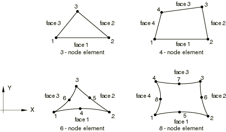

# 28.1.3 二维实体单元库


**产品：** Abaqus/Standard  Abaqus/Explicit  Abaqus/CAE  

##### **参考文献**

- ["实体（连续体）单元，" 第 28.1.1 节](pt06ch28s01alm01.md)
- [*SOLID SECTION](../key/key-link.md#usb-kws-msolidsection)

### 概述

本节提供 Abaqus/Standard 和 Abaqus/Explicit 中可用的二维实体单元的参考。

### 单元类型

#### 平面应变单元

| CPE3 | 3 节点线性 |
| --- | --- |

| CPE3H(S) | 3 节点线性，常压力杂交 |
| --- | --- |

| CPE4(S) | 4 节点双线性 |
| --- | --- |

| CPE4H(S) | 4 节点双线性，常压力杂交 |
| --- | --- |

| CPE4I(S) | 4 节点双线性，不兼容模式 |
| --- | --- |

| CPE4IH(S) | 4 节点双线性，不兼容模式，线性压力杂交 |
| --- | --- |

| CPE4R | 4 节点双线性，减缩积分，沙漏控制 |
| --- | --- |

| CPE4RH(S) | 4 节点双线性，减缩积分，沙漏控制，常压力杂交 |
| --- | --- |

| CPE6(S) | 6 节点二次 |
| --- | --- |

| CPE6H(S) | 6 节点二次，线性压力杂交 |
| --- | --- |

| CPE6M | 6 节点修正，沙漏控制 |
| --- | --- |

| CPE6MH(S) | 6 节点修正，沙漏控制，线性压力杂交 |
| --- | --- |

| CPE8(S) | 8 节点双二次 |
| --- | --- |

| CPE8H(S) | 8 节点双二次，线性压力杂交 |
| --- | --- |

| CPE8R(S) | 8 节点双二次，减缩积分 |
| --- | --- |

| CPE8RH(S) | 8 节点双二次，减缩积分，线性压力杂交 |
| --- | --- |

##### 激活的自由度

1, 2

##### 附加解变量

常压力杂交单元有一个与压力相关的附加变量，线性压力杂交单元有三个与压力相关的附加变量。

CPE4I 和 CPE4IH 单元类型有五个与不兼容模式相关的附加变量。

CPE6M 和 CPE6MH 单元类型有两个附加位移变量。

#### 平面应力单元

| CPS3 | 3 节点线性 |
| --- | --- |

| CPS4(S) | 4 节点双线性 |
| --- | --- |

| CPS4I(S) | 4 节点双线性，不兼容模式 |
| --- | --- |

| CPS4R | 4 节点双线性，减缩积分，沙漏控制 |
| --- | --- |

| CPS6(S) | 6 节点二次 |
| --- | --- |

| CPS6M | 6 节点修正，沙漏控制 |
| --- | --- |

| CPS8(S) | 8 节点双二次 |
| --- | --- |

| CPS8R(S) | 8 节点双二次，减缩积分 |
| --- | --- |

##### 激活的自由度

1, 2

##### 附加解变量

CPS4I 单元类型有四个与不兼容模式相关的附加变量。

CPS6M 单元类型有两个附加位移变量。

#### 广义平面应变单元

| CPEG3(S) | 3 节点线性三角形 |
| --- | --- |

| CPEG3H(S) | 3 节点线性三角形，常压力杂交 |
| --- | --- |

| CPEG4(S) | 4 节点双线性四边形 |
| --- | --- |

| CPEG4H(S) | 4 节点双线性四边形，常压力杂交 |
| --- | --- |

| CPEG4I(S) | 4 节点双线性四边形，不兼容模式 |
| --- | --- |

| CPEG4IH(S) | 4 节点双线性四边形，不兼容模式，线性压力杂交 |
| --- | --- |

| CPEG4R(S) | 4 节点双线性四边形，减缩积分，沙漏控制 |
| --- | --- |

| CPEG4RH(S) | 4 节点双线性四边形，减缩积分，沙漏控制，常压力杂交 |
| --- | --- |

| CPEG6(S) | 6 节点二次三角形 |
| --- | --- |

| CPEG6H(S) | 6 节点二次三角形，线性压力杂交 |
| --- | --- |

| CPEG6M(S) | 6 节点修正，沙漏控制 |
| --- | --- |

| CPEG6MH(S) | 6 节点修正，沙漏控制，线性压力杂交 |
| --- | --- |

| CPEG8(S) | 8 节点双二次四边形 |
| --- | --- |

| CPEG8H(S) | 8 节点双二次四边形，线性压力杂交 |
| --- | --- |

| CPEG8R(S) | 8 节点双二次四边形，减缩积分 |
| --- | --- |

| CPEG8RH(S) | 8 节点双二次四边形，减缩积分，线性压力杂交 |
| --- | --- |

##### 激活的自由度

除参考节点外，为 1, 2

参考节点处为 3, 4, 5

##### 附加解变量

常压力杂交单元有一个与压力相关的附加变量，线性压力杂交单元有三个与压力相关的附加变量。

CPEG4I 和 CPEG4IH 单元类型有五个与不兼容模式相关的附加变量。

CPEG6M 和 CPEG6MH 单元类型有两个附加位移变量。

#### 耦合温度-位移平面应变单元

| CPE3T | 3 节点线性位移和温度 |
| --- | --- |

| CPE4T(S) | 4 节点双线性位移和温度 |
| --- | --- |

| CPE4HT(S) | 4 节点双线性位移和温度，常压力杂交 |
| --- | --- |

| CPE4RT | 4 节点双线性位移和温度，减缩积分，沙漏控制 |
| --- | --- |

| CPE4RHT(S) | 4 节点双线性位移和温度，减缩积分，沙漏控制，常压力杂交 |
| --- | --- |

| CPE6MT | 6 节点修正位移和温度，沙漏控制 |
| --- | --- |

| CPE6MHT(S) | 6 节点修正位移和温度，沙漏控制，常压力杂交 |
| --- | --- |

| CPE8T(S) | 8 节点双二次位移，双线性温度 |
| --- | --- |

| CPE8HT(S) | 8 节点双二次位移，双线性温度，线性压力杂交 |
| --- | --- |

| CPE8RT(S) | 8 节点双二次位移，双线性温度，减缩积分 |
| --- | --- |

| CPE8RHT(S) | 8 节点双二次位移，双线性温度，减缩积分，线性压力杂交 |
| --- | --- |

##### 激活的自由度

角节点处为 1, 2, 11

Abaqus/Standard 中二阶单元的侧边节点处为 1, 2

Abaqus/Standard 中修正位移和温度单元的侧边节点处为 1, 2, 11

##### 附加解变量

常压力杂交单元有一个与压力相关的附加变量，线性压力杂交单元有三个与压力相关的附加变量。

CPE6MT 和 CPE6MHT 单元类型有两个附加位移变量和一个附加温度变量。

#### 耦合温度-位移平面应力单元

| CPS3T | 3 节点线性位移和温度 |
| --- | --- |

| CPS4T(S) | 4 节点双线性位移和温度 |
| --- | --- |

| CPS4RT | 4 节点双线性位移和温度，减缩积分，沙漏控制 |
| --- | --- |

| CPS6MT | 6 节点修正位移和温度，沙漏控制 |
| --- | --- |

| CPS8T(S) | 8 节点双二次位移，双线性温度 |
| --- | --- |

| CPS8RT(S) | 8 节点双二次位移，双线性温度，减缩积分 |
| --- | --- |

##### 激活的自由度

角节点处为 1, 2, 11

Abaqus/Standard 中二阶单元的侧边节点处为 1, 2

Abaqus/Standard 中修正位移和温度单元的侧边节点处为 1, 2, 11

##### 附加解变量

CPS6MT 单元类型有两个附加位移变量和一个附加温度变量。

#### 耦合温度-位移广义平面应变单元

| CPEG3T(S) | 3 节点线性位移和温度 |
| --- | --- |

| CPEG3HT(S) | 3 节点线性位移和温度，常压力杂交 |
| --- | --- |

| CPEG4T(S) | 4 节点双线性位移和温度 |
| --- | --- |

| CPEG4HT(S) | 4 节点双线性位移和温度，常压力杂交 |
| --- | --- |

| CPEG4RT(S) | 4 节点双线性位移和温度，减缩积分，沙漏控制 |
| --- | --- |

| CPEG4RHT(S) | 4 节点双线性位移和温度，减缩积分，沙漏控制，常压力杂交 |
| --- | --- |

| CPEG6MT(S) | 6 节点修正位移和温度，沙漏控制 |
| --- | --- |

| CPEG6MHT(S) | 6 节点修正位移和温度，沙漏控制，常压力杂交 |
| --- | --- |

| CPEG8T(S) | 8 节点双二次位移，双线性温度 |
| --- | --- |

| CPEG8HT(S) | 8 节点双二次位移，双线性温度，线性压力杂交 |
| --- | --- |

| CPEG8RHT(S) | 8 节点双二次位移，双线性温度，减缩积分，线性压力杂交 |
| --- | --- |

##### 激活的自由度

角节点处为 1, 2, 11

二阶单元的侧边节点处为 1, 2

修正位移和温度单元的侧边节点处为 1, 2, 11

参考节点处为 3, 4, 5

##### 附加解变量

常压力杂交单元有一个与压力相关的附加变量，线性压力杂交单元有三个与压力相关的附加变量。

CPEG6MT 和 CPEG6MHT 单元类型有两个附加位移变量和一个附加温度变量。

#### 扩散热传递或质量扩散单元

| DC2D3(S) | 3 节点线性 |
| --- | --- |

| DC2D4(S) | 4 节点线性 |
| --- | --- |

| DC2D6(S) | 6 节点二次 |
| --- | --- |

| DC2D8(S) | 8 节点双二次 |
| --- | --- |

##### 激活的自由度

11

##### 附加解变量

无。

#### 强制对流/扩散单元

| DCC2D4(S) | 4 节点 |
| --- | --- |

| DCC2D4D(S) | 4 节点带色散控制 |
| --- | --- |

##### 激活的自由度

11

##### 附加解变量

无。

#### 耦合热电单元

| DC2D3E(S) | 3 节点线性 |
| --- | --- |

| DC2D4E(S) | 4 节点线性 |
| --- | --- |

| DC2D6E(S) | 6 节点二次 |
| --- | --- |

| DC2D8E(S) | 8 节点双二次 |
| --- | --- |

##### 激活的自由度

9, 11

##### 附加解变量

无。

#### 孔隙压力平面应变单元

| CPE4P(S) | 4 节点双线性位移和孔隙压力 |
| --- | --- |

| CPE4PH(S) | 4 节点双线性位移和孔隙压力，常压力应力杂交 |
| --- | --- |

| CPE4RP(S) | 4 节点双线性位移和孔隙压力，减缩积分，沙漏控制 |
| --- | --- |

| CPE4RPH(S) | 4 节点双线性位移和孔隙压力，减缩积分，沙漏控制，常压力杂交 |
| --- | --- |

| CPE6MP(S) | 6 节点修正位移和孔隙压力，沙漏控制 |
| --- | --- |

| CPE6MPH(S) | 6 节点修正位移和孔隙压力，沙漏控制，线性压力杂交 |
| --- | --- |

| CPE8P(S) | 8 节点双二次位移，双线性孔隙压力 |
| --- | --- |

| CPE8PH(S) | 8 节点双二次位移，双线性孔隙压力，线性压力应力杂交 |
| --- | --- |

| CPE8RP(S) | 8 节点双二次位移，双线性孔隙压力，减缩积分 |
| --- | --- |

| CPE8RPH(S) | 8 节点双二次位移，双线性孔隙压力，减缩积分，线性压力应力杂交 |
| --- | --- |

##### 激活的自由度

角节点处为 1, 2, 8

除 CPE6MP 和 CPE6MPH 外的所有单元的侧边节点处为 1, 2，CPE6MP 和 CPE6MPH 在侧边节点处也激活自由度 8

##### 附加解变量

常压力杂交单元有一个与有效压力应力相关的附加变量，线性压力杂交单元有三个与有效压力应力相关的附加变量，以允许完全不可压缩材料建模。

CPE6MP 和 CPE6MPH 单元类型有两个附加位移变量和一个附加孔隙压力变量。

#### 声学单元

| AC2D3 | 3 节点线性 |
| --- | --- |

| AC2D4(S) | 4 节点双线性 |
| --- | --- |

| AC2D4R(E) | 4 节点双线性，减缩积分，沙漏控制 |
| --- | --- |

| AC2D6(S) | 6 节点二次 |
| --- | --- |

| AC2D8(S) | 8 节点双二次 |
| --- | --- |

##### 激活的自由度

8

##### 附加解变量

无。

#### 压电平面应变单元

| CPE3E(S) | 3 节点线性 |
| --- | --- |

| CPE4E(S) | 4 节点双线性 |
| --- | --- |

| CPE6E(S) | 6 节点二次 |
| --- | --- |

| CPE8E(S) | 8 节点双二次 |
| --- | --- |

| CPE8RE(S) | 8 节点双二次，减缩积分 |
| --- | --- |

##### 激活的自由度

1, 2, 9

##### 附加解变量

无。

#### 压电平面应力单元

| CPS3E(S) | 3 节点线性 |
| --- | --- |

| CPS4E(S) | 4 节点双线性 |
| --- | --- |

| CPS6E(S) | 6 节点二次 |
| --- | --- |

| CPS8E(S) | 8 节点双二次 |
| --- | --- |

| CPS8RE(S) | 8 节点双二次，减缩积分 |
| --- | --- |

##### 激活的自由度

1, 2, 9

##### 附加解变量

无。

#### 电磁单元

| EMC2D3(S) | 3 节点零阶 |
| --- | --- |

| EMC2D4(S) | 4 节点零阶 |
| --- | --- |

##### 激活的自由度

磁矢势（更多信息，请参阅 ["涡流分析中的边界条件，" 第 6.7.5 节](pt03ch06s07at24.md#usb-anl-aeddycurrent-bc)，和 ["静磁分析中的边界条件，" 第 6.7.6 节](pt03ch06s07at25.md#usb-anl-amagnetostatic-bc)）。

##### 附加解变量

无。

### 所需的节点坐标

*X*, *Y*

### 单元属性定义

对于除广义平面应变单元外的所有单元，您必须提供单元厚度；默认情况下，假定为单位厚度。

对于广义平面应变单元，您必须提供三个值：穿过参考节点的轴向材料纤维的初始长度， 的初始值（弧度），以及  的初始值（弧度）。如果您不提供这些值，Abaqus 假定初始长度为 1 个单位， 和  默认为零。此外，您必须为广义平面应变单元定义参考点。

| **输入文件用法：** | 使用以下选项为除广义平面应变单元外的所有单元定义单元属性： |
| --- | --- |
|  | ``` [*SOLID SECTION](../key/key-link.md#usb-kws-msolidsection) ``` 使用以下选项为广义平面应变单元定义单元属性： ``` [*SOLID SECTION](../key/key-link.md#usb-kws-msolidsection), REF NODE=*node number or node set name* ``` |

| **Abaqus/CAE 用法：** | Property 模块：**Create Section**：选择 **Solid** 作为截面 **Category** 和 **Homogeneous**、**Generalized plane strain** 或 **Electromagnetic, Solid** 作为截面 **Type** |
| --- | --- |
|  | 广义平面应变截面必须分配给与参考点关联的部件区域。要定义参考点：Part 模块：****Tools****Reference Point****：选择参考点 |

### 基于单元的载荷

### 分布载荷

分布载荷适用于具有位移自由度的所有单元。如 ["分布载荷，" 第 34.4.3 节](pt07ch34s04aus122.md) 中所述进行指定。

**载荷 ID (*DLOAD)：**  BX**Abaqus/CAE 载荷/相互作用：**  **体力****单位：**  [FL⁻³](../popups/usb-int-iconventions-unitsym.md)**描述：**  全局 *X* 方向的体力。

**载荷 ID (*DLOAD)：**  BY**Abaqus/CAE 载荷/相互作用：**  **体力****单位：**  [FL⁻³](../popups/usb-int-iconventions-unitsym.md)**描述：**  全局 *Y* 方向的体力。

**载荷 ID (*DLOAD)：**  BXNU**Abaqus/CAE 载荷/相互作用：**  **体力****单位：**  [FL⁻³](../popups/usb-int-iconventions-unitsym.md)**描述：**  全局 *X* 方向的非均匀体力，幅值通过 Abaqus/Standard 中的用户子程序 [`DLOAD`](../sub/sub-link.md#sub-xsl-dload) 和 Abaqus/Explicit 中的 [`VDLOAD`](../sub/sub-link.md#sub-xsl-vdload) 提供。

**载荷 ID (*DLOAD)：**  BYNU**Abaqus/CAE 载荷/相互作用：**  **体力****单位：**  [FL⁻³](../popups/usb-int-iconventions-unitsym.md)**描述：**  全局 *Y* 方向的非均匀体力，幅值通过 Abaqus/Standard 中的用户子程序 [`DLOAD`](../sub/sub-link.md#sub-xsl-dload) 和 Abaqus/Explicit 中的 [`VDLOAD`](../sub/sub-link.md#sub-xsl-vdload) 提供。

**载荷 ID (*DLOAD)：**  CENT(S)**Abaqus/CAE 载荷/相互作用：**  不支持**单位：**  [FL⁻⁴(ML⁻³T⁻²)](../popups/usb-int-iconventions-unitsym.md)**描述：**  离心载荷（幅值输入为 ，其中  是单位体积质量密度， 是角速度）。不适用于孔隙压力单元。

**载荷 ID (*DLOAD)：**  CENTRIF(S)**Abaqus/CAE 载荷/相互作用：**  **旋转体力****单位：**  [T⁻²](../popups/usb-int-iconventions-unitsym.md)**描述：**  离心载荷（幅值输入为 ，其中  是角速度）。

**载荷 ID (*DLOAD)：**  CORIO(S)**Abaqus/CAE 载荷/相互作用：**  **科里奥利力****单位：**  [FL⁻⁴T (ML⁻³T⁻¹)](../popups/usb-int-iconventions-unitsym.md)**描述：**  科里奥利力（幅值输入为 ，其中  是单位体积质量密度， 是角速度）。不适用于孔隙压力单元。

**载荷 ID (*DLOAD)：**  GRAV**Abaqus/CAE 载荷/相互作用：**  **重力****单位：**  [LT⁻²](../popups/usb-int-iconventions-unitsym.md)**描述：**  指定方向的重力载荷（幅值输入为加速度）。

**载荷 ID (*DLOAD)：**  HP*n*(S)**Abaqus/CAE 载荷/相互作用：**  不支持**单位：**  [FL⁻²](../popups/usb-int-iconventions-unitsym.md)**描述：**  面 *n* 上的静水压力，在全局 *Y* 中线性。

**载荷 ID (*DLOAD)：**  P*n***Abaqus/CAE 载荷/相互作用：**  **压力****单位：**  [FL⁻²](../popups/usb-int-iconventions-unitsym.md)**描述：**  面 *n* 上的压力。

**载荷 ID (*DLOAD)：**  P*n*NU**Abaqus/CAE 载荷/相互作用：**  不支持**单位：**  [FL⁻²](../popups/usb-int-iconventions-unitsym.md)**描述：**  面 *n* 上的非均匀压力，幅值通过 Abaqus/Standard 中的用户子程序 [`DLOAD`](../sub/sub-link.md#sub-xsl-dload) 和 Abaqus/Explicit 中的 [`VDLOAD`](../sub/sub-link.md#sub-xsl-vdload) 提供。

**载荷 ID (*DLOAD)：**  ROTA(S)**Abaqus/CAE 载荷/相互作用：**  **旋转体力****单位：**  [T⁻²](../popups/usb-int-iconventions-unitsym.md)**描述：**  旋转加速度载荷（幅值输入为 ，其中  是旋转加速度）。

**载荷 ID (*DLOAD)：**  SBF(E)**Abaqus/CAE 载荷/相互作用：**  不支持**单位：**  [FL⁻⁵T²](../popups/usb-int-iconventions-unitsym.md)**描述：**  全局 *X* 和 *Y* 方向的滞止体力。

**载荷 ID (*DLOAD)：**  SP*n*(E)**Abaqus/CAE 载荷/相互作用：**  不支持**单位：**  [FL⁻⁴T²](../popups/usb-int-iconventions-unitsym.md)**描述：**  面 *n* 上的滞止压力。

**载荷 ID (*DLOAD)：**  TRSHR*n***Abaqus/CAE 载荷/相互作用：**  **表面牵引****单位：**  [FL⁻²](../popups/usb-int-iconventions-unitsym.md)**描述：**  面 *n* 上的剪切牵引。

**载荷 ID (*DLOAD)：**  TRSHR*n*NU(S)**Abaqus/CAE 载荷/相互作用：**  不支持**单位：**  [FL⁻²](../popups/usb-int-iconventions-unitsym.md)**描述：**  面 *n* 上的非均匀剪切牵引，幅值和方向通过用户子程序 [`UTRACLOAD`](../sub/sub-link.md#sub-xsl-utracload) 提供。

**载荷 ID (*DLOAD)：**  TRVEC*n***Abaqus/CAE 载荷/相互作用：**  **表面牵引****单位：**  [FL⁻²](../popups/usb-int-iconventions-unitsym.md)**描述：**  面 *n* 上的一般牵引。

**载荷 ID (*DLOAD)：**  TRVEC*n*NU(S)**Abaqus/CAE 载荷/相互作用：**  不支持**单位：**  [FL⁻²](../popups/usb-int-iconventions-unitsym.md)**描述：**  面 *n* 上的非均匀一般牵引，幅值和方向通过用户子程序 [`UTRACLOAD`](../sub/sub-link.md#sub-xsl-utracload) 提供。

**载荷 ID (*DLOAD)：**  VBF(E)**Abaqus/CAE 载荷/相互作用：**  不支持**单位：**  [FL⁻⁴T](../popups/usb-int-iconventions-unitsym.md)**描述：**  全局 *X* 和 *Y* 方向的粘性体力。

**载荷 ID (*DLOAD)：**  VP*n*(E)**Abaqus/CAE 载荷/相互作用：**  不支持**单位：**  [FL⁻³T](../popups/usb-int-iconventions-unitsym.md)**描述：**  面 *n* 上的粘性压力，施加与面法向速度成正比并反对运动的压力。

### 基础

基础适用于具有位移自由度的 Abaqus/Standard 单元。如 ["单元基础，" 第 2.2.2 节](pt01ch02s02aus12.md) 中所述进行指定。

**载荷 ID (*FOUNDATION)：**  F*n*(S)**Abaqus/CAE 载荷/相互作用：**  **弹性基础****单位：**  [FL⁻³](../popups/usb-int-iconventions-unitsym.md)**描述：**  面 *n* 上的弹性基础。

### 分布热通量

分布热通量适用于具有温度自由度的所有单元。如 ["热载荷，" 第 34.4.4 节](pt07ch34s04aus123.md) 中所述进行指定。

**载荷 ID (*DFLUX)：**  BF**Abaqus/CAE 载荷/相互作用：**  **体热通量****单位：**  [JL⁻³T⁻¹](../popups/usb-int-iconventions-unitsym.md)**描述：**  单位体积的体热通量。

**载荷 ID (*DFLUX)：**  BFNU(S)**Abaqus/CAE 载荷/相互作用：**  **体热通量****单位：**  [JL⁻³T⁻¹](../popups/usb-int-iconventions-unitsym.md)**描述：**  非均匀体热通量，幅值通过用户子程序 [`DFLUX`](../sub/sub-link.md#sub-xsl-dflux) 提供。

**载荷 ID (*DFLUX)：**  S*n***Abaqus/CAE 载荷/相互作用：**  **表面热通量****单位：**  [JL⁻²T⁻¹](../popups/usb-int-iconventions-unitsym.md)**描述：**  进入面 *n* 的单位面积表面热通量。

**载荷 ID (*DFLUX)：**  S*n*NU(S)**Abaqus/CAE 载荷/相互作用：**  不支持**单位：**  [JL⁻²T⁻¹](../popups/usb-int-iconventions-unitsym.md)**描述：**  进入面 *n* 的非均匀表面热通量，幅值通过用户子程序 [`DFLUX`](../sub/sub-link.md#sub-xsl-dflux) 提供。

### 薄膜条件

薄膜条件适用于具有温度自由度的所有单元。如 ["热载荷，" 第 34.4.4 节](pt07ch34s04aus123.md) 中所述进行指定。

**载荷 ID (*FILM)：**  F*n***Abaqus/CAE 载荷/相互作用：**  **表面薄膜条件****单位：**  [JL⁻²T⁻¹Θ⁻¹](../popups/usb-int-iconventions-unitsym.md)**描述：**  面 *n* 上提供的薄膜系数和热沉温度（ 的单位）。

**载荷 ID (*FILM)：**  F*n*NU(S)**Abaqus/CAE 载荷/相互作用：**  不支持**单位：**  [JL⁻²T⁻¹Θ⁻¹](../popups/usb-int-iconventions-unitsym.md)**描述：**  面 *n* 上提供的非均匀薄膜系数和热沉温度（ 的单位），幅值通过用户子程序 [`FILM`](../sub/sub-link.md#sub-xsl-film) 提供。

### 辐射类型

辐射条件适用于具有温度自由度的所有单元。如 ["热载荷，" 第 34.4.4 节](pt07ch34s04aus123.md) 中所述进行指定。

**载荷 ID (*RADIATE)：**  R*n***Abaqus/CAE 载荷/相互作用：**  **表面辐射****单位：**  [无量纲](../popups/usb-int-iconventions-unitsym.md)**描述：**  面 *n* 上提供的发射率和热沉温度（ 的单位）。

### 分布流

分布流适用于具有孔隙压力自由度的所有单元。如 ["孔隙流体流动，" 第 34.4.7 节](pt07ch34s04aus126.md) 中所述进行指定。

**载荷 ID (*FLOW)：**  Q*n*(S)**Abaqus/CAE 载荷/相互作用：**  不支持**单位：**  [FL⁻³T⁻¹](../popups/usb-int-iconventions-unitsym.md)**描述：**  面 *n* 上提供的渗流系数和参考热沉孔隙压力（[FL⁻²](../popups/usb-int-iconventions-unitsym.md) 单位）。

**载荷 ID (*FLOW)：**  Q*n*D(S)**Abaqus/CAE 载荷/相互作用：**  不支持**单位：**  [FL⁻³T⁻¹](../popups/usb-int-iconventions-unitsym.md)**描述：**  面 *n* 上提供的仅排水的渗流系数。

**载荷 ID (*FLOW)：**  Q*n*NU(S)**Abaqus/CAE 载荷/相互作用：**  不支持**单位：**  [FL⁻³T⁻¹](../popups/usb-int-iconventions-unitsym.md)**描述：**  面 *n* 上提供的非均匀渗流系数和参考热沉孔隙压力（[FL⁻²](../popups/usb-int-iconventions-unitsym.md) 单位），幅值通过用户子程序 [`FLOW`](../sub/sub-link.md#sub-xsl-flow) 提供。

**载荷 ID (*DFLOW)：**  S*n*(S)**Abaqus/CAE 载荷/相互作用：**  **表面孔隙流体****单位：**  [LT⁻¹](../popups/usb-int-iconventions-unitsym.md)**描述：**  面 *n* 上规定的孔隙流体有效速度（从面流出）。

**载荷 ID (*DFLOW)：**  S*n*NU(S)**Abaqus/CAE 载荷/相互作用：**  不支持**单位：**  [LT⁻¹](../popups/usb-int-iconventions-unitsym.md)**描述：**  面 *n* 上规定的非均匀孔隙流体有效速度（从面流出），幅值通过用户子程序 [`DFLOW`](../sub/sub-link.md#sub-xsl-dflow) 提供。

### 分布阻抗

分布阻抗适用于具有声压自由度的所有单元。如 ["声学和冲击载荷，" 第 34.4.6 节](pt07ch34s04aus125.md) 中所述进行指定。

**载荷 ID (*IMPEDANCE)：**  I*n***Abaqus/CAE 载荷/相互作用：**  不支持**单位：**  [无](../popups/usb-int-iconventions-unitsym.md)**描述：**  定义面 *n* 上阻抗的阻抗属性名称。

### 电通量

电通量适用于压电单元。如 ["压电分析，" 第 6.7.2 节](pt03ch06s07at21.md) 中所述进行指定。

**载荷 ID (*DECHARGE)：**  EBF(S)**Abaqus/CAE 载荷/相互作用：**  **体电荷****单位：**  [CL⁻³](../popups/usb-int-iconventions-unitsym.md)**描述：**  单位体积的体通量。

**载荷 ID (*DECHARGE)：**  ES*n*(S)**Abaqus/CAE 载荷/相互作用：**  **表面电荷****单位：**  [CL⁻²](../popups/usb-int-iconventions-unitsym.md)**描述：**  面 *n* 上规定的表面电荷。

### 分布电流密度

分布电流密度适用于耦合热电单元、耦合热电结构单元和电磁单元。如 ["耦合热电分析，" 第 6.7.3 节](pt03ch06s07at22.md)；["全耦合热电结构分析，" 第 6.7.4 节](pt03ch06s07at23.md)；和 ["涡流分析，" 第 6.7.5 节](pt03ch06s07at24.md) 中所述进行指定。

**载荷 ID (*DECURRENT)：**  CBF(S)**Abaqus/CAE 载荷/相互作用：**  **体电流****单位：**  [CL⁻³T⁻¹](../popups/usb-int-iconventions-unitsym.md)**描述：**  体积电流源密度。

**载荷 ID (*DECURRENT)：**  CS*n*(S)**Abaqus/CAE 载荷/相互作用：**  **表面电流****单位：**  [CL⁻²T⁻¹](../popups/usb-int-iconventions-unitsym.md)**描述：**  面 *n* 上的电流密度。

**载荷 ID (*DECURRENT)：**  CJ(S)**Abaqus/CAE 载荷/相互作用：**  **体电流密度****单位：**  [CL⁻²T⁻¹](../popups/usb-int-iconventions-unitsym.md)**描述：**  涡流分析中的体积电流密度矢量。

### 分布浓度通量

分布浓度通量适用于质量扩散单元。如 ["质量扩散分析，" 第 6.9.1 节](pt03ch06s09at28.md) 中所述进行指定。

**载荷 ID (*DFLUX)：**  BF(S)**Abaqus/CAE 载荷/相互作用：**  **体浓度通量****单位：**  [PT⁻¹](../popups/usb-int-iconventions-unitsym.md)**描述：**  单位体积的浓度体通量。

**载荷 ID (*DFLUX)：**  BFNU(S)**Abaqus/CAE 载荷/相互作用：**  **体浓度通量****单位：**  [PT⁻¹](../popups/usb-int-iconventions-unitsym.md)**描述：**  非均匀浓度体通量，幅值通过用户子程序 [`DFLUX`](../sub/sub-link.md#sub-xsl-dflux) 提供。

**载荷 ID (*DFLUX)：**  S*n*(S)**Abaqus/CAE 载荷/相互作用：**  **表面浓度通量****单位：**  [PLT⁻¹](../popups/usb-int-iconventions-unitsym.md)**描述：**  进入面 *n* 的单位面积浓度表面通量。

**载荷 ID (*DFLUX)：**  S*n*NU(S)**Abaqus/CAE 载荷/相互作用：**  **表面浓度通量****单位：**  [PLT⁻¹](../popups/usb-int-iconventions-unitsym.md)**描述：**  进入面 *n* 的非均匀浓度表面通量，幅值通过用户子程序 [`DFLUX`](../sub/sub-link.md#sub-xsl-dflux) 提供。

### 基于表面的载荷

### 分布载荷

基于表面的分布载荷适用于具有位移自由度的所有单元。如 ["分布载荷，" 第 34.4.3 节](pt07ch34s04aus122.md) 中所述进行指定。

**载荷 ID (*DSLOAD)：**  HP(S)**Abaqus/CAE 载荷/相互作用：**  **压力****单位：**  [FL⁻²](../popups/usb-int-iconventions-unitsym.md)**描述：**  单元表面上的静水压力，在全局 *Y* 中线性。

**载荷 ID (*DSLOAD)：**  P**Abaqus/CAE 载荷/相互作用：**  **压力****单位：**  [FL⁻²](../popups/usb-int-iconventions-unitsym.md)**描述：**  单元表面上的压力。

**载荷 ID (*DSLOAD)：**  PNU**Abaqus/CAE 载荷/相互作用：**  **压力****单位：**  [FL⁻²](../popups/usb-int-iconventions-unitsym.md)**描述：**  单元表面上的非均匀压力，幅值通过 Abaqus/Standard 中的用户子程序 [`DLOAD`](../sub/sub-link.md#sub-xsl-dload) 和 Abaqus/Explicit 中的 [`VDLOAD`](../sub/sub-link.md#sub-xsl-vdload) 提供。

**载荷 ID (*DSLOAD)：**  SP(E)**Abaqus/CAE 载荷/相互作用：**  **压力****单位：**  [FL⁻⁴T²](../popups/usb-int-iconventions-unitsym.md)**描述：**  单元表面上的滞止压力。

**载荷 ID (*DSLOAD)：**  TRSHR**Abaqus/CAE 载荷/相互作用：**  **表面牵引****单位：**  [FL⁻²](../popups/usb-int-iconventions-unitsym.md)**描述：**  单元表面上的剪切牵引。

**载荷 ID (*DSLOAD)：**  TRSHRNU(S)**Abaqus/CAE 载荷/相互作用：**  **表面牵引****单位：**  [FL⁻²](../popups/usb-int-iconventions-unitsym.md)**描述：**  单元表面上的非均匀剪切牵引，幅值和方向通过用户子程序 [`UTRACLOAD`](../sub/sub-link.md#sub-xsl-utracload) 提供。

**载荷 ID (*DSLOAD)：**  TRVEC**Abaqus/CAE 载荷/相互作用：**  **表面牵引****单位：**  [FL⁻²](../popups/usb-int-iconventions-unitsym.md)**描述：**  单元表面上的一般牵引。

**载荷 ID (*DSLOAD)：**  TRVECNU(S)**Abaqus/CAE 载荷/相互作用：**  **表面牵引****单位：**  [FL⁻²](../popups/usb-int-iconventions-unitsym.md)**描述：**  单元表面上的非均匀一般牵引，幅值和方向通过用户子程序 [`UTRACLOAD`](../sub/sub-link.md#sub-xsl-utracload) 提供。

**载荷 ID (*DSLOAD)：**  VP(E)**Abaqus/CAE 载荷/相互作用：**  **压力****单位：**  [FL⁻³T](../popups/usb-int-iconventions-unitsym.md)**描述：**  单元表面上的粘性压力。粘性压力与单元表面法向速度成正比并反对运动。

### 分布热通量

基于表面的热通量适用于具有温度自由度的所有单元。如 ["热载荷，" 第 34.4.4 节](pt07ch34s04aus123.md) 中所述进行指定。

**载荷 ID (*DSFLUX)：**  S**Abaqus/CAE 载荷/相互作用：**  **表面热通量****单位：**  [JL⁻²T⁻¹](../popups/usb-int-iconventions-unitsym.md)**描述：**  进入单元表面的单位面积表面热通量。

**载荷 ID (*DSFLUX)：**  SNU(S)**Abaqus/CAE 载荷/相互作用：**  **表面热通量****单位：**  [JL⁻²T⁻¹](../popups/usb-int-iconventions-unitsym.md)**描述：**  单元表面上施加的非均匀表面热通量，幅值通过用户子程序 [`DFLUX`](../sub/sub-link.md#sub-xsl-dflux) 提供。

### 薄膜条件

基于表面的薄膜条件适用于具有温度自由度的所有单元。如 ["热载荷，" 第 34.4.4 节](pt07ch34s04aus123.md) 中所述进行指定。

**载荷 ID (*SFILM)：**  F**Abaqus/CAE 载荷/相互作用：**  **表面薄膜条件****单位：**  [JL⁻²T⁻¹Θ⁻¹](../popups/usb-int-iconventions-unitsym.md)**描述：**  单元表面上提供的薄膜系数和热沉温度（ 的单位）。

**载荷 ID (*SFILM)：**  FNU(S)**Abaqus/CAE 载荷/相互作用：**  **表面薄膜条件****单位：**  [JL⁻²T⁻¹Θ⁻¹](../popups/usb-int-iconventions-unitsym.md)**描述：**  单元表面上提供的非均匀薄膜系数和热沉温度（ 的单位），幅值通过用户子程序 [`FILM`](../sub/sub-link.md#sub-xsl-film) 提供。

### 辐射类型

基于表面的辐射条件适用于具有温度自由度的所有单元。如 ["热载荷，" 第 34.4.4 节](pt07ch34s04aus123.md) 中所述进行指定。

**载荷 ID (*SRADIATE)：**  R**Abaqus/CAE 载荷/相互作用：**  **表面辐射****单位：**  [无量纲](../popups/usb-int-iconventions-unitsym.md)**描述：**  单元表面上提供的发射率和热沉温度（ 的单位）。

### 分布流

基于表面的流适用于具有孔隙压力自由度的所有单元。如 ["孔隙流体流动，" 第 34.4.7 节](pt07ch34s04aus126.md) 中所述进行指定。

**载荷 ID (*SFLOW)：**  Q(S)**Abaqus/CAE 载荷/相互作用：**  不支持**单位：**  [FL⁻³T⁻¹](../popups/usb-int-iconventions-unitsym.md)**描述：**  单元表面上提供的渗流系数和参考热沉孔隙压力（[FL⁻²](../popups/usb-int-iconventions-unitsym.md) 单位）。

**载荷 ID (*SFLOW)：**  QD(S)**Abaqus/CAE 载荷/相互作用：**  不支持**单位：**  [FL⁻³T⁻¹](../popups/usb-int-iconventions-unitsym.md)**描述：**  单元表面上提供的仅排水的渗流系数。

**载荷 ID (*SFLOW)：**  QNU(S)**Abaqus/CAE 载荷/相互作用：**  不支持**单位：**  [FL⁻³T⁻¹](../popups/usb-int-iconventions-unitsym.md)**描述：**  单元表面上提供的非均匀渗流系数和参考热沉孔隙压力（[FL⁻²](../popups/usb-int-iconventions-unitsym.md) 单位），幅值通过用户子程序 [`FLOW`](../sub/sub-link.md#sub-xsl-flow) 提供。

**载荷 ID (*DSFLOW)：**  S(S)**Abaqus/CAE 载荷/相互作用：**  **表面孔隙流体****单位：**  [LT⁻¹](../popups/usb-int-iconventions-unitsym.md)**描述：**  从单元表面流出的规定孔隙流体有效速度。

**载荷 ID (*DSFLOW)：**  SNU(S)**Abaqus/CAE 载荷/相互作用：**  **表面孔隙流体****单位：**  [LT⁻¹](../popups/usb-int-iconventions-unitsym.md)**描述：**  从单元表面流出的非均匀规定孔隙流体有效速度，幅值通过用户子程序 [`DFLOW`](../sub/sub-link.md#sub-xsl-dflow) 提供。

### 分布阻抗

基于表面的阻抗适用于具有声压自由度的所有单元。如 ["声学和冲击载荷，" 第 34.4.6 节](pt07ch34s04aus125.md) 中所述进行指定。

### 入射波载荷

基于表面的入射波载荷适用于具有位移自由度或声压自由度的所有单元。如 ["声学和冲击载荷，" 第 34.4.6 节](pt07ch34s04aus125.md) 中所述进行指定。如果入射波场包括从网格边界外平面的反射，则可以包括此效果。

### 电通量

基于表面的电通量适用于压电单元。如 ["压电分析，" 第 6.7.2 节](pt03ch06s07at21.md) 中所述进行指定。

**载荷 ID (*DSECHARGE)：**  ES(S)**Abaqus/CAE 载荷/相互作用：**  **表面电荷****单位：**  [CL⁻²](../popups/usb-int-iconventions-unitsym.md)**描述：**  单元表面上规定的表面电荷。

### 分布电流密度

基于表面的电流密度适用于耦合热电单元、耦合热电结构单元和电磁单元。如 ["耦合热电分析，" 第 6.7.3 节](pt03ch06s07at22.md)；["全耦合热电结构分析，" 第 6.7.4 节](pt03ch06s07at23.md)；和 ["涡流分析，" 第 6.7.5 节](pt03ch06s07at24.md) 中所述进行指定。

**载荷 ID (*DSECURRENT)：**  CS(S)**Abaqus/CAE 载荷/相互作用：**  **表面电流****单位：**  [CL⁻²T⁻¹](../popups/usb-int-iconventions-unitsym.md)**描述：**  施加在单元表面上的电流密度。

**载荷 ID (*DSECURRENT)：**  CK(S)**Abaqus/CAE 载荷/相互作用：**  **表面电流密度****单位：**  [CL⁻¹T⁻¹](../popups/usb-int-iconventions-unitsym.md)**描述：**  涡流分析中的表面电流密度矢量。

### 单元输出

对于大多数单元，输出在全局方向，除非通过截面定义（["方向，" 第 2.2.5 节](pt01ch02s02aus15.md)）为单元分配了局部坐标系，在大位移分析中输出在随运动旋转的局部坐标系中（请参阅 ["状态存储，" Abaqus 理论指南第 1.5.4 节](../stm/stm-link.md#stm-int-statestorage)），了解详情。

#### 应力、应变和其他张量分量

应力和其它张量（包括应变张量）适用于具有位移自由度的单元。所有张量具有相同的分量。例如，应力分量如下：

| S11 | ，直接应力。 |
| --- | --- |

| S22 | ，直接应力。 |
| --- | --- |

| S33 | ，直接应力（不适用于平面应力单元）。 |
| --- | --- |

| S12 | ，剪切应力。 |
| --- | --- |

#### 热通量分量

适用于具有温度自由度的单元。

| HFL1 | *X* 方向的热通量。 |
| --- | --- |

| HFL2 | *Y* 方向的热通量。 |
| --- | --- |

#### 孔隙流体速度分量

适用于具有孔隙压力自由度的单元。

| FLVEL1 | *X* 方向的孔隙流体有效速度。 |
| --- | --- |

| FLVEL2 | *Y* 方向的孔隙流体有效速度。 |
| --- | --- |

#### 质量浓度通量分量

适用于具有归一化浓度自由度的单元。

| MFL1 | *X* 方向的浓度通量。 |
| --- | --- |

| MFL2 | *Y* 方向的浓度通量。 |
| --- | --- |

#### 电势梯度

适用于具有电势自由度的单元。

| EPG1 | *X* 方向的电势梯度。 |
| --- | --- |

| EPG2 | *Y* 方向的电势梯度。 |
| --- | --- |

#### 电通量分量

适用于压电单元。

| EFLX1 | *X* 方向的电通量。 |
| --- | --- |

| EFLX2 | *Y* 方向的电通量。 |
| --- | --- |

#### 电流密度分量

适用于耦合热电单元。

| ECD1 | *X* 方向的电流密度。 |
| --- | --- |

| ECD2 | *Y* 方向的电流密度。 |
| --- | --- |

#### 电场分量

适用于涡流分析中的电磁单元。

| EME1 | *X* 方向的电场。 |
| --- | --- |

| EME2 | *Y* 方向的电场。 |
| --- | --- |

#### 磁通密度分量

适用于电磁单元。

| EMB3 | *Z* 方向的磁通密度。 |
| --- | --- |

#### 磁场分量

适用于电磁单元。

| EMH3 | *Z* 方向的磁场。 |
| --- | --- |

#### 涡流分析中的涡流密度分量

适用于涡流分析中的电磁单元。

| EMCD1 | *X* 方向的涡流密度。 |
| --- | --- |

| EMCD2 | *Y* 方向的涡流密度。 |
| --- | --- |

#### 涡流或静磁分析中的施加体积电流密度分量

适用于涡流或静磁分析中的电磁单元。

| EMCDA1 | *X* 方向的施加体积电流密度。 |
| --- | --- |

| EMCDA2 | *Y* 方向的施加体积电流密度。 |
| --- | --- |

### 单元上的节点排序和面编号



对于广义平面应变单元，与每个单元关联的参考节点（存储广义平面应变自由度的位置）未显示。参考节点对于任何给定连接区域中的所有单元应该相同，以便该区域的边界平面相同。不同区域可能具有不同的参考节点。当逐步生成单元时，参考节点的编号不会递增（请参阅 ["通过逐步生成从现有单元创建单元" 在 "单元定义，" 第 2.2.1 节](pt01ch02s02aus11.md#usb-int-ielement-create-elgen)）。

##### 三角形单元面

| 面 1 | 1 -- 2 面 |
| --- | --- |
| 面 2 | 2 -- 3 面 |
| 面 3 | 3 -- 1 面 |

##### 四边形单元面

| 面 1 | 1 -- 2 面 |
| --- | --- |
| 面 2 | 2 -- 3 面 |
| 面 3 | 3 -- 4 面 |
| 面 4 | 4 -- 1 面 |

### 输出积分点编号


对于热传递应用，三角形单元使用不同的积分方案，如 ["三角形、四面体和楔形单元，" Abaqus 理论指南第 3.2.6 节](../stm/stm-link.md#stm-elm-tritetwedge) 中所述。


