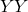
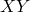
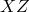
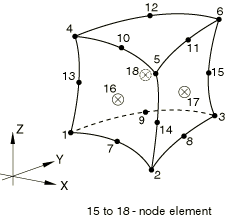
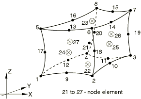
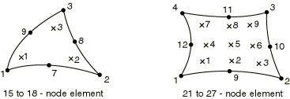
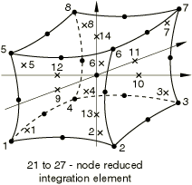

# 28.1.4 三维实体单元库


**产品：** Abaqus/Standard  Abaqus/Explicit  Abaqus/CAE  

##### **参考**

- ["实体（连续体）单元，" 第28.1.1节](pt06ch28s01alm01.md)
- [*SOLID SECTION](../key/key-link.md#usb-kws-msolidsection)

### 概述

本节提供Abaqus/Standard和Abaqus/Explicit中可用的三维实体单元的参考。

### 单元类型

#### 应力/位移单元

| C3D4 | 4节点线性四面体 |
| --- | --- |
|  |  |

| C3D4H(S) | 4节点线性四面体，带线性压力的混合单元 |
| --- | --- |
|  |  |

| C3D6(S) | 6节点线性三角形棱柱 |
| --- | --- |
|  |  |

| C3D6(E) | 6节点线性三角形棱柱，减缩积分带沙漏控制 |
| --- | --- |
|  |  |

| C3D6H(S) | 6节点线性三角形棱柱，带常压力的混合单元 |
| --- | --- |
|  |  |

| C3D8 | 8节点线性砖块 |
| --- | --- |
|  |  |

| C3D8H(S) | 8节点线性砖块，带常压力的混合单元 |
| --- | --- |
|  |  |

| C3D8I | 8节点线性砖块，不相容模式 |
| --- | --- |
|  |  |

| C3D8IH(S) | 8节点线性砖块，不相容模式，带线性压力的混合单元 |
| --- | --- |
|  |  |

| C3D8R | 8节点线性砖块，减缩积分带沙漏控制 |
| --- | --- |
|  |  |

| C3D8RH(S) | 8节点线性砖块，减缩积分带沙漏控制，带常压力的混合单元 |
| --- | --- |
|  |  |

| C3D10(S) | 10节点二次四面体 |
| --- | --- |
|  |  |

| C3D10H(S) | 10节点二次四面体，带常压力的混合单元 |
| --- | --- |
|  |  |

| C3D10I(S) | 10节点通用二次四面体，改进的表面应力可视化 |
| --- | --- |
|  |  |

| C3D10M | 10节点修正四面体，带沙漏控制 |
| --- | --- |
|  |  |

| C3D10MH(S) | 10节点修正四面体，带沙漏控制，带线性压力的混合单元 |
| --- | --- |
|  |  |

| C3D15(S) | 15节点二次三角形棱柱 |
| --- | --- |
|  |  |

| C3D15H(S) | 15节点二次三角形棱柱，带线性压力的混合单元 |
| --- | --- |
|  |  |

| C3D20(S) | 20节点二次砖块 |
| --- | --- |
|  |  |

| C3D20H(S) | 20节点二次砖块，带线性压力的混合单元 |
| --- | --- |
|  |  |

| C3D20R(S) | 20节点二次砖块，减缩积分 |
| --- | --- |
|  |  |

| C3D20RH(S) | 20节点二次砖块，减缩积分，带线性压力的混合单元 |
| --- | --- |
|  |  |

##### 活跃自由度

1、2、3

##### 附加求解变量

带常压力的混合单元有一个与压力相关的附加变量，带线性压力的混合单元有四个与压力相关的附加变量。

C3D8I和C3D8IH单元类型有十三个与不相容模式相关的附加变量。

C3D10M和C3D10MH单元类型有三个附加位移变量。

#### 应力/位移变节点单元

| C3D15V(S) | 15至18节点三角形棱柱 |
| --- | --- |
|  |  |

| C3D15VH(S) | 15至18节点三角形棱柱，带线性压力的混合单元 |
| --- | --- |
|  |  |

| C3D27(S) | 21至27节点砖块 |
| --- | --- |
|  |  |

| C3D27H(S) | 21至27节点砖块，带线性压力的混合单元 |
| --- | --- |
|  |  |

| C3D27R(S) | 21至27节点砖块，减缩积分 |
| --- | --- |
|  |  |

| C3D27RH(S) | 21至27节点砖块，减缩积分，带线性压力的混合单元 |
| --- | --- |
|  |  |

##### 活跃自由度

1、2、3

##### 附加求解变量

混合单元有四个与压力相关的附加变量。

#### 耦合温度-位移单元

| C3D4T | 4节点线性位移和温度 |
| --- | --- |
|  |  |

| C3D6T(S) | 6节点线性位移和温度 |
| --- | --- |
|  |  |

| C3D6T(E) | 6节点线性位移和温度，减缩积分带沙漏控制 |
| --- | --- |
|  |  |

| C3D8T | 8节点三线性位移和温度 |
| --- | --- |
|  |  |

| C3D8HT(S) | 8节点三线性位移和温度，带常压力的混合单元 |
| --- | --- |
|  |  |

| C3D8RT | 8节点三线性位移和温度，减缩积分带沙漏控制 |
| --- | --- |
|  |  |

| C3D8RHT(S) | 8节点三线性位移和温度，减缩积分带沙漏控制，带常压力的混合单元 |
| --- | --- |
|  |  |

| C3D10MT | 10节点修正位移和温度四面体，带沙漏控制 |
| --- | --- |
|  |  |

| C3D10MHT(S) | 10节点修正位移和温度四面体，带沙漏控制，带线性压力的混合单元 |
| --- | --- |
|  |  |

| C3D20T(S) | 20节点三二次位移，三线性温度 |
| --- | --- |
|  |  |

| C3D20HT(S) | 20节点三二次位移，三线性温度，带线性压力的混合单元 |
| --- | --- |
|  |  |

| C3D20RT(S) | 20节点三二次位移，三线性温度，减缩积分 |
| --- | --- |
|  |  |

| C3D20RHT(S) | 20节点三二次位移，三线性温度，减缩积分，带线性压力的混合单元 |
| --- | --- |
|  |  |

##### 活跃自由度

角节点处：1、2、3、11

Abaqus/Standard中二阶单元边中节点处：1、2、3

Abaqus/Standard中修正位移和温度单元边中节点处：1、2、3、11

##### 附加求解变量

带常压力的混合单元有一个与压力相关的附加变量，带线性压力的混合单元有四个与压力相关的附加变量。

C3D10MT和C3D10MHT单元类型有三个附加位移变量和一个附加温度变量。

#### 耦合热-电-结构单元

| Q3D4(S) | 4节点线性位移、电势和温度 |
| --- | --- |
|  |  |

| Q3D6(S) | 6节点线性位移、电势和温度 |
| --- | --- |
|  |  |

| Q3D8(S) | 8节点三线性位移、电势和温度 |
| --- | --- |
|  |  |

| Q3D8H(S) | 8节点三线性位移、电势和温度，带常压力的混合单元 |
| --- | --- |
|  |  |

| Q3D8R(S) | 8节点三线性位移、电势和温度，减缩积分带沙漏控制 |
| --- | --- |
|  |  |

| Q3D8RH(S) | 8节点三线性位移、电势和温度，减缩积分带沙漏控制，带常压力的混合单元 |
| --- | --- |
|  |  |

| Q3D10M(S) | 10节点修正位移、电势和温度四面体，带沙漏控制 |
| --- | --- |
|  |  |

| Q3D10MH(S) | 10节点修正位移、电势和温度四面体，带沙漏控制，带线性压力的混合单元 |
| --- | --- |
|  |  |

| Q3D20(S) | 20节点三二次位移、三线性电势和三线性温度 |
| --- | --- |
|  |  |

| Q3D20H(S) | 20节点三二次位移、三线性电势、三线性温度，带线性压力的混合单元 |
| --- | --- |
|  |  |

| Q3D20R(S) | 20节点三二次位移、三线性电势、三线性温度，减缩积分 |
| --- | --- |
|  |  |

| Q3D20RH(S) | 20节点三二次位移、三线性电势、三线性温度，减缩积分，带线性压力的混合单元 |
| --- | --- |
|  |  |

##### 活跃自由度

角节点处：1、2、3、9、11

Abaqus/Standard中二阶单元边中节点处：1、2、3

Abaqus/Standard中修正位移和温度单元边中节点处：1、2、3、9、11

##### 附加求解变量

带常压力的混合单元有一个与压力相关的附加变量，带线性压力的混合单元有四个与压力相关的附加变量。

Q3D10M和Q3D10MH单元类型有三个附加位移变量、一个附加电势变量和一个附加温度变量。

#### 扩散热传递或质量扩散单元

| DC3D4(S) | 4节点线性四面体 |
| --- | --- |
|  |  |

| DC3D6(S) | 6节点线性三角形棱柱 |
| --- | --- |
|  |  |

| DC3D8(S) | 8节点线性砖块 |
| --- | --- |
|  |  |

| DC3D10(S) | 10节点二次四面体 |
| --- | --- |
|  |  |

| DC3D15(S) | 15节点二次三角形棱柱 |
| --- | --- |
|  |  |

| DC3D20(S) | 20节点二次砖块 |
| --- | --- |
|  |  |

##### 活跃自由度

11

##### 附加求解变量

无。

#### 强制对流/扩散单元

| DCC3D8(S) | 8节点 |
| --- | --- |
|  |  |

| DCC3D8D(S) | 8节点带色散控制 |
| --- | --- |
|  |  |

##### 活跃自由度

11

##### 附加求解变量

无。

#### 耦合热电单元

| DC3D4E(S) | 4节点线性四面体 |
| --- | --- |
|  |  |

| DC3D6E(S) | 6节点线性三角形棱柱 |
| --- | --- |
|  |  |

| DC3D8E(S) | 8节点线性砖块 |
| --- | --- |
|  |  |

| DC3D10E(S) | 10节点二次四面体 |
| --- | --- |
|  |  |

| DC3D15E(S) | 15节点二次三角形棱柱 |
| --- | --- |
|  |  |

| DC3D20E(S) | 20节点二次砖块 |
| --- | --- |
|  |  |

##### 活跃自由度

9、11

##### 附加求解变量

无。

#### 孔隙压力单元

| C3D4P(S) | 4节点线性位移和孔隙压力 |
| --- | --- |
|  |  |

| C3D6P(S) | 6节点线性位移和孔隙压力 |
| --- | --- |
|  |  |

| C3D8P(S) | 8节点三线性位移和孔隙压力 |
| --- | --- |
|  |  |

| C3D8PH(S) | 8节点三线性位移和孔隙压力，带常压力的混合单元 |
| --- | --- |
|  |  |

| C3D8RP(S) | 8节点三线性位移和孔隙压力，减缩积分 |
| --- | --- |
|  |  |

| C3D8RPH(S) | 8节点三线性位移和孔隙压力，减缩积分，带常压力的混合单元 |
| --- | --- |
|  |  |

| C3D10MP(S) | 10节点修正位移和孔隙压力四面体，带沙漏控制 |
| --- | --- |
|  |  |

| C3D10MPH(S) | 10节点修正位移和孔隙压力四面体，带沙漏控制，带线性压力的混合单元 |
| --- | --- |
|  |  |

| C3D20P(S) | 20节点三二次位移、三线性孔隙压力 |
| --- | --- |
|  |  |

| C3D20PH(S) | 20节点三二次位移、三线性孔隙压力，带线性压力的混合单元 |
| --- | --- |
|  |  |

| C3D20RP(S) | 20节点三二次位移、三线性孔隙压力，减缩积分 |
| --- | --- |
|  |  |

| C3D20RPH(S) | 20节点三二次位移、三线性孔隙压力，减缩积分，带线性压力的混合单元 |
| --- | --- |
|  |  |

##### 活跃自由度

对于除C3D10MP和C3D10MPH外的所有单元，边中节点处为1、2、3（它们也在边中节点处激活自由度8）

角节点处：1、2、3、8

##### 附加求解变量

带常压力的混合单元有一个与有效压力应力相关的附加变量，带线性压力的混合单元有四个与有效压力应力相关的附加变量，以允许完全不可压缩材料建模。

C3D10MP和C3D10MPH单元类型有三个附加位移变量和一个附加孔隙压力变量。

#### 耦合温度-孔隙压力单元

| C3D8PT(S) | 8节点三线性位移、孔隙压力和温度。 |
| --- | --- |
|  |  |

| C3D8PHT(S) | 8节点三线性位移、孔隙压力和温度；带常压力的混合单元 |
| --- | --- |
|  |  |

| C3D8RPT(S) | 8节点三线性位移、孔隙压力和温度；减缩积分 |
| --- | --- |
|  |  |

| C3D8RPHT(S) | 8节点三线性位移、孔隙压力和温度；减缩积分，带常压力的混合单元 |
| --- | --- |
|  |  |

| C3D10MPT(S) | 10节点修正位移、孔隙压力和温度四面体，带沙漏控制 |
| --- | --- |
|  |  |

##### 活跃自由度

1、2、3、8、11

##### 附加求解变量

带常压力的混合单元有一个与有效压力应力相关的附加变量，以允许完全不可压缩材料建模。

C3D10MPT单元类型有三个附加位移变量、一个附加孔隙压力变量和一个附加温度变量。

#### 声学单元

| AC3D4 | 4节点线性四面体 |
| --- | --- |
|  |  |

| AC3D5 | 5节点线性金字塔 |
| --- | --- |
|  |  |

| AC3D6 | 6节点线性三角形棱柱 |
| --- | --- |
|  |  |

| AC3D8(S) | 8节点线性砖块 |
| --- | --- |
|  |  |

| AC3D8R(E) | 8节点线性砖块，减缩积分带沙漏控制 |
| --- | --- |
|  |  |

| AC3D10(S) | 10节点二次四面体 |
| --- | --- |
|  |  |

| AC3D15(S) | 15节点二次三角形棱柱 |
| --- | --- |
|  |  |

| AC3D20(S) | 20节点二次砖块 |
| --- | --- |
|  |  |

##### 活跃自由度

8

##### 附加求解变量

无。

#### 压电单元

| C3D4E(S) | 4节点线性四面体 |
| --- | --- |
|  |  |

| C3D6E(S) | 6节点线性三角形棱柱 |
| --- | --- |
|  |  |

| C3D8E(S) | 8节点线性砖块 |
| --- | --- |
|  |  |

| C3D10E(S) | 10节点二次四面体 |
| --- | --- |
|  |  |

| C3D15E(S) | 15节点二次三角形棱柱 |
| --- | --- |
|  |  |

| C3D20E(S) | 20节点二次砖块 |
| --- | --- |
|  |  |

| C3D20RE(S) | 20节点二次砖块，减缩积分 |
| --- | --- |
|  |  |

##### 活跃自由度

1、2、3、9

##### 附加求解变量

无。

#### 电磁单元

| EMC3D4(S) | 4节点零阶 |
| --- | --- |
|  |  |

| EMC3D6(S) | 6节点零阶 |
| --- | --- |
|  |  |

| EMC3D8(S) | 8节点零阶 |
| --- | --- |
|  |  |

##### 活跃自由度

磁矢势（更多信息参见["涡流分析中的边界条件，" 第6.7.5节](pt03ch06s07at24.md#usb-anl-aeddycurrent-bc)和["静磁分析中的边界条件，" 第6.7.6节](pt03ch06s07at25.md#usb-anl-amagnetostatic-bc)）。

##### 附加求解变量

无。

### 所需节点坐标

*X*、*Y*、*Z*

### 单元属性定义

| **输入文件用法：** | ``` [*SOLID SECTION](../key/key-link.md#usb-kws-msolidsection) ``` |
| --- | --- |

| **Abaqus/CAE用法：** | 属性模块：**创建截面**：选择**实体**作为截面**类别**，选择**均匀**或**电磁、实体**作为截面**类型** |
| --- | --- |

### 基于单元的载荷

### 分布载荷

分布载荷适用于所有具有位移自由度的单元。如["分布载荷，" 第34.4.3节](pt07ch34s04aus122.md)中所述指定。

**载荷ID (*DLOAD)：**  BX**Abaqus/CAE载荷/相互作用：**  **体力****单位：**  [FL3](../popups/usb-int-iconventions-unitsym.md)**描述：**  全局*X*方向的体力。

**载荷ID (*DLOAD)：**  BY**Abaqus/CAE载荷/相互作用：**  **体力****单位：**  [FL3](../popups/usb-int-iconventions-unitsym.md)**描述：**  全局*Y*方向的体力。

**载荷ID (*DLOAD)：**  BZ**Abaqus/CAE载荷/相互作用：**  **体力****单位：**  [FL3](../popups/usb-int-iconventions-unitsym.md)**描述：**  全局*Z*方向的体力。

**载荷ID (*DLOAD)：**  BXNU**Abaqus/CAE载荷/相互作用：**  **体力****单位：**  [FL3](../popups/usb-int-iconventions-unitsym.md)**描述：**  全局*X*方向的非均匀体力，幅值通过用户子程序[`DLOAD`](../sub/sub-link.md#sub-xsl-dload)（Abaqus/Standard）和[`VDLOAD`](../sub/sub-link.md#sub-xsl-vdload)（Abaqus/Explicit）提供。

**载荷ID (*DLOAD)：**  BYNU**Abaqus/CAE载荷/相互作用：**  **体力****单位：**  [FL3](../popups/usb-int-iconventions-unitsym.md)**描述：**  全局*Y*方向的非均匀体力，幅值通过用户子程序[`DLOAD`](../sub/sub-link.md#sub-xsl-dload)（Abaqus/Standard）和[`VDLOAD`](../sub/sub-link.md#sub-xsl-vdload)（Abaqus/Explicit）提供。

**载荷ID (*DLOAD)：**  BZNU**Abaqus/CAE载荷/相互作用：**  **体力****单位：**  [FL3](../popups/usb-int-iconventions-unitsym.md)**描述：**  全局*Z*方向的非均匀体力，幅值通过用户子程序[`DLOAD`](../sub/sub-link.md#sub-xsl-dload)（Abaqus/Standard）和[`VDLOAD`](../sub/sub-link.md#sub-xsl-vdload)（Abaqus/Explicit）提供。

**载荷ID (*DLOAD)：**  CENT(S)**Abaqus/CAE载荷/相互作用：**  不支持**单位：**  [FL4(ML3T2)](../popups/usb-int-iconventions-unitsym.md)**描述：**  离心载荷（幅值输入为，其中是单位体积质量密度，是角速度）。不适用于孔隙压力单元。

**载荷ID (*DLOAD)：**  CENTRIF(S)**Abaqus/CAE载荷/相互作用：**  **旋转体力****单位：**  [T2](../popups/usb-int-iconventions-unitsym.md)**描述：**  离心载荷（幅值输入为，其中是角速度）。

**载荷ID (*DLOAD)：**  CORIO(S)**Abaqus/CAE载荷/相互作用：**  **科里奥利力****单位：**  [FL4T (ML3T1)](../popups/usb-int-iconventions-unitsym.md)**描述：**  科里奥利力（幅值输入为，其中是单位体积质量密度，是角速度）。不适用于孔隙压力单元。

**载荷ID (*DLOAD)：**  GRAV**Abaqus/CAE载荷/相互作用：**  **重力****单位：**  [LT2](../popups/usb-int-iconventions-unitsym.md)**描述：**  指定方向的重力载荷（幅值输入为加速度）。

**载荷ID (*DLOAD)：**  HP*n*(S)**Abaqus/CAE载荷/相互作用：**  不支持**单位：**  [FL2](../popups/usb-int-iconventions-unitsym.md)**描述：**  面*n*上的静水压力，在全局*Z*方向线性分布。

**载荷ID (*DLOAD)：**  P*n***Abaqus/CAE载荷/相互作用：**  **压力****单位：**  [FL2](../popups/usb-int-iconventions-unitsym.md)**描述：**  面*n*上的压力。

**载荷ID (*DLOAD)：**  P*n*NU**Abaqus/CAE载荷/相互作用：**  不支持**单位：**  [FL2](../popups/usb-int-iconventions-unitsym.md)**描述：**  面*n*上的非均匀压力，幅值通过用户子程序[`DLOAD`](../sub/sub-link.md#sub-xsl-dload)（Abaqus/Standard）和[`VDLOAD`](../sub/sub-link.md#sub-xsl-vdload)（Abaqus/Explicit）提供。

**载荷ID (*DLOAD)：**  ROTA(S)**Abaqus/CAE载荷/相互作用：**  **旋转体力****单位：**  [T2](../popups/usb-int-iconventions-unitsym.md)**描述：**  旋转加速度载荷（幅值输入为，其中是旋转加速度）。

**载荷ID (*DLOAD)：**  ROTDYNF(S)**Abaqus/CAE载荷/相互作用：**  不支持**单位：**  [T1](../popups/usb-int-iconventions-unitsym.md)**描述：**  转子动力学载荷（幅值输入为，其中是角速度）。

**载荷ID (*DLOAD)：**  SBF(E)**Abaqus/CAE载荷/相互作用：**  不支持**单位：**  [FL5T2](../popups/usb-int-iconventions-unitsym.md)**描述：**  全局*X*-、*Y*-和*Z*方向的滞止体力。

**载荷ID (*DLOAD)：**  SP*n*(E)**Abaqus/CAE载荷/相互作用：**  不支持**单位：**  [FL4T2](../popups/usb-int-iconventions-unitsym.md)**描述：**  面*n*上的滞止压力。

**载荷ID (*DLOAD)：**  TRSHR*n***Abaqus/CAE载荷/相互作用：**  **表面牵引****单位：**  [FL2](../popups/usb-int-iconventions-unitsym.md)**描述：**  面*n*上的剪切牵引。

**载荷ID (*DLOAD)：**  TRSHR*n*NU(S)**Abaqus/CAE载荷/相互作用：**  不支持**单位：**  [FL2](../popups/usb-int-iconventions-unitsym.md)**描述：**  面*n*上的非均匀剪切牵引，幅值和方向通过用户子程序[`UTRACLOAD`](../sub/sub-link.md#sub-xsl-utracload)提供。

**载荷ID (*DLOAD)：**  TRVEC*n***Abaqus/CAE载荷/相互作用：**  **表面牵引****单位：**  [FL2](../popups/usb-int-iconventions-unitsym.md)**描述：**  面*n*上的一般牵引。

**载荷ID (*DLOAD)：**  TRVEC*n*NU(S)**Abaqus/CAE载荷/相互作用：**  不支持**单位：**  [FL2](../popups/usb-int-iconventions-unitsym.md)**描述：**  面*n*上的非均匀一般牵引，幅值和方向通过用户子程序[`UTRACLOAD`](../sub/sub-link.md#sub-xsl-utracload)提供。

**载荷ID (*DLOAD)：**  VBF(E)**Abaqus/CAE载荷/相互作用：**  不支持**单位：**  [FL4T](../popups/usb-int-iconventions-unitsym.md)**描述：**  全局*X*-、*Y*-和*Z*方向的粘性体力。

**载荷ID (*DLOAD)：**  VP*n*(E)**Abaqus/CAE载荷/相互作用：**  不支持**单位：**  [FL3T](../popups/usb-int-iconventions-unitsym.md)**描述：**  面*n*上的粘性压力，施加与面法向速度成正比且阻碍运动的压力。

### 基础

基础适用于Abaqus/Standard中具有位移自由度的单元。如["单元基础，" 第2.2.2节](pt01ch02s02aus12.md)中所述指定。

**载荷ID (*FOUNDATION)：**  F*n*(S)**Abaqus/CAE载荷/相互作用：**  **弹性基础****单位：**  [FL3](../popups/usb-int-iconventions-unitsym.md)**描述：**  面*n*上的弹性基础。

### 分布热通量

分布热通量适用于所有具有温度自由度的单元。如["热载荷，" 第34.4.4节](pt07ch34s04aus123.md)中所述指定。

**载荷ID (*DFLUX)：**  BF**Abaqus/CAE载荷/相互作用：**  **体积热通量****单位：**  [JL3T1](../popups/usb-int-iconventions-unitsym.md)**描述：**  单位体积热体积通量。

**载荷ID (*DFLUX)：**  BFNU(S)**Abaqus/CAE载荷/相互作用：**  **体积热通量****单位：**  [JL3T1](../popups/usb-int-iconventions-unitsym.md)**描述：**  单位体积非均匀热体积通量，幅值通过用户子程序[`DFLUX`](../sub/sub-link.md#sub-xsl-dflux)提供。

**载荷ID (*DFLUX)：**  S*n***Abaqus/CAE载荷/相互作用：**  **表面热通量****单位：**  [JL2T1](../popups/usb-int-iconventions-unitsym.md)**描述：**  进入面*n*的单位面积热表面通量。

**载荷ID (*DFLUX)：**  S*n*NU(S)**Abaqus/CAE载荷/相互作用：**  不支持**单位：**  [JL2T1](../popups/usb-int-iconventions-unitsym.md)**描述：**  进入面*n*的单位面积非均匀热表面通量，幅值通过用户子程序[`DFLUX`](../sub/sub-link.md#sub-xsl-dflux)提供。

### 薄膜条件

薄膜条件适用于所有具有温度自由度的单元。如["热载荷，" 第34.4.4节](pt07ch34s04aus123.md)中所述指定。

**载荷ID (*FILM)：**  F*n***Abaqus/CAE载荷/相互作用：**  **表面薄膜条件****单位：**  [JL2T11](../popups/usb-int-iconventions-unitsym.md)**描述：**  面*n*上提供的膜系数和受热温度（的单位）。

**载荷ID (*FILM)：**  F*n*NU(S)**Abaqus/CAE载荷/相互作用：**  不支持**单位：**  [JL2T11](../popups/usb-int-iconventions-unitsym.md)**描述：**  面*n*上提供的非均匀膜系数和受热温度（的单位），幅值通过用户子程序[`FILM`](../sub/sub-link.md#sub-xsl-film)提供。

### 辐射类型

辐射条件适用于所有具有温度自由度的单元。如["热载荷，" 第34.4.4节](pt07ch34s04aus123.md)中所述指定。

**载荷ID (*RADIATE)：**  R*n***Abaqus/CAE载荷/相互作用：**  **表面辐射****单位：**  [无量纲](../popups/usb-int-iconventions-unitsym.md)**描述：**  面*n*上提供的发射率和受热温度。

### 分布流

分布流适用于所有具有孔隙压力自由度的单元。如["孔隙流体流动，" 第34.4.7节](pt07ch34s04aus126.md)中所述指定。

**载荷ID (*FLOW)：**  Q*n*(S)**Abaqus/CAE载荷/相互作用：**  不支持**单位：**  [F1L3T1](../popups/usb-int-iconventions-unitsym.md)**描述：**  面*n*上提供的渗流系数和参考汇孔隙压力（[FL2](../popups/usb-int-iconventions-unitsym.md)的单位）。

**载荷ID (*FLOW)：**  Q*n*D(S)**Abaqus/CAE载荷/相互作用：**  不支持**单位：**  [F1L3T1](../popups/usb-int-iconventions-unitsym.md)**描述：**  面*n*上提供的仅排水渗流系数。

**载荷ID (*FLOW)：**  Q*n*NU(S)**Abaqus/CAE载荷/相互作用：**  不支持**单位：**  [F1L3T1](../popups/usb-int-iconventions-unitsym.md)**描述：**  面*n*上提供的非均匀渗流系数和参考汇孔隙压力（[FL2](../popups/usb-int-iconventions-unitsym.md)的单位），幅值通过用户子程序[`FLOW`](../sub/sub-link.md#sub-xsl-flow)提供。

**载荷ID (*DFLOW)：**  S*n*(S)**Abaqus/CAE载荷/相互作用：**  **表面孔隙流体****单位：**  [LT1](../popups/usb-int-iconventions-unitsym.md)**描述：**  面*n*上规定的孔隙流体有效速度（从面流出）。

**载荷ID (*DFLOW)：**  S*n*NU(S)**Abaqus/CAE载荷/相互作用：**  不支持**单位：**  [LT1](../popups/usb-int-iconventions-unitsym.md)**描述：**  面*n*上规定的非均匀孔隙流体有效速度（从面流出），幅值通过用户子程序[`DFLOW`](../sub/sub-link.md#sub-xsl-dflow)提供。

### 分布阻抗

分布阻抗适用于所有具有声压自由度的单元。如["声学和冲击载荷，" 第34.4.6节](pt07ch34s04aus125.md)中所述指定。

**载荷ID (*IMPEDANCE)：**  I*n***Abaqus/CAE载荷/相互作用：**  不支持**单位：**  [无](../popups/usb-int-iconventions-unitsym.md)**描述：**  定义面*n*上阻抗的阻抗属性名称。

### 电通量

电通量适用于压电单元。如["压电分析，" 第6.7.2节](pt03ch06s07at21.md)中所述指定。

**载荷ID (*DECHARGE)：**  EBF(S)**Abaqus/CAE载荷/相互作用：**  **体积电荷****单位：**  [CL3](../popups/usb-int-iconventions-unitsym.md)**描述：**  单位体积电荷体通量。

**载荷ID (*DECHARGE)：**  ES*n*(S)**Abaqus/CAE载荷/相互作用：**  **表面电荷****单位：**  [CL2](../popups/usb-int-iconventions-unitsym.md)**描述：**  面*n*上规定的表面电荷。

### 分布电流密度

分布电流密度适用于耦合热电、耦合热电结构和电磁单元。如["耦合热电分析，" 第6.7.3节](pt03ch06s07at22.md)、["完全耦合热电结构分析，" 第6.7.4节](pt03ch06s07at23.md)和["涡流分析，" 第6.7.5节](pt03ch06s07at24.md)中所述指定。

**载荷ID (*DECURRENT)：**  CBF(S)**Abaqus/CAE载荷/相互作用：**  **体积电流****单位：**  [CL3T1](../popups/usb-int-iconventions-unitsym.md)**描述：**  体积电流源密度。

**载荷ID (*DECURRENT)：**  CS*n*(S)**Abaqus/CAE载荷/相互作用：**  **表面电流****单位：**  [CL2T1](../popups/usb-int-iconventions-unitsym.md)**描述：**  面*n*上的电流密度。

**载荷ID (*DECURRENT)：**  CJ(S)**Abaqus/CAE载荷/相互作用：**  **体积电流密度****单位：**  [CL2T1](../popups/usb-int-iconventions-unitsym.md)**描述：**  涡流分析中的体积电流密度矢量。

### 分布浓度通量

分布浓度通量适用于质量扩散单元。如["质量扩散分析，" 第6.9.1节](pt03ch06s09at28.md)中所述指定。

**载荷ID (*DFLUX)：**  BF(S)**Abaqus/CAE载荷/相互作用：**  **体积浓度通量 ****单位：**  [PT1](../popups/usb-int-iconventions-unitsym.md)**描述：**  单位体积浓度体积通量。

**载荷ID (*DFLUX)：**  BFNU(S)**Abaqus/CAE载荷/相互作用：**  **体积浓度通量****单位：**  [PT1](../popups/usb-int-iconventions-unitsym.md)**描述：**  单位体积非均匀浓度体积通量，幅值通过用户子程序[`DFLUX`](../sub/sub-link.md#sub-xsl-dflux)提供。

**载荷ID (*DFLUX)：**  S*n*(S)**Abaqus/CAE载荷/相互作用：**  **表面浓度通量****单位：**  [PLT1](../popups/usb-int-iconventions-unitsym.md)**描述：**  进入面*n*的单位面积浓度表面通量。

**载荷ID (*DFLUX)：**  S*n*NU(S)**Abaqus/CAE载荷/相互作用：**  **表面浓度通量****单位：**  [PLT1](../popups/usb-int-iconventions-unitsym.md)**描述：**  进入面*n*的单位面积非均匀浓度表面通量，幅值通过用户子程序[`DFLUX`](../sub/sub-link.md#sub-xsl-dflux)提供。

### 基于表面的载荷

### 分布载荷

基于表面的分布载荷适用于所有具有位移自由度的单元。如["分布载荷，" 第34.4.3节](pt07ch34s04aus122.md)中所述指定。

**载荷ID (*DSLOAD)：**  HP(S)**Abaqus/CAE载荷/相互作用：**  **压力****单位：**  [FL2](../popups/usb-int-iconventions-unitsym.md)**描述：**  单元表面上的静水压力，在全局*Z*方向线性分布。

**载荷ID (*DSLOAD)：**  P**Abaqus/CAE载荷/相互作用：**  **压力****单位：**  [FL2](../popups/usb-int-iconventions-unitsym.md)**描述：**  单元表面上的压力。

**载荷ID (*DSLOAD)：**  PNU**Abaqus/CAE载荷/相互作用：**  **压力****单位：**  [FL2](../popups/usb-int-iconventions-unitsym.md)**描述：**  单元表面上的非均匀压力，幅值通过用户子程序[`DLOAD`](../sub/sub-link.md#sub-xsl-dload)（Abaqus/Standard）和[`VDLOAD`](../sub/sub-link.md#sub-xsl-vdload)（Abaqus/Explicit）提供。

**载荷ID (*DSLOAD)：**  SP(E)**Abaqus/CAE载荷/相互作用：**  **压力****单位：**  [FL4T2](../popups/usb-int-iconventions-unitsym.md)**描述：**  单元表面上的滞止压力。

**载荷ID (*DSLOAD)：**  TRSHR**Abaqus/CAE载荷/相互作用：**  **表面牵引****单位：**  [FL2](../popups/usb-int-iconventions-unitsym.md)**描述：**  单元表面上的剪切牵引。

**载荷ID (*DSLOAD)：**  TRSHRNU(S)**Abaqus/CAE载荷/相互作用：**  **表面牵引****单位：**  [FL2](../popups/usb-int-iconventions-unitsym.md)**描述：**  单元表面上的非均匀剪切牵引，幅值和方向通过用户子程序[`UTRACLOAD`](../sub/sub-link.md#sub-xsl-utracload)提供。

**载荷ID (*DSLOAD)：**  TRVEC**Abaqus/CAE载荷/相互作用：**  **表面牵引****单位：**  [FL2](../popups/usb-int-iconventions-unitsym.md)**描述：**  单元表面上的一般牵引。

**载荷ID (*DSLOAD)：**  TRVECNU(S)**Abaqus/CAE载荷/相互作用：**  **表面牵引****单位：**  [FL2](../popups/usb-int-iconventions-unitsym.md)**描述：**  单元表面上的非均匀一般牵引，幅值和方向通过用户子程序[`UTRACLOAD`](../sub/sub-link.md#sub-xsl-utracload)提供。

**载荷ID (*DSLOAD)：**  VP(E)**Abaqus/CAE载荷/相互作用：**  **压力****单位：**  [FL3T](../popups/usb-int-iconventions-unitsym.md)**描述：**  施加在单元表面上的粘性压力。粘性压力与面法向速度成正比且阻碍运动。

### 分布热通量

基于表面的热通量适用于所有具有温度自由度的单元。如["热载荷，" 第34.4.4节](pt07ch34s04aus123.md)中所述指定。

**载荷ID (*DSFLUX)：**  S**Abaqus/CAE载荷/相互作用：**  **表面热通量****单位：**  [JL2T1](../popups/usb-int-iconventions-unitsym.md)**描述：**  进入单元表面的单位面积热表面通量。

**载荷ID (*DSFLUX)：**  SNU(S)**Abaqus/CAE载荷/相互作用：**  **表面热通量****单位：**  [JL2T1](../popups/usb-int-iconventions-unitsym.md)**描述：**  进入单元表面的单位面积非均匀热表面通量，幅值通过用户子程序[`DFLUX`](../sub/sub-link.md#sub-xsl-dflux)提供。

### 薄膜条件

基于表面的薄膜条件适用于所有具有温度自由度的单元。如["热载荷，" 第34.4.4节](pt07ch34s04aus123.md)中所述指定。

**载荷ID (*SFILM)：**  F**Abaqus/CAE载荷/相互作用：**  **表面薄膜条件****单位：**  [JL2T11](../popups/usb-int-iconventions-unitsym.md)**描述：**  单元表面上提供的膜系数和受热温度（的单位）。

**载荷ID (*SFILM)：**  FNU(S)**Abaqus/CAE载荷/相互作用：**  **表面薄膜条件****单位：**  [JL2T11](../popups/usb-int-iconventions-unitsym.md)**描述：**  单元表面上提供的非均匀膜系数和受热温度（的单位），幅值通过用户子程序[`FILM`](../sub/sub-link.md#sub-xsl-film)提供。

### 辐射类型

基于表面的辐射条件适用于所有具有温度自由度的单元。如["热载荷，" 第34.4.4节](pt07ch34s04aus123.md)中所述指定。

**载荷ID (*SRADIATE)：**  R**Abaqus/CAE载荷/相互作用：**  **表面辐射****单位：**  [无量纲](../popups/usb-int-iconventions-unitsym.md)**描述：**  单元表面上提供的发射率和受热温度。

### 分布流

基于表面的流适用于所有具有孔隙压力自由度的单元。如["孔隙流体流动，" 第34.4.7节](pt07ch34s04aus126.md)中所述指定。

**载荷ID (*SFLOW)：**  Q(S)**Abaqus/CAE载荷/相互作用：**  不支持**单位：**  [F1L3T1](../popups/usb-int-iconventions-unitsym.md)**描述：**  单元表面上提供的渗流系数和参考汇孔隙压力（[FL2](../popups/usb-int-iconventions-unitsym.md)的单位）。

**载荷ID (*SFLOW)：**  QD(S)**Abaqus/CAE载荷/相互作用：**  不支持**单位：**  [F1L3T1](../popups/usb-int-iconventions-unitsym.md)**描述：**  单元表面上提供的仅排水渗流系数。

**载荷ID (*SFLOW)：**  QNU(S)**Abaqus/CAE载荷/相互作用：**  不支持**单位：**  [F1L3T1](../popups/usb-int-iconventions-unitsym.md)**描述：**  单元表面上提供的非均匀渗流系数和参考汇孔隙压力（[FL2](../popups/usb-int-iconventions-unitsym.md)的单位），幅值通过用户子程序[`FLOW`](../sub/sub-link.md#sub-xsl-flow)提供。

**载荷ID (*DSFLOW)：**  S(S)**Abaqus/CAE载荷/相互作用：**  **表面孔隙流体****单位：**  [LT1](../popups/usb-int-iconventions-unitsym.md)**描述：**  从单元表面流出的规定孔隙流体有效速度。

**载荷ID (*DSFLOW)：**  SNU(S)**Abaqus/CAE载荷/相互作用：**  **表面孔隙流体****单位：**  [LT1](../popups/usb-int-iconventions-unitsym.md)**描述：**  从单元表面流出的非均匀规定孔隙流体有效速度，幅值通过用户子程序[`DFLOW`](../sub/sub-link.md#sub-xsl-dflow)提供。

### 分布阻抗

基于表面的阻抗适用于所有具有声压自由度的单元。如["声学和冲击载荷，" 第34.4.6节](pt07ch34s04aus125.md)中所述指定。

### 入射波载荷

基于表面的入射波载荷适用于所有具有位移自由度或声压自由度的单元。如["声学和冲击载荷，" 第34.4.6节](pt07ch34s04aus125.md)中所述指定。如果入射波场包括从网格边界外平面的反射，可以包含此效果。

### 电通量

基于表面的电通量适用于压电单元。如["压电分析，" 第6.7.2节](pt03ch06s07at21.md)中所述指定。

**载荷ID (*DSECHARGE)：**  ES(S)**Abaqus/CAE载荷/相互作用：**  **表面电荷****单位：**  [CL2](../popups/usb-int-iconventions-unitsym.md)**描述：**  单元表面上规定的表面电荷。

### 分布电流密度

基于表面的电流密度适用于耦合热电、耦合热电结构和电磁单元。如["耦合热电分析，" 第6.7.3节](pt03ch06s07at22.md)、["完全耦合热电结构分析，" 第6.7.4节](pt03ch06s07at23.md)和["涡流分析，" 第6.7.5节](pt03ch06s07at24.md)中所述指定。

**载荷ID (*DSECURRENT)：**  CS(S)**Abaqus/CAE载荷/相互作用：**  **表面电流****单位：**  [CL2T1](../popups/usb-int-iconventions-unitsym.md)**描述：**  单元表面上的电流密度。

**载荷ID (*DSECURRENT)：**  CK(S)**Abaqus/CAE载荷/相互作用：**  **表面电流密度****单位：**  [CL1T1](../popups/usb-int-iconventions-unitsym.md)**描述：**  涡流分析中的表面电流密度矢量。

### 单元输出

对于大多数单元，输出采用全局方向，除非通过截面定义（["方向，" 第2.2.5节](pt01ch02s02aus15.md)）为单元分配了局部坐标系，在这种情况下，输出采用局部坐标系（在几何非线性分析中随运动旋转）。详情参见["状态存储，" Abaqus理论指南第1.5.4节](../stm/stm-link.md#stm-int-statestorage)。

#### 应力、应变和其他张量分量

对于具有位移自由度的单元，应力和其他张量（包括应变张量）均可用。所有张量具有相同的分量。例如，应力分量如下：

| S11 | ，直接应力。 |
| --- | --- |

| S22 | ，直接应力。 |
| --- | --- |

| S33 | ，直接应力。 |
| --- | --- |

| S12 | ，剪切应力。 |
| --- | --- |

| S13 | ，剪切应力。 |
| --- | --- |

| S23 | ，剪切应力。 |
| --- | --- |

注意：上面显示的顺序与用户子程序[`VUMAT`](../sub/sub-link.md#sub-xsl-vumat)中使用的顺序不同。

#### 热通量分量

适用于具有温度自由度的单元。

| HFL1 | *X*方向的热通量。 |
| --- | --- |

| HFL2 | *Y*方向的热通量。 |
| --- | --- |

| HFL3 | *Z*方向的热通量。 |
| --- | --- |

#### 孔隙流体速度分量

适用于具有孔隙压力自由度的单元。

| FLVEL1 | *X*方向的孔隙流体有效速度。 |
| --- | --- |

| FLVEL2 | *Y*方向的孔隙流体有效速度。 |
| --- | --- |

| FLVEL3 | *Z*方向的孔隙流体有效速度。 |
| --- | --- |

#### 质量浓度通量分量

适用于具有归一化浓度自由度的单元。

| MFL1 | *X*方向的浓度通量。 |
| --- | --- |

| MFL2 | *Y*方向的浓度通量。 |
| --- | --- |

| MFL3 | *Z*方向的浓度通量。 |
| --- | --- |

#### 电势梯度

适用于具有电势自由度的单元。

| EPG1 | *X*方向的电势梯度。 |
| --- | --- |

| EPG2 | *Y*方向的电势梯度。 |
| --- | --- |

| EPG3 | *Z*方向的电势梯度。 |
| --- | --- |

#### 电通量分量

适用于压电单元。

| EFLX1 | *X*方向的电通量。 |
| --- | --- |

| EFLX2 | *Y*方向的电通量。 |
| --- | --- |

| EFLX3 | *Z*方向的电通量。 |
| --- | --- |

#### 电流密度分量

适用于耦合热电和耦合热电结构单元。

| ECD1 | *X*方向的电流密度。 |
| --- | --- |

| ECD2 | 方向的电流密度。 |
| --- | --- |

| ECD3 | *Z*方向的电流密度。 |
| --- | --- |

#### 电场分量

适用于涡流分析中的电磁单元。

| EME1 | *X*方向的电场。 |
| --- | --- |

| EME2 | *Y*方向的电场。 |
| --- | --- |

| EME3 | *Z*方向的电场。 |
| --- | --- |

#### 磁通密度分量

适用于电磁单元。

| EMB1 | *X*方向的磁通密度。 |
| --- | --- |

| EMB2 | *Y*方向的磁通密度。 |
| --- | --- |

| EMB3 | *Z*方向的磁通密度。 |
| --- | --- |

#### 磁场分量

适用于电磁单元。

| EMH1 | *X*方向的磁场。 |
| --- | --- |

| EMH2 | *Y*方向的磁场。 |
| --- | --- |

| EMH3 | *Z*方向的磁场。 |
| --- | --- |

#### 涡流分析中的涡流密度分量

适用于涡流分析中的电磁单元。

| EMCD1 | *X*方向的涡流密度。 |
| --- | --- |

| EMCD2 | *Y*方向的涡流密度。 |
| --- | --- |

| EMCD3 | *Z*方向的涡流密度。 |
| --- | --- |

#### 涡流或静磁分析中的施加体积电流密度分量

适用于涡流或静磁分析中的电磁单元。

| EMCDA1 | *X*方向的施加体积电流密度。 |
| --- | --- |

| EMCDA2 | *Y*方向的施加体积电流密度。 |
| --- | --- |

| EMCDA3 | *Z*方向的施加体积电流密度。 |
| --- | --- |

### 单元上的节点排序和面编号

##### 除变节点单元外的所有单元


##### 四面体单元面

| 面1 | 1 -- 2 -- 3 面 |
| --- | --- |
| 面2 | 1 -- 4 -- 2 面 |
| 面3 | 2 -- 4 -- 3 面 |
| 面4 | 3 -- 4 -- 1 面 |

##### 金字塔单元面

| 面1 | 1 -- 4 -- 3 -- 2 面 |
| --- | --- |
| 面2 | 1 -- 2 -- 5 面 |
| 面3 | 2 -- 3 -- 5 面 |
| 面4 | 3 -- 4 -- 5 面 |
| 面5 | 1 -- 5 -- 4 面 |

##### 楔形（三角棱柱）单元面

| 面1 | 1 -- 2 -- 3 面 |
| --- | --- |
| 面2 | 4 -- 6 -- 5 面 |
| 面3 | 1 -- 4 -- 5 -- 2 面 |
| 面4 | 2 -- 5 -- 6 -- 3 面 |
| 面5 | 3 -- 6 -- 4 -- 1 面 |

##### 六面体（砖块）单元面

| 面1 | 1 -- 2 -- 3 -- 4 面 |
| --- | --- |
| 面2 | 5 -- 8 -- 7 -- 6 面 |
| 面3 | 1 -- 5 -- 6 -- 2 面 |
| 面4 | 2 -- 6 -- 7 -- 3 面 |
| 面5 | 3 -- 7 -- 8 -- 4 面 |
| 面6 | 4 -- 8 -- 5 -- 1 面 |

##### 变节点单元



 16–18是三个矩形面上的面中节点（见下文面1至5）。这些节点可以通过在给出单元节点时在相应位置输入零或空白来从单元中省略。仅可省略节点16–18。

##### 节点16至18的面位置

| 面节点编号 | 面上的角节点 |
| --- | --- |
| 16 | 1 -- 4 -- 5 -- 2 |
| 17 | 2 -- 5 -- 6 -- 3 |
| 18 | 3 -- 6 -- 4 -- 1 |



节点21位于单元的形心。

（节点22–27）是六个面上的面中节点（见下文面1至6）。这些节点可以通过在给出单元节点时在相应位置输入零或空白来从单元中删除。仅可删除节点22–27。

##### 节点22至27的面位置

| 面节点编号 | 面上的角节点 |
| --- | --- |
| 22 | 1 -- 2 -- 3 -- 4 |
| 23 | 5 -- 8 -- 7 -- 6 |
| 24 | 1 -- 5 -- 6 -- 2 |
| 25 | 2 -- 6 -- 7 -- 3 |
| 26 | 3 -- 7 -- 8 -- 4 |
| 27 | 4 -- 8 -- 5 -- 1 |

### 用于输出的积分点编号

##### 除变节点单元外的所有单元


这显示了最接近1–2–3和1–2–3–4面的层的方案。第二层和第三层中的积分点按顺序编号。复合实体单元使用多层。

对于热传递应用，三角形和楔形单元使用不同的积分方案，如["三角形、四面体和楔形单元，" Abaqus理论指南第3.2.6节](../stm/stm-link.md#stm-elm-tritetwedge)中所述。

对于Abaqus/Explicit中的线性三角形棱柱，使用减缩积分；因此，C3D6单元和C3D6T单元只有一个积分点。

对于Abaqus/Standard中的通用C3D10I 10节点四面体，通过11点积分规则获得改进的应力可视化，该规则由10个位于单元节点处的积分点和1个位于其形心处的积分点组成。

对于Abaqus/Standard中的声学四面体、金字塔和楔形单元，使用完全积分；因此，AC3D4单元有4个积分点，AC3D5单元有5个积分点，AC3D6单元有6个积分点，AC3D10单元有10个积分点，AC3D15单元有18个积分点。

##### 变节点单元



这显示了最接近1–2–3和1–2–3–4面的层的方案。第二层和第三层中的积分点按顺序编号。复合实体单元使用多层。面节点不出现。



节点21位于单元的形心。


