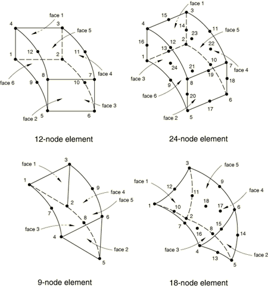
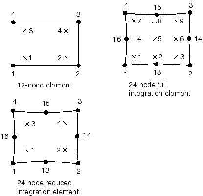

# 28.1.5 圆柱实体单元库


**产品：** Abaqus/Standard  Abaqus/CAE  

##### **参考**

- ["实体（连续体）单元，" 第28.1.1节](pt06ch28s01alm01.md)
- [*SOLID SECTION](../key/key-link.md#usb-kws-msolidsection)

### 概述

本节提供Abaqus/Standard中可用的圆柱实体单元的参考。

### 单元类型

| CCL9 | 9节点圆柱棱柱，径向平面内线性插值，周向三角函数插值 |
| --- | --- |
|  |  |

| CCL9H | 9节点圆柱棱柱，径向平面内线性插值，周向三角函数插值，平面内常压力、周向线性压力的混合单元 |
| --- | --- |
|  |  |

| CCL12 | 12节点圆柱砖块，径向平面内线性插值，周向三角函数插值 |
| --- | --- |
|  |  |

| CCL12H | 12节点圆柱砖块，径向平面内线性插值，周向三角函数插值，平面内常压力、周向线性压力的混合单元 |
| --- | --- |
|  |  |

| CCL18 | 18节点圆柱棱柱，径向平面内二次插值，周向三角函数插值 |
| --- | --- |
|  |  |

| CCL18H | 18节点圆柱棱柱，径向平面内二次插值，周向三角函数插值，平面内线性压力、周向线性压力的混合单元 |
| --- | --- |
|  |  |

| CCL24 | 24节点圆柱砖块，径向平面内二次插值，周向三角函数插值 |
| --- | --- |
|  |  |

| CCL24H | 24节点圆柱砖块，径向平面内二次插值，周向三角函数插值，平面内线性压力、周向线性压力的混合单元 |
| --- | --- |
|  |  |

| CCL24R | 24节点圆柱砖块，减缩积分，径向平面内二次插值，周向三角函数插值 |
| --- | --- |
|  |  |

| CCL24RH | 24节点圆柱砖块，减缩积分，径向平面内二次插值，周向三角函数插值，平面内线性压力、周向线性压力的混合单元 |
| --- | --- |
|  |  |

##### 活跃自由度

1、2、3

##### 附加求解变量

平面内带常压力的混合单元有两个与压力相关的附加变量，线性压力混合单元有六个与压力相关的附加变量。

### 所需节点坐标

 *X*、*Y*、*Z*

### 单元属性定义

| **输入文件用法：** | ``` [*SOLID SECTION](../key/key-link.md#usb-kws-msolidsection) ``` |
| --- | --- |

| **Abaqus/CAE用法：** | 属性模块：**创建截面**：选择**实体**作为截面**类别**，选择**均匀**作为截面**类型** |
| --- | --- |

### 基于单元的载荷

### 分布载荷

分布载荷如["分布载荷，" 第34.4.3节](pt07ch34s04aus122.md)中所述指定。

**载荷ID (*DLOAD)：**  BX**单位：**  [FL3](../popups/usb-int-iconventions-unitsym.md)**描述：**  全局*X*方向的体力。

**载荷ID (*DLOAD)：**  BY**单位：**  [FL3](../popups/usb-int-iconventions-unitsym.md)**描述：**  全局*Y*方向的体力。

**载荷ID (*DLOAD)：**  BZ**单位：**  [FL3](../popups/usb-int-iconventions-unitsym.md)**描述：**  全局*Z*方向的体力。

**载荷ID (*DLOAD)：**  BXNU**单位：**  [FL3](../popups/usb-int-iconventions-unitsym.md)**描述：**  全局*X*方向的非均匀体力，幅值通过用户子程序[`DLOAD`](../sub/sub-link.md#sub-xsl-dload)提供。

**载荷ID (*DLOAD)：**  BYNU**单位：**  [FL3](../popups/usb-int-iconventions-unitsym.md)**描述：**  全局*Y*方向的非均匀体力，幅值通过用户子程序[`DLOAD`](../sub/sub-link.md#sub-xsl-dload)提供。

**载荷ID (*DLOAD)：**  BZNU**单位：**  [FL3](../popups/usb-int-iconventions-unitsym.md)**描述：**  全局*Z*方向的非均匀体力，幅值通过用户子程序[`DLOAD`](../sub/sub-link.md#sub-xsl-dload)提供。

**载荷ID (*DLOAD)：**  CENT**单位：**  [FL4(ML3T2)](../popups/usb-int-iconventions-unitsym.md)**描述：**  离心载荷（幅值输入为，其中是单位体积质量密度，是角速度）。

**载荷ID (*DLOAD)：**  CENTRIF**单位：**  [FL4(ML3T1)](../popups/usb-int-iconventions-unitsym.md)**描述：**  离心载荷（幅值输入为，其中是角速度）。

**载荷ID (*DLOAD)：**  CORIO**单位：**  [FL4T (ML3T1)](../popups/usb-int-iconventions-unitsym.md)**描述：**  科里奥利力（幅值输入为，其中是单位体积质量密度，是角速度）。

**载荷ID (*DLOAD)：**  GRAV**单位：**  [LT2](../popups/usb-int-iconventions-unitsym.md)**描述：**  指定方向的重力载荷（幅值输入为加速度）。

**载荷ID (*DLOAD)：**  HP*n***单位：**  [FL2](../popups/usb-int-iconventions-unitsym.md)**描述：**  面*n*上的静水压力，在全局*Z*方向线性分布。

**载荷ID (*DLOAD)：**  P*n***单位：**  [FL2](../popups/usb-int-iconventions-unitsym.md)**描述：**  面*n*上的压力。

**载荷ID (*DLOAD)：**  ROTA**单位：**  [T2](../popups/usb-int-iconventions-unitsym.md)**描述：**  旋转加速度载荷（幅值输入为，其中是旋转加速度）。

**载荷ID (*DLOAD)：**  ROTDYNF(S)**单位：**  [T1](../popups/usb-int-iconventions-unitsym.md)**描述：**  转子动力学载荷（幅值输入为，其中是角速度）。

**载荷ID (*DLOAD)：**  TRSHR*n***单位：**  [FL2](../popups/usb-int-iconventions-unitsym.md)**描述：**  面*n*上的剪切牵引。

**载荷ID (*DLOAD)：**  TRSHR*n*NU(S)**单位：**  [FL2](../popups/usb-int-iconventions-unitsym.md)**描述：**  面*n*上的非均匀剪切牵引，幅值和方向通过用户子程序[`UTRACLOAD`](../sub/sub-link.md#sub-xsl-utracload)提供。

**载荷ID (*DLOAD)：**  TRVEC*n***单位：**  [FL2](../popups/usb-int-iconventions-unitsym.md)**描述：**  面*n*上的一般牵引。

**载荷ID (*DLOAD)：**  TRVEC*n*NU(S)**单位：**  [FL2](../popups/usb-int-iconventions-unitsym.md)**描述：**  面*n*上的非均匀一般牵引，幅值和方向通过用户子程序[`UTRACLOAD`](../sub/sub-link.md#sub-xsl-utracload)提供。

### 基础

所有圆柱单元都可用基础。如["单元基础，" 第2.2.2节](pt01ch02s02aus12.md)中所述指定。

**载荷ID (*FOUNDATION)：**  F*n***单位：**  [FL3](../popups/usb-int-iconventions-unitsym.md)**描述：**  面*n*上的弹性基础。

### 基于表面的载荷

### 分布载荷

具有位移自由度的单元可用基于表面的分布载荷。如["分布载荷，" 第34.4.3节](pt07ch34s04aus122.md)中所述指定。

**载荷ID (*DSLOAD)：**  HP**单位：**  [FL2](../popups/usb-int-iconventions-unitsym.md)**描述：**  单元表面上的静水压力，在全局*Z*方向线性分布。

**载荷ID (*DSLOAD)：**  P*n***单位：**  [FL2](../popups/usb-int-iconventions-unitsym.md)**描述：**  单元表面上的压力。

**载荷ID (*DSLOAD)：**  P*n*NU**单位：**  [FL2](../popups/usb-int-iconventions-unitsym.md)**描述：**  单元表面上的非均匀压力，幅值通过用户子程序[`DLOAD`](../sub/sub-link.md#sub-xsl-dload)提供。

**载荷ID (*DSLOAD)：**  TRSHR**单位：**  [FL2](../popups/usb-int-iconventions-unitsym.md)**描述：**  单元表面上的剪切牵引。

**载荷ID (*DSLOAD)：**  TRSHRNU(S)**单位：**  [FL2](../popups/usb-int-iconventions-unitsym.md)**描述：**  单元表面上的非均匀剪切牵引，幅值和方向通过用户子程序[`UTRACLOAD`](../sub/sub-link.md#sub-xsl-utracload)提供。

**载荷ID (*DSLOAD)：**  TRVEC**单位：**  [FL2](../popups/usb-int-iconventions-unitsym.md)**描述：**  单元表面上的一般牵引。

**载荷ID (*DSLOAD)：**  TRVECNU(S)**单位：**  [FL2](../popups/usb-int-iconventions-unitsym.md)**描述：**  单元表面上的非均匀一般牵引，幅值和方向通过用户子程序[`UTRACLOAD`](../sub/sub-link.md#sub-xsl-utracload)提供。

### 单元输出

除非通过截面定义（["方向，" 第2.2.5节](pt01ch02s02aus15.md)）为单元分配了局部坐标系，输出采用固定圆柱坐标系（1=径向，2=轴向，3=周向），在这种情况下，输出采用局部坐标系（在几何非线性分析中随运动旋转）。详情参见["状态存储，" Abaqus理论指南第1.5.4节](../stm/stm-link.md#stm-int-statestorage)。

#### 应力、应变和其他张量分量

对于具有位移自由度的单元，应力和其他张量（包括应变张量）均可用。所有张量具有相同的分量。例如，应力分量如下：

| S11 | 局部11直接应力。 |
| --- | --- |

| S22 | 局部22直接应力。 |
| --- | --- |

| S33 | 局部33直接应力。 |
| --- | --- |

| S12 | 局部12剪切应力。 |
| --- | --- |

| S13 | 局部13剪切应力。 |
| --- | --- |

| S23 | 局部23剪切应力。 |
| --- | --- |

### 单元上的节点排序和面编号



##### 12节点和24节点圆柱单元面

| 面1 | 1 -- 2 -- 3 -- 4 面 |
| --- | --- |
| 面2 | 5 -- 8 -- 7 -- 6 面 |
| 面3 | 1 -- 5 -- 6 -- 2 面 |
| 面4 | 2 -- 6 -- 7 -- 3 面 |
| 面5 | 3 -- 7 -- 8 -- 4 面 |
| 面6 | 4 -- 8 -- 5 -- 1 面 |

##### 9节点和18节点圆柱单元面

| 面1 | 1 -- 2 -- 3 面 |
| --- | --- |
| 面2 | 4 -- 6 -- 5 面 |
| 面3 | 1 -- 4 -- 5 -- 2 面 |
| 面4 | 2 -- 5 -- 6 -- 3 面 |
| 面5 | 3 -- 6 -- 4 -- 1 面 |

### 用于输出的积分点编号



这显示了最接近1–2–3–4面的层的方案。第二层和第三层中的积分点按顺序编号。


