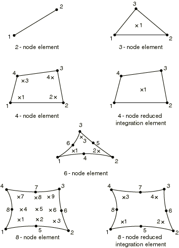

# 28.1.6 轴对称实体单元库


**产品：** Abaqus/Standard  Abaqus/Explicit  Abaqus/CAE  

##### **参考**

- ["实体（连续体）单元，" 第28.1.1节](pt06ch28s01alm01.md)
- [*SOLID SECTION](../key/key-link.md#usb-kws-msolidsection)

### 概述

本节提供Abaqus/Standard和Abaqus/Explicit中可用的轴对称实体单元的参考。

### 约定

坐标1是，坐标2是。在处，*r*方向对应全局*x*方向，*z*方向对应全局*y*方向。当数据必须以全局方向给出时，这一点很重要。坐标1必须大于或等于零。

自由度1是，自由度2是。带扭转的广义轴对称单元具有附加自由度5，对应扭转角（弧度）。

Abaqus不会自动对位于对称轴上的节点施加任何边界条件。如有需要，必须对这些节点施加径向或对称边界条件。

在某些Abaqus/Standard情况下，在非线性问题中获得收敛可能变得必要对位于对称轴上的节点施加径向边界条件。因此，对于非线性问题，建议对对称轴上的节点施加径向边界条件。

点载荷和弯矩、集中（节点）通量、电流和渗流应给出为周向积分值（即环上的总值）。

### 单元类型

#### 无扭转的应力/位移单元

| CAX3 | 3节点线性 |
| --- | --- |
|  |  |

| CAX3H(S) | 3节点线性，带常压力混合 |
| --- | --- |
|  |  |

| CAX4(S) | 4节点双线性 |
| --- | --- |
|  |  |

| CAX4H(S) | 4节点双线性，带常压力混合 |
| --- | --- |
|  |  |

| CAX4I(S) | 4节点双线性，不相容模式 |
| --- | --- |
|  |  |

| CAX4IH(S) | 4节点双线性，不相容模式，带线性压力混合 |
| --- | --- |
|  |  |

| CAX4R | 4节点双线性，减缩积分带沙漏控制 |
| --- | --- |
|  |  |

| CAX4RH(S) | 4节点双线性，减缩积分带沙漏控制，带常压力混合 |
| --- | --- |
|  |  |

| CAX6(S) | 6节点二次 |
| --- | --- |
|  |  |

| CAX6H(S) | 6节点二次，带线性压力混合 |
| --- | --- |
|  |  |

| CAX6M | 6节点修正，带沙漏控制 |
| --- | --- |
|  |  |

| CAX6MH(S) | 6节点修正，带沙漏控制，带线性压力混合 |
| --- | --- |
|  |  |

| CAX8(S) | 8节点双二次 |
| --- | --- |
|  |  |

| CAX8H(S) | 8节点双二次，带线性压力混合 |
| --- | --- |
|  |  |

| CAX8R(S) | 8节点双二次，减缩积分 |
| --- | --- |
|  |  |

| CAX8RH(S) | 8节点双二次，减缩积分，带线性压力混合 |
| --- | --- |
|  |  |

##### 活跃自由度

1、2

##### 附加求解变量

常压力混合单元有一个与压力相关的附加变量，线性压力单元有三个与压力相关的附加变量。

CAX4I和CAX4IH单元类型有五个与不相容模式相关的附加变量。

CAX6M和CAX6MH单元类型有两个附加位移变量。

#### 带扭转的应力/位移单元

| CGAX3(S) | 3节点线性 |
| --- | --- |
|  |  |

| CGAX3H(S) | 3节点线性，带常压力混合 |
| --- | --- |
|  |  |

| CGAX4(S) | 4节点双线性 |
| --- | --- |
|  |  |

| CGAX4H(S) | 4节点双线性，带常压力混合 |
| --- | --- |
|  |  |

| CGAX4R(S) | 4节点双线性，减缩积分带沙漏控制 |
| --- | --- |
|  |  |

| CGAX4RH(S) | 4节点双线性，减缩积分带沙漏控制，带常压力混合 |
| --- | --- |
|  |  |

| CGAX6(S) | 6节点二次 |
| --- | --- |
|  |  |

| CGAX6H(S) | 6节点二次，带线性压力混合 |
| --- | --- |
|  |  |

| CGAX6M(S) | 6节点修正，带沙漏控制 |
| --- | --- |
|  |  |

| CGAX6MH(S) | 6节点修正，带沙漏控制，带线性压力混合 |
| --- | --- |
|  |  |

| CGAX8(S) | 8节点双二次 |
| --- | --- |
|  |  |

| CGAX8H(S) | 8节点双二次，带线性压力混合 |
| --- | --- |
|  |  |

| CGAX8R(S) | 8节点双二次，减缩积分 |
| --- | --- |
|  |  |

| CGAX8RH(S) | 8节点双二次，减缩积分，带线性压力混合 |
| --- | --- |
|  |  |

##### 活跃自由度

1、2、5

##### 附加求解变量

常压力混合单元有一个与压力相关的附加变量，线性压力单元有三个与压力相关的附加变量。

CGAX6M和CGAX6MH单元类型有三个附加位移变量。

#### 扩散热传递或质量扩散单元

| DCAX3(S) | 3节点线性 |
| --- | --- |
|  |  |

| DCAX4(S) | 4节点线性 |
| --- | --- |
|  |  |

| DCAX6(S) | 6节点二次 |
| --- | --- |
|  |  |

| DCAX8(S) | 8节点二次 |
| --- | --- |
|  |  |

##### 活跃自由度

11

##### 附加求解变量

无。

#### 强制对流/扩散单元

| DCCAX2(S) | 2节点 |
| --- | --- |
|  |  |

| DCCAX2D(S) | 2节点带色散控制 |
| --- | --- |
|  |  |

| DCCAX4(S) | 4节点 |
| --- | --- |
|  |  |

| DCCAX4D(S) | 4节点带色散控制 |
| --- | --- |
|  |  |

##### 活跃自由度

11

##### 附加求解变量

无。

#### 耦合热电单元

| DCAX3E(S) | 3节点线性 |
| --- | --- |
|  |  |

| DCAX4E(S) | 4节点线性 |
| --- | --- |
|  |  |

| DCAX6E(S) | 6节点二次 |
| --- | --- |
|  |  |

| DCAX8E(S) | 8节点二次 |
| --- | --- |
|  |  |

##### 活跃自由度

9、11

##### 附加求解变量

无。

#### 无扭转的耦合温度-位移单元

| CAX3T | 3节点线性位移和温度 |
| --- | --- |
|  |  |

| CAX4T(S) | 4节点双线性位移和温度 |
| --- | --- |
|  |  |

| CAX4HT(S) | 4节点双线性位移和温度，带常压力混合 |
| --- | --- |
|  |  |

| CAX4RT | 4节点双线性位移和温度，减缩积分带沙漏控制 |
| --- | --- |
|  |  |

| CAX4RHT(S) | 4节点双线性位移和温度，减缩积分带沙漏控制，带常压力混合 |
| --- | --- |
|  |  |

| CAX6MT | 6节点修正位移和温度，带沙漏控制 |
| --- | --- |
|  |  |

| CAX6MHT(S) | 6节点修正位移和温度，带沙漏控制，带线性压力混合 |
| --- | --- |
|  |  |

| CAX8T(S) | 8节点双二次位移，双线性温度 |
| --- | --- |
|  |  |

| CAX8HT(S) | 8节点双二次位移，双线性温度，带线性压力混合 |
| --- | --- |
|  |  |

| CAX8RT(S) | 8节点双二次位移，双线性温度，减缩积分 |
| --- | --- |
|  |  |

| CAX8RHT(S) | 8节点双二次位移，双线性温度，减缩积分，带线性压力混合 |
| --- | --- |
|  |  |

##### 活跃自由度

角节点处：1、2、11

Abaqus/Standard中二阶单元边中节点处：1、2

Abaqus/Standard中修正位移和温度单元边中节点处：1、2、11

##### 附加求解变量

常压力混合单元有一个与压力相关的附加变量，线性压力单元有三个与压力相关的附加变量。

CAX6MT和CAX6MHT单元类型有两个附加位移变量和一个附加温度变量。

#### 带扭转的耦合温度-位移单元

| CGAX3T(S) | 3节点线性位移和温度 |
| --- | --- |
|  |  |

| CGAX3HT(S) | 3节点线性位移和温度，带常压力混合 |
| --- | --- |
|  |  |

| CGAX4T(S) | 4节点双线性位移和温度 |
| --- | --- |
|  |  |

| CGAX4HT(S) | 4节点双线性位移和温度，带常压力混合 |
| --- | --- |
|  |  |

| CGAX4RT(S) | 4节点双线性位移和温度，减缩积分带沙漏控制 |
| --- | --- |
|  |  |

| CGAX4RHT(S) | 4节点双线性位移和温度，减缩积分带沙漏控制，带常压力混合 |
| --- | --- |
|  |  |

| CGAX6MT(S) | 6节点修正位移和温度，带沙漏控制 |
| --- | --- |
|  |  |

| CGAX6MHT(S) | 6节点修正位移和温度，带沙漏控制，带常压力混合 |
| --- | --- |
|  |  |

| CGAX8T(S) | 8节点双二次位移，双线性温度 |
| --- | --- |
|  |  |

| CGAX8HT(S) | 8节点双二次位移，双线性温度，带线性压力混合 |
| --- | --- |
|  |  |

| CGAX8RT(S) | 8节点双二次位移，双线性温度，减缩积分 |
| --- | --- |
|  |  |

| CGAX8RHT(S) | 8节点双二次位移，双线性温度，减缩积分，带线性压力混合 |
| --- | --- |
|  |  |

##### 活跃自由度

角节点处：1、2、5、11

二阶单元边中节点处：1、2、5

修正位移和温度单元边中节点处：1、2、5、11

##### 附加求解变量

常压力混合单元有一个与压力相关的附加变量，线性压力单元有三个与压力相关的附加变量。

CGAX6MT和CGAX6MHT单元类型有两个附加位移变量和一个附加温度变量。

#### 孔隙压力单元

| CAX4P(S) | 4节点双线性位移和孔隙压力 |
| --- | --- |
|  |  |

| CAX4PH(S) | 4节点双线性位移和孔隙压力，带常压力混合 |
| --- | --- |
|  |  |

| CAX4RP(S) | 4节点双线性位移和孔隙压力，减缩积分带沙漏控制 |
| --- | --- |
|  |  |

| CAX4RPH(S) | 4节点双线性位移和孔隙压力，减缩积分带沙漏控制，带常压力混合 |
| --- | --- |
|  |  |

| CAX6MP(S) | 6节点修正位移和孔隙压力，带沙漏控制 |
| --- | --- |
|  |  |

| CAX6MPH(S) | 6节点修正位移和孔隙压力，带沙漏控制，带线性压力混合 |
| --- | --- |
|  |  |

| CAX8P(S) | 8节点双二次位移，双线性孔隙压力 |
| --- | --- |
|  |  |

| CAX8PH(S) | 8节点双二次位移，双线性孔隙压力，带线性压力混合 |
| --- | --- |
|  |  |

| CAX8RP(S) | 8节点双二次位移，双线性孔隙压力，减缩积分 |
| --- | --- |
|  |  |

| CAX8RPH(S) | 8节点双二次位移，双线性孔隙压力，减缩积分，带线性压力混合 |
| --- | --- |
|  |  |

##### 活跃自由度

角节点处：1、2、8

边中节点处：1、2

##### 附加求解变量

常压力混合单元有一个与有效压力应力相关的附加变量，线性压力混合单元有三个与有效压力应力相关的附加变量，以允许完全不可压缩材料建模。

CAX6MP和CAX6MPH单元类型有两个附加位移变量和一个附加孔隙压力变量。

#### 耦合温度-孔隙压力单元

| CAX4PT(S) | 4节点双线性位移、孔隙压力和温度 |
| --- | --- |
|  |  |

| CAX4RPT(S) | 4节点双线性位移、孔隙压力和温度；减缩积分带沙漏控制 |
| --- | --- |
|  |  |

| CAX4RPHT(S) | 4节点双线性位移、孔隙压力和温度；减缩积分带沙漏控制，带常压力混合 |
| --- | --- |
|  |  |

##### 活跃自由度

1、2、8、11

##### 附加求解变量

常压力混合单元有一个与有效压力应力相关的附加变量，以允许完全不可压缩材料建模。

#### 声学单元

| ACAX3 | 3节点线性 |
| --- | --- |
|  |  |

| ACAX4R(E) | 4节点线性，减缩积分带沙漏控制 |
| --- | --- |
|  |  |

| ACAX4(S) | 4节点线性 |
| --- | --- |
|  |  |

| ACAX6(S) | 6节点二次 |
| --- | --- |
|  |  |

| ACAX8(S) | 8节点二次 |
| --- | --- |
|  |  |

##### 活跃自由度

8

##### 附加求解变量

无。

#### 压电单元

| CAX3E(S) | 3节点线性 |
| --- | --- |
|  |  |

| CAX4E(S) | 4节点双线性 |
| --- | --- |
|  |  |

| CAX6E(S) | 6节点二次 |
| --- | --- |
|  |  |

| CAX8E(S) | 8节点双二次 |
| --- | --- |
|  |  |

| CAX8RE(S) | 8节点双二次，减缩积分 |
| --- | --- |
|  |  |

##### 活跃自由度

1、2、9

##### 附加求解变量

无。

### 所需节点坐标

*r*、*z* at 

### 单元属性定义

对于DCCAX2和DCCAX2D单元类型，必须指定(*r*–*z*)平面中的通道厚度。如果未给出厚度，默认为单位厚度。

对于所有其他单元，不需要指定厚度。

| **输入文件用法：** | ``` [*SOLID SECTION](../key/key-link.md#usb-kws-msolidsection) ``` |
| --- | --- |

| **Abaqus/CAE用法：** | 属性模块：**创建截面**：选择**实体**作为截面**类别**，选择**均匀**作为截面**类型** |
| --- | --- |

### 基于单元的载荷

### 分布载荷

分布载荷适用于所有具有位移自由度的单元。如["分布载荷，" 第34.4.3节](pt07ch34s04aus122.md)中所述指定。分布载荷幅值为单位面积或单位体积。不需要乘以。

**载荷ID (*DLOAD)：**  BR**Abaqus/CAE载荷/相互作用：**  **体力****单位：**  [FL3](../popups/usb-int-iconventions-unitsym.md)**描述：**  径向体力。

**载荷ID (*DLOAD)：**  BZ**Abaqus/CAE载荷/相互作用：**  **体力****单位：**  [FL3](../popups/usb-int-iconventions-unitsym.md)**描述：**  轴向体力。

**载荷ID (*DLOAD)：**  BRNU**Abaqus/CAE载荷/相互作用：**  **体力****单位：**  [FL3](../popups/usb-int-iconventions-unitsym.md)**描述：**  径向非均匀体力，幅值通过用户子程序[`DLOAD`](../sub/sub-link.md#sub-xsl-dload)（Abaqus/Standard）和[`VDLOAD`](../sub/sub-link.md#sub-xsl-vdload)（Abaqus/Explicit）提供。

**载荷ID (*DLOAD)：**  BZNU**Abaqus/CAE载荷/相互作用：**  **体力****单位：**  [FL3](../popups/usb-int-iconventions-unitsym.md)**描述：**  轴向非均匀体力，幅值通过用户子程序[`DLOAD`](../sub/sub-link.md#sub-xsl-dload)（Abaqus/Standard）和[`VDLOAD`](../sub/sub-link.md#sub-xsl-vdload)（Abaqus/Explicit）提供。

**载荷ID (*DLOAD)：**  CENT(S)**Abaqus/CAE载荷/相互作用：**  不支持**单位：**  [FL4M3T2](../popups/usb-int-iconventions-unitsym.md)**描述：**  离心载荷（幅值输入为，其中是单位体积质量密度，是角速度）。不适用于孔隙压力单元。

**载荷ID (*DLOAD)：**  CENTRIF(S)**Abaqus/CAE载荷/相互作用：**  **旋转体力****单位：**  [T2](../popups/usb-int-iconventions-unitsym.md)**描述：**  离心载荷（幅值输入为，其中是角速度）。

**载荷ID (*DLOAD)：**  GRAV**Abaqus/CAE载荷/相互作用：**  **重力****单位：**  [LT2](../popups/usb-int-iconventions-unitsym.md)**描述：**  指定方向的重力载荷（幅值输入为加速度）。

**载荷ID (*DLOAD)：**  HP*n*(S)**Abaqus/CAE载荷/相互作用：**  不支持**单位：**  [FL2](../popups/usb-int-iconventions-unitsym.md)**描述：**  面*n*上的静水压力，在全局*Y*方向线性分布。

**载荷ID (*DLOAD)：**  P*n***Abaqus/CAE载荷/相互作用：**  **压力****单位：**  [FL2](../popups/usb-int-iconventions-unitsym.md)**描述：**  面*n*上的压力。

**载荷ID (*DLOAD)：**  P*n*NU**Abaqus/CAE载荷/相互作用：**  不支持**单位：**  [FL2](../popups/usb-int-iconventions-unitsym.md)**描述：**  面*n*上的非均匀压力，幅值通过用户子程序[`DLOAD`](../sub/sub-link.md#sub-xsl-dload)（Abaqus/Standard）和[`VDLOAD`](../sub/sub-link.md#sub-xsl-vdload)（Abaqus/Explicit）提供。

**载荷ID (*DLOAD)：**  SBF(E)**Abaqus/CAE载荷/相互作用：**  不支持**单位：**  [FL5T2](../popups/usb-int-iconventions-unitsym.md)**描述：**  径向和轴向滞止体力。

**载荷ID (*DLOAD)：**  SP*n*(E)**Abaqus/CAE载荷/相互作用：**  不支持**单位：**  [FL4T2](../popups/usb-int-iconventions-unitsym.md)**描述：**  面*n*上的滞止压力。

**载荷ID (*DLOAD)：**  TRSHR*n***Abaqus/CAE载荷/相互作用：**  **表面牵引****单位：**  [FL2](../popups/usb-int-iconventions-unitsym.md)**描述：**  面*n*上的剪切牵引。

**载荷ID (*DLOAD)：**  TRSHR*n*NU(S)**Abaqus/CAE载荷/相互作用：**  不支持**单位：**  [FL2](../popups/usb-int-iconventions-unitsym.md)**描述：**  面*n*上的非均匀剪切牵引，幅值和方向通过用户子程序[`UTRACLOAD`](../sub/sub-link.md#sub-xsl-utracload)提供。

**载荷ID (*DLOAD)：**  TRVEC*n***Abaqus/CAE载荷/相互作用：**  **表面牵引****单位：**  [FL2](../popups/usb-int-iconventions-unitsym.md)**描述：**  面*n*上的一般牵引。

**载荷ID (*DLOAD)：**  TRVEC*n*NU(S)**Abaqus/CAE载荷/相互作用：**  不支持**单位：**  [FL2](../popups/usb-int-iconventions-unitsym.md)**描述：**  面*n*上的非均匀一般牵引，幅值和方向通过用户子程序[`UTRACLOAD`](../sub/sub-link.md#sub-xsl-utracload)提供。

**载荷ID (*DLOAD)：**  VBF(E)**Abaqus/CAE载荷/相互作用：**  不支持**单位：**  [FL4T](../popups/usb-int-iconventions-unitsym.md)**描述：**  径向和轴向粘性体力。

**载荷ID (*DLOAD)：**  VP*n*(E)**Abaqus/CAE载荷/相互作用：**  不支持**单位：**  [FL3T](../popups/usb-int-iconventions-unitsym.md)**描述：**  面*n*上的粘性压力，施加与面法向速度成正比且阻碍运动的压力。

### 基础

基础适用于Abaqus/Standard中具有位移自由度的单元。如["单元基础，" 第2.2.2节](pt01ch02s02aus12.md)中所述指定。

**载荷ID (*FOUNDATION)：**  F*n*(S)**Abaqus/CAE载荷/相互作用：**  **弹性基础****单位：**  [FL3](../popups/usb-int-iconventions-unitsym.md)**描述：**  面*n*上的弹性基础。对于CGAX单元，弹性基础仅应用于自由度和。

### 分布热通量

分布热通量适用于所有具有温度自由度的单元。如["热载荷，" 第34.4.4节](pt07ch34s04aus123.md)中所述指定。分布热通量幅值为单位面积或单位体积。不需要乘以。

**载荷ID (*DFLUX)：**  BF**Abaqus/CAE载荷/相互作用：**  **体积热通量****单位：**  [JL3T1](../popups/usb-int-iconventions-unitsym.md)**描述：**  单位体积热体积通量。

**载荷ID (*DFLUX)：**  BFNU(S)**Abaqus/CAE载荷/相互作用：**  **体积热通量****单位：**  [JL3T1](../popups/usb-int-iconventions-unitsym.md)**描述：**  单位体积非均匀热体积通量，幅值通过用户子程序[`DFLUX`](../sub/sub-link.md#sub-xsl-dflux)提供。

**载荷ID (*DFLUX)：**  S*n***Abaqus/CAE载荷/相互作用：**  **表面热通量****单位：**  [JL2T1](../popups/usb-int-iconventions-unitsym.md)**描述：**  进入面*n*的单位面积热表面通量。

**载荷ID (*DFLUX)：**  S*n*NU(S)**Abaqus/CAE载荷/相互作用：**  不支持**单位：**  [JL2T1](../popups/usb-int-iconventions-unitsym.md)**描述：**  进入面*n*的单位面积非均匀热表面通量，幅值通过用户子程序[`DFLUX`](../sub/sub-link.md#sub-xsl-dflux)提供。

### 薄膜条件

薄膜条件适用于所有具有温度自由度的单元。如["热载荷，" 第34.4.4节](pt07ch34s04aus123.md)中所述指定。

**载荷ID (*FILM)：**  F*n***Abaqus/CAE载荷/相互作用：**  **表面薄膜条件****单位：**  [JL2T11](../popups/usb-int-iconventions-unitsym.md)**描述：**  面*n*上提供的膜系数和受热温度（的单位）。

**载荷ID (*FILM)：**  F*n*NU(S)**Abaqus/CAE载荷/相互作用：**  不支持**单位：**  [JL2T11](../popups/usb-int-iconventions-unitsym.md)**描述：**  面*n*上提供的非均匀膜系数和受热温度（的单位），幅值通过用户子程序[`FILM`](../sub/sub-link.md#sub-xsl-film)提供。

### 辐射类型

辐射条件适用于所有具有温度自由度的单元。如["热载荷，" 第34.4.4节](pt07ch34s04aus123.md)中所述指定。

**载荷ID (*RADIATE)：**  R*n***Abaqus/CAE载荷/相互作用：**  **表面辐射****单位：**  [无量纲](../popups/usb-int-iconventions-unitsym.md)**描述：**  面*n*上提供的发射率和受热温度。

### 分布流

分布流适用于所有具有孔隙压力自由度的单元。如["孔隙流体流动，" 第34.4.7节](pt07ch34s04aus126.md)中所述指定。分布流幅值为单位面积或单位体积。不需要乘以。

**载荷ID (*FLOW)：**  Q*n*(S)**Abaqus/CAE载荷/相互作用：**  不支持**单位：**  [F1L3T1](../popups/usb-int-iconventions-unitsym.md)**描述：**  面*n*上提供的渗流系数和参考汇孔隙压力（[FL2](../popups/usb-int-iconventions-unitsym.md)的单位）。

**载荷ID (*FLOW)：**  Q*n*D(S)**Abaqus/CAE载荷/相互作用：**  不支持**单位：**  [F1L3T1](../popups/usb-int-iconventions-unitsym.md)**描述：**  面*n*上提供的仅排水渗流系数。

**载荷ID (*FLOW)：**  Q*n*NU(S)**Abaqus/CAE载荷/相互作用：**  不支持**单位：**  [F1L3T1](../popups/usb-int-iconventions-unitsym.md)**描述：**  面*n*上提供的非均匀渗流系数和参考汇孔隙压力（[FL2](../popups/usb-int-iconventions-unitsym.md)的单位），幅值通过用户子程序[`FLOW`](../sub/sub-link.md#sub-xsl-flow)提供。

**载荷ID (*DFLOW)：**  S*n*(S)**Abaqus/CAE载荷/相互作用：**  **表面孔隙流体****单位：**  [LT1](../popups/usb-int-iconventions-unitsym.md)**描述：**  面*n*上规定的孔隙流体有效速度（从面流出）。

**载荷ID (*DFLOW)：**  S*n*NU(S)**Abaqus/CAE载荷/相互作用：**  不支持**单位：**  [LT1](../popups/usb-int-iconventions-unitsym.md)**描述：**  面*n*上规定的非均匀孔隙流体有效速度（从面流出），幅值通过用户子程序[`DFLOW`](../sub/sub-link.md#sub-xsl-dflow)提供。

### 分布阻抗

分布阻抗适用于所有具有声压自由度的单元。如["声学和冲击载荷，" 第34.4.6节](pt07ch34s04aus125.md)中所述指定。

**载荷ID (*IMPEDANCE)：**  I*n***Abaqus/CAE载荷/相互作用：**  不支持**单位：**  [无](../popups/usb-int-iconventions-unitsym.md)**描述：**  定义面*n*上阻抗的阻抗属性名称。

### 电通量

电通量适用于压电单元。如["压电分析，" 第6.7.2节](pt03ch06s07at21.md)中所述指定。

**载荷ID (*DECHARGE)：**  EBF(S)**Abaqus/CAE载荷/相互作用：**  **体积电荷****单位：**  [CL3](../popups/usb-int-iconventions-unitsym.md)**描述：**  单位体积电荷体通量。

**载荷ID (*DECHARGE)：**  ES*n*(S)**Abaqus/CAE载荷/相互作用：**  **表面电荷****单位：**  [CL2](../popups/usb-int-iconventions-unitsym.md)**描述：**  面*n*上规定的表面电荷。

### 分布电流密度

分布电流密度适用于耦合热电单元。如["耦合热电分析，" 第6.7.3节](pt03ch06s07at22.md)中所述指定。

**载荷ID (*DECURRENT)：**  CBF(S)**Abaqus/CAE载荷/相互作用：**  **体积电流****单位：**  [CL3T1](../popups/usb-int-iconventions-unitsym.md)**描述：**  体积电流源密度。

**载荷ID (*DECURRENT)：**  CS*n*(S)**Abaqus/CAE载荷/相互作用：**  **表面电流****单位：**  [CL2T1](../popups/usb-int-iconventions-unitsym.md)**描述：**  面*n*上的电流密度。

### 分布浓度通量

分布浓度通量适用于质量扩散单元。如["质量扩散分析，" 第6.9.1节](pt03ch06s09at28.md)中所述指定。

**载荷ID (*DFLUX)：**  BF(S)**Abaqus/CAE载荷/相互作用：**  **体积浓度通量****单位：**  [PT1](../popups/usb-int-iconventions-unitsym.md)**描述：**  单位体积浓度体积通量。

**载荷ID (*DFLUX)：**  BFNU(S)**Abaqus/CAE载荷/相互作用：**  **体积浓度通量****单位：**  [PT1](../popups/usb-int-iconventions-unitsym.md)**描述：**  单位体积非均匀浓度体积通量，幅值通过用户子程序[`DFLUX`](../sub/sub-link.md#sub-xsl-dflux)提供。

**载荷ID (*DFLUX)：**  S*n*(S)**Abaqus/CAE载荷/相互作用：**  **表面浓度通量****单位：**  [PLT1](../popups/usb-int-iconventions-unitsym.md)**描述：**  进入面*n*的单位面积浓度表面通量。

**载荷ID (*DFLUX)：**  S*n*NU(S)**Abaqus/CAE载荷/相互作用：**  **表面浓度通量****单位：**  [PLT1](../popups/usb-int-iconventions-unitsym.md)**描述：**  进入面*n*的单位面积非均匀浓度表面通量，幅值通过用户子程序[`DFLUX`](../sub/sub-link.md#sub-xsl-dflux)提供。

### 基于表面的载荷

### 分布载荷

基于表面的分布载荷适用于所有具有位移自由度的单元。如["分布载荷，" 第34.4.3节](pt07ch34s04aus122.md)中所述指定。分布载荷幅值为单位面积或单位体积。不需要乘以。

**载荷ID (*DSLOAD)：**  HP(S)**Abaqus/CAE载荷/相互作用：**  **压力****单位：**  [FL2](../popups/usb-int-iconventions-unitsym.md)**描述：**  单元表面上的静水压力，在全局*Y*方向线性分布。

**载荷ID (*DSLOAD)：**  P**Abaqus/CAE载荷/相互作用：**  **压力****单位：**  [FL2](../popups/usb-int-iconventions-unitsym.md)**描述：**  单元表面上的压力。

**载荷ID (*DSLOAD)：**  PNU**Abaqus/CAE载荷/相互作用：**  **压力****单位：**  [FL2](../popups/usb-int-iconventions-unitsym.md)**描述：**  单元表面上的非均匀压力，幅值通过用户子程序[`DLOAD`](../sub/sub-link.md#sub-xsl-dload)（Abaqus/Standard）和[`VDLOAD`](../sub/sub-link.md#sub-xsl-vdload)（Abaqus/Explicit）提供。

**载荷ID (*DSLOAD)：**  SP(E)**Abaqus/CAE载荷/相互作用：**  **压力****单位：**  [FL4T2](../popups/usb-int-iconventions-unitsym.md)**描述：**  单元表面上的滞止压力。

**载荷ID (*DSLOAD)：**  TRSHR**Abaqus/CAE载荷/相互作用：**  **表面牵引****单位：**  [FL2](../popups/usb-int-iconventions-unitsym.md)**描述：**  单元表面上的剪切牵引。

**载荷ID (*DSLOAD)：**  TRSHRNU(S)**Abaqus/CAE载荷/相互作用：**  **表面牵引****单位：**  [FL2](../popups/usb-int-iconventions-unitsym.md)**描述：**  单元表面上的非均匀剪切牵引，幅值和方向通过用户子程序[`UTRACLOAD`](../sub/sub-link.md#sub-xsl-utracload)提供。

**载荷ID (*DSLOAD)：**  TRVEC**Abaqus/CAE载荷/相互作用：**  **表面牵引****单位：**  [FL2](../popups/usb-int-iconventions-unitsym.md)**描述：**  单元表面上的一般牵引。

**载荷ID (*DSLOAD)：**  TRVECNU(S)**Abaqus/CAE载荷/相互作用：**  **表面牵引****单立：**  [FL2](../popups/usb-int-iconventions-unitsym.md)**描述：**  单元表面上的非均匀一般牵引，幅值和方向通过用户子程序[`UTRACLOAD`](../sub/sub-link.md#sub-xsl-utracload)提供。

**载荷ID (*DSLOAD)：**  VP(E)**Abaqus/CAE载荷/相互作用：**  **压力****单位：**  [FL3T](../popups/usb-int-iconventions-unitsym.md)**描述：**  施加在单元表面上的粘性压力。粘性压力与面法向速度成正比且阻碍运动。

### 分布热通量

基于表面的热通量适用于所有具有温度自由度的单元。如["热载荷，" 第34.4.4节](pt07ch34s04aus123.md)中所述指定。分布热通量幅值为单位面积或单位体积。不需要乘以。

**载荷ID (*DSFLUX)：**  S**Abaqus/CAE载荷/相互作用：**  **表面热通量****单位：**  [JL2T1](../popups/usb-int-iconventions-unitsym.md)**描述：**  进入单元表面的单位面积热表面通量。

**载荷ID (*DSFLUX)：**  SNU(S)**Abaqus/CAE载荷/相互作用：**  **表面热通量****单位：**  [JL2T1](../popups/usb-int-iconventions-unitsym.md)**描述：**  进入单元表面的单位面积非均匀热表面通量，幅值通过用户子程序[`DFLUX`](../sub/sub-link.md#sub-xsl-dflux)提供。

### 薄膜条件

基于表面的薄膜条件适用于所有具有温度自由度的单元。如["热载荷，" 第34.4.4节](pt07ch34s04aus123.md)中所述指定。

**载荷ID (*SFILM)：**  F**Abaqus/CAE载荷/相互作用：**  **表面薄膜条件****单位：**  [JL2T11](../popups/usb-int-iconventions-unitsym.md)**描述：**  单元表面上提供的膜系数和受热温度（的单位）。

**载荷ID (*SFILM)：**  FNU(S)**Abaqus/CAE载荷/相互作用：**  **表面薄膜条件****单位：**  [JL2T11](../popups/usb-int-iconventions-unitsym.md)**描述：**  单元表面上提供的非均匀膜系数和受热温度（的单位），幅值通过用户子程序[`FILM`](../sub/sub-link.md#sub-xsl-film)提供。

### 辐射类型

基于表面的辐射条件适用于所有具有温度自由度的单元。如["热载荷，" 第34.4.4节](pt07ch34s04aus123.md)中所述指定。

**载荷ID (*SRADIATE)：**  R**Abaqus/CAE载荷/相互作用：**  **表面辐射****单位：**  [无量纲](../popups/usb-int-iconventions-unitsym.md)**描述：**  单元表面上提供的发射率和受热温度。

### 分布流

基于表面的分布流适用于所有具有孔隙压力自由度的单元。如["孔隙流体流动，" 第34.4.7节](pt07ch34s04aus126.md)中所述指定。分布流幅值为单位面积或单位体积。不需要乘以。

**载荷ID (*SFLOW)：**  Q(S)**Abaqus/CAE载荷/相互作用：**  不支持**单位：**  [F1L3T1](../popups/usb-int-iconventions-unitsym.md)**描述：**  单元表面上提供的渗流系数和参考汇孔隙压力（[FL2](../popups/usb-int-iconventions-unitsym.md)的单位）。

**载荷ID (*SFLOW)：**  QD(S)**Abaqus/CAE载荷/相互作用：**  不支持**单位：**  [F1L3T1](../popups/usb-int-iconventions-unitsym.md)**描述：**  单元表面上提供的仅排水渗流系数。

**载荷ID (*SFLOW)：**  QNU(S)**Abaqus/CAE载荷/相互作用：**  不支持**单位：**  [F1L3T1](../popups/usb-int-iconventions-unitsym.md)**描述：**  单元表面上提供的非均匀渗流系数和参考汇孔隙压力（[FL2](../popups/usb-int-iconventions-unitsym.md)的单位），幅值通过用户子程序[`FLOW`](../sub/sub-link.md#sub-xsl-flow)提供。

**载荷ID (*DSFLOW)：**  S(S)**Abaqus/CAE载荷/相互作用：**  **表面孔隙流体****单位：**  [LT1](../popups/usb-int-iconventions-unitsym.md)**描述：**  从单元表面流出的规定孔隙流体有效速度。

**载荷ID (*DSFLOW)：**  SNU(S)**Abaqus/CAE载荷/相互作用：**  **表面孔隙流体****单位：**  [LT1](../popups/usb-int-iconventions-unitsym.md)**描述：**  从单元表面流出的非均匀规定孔隙流体有效速度，幅值通过用户子程序[`DFLOW`](../sub/sub-link.md#sub-xsl-dflow)提供。

### 分布阻抗

基于表面的阻抗适用于所有具有声压自由度的单元。如["声学和冲击载荷，" 第34.4.6节](pt07ch34s04aus125.md)中所述指定。

### 入射波载荷

基于表面的入射波载荷适用于所有具有位移自由度或声压自由度的单元。如["声学和冲击载荷，" 第34.4.6节](pt07ch34s04aus125.md)中所述指定。如果入射波场包括从网格边界外平面的反射，可以包含此效果。

### 电通量

基于表面的电通量适用于压电单元。如["压电分析，" 第6.7.2节](pt03ch06s07at21.md)中所述指定。

**载荷ID (*DSECHARGE)：**  ES(S)**Abaqus/CAE载荷/相互作用：**  **表面电荷****单位：**  [CL2](../popups/usb-int-iconventions-unitsym.md)**描述：**  单元表面上规定的表面电荷。

### 分布电流密度

基于表面的电流密度适用于耦合热电单元。如["耦合热电分析，" 第6.7.3节](pt03ch06s07at22.md)中所述指定。

**载荷ID (*DSECURRENT)：**  CS(S)**Abaqus/CAE载荷/相互作用：**  **表面电流****单位：**  [CL2T1](../popups/usb-int-iconventions-unitsym.md)**描述：**  单元表面上的电流密度。

### 单元输出

除非通过截面定义（["方向，" 第2.2.5节](pt01ch02s02aus15.md)）为单元分配了局部坐标系，输出采用全局方向，在这种情况下，输出采用局部坐标系（在几何非线性分析中随运动旋转）。详情参见["状态存储，" Abaqus理论指南第1.5.4节](../stm/stm-link.md#stm-int-statestorage)。对于常规轴对称单元，局部方向必须在–*z*平面中，为主方向。对于带扭转的广义轴对称单元，局部方向可以是任意的。

#### 应力、应变和其他张量分量

对于具有位移自由度的单元，应力和其他张量（包括应变张量）均可用。所有张量具有相同的分量。例如，应力分量如下：

##### 对于无扭转且具有位移自由度的单元：

| S11 | 径向应力或局部1方向应力。 |
| --- | --- |

| S22 | 轴向应力或局部2方向应力。 |
| --- | --- |

| S33 | 周向直接应力。 |
| --- | --- |

| S12 | 剪切应力。 |
| --- | --- |

##### 对于带扭转且具有位移自由度的单元：

| S11 | 径向应力或局部1方向应力。 |
| --- | --- |

| S22 | 轴向应力或局部2方向应力。 |
| --- | --- |

| S33 | 周向应力或局部3方向应力。 |
| --- | --- |

| S12 | 剪切应力。 |
| --- | --- |

| S13 | 剪切应力。 |
| --- | --- |

| S23 | 剪切应力。 |
| --- | --- |

#### 热通量分量

适用于具有温度自由度的单元。

| HFL1 | 径向热通量或局部1方向热通量。 |
| --- | --- |

| HFL2 | 轴向热通量或局部2方向热通量。 |
| --- | --- |

#### 孔隙流体速度分量

适用于具有孔隙压力自由度的单元，但声学单元除外。

| FLVEL1 | 径向或局部1方向孔隙流体有效速度。 |
| --- | --- |

| FLVEL2 | 轴向或局部2方向孔隙流体有效速度。 |
| --- | --- |

#### 质量浓度通量分量

适用于具有归一化浓度自由度的单元。

| MFL1 | 径向或局部1方向浓度通量。 |
| --- | --- |

| MFL2 | 轴向或局部2方向浓度通量。 |
| --- | --- |

#### 电势梯度

适用于具有电势自由度的单元。

| EPG1 | 1方向电势梯度。 |
| --- | --- |

| EPG2 | 2方向电势梯度。 |
| --- | --- |

#### 电通量分量

适用于压电单元。

| EFLX1 | 1方向电通量。 |
| --- | --- |

| EFLX2 | 2方向电通量。 |
| --- | --- |

#### 电流密度分量

适用于耦合热电单元。

| ECD1 | 1方向电流密度。 |
| --- | --- |

| ECD2 | 2方向电流密度。 |
| --- | --- |

### 单元上的节点排序和面编号


##### 2节点单元面

| 面1 | 节点1处截面 |
| --- | --- |
| 面2 | 节点2处截面 |

##### 三角形单元面

| 面1 | 1 -- 2 面 |
| --- | --- |
| 面2 | 2 -- 3 面 |
| 面3 | 3 -- 1 面 |

##### 四边形单元面

| 面1 | 1 -- 2 面 |
| --- | --- |
| 面2 | 2 -- 3 面 |
| 面3 | 3 -- 4 面 |
| 面4 | 4 -- 1 面 |

### 用于输出的积分点编号



对于热传递应用，三角形单元使用不同的积分方案，如["三角形、四面体和楔形单元，" Abaqus理论指南第3.2.6节](../stm/stm-link.md#stm-elm-tritetwedge)中所述。


