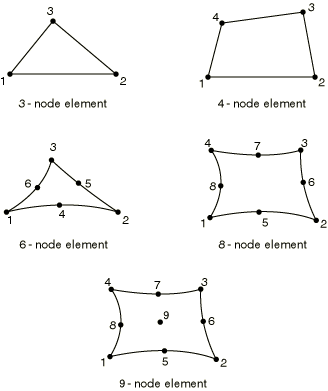
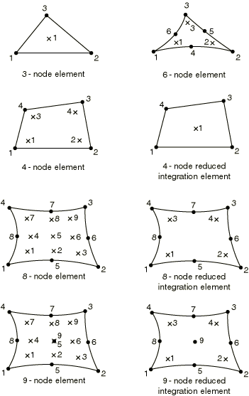

# 29.1.2 通用膜单元库


**产品：** Abaqus/Standard  Abaqus/Explicit  Abaqus/CAE  

##### **参考资料**

- ["膜单元," 第29.1.1节](pt06ch29s01alm05.md)
- [*NODAL THICKNESS](../key/key-link.md#usb-kws-mnodalthickness)
- [*MEMBRANE SECTION](../key/key-link.md#usb-kws-mmembranesection)

### 概述

本节提供Abaqus/Standard和Abaqus/Explicit中可用的通用膜单元的参考。

### 单元类型

| M3D3 | 3节点三角形 |
| --- | --- |
|  |

| M3D4 | 4节点四边形 |
| --- | --- |
|  |

| M3D4R | 4节点四边形，减缩积分，沙漏控制 |
| --- | --- |
|  |

| M3D6(S) | 6节点三角形 |
| --- | --- |
|  |

| M3D8(S) | 8节点四边形 |
| --- | --- |
|  |

| M3D8R(S) | 8节点四边形，减缩积分 |
| --- | --- |
|  |

| M3D9(S) | 9节点四边形 |
| --- | --- |
|  |

| M3D9R(S) | 9节点四边形，减缩积分，沙漏控制 |
| --- | --- |
|  |

##### 激活的自由度

1, 2, 3

##### 附加求解变量

无。

### 需要的节点坐标

*X*, *Y*, *Z*

### 单元特性定义

| **输入文件用法：** | ``` [*MEMBRANE SECTION](../key/key-link.md#usb-kws-mmembranesection) ``` |
| --- | --- |
|  | 此外，对于变厚度膜单元，使用以下选项： ``` [*NODAL THICKNESS](../key/key-link.md#usb-kws-mnodalthickness) ``` |

| **Abaqus/CAE用法：** | 属性模块：**创建截面**：选择**壳**作为截面**类别**和**膜**作为截面**类型** |
| --- | --- |
|  | 您不能在Abaqus/CAE中定义变厚度膜单元。 |

### 基于单元的载荷

### 分布载荷

分布载荷如["分布载荷," 第34.4.3节](pt07ch34s04aus122.md)中所述进行指定。

**载荷ID (*DLOAD):**  BX**Abaqus/CAE载荷/相互作用：**  **体积力****单位：**  [FL3](../popups/usb-int-iconventions-unitsym.md)**描述：**  全局*X*方向的体积力。

**载荷ID (*DLOAD):**  BY**Abaqus/CAE载荷/相互作用：**  **体积力****单位：**  [FL3](../popups/usb-int-iconventions-unitsym.md)**描述：**  全局*Y*方向的体积力。

**载荷ID (*DLOAD):**  BZ**Abaqus/CAE载荷/相互作用：**  **体积力****单位：**  [FL3](../popups/usb-int-iconventions-unitsym.md)**描述：**  全局*Z*方向的体积力。

**载荷ID (*DLOAD):**  BXNU**Abaqus/CAE载荷/相互作用：**  **体积力****单位：**  [FL3](../popups/usb-int-iconventions-unitsym.md)**描述：**  全局*X*方向的非均匀体积力，幅值通过用户子程序[`DLOAD`](../sub/sub-link.md#sub-xsl-dload)在Abaqus/Standard中和[`VDLOAD`](../sub/sub-link.md#sub-xsl-vdload)在Abaqus/Explicit中提供。

**载荷ID (*DLOAD):**  BYNU**Abaqus/CAE载荷/相互作用：**  **体积力****单位：**  [FL3](../popups/usb-int-iconventions-unitsym.md)**描述：**  全局*Y*方向的非均匀体积力，幅值通过用户子程序[`DLOAD`](../sub/sub-link.md#sub-xsl-dload)在Abaqus/Standard中和[`VDLOAD`](../sub/sub-link.md#sub-xsl-vdload)在Abaqus/Explicit中提供。

**载荷ID (*DLOAD):**  BZNU**Abaqus/CAE载荷/相互作用：**  **体积力****单位：**  [FL3](../popups/usb-int-iconventions-unitsym.md)**描述：**  全局*Z*方向的非均匀体积力，幅值通过用户子程序[`DLOAD`](../sub/sub-link.md#sub-xsl-dload)在Abaqus/Standard中和[`VDLOAD`](../sub/sub-link.md#sub-xsl-vdload)在Abaqus/Explicit中提供。

**载荷ID (*DLOAD):**  CENT(S)**Abaqus/CAE载荷/相互作用：**  不支持**单位：**  [FL4 (ML3T2)](../popups/usb-int-iconventions-unitsym.md)**描述：**  离心载荷（幅值输入为，其中是单位体积质量密度，是角速度）。

**载荷ID (*DLOAD):**  CENTRIF(S)**Abaqus/CAE载荷/相互作用：**  **旋转体积力****单位：**  [T2](../popups/usb-int-iconventions-unitsym.md)**描述：**  离心载荷（幅值输入为，其中是角速度）。

**载荷ID (*DLOAD):**  CORIO(S)**Abaqus/CAE载荷/相互作用：**  **科里奥利力****单位：**  [FL4T (ML3T1)](../popups/usb-int-iconventions-unitsym.md)**描述：**  科里奥利力（幅值输入为，其中是单位体积质量密度，是角速度）。直接稳态动力学分析中不考虑科里奥利载荷引起的载荷刚度。

**载荷ID (*DLOAD):**  GRAV**Abaqus/CAE载荷/相互作用：**  **重力****单位：**  [LT2](../popups/usb-int-iconventions-unitsym.md)**描述：**  指定方向的重力载荷（幅值输入为加速度）。

**载荷ID (*DLOAD):**  HP(S)**Abaqus/CAE载荷/相互作用：**  不支持**单位：**  [FL2](../popups/usb-int-iconventions-unitsym.md)**描述：**  作用在单元参考表面上的静水压力，在全局*Z*方向线性变化。压力在正单元法线方向为正。

**载荷ID (*DLOAD):**  P**Abaqus/CAE载荷/相互作用：**  **压力****单位：**  [FL2](../popups/usb-int-iconventions-unitsym.md)**描述：**  作用在单元参考表面上的压力。压力在正单元法线方向为正。

**载荷ID (*DLOAD):**  PNU**Abaqus/CAE载荷/相互作用：**  不支持**单位：**  [FL2](../popups/usb-int-iconventions-unitsym.md)**描述：**  作用在单元参考表面上的非均匀压力，幅值通过用户子程序[`DLOAD`](../sub/sub-link.md#sub-xsl-dload)在Abaqus/Standard中和[`VDLOAD`](../sub/sub-link.md#sub-xsl-vdload)在Abaqus/Explicit中提供。压力在正单元法线方向为正。

**载荷ID (*DLOAD):**  ROTA(S)**Abaqus/CAE载荷/相互作用：**  **旋转体积力****单位：**  [T2](../popups/usb-int-iconventions-unitsym.md)**描述：**  旋转加速度载荷（幅值输入为，其中是旋转加速度）。

**载荷ID (*DLOAD):**  ROTDYNF(S)**Abaqus/CAE载荷/相互作用：**  不支持**单位：**  [T1](../popups/usb-int-iconventions-unitsym.md)**描述：**  转子动力学载荷（幅值输入为，其中是角速度）。

**载荷ID (*DLOAD):**  SBF(E)**Abaqus/CAE载荷/相互作用：**  不支持**单位：**  [FL5T2](../popups/usb-int-iconventions-unitsym.md)**描述：**  全局*X*、*Y*和*Z*方向的滞止体积力。

**载荷ID (*DLOAD):**  SP(E)**Abaqus/CAE载荷/相互作用：**  不支持**单位：**  [FL4T2](../popups/usb-int-iconventions-unitsym.md)**描述：**  作用在单元参考表面上的滞止压力。

**载荷ID (*DLOAD):**  TRSHR**Abaqus/CAE载荷/相互作用：**  **表面牵引****单位：**  [FL2](../popups/usb-int-iconventions-unitsym.md)**描述：**  单元参考表面上的剪切牵引。

**载荷ID (*DLOAD):**  TRSHRNU(S)**Abaqus/CAE载荷/相互作用：**  不支持**单位：**  [FL2](../popups/usb-int-iconventions-unitsym.md)**描述：**  单元参考表面上的非均匀剪切牵引，幅值和方向通过用户子程序[`UTRACLOAD`](../sub/sub-link.md#sub-xsl-utracload)提供。

**载荷ID (*DLOAD):**  TRVEC**Abaqus/CAE载荷/相互作用：**  **表面牵引****单位：**  [FL2](../popups/usb-int-iconventions-unitsym.md)**描述：**  单元参考表面上的一般牵引。

**载荷ID (*DLOAD):**  TRVECNU(S)**Abaqus/CAE载荷/相互作用：**  不支持**单位：**  [FL2](../popups/usb-int-iconventions-unitsym.md)**描述：**  单元参考表面上的非均匀一般牵引，幅值和方向通过用户子程序[`UTRACLOAD`](../sub/sub-link.md#sub-xsl-utracload)提供。

**载荷ID (*DLOAD):**  VBF(E)**Abaqus/CAE载荷/相互作用：**  不支持**单位：**  [FL4T](../popups/usb-int-iconventions-unitsym.md)**描述：**  全局*X*、*Y*和*Z*方向的粘性体积力。

**载荷ID (*DLOAD):**  VP(E)**Abaqus/CAE载荷/相互作用：**  不支持**单位：**  [FL3T](../popups/usb-int-iconventions-unitsym.md)**描述：**  作用在单元参考表面上的粘性表面压力。压力与单元面法向的速度成正比，并与运动方向相反。

### 基础

基础仅在Abaqus/Standard中可用，如["单元基础," 第2.2.2节](pt01ch02s02aus12.md)中所述进行指定。

**载荷ID (*FOUNDATION):**  F(S)**Abaqus/CAE载荷/相互作用：**  **弹性基础****单位：**  [FL3](../popups/usb-int-iconventions-unitsym.md)**描述：**  弹性基础。

### 基于表面的载荷

### 分布载荷

基于表面的分布载荷如["分布载荷," 第34.4.3节](pt07ch34s04aus122.md)中所述进行指定。

**载荷ID (*DSLOAD):**  HP(S)**Abaqus/CAE载荷/相互作用：**  **压力****单位：**  [FL2](../popups/usb-int-iconventions-unitsym.md)**描述：**  单元参考表面上的静水压力，在全局*Z*方向线性变化。压力在表面法线相反方向为正。

**载荷ID (*DSLOAD):**  P**Abaqus/CAE载荷/相互作用：**  **压力****单位：**  [FL2](../popups/usb-int-iconventions-unitsym.md)**描述：**  单元参考表面上的压力。压力在表面法线相反方向为正。

**载荷ID (*DSLOAD):**  PNU**Abaqus/CAE载荷/相互作用：**  **压力****单位：**  [FL2](../popups/usb-int-iconventions-unitsym.md)**描述：**  单元参考表面上的非均匀压力，幅值通过用户子程序[`DLOAD`](../sub/sub-link.md#sub-xsl-dload)在Abaqus/Standard中和[`VDLOAD`](../sub/sub-link.md#sub-xsl-vdload)在Abaqus/Explicit中提供。压力在表面法线相反方向为正。

**载荷ID (*DSLOAD):**  SP(E)**Abaqus/CAE载荷/相互作用：**  **压力****单位：**  [FL4T2](../popups/usb-int-iconventions-unitsym.md)**描述：**  作用在单元参考表面上的滞止压力。

**载荷ID (*DSLOAD):**  TRSHR**Abaqus/CAE载荷/相互作用：**  **表面牵引****单位：**  [FL2](../popups/usb-int-iconventions-unitsym.md)**描述：**  单元参考表面上的剪切牵引。

**载荷ID (*DSLOAD):**  TRSHRNU(S)**Abaqus/CAE载荷/相互作用：**  **表面牵引****单位：**  [FL2](../popups/usb-int-iconventions-unitsym.md)**描述：**  单元参考表面上的非均匀剪切牵引，幅值和方向通过用户子程序[`UTRACLOAD`](../sub/sub-link.md#sub-xsl-utracload)提供。

**载荷ID (*DSLOAD):**  TRVEC**Abaqus/CAE载荷/相互作用：**  **表面牵引****单位：**  [FL2](../popups/usb-int-iconventions-unitsym.md)**描述：**  单元参考表面的一般牵引。

**载荷ID (*DSLOAD):**  TRVECNU(S)**Abaqus/CAE载荷/相互作用：**  **表面牵引****单位：**  [FL2](../popups/usb-int-iconventions-unitsym.md)**描述：**  单元参考表面上的非均匀一般牵引，幅值和方向通过用户子程序[`UTRACLOAD`](../sub/sub-link.md#sub-xsl-utracload)提供。

**载荷ID (*DSLOAD):**  VP(E)**Abaqus/CAE载荷/相互作用：**  **压力****单位：**  [FL3T](../popups/usb-int-iconventions-unitsym.md)**描述：**  作用在单元参考表面上的粘性表面压力。压力与单元表面法向的速度成正比，并与运动方向相反。

### 入射波载荷

提供基于表面的入射波载荷。如["声学和冲击载荷," 第34.4.6节](pt07ch34s04aus125.md)中所述进行指定。如果入射波场包括从网格边界外平面的反射，则可以包含此效应。

### 单元输出

如果单元未使用局部方向（["方向," 第2.2.5节](pt01ch02s02aus15.md)），则应力/应变分量在["公约," 第1.2.2节](pt01ch01s02aus02.md)所定义的表面默认方向上。如果单元使用了局部方向，则应力/应变分量在方向所定义的表面方向上。在大位移问题中，参考构型中定义的局部方向通过平均材料旋转旋转到当前构型中。详情参见["状态存储," Abaqus理论指南第1.5.4节](../stm/stm-link.md#stm-int-statestorage)。

#### 应力、应变和其他张量分量

对于具有位移自由度的单元，应力和其他张量（包括应变张量）可用。所有张量具有相同的分量。例如，应力分量如下：

| S11 | 局部11方向直接应力。 |
| --- | --- |

| S22 | 局部22方向直接应力。 |
| --- | --- |

| S12 | 局部12方向剪切应力。 |
| --- | --- |

#### 截面厚度

| STH | 当前厚度。 |
| --- | --- |

### 单元上的节点排序



### 用于输出的积分点编号




