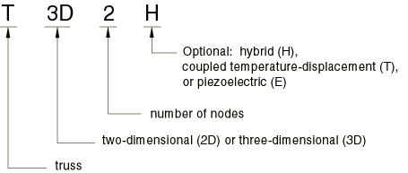
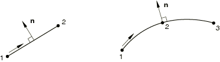

# 29.2.1 桁架单元


**产品：** Abaqus/Standard  Abaqus/Explicit  Abaqus/CAE  

##### **参考资料**

- ["桁架单元库," 第29.2.2节](pt06ch29s02ael13.md)
- [*SOLID SECTION](../key/key-link.md#usb-kws-msolidsection)
- ["创建桁架截面," Abaqus/CAE用户指南第12.13.12节](../usi/usi-link.md#usi-prp-section-truss)

### 概述

桁架单元：
- 是细长的结构构件，只能传递轴向力（非结构连接单元在["一维实心（连接）单元库," 第28.1.2节](pt06ch28s01ael01.md)中介绍）；以及
- 不传递弯矩。

### 典型应用

桁架单元用于二维和三维建模细长的、线状结构，这些结构仅沿单元轴线或中心线承受载荷。不支持垂直于中心线的弯矩或力。

二维桁架单元可用于轴对称模型中，以表示螺栓或连接器等部件，其中应变仅从*r*–*z*平面中的长度变化计算。二维桁架单元也可用于在Abaqus/Standard中定义接触应用的主表面（参见["接触相互作用分析：概述," 第36.1.1节](pt09ch36s01abo33.md)）。在这种情况下，主表面外法线方向对于正确检测接触至关重要。

Abaqus/Standard中可用的3节点桁架单元常用于建模结构中的曲线加劲缆索，如钢筋混凝土中的预应力钢筋或近海工业中使用的细长管道。

### 选择合适的单元

2节点直桁架单元（对位置和位移使用线性插值，具有恒定应力）在Abaqus/Standard和Abaqus/Explicit中都可用。此外，3节点曲线桁架单元（在位置和位移上使用二次插值，因此应变沿单元线性变化）在Abaqus/Standard中可用。

在Abaqus/Standard中，提供了应力/位移桁架、耦合温度-位移桁架和压电桁架的混合（混合）版本。

#### 混合应力/位移桁架单元

在Abaqus/Standard中，提供了二维和三维的应力/位移桁架的混合（混合）版本，其中轴力作为附加未知量处理。当桁架代表刚度远大于整体结构模型刚度的刚性连接时，这些单元很有用（以抵消数值病态对控制方程的影响）。在这种情况下，混合桁架提供了真正刚性连接的替代方案，可通过多点约束（参见["一般多点约束," 第35.2.2节](pt08ch35s02aus130.md)）或刚性单元（参见["刚性单元," 第30.3.1节](pt06ch30s03alm23.md)）建模。

#### 耦合温度-位移桁架单元

耦合温度-位移桁架单元在Abaqus/Standard中的二维和三维都可用。这些单元具有温度作为附加自由度（11）。有关Abaqus/Standard中完全耦合温度-位移分析的详细信息，请参见["完全耦合热应力分析," 第6.5.3节](pt03ch06s05at19.md)。

#### 压电桁架单元

压电桁架单元在Abaqus/Standard中的二维和三维都可用。这些单元具有电势作为附加自由度（9）。有关压电分析的详细信息，请参见["压电分析," 第6.7.2节](pt03ch06s07at21.md)。

### 命名约定

Abaqus中桁架单元的命名如下：



例如，T2D3E是二维3节点压电桁架单元。

### 单元法线定义

对于二维桁架，正向外法线由从节点1到节点2或节点3的方向逆时针旋转90度定义。



### 定义单元的截面特性

使用实心截面定义来定义截面特性。必须将这些特性与模型的某个区域关联。

| **输入文件用法：** | ``` [*SOLID SECTION](../key/key-link.md#usb-kws-msolidsection), ELSET=*name* ``` |
| --- | --- |
|  | 其中ELSET参数引用一组桁架单元。 |

| **Abaqus/CAE用法：** | 属性模块：**创建截面**：选择**梁**作为截面**类别**和**桁架**作为截面**类型** ****分配****截面****：选择区域 |
| --- | --- |

#### 定义桁架单元的横截面积

您可以将与桁架单元关联的横截面积定义为截面定义的一部分。如果不指定横截面积的值，则假定为单位面积。

当桁架单元用于大位移分析时，更新的横截面积通过假设桁架由不可压缩材料制成来计算，而不考虑实际材料定义。此假设仅在应变较大时影响情况。它被采用是因为最常见的桁架大应变应用涉及屈服金属行为或橡胶弹性，在这些情况下材料实际上是不可压缩的。因此，线性弹性桁架单元在轴向应变不是无穷小量时，不会提供与线性SPRINGA弹簧单元相同的力-位移响应。

| **输入文件用法：** | ``` [*SOLID SECTION](../key/key-link.md#usb-kws-msolidsection), ELSET=*name* *cross-sectional area* ``` |
| --- | --- |

| **Abaqus/CAE用法：** | 属性模块：**创建截面**：选择**梁**作为截面**类别**和**桁架**作为截面**类型**：**横截面积：** *cross-sectional area* |
| --- | --- |

#### 为一组桁架单元分配材料定义

必须将材料定义与每个实心截面定义关联。桁架单元不允许材料方向。

| **输入文件用法：** | ``` [*SOLID SECTION](../key/key-link.md#usb-kws-msolidsection), MATERIAL=*name* ``` |
| --- | --- |
|  | [*SOLID SECTION](../key/key-link.md#usb-kws-msolidsection)选项上的ORIENTATION参数的任何值都将被桁架单元忽略。 |

| **Abaqus/CAE用法：** | 属性模块：**创建截面**：选择**梁**作为截面**类别**和**桁架**作为截面**类型**：**材料：** *name* |
| --- | --- |

### 在大位移隐式分析中使用桁架单元

桁架单元没有垂直于其轴线的初始刚度来抵抗载荷。如果在Abaqus/Standard中沿无应力桁架线加载垂直于其轴线的载荷，可能会导致数值奇异性和缺乏收敛。在大位移隐式分析的第一次迭代后，垂直于单元初始线的刚度会发展，有时允许分析克服数值问题。

在某些情况下，首先沿桁架单元轴线加载或包含初始拉应力可以克服这些数值奇异性。但是，您必须选择载荷或初始应力的幅值，使最终解决方案不受影响。


