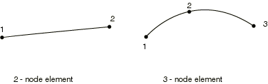
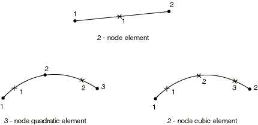

# 29.3.8 梁单元库


**产品：** Abaqus/Standard  Abaqus/Explicit  Abaqus/CAE  

##### **参考资料**

- ["梁建模：概述," 第29.3.1节](pt06ch29s03abo26.md)
- ["选择梁单元," 第29.3.3节](pt06ch29s03alm08.md)
- [*BEAM GENERAL SECTION](../key/key-link.md#usb-kws-mbeamgensect)
- [*BEAM SECTION](../key/key-link.md#usb-kws-mbeamsection)

### 概述

本节提供Abaqus/Standard和Abaqus/Explicit中可用的梁单元的参考。

### 单元类型

#### 平面中的梁

| B21 | 2节点线性梁 |
| --- | --- |
|  |

| B21H(S) | 2节点线性梁，混合公式 |
| --- | --- |
|  |

| B22 | 3节点二次梁 |
| --- | --- |
|  |

| B22H(S) | 3节点二次梁，混合公式 |
| --- | --- |
|  |

| B23(S) | 2节点三次梁 |
| --- | --- |
|  |

| B23H(S) | 2节点三次梁，混合公式 |
| --- | --- |
|  |

| PIPE21 | 2节点线性管道 |
| --- | --- |
|  |

| PIPE21H(S) | 2节点线性管道，混合公式 |
| --- | --- |
|  |

| PIPE22(S) | 3节点二次管道 |
| --- | --- |
|  |

| PIPE22H(S) | 3节点二次管道，混合公式 |
| --- | --- |
|  |

##### 激活的自由度

1, 2, 6

##### 附加求解变量

所有三次梁单元都有两个与轴向应变相关的附加变量。

线性薄壁管道单元有一个附加变量，二次薄壁管道单元有两个与环向应变相关的附加变量。线性厚壁管道单元有两个附加变量，二次厚壁管道单元有四个与环向和径向应变分量相关的附加变量。

混合梁和管道单元有与轴向力和横向剪切力相关的附加变量。线性单元有两个，二次单元有四个，三次单元有三个附加变量。

#### 空间中的梁

| B31 | 2节点线性梁 |
| --- | --- |
|  |

| B31H(S) | 2节点线性梁，混合公式 |
| --- | --- |
|  |

| B32 | 3节点二次梁 |
| --- | --- |
|  |

| B32H(S) | 3节点二次梁，混合公式 |
| --- | --- |
|  |

| B33(S) | 2节点三次梁 |
| --- | --- |
|  |

| B33H(S) | 2节点三次梁，混合公式 |
| --- | --- |
|  |

| PIPE31 | 2节点线性管道 |
| --- | --- |
|  |

| PIPE31H(S) | 2节点线性管道，混合公式 |
| --- | --- |
|  |

| PIPE32(S) | 3节点二次管道 |
| --- | --- |
|  |

| PIPE32H(S) | 3节点二次管道，混合公式 |
| --- | --- |
|  |

##### 激活的自由度

1, 2, 3, 4, 5, 6

##### 附加求解变量

所有三次梁单元都有两个与轴向应变相关的附加变量。

线性薄壁管道单元有一个附加变量，二次薄壁管道单元有两个与环向应变相关的附加变量。线性厚壁管道单元有两个附加变量，二次厚壁管道单元有四个与环向和径向应变分量相关的附加变量。

混合梁和管道单元有与轴向力和横向剪切力相关的附加变量。线性单元有三个，三次单元也有三个，二次单元有六个附加变量。

#### 空间中的开截面梁

| B31OS(S) | 2节点线性梁 |
| --- | --- |
|  |

| B31OSH(S) | 2节点线性梁，混合公式 |
| --- | --- |
|  |

| B32OS(S) | 3节点二次梁 |
| --- | --- |
|  |

| B32OSH(S) | 3节点二次梁，混合公式 |
| --- | --- |
|  |

##### 激活的自由度

1, 2, 3, 4, 5, 6, 7

##### 附加求解变量

B31OSH类型有三个附加变量，B32OSH类型有六个与轴向力和横向剪切力相关的附加变量。

### 需要的节点坐标

平面中的梁：*X*, *Y*，还可选择, ，法线的方向余弦。

空间中的梁：*X*, *Y*, *Z*，还可选择, , ，第二局部截面轴的方向余弦。

### 单元特性定义

对于PIPE单元，使用管道截面类型指定薄壁管道公式或使用厚管道截面类型指定厚壁管道公式。其他截面类型不能与PIPE单元一起使用。

对于开截面单元，仅使用任意、I、L和线性广义截面类型。

不能使用通过["方向," 第2.2.5节](pt01ch02s02aus15.md)定义的局部方向来定义梁单元的局部材料方向。空间局部梁截面轴的方向在["梁单元截面方向," 第29.3.4节](pt06ch29s03alm09.md)中讨论。

| **输入文件用法：** | 使用以下任一选项： |
| --- | --- |
|  | ``` [*BEAM SECTION](../key/key-link.md#usb-kws-mbeamsection) [*BEAM GENERAL SECTION](../key/key-link.md#usb-kws-mbeamgensect) ``` |

| **Abaqus/CAE用法：** | 属性模块：**创建截面**：选择**梁**作为截面**类别**和**梁**作为截面**类型** |
| --- | --- |

### 基于单元的载荷

### 分布载荷

分布载荷如["分布载荷," 第34.4.3节](pt07ch34s04aus122.md)中所述进行指定。

**载荷ID (*DLOAD):**  CENT(S)**Abaqus/CAE载荷/相互作用：**  不支持**单位：**  [FL2 (ML1T2)](../popups/usb-int-iconventions-unitsym.md)**描述：**  离心力（幅值输入为，其中*m*是单位长度质量，是角速度）。

**载荷ID (*DLOAD):**  CENTRIF(S)**Abaqus/CAE载荷/相互作用：**  **旋转体积力****单位：**  [T2](../popups/usb-int-iconventions-unitsym.md)**描述：**  离心载荷（幅值输入为，其中是角速度）。

**载荷ID (*DLOAD):**  CORIO(S)**Abaqus/CAE载荷/相互作用：**  **科里奥利力****单位：**  [FL2T (ML1T1)](../popups/usb-int-iconventions-unitsym.md)**描述：**  科里奥利力（幅值输入为，其中*m*是单位长度质量，是角速度）。直接稳态动力学分析中不考虑科里奥利载荷引起的载荷刚度。

**载荷ID (*DLOAD):**  GRAV**Abaqus/CAE载荷/相互作用：**  **重力****单位：**  [LT2](../popups/usb-int-iconventions-unitsym.md)**描述：**  指定方向的重力载荷（幅值输入为加速度）。

**载荷ID (*DLOAD):**  PX**Abaqus/CAE载荷/相互作用：**  **线载荷****单位：**  [FL1](../popups/usb-int-iconventions-unitsym.md)**描述：**  全局*X*方向的单位长度力。

**载荷ID (*DLOAD):**  PY**Abaqus/CAE载荷/相互作用：**  **线载荷****单位：**  [FL1](../popups/usb-int-iconventions-unitsym.md)**描述：**  全局*Y*方向的单位长度力。

**载荷ID (*DLOAD):**  PZ**Abaqus/CAE载荷/相互作用：**  **线载荷****单位：**  [FL1](../popups/usb-int-iconventions-unitsym.md)**描述：**  全局*Z*方向的单位长度力（仅适用于空间中的梁）。

**载荷ID (*DLOAD):**  PXNU**Abaqus/CAE载荷/相互作用：**  **线载荷****单位：**  [FL1](../popups/usb-int-iconventions-unitsym.md)**描述：**  全局*X*方向的非均匀单位长度力，幅值通过用户子程序[`DLOAD`](../sub/sub-link.md#sub-xsl-dload)在Abaqus/Standard中和[`VDLOAD`](../sub/sub-link.md#sub-xsl-vdload)在Abaqus/Explicit中提供。

**载荷ID (*DLOAD):**  PYNU**Abaqus/CAE载荷/相互作用：**  **线载荷****单位：**  [FL1](../popups/usb-int-iconventions-unitsym.md)**描述：**  全局*Y*方向的非均匀单位长度力，幅值通过用户子程序[`DLOAD`](../sub/sub-link.md#sub-xsl-dload)在Abaqus/Standard中和[`VDLOAD`](../sub/sub-link.md#sub-xsl-vdload)在Abaqus/Explicit中提供。

**载荷ID (*DLOAD):**  PZNU**Abaqus/CAE载荷/相互作用：**  **线载荷****单位：**  [FL1](../popups/usb-int-iconventions-unitsym.md)**描述：**  全局*Z*方向的非均匀单位长度力，幅值通过用户子程序[`DLOAD`](../sub/sub-link.md#sub-xsl-dload)在Abaqus/Standard和[`VDLOAD`](../sub/sub-link.md#sub-xsl-vdload)在Abaqus/Explicit中提供。（仅适用于空间中的梁。）

**载荷ID (*DLOAD):**  P1**Abaqus/CAE载荷/相互作用：**  **线载荷****单位：**  [FL1](../popups/usb-int-iconventions-unitsym.md)**描述：**  梁局部1方向的单位长度力（仅适用于空间中的梁）。

**载荷ID (*DLOAD):**  P2**Abaqus/CAE载荷/相互作用：**  **线载荷****单位：**  [FL1](../popups/usb-int-iconventions-unitsym.md)**描述：**  梁局部2方向的单位长度力。

**载荷ID (*DLOAD):**  P1NU**Abaqus/CAE载荷/相互作用：**  **线载荷****单位：**  [FL1](../popups/usb-int-iconventions-unitsym.md)**描述：**  梁局部1方向的非均匀单位长度力，幅值通过用户子程序[`DLOAD`](../sub/sub-link.md#sub-xsl-dload)在Abaqus/Standard和[`VDLOAD`](../sub/sub-link.md#sub-xsl-vdload)在Abaqus/Explicit中提供。（仅适用于空间中的梁。）

**载荷ID (*DLOAD):**  P2NU**Abaqus/CAE载荷/相互作用：**  **线载荷****单位：**  [FL1](../popups/usb-int-iconventions-unitsym.md)**描述：**  梁局部2方向的非均匀单位长度力，幅值通过用户子程序[`DLOAD`](../sub/sub-link.md#sub-xsl-dload)在Abaqus/Standard和[`VDLOAD`](../sub/sub-link.md#sub-xsl-vdload)在Abaqus/Explicit中提供。

**载荷ID (*DLOAD):**  ROTA(S)**Abaqus/CAE载荷/相互作用：**  **旋转体积力****单位：**  [T2](../popups/usb-int-iconventions-unitsym.md)**描述：**  旋转加速度载荷（幅值输入为，其中是旋转加速度）。

**载荷ID (*DLOAD):**  ROTDYNF(S)**Abaqus/CAE载荷/相互作用：**  不支持**单位：**  [T1](../popups/usb-int-iconventions-unitsym.md)**描述：**  转子动力学载荷（幅值输入为，其中是角速度）。

#### 

以下载荷类型仅适用于PIPE单元：

**载荷ID (*DLOAD):**  HPI**Abaqus/CAE载荷/相互作用：**  **管道压力****单位：**  [FL2](../popups/usb-int-iconventions-unitsym.md)**描述：**  静水内压力（闭端条件），随全局*Z*坐标线性变化。

**载荷ID (*DLOAD):**  HPE**Abaqus/CAE载荷/相互作用：**  **管道压力****单位：**  [FL2](../popups/usb-int-iconventions-unitsym.md)**描述：**  静水外压力（闭端条件），随全局*Z*坐标线性变化。

**载荷ID (*DLOAD):**  PI**Abaqus/CAE载荷/相互作用：**  **管道压力****单位：**  [FL2](../popups/usb-int-iconventions-unitsym.md)**描述：**  均匀内压力（闭端条件）。

**载荷ID (*DLOAD):**  PE**Abaqus/CAE载荷/相互作用：**  **管道压力****单位：**  [FL2](../popups/usb-int-iconventions-unitsym.md)**描述：**  均匀外压力（闭端条件）。

**载荷ID (*DLOAD):**  PENU**Abaqus/CAE载荷/相互作用：**  **管道压力****单位：**  [FL2](../popups/usb-int-iconventions-unitsym.md)**描述：**  非均匀外压力（闭端条件），幅值通过用户子程序[`DLOAD`](../sub/sub-link.md#sub-xsl-dload)提供。

**载荷ID (*DLOAD):**  PINU**Abaqus/CAE载荷/相互作用：**  **管道压力****单位：**  [FL2](../popups/usb-int-iconventions-unitsym.md)**描述：**  非均匀内压力（闭端条件），幅值通过用户子程序[`DLOAD`](../sub/sub-link.md#sub-xsl-dload)提供。

### Abaqus/Aqua载荷

Abaqus/Aqua载荷如["Abaqus/Aqua分析," 第6.11.1节](pt03ch06s11at30.md)中所述进行指定。它们不适用于开截面梁，也不适用于定义为具有浸没流体惯性的梁（参见["浸没在流体中导致的额外惯性" in "梁截面行为," 第29.3.5节](pt06ch29s03alm10.md#usb-elm-ebeamsectionbehavior-fluidinertia)）。

**载荷ID (*CLOAD/ *DLOAD):**  FDD**Abaqus/CAE载荷/相互作用：**  不支持**单位：**  [FL1](../popups/usb-int-iconventions-unitsym.md)**描述：**  横向流体阻力载荷。

**载荷ID (*CLOAD/ *DLOAD):**  FD1**Abaqus/CAE载荷/相互作用：**  不支持**单位：**  [F](../popups/usb-int-iconventions-unitsym.md)**描述：**  梁第一端（节点1）上的流体阻力。

**载荷ID (*CLOAD/ *DLOAD):**  FD2**Abaqus/CAE载荷/相互作用：**  不支持**单位：**  [F](../popups/usb-int-iconventions-unitsym.md)**描述：**  梁第二端（节点2或节点3）上的流体阻力。

**载荷ID (*CLOAD/ *DLOAD):**  FDT**Abaqus/CAE载荷/相互作用：**  不支持**单位：**  [FL1](../popups/usb-int-iconventions-unitsym.md)**描述：**  切向流体阻力载荷。

**载荷ID (*CLOAD/ *DLOAD):**  FI**Abaqus/CAE载荷/相互作用：**  不支持**单位：**  [FL1](../popups/usb-int-iconventions-unitsym.md)**描述：**  横向流体惯性载荷。

**载荷ID (*CLOAD/ *DLOAD):**  FI1**Abaqus/CAE载荷/相互作用：**  不支持**单位：**  [F](../popups/usb-int-iconventions-unitsym.md)**描述：**  梁第一端（节点1）上的流体惯性力。

**载荷ID (*CLOAD/ *DLOAD):**  FI2**Abaqus/CAE载荷/相互作用：**  不支持**单位：**  [F](../popups/usb-int-iconventions-unitsym.md)**描述：**  梁第二端（节点2或节点3）上的流体惯性力。

**载荷ID (*CLOAD/ *DLOAD):**  PB**Abaqus/CAE载荷/相互作用：**  不支持**单位：**  [FL1](../popups/usb-int-iconventions-unitsym.md)**描述：**  浮力载荷（闭端条件）。

**载荷ID (*CLOAD/ *DLOAD):**  WDD**Abaqus/CAE载荷/相互作用：**  不支持**单位：**  [FL1](../popups/usb-int-iconventions-unitsym.md)**描述：**  横向风阻力载荷。

**载荷ID (*CLOAD/ *DLOAD):**  WD1**Abaqus/CAE载荷/相互作用：**  不支持**单位：**  [F](../popups/usb-int-iconventions-unitsym.md)**描述：**  梁第一端（节点1）上的风阻力。

**载荷ID (*CLOAD/ *DLOAD):**  WD2**Abaqus/CAE载荷/相互作用：**  不支持**单位：**  [F](../popups/usb-int-iconventions-unitsym.md)**描述：**  梁第二端（节点2或节点3）上的风阻力。

### 基础

基础仅在Abaqus/Standard中可用，如["单元基础," 第2.2.2节](pt01ch02s02aus12.md)中所述进行指定。

**载荷ID (*FOUNDATION):**  FX(S)**Abaqus/CAE载荷/相互作用：**  不支持**单位：**  [FL2](../popups/usb-int-iconventions-unitsym.md)**描述：**  全局*X*方向的单位长度刚度。

**载荷ID (*FOUNDATION):**  FY(S)**Abaqus/CAE载荷/相互作用：**  不支持**单位：**  [FL2](../popups/usb-int-iconventions-unitsym.md)**描述：**  全局*Y*方向的单位长度刚度。

**载荷ID (*FOUNDATION):**  FZ(S)**Abaqus/CAE载荷/相互作用：**  不支持**单位：**  [FL2](../popups/usb-int-iconventions-unitsym.md)**描述：**  全局*Z*方向的单位长度刚度（仅适用于空间中的梁）。

**载荷ID (*FOUNDATION):**  F1(S)**Abaqus/CAE载荷/相互作用：**  不支持**单位：**  [FL2](../popups/usb-int-iconventions-unitsym.md)**描述：**  梁局部*1*方向的单位长度刚度（仅适用于空间中的梁）。

**载荷ID (*FOUNDATION):**  F2(S)**Abaqus/CAE载荷/相互作用：**  不支持**单位：**  [FL2](../popups/usb-int-iconventions-unitsym.md)**描述：**  梁局部*2*方向的单位长度刚度。

### 基于表面的载荷

### 分布载荷

基于表面的分布载荷如["分布载荷," 第34.4.3节](pt07ch34s04aus122.md)中所述进行指定。

**载荷ID (*DSLOAD):**  P**Abaqus/CAE载荷/相互作用：**  **压力****单位：**  [FL1](../popups/usb-int-iconventions-unitsym.md)**描述：**  梁局部2方向的单位长度力。分布表面力在表面法线相反方向为正。

**载荷ID (*DSLOAD):**  PNU**Abaqus/CAE载荷/相互作用：**  **压力****单位：**  [FL1](../popups/usb-int-iconventions-unitsym.md)**描述：**  梁局部2方向的非均匀单位长度力，幅值通过用户子程序[`DLOAD`](../sub/sub-link.md#sub-xsl-dload)在Abaqus/Standard和[`VDLOAD`](../sub/sub-link.md#sub-xsl-vdload)在Abaqus/Explicit中提供。分布表面力在表面法线相反方向为正。

### 入射波载荷

这些单元也可用于入射波载荷，但有一些限制。参见["声学和冲击载荷," 第34.4.6节](pt07ch34s04aus125.md)。

### 单元输出

梁单元输出位置的描述请参见["梁截面库," 第29.3.9节](pt06ch29s03abm01.md)。

#### 应力、应变和其他张量分量

对于具有位移自由度的单元，应力和其他张量（包括应变张量）可用。所有张量，除网格化截面外，具有相同的分量。例如，应力分量如下：

| S11 | 轴向应力。 |
| --- | --- |

| S22 | 环向应力（仅适用于管道单元）。 |
| --- | --- |

| S33 | 径向应力（仅适用于厚壁管道单元）。 |
| --- | --- |

| S12 | 由扭转引起的剪切应力（仅适用于空间中的梁型单元）。当使用薄壁开截面（I截面、L截面和任意开截面）时，此分量不可用。 |
| --- | --- |

##### 网格化截面的截面点应力和应变

| S11 | 轴向应力。 |
| --- | --- |

| S12 | 由剪力和扭转（对于空间中的梁单元）引起的沿第二截面轴的剪切应力。 |
| --- | --- |

| S13 | 由剪力和扭转引起的沿第一截面轴的剪切应力（仅适用于空间中的梁）。 |
| --- | --- |

#### 截面力、弯矩和横向剪切力

| SF1 | 轴向力。 |
| --- | --- |

| SF2 | 局部2方向的横向剪切力（B23、B23H、B33、B33H不可用）。 |
| --- | --- |

| SF3 | 局部1方向的横向剪切力（仅适用于空间中的梁，B33、B33H不可用）。 |
| --- | --- |

| SM1 | 绕局部1轴的弯矩。 |
| --- | --- |

| SM2 | 绕局部2轴的弯矩（仅适用于空间中的梁）。 |
| --- | --- |

| SM3 | 绕梁轴线的扭矩（仅适用于空间中的梁）。 |
| --- | --- |

| BIMOM | 翘曲引起的双力矩（仅适用于空间中的开截面梁）。 |
| --- | --- |

| ESF1 | 承受压力载荷的梁的有效轴向力（适用于除响应谱和随机响应外的所有Abaqus/Standard应力/位移分析类型）。 |
| --- | --- |

截面力和弯矩的定义请参见["梁单元公式," Abaqus理论指南第3.5.2节](../stm/stm-link.md#stm-elm-beamform)。

承受压力载荷的梁的有效轴向截面力定义为 


其中和分别是外部和内部压力，和是载荷定义中定义的外部和内部管道面积。与有效轴向力相关的压力载荷（闭端条件）为外部/内部压力（载荷类型PE、PI、PENU和PINU）；外部/内部静水压力（载荷类型HPE和HPI）；以及在Abaqus/Aqua环境中，浮力压力PB，如果存在波浪则包括动力压力。

对于不承受压力载荷的梁，有效轴向力ESF1等于通常的轴向力SF1。

#### 截面应变、曲率和横向剪切应变

| SE1 | 轴向应变。 |
| --- | --- |

| SE2 | 局部2方向的横向剪切应变（B23、B23H、B33和B33H不可用）。 |
| --- | --- |

| SE3 | 局部1方向的横向剪切应变（仅适用于空间中的梁，B33和B33H不可用）。 |
| --- | --- |

| SK1 | 绕局部1轴的曲率变化。 |
| --- | --- |

| SK2 | 绕局部2轴的曲率变化（仅适用于空间中的梁）。 |
| --- | --- |

| SK3 | 梁的扭转（仅适用于空间中的梁）。 |
| --- | --- |

| BICURV | 翘曲引起的双曲率（仅适用于空间中的开截面梁）。 |
| --- | --- |

### 单元上的节点排序



对于空间中的梁，可以在梁单元的连通性之后（在单元定义中——参见["单元定义," 第2.2.1节](pt01ch02s02aus11.md)）提供额外节点来定义第一截面轴的近似方向。

### 用于输出的积分点编号




