# 29.3.5 梁截面行为


**产品：** Abaqus/Standard  Abaqus/Explicit  Abaqus/CAE  

##### **参考资料**

- ["梁建模：概述，" 第29.3.1节](pt06ch29s03abo26.md)
- [*BEAM GENERAL SECTION](../key/key-link.md#usb-kws-mbeamgensect)
- [*BEAM SECTION](../key/key-link.md#usb-kws-mbeamsection)
- ["创建梁截面，" Abaqus/CAE用户指南第12.13.11节](../usi/usi-link.md#usi-prp-section-beam)

### 概述

梁截面行为：
- 用梁截面拉伸、弯曲、剪切和扭转的响应来定义；
- 可能需要或不需要对截面进行数值积分；和
- 可以是线性的或非线性的（由非线性材料响应引起）。

### 梁截面行为

定义梁截面对其轴线拉伸、弯曲、剪切和扭转的响应需要合适定义轴向力*N*；弯矩，和；和扭矩*T*，作为轴向应变，；曲率变化，和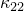；和扭转，的函数。这里下标1和2指截面中的局部正交轴。

如果使用开口截面梁类型，截面行为还必须定义翘曲*双力矩*，*W*，广义应变度量包括翘幅*w*和梁的*双曲率*，，即翘幅沿梁位置的变化梯度：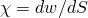。

您选择的截面定义类型决定了梁截面特性是在分析过程中重新计算还是在预处理器中建立并在整个分析期间保持。如果使用通用梁截面定义（见["使用通用梁截面定义截面行为，" 第29.3.7节](pt06ch29s03alm12.md)），横截面特性计算一次，在预处理期间进行。或者，可以使用分析过程中积分的梁截面定义（见["使用分析过程中积分的梁截面定义截面行为，" 第29.3.6节](pt06ch29s03alm11.md)），在这种情况下，Abaqus将在分析进行时通过对横截面上的应力进行数值积分来定义梁的响应。

由于平面梁仅在*X*-*Y*平面内变形，因此在这些单元中只有*N*和，以及和对响应有贡献：、和*w*假定为零。

在Abaqus中，梁截面中的弯矩始终关于梁截面的质心测量，而扭矩相对于剪切中心测量。梁轴线（定义为连接定义梁单元的节点的线）不必穿过梁截面的质心。

梁单元的自由度位于截面中定义的局部坐标系的原点；也就是说，连接单元节点的单元线穿过截面局部坐标系的原点。

#### 确定是使用分析过程中积分的梁截面还是通用梁截面

当使用分析过程中积分的梁截面时（见["使用分析过程中积分的梁截面定义截面行为，" 第29.3.6节](pt06ch29s03alm11.md)），Abaqus在梁变形时对截面进行数值积分，分别评估截面上每个点的材料行为。当截面非线性仅由非线性材料响应引起时，应使用此类梁截面。

当使用通用梁截面时（见["使用通用梁截面定义截面行为，" 第29.3.7节](pt06ch29s03alm12.md)），Abaqus预计算梁横截面量，并在分析过程中根据预计算值执行所有截面计算。此方法结合了梁截面和材料描述的功能（不需要材料定义）。预计算的截面特性可以通过多种方式指定，包括使用二维有限元网格定义的相当复杂的几何（见["网格化梁横截面，" 第10.6.1节](pt04ch10s06at35.md)）。当梁截面响应是线性的，或者当它是非线性的且非线性仅由材料非线性引起时（例如截面坍塌的情况），应使用通用梁截面。

| **输入文件用法：** | 使用以下选项定义分析过程中积分的梁截面： |
| --- | --- |
|  | ``` [*BEAM SECTION](../key/key-link.md#usb-kws-mbeamsection) ``` 使用以下选项定义通用梁截面： ``` [*BEAM GENERAL SECTION](../key/key-link.md#usb-kws-mbeamgensect) ``` |

| **Abaqus/CAE用法：** | 定义分析过程中积分的梁截面： |
| --- | --- |
|  | 属性模块：**Create Section**：选择**Beam**作为截面**Category**和**Beam**作为截面**Type**：**Section integration: During analysis** 定义通用梁截面：属性模块：**Create Section**：选择**Beam**作为截面**Category**和**Beam**作为截面**Type**：**Section integration: Before analysis** |

### 几何截面量

下面描述的截面量需要用于定义通用梁截面的行为。

#### 惯性矩

关于质心的惯性矩定义为


其中（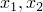）是局部梁截面轴系中点的位置，（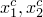）是横截面积质心的位置。

网格化截面轮廓（见["选择梁横截面"中的"网格化横截面"第29.3.2节](pt06ch29s03alm07.md#usb-elm-ebeamsections-meshed)）的弯曲刚度和旋转惯量使用二维横截面模型计算。为整个横截面模型网格（用翘曲单元网格化）定义以下集成属性：

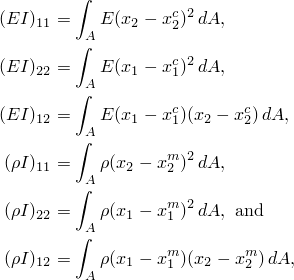

其中（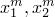）是横截面的质心。

#### 扭转常数

扭转常数*J*取决于横截面的形状。圆截面的扭转常数是极惯性矩，。

矩形和梯形库截面的扭转常数是使用Prandtl应力函数方法由Abaqus数值计算的。为此在内部创建横截面的局部有限元模型。为横截面选择的积分点数量决定了此有限元模型的精度。为提高精度，通过选择非默认积分来指定更高阶规则。

上述规则也适用于薄壁箱截面和任意截面，以增加模型的准确性。如果组成截面的每个段的厚度显著变化，应在厚度变化的区域为箱截面指定更多积分点或为任意截面指定更小的段。

网格化截面的扭转刚度是在用翘曲单元网格化的二维区域上计算的。积分精度取决于模型中的单元数量：

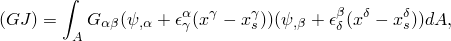

其中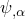表示翘曲函数关于横截面（1、2）轴的导数，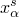是横截面积剪切中心的位置。所有索引取1、2的值。更多详情，请参阅["网格化梁横截面，" Abaqus理论指南第3.5.6节](../stm/stm-link.md#stm-elm-meshedsections)。

对于闭合薄壁截面，扭转常数计算如下

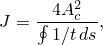

其中*t*是截面厚度，是截面中线所围成的面积，*s*是沿截面周长逆时针测量的中线长度。

对于开口组合薄壁截面，


Abaqus将检查组合截面是闭合还是开口的，并使用适当的扭转常数。

#### 扇性矩和翘曲常数

对于开口薄壁截面，扇性矩定义为


翘曲常数定义为

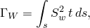

其中是截面上以剪切中心为极点的点的扇性面积。

### Timoshenko梁的旋转惯量

一般来说，扭转模态的旋转惯量与弯曲模态的不同。对于不对称横截面，每个弯曲方向的旋转惯量都不同。对于梁节点不在质心处的横截面，横向和旋转自由度之间存在耦合。

默认情况下，Timoshenko梁使用精确的（各向异性和耦合）旋转惯量。在Abaqus/Standard中，各向异性旋转惯量在几何非线性瞬态直接积分动态模拟期间在Jacobian算子中引入非对称项。如果旋转惯量效应在几何非线性动态响应中显著且使用了精确旋转惯量，则应使用非对称求解器以获得更好的收敛性。

可选地，可以选择近似的各向同性和非耦合旋转惯量。在Abaqus/Standard中，这意味着仅对所有旋转自由度使用与扭转模态相关的旋转惯量；冲击问题中由于各向异性或位移-旋转耦合而可能破坏稳定的旋转惯量效应将不会被引入。在Abaqus/Explicit中，这意味着使用缩放的弯曲惯量，缩放因子选择为最大化稳定单元时间增量的值，用于所有旋转自由度；即稳定时间增量将不由梁的弯曲响应决定。在某些细长梁分析中，各向同性近似旋转惯量可能足够准确。

如果在Abaqus/Explicit中使用梁单元模拟板型结构（即，梁关于一个截面轴的惯性矩大于关于另一个轴的惯性矩的一千倍），精确旋转惯量公式可能导致稳定时间增量急剧减小。在这种情况下，建议您使用各向同性近似，或者考虑使用壳单元建模结构，这可能更适合此类分析。

有关梁横截面旋转惯量的定义，请参阅["Timoshenko梁的质量和惯性，" Abaqus理论指南第3.5.5节](../stm/stm-link.md#stm-elm-timbeaminertia)。

| **输入文件用法：** | 使用以下选项为分析过程中积分的梁截面指定各向同性旋转惯量： |
| --- | --- |
|  | ``` [*BEAM SECTION](../key/key-link.md#usb-kws-mbeamsection), ROTARY INERTIA=ISOTROPIC ``` 使用以下选项为通用梁截面指定各向同性旋转惯量： ``` [*BEAM GENERAL SECTION](../key/key-link.md#usb-kws-mbeamgensect), ROTARY INERTIA=ISOTROPIC ``` |

| **Abaqus/CAE用法：** | Abaqus/CAE不支持梁截面的各向同性旋转惯量。始终使用默认的精确旋转惯量。 |
| --- | --- |

### 为Timoshenko梁的梁截面行为添加惯性

可以为Timoshenko梁（包括PIPE单元）定义附加质量和旋转惯量特性。此在横截面内沿梁单位长度定义的附加惯性对梁的惯性响应有贡献，但不贡献结构刚度。如果使用各向同性旋转惯量，则不能为截面定义附加梁惯性。

要指定附加梁惯性，您可以在局部（1、2）梁横截面轴系中定义以点为中心位置的质量（每单位长度）。要包含旋转惯量（每单位长度），您还可以定义横截面局部（1、2）系统中旋转惯量坐标系第一轴相对于梁横截面轴系中局部1方向的角度位置有例证。

**图29.3.5-1** 具有附加惯性的梁单元。

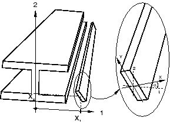

相对于旋转惯量坐标系的旋转惯量分量定义为

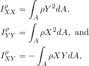

其中*A*是面积，是质量密度，*X*和*Y*是从添加质量贡献中心测量的局部旋转惯量系统坐标。

可以根据需要指定尽可能多的点质量和旋转惯量贡献来定义附加惯性。可以通过为质量比例Rayleigh阻尼系数或复合阻尼系数赋值来指定与附加惯性相关的质量比例阻尼。Abaqus将使用质量加权平均（基于材料阻尼和附加惯性阻尼）进行单元质量比例阻尼。

| **输入文件用法：** | 结合梁截面定义使用以下选项指定附加惯性特性： |
| --- | --- |
|  | ``` [*BEAM ADDED INERTIA](../key/key-link.md#usb-kws-mbeamaddedinertia), ALPHA=, COMPOSITE= *每单位长度质量*, , , , , ,  ``` |

| **Abaqus/CAE用法：** | Abaqus/CAE不支持附加惯性特性。 |
| --- | --- |

### 浸入流体中的附加惯性

当梁完全或部分浸没时，周围流体的效果可以建模为梁上的附加分布惯性（见["入射膨胀波场的载荷，" Abaqus理论指南第6.3.1节](../stm/stm-link.md#stm-ldc-undexloads)）。默认情况下，假定梁完全浸没。可选地，您可以指定附加惯性每单位长度应减半以建模部分浸没梁。

您指定流体质量密度，（每单位体积）；润湿横截面质心的梁局部*x*和*y*坐标；润湿截面有效半径*r*；以及经验拖曳或流量系数，和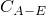。完全浸没梁横截面的附加惯性为每单位长度

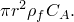

因为梁横截面原点可能与润湿横截面的质心不一致，附加流体惯性可能包括旋转效应。润湿横截面质心的*x*-和*y*-偏量的非零值将在惯性公式中产生旋转-位移耦合。附加惯量的默认模型来自绕圆柱形横截面的无粘性流动（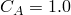）；您可以指定一个系数来模拟不同横截面几何的流动。

浸没梁在其自由端也经历附加的附加质量效应。如果梁单元的端节点未连接到任何其他单元，并且为此单元定义了附加流体惯性，则可能以以下形式添加附加质量：


对于，此附加质量对应于半球形帽的质量；默认值是。可以更改系数以模拟其他几何。如果梁部分浸没，端惯性自动减半。然而，自由端的附加质量始终是各向同性的：轴向和横向运动经历相同的附加惯性。

添加到浸没或部分浸没梁的"虚质量"不包含在数据（`.dat`）文件中报告的总质量、质心、矩和惯性积中。

| **输入文件用法：** | 结合梁截面定义使用以下选项定义完全浸没梁： |
| --- | --- |
|  | ``` [*BEAM FLUID INERTIA](../key/key-link.md#usb-kws-mbeamfluidinertia), FULL , *x*, *y*, *r*, ,  ``` 结合梁截面定义使用以下选项定义部分浸没梁： ``` [*BEAM FLUID INERTIA](../key/key-link.md#usb-kws-mbeamfluidinertia), HALF , *x*, *y*, *r*, ,  ``` |

| **Abaqus/CAE用法：** | 定义完全浸没梁： |
| --- | --- |
|  | 属性模块：梁截面编辑器：**Fluid Inertia**：开启**Specify fluid inertia effects**：**Fully submerged** 定义部分浸没梁：属性模块：梁截面编辑器：**Fluid Inertia**：开启**Specify fluid inertia effects**：**Half submerged** |

#### 附加参考资料

- Blevins, R. D., *Formulas for Natural Frequency and Mode Shape, *R. E. Krieger Publishing Co., Inc., 1987.


